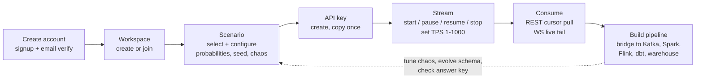
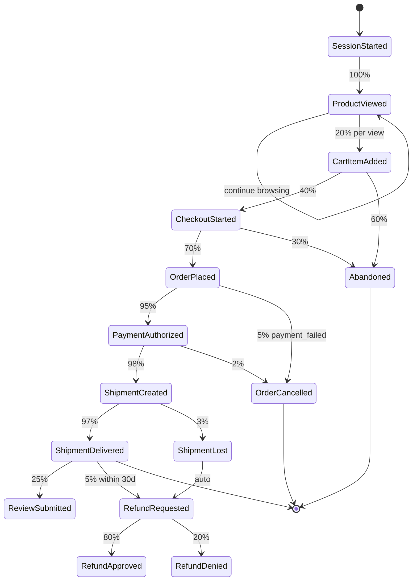

# DataForge — Product Requirements Document

**Deliverable:** D1

This document defines what DataForge is, who it serves, the concrete realism contract its synthetic data must satisfy, the exercise catalog that converts that realism into teachable labs, and the measurable criteria by which the product succeeds. It is the requirements anchor for every downstream spec: architecture documents implement the flows defined here, the engines implement the realism defaults defined here, and the testing strategy verifies the tolerances defined here. Terminology follows the ubiquitous language in [../03-domain/domain-model.md](../03-domain/domain-model.md); phase numbers refer to [../07-plan/incremental-roadmap.md](../07-plan/incremental-roadmap.md).

---

## 1. Vision & positioning

DataForge is **a data engineering playground that behaves like a real company**.

Every existing way to practice data engineering is broken in a specific direction. Fake-data generators (Faker, Mockaroo) emit rows with no relationships, no causality, no time structure — a "payment" can reference an order that never existed, and nothing ever arrives late. Public datasets (NYC Taxi, TPC-H) are static files: no streaming, no CDC, no schema evolution, no operational failure. Real production systems have all of those properties but you cannot practice on them — and a junior engineer has never seen one.

DataForge closes that gap. It is a multi-tenant SaaS platform that simulates a complete business — entities with referential integrity, actors moving through stateful workflows, events arriving on realistic diurnal rhythms — and streams the resulting events to users over standard delivery channels so they can build real pipelines against it with Kafka, Spark, Flink, Airflow, dbt, Iceberg, Trino, Snowflake, BigQuery, and DuckDB.

Three properties differentiate DataForge from everything in the category:

1. **Behavioral realism, not random rows.** Events are emitted by per-actor state machines over shared entity pools ([../04-engines/behavior-engine.md](../04-engines/behavior-engine.md)). A refund without a delivered order is not filtered out — it is structurally impossible to generate (ADR-0007).
2. **Controlled chaos.** Seven configurable failure modes — duplicates, late arrival, missing events, out-of-order delivery, corrupted values, nulls, schema drift — are injected as a deterministic, seeded transform on top of a clean ground-truth stream ([../04-engines/chaos-engine.md](../04-engines/chaos-engine.md)). The mess is reproducible and, crucially, *gradable*.
3. **The instructor answer key.** Because chaos is a transform over a persisted ground-truth ledger, DataForge can tell an instructor exactly which events were duplicated, delayed, or corrupted (ADR-0017). No other tool can grade a deduplication pipeline against known truth.

Positioning statement: *For data engineers and the people training them, DataForge is the synthetic-data platform that simulates a living business — relationships, workflows, failure modes and all — so that pipeline skills learned on it transfer directly to production. Unlike fake-data generators, the data has causality; unlike production, you can break it on purpose and check your answers.*

---

## 2. Personas

Five personas, in priority order. The first three drive the MVP cut; the last two are served by the same surface area with no additional features.

### 2.1 Student (primary)

Learning data engineering in a bootcamp, university course, or self-taught. Has Docker and Python; has never seen a production event stream.

**Jobs to be done:**
- Get a realistic, continuously flowing event stream without building one ("give me something to point Kafka at").
- Practice a named technique (dedup, watermarking, SCD2) against data that actually exhibits the problem.
- Verify their pipeline produced the right answer without an instructor present.

**Day-1 journey:** Signs up with email → verifies → lands in an auto-created personal workspace → picks the E-Commerce scenario with defaults → creates an API key (copies it from the reveal-once dialog) → starts a stream at 10 TPS → watches the live tail in the Monitoring page → runs the documented `curl` cursor loop from the quickstart → pipes events into a local DuckDB table → sees `order_placed` events whose `user_id` matches earlier `user_registered` events. Time budget: under 15 minutes from signup to first consumed event.

### 2.2 Instructor (primary)

Teaches a data engineering course (university, bootcamp, corporate training). Manages 20–60 students per cohort. Today builds brittle CSV fixtures by hand the weekend before each module.

**Jobs to be done:**
- Provision identical, isolated environments for a whole cohort in minutes.
- Configure a stream that exhibits exactly one failure mode at a known rate, as a lab.
- Grade objectively: know precisely which events were injected as chaos so submissions can be scored against ground truth.

**Day-1 journey:** Creates a classroom workspace → invites students by email (member role) → configures an E-Commerce scenario instance with seed `4242` and the "dedup 101" chaos preset → starts a 50 TPS stream → students each issue their own API keys and consume → after the lab, opens the Answer Key panel, exports the injection report (counts + `event_id` lists), and scores submissions against it. The same seed next semester reproduces the identical lab (ADR-0008).

### 2.3 Upskilling data engineer (primary)

Three years into a career of batch SQL jobs; wants streaming, CDC, and lakehouse skills to change roles. Learns nights and weekends; pays for tools that respect their time.

**Jobs to be done:**
- Practice production-shaped problems (consumer lag, late data, schema drift) that batch work never exposed them to.
- Build a portfolio pipeline (Kafka → Flink → Iceberg) against data complex enough to be credible in an interview.
- Ramp difficulty: clean stream first, then turn on one failure mode at a time.

**Day-1 journey:** Signs up → personal workspace → starts a clean 100 TPS stream → follows the connection guide to bridge REST polling into a local single-node Kafka (their first exercise — the bridge itself is the lab, per the consumption model in [../02-architecture/system-architecture.md](../02-architecture/system-architecture.md)) → builds a Spark Structured Streaming job reading the bridged topic → next session, enables 5% duplicates and watches their naive job double-count revenue.

### 2.4 Analytics engineer (secondary)

dbt-first; lives in the warehouse. Wants realistic raw data to practice modeling — staging layers, SCD2 snapshots, incremental models — without waiting for a streaming setup.

**Jobs to be done:**
- Get a bulk historical dataset with realistic time structure (diurnal/weekly shape, lifecycle latencies) loadable into DuckDB/Snowflake/BigQuery today.
- Practice SCD2 and incremental processing against a CDC feed with real before/after images.
- Model a multi-entity schema with genuine referential integrity (facts that join).

**Day-1 journey:** Signs up → personal workspace → instead of starting a stream, requests a **backfill batch**: 30 simulated days of E-Commerce history as JSONL (Phase 4 feature, [phase-04](../07-plan/phases/phase-04-generation-core-batch.md)) → downloads, loads into DuckDB → builds `stg_orders`, `fct_revenue_daily` dbt models → the daily revenue chart shows weekend peaks and a lunchtime bump because the data was generated under the intensity curves in §4.3, not uniformly.

### 2.5 Software engineer (secondary)

Backend engineer moving toward data-intensive systems, or preparing for a role that owns event-driven services. Comfortable with APIs and Docker; weak on data semantics.

**Jobs to be done:**
- Consume a well-documented event API (REST cursor + WebSocket) to learn event-driven consumption patterns.
- Understand event envelopes, idempotency, ordering guarantees, and at-least-once semantics by experiencing them.
- Prototype consumers against realistic event volume before writing one at work.

**Day-1 journey:** Signs up → workspace → API key → reads [../05-interfaces/api-specification.md](../05-interfaces/api-specification.md)-derived public docs → writes a small consumer against the cursor API → deliberately replays a cursor and observes at-least-once duplicates → connects the WebSocket tail and compares semantics → enables out-of-order chaos to test whether their consumer's idempotency actually holds.

---

## 3. Core user flow

The single product loop every persona traverses. All steps are available via both the console UI ([../02-architecture/frontend-architecture.md](../02-architecture/frontend-architecture.md)) and the REST API ([../05-interfaces/api-specification.md](../05-interfaces/api-specification.md)).

| Step | Surface | Spec owner |
|---|---|---|
| Account: signup, email verification, login (JWT), password reset | Console auth pages; `/api/v1/auth/*` | [../06-quality/security-architecture.md](../06-quality/security-architecture.md) |
| Workspace: create, invite members, roles (admin/member) | Console workspace pages; `/api/v1/workspaces` | [../03-domain/domain-model.md](../03-domain/domain-model.md) |
| Scenario: pick from catalog, configure probabilities/seed/chaos, pin manifest version | Console scenario pages; `/api/v1/scenarios` | [../04-engines/scenario-plugin-architecture.md](../04-engines/scenario-plugin-architecture.md) |
| API key: create (shown once), revoke, last-used | Console key page; `/api/v1/workspaces/{id}/api-keys` | [../06-quality/security-architecture.md](../06-quality/security-architecture.md) |
| Stream: start/pause/resume/stop, dynamic TPS, status | Console stream panel; `/api/v1/streams` | [../02-architecture/backend-architecture.md](../02-architecture/backend-architecture.md) |
| Consume: cursor REST pull (replayable, at-least-once), WS tail | `/api/v1/streams/{id}/events`; `/ws/streams/{id}/events` | [../04-engines/delivery-channels.md](../04-engines/delivery-channels.md) |
| Build pipeline: user-side; connection guides for Kafka bridge, Spark, Flink, dbt | Docs + downloadable guides | [../04-engines/delivery-channels.md](../04-engines/delivery-channels.md) |

**Consumption-model boundary (binding, user-confirmed):** in the MVP users pull from hosted DataForge over the internet via cursor-based REST and WebSocket using an API key. DataForge's internal Kafka is invisible server-side infrastructure; **bridging events into the user's own Kafka is itself an exercise**, supported by connection guides. Post-MVP (Phase 12), users gain direct consumption from DataForge-hosted per-workspace Kafka topics (SASL/ACL credentials) and HMAC-signed webhooks; later, S3/Iceberg/CDC export. The full boundary statement lives in [../02-architecture/system-architecture.md](../02-architecture/system-architecture.md) and [../04-engines/delivery-channels.md](../04-engines/delivery-channels.md).

---

## 4. Realism criteria (concrete defaults)

"Realistic" is a testable contract, not an adjective. The values below are the **default parameters of the reference E-Commerce scenario manifest** ([../04-engines/scenarios/ecommerce.md](../04-engines/scenarios/ecommerce.md)). All are workspace-overridable per ADR-0007; the defaults defined here are what a fresh scenario instance uses and what the statistical tests in [../06-quality/testing-strategy.md](../06-quality/testing-strategy.md) verify.

**Acceptance tolerance:** for every configured probability, the realized rate over n = 10,000 completed sessions must fall within ±1 percentage point absolute or ±10% relative, whichever is larger (matches the Phase 8 exit criteria). Lifecycle latency distributions must place their realized median within ±15% of the configured median at n = 10,000 transitions.

### 4.1 Funnel conversion probabilities (defaults)

The shopping funnel, as manifest transition probabilities. Each row is a state-machine transition; non-listed complements (e.g. session abandonment) absorb the remaining probability mass.

| # | Transition | Default probability | Notes |
|---|---|---|---|
| F1 | `session_started` → `product_viewed` | 100% | Every session views ≥ 1 product; views per session ~ Geometric(p=0.25), mean 4 |
| F2 | `product_viewed` → `cart_item_added` | **20%** | Per view; a session may add multiple items |
| F3 | cart non-empty → `checkout_started` | **40%** | Evaluated once per session with ≥ 1 cart item; 60% abandon the cart |
| F4 | `checkout_started` → `order_placed` | **70%** | 30% abandon at checkout |
| F5 | `order_placed` → `payment_authorized` | 95% | 5% emit `payment_failed`; failed orders emit `order_cancelled` |
| F6 | `payment_authorized` → `shipment_created` | 98% | 2% emit `order_cancelled` (inventory/fraud) with refund if captured |
| F7 | `shipment_created` → `shipment_delivered` | 97% | 3% emit `shipment_lost`, which auto-triggers `refund_requested` |
| F8 | `shipment_delivered` → `review_submitted` | **25%** | Review ratings ~ {5★:45%, 4★:30%, 3★:12%, 2★:6%, 1★:7%} |
| F9 | `shipment_delivered` → `refund_requested` | **5%** | Only within the 30-simulated-day return window; structurally gated on delivery (ADR-0007) |
| F10 | `refund_requested` → `refund_approved` | 80% | 20% emit `refund_denied` |

Derived sanity figure: P(cart non-empty) = 1 − (1 − 0.20)^4 ≈ 59% at mean 4 views, so end-to-end session → `order_placed` ≈ 0.59 × 0.40 × 0.70 ≈ **16.5% of sessions place an order**. This is intentionally higher than site-wide retail conversion (~2–3%) because DataForge sessions model engaged shoppers — there is no bounce/crawler traffic diluting the denominator; workspaces wanting site-wide realism lower F2 or shrink mean views per session. The testing strategy asserts the realized order-per-session rate falls in [14%, 19%] at defaults (n = 10,000 sessions).

### 4.2 Entity lifecycle latencies (defaults)

Dwell times between lifecycle transitions, drawn from log-normal distributions parameterized by median and p95. **Clock domain:** all lifecycle latencies are **virtual-clock (simulated) time** — they stamp `occurred_at` and scale with the stream's speed multiplier and backfill mode. Chaos lateness, by contrast, is defined in **wall-clock delivery time** (`emitted_at`); the full clock-domain rules are frozen in [../03-domain/event-model.md](../03-domain/event-model.md) (ADR-0004, ADR-0008).

| # | Lifecycle window | Distribution | Median | p95 | Hard bound |
|---|---|---|---|---|---|
| L1 | `order_placed` → `payment_authorized` / `payment_failed` | log-normal | 45 s | 10 min | 30 min, else `order_cancelled` |
| L2 | `payment_authorized` → `shipment_created` | log-normal | 18 h | 48 h | 72 h |
| L3 | `shipment_created` → `shipment_delivered` | log-normal | 2.5 d | 6 d | 14 d, else `shipment_lost` |
| L4 | `shipment_delivered` → `review_submitted` | log-normal | 3 d | 14 d | 30 d window |
| L5 | `shipment_delivered` → `refund_requested` | log-normal | 4 d | 21 d | 30 d return window |
| L6 | `refund_requested` → `refund_approved` / `refund_denied` | log-normal | 24 h | 72 h | 7 d |
| L7 | in-session: `product_viewed` → next view | log-normal | 20 s | 2 min | session timeout 30 min |
| L8 | in-session: `checkout_started` → `order_placed` | log-normal | 3 min | 12 min | 30 min, else abandoned |

Consequence learners must handle: at the default 1× speed multiplier, an order placed now produces its delivery event ~2.5 simulated days later. Streams run a virtual clock, so a 60× multiplier compresses L3 to ~1 wall-hour, and backfill mode materializes complete lifecycles instantly — this is exactly what makes joins across the funnel a real exercise instead of a toy.

### 4.3 Diurnal & weekly intensity curves (defaults)

Intensity curves modulate the **session arrival rate** (new actor sessions per second); per-session event pacing then follows L7/L8. The stream's `target_tps` is the **daily average**: the engine renormalizes each curve so its mean over a full cycle is exactly 1.0, guaranteeing that changing curve shape never changes average throughput. Curves evaluate against the virtual clock in the scenario instance's configured simulated timezone (default UTC).

**Diurnal multipliers (simulated local hour, defaults; renormalized by the engine):**

| Hours | 00–06 | 06–09 | 09–12 | 12–14 | 14–17 | 17–20 | 20–22 | 22–24 |
|---|---|---|---|---|---|---|---|---|
| Multiplier | 0.30 | 0.70 | 1.00 | 1.25 | 1.00 | 1.55 | 1.80 | 0.80 |

Shape rationale: overnight trough, lunchtime bump, evening peak at 20:00–22:00 — the canonical retail traffic curve. Peak-to-trough ratio is 6.0×, large enough that windowed aggregations visibly differ hour to hour.

**Weekly multipliers (simulated day, defaults; renormalized):**

| Day | Mon | Tue | Wed | Thu | Fri | Sat | Sun |
|---|---|---|---|---|---|---|---|
| Multiplier | 0.90 | 0.90 | 0.95 | 1.00 | 1.10 | 1.20 | 1.00 |

Effective arrival rate = `target_tps × diurnal(hour) × weekly(day)` after renormalization. A 30-simulated-day backfill must visibly show both shapes — that is a Phase 8 exit criterion, verified by the spectral/shape tests defined in [../06-quality/testing-strategy.md](../06-quality/testing-strategy.md).

### 4.4 Structural realism invariants (non-statistical)

These are absolute, not probabilistic, and hold on the canonical (pre-chaos) stream at any volume:

| Invariant | Enforcement |
|---|---|
| No event references a nonexistent entity (payment → order, review → delivered shipment, etc.) | Structurally impossible: precondition-guarded transitions over entity pools (ADR-0007) |
| No refund without a delivered order or lost shipment | Manifest precondition gate |
| Inventory never negative; `inventory_adjusted` CDC events reconcile to order quantities | Entity-pool mutation rules ([../04-engines/behavior-engine.md](../04-engines/behavior-engine.md)) |
| CDC stream consistent with business stream: no `u`/`d` before `c`, before/after images accurate | State-first generation (ADR-0012) |
| Same manifest version + seed + config ⇒ byte-identical canonical sequence | Deterministic seeding (ADR-0008) |

Chaos deliberately violates *delivery-level* expectations (duplicates, gaps, disorder, corruption) but never these *business-truth* invariants — the corruption happens after the ground-truth ledger (ADR-0009).

---

## 5. Exercise catalog

Each exercise is a documented lab built from a scenario configuration plus chaos/feature flags, shipped as a selectable **preset** in the console (Phase 9 for chaos presets; earlier presets noted per row). Every chaos-based exercise is gradable via the Answer Key API (ADR-0017): instructors query exactly which `event_id`s were injected, duplicated, delayed, or mutated; ground truth never leaks into delivered payloads.

| # | Exercise | Primary personas | Target technologies | Chaos / feature flags | Available |
|---|---|---|---|---|---|
| E1 | Dedup 101 | Student, SWE | Kafka, Spark, Flink, SQL window dedup | `chaos.duplicates{rate: 0.05}` | Phase 9 |
| E2 | Late data & watermarks | Upskilling DE | Flink, Spark Structured Streaming | `chaos.late_arriving{delay: lognormal(median=30min wall), rate: 0.03}` | Phase 9 |
| E3 | Out-of-order handling | Upskilling DE, SWE | Flink event-time, Kafka | `chaos.out_of_order{window: 60s, rate: 0.10}` | Phase 9 |
| E4 | SCD2 via CDC | Analytics engineer | dbt snapshots, warehouse MERGE | `cdc.enabled: [users, products, inventory]`; address-change mutation rate 0.5%/actor/day | Phase 8 (exercise doc Phase 10) |
| E5 | Schema-drift day | Upskilling DE | Spark, schema registry clients | `chaos.schema_drift{from_version: next-registered}` + registry v2 | Phase 9 (full v2/v3 Phase 10) |
| E6 | DLQ handling | Student, SWE | Kafka DLQ topics, consumer error paths | `chaos.corrupted_values{rate: 0.02}` + `chaos.nulls{rate: 0.02}` | Phase 9 |
| E7 | Backfill + dbt batch modeling | Analytics engineer, Student | DuckDB, dbt, Snowflake, BigQuery | `backfill{days: 30}`; intensity curves on | Phase 4 (curves/full funnel Phase 8) |
| E8 | Kafka consumer-group lab | Upskilling DE, SWE | Kafka consumer groups, partitioning, rebalancing | none required; optional `chaos.duplicates{rate: 0.02}` | MVP via bridge guide; hosted topics Phase 12 |

Exercise details and answer-key notes:

- **E1 — Dedup 101.** Consume a 50k-event stream with 5% injected duplicates; produce the deduplicated set keyed on `event_id`. *Answer key:* exact duplicate count and the list of duplicated `event_id`s; a correct submission's row count equals canonical count, verifiable to the event. Statistical guarantee: configured 5% realizes at 5% ± 1% over 50k events (Phase 9 exit criterion).
- **E2 — Late data & watermarks.** Build a tumbling-window revenue aggregation with watermarks while ~3% of events arrive ~30 wall-clock minutes late (late events keep their original `occurred_at`; only `emitted_at` shifts — the teachable distinction). *Answer key:* per-event configured delay and the canonical per-window totals, so "with vs without watermark" results are checkable numbers.
- **E3 — Out-of-order handling.** Events within a 60s window are locally shuffled at 10% rate; learners restore event-time order using `occurred_at` + `sequence_no`. *Answer key:* canonical sequence numbers; a correct re-sort is byte-comparable.
- **E4 — SCD2 via CDC.** Consume the Debezium-shaped CDC feed (`op`, `before`, `after` per ADR-0012) for `users` while addresses mutate; build a dbt snapshot producing type-2 dimension rows. *Answer key:* the ground-truth mutation log per entity (every address version with its validity interval) — expected SCD2 table derivable exactly.
- **E5 — Schema-drift day.** Mid-exercise, payloads start carrying fields from the registered next schema version (drift injects only registered next-version fields, ADR-0010); pipelines must detect and adapt using the registry API ([../04-engines/schema-registry.md](../04-engines/schema-registry.md)). *Answer key:* drift start time, affected event types, injected field list, count of v-next events.
- **E6 — DLQ handling.** ~4% of events carry corrupted values (`amount: "abc"`) or unexpected nulls; learners route failures to a dead-letter path and reprocess. *Answer key:* exact corrupted/nulled `event_id`s with field-level mutation records — DLQ contents are checkable to the event.
- **E7 — Backfill + dbt batch modeling.** Generate 30 simulated days (~1–5M events at defaults) as downloadable JSONL; load into DuckDB/warehouse; build staging + fact models; the daily-revenue model must reproduce §4.3's weekly shape. *Answer key:* canonical aggregates (orders/day, revenue/day, conversion rates) computed from the ground-truth ledger, exposed to workspace admins.
- **E8 — Kafka consumer-group lab.** MVP form: bridge the REST cursor feed into the learner's own Kafka using the connection guide, then practice consumer groups, partition assignment, and rebalancing on their broker. Phase 12 form: consume DataForge-hosted per-workspace topics with SASL credentials directly. *Answer key:* per-partition canonical counts to validate that group consumption is complete and non-overlapping.

Preset definitions (flag bundles, default rates, expected-output templates) are catalogued in [../04-engines/chaos-engine.md](../04-engines/chaos-engine.md); grading endpoints in [../05-interfaces/api-specification.md](../05-interfaces/api-specification.md).

---

## 6. Feature inventory: MVP vs post-MVP

The cut rule (binding, see [../07-plan/mvp-vs-future.md](../07-plan/mvp-vs-future.md)): **every one-way-door seam ships in the MVP; everything that is "another instance through an existing seam" is deferred.** MVP = Phases 0–11 (GA tag at Phase 11). Phase docs: [../07-plan/phases/](../07-plan/phases/README.md).

| Feature | Phase | MVP? | Owning spec |
|---|---|---|---|
| Auth (JWT console, email verify, password reset), workspaces, roles, audit log | 2 | MVP | [../06-quality/security-architecture.md](../06-quality/security-architecture.md) |
| API keys (hashed, shown-once, revocable, Redis revocation) | 2 | MVP | [../06-quality/security-architecture.md](../06-quality/security-architecture.md) |
| Tenancy isolation: scoped managers + CI guard + Postgres RLS | 2 | MVP | [../06-quality/security-architecture.md](../06-quality/security-architecture.md) |
| Manifest contract + validator; scenario catalog APIs; version pinning | 3 | MVP | [../04-engines/scenario-plugin-architecture.md](../04-engines/scenario-plugin-architecture.md) |
| Schema registry (subjects, versions, additive compat) | 3 | MVP | [../04-engines/schema-registry.md](../04-engines/schema-registry.md) |
| Canonical event envelope incl. CDC shape (frozen Phase 0) | 3 | MVP | [../03-domain/event-model.md](../03-domain/event-model.md) |
| Behavior engine: state machines, entity pools, determinism | 4 | MVP | [../04-engines/behavior-engine.md](../04-engines/behavior-engine.md) |
| Ground-truth ledger; batch generation + JSONL download | 4 | MVP | [../04-engines/behavior-engine.md](../04-engines/behavior-engine.md) |
| Streaming runtime: runners, internal Kafka backbone, REST cursor consumption | 5 | MVP | [../02-architecture/system-architecture.md](../02-architecture/system-architecture.md) |
| Pause/resume with checkpoints, dynamic TPS (1–1,000), WebSocket tail, stream stats | 6 | MVP | [../04-engines/delivery-channels.md](../04-engines/delivery-channels.md) |
| Console MVP (all 7 page groups) | 7 | MVP | [../02-architecture/frontend-architecture.md](../02-architecture/frontend-architecture.md) |
| Full 8-entity e-commerce, ~20 event types, CDC emission, intensity curves, virtual clock, backfill | 8 | MVP | [../04-engines/scenarios/ecommerce.md](../04-engines/scenarios/ecommerce.md) |
| Chaos engine: all 7 modes, runtime toggles, presets; instructor answer key | 9 | MVP | [../04-engines/chaos-engine.md](../04-engines/chaos-engine.md) |
| Schema evolution: v2/v3, mid-stream upgrade, registry browser UI | 10 | MVP | [../04-engines/schema-registry.md](../04-engines/schema-registry.md) |
| Runner sharding, quotas, observability, prod Fly.io GA | 11 | MVP (GA) | [../02-architecture/scaling-strategy.md](../02-architecture/scaling-strategy.md) |
| Hosted per-workspace Kafka topics (SASL/ACL); HMAC webhooks | 12 | Post-MVP | [../04-engines/delivery-channels.md](../04-engines/delivery-channels.md) |
| S3/Iceberg/CDC export to user storage | Post-12 | Post-MVP (contract specced now) | [../04-engines/delivery-channels.md](../04-engines/delivery-channels.md) |
| Additional scenarios (SaaS, rideshare, IoT, FinTech, …) | Post-12 | Post-MVP (seam ships in MVP) | [../04-engines/scenario-plugin-architecture.md](../04-engines/scenario-plugin-architecture.md) |
| AI-generated scenario manifests from a prompt | Post-12 | Post-MVP (validation contract ships in MVP) | [../04-engines/scenario-plugin-architecture.md](../04-engines/scenario-plugin-architecture.md) |
| 100k TPS substrate scaling; managed Kafka migration | Post-12 / trigger-based | Post-MVP | [../02-architecture/scaling-strategy.md](../02-architecture/scaling-strategy.md) |

---

## 7. Plan & quota tiers

Quota *enforcement* lands in Phase 11 (events/day metering, idle auto-pause, per-key rate limits); the tier values below are decided now so the schema ([../03-domain/database-schema.md](../03-domain/database-schema.md) `quotas` table) and pricing surface are designed against real numbers. **Refined in Phase 11:** billing integration and self-serve plan changes; what exists until then is a single implicit Free-tier quota row per workspace with these limits enforced.

| Quota | Free | Classroom | Pro |
|---|---|---|---|
| Price posture | $0 | Per-cohort license | Per-seat subscription |
| Workspace members | 3 | 60 (1 instructor-admin + students) | 10 |
| Concurrent running streams / workspace | 2 | 20 | 10 |
| Per-stream TPS cap | 50 | 100 | 1,000 |
| Aggregate workspace TPS cap | 100 | 1,000 | 2,000 |
| Events / day / workspace | 1,000,000 | 10,000,000 | 50,000,000 |
| Event buffer retention (REST replay window) | 24 h | 48 h | 48 h |
| Backfill: max simulated days / max events per batch | 7 d / 1M | 30 d / 5M | 90 d / 20M |
| Chaos engine + presets | Yes | Yes | Yes |
| Answer Key API (workspace admins) | Yes | Yes | Yes |
| Idle auto-pause (no consumption on any channel) | 2 h | 8 h | 24 h |
| API keys per workspace | 5 | 100 | 25 |
| Hosted Kafka topics / webhooks (Phase 12) | No | Add-on | Yes |

Behavioral contracts: quota exhaustion **pauses** streams gracefully (never deletes data) with an explicit stream status (`paused_quota`) surfaced in API and UI — a Phase 11 exit criterion. Idle auto-pause emits an audit event and is resumable with one click/call. Retention is implemented as buffer partition TTL (ADR-0013); a cursor older than retention gets the explicit `cursor-expired` problem-details error, documented as a teaching moment in [../05-interfaces/api-specification.md](../05-interfaces/api-specification.md). The 5k-TPS platform load-test floor at GA (Phase 11) comfortably covers ~2 maxed Pro workspaces plus long-tail free traffic; the staircase beyond is [../02-architecture/scaling-strategy.md](../02-architecture/scaling-strategy.md)'s arithmetic.

---

## 8. Success metrics

Metrics are computed from the audit log, stream stats counters, and consumption records already required by the architecture — no separate analytics pipeline in MVP. The metric event catalog lives in [../02-architecture/observability.md](../02-architecture/observability.md).

| Metric | Definition (precise) | Target at GA + 90 days |
|---|---|---|
| **Activation rate** (north star) | % of verified accounts that consume ≥ 1 event (REST events response with ≥ 1 event, or ≥ 1 WS frame delivered) within 24 h of signup | ≥ 50% |
| Time-to-first-event | Median minutes, signup → first consumed event | ≤ 15 min |
| **Weekly active streams** | Count of streams with ≥ 1 authenticated consumption call in a 7-day window (running ≠ active; consumption is what counts) | 200 |
| Weekly active workspaces | Workspaces with ≥ 1 active stream | 80 |
| **Exercise completion rate** | % of preset-launched streams whose workspace queries the corresponding answer-key endpoint within 7 days (proxy: the lab was finished and checked) | ≥ 30% |
| Classroom adoption | Workspaces with ≥ 5 members and ≥ 1 instructor-configured preset stream | 10 cohorts |
| Bridge depth | % of activated workspaces that download a connection guide or sustain a cursor-poll cadence ≥ 1 req/10s for 10+ min (pipeline-building signal) | ≥ 25% |
| 4-week retention | % of activated workspaces with ≥ 1 active stream in week 4 after activation | ≥ 35% |
| Realism trust (counter-metric) | Referential-integrity violations observed on canonical streams in production | 0, ever |

Guardrail: chaos features must never depress activation — first-run defaults are chaos-off; chaos is opt-in per stream.

---

## 9. NFR summary

Each non-functional requirement has exactly one owning spec; this table is the routing layer. Where the MVP cannot honestly meet the stated target, the owning spec says so and defines the upgrade path (binding honesty rule from the design review).

| NFR | Requirement (concrete) | Owning spec |
|---|---|---|
| Multi-tenant isolation | No cross-workspace data access, ever; breach requires ≥ 2 simultaneous control failures (scoped managers + CI guard + RLS); permanent cross-tenant attack suite in CI | [../06-quality/security-architecture.md](../06-quality/security-architecture.md) |
| Horizontal scalability | 1 → 100,000 TPS staircase with capacity arithmetic per rung; ≥ 5k aggregate TPS demonstrated at GA | [../02-architecture/scaling-strategy.md](../02-architecture/scaling-strategy.md) |
| Availability | 99.9% framed as post-GA roadmap with explicit SLO definitions (control plane vs data plane vs WS) and error budget; single-region MVP posture stated honestly | [../02-architecture/deployment-architecture.md](../02-architecture/deployment-architecture.md), SLOs in [../02-architecture/observability.md](../02-architecture/observability.md) |
| Stateless API layer | All web/WS processes horizontally replicable; stream state in Redis/Postgres/Kafka only | [../02-architecture/backend-architecture.md](../02-architecture/backend-architecture.md) |
| Extensibility (plugin architecture) | New scenarios as validated declarative manifests, zero core change; AI-manifest safety (resource bounds, probability sums, reachability, threat model) | [../04-engines/scenario-plugin-architecture.md](../04-engines/scenario-plugin-architecture.md) |
| Determinism & reproducibility | Manifest version + seed + config ⇒ identical sequence incl. chaos injections; golden-seed replay in CI | [../04-engines/behavior-engine.md](../04-engines/behavior-engine.md), tests in [../06-quality/testing-strategy.md](../06-quality/testing-strategy.md) |
| Data correctness | Structural invariants of §4.4 hold at any volume; statistical defaults of §4.1–4.3 hold within stated tolerances | [../06-quality/testing-strategy.md](../06-quality/testing-strategy.md) |
| Observability | Structured logs with workspace/stream context, metrics catalog, health/readiness, audit trail, OTel adoption path | [../02-architecture/observability.md](../02-architecture/observability.md) |
| Security & auth | JWT/API-key duality, key lifecycle, account lifecycle, signup abuse controls, untrusted-manifest threat model, secrets handling | [../06-quality/security-architecture.md](../06-quality/security-architecture.md) |
| API contract stability | `/api/v1` URL versioning, cursor pagination, RFC 9457 errors, OpenAPI as CI artifact, additive-only envelope evolution | [../05-interfaces/api-specification.md](../05-interfaces/api-specification.md) |
| Cost & retention | Buffer TTL 24–48 h via partition drop; ledger retention/backup jobs; quota-bounded free-tier compute | [../03-domain/database-schema.md](../03-domain/database-schema.md), ops in [../02-architecture/deployment-architecture.md](../02-architecture/deployment-architecture.md) |
| Deployability | Single-command dev stack (Docker Compose, all services healthy); Fly.io process-group production topology with pre-committed managed-Kafka trigger | [../02-architecture/deployment-architecture.md](../02-architecture/deployment-architecture.md) |
| Testability | Per-phase CI gates: unit, property/invariant, statistical-tolerance, golden-seed, cross-tenant attack, cross-channel contract, soak | [../06-quality/testing-strategy.md](../06-quality/testing-strategy.md) |
