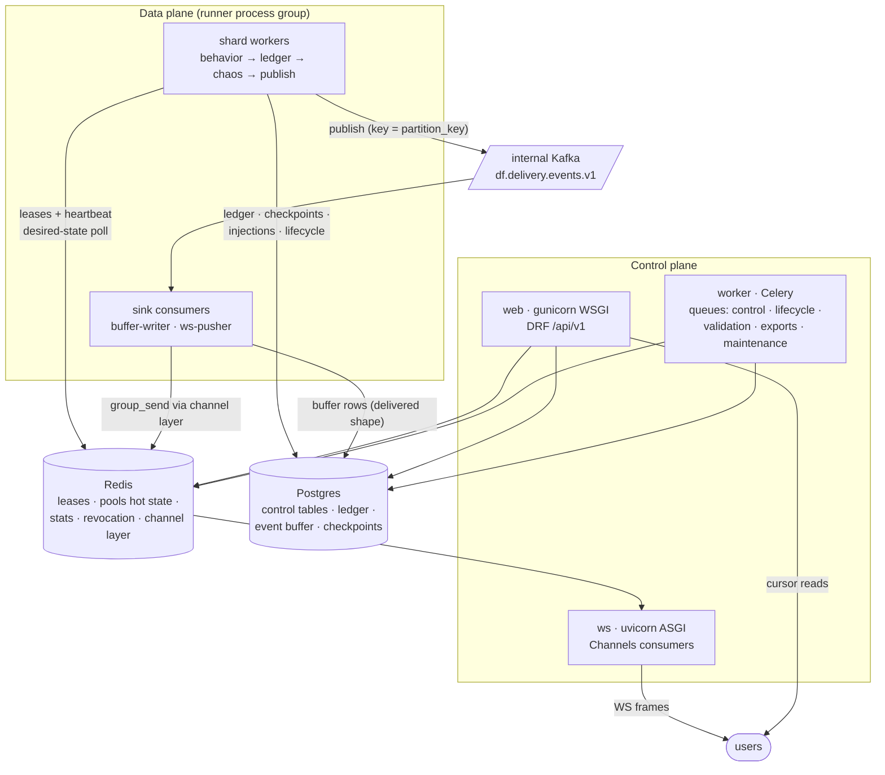
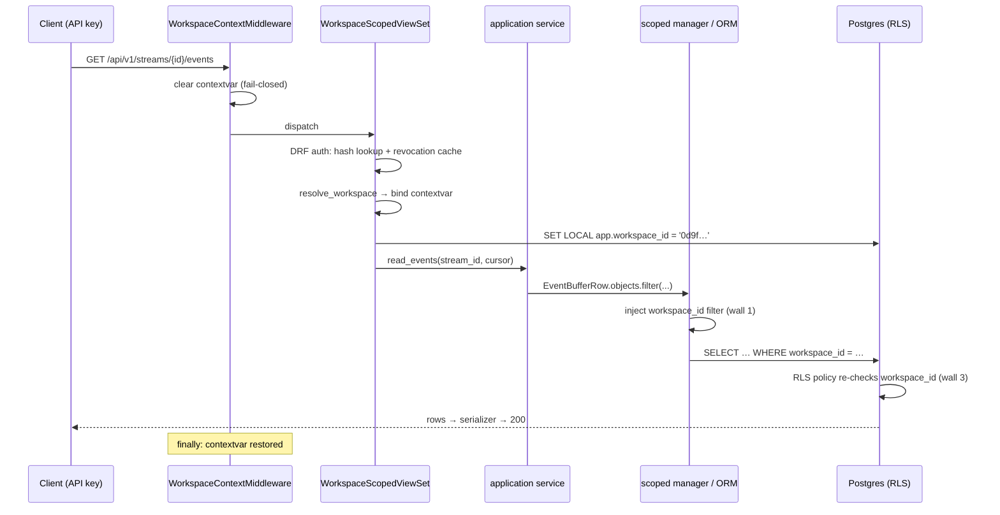

# DataForge — Backend Architecture

**Deliverable:** D12

This document defines how the DataForge backend is built: the Django project layout that realizes the bounded contexts of [../03-domain/domain-model.md](../03-domain/domain-model.md) one-to-one, the framework-free engine packages that keep generation logic out of Django, the clean-layering rules and their CI enforcement, the request lifecycle that makes tenant isolation a structural property of every request, the Celery control-plane topology, the runner process that is the data plane (ADR-0006), the internal Kafka topology and lease-fencing design deferred here by [../03-domain/event-model.md](../03-domain/event-model.md) §9 and domain-model §7, the Channels ASGI process group, the settings strategy, and the decided contract for control-plane Kafka writes. System-level container boundaries live in [system-architecture.md](system-architecture.md); deployment shape in [deployment-architecture.md](deployment-architecture.md); capacity arithmetic in [scaling-strategy.md](scaling-strategy.md); ADRs are indexed in [../adr/README.md](../adr/README.md).

---

## 1. Runtime topology: four process groups, two planes

One Docker image, four process groups (ADR-0015), two planes (ADR-0006). Every process boots the same Django settings tree (§11); what differs is the entrypoint command.

| Process group | Entrypoint | Plane | Does | Never does |
|---|---|---|---|---|
| `web` | `gunicorn config.wsgi` (sync workers, 4 × 2 threads per machine) | control | REST `/api/v1` via DRF; auth; catalog/registry/stream commands; cursor reads from the event buffer | generation, Kafka consumption, WebSocket |
| `ws` | `uvicorn config.asgi` (Channels) | control edge of delivery | WebSocket live tail: connection auth, group fan-out to clients | generation, direct Kafka access (the bridge is a sink, §8.6) |
| `worker` | `python -m runner.supervisor worker` → `celery -A config worker -Q …` (+ beat under a Redis singleton lock, §7.4) | control | lifecycle supervision, manifest L3 validation, exports, maintenance | **event generation — structurally impossible: no generation task exists** (ADR-0006) |
| `runner` | `python -m runner` | data | generation shard runners + delivery sink consumers (buffer-writer, ws-pusher) | serving HTTP to users (only `/healthz`/`/readyz` on an internal port) |



State lives only in Postgres, Redis, and Kafka. `web` and `ws` processes hold no cross-request state beyond immutable per-process caches (compiled ManifestIR, §4; OpenAPI schema), so every group is horizontally replicable — the stateless-API NFR (PRD §9) is owned and discharged here.

---

## 2. Repository and Django project layout

### 2.1 `backend/` tree

The monorepo root layout is owned by [../07-plan/project-folder-structure.md](../07-plan/project-folder-structure.md); the shape of `backend/` is fixed here:

```
backend/
  config/                     # the Django project (no business code)
    settings/
      base.py  dev.py  prod.py  test.py
    urls.py                   # mounts /api/v1 routers per app
    wsgi.py  asgi.py
    celery.py                 # Celery app, queue/routing config (§7)
  dataforge_engine/           # framework-free engine packages (§4) — NO Django imports
    envelope/  manifest/  behavior/  chaos/  seeds/
    ports.py  pipeline.py
  runner/                     # data-plane entrypoint (§8) — a process, not a Django app
    __main__.py  supervisor.py  shard_worker.py  sinks/  leases.py  adapters/
  identity/                   # Django apps, one per bounded context (§2.2)
  tenancy/
  catalog/
    builtin/ecommerce/1.0.0.yaml   # builtin manifests as data (plugin-architecture §10.2)
  registry/
  streams/
  generation/
  chaos/
  delivery/
  observation/
  audit/
  manage.py
  pyproject.toml              # ruff, mypy, pytest, import-linter contracts (§3.2)
```

Each Django app has the same internal skeleton (layers per §3): `api/` (viewsets, serializers, urls), `tasks/` (Celery task entrypoints, control-plane apps only), `application/` (services), `domain/` (models, managers, value objects), `infra/` (Redis/Kafka/email adapters, engine-port implementations), `migrations/`, `apps.py`.

### 2.2 Bounded context ↔ Django app map

App names are fixed by domain-model §1.3 and repeated here verbatim — they are import paths and CI-contract identifiers. (Earlier planning materials used working names `accounts`/`workspaces`/`apikeys`/`scenarios`/`monitoring`; those are superseded: API keys are part of the **Tenancy** context and live in `tenancy`, and the monitoring surface is the `observation` app.)

| App | Context | `api/` | `tasks/` | Key models (`db_table` names owned by [../03-domain/database-schema.md](../03-domain/database-schema.md)) | Engine ports implemented in `infra/` |
|---|---|---|---|---|---|
| `identity` | Identity | yes | yes (email sends) | User (custom `AUTH_USER_MODEL`), verification/reset tokens | — |
| `tenancy` | Tenancy | yes | yes (deletion cascades) | Workspace, Membership, ApiKey, QuotaPolicy | — (revocation cache helper used by auth) |
| `catalog` | Scenario Catalog | yes | yes (L3 dry-run job) | Scenario, ManifestVersion, ScenarioInstance | — |
| `registry` | Schema Registry | yes | no | Subject, SchemaVersion | — |
| `streams` | Stream Control | yes | yes (lifecycle watchdogs) | Stream, Shard, desired-state document | — |
| `generation` | Generation | yes (batch/backfill endpoints) | yes (large batch jobs) | Ground-truth ledger partitions, entity-pool snapshots, Checkpoint | `PoolStore` (Redis), `LedgerSink`, `CheckpointStore` |
| `chaos` | Chaos | yes (answer-key endpoints) | no | InjectionRecord, LateArrivalBuffer | `InjectionSink`, `LateBufferStore` |
| `delivery` | Delivery | yes (`/streams/{id}/events` cursor) | no | EventBuffer partitions, SinkBinding | `EventPublisher` (Kafka producer); sink consumers (§8.6) |
| `observation` | Observation | yes (stats, `/healthz`, `/readyz`) | yes (idle-detection signal) | — (Redis-resident StreamStats) | `StatsEmitter` (Redis) |
| `audit` | Audit | yes (admin query) | no | AuditEntry | — |

Rules:

- **BE-APP-1** — Every concrete model sets `Meta.db_table` explicitly to the table name specified in [../03-domain/database-schema.md](../03-domain/database-schema.md); Django's default `<app>_<model>` naming is never used.
- **BE-APP-2** — No app named after a scenario ever exists; scenario content is manifest data under `catalog/builtin/` (ADR-0003, plugin-architecture P-1).
- **BE-APP-3** — `INSTALLED_APPS` ordering is fixed: Django/3rd-party, then the ten apps in the table's order (`identity` first — it owns `AUTH_USER_MODEL`).

---

## 3. Layering inside an app

### 3.1 The four layers

Call flow is **api → application(services) → domain**, with **infra** as the adapter boundary the application layer drives. Responsibilities:

| Layer | Contains | May do | Must not do |
|---|---|---|---|
| `api/` (+ `tasks/`) | DRF viewsets, serializers, routers; Celery task functions | Deserialize/validate input via serializers; call one application service per mutation; serialize output. Plain `list`/`retrieve` reads may use scoped managers directly. | Business logic; hand-built response dicts; ORM writes; Kafka/Redis access |
| `application/` | Use-case services (`services.py`), command objects | Own the transaction boundary (`transaction.atomic`); orchestrate domain models + infra adapters; emit audit entries in the same transaction (INV-AUD-2); enforce quotas (INV-TEN-5) | Import DRF; build HTTP responses; depend on request objects |
| `domain/` | Models, scoped managers, value objects, lifecycle rules (e.g. the stream transition catalog of domain-model §4.3) | Pure model logic, invariant checks, state-machine guards | I/O beyond the ORM: no Redis, Kafka, HTTP, email, Celery |
| `infra/` | Adapters: Redis clients, Kafka producer, email gateway, engine-port implementations | Import `domain` models and `dataforge_engine` ports; talk to the outside world | Import `application` or `api`; contain business rules |

Celery task functions live in `tasks/`, not `infra/`, because a task is a transport entrypoint exactly like an HTTP view: thin, deserializes args, calls a service. This keeps "everything that enters the app goes through `application`" true for both transports.

### 3.2 Import-direction enforcement (import-linter, CI-blocking from Phase 1)

The import order differs from the call order in exactly one place: **`infra` sits between `application` and `domain`**, because adapters must import domain models (e.g. `PostgresCheckpointStore` imports the `Checkpoint` model) while the domain must import no adapter — the standard dependency-inversion fold of clean layering. Enforced in `pyproject.toml`:

```toml
[tool.importlinter]
root_packages = [
  "identity", "tenancy", "catalog", "registry", "streams",
  "generation", "chaos", "delivery", "observation", "audit",
  "dataforge_engine", "runner", "config",
]

# 1. Layering inside every app: api/tasks → application → infra → domain
[[tool.importlinter.contracts]]
name = "App layering"
type = "layers"
containers = [
  "identity", "tenancy", "catalog", "registry", "streams",
  "generation", "chaos", "delivery", "observation", "audit",
]
layers = ["api : tasks", "application", "infra", "domain"]
exhaustive = false   # migrations/, apps.py sit outside the contract

# 2. The engine is framework-free (§4.3)
[[tool.importlinter.contracts]]
name = "dataforge_engine purity"
type = "forbidden"
source_modules = ["dataforge_engine"]
forbidden_modules = [
  "django", "rest_framework", "celery", "channels", "redis",
  "confluent_kafka", "psycopg",
  "identity", "tenancy", "catalog", "registry", "streams",
  "generation", "chaos", "delivery", "observation", "audit",
  "config", "runner",
]

# 3. Cross-app access only through application/ and domain/
#    (one generated contract per app pair; generator script in infra/ci/)
[[tool.importlinter.contracts]]
name = "No cross-app infra/api imports (streams example)"
type = "forbidden"
source_modules = ["identity", "tenancy", "catalog", "registry",
  "generation", "chaos", "delivery", "observation", "audit"]
forbidden_modules = ["streams.infra", "streams.api"]
```

`lint-imports` runs in the backend CI job from Phase 1; any violation fails the build (same severity as ruff/mypy).

### 3.3 Cross-app rules

- **BE-X-1** — An app may import another app's `application` services and `domain` models (FKs, read access through scoped managers). It may never import another app's `infra` or `api` (contract 3 above).
- **BE-X-2** — Cross-context writes go through the owning app's application service, never by mutating a foreign model directly — e.g. stopping streams during workspace deletion (INV-TEN-6) calls `streams.application.services.stop_all_for_workspace(...)`, not `Stream.objects.update(...)` from `tenancy`.
- **BE-X-3** — The published-language contracts between contexts (envelope, manifest, schema_ref — domain-model §1.2) cross app boundaries only as `dataforge_engine` types or primitive values, never as one app's model instances handed to another plane.

---

## 4. Framework-free engine packages: `dataforge_engine`

The behavior engine, chaos engine, and envelope contract are pure-Python packages with **zero Django imports** (contract 2, §3.2). They run identically in three hosts: the runner (production), the Celery L3 dry-run worker (validation, plugin-architecture §8.4), and plain pytest (golden-seed replay, [../06-quality/testing-strategy.md](../06-quality/testing-strategy.md)) — which is precisely why determinism (INV-G-4) is testable without infrastructure.

### 4.1 Package map

| Package | Contents | Spec owner of semantics |
|---|---|---|
| `dataforge_engine.envelope` | `InternalEnvelope` frozen dataclass (the 20 fields + `_df`); canonical serializer (event-model S-2); deterministic UUIDv7 (event-model §2.2.1); `strip_internal(envelope)` — the single shared strip function (event-model SB-2); partition-key derivation (PK-1/2/3) | [../03-domain/event-model.md](../03-domain/event-model.md) |
| `dataforge_engine.manifest` | Hardened parse, Layer-1 JSON Schema + Layer-2 semantic validation (MAN-S*/V*), `ManifestIR` compiler, overlay merge + re-validation | [../04-engines/scenario-plugin-architecture.md](../04-engines/scenario-plugin-architecture.md) |
| `dataforge_engine.behavior` | State-machine interpreter, entity pools (over `PoolStore`), arrival process + intensity curves, virtual clock, dwell timers, checkpoint codec (versioned, serializable state of domain-model §2.6) | [../04-engines/behavior-engine.md](../04-engines/behavior-engine.md) |
| `dataforge_engine.chaos` | Stage framework in the normative order (domain-model §2.7 StageOrder), the 7 mode implementations, injection planning, late-arrival schedule computation | [../04-engines/chaos-engine.md](../04-engines/chaos-engine.md) |
| `dataforge_engine.seeds` | `derive_subseed(seed, namespace)` = `HMAC(seed, namespace)` for `values`/`transitions`/`pools`/`chaos`; namespaced PRNG streams (ADR-0008) | [../04-engines/behavior-engine.md](../04-engines/behavior-engine.md) |
| `dataforge_engine.ports` | The `Protocol` interfaces of §4.2 | this document |
| `dataforge_engine.pipeline` | `ShardPipeline`: wires behavior → ledger → chaos → publish for one shard tick, purely against ports (ADR-0009 stage order as code) | this document + [../04-engines/chaos-engine.md](../04-engines/chaos-engine.md) |

### 4.2 Ports (implemented in app `infra/` layers, wired by the runner)

```python
# dataforge_engine/ports.py — all typing.Protocol, no implementations
class LedgerSink(Protocol):
    def append(self, batch: Sequence[InternalEnvelope]) -> None: ...
        # MUST be durable before returning (INV-GEN-5); idempotent on
        # (stream_id, shard_id, sequence_no)

class EventPublisher(Protocol):
    def publish(self, batch: Sequence[InternalEnvelope]) -> None: ...
        # internal envelope, key = partition_key; at-least-once

class CheckpointStore(Protocol):
    def load(self, stream_id: UUID, shard_id: int) -> bytes | None: ...
    def save(self, stream_id: UUID, shard_id: int,
             state: bytes, fencing_token: int) -> None: ...
        # MUST reject writes whose fencing_token < stored token (§8.2)

class PoolStore(Protocol):           # Redis hot state / in-memory for dry-run
    ...                              # get/put/mutate/index — behavior-engine.md owns ops

class InjectionSink(Protocol):
    def record(self, injections: Sequence[Injection]) -> None: ...
        # durable BEFORE the affected events publish (INV-CHA-4)

class LateBufferStore(Protocol):
    def schedule(self, entries: Sequence[LateEntry]) -> None: ...
    def take_due(self, stream_id: UUID, shard_id: int,
                 now: datetime, limit: int) -> list[InternalEnvelope]: ...
    def apply_stop_policy(self, stream_id: UUID, policy: str) -> None: ...

class StatsEmitter(Protocol):
    def incr(self, stream_id: UUID, by_type: Mapping[str, int],
             emitted: int, last_event_at: datetime) -> None: ...
```

Production adapters: `generation.infra.PostgresLedgerSink` / `PostgresCheckpointStore` / `RedisPoolStore`, `chaos.infra.PostgresInjectionSink` / `PostgresLateBufferStore`, `delivery.infra.KafkaEventPublisher`, `observation.infra.RedisStatsEmitter`. The L3 dry run wires all-in-memory adapters (`CollectingPublisher`, `InMemoryPoolStore`, …) — same engine, no infrastructure, 30 s budget.

### 4.3 Purity rules

- **BE-ENG-1** — `dataforge_engine` imports only stdlib plus `jsonschema` (Layer-1 validation); the forbidden-modules contract (§3.2) is CI-blocking. Wall-clock reads enter only through the `now` arguments the runner passes in — no `datetime.now()` inside the engine (threat T-9, determinism poisoning).
- **BE-ENG-2** — The engine raises typed exceptions (`ManifestValidationError`, `GenerationError`, `FencingError`); it never logs, retries, or sleeps. Operational policy is the host's job.
- **BE-ENG-3** — Value-generation hooks (plugin-architecture §4.6) register from app code (`<app>/hooks/`) into the engine's hook registry at process start; the registry is frozen afterwards. The engine defines the registry; it never imports hook modules itself.

---

## 5. Request lifecycle and tenancy enforcement

Three independent walls per ADR-0002: scoped managers at one chokepoint, a CI guard that proves the chokepoint is universal, and Postgres RLS as the backstop. The full policy stack (cross-tenant 403/404 doctrine, attack suite) is owned by [../06-quality/security-architecture.md](../06-quality/security-architecture.md); the mandatory code pattern is fixed here because every app implements it.

### 5.1 Middleware stack (order is normative)

```python
MIDDLEWARE = [
    "django.middleware.security.SecurityMiddleware",
    "observation.api.middleware.RequestIdMiddleware",      # X-Request-ID (UUIDv7) → structlog context
    "tenancy.api.middleware.WorkspaceContextMiddleware",   # contextvar lifecycle (§5.2)
    "django.middleware.common.CommonMiddleware",
    # auth runs inside DRF (authentication classes), not middleware
]
```

JWT and API-key authentication are DRF authentication classes (`identity.api.auth.JWTAuthentication`, `tenancy.api.auth.ApiKeyAuthentication` — the latter checks the SHA-256 hash, then the Redis revocation cache per ADR-0011), so workspace **binding** necessarily happens after DRF auth, inside the view layer. The middleware therefore owns only the contextvar lifecycle — guaranteeing a fail-closed default and a reset after every response:

```python
# tenancy/api/middleware.py
class WorkspaceContextMiddleware:
    """Owns the workspace contextvar lifecycle. Never authorizes."""
    def __init__(self, get_response): self.get_response = get_response
    def __call__(self, request):
        token = workspace_context.clear()        # fail-closed: no ambient workspace
        try:
            return self.get_response(request)
        finally:
            workspace_context.restore(token)     # no leakage across requests/threads
```

### 5.2 Workspace binding (in the mandatory viewset base)

```python
# tenancy/api/viewsets.py
class WorkspaceScopedViewSet(viewsets.GenericViewSet):
    authentication_classes = [JWTAuthentication, ApiKeyAuthentication]
    permission_classes = [IsAuthenticated]

    def initial(self, request, *args, **kwargs):
        super().initial(request, *args, **kwargs)        # DRF auth has run
        workspace = resolve_workspace(request, kwargs)
        # JWT principal: membership in URL workspace required, else 404
        #   (cross-tenant policy, security-architecture.md)
        # API-key principal: the key's own workspace; if the URL names a
        #   different one → 404; missing scope → 403
        workspace_context.bind(workspace.workspace_id)   # activates scoped managers
        set_rls_workspace(workspace.workspace_id)        # SET LOCAL backstop (§5.4)
```

Every tenant-facing viewset in every app subclasses `WorkspaceScopedViewSet`; the only viewsets exempt are the pre-tenant surfaces (`identity` auth endpoints, workspace list/create) and platform probes — an explicit allowlist checked by the CI guard (§5.5).

### 5.3 Scoped managers — the mandatory model pattern

```python
# tenancy/domain/scoping.py
_workspace_id: ContextVar[UUID | None] = ContextVar("df_workspace_id", default=None)

class WorkspaceScopedManager(models.Manager):
    def get_queryset(self):
        ws = _workspace_id.get()
        if ws is None:
            raise WorkspaceContextMissing(      # programming error → 500, never empty-list
                "tenant model accessed outside a bound workspace context")
        return super().get_queryset().filter(workspace_id=ws)

class WorkspaceScopedModel(models.Model):
    workspace_id = models.UUIDField(editable=False, db_index=True)  # non-null (INV-TEN-1)
    objects = WorkspaceScopedManager()       # the default — unqualified access is scoped
    unscoped = models.Manager()              # escape hatch; every use site CI-allowlisted

    class Meta:
        abstract = True

    def save(self, *args, **kwargs):
        ws = _workspace_id.get()
        if self.workspace_id is None and ws is not None:
            self.workspace_id = ws                       # auto-stamp on create
        if ws is not None and self.workspace_id != ws:
            raise CrossWorkspaceWrite(self.__class__.__name__)
        super().save(*args, **kwargs)
```

Rules: missing context **raises**, never returns an unfiltered or empty queryset (silent-empty hides bugs; raising surfaces them in CI). `unscoped` exists for maintenance tasks (partition drops, metering rollups) and the cross-tenant attack suite itself; each use site appears in `infra/ci/unscoped_allowlist.txt` with a justification line, and an unlisted use fails CI.

The catalog's one sanctioned variant: `WorkspaceOrGlobalManager` filters `Q(workspace_id=ws) | Q(visibility="global", workspace_id__isnull=True)` — global scenarios are platform-curated and tenant-readable (INV-CAT-6); it is defined once in `tenancy.domain.scoping` and used only by `catalog`.

### 5.4 RLS backstop

Policies and DDL are owned by [../03-domain/database-schema.md](../03-domain/database-schema.md); the mechanics fixed here:

- `ATOMIC_REQUESTS = True` — each request is one transaction, so `SET LOCAL` scopes exactly to the request:

```python
def set_rls_workspace(workspace_id: UUID) -> None:
    with connection.cursor() as cur:
        cur.execute("SELECT set_config('app.workspace_id', %s, true)", [str(workspace_id)])
```

- Policy shape on every tenant table: `USING (workspace_id = current_setting('app.workspace_id', true)::uuid)`. The `missing_ok=true` form returns NULL when unset, so **a connection that never bound a workspace sees zero rows — fail-closed**, not fail-open.
- Two database roles: `dataforge_app` (runtime, `NOBYPASSRLS`) and `dataforge_migrate` (migrations/maintenance, used only by the release command and `maintenance`-queue tasks). `DATABASE_URL` carries the app role; `MIGRATE_DATABASE_URL` the migrate role (§11).
- Runner and Celery processes use the same backstop: every workspace-attributed transaction runs inside `with workspace_scope(workspace_id):` (a context manager doing bind + `SET LOCAL` + reset), so RLS holds on all three hosts, not just the web tier.

### 5.5 CI guard (the second wall)

A Django system check registered in `tenancy.apps` (`tenancy.E001`–`E004`), run by `manage.py check --fail-level ERROR` in CI from Phase 2:

| Check | Fails when |
|---|---|
| `tenancy.E001` | A concrete model in a tenant-owning app neither subclasses `WorkspaceScopedModel` nor appears in the non-tenant allowlist (`identity.User`, token tables, `registry.Subject`/`SchemaVersion` for global subjects, …) |
| `tenancy.E002` | A model subclasses `WorkspaceScopedModel` but overrides `objects` with a non-scoped manager |
| `tenancy.E003` | A viewset reachable under `/api/v1` is neither a `WorkspaceScopedViewSet` subclass nor in the pre-tenant allowlist |
| `tenancy.E004` | An `unscoped` use site is not in the allowlist file |

The Phase 2 exit criterion "CI guard demonstrably fails on a planted unscoped model" is a permanent test: the test suite plants a violating model in an isolated app registry and asserts `E001` fires.



---

## 6. DRF conventions

| Concern | Convention (binding) |
|---|---|
| Views | ViewSets registered on per-app `DefaultRouter`s mounted in `config/urls.py` under `/api/v1`; plain function views only for `/healthz`, `/readyz`, and the WS upgrade path. URL catalog is owned by [../05-interfaces/api-specification.md](../05-interfaces/api-specification.md) |
| Versioning | `URLPathVersioning`, single allowed version `v1` (ADR-0014) |
| Serializers | **The only payload boundary**: every request body is validated by a serializer, every response body is produced by one. `fields = "__all__"` and `exclude` are banned (ruff custom rule); fields are always explicit. Services accept/return domain objects and dataclasses, never serializers or `Request`s. One deliberate pass-through: the events endpoint frames buffer rows that already hold the delivered envelope shape (event-model §5.2) without re-marshalling — wrapped by `DeliveredEventField`, contract-tested against the envelope schema rather than re-serialized per event |
| Pagination | Control-plane lists: a single `StandardCursorPagination` (DRF cursor pagination; `page_size` 50, max 200, ordering `-created_at` unless the viewset pins another stable key), emitting `next_cursor`. The events endpoint uses the delivery buffer cursor (opaque, replayable — ADR-0013), implemented in `delivery`, same `next_cursor` field name. No offset pagination anywhere (ADR-0014) |
| Errors | One `EXCEPTION_HANDLER` (`observation.api.problem_details`) renders every error as RFC 9457 `application/problem+json` with `type`, `title`, `status`, `detail`, `instance` (= request path), `request_id`; problem-type registry owned by the API spec. DRF `ValidationError` maps to `…/problems/validation-error` with a `errors[]` extension carrying field pointers |
| Auth classes | Exactly the two of §5.1; per-viewset narrowing only ever removes one (e.g. key-only on data-plane endpoints) |
| Throttling | Per-key/per-user rate limits via a Redis-backed throttle class; numbers and enforcement land Phase 11 (PRD §7), the class seam exists from Phase 2. **Refined in Phase 11:** quota metering hooks in the same throttle path |
| OpenAPI | `drf-spectacular`: `manage.py spectacular --file backend/schema/openapi.yaml --validate --fail-on-warn` is a CI job from Phase 1 (ADR-0001/0014); the committed `backend/schema/openapi.yaml` is the lockstep artifact that feeds frontend client codegen (ADR-0016; API-spec T-3…T-5). The served `openapi.json` is a separately published JSON rendering of the same document (API-spec T-6, [deployment-architecture.md](deployment-architecture.md) §7.2). `operationId` = `{app}_{resource}_{action}`. Serializers carry complete type annotations — a spectacular warning is a build failure |

---

## 7. Celery topology — control plane only

Celery (Redis broker) executes **commands and jobs about streams, never the streams themselves** (ADR-0006). There is no generation task: the only code path that emits events is the runner's shard pipeline (§8.3), so "Celery accidentally becomes the data plane" is structurally impossible, not just discouraged.

### 7.1 Queues

| Queue | Purpose | Representative tasks | Concurrency / limits |
|---|---|---|---|
| `control` (default) | Tenant/control mutations' async halves | email sends (verification, reset); workspace deletion cascade (INV-TEN-6); revocation-cache warm; `last_used_at` write-behind flush | 8 prefork workers; `time_limit=60s` |
| `lifecycle` | Stream supervision | start watchdog (T4: no lease within 60 s → `failed`); failover-exhaustion tracker (T11: 3 takeovers/10 min); quota/idle system-pause commands (from Observation signals); scheduled schema-version upgrades (Phase 10) | 4 workers; tasks idempotent against current lifecycle state (INV-STR-3) |
| `validation` | Manifest L3 dry runs (plugin-architecture §8.4) | `catalog.tasks.dry_run_manifest` | concurrency 1 per worker process; `time_limit=60s`, 256 MiB budget enforced in-task; one in-flight job per workspace (AI-4); worker machines sized like runners (MAN-D604 comparability) |
| `exports` | Bounded dataset jobs | large batch generation / backfill JSONL (Phase 4); answer-key injection-report export (Phase 9) | 2 workers; `time_limit=1800s`; output to object storage ([deployment-architecture.md](deployment-architecture.md)) |
| `maintenance` (beat-scheduled) | Time-based housekeeping | buffer/ledger partition create+drop (ADR-0013 retention); pool-snapshot pruning; expired-token cleanup; quota-window rollups; stats reconciliation | 2 workers; uses `dataforge_migrate` role where partitions require it; every use of `unscoped` allowlisted (§5.3) |

### 7.2 Settings (in `config/celery.py`)

```python
task_acks_late = True                  # paired with: every task is idempotent (re-run safe)
task_reject_on_worker_lost = True
task_ignore_result = True             # API never polls Celery results — jobs persist their own
                                      # status rows (ValidationReport, export job row)
broker_transport_options = {"visibility_timeout": 3600}
task_routes = {...}                    # explicit per-task queue routing; no task on the
                                      # default queue by accident (CI check)
worker_prefetch_multiplier = 1
```

### 7.3 Explicitly NOT Celery's job

| Concern | Where it actually lives |
|---|---|
| Event generation, chaos transform, Kafka publish | runner shard pipeline (§8.3) |
| Late-arrival re-emission at `due_at` | runner shard worker (INV-CHA-5 requires it to survive with the lease, §8.3 step 7) |
| Desired-state delivery to runners | runners poll Postgres each tick — no command bus (§12) |
| Checkpointing | runner, against `CheckpointStore` |
| WS fan-out | ws-pusher sink (§8.6) + Channels |

### 7.4 Beat

`celery beat` runs inside the `worker` process group guarded by a Redis lock (`SET df:beat:lock NX PX 30000`, renewed; holder runs the scheduler, others idle) so scaling worker machines never double-fires schedules. **Refined in Phase 11:** beat moves to a dedicated singleton machine when the worker group exceeds 2 machines.

---

## 8. Runner process design — the data plane

### 8.1 Entrypoint and roles

`python -m runner [--role generation|sinks|all]` (default `all`). Boot sequence: `django.setup()` (the runner is a Django-context process — it needs the ORM adapters of §4.2 — but serves no user HTTP), connect Redis + Kafka, start an internal aiohttp listener on `:8081` for `/healthz` & `/readyz` (probe semantics in [observability.md](observability.md)), then start the supervisor: an asyncio program running shard workers (`generation`) and sink consumers (`sinks`) as supervised tasks. MVP runs one machine with `--role all`; **refined in Phase 11:** roles split into separate machine pools when load requires (the flag already exists, so the split is a deploy-config change).

Admission control: each runner has an events-per-second budget (`RUNNER_EPS_BUDGET`, default 5,000) and a shard cap (`RUNNER_SHARD_CAPACITY`, default 8). A runner refuses new leases when `Σ target_tps` of held shards would exceed its budget — TPS-weighted placement without a scheduler. Capacity numbers per machine class are [scaling-strategy.md](scaling-strategy.md)'s arithmetic.

### 8.2 Leases and fencing (closes domain-model INV-STR-2's deferral)

| Element | Value |
|---|---|
| Lease key | `df:lease:{stream_id}:{shard_id}` → JSON `{runner_id, fencing_token}` |
| Acquire | `SET key value NX PX 15000`; on success, token was first obtained via `INCR df:fence:{stream_id}:{shard_id}` — strictly monotonic per shard across all time |
| Heartbeat | one process-level task renews **all** held leases every 5 s via a Lua script (compare `runner_id`, then `PEXPIRE 15000`); a failed renewal immediately cancels that shard's worker task before its next pipeline step |
| Claimable scan | every 2 s: streams with desired run-state ∈ {`running`, `paused`} or in a converging lifecycle state, with no live lease (paused streams hold their lease per T6 — pending late re-emissions and warm state stay with the holder) |
| Release | explicit `DEL` (compare-owner Lua) at `stopped` finalize; otherwise TTL expiry is the failover signal |

Fencing enforcement points — where a zombie (a runner that lost its lease but hasn't noticed) is actually stopped:

| Surface | Mechanism | Residual zombie effect |
|---|---|---|
| Checkpoints | `CheckpointStore.save` is a conditional write: `… WHERE fencing_token <= %(mine)s` on the checkpoint row; a stale token's write is rejected and raises `FencingError` | none — state can never roll back |
| Ground-truth ledger | append idempotent on unique `(stream_id, shard_id, sequence_no)` with `ON CONFLICT DO NOTHING`; generation is deterministic (INV-GEN-3), so old and new holder produce identical rows | none — ledger stays single-copy, gapless (INV-GEN-7) |
| Injection records | same idempotent-insert pattern keyed by deterministic `injection_id` (derived from the `chaos` sub-seed) | none |
| Kafka publish | cannot be transactionally fenced; bounded instead: ≤ 1 in-flight tick batch after lease loss (heartbeat failure cancels the worker between pipeline steps) | duplicate delivered instances — explicitly licensed by the at-least-once contract (event-model §6); canonical truth unaffected |

### 8.3 The reconciliation tick

One shard worker = one asyncio task. Tick interval **1,000 ms** — which is what makes the Phase 6 criteria arithmetic: TPS changes take effect ≤ 2 s (one poll + one pacing adjustment), pause halts within one tick.

```python
# runner/shard_worker.py — structure is normative; engine semantics live in
# behavior-engine.md / chaos-engine.md
async def run(self):
    lease = await leases.acquire(self.stream_id, self.shard_id)      # + fencing token
    pin   = load_stream_pin(self.stream_id)                          # merged manifest config (PIN-1)
    ir    = ManifestLoader.get(pin.slug, pin.manifest_version)       # sha256-verified, LRU-cached IR
    state = await self.checkpoints.load(...)                          # None → first start
    shard = ShardPipeline(ir, pin, seed=pin.seed, restored=state, ports=self.ports)
    report_lifecycle(self.stream_id, "running", lease.fencing_token)  # starting/resuming → running (T3/T8)

    while True:                                                       # ── the tick ──
        desired = self.desired.get(self.stream_id)                   # 1. poll: one batched
                                                                      #    Postgres read per process
                                                                      #    per tick covers all shards
        if desired.run_state == "stopped":                            # 2. reconcile lifecycle
            return await self.finalize(shard)                         #    T10: checkpoint, late-buffer
                                                                      #    OnStopPolicy, release lease
        if desired.run_state == "paused":
            await self.enter_paused(shard)                            # T6: halt in one tick, checkpoint,
            continue                                                  #    hold lease, idle-poll desired
        self.bucket.set_rate(desired.target_tps / pin.shard_count)    # 3. live params (PIN-3)
        shard.chaos.configure(desired.chaos)

        budget = self.bucket.take(max_batch=500)                      # 4. generate (paced)
        batch  = shard.generate(budget, until=self.vclock.tick_end())
        await self.ledger.append(batch)                               # 5. durable BEFORE chaos
                                                                      #    reads it (INV-GEN-5)
        out, injections, late = shard.chaos.transform(batch)          # 6. seeded stages, normative order
        await self.injections.record(injections)                      #    record BEFORE publish (INV-CHA-4)
        await self.late_buffer.schedule(late)
        out += await self.late_buffer.take_due(now=wall_now(), limit=500)   # 7. due re-emissions
        await self.publisher.publish(out)                             # 8. internal envelope,
                                                                      #    key = partition_key
        self.stats.incr(...)                                          # 9. Redis counters (INV-OBS-2)
        if self.since_checkpoint() >= timedelta(seconds=30):
            await self.checkpoint(shard, lease.fencing_token)         # 10. cadence per domain-model §2.6
        await self.sleep_to_next_tick()
```

Pipeline-order guarantees restated as code positions: ledger append (5) precedes chaos (6) — the ledger is always clean; injection recording (6) precedes publish (8) — the answer key exactly matches delivery; checkpoint (10) captures RNG cursors, dwell timers, virtual-clock position, and last `sequence_no`, so failover replays at most 30 s of deterministic generation into idempotent sinks.

### 8.4 Checkpoint cadence

| Trigger | Cadence | Contents |
|---|---|---|
| Periodic | every 30 s | engine state via `dataforge_engine.behavior` checkpoint codec (versioned blob), `fencing_token`, last `sequence_no`, virtual-clock position |
| Pause (T6) | once, synchronously before reporting `paused` | same |
| Stop (T10) | once, retained for restart-as-continuation (T12 — seed never re-rolled, INV-STR-5) | same |
| Crash | none (that is the point) | recovery = last periodic checkpoint + deterministic regeneration into idempotent ledger/injection sinks |

### 8.5 Failover timeline (satisfies the Phase 5 kill-test, < 30 s)

| t | Event |
|---|---|
| 0 s | runner A dies mid-tick |
| ≤ 15 s | lease TTL expires (missed heartbeats) |
| ≤ 17 s | runner B's claimable scan (2 s period) finds the shard; `SET NX` succeeds; `INCR` issues a higher fencing token |
| ≤ 25 s | B loads checkpoint (≤ 30 s old), restores pools/RNG/virtual clock, regenerates the gap — ledger `ON CONFLICT` no-ops, republished events are at-least-once duplicates |
| ≤ 30 s | B's first new tick emits; stream stayed `running` throughout (domain-model §4.3, "crash without state change"); the heartbeat gap is visible in Observation |

### 8.6 Sink consumers (delivery adapters in the runner group)

Both are Kafka consumer-group members (Kafka assigns partitions — no Redis leases needed) implementing the `DeliveryChannel` interface owned by [../04-engines/delivery-channels.md](../04-engines/delivery-channels.md):

| Sink | Consumer group | Behavior |
|---|---|---|
| buffer-writer | `df.sink.rest-buffer.v1` | batches up to 500 events / 250 ms; `strip_internal()` at ingest (SB-2); single multi-row INSERT into the time-partitioned event buffer in buffer-append order; commits Kafka offsets **after** the insert transaction → at-least-once into a replay-stable buffer (INV-DEL-3) |
| ws-pusher | `df.sink.websocket.v1` | `strip_internal()`; `channel_layer.group_send("stream_{stream_id}", frame)` with a per-stream monotonic `frame_seq`; the per-connection consumer (§10) detects `frame_seq` gaps (channel-layer capacity drops) and emits the explicit drop-notice frame (INV-DEL-5) |

Phase 12 sinks (external Kafka, webhooks) are additional consumer groups behind the same interface in the same process group — zero generation-side change (ADR-0005).

---

## 9. Internal Kafka topology (closes event-model §9's deferral)

### 9.1 Topics

| Topic | Partitions (MVP) | Key | Value | Retention | Producers | Consumers |
|---|---|---|---|---|---|---|
| `df.delivery.events.v1` | 12 | `partition_key` (UTF-8, workspace-prefixed — ADR-0002, event-model S-5) | internal envelope, canonical serialization | `retention.ms` = 6 h **and** `retention.bytes` = 5 GiB per partition, delete cleanup (ADR-0015; broker volume sizing in [deployment-architecture.md](deployment-architecture.md) §3.4) | shard runners (post-chaos publish, incl. late re-emissions) | `df.sink.rest-buffer.v1`, `df.sink.websocket.v1`, Phase 12 sink groups |

Decisions baked into that one row:

- **Shared multi-tenant topics, not per-stream/per-workspace topics** (the panel's tenant-budgeting gap): isolation rides on the workspace-prefixed key plus the enforcement stack (INV-G-1), exactly as on shared Postgres tables; per-workspace **external** topics are a Phase 12 sink concern, not internal layout. Topic-per-stream at classroom scale (thousands of workspaces × streams) would explode broker metadata on a single KRaft node for zero isolation gain. Per-workspace partition budgeting therefore reduces to TPS quotas (PRD §7), which already cap bytes/s per tenant.
- **One Kafka hop, post-chaos only.** The pipeline stage between behavior and chaos is the Postgres ledger, not a topic (ADR-0009); sinks consume only post-chaos events (INV-DEL-1).
- **Partition count is fixed per topic generation.** Growing partitions in place would remap keys and break per-`partition_key` ordering mid-stream; expansion = create `df.delivery.events.v2` with the new count, move streams at stream-start boundaries, drain v1. **Refined in Phase 11** with the sharding rung arithmetic in [scaling-strategy.md](scaling-strategy.md); 12 partitions comfortably exceeds MVP sink parallelism.
- Retention is sink-lag headroom only — sinks consume within seconds, and 6 h covers sink-outage recovery. The replayable store users see is the Postgres buffer (24–48 h by plan, ADR-0013), so the short Kafka retention never bounds the user-facing replay window.
- `max.message.bytes` = 262,144 (256 KiB): delivered envelope ≤ 96 KiB (event-model §2.1) plus `_df` and headroom.

### 9.2 Client configuration (confluent-kafka)

| Side | Settings |
|---|---|
| Producer (runner) | `enable.idempotence=true`, `acks=all`, `linger.ms=10`, `compression.type=lz4`, `max.in.flight.requests.per.connection=5`; one producer per runner process; delivery callbacks feed the publish-failure backpressure path (a tick that cannot publish does not advance — the token bucket starves rather than dropping events) |
| Consumer (sinks) | `enable.auto.commit=false` — offsets committed only after the durable write (§8.6); `auto.offset.reset=earliest`; cooperative-sticky assignment |

Client IDs are `df.{process_group}.{fly_machine_id}` so broker-side metrics attribute load per process group ([observability.md](observability.md)).

---

## 10. Channels ASGI process group

- **Process:** `uvicorn config.asgi:application` — a dedicated process group (ADR-0013) so the REST tier stays WSGI/stateless and WS capacity scales independently. `config/asgi.py` routes `/ws/...` to Channels and everything else to the Django ASGI app (used only for protocol completeness; user HTTP goes to `web`).
- **Channel layer:** `channels-redis` on the shared Redis, `capacity` 1,000 / `expiry` 10 s per group — overflow drops oldest, surfaced to clients via the `frame_seq` gap → drop-notice mechanism (§8.6), keeping INV-DEL-5 explicit instead of silent.
- **Consumer:** `delivery.api.consumers.StreamEventsConsumer` (`AsyncJsonWebsocketConsumer`) for `/ws/streams/{stream_id}/events`. Connect-time auth: first-message `auth` frame carrying an API key or console JWT (wire details owned by [../05-interfaces/api-specification.md](../05-interfaces/api-specification.md) §5), then `workspace_scope` binding and stream-ownership check exactly per §5.2 (close `4404` on foreign workspace); only then `group_add("stream_{stream_id}")`. Group names carry the stream UUID only — unguessable and ownership-checked, and buffer/group surfaces stay workspace-scoped (INV-DEL-6).
- **Subprotocol versioning, resume-from-cursor, frame shapes:** owned by [../04-engines/delivery-channels.md](../04-engines/delivery-channels.md) and the API spec; this process design is transport-agnostic to them.
- WS is a tail/debug channel, never the bulk path (ADR-0013): per-connection server-side event-type filtering happens in the consumer; sampling under load is client-side (ADR-0016).

---

## 11. Settings strategy

`config/settings/base.py` holds everything; `dev.py`/`prod.py`/`test.py` override only what genuinely differs (dev: SMTP email into the Mailpit capture container ([deployment-architecture.md](deployment-architecture.md) §2.1), relaxed CORS, DEBUG; prod: security headers, manifest of required envs validated at boot — a missing required env crashes the process at startup, never at first use). Selection via `DJANGO_SETTINGS_MODULE`. All configuration is environment-driven (12-factor); no secrets in the repo, ever (secret storage in [deployment-architecture.md](deployment-architecture.md)).

| Env var | Default (dev) | Used by | Notes |
|---|---|---|---|
| `DJANGO_SETTINGS_MODULE` | `config.settings.dev` | all | |
| `DJANGO_SECRET_KEY` | dev constant | web, ws | prod: required, no default |
| `DF_ENV` | `dev` | all | `dev`/`staging`/`prod`; feeds log `env` label and the API-key environment token (`dev` ⇒ `df_dev_`, `staging` ⇒ `df_stg_`, `prod` ⇒ `df_live_` — mapping owned by security-architecture §3.2.1) |
| `DATABASE_URL` | compose Postgres | all | `dataforge_app` role (`NOBYPASSRLS`), `CONN_MAX_AGE=60` |
| `MIGRATE_DATABASE_URL` | compose Postgres | release cmd, maintenance queue | `dataforge_migrate` role (§5.4) |
| `REDIS_URL` | compose Redis | all | leases, pools, stats, revocation, broker, channel layer (DBs 0–3 split documented in code) |
| `KAFKA_BOOTSTRAP_SERVERS` | `kafka:9092` | runner | internal network only — never user-facing (consumption-model boundary) |
| `ALLOWED_HOSTS` / `CORS_ALLOWED_ORIGINS` | localhost set | web, ws | |
| `EMAIL_URL` | `smtp://mailpit:1025` (dev Mailpit capture) | worker | verification/reset sends; staging/prod: Postmark ([deployment-architecture.md](deployment-architecture.md) §5) |
| `JWT_ACCESS_TTL` / `JWT_REFRESH_TTL` | per [../06-quality/security-architecture.md](../06-quality/security-architecture.md) | web | SimpleJWT config; values owned there |
| `RUNNER_TICK_MS` | `1000` | runner | §8.3 |
| `RUNNER_SHARD_CAPACITY` / `RUNNER_EPS_BUDGET` | `8` / `5000` | runner | §8.1 admission control |
| `LEASE_TTL_MS` / `HEARTBEAT_MS` / `CHECKPOINT_INTERVAL_MS` | `15000` / `5000` / `30000` | runner | fixed by domain-model §2.5–2.6; env-shaped for test compression only — production values are contractual |
| `LOG_LEVEL` | `INFO` | all | structured JSON logging per [observability.md](observability.md) |

---

## 12. Control-plane → Kafka writes: direct-produce, no outbox (decision)

**Decision: the control plane produces nothing to Kafka in the MVP, and where a control-plane produce is ever introduced it is direct-produce (post-commit, advisory, idempotently consumed) — there is no transactional outbox in DataForge.**

Why no outbox is needed — the dual-write problem is designed out, not patched:

1. **All control→data communication is state-based reconciliation, not messaging** (ADR-0006). Lifecycle commands, TPS changes, and chaos toggles are writes to the desired-state document in Postgres, which runners poll every tick (§8.3 step 1). There is no command topic whose loss could diverge from the database, because there is no command topic. The latency cost of polling (≤ 1 s) already satisfies the strictest control-latency criterion (TPS effective ≤ 2 s, Phase 6).
2. **The only Kafka producers are data-plane** — the runner's post-chaos publish and late-arrival re-emission (§8.3). Their consistency story is the idempotent ledger + at-least-once delivery contract (§8.2), which is the documented per-channel semantics (event-model §6), not a hidden anomaly an outbox would be papering over.
3. **An outbox buys atomicity only when the Kafka record is authoritative.** Every candidate control-plane record here (lifecycle transitions, manifest publications, schema registrations, audit entries) is authoritative *in Postgres*, transactionally with its mutation (INV-AUD-2, plugin-architecture §10.3). Adding an outbox + relay would add a process, a table, and an ordering liability to re-publish facts every consumer can already read from their source of truth.

Binding rule and the pre-committed revisit trigger:

- **BE-KAFKA-1** — No control-plane code path may commit a Postgres transaction whose *correctness* depends on a Kafka produce succeeding. If a control-plane produce is added (e.g. an optional wake-up nudge to shave poll latency), it runs in `transaction.on_commit(...)`, is fire-and-forget with bounded retry, and every consumer must treat it as a hint over polled state — losing it costs latency, never correctness.
- **BE-KAFKA-2** — The moment a design requires an *authoritative* control-plane Kafka record (a plausible Phase 12+ case: provisioning events for external per-workspace topics, if reconciliation proves insufficient), that design must either be restated as desired-state reconciliation (the default answer) or introduce a transactional outbox via a superseding ADR referencing ADR-0006. This sentence exists so the shortcut of a quiet dual write is never taken.

---

## 13. Ownership boundaries

What this document deliberately does not specify, and where it lives:

| Concern | Owner |
|---|---|
| C4 container diagrams, consumption-model boundary statement | [system-architecture.md](system-architecture.md) |
| Compose stack, Fly.io machine sizes, secrets, env promotion, Kafka broker placement | [deployment-architecture.md](deployment-architecture.md) |
| Capacity arithmetic: runner ceilings, shard counts, partition staircase to 100k TPS | [scaling-strategy.md](scaling-strategy.md) |
| Log schema, metrics catalog, probe semantics, SLOs | [observability.md](observability.md) |
| Table DDL, partitioning, indexes, RLS policy DDL | [../03-domain/database-schema.md](../03-domain/database-schema.md) |
| Envelope field contract, canonical serialization, strip boundary semantics | [../03-domain/event-model.md](../03-domain/event-model.md) |
| State-machine interpretation, pool mechanics, checkpoint blob format | [../04-engines/behavior-engine.md](../04-engines/behavior-engine.md) |
| Chaos stage semantics, per-mode parameters, late-buffer lifecycle rules | [../04-engines/chaos-engine.md](../04-engines/chaos-engine.md) |
| `DeliveryChannel` interface, REST/WS user-facing semantics, future sink contracts | [../04-engines/delivery-channels.md](../04-engines/delivery-channels.md) |
| Endpoint catalog, status codes, problem types, WS subprotocol | [../05-interfaces/api-specification.md](../05-interfaces/api-specification.md) |
| Auth mechanics, key hashing/revocation, cross-tenant 403/404 doctrine, abuse controls | [../06-quality/security-architecture.md](../06-quality/security-architecture.md) |
| Test bindings: planted-model guard test, golden replay, strip-boundary scan, kill-tests | [../06-quality/testing-strategy.md](../06-quality/testing-strategy.md) |
