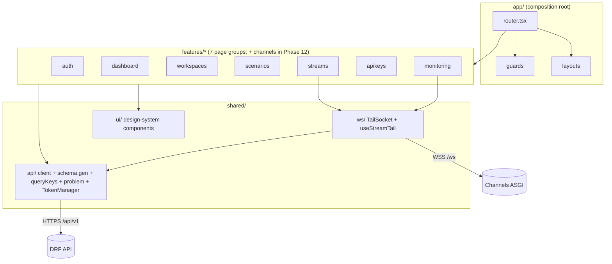
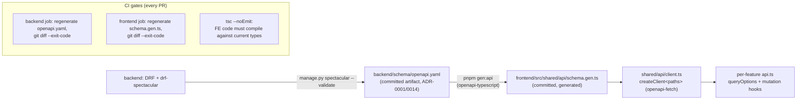
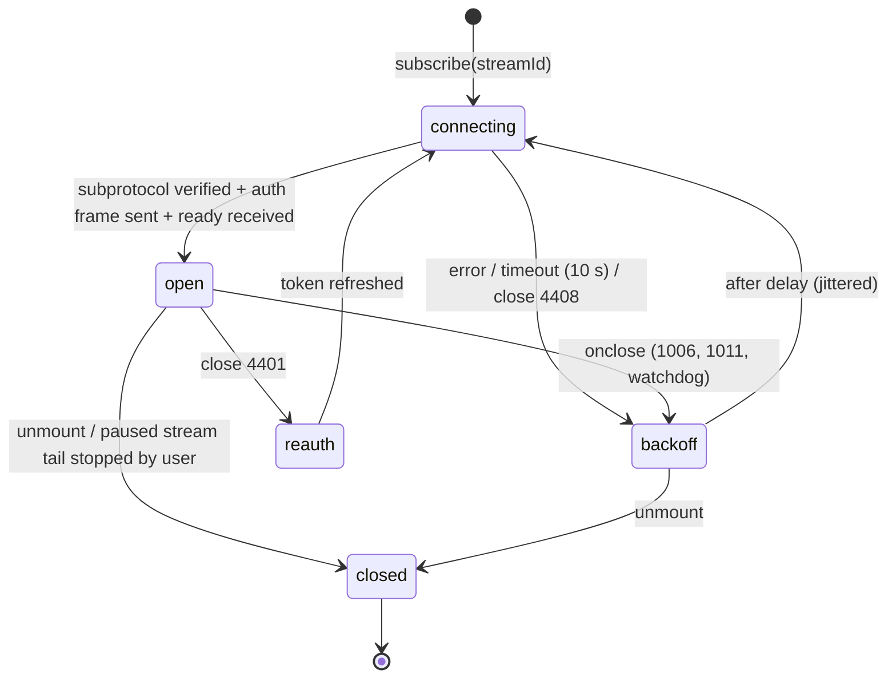

# DataForge — Frontend Architecture

**Deliverable:** D11

This document specifies the DataForge console: a Vite + React + TypeScript single-page application implementing the seven page groups of the product requirements (auth, dashboard, workspace management, scenario management, stream control, API keys, monitoring) per ADR-0016. It defines the feature-folder structure, the full routing map with guards, the TanStack Query server-state architecture with query-key and invalidation conventions, the generated OpenAPI TypeScript client pipeline whose drift check fails CI, the WebSocket hook layer (`useStreamTail`) with first-message auth, reconnect/backoff, cursor resume and client-side sampling, the in-memory access-token model with refresh rotation, the component inventory per page group, error/loading/empty-state conventions, and the frontend testing strategy. Terminology follows [../03-domain/domain-model.md](../03-domain/domain-model.md) exactly; endpoint shapes and the problem-details catalog are owned by [../05-interfaces/api-specification.md](../05-interfaces/api-specification.md); the user-facing flows implemented here are the PRD core flow ([../01-product/prd.md](../01-product/prd.md) §3).

---

## 1. Stack and rationale

### 1.1 Decision table (pinned)

| Concern | Choice | Version floor | Rationale |
|---|---|---|---|
| Build tool | Vite | 6.x | Sub-second HMR, native ESM dev server, first-class TS; standard `vite build` static output served by the `web` process group ([deployment-architecture.md](deployment-architecture.md)) |
| Framework | React | 19.x | Mandated stack; concurrent rendering benefits the live tail (transitions for non-urgent list appends) |
| Language | TypeScript, `strict: true` | 5.8 | The generated OpenAPI types are the FE/BE contract; strictness is what makes drift a compile error |
| Routing | React Router (library mode, data router) | 7.x | ADR-0016; nested layouts map 1:1 onto the workspace-scoped guard hierarchy (§3) |
| Server state | TanStack Query | 5.x | ADR-0016 — the **only** server-state store (§4); no Redux, no MobX, no Zustand |
| API client | `openapi-typescript` + `openapi-fetch` | 7.x / 0.13+ | Types generated from the drf-spectacular artifact; `openapi-fetch` is a ~6 KB typed wrapper over `fetch`, so the auth middleware (§6) owns the transport with zero duplication |
| Styling | Tailwind CSS | 4.x | ADR-0016; design tokens as CSS variables in `@theme` |
| Headless components | Radix UI primitives | 1.x | ADR-0016 "headless components": accessible dialogs/menus/sliders/tabs with zero imposed styling |
| Virtualized lists | TanStack Virtual | 3.x | The live tail renders ≤ visible rows regardless of buffer size (§7.6) |
| Forms | react-hook-form + zod | 7.x / 3.x | Client validation mirrors API constraints; problem-details field errors map onto form state (§10.4) |
| Unit/component tests | Vitest + Testing Library + MSW | 3.x / 16.x / 2.x | §11 |
| E2E | Playwright | 1.x | Core-loop E2E is the Phase 7 exit criterion; runs against the compose stack |
| Package manager / runtime | pnpm 9 / Node 22 LTS | — | Workspace-aware installs in the monorepo (ADR-0001) |

Charting: the dashboard and monitoring sparklines are a custom ~80-line SVG `<Sparkline>` component in `shared/ui` — no charting library ships in the MVP bundle (budget, §12.1).

### 1.2 SPA, no SSR — justification (ADR-0016)

The console is an authenticated tool behind a login wall: there is no SEO surface, no anonymous content, and no first-paint-marketing concern inside the app. Its hottest views (live tail, stream stats) are WebSocket- and poll-driven and would gain nothing from server rendering while adding a Node render tier to the deployment topology that [deployment-architecture.md](deployment-architecture.md) deliberately does not have (process groups are `web`/`ws`/`worker`/`runner`; the SPA is static files served by `web`). Public marketing pages, if/when they exist, are a separate static site outside this document's scope. Consequences accepted: a blank-shell first paint behind auth (mitigated by an inline boot splash in `index.html`) and client-side route-level code splitting as the bundle-size lever (§12).

### 1.3 State taxonomy — why no Redux

Every piece of console state has exactly one home; a global client-side store would duplicate at least three of these homes and create the cache-coherence bugs ADR-0016 rejects:

| State kind | Home | Examples |
|---|---|---|
| Server state | TanStack Query cache (§4) | workspaces, streams, stats, keys, scenarios, schemas, answer key |
| Live push state | `useStreamTail` ring buffer (§7), outside the Query cache | tail events, connection status, tail counters |
| Navigation state | The URL | active workspace (`/w/:slug`), active stream, tab selection, list filters |
| Auth state | `TokenManager` module (§6.1) + `['session']` query | access token (memory only), current user |
| Ephemeral UI state | Component `useState` / Radix internal state | dialogs, slider drag value, form drafts |
| Cross-cutting UI services | Two tiny React contexts | `ToastContext`, `ConfirmDialogContext` |

The URL is the source of truth for "which workspace am I in" — there is no `currentWorkspace` store to desynchronize; deep links and refreshes are correct by construction.

---

## 2. Application structure

### 2.1 Feature-folder layout

```
frontend/
  index.html                      # boot splash + root div
  vite.config.ts                  # dev proxy: /api and /ws → compose stack
  src/
    app/                          # composition root — the only layer that sees everything
      main.tsx                    # createRoot; providers
      providers.tsx               # QueryClientProvider, ToastProvider, ConfirmProvider
      router.tsx                  # createBrowserRouter: full route table (§3)
      guards/                     # RequireAuth, PublicOnly, RequireWorkspace, RequireAdmin
      layouts/                    # AuthLayout, WorkspaceLayout (TopBar, SideNav, Outlet)
    features/
      auth/                       # page group 1
      dashboard/                  # page group 2
      workspaces/                 # page group 3 (settings, members, activity)
      scenarios/                  # page group 4 (catalog, instance config, registry browser)
      streams/                    # page group 5 (list, create, control panel, chaos, answer key)
      apikeys/                    # page group 6
      monitoring/                 # page group 7 (live tail, counters, health)
      channels/                   # Phase 12 ONLY: external Kafka/webhook sink config (§13) — absent before then
    shared/
      api/                        # client.ts (openapi-fetch + middleware), schema.gen.ts (generated),
                                  # queryKeys.ts, problem.ts (RFC 9457), token.ts (TokenManager)
      ws/                         # socket.ts (TailSocket), useStreamTail.ts, frames.ts
      ui/                         # Button, StatusBadge, Sparkline, DataTable, EmptyState,
                                  # Skeleton, CopyField, JsonViewer, PageHeader, Slider, …
      lib/                        # formatBytes, formatTps, relativeTime, useDebouncedCallback, …
      testing/                    # renderWithProviders, msw handlers, FakeTailSocket
```

Each feature folder follows the same internal convention:

```
features/streams/
  pages/            # route components (lazy entry points)
  components/       # feature-private components
  api.ts            # queryOptions factories + mutation hooks for this feature
  routes.tsx        # RouteObject[] exported to app/router.tsx
  index.ts          # the feature's public surface (routes + anything app/ needs)
```

### 2.2 Import boundary rules (CI-enforced)

Enforced with `eslint-plugin-boundaries`; a violation fails lint in CI:

| Rule | Statement |
|---|---|
| IMP-1 | `features/*` may import `shared/*` and React/library code — never another feature and never `app/*`. |
| IMP-2 | `app/*` may import any feature's `index.ts` (route assembly) and `shared/*`. |
| IMP-3 | `shared/*` imports nothing from `features/*` or `app/*`. |
| IMP-4 | Only `shared/api/client.ts` calls `fetch`; only `shared/ws/socket.ts` constructs `WebSocket`. Direct use elsewhere fails lint (`no-restricted-globals`). |
| IMP-5 | `shared/api/schema.gen.ts` is generated — `eslint-disable` headered, excluded from coverage, and never hand-edited (the drift gate regenerates and diffs it, §5.2). |

Cross-feature composition (e.g. the dashboard rendering stream stats cards) happens through `shared/ui` presentational components fed by each feature's exported `queryOptions` — re-exported via `index.ts`, satisfying IMP-1.

### 2.3 Module diagram



---

## 3. Routing map

All seven page groups, every route, its guard chain, and the phase in which it ships. Every route component is lazy-loaded (`lazy:` on the route object) — one chunk per page group plus per-heavy-page splits (§12.2). `:slug` is the workspace slug (domain model §2.2); resource ids are UUIDs.

### 3.1 Route table

| Page group | Path | Component (feature/pages) | Guards | Phase |
|---|---|---|---|---|
| Auth | `/login` | `auth/LoginPage` | `PublicOnly` | 7 |
| Auth | `/signup` | `auth/SignupPage` | `PublicOnly` | 7 |
| Auth | `/signup/check-email` | `auth/CheckEmailPage` | `PublicOnly` | 7 |
| Auth | `/verify-email` (`?token=`) | `auth/VerifyEmailPage` | none (token is the credential) | 7 |
| Auth | `/forgot-password` | `auth/ForgotPasswordPage` | `PublicOnly` | 7 |
| Auth | `/reset-password` (`?token=`) | `auth/ResetPasswordPage` | none | 7 |
| — | `/` | `WorkspaceResolver` — redirects to `/w/{last-or-first slug}/dashboard`, or `/workspaces/new` when the user has none | `RequireAuth` | 7 |
| Workspaces | `/workspaces/new` | `workspaces/CreateWorkspacePage` | `RequireAuth` (+ verified check inline, INV-ID-2) | 7 |
| — (layout) | `/w/:slug` | `WorkspaceLayout` (TopBar, SideNav, Outlet) | `RequireAuth` → `RequireWorkspace` | 7 |
| Dashboard | `/w/:slug/dashboard` | `dashboard/DashboardPage` | inherited | 7 |
| Scenarios | `/w/:slug/scenarios` | `scenarios/CatalogPage` | inherited | 7 |
| Scenarios | `/w/:slug/scenarios/:scenarioSlug` | `scenarios/ScenarioDetailPage` (manifest summary, versions, instances) | inherited | 7 |
| Scenarios | `/w/:slug/scenarios/instances/:instanceId` | `scenarios/InstanceConfigPage` (overlay editor) | inherited | 7 |
| Scenarios | `/w/:slug/schemas` | `scenarios/RegistryBrowserPage` (subject list) | inherited | 10 |
| Scenarios | `/w/:slug/schemas/:subject` | `scenarios/SubjectDetailPage` (versions, diff) | inherited | 10 |
| Streams | `/w/:slug/streams` | `streams/StreamListPage` | inherited | 7 |
| Streams | `/w/:slug/streams/new` (`?instance=`) | `streams/CreateStreamPage` | inherited | 7 |
| Streams | `/w/:slug/streams/:streamId` | `streams/StreamDetailPage` — tabs: `control` (default), `chaos`, `answer-key` | inherited; `answer-key` tab additionally `RequireAdmin` (ADR-0017) | 7 (tabs: chaos + answer-key 9) |
| API keys | `/w/:slug/api-keys` | `apikeys/ApiKeysPage` | inherited | 7 |
| Monitoring | `/w/:slug/monitoring` | `monitoring/MonitoringOverviewPage` (per-stream health table) | inherited | 7 |
| Monitoring | `/w/:slug/monitoring/:streamId` | `monitoring/StreamMonitorPage` (live tail + counters) | inherited | 7 |
| Workspaces | `/w/:slug/settings` | `workspaces/SettingsPage` — tabs: `general`, `members`, `activity` | inherited + `RequireAdmin` | 7 |
| — | `*` | `shared/ui/NotFoundPage` | none | 7 |

Phase 1 ships the routing skeleton (this table's paths registered with placeholder pages behind `RequireAuth` stubs); Phase 7 fills all Phase-7 rows with working pages. **Refined in Phase 9:** the `chaos` and `answer-key` tabs render their panels (§9.5); until then the tab bar shows only `control`. **Refined in Phase 10:** the two `/schemas` routes and the SideNav "Schemas" item appear. **Refined in Phase 11:** quota meters on dashboard/settings (§9.2). **Refined in Phase 12:** a `/w/:slug/channels` group for external Kafka/webhook sink configuration — the SideNav slot and feature folder name (`channels`) are reserved now; no route exists before then.

### 3.2 Guards

Guards are layout-route components wrapping `<Outlet/>`; they read the Query cache and `TokenManager`, never fetch imperatively.

| Guard | Logic | Failure behavior |
|---|---|---|
| `PublicOnly` | Session exists? | `<Navigate to="/" replace />` |
| `RequireAuth` | Waits for the §6.2 bootstrap (suspends on `['session']`); session present? | `<Navigate to="/login" state={{ returnTo }} />`; login restores `returnTo` |
| `RequireWorkspace` | `:slug` resolves to a membership in `['workspaces']` | Renders `NotFoundPage` (cross-tenant probes are indistinguishable from missing — mirrors the API's 403/404 policy in [../06-quality/security-architecture.md](../06-quality/security-architecture.md)) |
| `RequireAdmin` | Membership role is `admin` (domain model §2.2) | Renders `NotFoundPage` for routes; for tabs, the tab is hidden entirely |

Unverified users (INV-ID-2) are **not** route-blocked: they can browse the console, but a persistent `VerifyEmailBanner` renders in `WorkspaceLayout`/`CreateWorkspacePage`, and tenant-creating actions (create workspace, create API key, create stream) render disabled with a "verify your email" tooltip and re-send link. The API enforces the same rule; the console mirror exists only for UX.

---

## 4. Server state: TanStack Query

### 4.1 QueryClient defaults

```ts
new QueryClient({
  defaultOptions: {
    queries: {
      staleTime: 30_000,
      gcTime: 5 * 60_000,
      retry: (count, err) =>
        count < 2 && err instanceof ApiError && (err.status >= 500 || err.status === 0),
      refetchOnWindowFocus: true,
    },
    mutations: { retry: 0 },   // lifecycle commands are idempotent (INV-STR-3) but never auto-retried:
  },                            // a user retry is one click; an auto-retry hides failures
});
```

4xx responses are never retried (the request will not get better); network errors and 5xx retry twice with the built-in exponential delay.

### 4.2 Query-key conventions

All keys come from one factory, `shared/api/queryKeys.ts` — string-literal keys outside it fail lint (`no-restricted-syntax` on array literals passed to `useQuery`). Two rules give the entire scheme:

1. **Session-scoped keys** live at the root: `['session']`, `['workspaces']`.
2. **Everything tenant-owned** lives under `['w', workspaceId, …]` — the workspace **UUID**, not the slug (slugs are renameable display routing; the UUID is the tenancy key, INV-TEN-1). One prefix removal evicts a whole tenant subtree.

| Key | Data | staleTime override |
|---|---|---|
| `['session']` | current user (`/api/v1/auth/me`) | 5 min |
| `['workspaces']` | membership list with roles | 60 s |
| `['w', wsId, 'detail']` | workspace + plan/quota summary | — |
| `['w', wsId, 'members']` | memberships | — |
| `['w', wsId, 'activity', filters]` | audit entries (cursor-paginated, `useInfiniteQuery`) | — |
| `['w', wsId, 'keys']` | API keys (prefix, last4, scopes, state, last_used_at — never secrets) | — |
| `['w', wsId, 'scenarios']` | catalog list (global + workspace-visible) | 5 min |
| `['w', wsId, 'scenarios', scenarioSlug]` | scenario detail + versions | 5 min |
| `['w', wsId, 'scenarios', scenarioSlug, 'manifest', version]` | published manifest document | `Infinity` (immutable, INV-CAT-1) |
| `['w', wsId, 'instances']` / `[…, instanceId]` | scenario instances / one instance with overlay + `config_revision` | — |
| `['w', wsId, 'streams', filters]` | stream list | — |
| `['w', wsId, 'streams', streamId]` | stream detail (status, desired state, pin summary, seed) | — (poll, §4.4) |
| `['w', wsId, 'streams', streamId, 'stats']` | stream stats counters | 0 (poll 5 s) |
| `['w', wsId, 'streams', streamId, 'chaos']` | live ChaosPolicy | — |
| `['w', wsId, 'streams', streamId, 'answer-key', mode, filters]` | injection records (infinite) | — |
| `['w', wsId, 'schemas']` | registry subjects | 5 min |
| `['w', wsId, 'schemas', subject, 'versions']` | version list | 5 min |
| `['w', wsId, 'schemas', subject, 'versions', version]` | one JSON Schema document | `Infinity` (immutable, INV-REG-2) |

Cursor-paginated endpoints (ADR-0014) always use `useInfiniteQuery` with `getNextPageParam: (last) => last.next_cursor ?? undefined` — the cursor is opaque (domain model §6.1) and never parsed client-side.

### 4.3 Invalidation matrix (per mutation)

Every mutation hook declares its invalidations in `onSuccess`; this table is the normative set. "Invalidate" = `invalidateQueries`; "remove" = `removeQueries`; "poll" = §4.4 transitional polling.

| Mutation | Invalidates | Optimistic? | Notes |
|---|---|---|---|
| login / refresh bootstrap | seeds `['session']` | — | §6 |
| logout | — | — | `queryClient.clear()` + `TokenManager.clear()` |
| verifyEmail, resetPassword | `['session']` | no | |
| createWorkspace | `['workspaces']` | no | navigate to `/w/{new slug}/dashboard` |
| updateWorkspace (name/slug) | `['workspaces']`, `['w', id, 'detail']` | no | slug change → router redirect to new slug |
| deleteWorkspace | `['workspaces']`; remove `['w', id]` | no | confirm dialog states the INV-TEN-6 cascade |
| invite/remove member, change role | `['w', id, 'members']`; removing self also `['workspaces']` | no | last-admin operations are rejected by the API (INV-TEN-3); the console disables them pre-emptively |
| createApiKey | `['w', id, 'keys']` | no | plaintext secret lives only in the mutation result → reveal-once dialog local state; **never written into the Query cache** (§9.6) |
| revokeApiKey | `['w', id, 'keys']` | yes — state→`revoked` immediately | rollback on error |
| createInstance | `['w', id, 'instances']` | no | |
| updateInstanceConfig (overlay write) | `['w', id, 'instances', instanceId]` | no | bumps `config_revision`; PIN-2 means **no stream keys are touched** — running streams are unaffected by design; success toast says "applies to streams started from now on" |
| createStream | `['w', id, 'streams']` | no | navigate to detail |
| startStream / pauseStream / resumeStream / stopStream | `['w', id, 'streams', sid]`, `['w', id, 'streams']` | no — commands set *desired* state; lifecycle convergence is shown honestly | poll detail at 2 s until settled (§4.4) |
| setTargetTps | `['w', id, 'streams', sid]` on settle | yes — patch `desired.target_tps` in cache | debounced 400 ms from the slider; "effective ≤ 2 s" (domain model §4.4) verified by the next poll |
| updateChaosPolicy | `['w', id, 'streams', sid, 'chaos']`, stream detail | yes — toggle flips immediately | PIN-3: live-mutable; audit-logged server-side |
| scheduleSchemaUpgrade (Phase 10) | `['w', id, 'streams', sid]` | no | |
| deleteStream | `['w', id, 'streams']`; remove `['w', id, 'streams', sid]` | no | only `created`/`stopped`/`failed` offer the action (T14) |

### 4.4 Polling rules

| Data | Interval | Rule |
|---|---|---|
| Stream detail | 2 s while status is transitional (`starting`, `pausing`, `resuming`, `stopping`); 10 s while `running`; off when settled at `stopped`/`failed`/`created` | `refetchInterval: (q) => intervalFor(q.state.data?.status)` |
| Stream stats | 5 s while the monitor or control page is mounted | Matches INV-OBS-2's ≤ 5 s staleness bound — polling faster buys nothing |
| Dashboard cards | 15 s | aggregate workspace view |
| Stream list | 30 s | status badges on list rows |
| Answer key, schemas, catalog | no polling | refetch on focus/invalidations only |

Polling stops automatically when the tab is hidden (TanStack Query's `refetchIntervalInBackground: false` default).

---

## 5. Generated OpenAPI client pipeline

### 5.1 Pipeline



| Step | Contract |
|---|---|
| Schema source | `backend/schema/openapi.yaml`, generated by drf-spectacular with `--validate`, committed in the same PR as the API change (path recorded in [../07-plan/project-folder-structure.md](../07-plan/project-folder-structure.md)) |
| Codegen | `pnpm gen:api` runs `openapi-typescript ../backend/schema/openapi.yaml -o src/shared/api/schema.gen.ts` |
| Drift gate | Both `git diff --exit-code` jobs (G1, G2) plus typecheck (G3). A backend change that alters the contract without regenerating fails G1; a stale frontend types file fails G2; frontend code using a removed/renamed field fails G3. **FE/BE drift cannot merge** (ADR-0014). |
| Client | One `createClient<paths>({ baseUrl: import.meta.env.VITE_API_BASE_URL })` instance in `client.ts` with the auth middleware (§6.3) attached. Features call `client.GET("/api/v1/streams/{stream_id}", …)` — paths, params, bodies, and responses are all compile-time typed. |
| Types-only imports | Domain types are re-exported from `schema.gen.ts` (`type Stream = components["schemas"]["Stream"]`) in `shared/api/types.ts`; features import from there, never from the raw generated file. |

Hand-written wrapper code is limited to query-option factories and mutation hooks per feature (`features/*/api.ts`); no hand-maintained request/response interfaces exist anywhere.

### 5.2 Why not generated hooks

Generators that emit TanStack Query hooks directly (orval-style) couple cache policy to codegen output and make the §4.3 invalidation matrix implicit. DataForge generates **types only**; cache behavior stays in reviewed application code. This was decided with ADR-0016's "generated client" requirement interpreted as *generated contract, hand-assembled cache policy*.

---

## 6. Auth and token handling

JWT mechanics (lifetimes, rotation, blacklist) are owned by [../06-quality/security-architecture.md](../06-quality/security-architecture.md) per ADR-0011; this section is the client-side contract.

### 6.1 Token storage rules

| Token | Where | Never |
|---|---|---|
| Access token (SimpleJWT, short-lived) | `TokenManager` module variable — process memory only | localStorage, sessionStorage, cookies readable by JS, Query cache, Redux (n/a) |
| Refresh token (rotating) | `HttpOnly; Secure; SameSite=Strict` cookie scoped to the refresh path, set/rotated/cleared by the backend | ever readable by frontend code |

A full page reload therefore loses the access token by design; §6.2 silently restores the session via the cookie. XSS consequences: an injected script could use an in-memory token for its lifetime but cannot exfiltrate a durable credential. Complementary XSS posture: React's default escaping everywhere, `JsonViewer` renders event payloads as text nodes only (manifest literals are attacker-controlled content, threat T-8 in [../04-engines/scenario-plugin-architecture.md](../04-engines/scenario-plugin-architecture.md) §13), `dangerouslySetInnerHTML` is lint-banned, and the `web` process serves a CSP with `script-src 'self'`.

### 6.2 Session bootstrap

On app load, before the router renders guarded content:

1. `POST /api/v1/auth/refresh` (cookie rides automatically). Success → access token into `TokenManager`, then `GET /api/v1/auth/me` seeds `['session']`.
2. Failure (401 — no/expired/blacklisted cookie) → unauthenticated; `RequireAuth` redirects to `/login`.

`RequireAuth` suspends on this bootstrap promise, so guarded pages never flash unauthenticated states.

### 6.3 Request middleware and refresh single-flight

`openapi-fetch` middleware in `client.ts` — the only transport-touching code (IMP-4):

```mermaid
sequenceDiagram
    participant C as Feature code (Query fn)
    participant M as Auth middleware
    participant TM as TokenManager
    participant API as DRF /api/v1
    C->>M: request
    M->>TM: getAccessToken()
    alt token missing or expiring < 30 s
        M->>TM: refresh()  — single-flight
        Note over TM: one in-flight refresh promise;<br/>concurrent requests await it
        TM->>API: POST /auth/refresh (HttpOnly cookie)
        API-->>TM: 200 {access} + rotated cookie
    end
    M->>API: request + Authorization: Bearer <access>
    alt 401 authentication problem
        M->>TM: refresh() (single-flight, once)
        TM-->>M: new access token
        M->>API: retry original request (exactly once)
        API-->>C: response
    else refresh fails (401)
        TM->>TM: clear()
        M-->>C: throw ApiError(401)
        Note over C: queryClient.clear();<br/>navigate /login?returnTo=…
    else success
        API-->>C: response
    end
```

Rules: proactive refresh at < 30 s remaining (decoded from the JWT `exp` claim — decoded, never verified, client-side); reactive refresh on 401 retries the original request **exactly once**; a second 401 logs out. The single-flight promise prevents N concurrent queries from issuing N refreshes and tripping rotation reuse-detection.

### 6.4 Multi-tab and logout

- A `BroadcastChannel("df-auth")` propagates `{type: "login" | "logout" | "token", access?}` between tabs: a successful refresh broadcasts the new access token so sibling tabs do not race the rotating cookie; logout in one tab logs out all tabs.
- Logout: `POST /api/v1/auth/logout` (backend blacklists the refresh token and clears the cookie) → `TokenManager.clear()` → `queryClient.clear()` (all tenant data leaves memory) → broadcast → `/login`.

### 6.5 The console never holds API keys

The console authenticates with JWT only (ADR-0011 duality). API keys are created for the user's *external* consumers; the plaintext appears once in the create-key response, is shown in the reveal-once dialog, and is never persisted in any frontend store (§9.6). The WS live tail authenticates with the **JWT** (`access_token` in the first-message `auth` frame, §7.2), never a key — the monitoring page is a console surface, not a data-plane consumer.

---

## 7. WebSocket hook layer

The console's live tail consumes `/ws/streams/{stream_id}/events` (ADR-0013; protocol owned by [../05-interfaces/api-specification.md](../05-interfaces/api-specification.md) and [../04-engines/delivery-channels.md](../04-engines/delivery-channels.md) — restated here exactly as the hook depends on it). WS is a best-effort tail (INV-DEL-5): the hook is built for visibility, never completeness.

### 7.1 Layering

| Layer | File | Responsibility |
|---|---|---|
| `TailSocket` | `shared/ws/socket.ts` | One WebSocket connection: first-message auth, frame parsing, heartbeat watchdog, reconnect with backoff, cursor tracking + REST gap-fill handoff. Framework-free class — unit-testable with fake timers. |
| `useStreamTail` | `shared/ws/useStreamTail.ts` | React binding: ring buffer, sampling, rate counters, 250 ms batched flushes into state via `useSyncExternalStore`. |
| Page components | `features/monitoring`, `features/streams` | Render only. |

### 7.2 Connection and first-message auth

Browsers cannot set WS headers, so authentication is the **first frame on the socket** (API-spec §5.1; delivery-channels WS-2). Credentials, cursors, and filters never appear in the URL:

```ts
const ws = new WebSocket(
  `${WS_BASE}/ws/streams/${streamId}/events`,
  ["dataforge.events.v1"]                       // versioned subprotocol (WS-1)
);
ws.onopen = () => ws.send(JSON.stringify({
  type: "auth",
  access_token: accessToken,                    // console JWT (§6.5); never an API key
  cursor: lastCursor ?? undefined,              // resume bookmark → resume_ack (§7.4)
  types: filter.length ? filter : undefined,    // server-side event-type filter (WS-5)
}));
```

The server **selects and echoes** `dataforge.events.v1` (versioned subprotocol per ADR-0013); a selected protocol other than that, or no selection, aborts the connection client-side. The `auth` frame must arrive within **10 s** of connect or the server closes `4408` — `TailSocket` sends it from `onopen` and reports `open` only after the server's `ready` frame. Changing the `types` filter means reconnecting (WS-5). Token nearing expiry is refreshed (§6.3) *before* connecting; mid-connection expiry surfaces as close code 4401 → refresh → reconnect.

### 7.3 Frame types (client contract)

All frames are JSON text frames with a `type` discriminator (catalog owned by API-spec §5.2):

| `type` | Payload | Hook behavior |
|---|---|---|
| `ready` | `{protocol, stream_id, position{cursor}, filters}` | auth accepted; report `open`; seed `lastCursor` from `position.cursor` when unset |
| `resume_ack` | `{position{cursor}, behind{events, from_cursor}\|null}` | `behind` non-null → REST gap-fill from `behind.from_cursor` (§7.4) + inline "catching up: N events" notice; `null` → nothing missed |
| `event` | `{cursor, event}` — `event` is the delivered envelope (all 20 fields, `_df` already stripped per INV-DEL-2) | count, sample, buffer; `lastCursor := cursor` |
| `drop_notice` | `{dropped, resume_cursor}` (INV-DEL-5 drop-oldest count) | `counters.droppedByServer += dropped`; inline marker row in the tail |
| `heartbeat` | `{server_time, last_cursor, delivered, dropped}` — every 15 s | reset the liveness watchdog; reconcile per-connection counters |
| `error` | `{problem}` — RFC 9457 document | non-fatal (`cursor-expired`, §7.4): inline notice, keep tailing; otherwise surface via toast; close follows |

Watchdog: no frame of any type for **45 s** (3 missed heartbeats) → the socket is presumed dead; close and reconnect. (The server independently closes `1001` after 90 s of socket-level silence.)

### 7.4 Reconnect, backoff, resume-from-cursor



| Rule | Value |
|---|---|
| Backoff schedule | `delay = min(1000 × 2^attempt, 30_000)` ms with **full jitter** (`random() × delay`); attempt counter resets after a connection stays open ≥ 60 s |
| Resume | Reconnects (and any connect with a known position) put `cursor: lastCursor` in the `auth` frame. **The socket never replays** (delivery-channels WS-6; ADR-0013 — the socket carries no replay state of its own): the server answers `resume_ack`, and when `behind` is non-null the hook backfills the gap over REST — `GET /streams/{id}/events?cursor=<behind.from_cursor>` with the JWT — while the socket tails live (WS-7). Missed events during the outage are therefore recovered through REST, within retention |
| Cursor expired | **Not a close** (WS-8): the server sends an `error` frame with the `cursor-expired` problem (including `earliest_cursor`) and continues tailing live → a non-dismissable-for-10-s notice in the tail: "resume point expired — tailing live; events older than retention were not recovered" (the teaching moment, surfaced honestly) |
| Other close codes | 4401 → §7.2 reauth; 4403/4404 → terminal, render NotFound presentation (cross-tenant policy); 4408 (auth deadline — a hung connect) → reconnect; 4429 (connection limit) → backoff with the server-provided `retry_after` if present; 1001 (deploy/going-away) → immediate reconnect, no backoff |
| Tab hidden | After 60 s hidden (Page Visibility API), close the socket; on visible, reconnect with cursor — counters note the gap |

### 7.5 Client-side sampling (render safety)

Counters are always exact; **only the display buffer is sampled.**

| Parameter | Value |
|---|---|
| Flush cadence | Buffered frames flush to React state every **250 ms** (4 Hz) inside `startTransition` — no per-event re-render, ever |
| Ingest rate window | 1 s sliding window (4 × 250 ms buckets) |
| Sampling threshold `N` | **200 events/s** displayed |
| Sampling rule | When window EPS > 200: keep every k-th event, `k = ceil(EPS / 200)`, deterministic by arrival index (not random — stable under re-render) |
| Ring buffer | Last **1,000** retained events; older entries dropped from display (never from counters) |
| UI signal | `SamplingBadge`: "high volume — displaying 1/k of events; counters remain exact" |

At the Phase 7 exit criterion (tail at 100+ TPS must not freeze), 100 TPS is below threshold: every event displays, batched at 4 Hz into a virtualized list. At a Pro-tier 1,000 TPS stream, k = 5 and the render cost is identical to 200 TPS.

### 7.6 `useStreamTail` API

```ts
function useStreamTail(streamId: string, opts?: {
  eventTypes?: string[];        // server-side filter (auth-frame `types`, WS-5) + defensive client filter
  displayPaused?: boolean;      // freeze display buffer; counters keep counting
  bufferSize?: number;          // default 1000
}): {
  events: ReadonlyArray<DeliveredEvent>;   // sampled ring buffer, newest last
  status: "connecting" | "open" | "reconnecting" | "closed";
  counters: {
    received: number;           // exact, all event frames since subscribe
    displayed: number;
    sampledOut: number;
    droppedByServer: number;    // Σ drop_notice
    eps: number;                // 1 s window ingest rate
  };
  sampling: { active: boolean; keepRatio: number };   // keepRatio = 1/k
  lastCursor: string | null;
  notices: TailNotice[];        // drop notices, cursor-expired, reconnect gaps (inline rows)
  clear(): void;
}
```

The tail list itself is `TanStack Virtual` over the ring buffer: row height estimated 36 px collapsed, measured when a row is expanded into `JsonViewer`. Auto-scroll pins to newest; any manual scroll-up disengages it and shows a "↓ live" jump button. Tail counters are connection-local; the stats cards beside the tail come from the stats API (poll 5 s) and are the authoritative numbers (INV-OBS-2) — the page labels the two sources distinctly ("this connection" vs "stream totals").

---

## 8. UI stack and design system

| Aspect | Contract |
|---|---|
| Tailwind | v4, CSS-first config: design tokens (color scale, spacing, radii, font stack) declared in `@theme` in `src/app/theme.css`; no `tailwind.config.js` theme sprawl |
| Headless primitives | Radix UI: `Dialog` (confirm, reveal-once), `DropdownMenu` (workspace switcher, row actions), `Tabs` (stream detail, settings), `Slider` (TPS, probabilities, chaos rates), `Switch` (chaos toggles, CDC toggles), `Tooltip`, `Toast`, `Popover` |
| `shared/ui` inventory | `Button`, `Input`, `Select`, `FormField`, `PageHeader`, `DataTable` (sortable, cursor-paginated footer), `StatusBadge`, `Sparkline`, `CopyField` (click-to-copy with confirmation), `JsonViewer` (collapsible, text-nodes-only), `EmptyState`, `Skeleton`, `ErrorState`, `QuotaMeter` (Phase 11), `CodeSnippet` (curl quickstart) |
| Theming | Single light theme in MVP; all colors flow through tokens so theming is additive later. WCAG AA contrast on all token pairs. |
| Accessibility | Radix supplies ARIA/keyboard behavior; every interactive element reachable by keyboard; focus moves to `PageHeader` on route change; `prefers-reduced-motion` disables pulse animations on transitional status badges; `eslint-plugin-jsx-a11y` in CI |
| i18n | English-only MVP; all user-facing strings are plain JSX (no i18n framework). Post-MVP extraction is mechanical because copy never lives in `shared/api`/`shared/ws`. |

`StatusBadge` is the single rendering of the surfaced stream status string (domain model §4.3) — used identically on dashboard cards, list rows, control panel, and monitor header:

| Status | Color token | Animation |
|---|---|---|
| `created` | gray | — |
| `starting`, `resuming` | blue | pulse |
| `running` | green | — |
| `pausing`, `stopping` | amber | pulse |
| `paused` | amber | — |
| `paused_quota`, `paused_idle` | amber | — (reason chip appended: "quota" / "idle") |
| `stopped` | gray | — |
| `failed` | red | — (detail panel shows `status_reason`) |

---

## 9. Component inventory per page group

### 9.1 Auth (`features/auth`) — Phase 7

| Component | States / behavior |
|---|---|
| `LoginForm` | email + password; pending; problem-details error banner; `returnTo` redirect |
| `SignupForm` | email + password + confirm; zod policy mirror (authoritative policy: [../06-quality/security-architecture.md](../06-quality/security-architecture.md)); success → `/signup/check-email` |
| `VerifyEmailPage` | consumes `?token=`: pending → success (CTA "go to console") / failure (expired/used token per INV-ID-3) with re-send form |
| `ForgotPassword` / `ResetPassword` | request + confirm forms; reset success → login. Responses never reveal whether an email exists (anti-enumeration; same contract as the API) |

### 9.2 Dashboard (`features/dashboard`) — Phase 7

| Component | Contents |
|---|---|
| `WorkspaceSummaryCard` | member count, plan tier, events today (stats), active streams / concurrent-stream allowance. **Refined in Phase 11:** `QuotaMeter` bars (events/day, aggregate TPS vs caps) when quota enforcement lands; until then the card shows usage numbers without limit bars |
| `StreamStatsCard` (one per stream, top 6 by `last_event_at`) | `StatusBadge`, observed TPS `Sparkline` (last 15 min from stats polls), total events, `last_event_at` relative time; click → stream detail |
| `GettingStartedPanel` | rendered when the workspace has zero streams: 4-step checklist (scenario → key → stream → tail) with deep links — drives the PRD's ≤ 15 min time-to-first-event |

### 9.3 Workspace management (`features/workspaces`) — Phase 7

| Component | States / behavior |
|---|---|
| `WorkspaceSwitcher` (TopBar) | memberships from `['workspaces']`; switch = navigate `/w/{slug}/dashboard`; "create workspace" entry (verified-gated) |
| `CreateWorkspaceForm` | name + slug (slug auto-derived, editable, uniqueness error from API) |
| `MembersTable` | role chips; invite-by-email dialog (member/admin); demote/remove actions disabled for the last admin with INV-TEN-3 tooltip |
| `ActivityList` | audit entries (`{context}.{object}.{verb}`, actor, relative time), infinite scroll, action-type filter. **Refined in Phase 11:** export + advanced filtering; the list itself ships Phase 7 (audit API exists from Phase 2) |
| `DangerZone` | delete workspace — typed-confirmation dialog enumerating the cascade (keys revoked, streams stopped, INV-TEN-6) |

### 9.4 Scenario management (`features/scenarios`) — Phase 7, registry browser Phase 10

| Component | States / behavior |
|---|---|
| `CatalogGrid` | scenario cards (title, description, entity/event-type counts from the manifest summary, `global`/`workspace` visibility chip) |
| `ScenarioDetail` | published versions list (semver, `published_at`, deprecated chip per INV-CAT-5); instances of this scenario in the workspace; "create instance" (version picker defaults to latest published) |
| `InstanceConfigPage` | the overlay editor (manifest §11.1 shape), sections below; sticky footer: `config_revision`, save, and the permanent banner **"changes apply to streams started after saving"** (PIN-2/PIN-4) |
| — `ProbabilitySliders` | one slider per `override.allowed` transition, grouped by machine → state; range clamped to `[override.min, override.max]`; manifest default marked on the track; non-overridable transitions render read-only |
| — `DwellEditors` | distribution family fixed (label), parameter inputs (median/p95 etc.) with ISO-8601 duration input control |
| — `CatalogSizeInputs` | per-entity numeric inputs clamped to manifest `[min, max]`; live Σ indicator vs the 250,000 cap (B-08) |
| — `IntensityCurveEditor` | 24-hour bar editor + 7-day weekly inputs (0–10); preview overlays the renormalized curve and states "average TPS is unchanged by curve shape" (PRD §4.3) |
| — `CdcToggles` | switches for manifest-listed `cdc.entities` only (R-CDC-M1) |
| — `ChaosDefaultsSection` | same controls as the chaos panel (§9.5) writing instance defaults |
| — `OverlayErrorMap` | MAN-V* errors from a 422 are JSON-Pointer-mapped to the exact control (e.g. `MAN-V201` highlights the offending state's slider group and shows "probabilities sum to 1.15; must be ≤ 1.0") |
| `RegistryBrowserPage` (**Phase 10**) | subjects table (`{scenario_slug}.{event_type}`, version count, latest version, compat mode chip `BACKWARD_ADDITIVE`); `SubjectDetailPage`: version timeline, `JsonViewer` per version (staleTime `Infinity`), and `SchemaDiff` — additive-only diff rendering added fields in green (removals cannot exist, INV-REG-3). Until Phase 10 the registry is API-only; no console surface exists. |

### 9.5 Stream control (`features/streams`) — Phase 7; chaos + answer key tabs Phase 9

`CreateStreamPage`: instance picker (pre-selected via `?instance=`), seed input (blank → server-generated; helper text: "same seed + config reproduces the identical stream", INV-G-4), initial target TPS, virtual-clock section (`speed_multiplier` 1–1000 with presets 1×/60×/24×; mode `live`/`backfill` + `backfill_days` clamped to plan caps). **Refined in Phase 8:** the virtual-clock section unlocks multipliers ≠ 1 and backfill mode when the engine ships them; the form fields and API contract exist from Phase 7 with `1×`/`live` as the only accepted values until then.

`StreamControlPanel` (the `control` tab):

| Component | Behavior |
|---|---|
| `LifecycleButtons` | Start / Pause / Resume / Stop per the matrix below; commands are idempotent (INV-STR-3) so double-clicks are harmless; buttons show pending until the desired-state POST returns, then the `StatusBadge` tracks convergence via 2 s polling |
| `TpsSlider` | log-scale 1–1,000, hard-clamped to the plan's per-stream cap (PRD §7: Free 50 / Classroom 100 / Pro 1,000); current effective value marked; drag is local state, release debounces 400 ms → `setTargetTps` (optimistic, §4.3); helper: "takes effect within 2 s" |
| `PinSummary` | read-only: `{scenario_slug}@{manifest_version}`, merged-config sha256 (copyable, golden-replay identifier per PIN-1), seed, virtual-clock config — with the "new stream required to change these" note (PIN-4) |
| `StreamDangerZone` | stop + delete (delete only in `created`/`stopped`/`failed`, T14) |

Button-enablement matrix (normative):

| Status | Start | Pause | Resume | Stop | TPS slider | Delete |
|---|---|---|---|---|---|---|
| `created` | ✓ | — | — | — | — | ✓ |
| `starting` | pending | — | — | ✓ | — | — |
| `running` | — | ✓ | — | ✓ | ✓ | — |
| `pausing` | — | pending | — | ✓ | — | — |
| `paused` | — | — | ✓ | ✓ | — | — |
| `paused_quota` | — | — | disabled + "quota headroom required" tooltip (T7 guard) | ✓ | — | — |
| `paused_idle` | — | — | ✓ ("resume" is the one-click recovery, PRD §7) | ✓ | — | — |
| `resuming` | — | — | pending | ✓ | — | — |
| `stopping` | — | — | — | pending | — | — |
| `stopped` | ✓ ("continues from checkpoint", T12) | — | — | — | — | ✓ |
| `failed` | ✓ ("retry", T13) | — | — | — | — | ✓ |

`ChaosPanel` (**Phase 9**, the `chaos` tab) — live-mutable per PIN-3:

| Component | Behavior |
|---|---|
| `ChaosModeCard` × 7 | one card per canonical mode (`duplicates`, `late_arriving`, `missing`, `out_of_order`, `corrupted_values`, `nulls`, `schema_drift` — exact identifiers, domain model §2.7): enable `Switch`, rate slider 0–0.5 (B-16), mode params (e.g. `late_arriving` delay distribution shown in **simulated time** with the §3.4 event-model note "realized in wall time / speed_multiplier"; `out_of_order` window). Param shapes come from the chaos config schema in [../04-engines/chaos-engine.md](../04-engines/chaos-engine.md) via the generated types |
| `PresetPicker` | the PRD exercise presets ("Dedup 101", "Late data 30 min", "Drift day", …) applied as a bundle with a confirm diff |
| `DriftModeNote` | `schema_drift` card disabled with explanation when no next registered version exists (INV-REG-5) |
| `OnStopPolicySelect` | `discard` (default) / `flush` for pending late re-emissions (domain model §2.7 OnStopPolicy) |

`AnswerKeyPanel` (**Phase 9**, the `answer-key` tab; `RequireAdmin`, ADR-0017): per-mode injection counts header; injections `DataTable` (mode filter, `event_id`, `sequence_no`, timing columns: configured vs realized) over the cursor-paginated answer-key endpoint; JSONL export button (download streams the same endpoint exhaustively); banner: "ground truth is never present in delivered events" (INV-DEL-2). Until Phase 9, neither tab renders (the API does not exist; the tab bar is `control`-only).

### 9.6 API keys (`features/apikeys`) — Phase 7

| Component | Behavior |
|---|---|
| `KeysTable` | prefix + last4 (`df_live_a3f8……9c2e`), name, scope chips, state (`active`/`revoked`/`expired`), `created_by`, `last_used_at` relative; revoke action (creator or admin) with confirm |
| `CreateKeyDialog` | name, scope checkboxes (`events:read`, `streams:read`, `streams:write`, `schemas:read`; `answer_key:read` visible to admins only — domain model §5), optional `expires_at` |
| `RevealOnceDialog` | renders the plaintext from the mutation response in `CopyField`; the value lives in dialog-local `useState` only and is cleared on close; explicit copy: "this key is shown once — DataForge stores only a hash" (INV-TEN-4). Closing without copying requires a confirm |
| `QuickstartSnippet` | `CodeSnippet` with the documented curl cursor loop (PRD §2.1 day-1 journey) templated with the new key's prefix placeholder and the workspace's stream ids |

### 9.7 Monitoring (`features/monitoring`) — Phase 7

| Component | Behavior |
|---|---|
| `MonitoringOverviewPage` | `DataTable` of all streams: `StatusBadge`, observed TPS, total events, `last_event_at`, per-stream health cell (heartbeat-fresh / stale per stats recency); row click → stream monitor |
| `StreamMonitorPage` | header (`StatusBadge`, observed TPS, totals from the 5 s stats poll — authoritative); `LiveTail` below |
| `LiveTail` | `useStreamTail` (§7.6) + `TanStack Virtual` list; per-row: `occurred_at`, `event_type` chip (CDC rows get an `op` chip), `sequence_no`, actor; expand → `JsonViewer` of the full delivered envelope; toolbar: event-type multi-select filter, display pause, clear, `SamplingBadge`, connection status dot; inline notice rows for `drop_notice` / reconnect gaps / cursor-expired |
| `PerTypeCounters` | top-N event types by count (stats API), with CDC/business split |

---

## 10. Error, loading, and empty-state conventions

### 10.1 Problem-details handling

All non-2xx responses are RFC 9457 problem documents (ADR-0014). `shared/api/problem.ts` parses them into a typed `ApiError { status, type, title, detail, errors?, retryAfter? }`; **handlers switch on the problem `type` suffix, never on status codes alone** (the full type catalog is owned by [../05-interfaces/api-specification.md](../05-interfaces/api-specification.md)):

| Problem type (suffix) | Console behavior |
|---|---|
| `validation-error` | map `errors[].pointer` (JSON Pointer) onto form fields (§10.4); unmapped errors → form-level banner |
| `manifest-validation-failed` (MAN-V*) | `OverlayErrorMap` control highlighting (§9.4) |
| `authentication-required` | handled in middleware (§6.3); never reaches pages |
| `permission-denied` / `not-found` | render `NotFoundPage` content — cross-workspace probes look identical to missing resources, mirroring the API policy |
| `conflict` | toast with `detail` (e.g. slug taken) |
| `quota-exceeded` | `QuotaBanner` on the acting page with the specific limit from `detail`; links to settings. **Refined in Phase 11:** upgrade CTA when plans become self-serve |
| `cursor-expired` | tail notice (§7.4); on any REST surface, an explanatory callout — documented as a teaching moment |
| `rate-limited` | toast with countdown from `retryAfter`; acting button disabled for the duration |
| anything else / unparseable | generic `ErrorState` with request id (`request_id` extension member) for support |

### 10.2 Loading

- **Route-level:** skeleton screens (`Skeleton` mirrors the page's layout blocks), never full-page spinners. Each lazy route renders its skeleton as the Suspense fallback.
- **Query-level:** `isPending` → skeleton in place of the widget; background refetches (`isFetching`) are invisible except a subtle top-bar progress strip.
- **Mutation-level:** the triggering control enters its pending state (spinner-in-button, disabled); the page never blocks.

### 10.3 Empty states

Every list/collection page defines an `EmptyState` with one primary CTA — these are launch surfaces, not absences:

| Page | Empty copy + CTA |
|---|---|
| Streams | "No streams yet" → Start your first stream |
| API keys | "No API keys" → Create a key (+ quickstart link) |
| Instances on scenario detail | "Not configured in this workspace" → Create instance |
| Live tail (connected, no events) | "Connected — waiting for events" + stream status hint when not `running` |
| Answer key (chaos never enabled) | "No injections recorded — enable chaos modes to create gradable exercises" |
| Dashboard (no streams) | `GettingStartedPanel` (§9.2) |

### 10.4 Forms

react-hook-form + zod resolver; zod schemas live next to each form and mirror API constraints (lengths, patterns, ranges) for instant feedback — the API remains authoritative. On 422, `errors[].pointer` maps to `setError(fieldPath, …)`; pointers that miss a field render in the form banner. Submit buttons disable while pending; dirty-state navigation away prompts via the router blocker on the two long forms (instance config, stream create).

---

## 11. Testing

Frontend gates integrate into the per-phase CI matrix owned by [../06-quality/testing-strategy.md](../06-quality/testing-strategy.md); this section defines the frontend-local taxonomy.

### 11.1 Taxonomy

| Level | Tooling | Scope and conventions |
|---|---|---|
| Static | `tsc --noEmit`, ESLint (strict TS, hooks, jsx-a11y, boundaries), Prettier check | every PR; the typecheck doubles as the FE side of the contract gate (§5.1 G3) |
| Unit | Vitest | pure logic: `problem.ts` parsing, `queryKeys.ts`, sampling math, backoff schedule, `TokenManager` single-flight (fake timers) |
| Component | Vitest + Testing Library (jsdom) + MSW 2 | per-feature: pages rendered via `renderWithProviders` (fresh `QueryClient`, MemoryRouter, ToastProvider); MSW handlers are typed against `schema.gen.ts` so a contract change breaks fixtures at compile time; queries by role/label only |
| WS harness | `FakeTailSocket` in `shared/testing` (no real network) | drives `TailSocket`/`useStreamTail` deterministically with `vi.useFakeTimers`: reconnect/backoff sequence, 4401 reauth, cursor-expired `error`-frame notice, `resume_ack` REST gap-fill handoff, drop-notice counting, sampling activation at scripted EPS |
| E2E | Playwright against the Docker Compose stack | the suites below |
| Visual/a11y | `@axe-core/playwright` assertions on one representative page per page group | merged into the E2E run |

Coverage gates (CI-enforced): `shared/api` and `shared/ws` ≥ 90% line coverage (they are the contract- and money-path); features ≥ 70%; generated files excluded (IMP-5).

### 11.2 The core-loop E2E (Phase 7 exit criterion)

`e2e/core-loop.spec.ts`, tagged `@core-loop`, runs in CI against `docker compose up` with a unique-per-run email:

1. Sign up → fetch the verification token via the compose mailhog API → verify.
2. Create workspace → land on dashboard (`GettingStartedPanel` visible).
3. Create an e-commerce scenario instance with defaults.
4. Create an API key → assert reveal-once dialog → copy → close → assert plaintext absent from the DOM and from the keys table.
5. Create a stream (seed `4242`, 10 TPS) → start → `StatusBadge` reaches `running` ≤ 60 s.
6. Open the stream monitor → live tail shows ≥ 1 `order_placed` whose `payload.user_id` matches an earlier `user_registered` (the PRD §2.1 moment).
7. Pause → badge `paused`, tail stops appending; resume → appends continue.
8. Set TPS 10 → 50 via slider → stats observed TPS reflects it within 10 s.
9. Stop → badge `stopped`. Sign out → `/login`.

Phase-9 and Phase-10 additions extend the same suite: `@chaos-panel` (enable 5% duplicates → tail shows repeated `event_id`s → answer-key tab counts match) and `@registry-browser` (subject list, v1/v2 diff shows added fields).

### 11.3 What is deliberately not tested here

Statistical realism, invariant suites, cross-tenant attack probes, and cross-channel contracts are backend-owned ([../06-quality/testing-strategy.md](../06-quality/testing-strategy.md)); the console asserts only its own rendering of their outputs.

---

## 12. Performance and build

### 12.1 Budgets (CI-enforced via `rollup-plugin-visualizer` size check)

| Budget | Limit |
|---|---|
| Initial JS (entry + vendor, gzip) | ≤ 250 KB |
| Any lazy route chunk (gzip) | ≤ 150 KB |
| Live tail interaction | no main-thread task > 50 ms at 1,000 TPS ingest (sampling + 4 Hz batching + virtualization, §7.5) |
| Route transition (warm cache) | first content < 200 ms (skeletons render synchronously) |

### 12.2 Code splitting

One chunk per page group (route-level `lazy`), plus dedicated splits for the two heavy pages: `InstanceConfigPage` (curve editor) and `StreamMonitorPage` (tail + viewer). `shared/ui` and the generated client stay in the entry chunk (used everywhere).

### 12.3 Environment and serving

| Aspect | Contract |
|---|---|
| Env vars | `VITE_API_BASE_URL` (default `""` — same-origin), `VITE_WS_BASE_URL` (default derived `wss://{host}`); injected at build per environment ([deployment-architecture.md](deployment-architecture.md) owns env promotion) |
| Dev | `vite dev` proxies `/api` and `/ws` to the compose stack — no CORS in any environment (same-origin in prod too) |
| Prod | `vite build` static output served by the `web` process group with immutable-hashed asset caching and `index.html` no-store; SPA fallback routing; CSP per §6.1 |
| Scripts | `dev`, `build`, `typecheck`, `lint`, `test`, `test:e2e`, `gen:api`, `gen:api:check` (the G2 drift job) |

---

## 13. Phase availability summary

| Phase | Console delta |
|---|---|
| 1 | Vite shell, routing skeleton, CI (eslint + tsc + vitest), guards stubbed |
| 7 | **Console MVP:** all seven page groups per §9 (auth, dashboard, workspaces, scenarios + instance config, streams + control panel, API keys, monitoring + live tail); generated-client pipeline live; core-loop E2E gate |
| 8 | Virtual-clock controls unlock (speed multiplier, backfill mode) on stream create; CDC `op` chips and per-entity filter in the tail |
| 9 | `ChaosPanel` + `PresetPicker`; `AnswerKeyPanel` (admin); chaos E2E |
| 10 | Registry browser routes + `SchemaDiff`; scheduled schema-upgrade control on the stream detail |
| 11 | `QuotaMeter`s, `paused_quota`/`paused_idle` recovery flows polished, activity export |
| 12 | `channels` feature (external Kafka/webhook sink config) through the reserved SideNav slot — post-MVP |

---

## 14. Ownership boundaries

What this document deliberately does not specify, and where it lives:

| Concern | Owner |
|---|---|
| Endpoint paths, request/response schemas, problem-type catalog, WS frame/close-code protocol (normative) | [../05-interfaces/api-specification.md](../05-interfaces/api-specification.md) |
| JWT lifetimes, refresh rotation/blacklist, password policy, signup abuse controls, CSP/headers policy | [../06-quality/security-architecture.md](../06-quality/security-architecture.md) |
| Delivered envelope shape rendered by `JsonViewer` and the tail | [../03-domain/event-model.md](../03-domain/event-model.md) |
| WS channel semantics (best-effort, drop-oldest), buffer retention, cursor semantics | [../04-engines/delivery-channels.md](../04-engines/delivery-channels.md), ADR-0013 |
| Manifest overlay shape, MAN-V* error catalog, override bounds | [../04-engines/scenario-plugin-architecture.md](../04-engines/scenario-plugin-architecture.md) |
| Chaos mode parameter schemas and presets | [../04-engines/chaos-engine.md](../04-engines/chaos-engine.md) |
| Static asset serving, process groups, env promotion | [deployment-architecture.md](deployment-architecture.md) |
| Backend OpenAPI generation job and schema artifact | [backend-architecture.md](backend-architecture.md), ADR-0014 |
| Monorepo paths (`frontend/`, `backend/schema/openapi.yaml`) | [../07-plan/project-folder-structure.md](../07-plan/project-folder-structure.md) |
| CI gate composition per phase | [../06-quality/testing-strategy.md](../06-quality/testing-strategy.md) |
