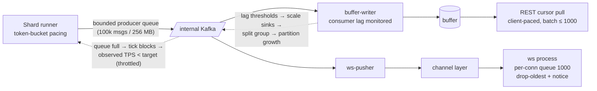

# DataForge — Scaling Strategy

**Deliverable:** D15

This document is the capacity arithmetic behind the 1 → 100,000 TPS headline: the unit capacities of every pipeline component (per-shard Python generation ceiling, Kafka partition budgets, buffer-writer ingest, Postgres limits, WebSocket fan-out, API throughput), the **TPS staircase** that composes them into six rungs with a named bottleneck and remedy at each, the backpressure policy per channel, quotas as both product tiers and platform protection, the stateless-API scaling rules, and the honest reconciliation of the 99.9% availability target with a single-region MVP. Deployment shapes and machine sizes come from [deployment-architecture.md](deployment-architecture.md); SLO definitions from [observability.md](observability.md); domain terms from [../03-domain/domain-model.md](../03-domain/domain-model.md) (a **runner** is a data-plane process, a **shard** is the unit of parallelism within a stream, ADR-0006). Every number below is either a *planning number* (conservative, used for sizing) or a *measured target* (verified by the Phase 11 calibration program, §8) — the table in each section says which.

---

## 1. Definitions and method

| Term | Definition |
|---|---|
| **Aggregate TPS** | Sum of realized canonical events/second across all running streams platform-wide. Chaos changes delivered counts by at most ±50% per mode caps (B-16); sizing uses canonical TPS with a 1.5× delivered-amplification worst case where it matters (Kafka egress, sinks). |
| **Rung** | A target aggregate TPS: 1 / 10 / 100 / 1,000 / 10,000 / 100,000. Each rung is sized for **sustained 100% duty** — honest worst case. Classroom reality is bursty (typical duty ≤ 20%), which buys storage slack but is never assumed for throughput sizing. |
| **Planning rule** | Provision so that steady-state utilization of every component ≤ 70% of its planning ceiling. Admission control (§5.2) enforces this at stream-start time. |
| **Event sizes** | Delivered envelope ≈ 1.0 KiB serialized (measured on the e-commerce worked examples, [../03-domain/event-model.md](../03-domain/event-model.md) §7); internal envelope on Kafka ≈ 1.25 KiB (adds `_df`); stored buffer row ≈ 1.5 KiB (row + indexes); stored ledger row ≈ 1.7 KiB. |
| **Calibration loop** | Phase 11 load tests replace planning numbers with measured ones; this document is re-baselined and the deltas published with the GA load-test report (§8). A planning number proven wrong by measurement is a documentation bug. |

---

## 2. Unit capacities

### 2.1 Per-shard runner ceiling (Python event generation)

One shard = one CPython process pinned to ~1 dedicated core (`performance-2x` runner machines, [deployment-architecture.md](deployment-architecture.md) §3.2). Per-event CPU budget, CPython 3.12 with `orjson` serialization and `confluent-kafka` (librdkafka, C) producer:

| Stage (per event) | Budget (µs) | Basis |
|---|---|---|
| State-machine evaluation: transition draw, guard checks (O(1) relationship-indexed), dwell sampling | 15–40 | Pure-Python dict/PRNG ops; guards are indexed lookups, never scans ([../04-engines/scenario-plugin-architecture.md](../04-engines/scenario-plugin-architecture.md) §3.2) |
| Value generation: 5–15 attribute draws (faker-style pools, distributions, templates) | 20–60 | Closed 41-generator vocabulary; hooks budgeted ≤ 100 µs and banned from the reference scenario |
| Entity-pool ops: reads/mutations, Redis pipelined and write-behind amortized | 15–40 | ~3 Redis ops/event amortized (§2.8); shard-local working set |
| Envelope assembly: UUIDv7, causality fields, `partition_key`, `entity_refs` | 10–20 | String/format work |
| Canonical serialization (`orjson`) | 5–15 | ~1 KiB documents |
| Ground-truth ledger write, COPY-batched (1,000 rows/batch), amortized | 20–50 | INV-GEN-5: ledger precedes publish |
| Chaos stage (modes off / typical lab config) | 2 / 10–30 | Seeded transform, post-ledger (ADR-0009) |
| Kafka produce (async, batched, amortized) | 5–15 | librdkafka background thread |
| Bookkeeping: counters, token bucket, checkpoint deltas, heartbeat amortized | 10–25 | |
| **Total** | **≈ 100–300 µs/event** | ⇒ 3,300–10,000 events/s theoretical per core |

Discounting GC pauses, tick scheduling, desired-state polls, and checkpoint flushes (every 30 s):

| Number | Value | Status |
|---|---|---|
| **Per-shard planning ceiling** | **2,500 events/s** | Planning number — all staircase math uses this |
| Per-shard measured target | ≥ 4,000 events/s sustained, e-commerce manifest, chaos on | Verified in Phase 11 calibration (§8) |
| Per-manifest floor | ≥ 1,000 events/s (MAN-D604) — a manifest that cannot sustain this on a runner-class core is rejected at publication | Enforced from Phase 4 |
| Cross-check | The layer-3 dry run measured `est_eps_per_shard: 8400` for the e-commerce manifest in unpaced validation mode (no ledger/Kafka I/O) — consistent with 2,500–5,000 once pipeline I/O is added | [../04-engines/scenario-plugin-architecture.md](../04-engines/scenario-plugin-architecture.md) §8.3 |

Assumptions stated: process-per-shard (no GIL contention across shards); ledger and buffer I/O batched, never per-event; the manifest validator's resource bounds (B-03…B-16) cap per-event work — the per-shard ceiling is *manifest-bounded by construction*, which is why MAN-D604 exists.

### 2.2 Shards per stream

```
shards(stream) = max(1, ceil(target_tps / 2,500))
```

| Fact | Value |
|---|---|
| MVP (Phases 5–10) | Exactly 1 shard/stream; the Pro per-stream cap (1,000 TPS, PRD §7) is 40% of one shard — sharding is *not* needed for any MVP quota |
| Phase 11+ | N shards, pinned at stream start (envelope field 5, immutable per stream); actors assigned to shards by hash of their PK-1 partition entity, so one actor's events stay on one shard and per-actor ordering is free (ADR-0006, event-model §2.2.3) |
| Platform cap | ≤ 64 shards/stream (platform protection, §5.2) — a hypothetical 160k-TPS single stream is out of scope; aggregate scale comes from many streams |
| Runner machine packing | 2 shard processes per `performance-2x` machine (1 core each) ⇒ **5,000 events/s per runner machine** planning |

### 2.3 Kafka: partitions and per-workspace budgeting

**Topic layout (MVP, panel-gap closure):** internal delivery topics are **shared across all workspaces** — a fixed, tenant-count-independent set — exactly one at GA, `df.delivery.events.v1` ([backend-architecture.md](backend-architecture.md) §9.1) — carrying the post-chaos stream keyed by the workspace-prefixed `partition_key` (naming owned by [backend-architecture.md](backend-architecture.md)). There are **zero per-workspace or per-stream internal topics**: at thousands of classroom workspaces, topic-per-tenant would mean tens of thousands of partitions on a single broker — the design that dies first. Isolation on shared topics is by envelope `workspace_id` + key prefix (INV-TEN-1), enforced at every consumer, with RLS and scoped queries behind it.

| Budget | Value | Status |
|---|---|---|
| Per-partition plan load | ≤ 2,500 msg/s and ≤ 3 MB/s | Planning (raw capability ≥ 4× this; headroom covers rebalance catch-up) |
| `df.delivery.events.v1` partitions | 12 at GA → 48 at rung 5 → 192 at rung 6 | Partition growth happens only via a **new topic generation** (`…events.v2`) + consumer cutover, never in-place `kafka-topics --alter` — in-place addition breaks key→partition stability mid-stream. The first growth is scheduled at the managed-migration boundary (deployment §4), where a cutover happens anyway |
| Single-broker ceiling (Fly VM, NVMe volume) | 50 MB/s ingress ≈ 40,000 msg/s; egress = ingress × consumer groups (2 in MVP: `df.sink.rest-buffer.v1`, `df.sink.websocket.v1`; 3 with Phase 12 external sink) | Planning. At the 5k-TPS migration trigger the broker runs at ~13% throughput utilization — **the single broker is an availability bottleneck, never a throughput bottleneck, below the trigger** |
| Consumer parallelism | Sink instances per group ≤ partition count (Kafka consumer-group rule) — 12 partitions support 12 buffer-writers, far beyond MVP need | Structural |

**Per-workspace budgeting:**

| Surface | Budget rule |
|---|---|
| Internal partition share | Bounded by the workspace aggregate TPS quota (100 / 1,000 / 2,000 by tier, PRD §7): the largest legal workspace (2,000 TPS) occupies ≤ 0.8 partition-equivalents of load — no tenant can hot-spot the topic beyond its quota |
| Concurrent streams | 2 / 20 / 10 by tier (PRD §7) bounds per-tenant key cardinality |
| External topics (Phase 12, managed cluster only) | One topic per sink binding, i.e. per (workspace, stream): `df.{workspace_id}.{stream_id}`, partitions = `max(3, stream shard count)` capped at 8 (delivery-channels §7.1 XK-1/XK-2); per-workspace partition budgets: Classroom add-on 16, Pro 32, Free none (XK-3). Provisioned-topic count = paying workspaces' bindings only; cluster partition envelope sized at migration per [../04-engines/delivery-channels.md](../04-engines/delivery-channels.md). External topics never exist on the internal MVP broker |

### 2.4 Buffer-writer ingest (the `rest_buffer` sink)

The buffer-writer consumes `df.delivery.events`, strips `_df` (SB-2), and writes the time-partitioned Postgres buffer with `COPY` in 1,000-row batches (or 250 ms linger, whichever first — bounded latency at low TPS).

| Number | Value | Status |
|---|---|---|
| Per-process throughput | **15,000 rows/s** (≈ 15 COPY batches/s at 30–50 ms/batch on the GA MPG class) | Planning; measured target ≥ 25,000 |
| Scaling | Add instances up to partition count; partition-assigned consumption keeps per-stream buffer append order replay-stable (INV-DEL-3) |
| GA deployment | 1–2 processes co-located in the runner group; dedicated `sink` process group at the split trigger (deployment §3.3) |

### 2.5 Postgres buffer ceiling — and the off-ramp

Two independent ceilings on the GA instance (Fly MPG 4 vCPU / 16 GB / 500 GB):

**Throughput.** Sustained `COPY` ingest with concurrent cursor reads, WAL at ~1.5× row volume, partition-drop retention (no vacuum debt by design, ADR-0013):

| Instance class | Sustained comfort | Hard ceiling (reads degrade) |
|---|---|---|
| 4 vCPU (GA) | 5,000 rows/s | ~10–12,000 rows/s |
| 8 vCPU (one scale-up step) | 10,000 rows/s | ~20,000 rows/s |

**Storage churn** (buffer at 1.5 KiB/row + ledger hot tier at 1.7 KiB/row, 48 h each per deployment §9.3, sustained 100% duty):

| Sustained aggregate TPS | Buffer+ledger ingest | PG steady-state (48 h hot tiers) |
|---|---|---|
| 100 | 28 GB/day | ~55 GB |
| 1,000 | 277 GB/day | ~530 GB |
| 2,500 | 690 GB/day | ~1.3 TB |
| 10,000 | 2.8 TB/day | ~5.3 TB — not a Postgres deployment anyone should run |

**The off-ramp (decided now, executed between rungs 4 and 5).** The buffer (and the ledger hot tier with it) moves off Postgres when **any** of:

1. trailing 7-day p95 aggregate TPS ≥ **2,500**, or
2. buffer insert p99 latency > 500 ms sustained for 1 h, or
3. buffer + ledger storage > 70% of provisioned volume after one scale-up step.

**Destination: ClickHouse** (single node first, `MergeTree` ordered by `(workspace_id, stream_id, shard_id, buffer_position)`, TTL-based retention, ~7× compression on envelope JSON, ≥ 100,000 rows/s ingest per 8-vCPU node). Why this and not the alternatives, in one line each: serving cursors straight from Kafka would couple the user-facing replay window to broker retention and make replay-stable total order per stream the consumer's problem; a Postgres-extension timeseries store inherits exactly the Postgres ceilings being escaped. **The DeliveryChannel contract does not move:** cursors are opaque and versioned (domain model §2.8), so swapping the store behind the REST pull API changes no client, no status code, and no guarantee — at-least-once, replay-stable, `410 cursor-expired` all preserved. Control-plane tables, registry, audit, and injection records stay on Postgres permanently. Refined in the post-GA phase that executes it; the contract above is the decided design.

### 2.6 WebSocket fan-out

WS is a tail/debug channel, never the bulk path (INV-DEL-5, ADR-0013). Limits are therefore set by policy as much as capacity:

| Number | Value | Status |
|---|---|---|
| Per-connection server-side delivery cap | **200 frames/s**, above which the server samples and emits drop notices (§4.1) | Policy (frozen; matches client-side sampling design, ADR-0016) |
| Connections per `ws` machine | 5,000 (uvicorn ×2 workers, ~150 KB/connection budget within 2 GB) | Planning |
| Frames per `ws` machine | 30,000 frames/s (pass-through pre-serialized envelopes, ~25 µs/frame send path) | Planning |
| Channel-layer budget (Upstash Redis pub/sub) | 50,000 msg/s; the `ws-pusher` publishes each event once per stream group — fan-out to N sockets happens in the ws process, not in Redis | Planning |
| Concurrent WS connections per workspace | Free 10 / Classroom 100 / Pro 50 | Platform protection (§5.2) |

Worked cohort case: 60 students tailing one 100-TPS stream = 6,000 frames/s = 20% of one ws machine — fine. The same cohort on a 1,000-TPS unfiltered stream would demand 60,000 frames/s; the 200 f/s per-connection cap turns that into ≤ 12,000 frames/s of sampled tails with drop notices, which is the designed behavior, not an overload.

### 2.7 Control-plane API and REST event reads

| Number | Value | Status |
|---|---|---|
| Control-plane CRUD per `web` machine | 200 req/s (gunicorn ×4, p50 ~15 ms/view) | Planning; control-plane traffic at GA is orders of magnitude below this |
| Event-pull reads per `web` machine | ~25 batch-requests/s at `limit=1000` (indexed partition range reads, 20–60 ms) ⇒ **~25,000 events/s read capacity per machine** | Planning |
| Postgres connections | Per-process pools: web 2×20, ws 2×10, worker 20, runner+sinks 30 ⇒ ~130 of `max_connections=300`. **PgBouncer (transaction pooling) is added at rung 4** before machine-count growth multiplies pools | Planning |

### 2.8 Redis budgets

| Use | Budget | Notes |
|---|---|---|
| Entity-pool ops | ~3 ops/event amortized (pipelined) | The dominant Redis load; see rung 6 for the ceiling |
| Leases/heartbeats | 2 ops per shard per 5 s — negligible (hundreds of streams ≈ tens of ops/s) | |
| Stats counters | 1 pipelined op/event batch | |
| Instance throughput | 50,000 ops/s planning on the GA managed instance; ~300,000 ops/s on a self-managed dedicated VM or cluster | |
| Memory | Typical default e-commerce stream ≈ 10 MiB hot pool state; manifest-bounded worst case 244 MiB/stream (B-08) — concurrent-stream quotas keep the 3 GB GA instance inside budget with alerting at 70% | B-08, PRD §7 |

---

## 3. The TPS staircase

Composition rule per rung: generation cores → Kafka partitions/broker → sink processes → buffer store → consumption surfaces, with the planning numbers of §2 and the 70% rule. Summary first, arithmetic per rung after.

| Rung | Aggregate TPS | Shards | Runner machines | Kafka | Buffer writers | Buffer store | **Named bottleneck** | **Remedy** |
|---|---|---|---|---|---|---|---|---|
| §3.1 | 1 | 1 | 2 (GA baseline) | single broker, 12 partitions | 1 (co-located) | Postgres | none structural — first-event latency | keep baseline; start-to-first-event < 5 s |
| §3.2 | 10 | 1 | 2 | 〃 | 1 | Postgres | none — deploy churn is the only risk | graceful drain + lease failover (designed) |
| §3.3 | 100 | 1 | 2 | 〃 | 1 | Postgres (~26 GB) | WS cohort fan-out | per-conn cap + sampling + type filters |
| §3.4 | 1,000 | 1–2 | 2 | 〃 | 1 | Postgres (~530 GB) | **storage churn** | ledger tiering, volume to 1 TB, PgBouncer |
| §3.5 | 10,000 | 4 | 3 (+ sink group) | **managed**, 48 partitions | 2–4 | **ClickHouse** | **Postgres buffer ingest + storage** | execute the §2.5 off-ramp; managed Kafka already forced by the >5k trigger |
| §3.6 | 100,000 | 40 | 5–6 × performance-8x (+ sink group) | managed cluster 3–6 brokers, 192 partitions | 8 | ClickHouse ×2–3 | **generation CPU economics + egress cost** | native hot path (2–3×), horizontal scale, egress controls |

### 3.1 Rung 1 — 1 TPS (one student, one stream)

Utilization: generation 1/2,500 = 0.04% of one shard; Kafka 1.25 KiB/s; buffer 1 row/s, 130 MB/day storage. Nothing is loaded. The thing that actually matters at this rung is **experience latency**: stream start → first delivered event < 5 s (lease acquisition ≤ seconds + first tick + sink latency ≤ 1 s), and the 15-minute signup-to-first-event budget (PRD §2.1). Bottleneck: none; remedy: none — the GA baseline already over-serves this rung, which is the point of D-1 (final shape from day one).

### 3.2 Rung 2 — 10 TPS (classroom demo)

0.4% of one shard; 12.5 KiB/s to Kafka; 10 rows/s to the buffer. Every component is idle. The only realistic failure source is operational (deploys, restarts) interrupting a live demo — covered by drain semantics and ≤ 30 s lease failover (deployment RB-4), which keep the stream in `running` through a machine replacement. Bottleneck: none.

### 3.3 Rung 3 — 100 TPS (one active classroom at Free/Classroom aggregate caps)

- Generation: 100/2,500 = **4%** of one shard.
- Kafka: 125 KiB/s ingress, 250 KiB/s egress — noise.
- Buffer: 100 rows/s = 0.7% of one writer; storage 13 GB/day, 48 h steady state ≈ 26 GB buffer + 28 GB ledger hot.
- REST: a cohort polling at 1 req/10 s each (PRD bridge-depth metric) ≈ 6 req/s — 3% of one web machine.
- **WS: the named bottleneck.** 60 students tailing the same 100-TPS stream = 6,000 frames/s (20% of one ws machine) — fine; but instructors *will* start three streams. At 300 TPS × 60 tails = 18,000 frames/s, two ws machines run at 30% — still fine, but the per-connection cap is what guarantees it stays linear in connections, not in TPS × connections.
- Remedy (already designed): 200 f/s per-connection cap, client-side sampling, event-type filters on the tail, workspace WS-connection caps (§2.6).

### 3.4 Rung 4 — 1,000 TPS (max single Pro stream / busy multi-tenant day)

- Generation: 1,000/2,500 = **40%** of one shard — a single shard carries the maximum legal MVP stream with 70%-rule headroom intact. Platform aggregate of 1,000 across many streams: still ≤ 1 runner machine of load; 2 machines for redundancy.
- Kafka: 1.25 MB/s in / 2.5 MB/s out; 83 msg/s per partition (3% of partition budget).
- Buffer-writer: 1,000 rows/s = 7% of one process. PG throughput: 20% of the 4-vCPU comfort ceiling.
- **Storage: the named bottleneck.** 86.4M rows/day ⇒ buffer 124 GB/day + ledger hot 140 GB/day; 48 h tiers ⇒ ~530 GB steady state on PG (plus ~140 GB Parquet cold tier on object storage) against a 500 GB GA volume.
- Remedy: extend the MPG volume to 1 TB (one-step scale), rely on the already-designed 48 h ledger tiering to Parquet (deployment §9.3) and partition-drop retention; add PgBouncer ahead of connection-pool growth (§2.7). Duty-cycle reality (classrooms don't run 24/7) makes this rung cheaper in practice, but the sizing above survives 100% duty.
- This rung is the GA load-test floor's neighborhood: the Phase 11 exit criterion (≥ 5,000 aggregate TPS sustained with zero integrity/isolation violations) proves the platform clears this rung with 5× headroom on generation and Kafka — storage is the component the load test exercises least, which is why its remedy is provisioned, not deferred. The measured reconciliation of these staircase rungs against the harness is published in the [Measured-Ceiling Report](../../infra/loadtest/MEASURED-CEILING-REPORT.md): its §3 numbers are the **reduced-scale local proof** that the harness, integrity sampler, and cross-tenant probes work end to end (the prod 5,000-TPS gate is skipped per the Phase-11 simulate-infra scope), not a production 5k claim.

### 3.5 Rung 5 — 10,000 TPS

Crossing 5,000 sustained fires the **managed-Kafka migration trigger** (verbatim and operationalized in [deployment-architecture.md](deployment-architecture.md) §4); the §2.5 buffer off-ramp trigger (2,500 sustained) has also fired below this rung. Rung 5 is therefore sized on the post-migration substrate:

- Generation: 10,000/2,500 = **4 shards** ⇒ 4 dedicated cores + ~1.5 cores of sink work ⇒ 3 × `performance-2x` runner machines (6 cores) with the sink consumers split into their own process group (deployment §3.3 split trigger: sustained > 2,500).
- Kafka (managed, RF=3): 12.5 MB/s in, 25–37 MB/s out (2–3 consumer groups) — small for any managed tier; 48 partitions ⇒ 208 msg/s per partition (8% of budget), consumer parallelism up to 48.
- Buffer: 10,000 rows/s. On Postgres this is **at or above the GA-class hard ceiling and 2.8 TB/day of churn — the named bottleneck of this rung**, which is exactly why the off-ramp triggers *before* it. On ClickHouse: 10% of a single node's ingest; compressed churn ~180 GB/day, 48 h ≈ 360 GB.
- Buffer-writers: 10,000 rows/s = 67% of one process ⇒ 2 processes (4 for headroom), well under the 48-partition parallelism bound.
- Redis: ~30,000 pool ops/s — 60% of the managed planning budget; acceptable, with the rung-6 remedy already designed.
- REST consumption at this scale is spread across tenants by construction: no workspace quota allows more than 2,000 TPS aggregate, so ≥ 5 workspaces produce this rung. Per-key batch pulls (§4.2) put 10,000 events/s within 10 req/s for any single consumer.
- Named bottleneck: **Postgres buffer (ingest + storage)** — remedied by the ClickHouse off-ramp; secondary: single-broker availability — already remedied by the trigger-forced migration.

### 3.6 Rung 6 — 100,000 TPS (the headline)

- Generation: 100,000/2,500 = **40 shards ⇒ 40 dedicated cores** ⇒ 5–6 × `performance-8x` (8 vCPU) runner machines, plus a sink group (~1 × performance-8x). Lease/shard mechanics are unchanged — this is the same model as one stream, multiplied (ADR-0006).
- The economics, stated plainly: ~48 dedicated vCPUs of CPython is roughly $1.5–2k/month of compute for generation alone. The remedy ladder: (1) horizontal scale as above — works with zero code change, this is the architecture's promise; (2) native hot path — moving envelope assembly + canonical serialization + PRNG draws into a Rust/Cython extension is a 2–3× per-core win (≥ 6,000–7,500 ev/s/shard), cutting the fleet to ~2 machines; sequenced **after** rung-5 measurements, since optimizing before the off-ramp work would be optimizing the wrong bottleneck. Substrate scaling beyond the seams is explicitly post-MVP (MVP cut rule, [../07-plan/mvp-vs-future.md](../07-plan/mvp-vs-future.md)).
- Kafka: 125 MB/s in, 250–375 MB/s out ⇒ a real (but ordinary) managed cluster: 3–6 brokers, 192 partitions (520 msg/s each, 21% of budget).
- Buffer: 100,000 rows/s = one ClickHouse node's ingest at full planning capacity ⇒ 2–3 nodes (ReplicatedMergeTree) for the 70% rule + HA. Compressed churn ~1.8 TB/day; 48 h ≈ 3.6 TB on NVMe with the ledger cold tier on object storage — retention enforcement is existential at this rung, and it is already partition/TTL-mechanized.
- Buffer-writers: 8 processes (≈ 12,500 rows/s each).
- Redis: ~300,000 pool ops/s exceeds a single managed instance ⇒ remedy: shard-local pool ownership with write-behind snapshots (each shard already owns its actors exclusively — the access pattern is cluster-friendly by construction) or a 3-shard Redis cluster. Decided direction: shard-local first (no new infrastructure), per [../04-engines/behavior-engine.md](../04-engines/behavior-engine.md) pool mechanics.
- Egress: 100k delivered ev/s ≈ 100 MB/s ≈ 250 TB/month if fully consumed externally — **egress economics is the second named bottleneck**. Remedies: response compression (zstd/gzip on REST batches, ~5×), consumer co-location guidance, and per-tier egress accounting (a Phase 12+ pricing input, flagged here so the cost is never a surprise).
- Named bottleneck: **generation CPU economics + egress cost**. Nothing structural breaks: every component scales by adding instances of things that already exist. That is the claim "architecture must horizontally scale," made falsifiable with numbers.

---

## 4. Backpressure policy per channel

Global principle: **canonical truth is never dropped** (the ledger write precedes publication, INV-GEN-5); backpressure degrades *delivery promptness* and ultimately *generation pace*, in that order, and every degradation is observable.



### 4.1 WebSocket — drop-oldest-with-notice (INV-DEL-5)

| Rule | Value |
|---|---|
| Per-connection outbound queue | 1,000 frames |
| On overflow | Drop oldest frames; deliver a drop-notice frame `{"type": "drop_notice", "dropped": <count>, "resume_cursor": "<cursor>"}` so the client can hand off to REST replay (resume-from-cursor, ADR-0013). Exact frame schema owned by [../05-interfaces/api-specification.md](../05-interfaces/api-specification.md) |
| Per-connection delivery cap | 200 frames/s, then server-side sampling with drop notices (§2.6) |
| Never | Buffer unboundedly, silently skip, or block the bridge on a slow socket |

### 4.2 REST — client-paced pull with a batch endpoint

Pull is inherent backpressure: the server never pushes. The batch dimension is what makes high TPS consumable: `limit ≤ 1,000` events/request (default 100) means 1,000 TPS is one request/second and 10,000 TPS is ten — REST remains the bulk path by request-count economics, not server push. Per-key rate limits (§5.2) bound abuse; `429` carries `Retry-After`. Replay and `410 cursor-expired` semantics are unaffected by load (INV-DEL-3/4).

### 4.3 Sink consumer lag

| Threshold | Action |
|---|---|
| Lag > 30 s (any sink group) | Warn alert; dashboard annotation |
| Lag > 5 min, or > 30 min projected to breach the 6 h internal-topic retention | Critical alert; scale sink instances toward the partition-count bound; if already bound, execute the sink-group split (deployment §3.3) |
| Persistent at instance bound | Partition growth via new topic generation (§2.3) — a planned operation, not an emergency knob |

Lag is measured per group per partition and exported with workspace/stream attribution ([observability.md](observability.md)).

### 4.4 Producer/generation chain (the last resort, by design)

The runner's Kafka producer queue is bounded (100k messages / 256 MB). When the broker cannot absorb (outage, RB-5 maintenance), the queue fills, the tick loop blocks on enqueue, and the token bucket stops issuing — **observed TPS degrades below target** and stream stats expose `throttled: true` with the constraining component. Memory is bounded by construction; canonical events already written to the ledger are never lost; generation resumes automatically when the queue drains. Sustained throttling > 60 s raises a critical alert. Virtual-clock semantics during a throttled interval are owned by [../04-engines/behavior-engine.md](../04-engines/behavior-engine.md); the policy contract here is: bounded memory, no canonical loss, observable degradation.

### 4.5 Late-arrival buffer cap

Pending re-emissions are capped at 100,000 entries/stream (platform protection; B-15/B-16 manifest bounds make legitimate configs sit far below it). Behavior at the cap — which injections are recorded with which terminal state — is owned by [../04-engines/chaos-engine.md](../04-engines/chaos-engine.md); the cap value and its alert are owned here.

---

## 5. Quotas: product tiers and platform protection

Two distinct mechanisms that happen to share enforcement plumbing:

### 5.1 Product tiers (what a workspace bought)

Authoritative table in [../01-product/prd.md](../01-product/prd.md) §7. The scaling-relevant consequences: per-stream TPS caps (50/100/1,000) keep every legal stream inside one shard until Phase 11; aggregate workspace caps (100/1,000/2,000) bound any tenant's share of every shared component (§2.3); events/day quotas bound storage churn per tenant; idle auto-pause reclaims generation capacity from abandoned streams. Quota exhaustion **pauses** (status `paused_quota`), never deletes (INV-TEN-5).

### 5.2 Platform protection (what protects everyone else)

| Cap | Value | Enforcement point |
|---|---|---|
| Admission control | Σ provisioned `target_tps` across all running streams ≤ **70% of measured platform capacity** (5,000 measured at GA ⇒ 3,500 admission cap). Stream start/TPS-raise beyond it → `503` + `Retry-After: 300`; running streams are never touched | Stream-start / TPS-change command path |
| Per-key rate limits | Data-plane event reads 600 req/min; control-plane 120 req/min; stream lifecycle commands 30 req/min; WS connect attempts 10/min | Middleware, per ADR-0014 ([../05-interfaces/api-specification.md](../05-interfaces/api-specification.md) owns problem types) |
| WS connections per workspace | 10 / 100 / 50 (Free/Classroom/Pro) | WS handshake |
| Shards per stream | ≤ 64 | Stream-start validation (Phase 11+) |
| Concurrent backfill jobs per workspace | 2 | Celery dispatch |
| Manifest resource bounds | B-01…B-17 — the validator is the platform protection against pathological (incl. LLM-authored) manifests; a manifest is made safe to *accept* by validation and safe to *run* by these quotas | Validation pipeline ([../04-engines/scenario-plugin-architecture.md](../04-engines/scenario-plugin-architecture.md) §8, §13) |
| Signup/auth abuse limits | Owned by [../06-quality/security-architecture.md](../06-quality/security-architecture.md) | Auth endpoints |

Tier limits answer "is this fair to charge for"; platform caps answer "can this hurt another tenant." A request can pass the first and fail the second (admission control), and the error surfaces say which.

---

## 6. Stateless API horizontal scaling

The `web` and `ws` tiers hold zero stream or tenant state in process — the precondition for scale-by-count:

| State | Where it lives | Never in |
|---|---|---|
| Auth | JWT (signed, in-flight) + Redis revocation cache | web/ws process memory |
| Stream desired/lifecycle state | Postgres + Redis leases | API processes |
| Generation state | Runner process memory + Redis pools + Postgres checkpoints/snapshots | API processes |
| Delivery position | Client-held opaque cursors; Kafka consumer-group offsets | API processes |
| WS group membership | Redis channel layer | sticky sessions (none exist; any ws machine serves any socket) |

Scaling rules: `web` and `ws` scale purely by machine count behind Fly's proxy (no session affinity); the binding shared resource is Postgres connections, managed by per-process pools now and PgBouncer from rung 4 (§2.7). Celery `worker` scales by machine count with beat pinned single (deployment §3.2). Runners scale by machine count × lease redistribution — the same reconciliation loop at every scale (ADR-0006).

---

## 7. Availability: honest 99.9% reconciliation

### 7.1 What is measured (summary; definitions owned by [observability.md](observability.md))

| SLO | Measured as (30-day rolling) | MVP target | Post-GA target |
|---|---|---|---|
| SLO-1 Control-plane API availability | `good/total` over `/api/v1/*` requests; bad = status ≥ 500 or no response within 30 s (4xx are good) | 99.5% | 99.9% |
| SLO-2 Data-plane delivery success | fraction of delivered-stream events visible to the REST cursor API within 30 s of canonical `emitted_at` (observability §7.2) | 99.0% | 99.9% |
| SLO-3 WebSocket connect success | fraction of validly authenticated handshakes reaching subscribed state within 3 s | 99.5% | 99.9% |

### 7.2 Why the single-region MVP cannot honestly claim 99.9%

Serial composition of the GA data-plane path, with stated component assumptions (monthly):

| Component | Assumed availability | Basis |
|---|---|---|
| Fly region/platform (`iad`) | 99.7% | single-region exposure, historical platform incident rates |
| Single-broker Kafka (VM + volume + maintenance) | 99.3% | restarts ≈ 5–10 min each (RB-5), unplanned VM events, no replication |
| Managed Postgres (single primary) | 99.7% | failover = restore-class event at MVP (RB-7) |
| web ×2 / runner ×2 with lease failover | 99.95% | machine redundancy, ≤ 30 s failover |
| Managed Redis | 99.9% | provider SLA |

Composite ≈ 0.997 × 0.993 × 0.997 × 0.9995 × 0.999 ≈ **98.6–99.2%** — call it ~99.0% expected for data-plane delivery, ~99.4% for the control plane (no Kafka in its path). Error-budget framing: 99.9% allows **43.2 minutes/month** (30-day rolling window); a single routine broker restart consumes ~25% of it; one Postgres restore consumes six months of it. Stating 99.9% on this topology would be marketing, not engineering — so the MVP SLO targets are set at what the topology supports (§7.1), and 99.9% is a roadmap item with a funded path.

### 7.3 The path to 99.9% (sequenced, each step quantified)

| Step | Removes | Data-plane gain (est.) | Trigger / timing |
|---|---|---|---|
| 1. Managed Kafka (RF=3, provider SLA ≥ 99.95%) | the worst single point | 99.3% → 99.95% on the broker term ⇒ composite ≈ +0.6 pt | The pre-committed ADR-0015 trigger ([deployment-architecture.md](deployment-architecture.md) §4) — first of the three clauses to fire |
| 2. Postgres HA replica (managed failover ≤ 60 s) | restore-class DB outages | 99.7% → 99.95% ⇒ +0.25 pt | Post-GA, with revenue; before any paid SLA is offered |
| 3. `worker` ×2 + beat lock; sink group split | control-plane ops gaps | control plane → 99.9%-capable | Phase 11 hardening + the §3.5 split |
| 4. Multi-region active-passive (streams checkpointed; ledger/buffer replicated; RPO ≤ 5 min via WAL + replicated ClickHouse; RTO ≤ 30 min) | single-region exposure | region term 99.7% → ≥ 99.95% ⇒ composite ≥ 99.9% becomes arithmetically credible | Post-GA roadmap (post-Phase-12); the first step whose cost is justified by paying SLAs, and the point at which 99.9% may be published |

Until step 4 lands, every public claim reads: *measured availability published monthly; 99.9% is the post-GA engineering target with the upgrade path above.* This sentence is the honesty rule from the design review, applied.

---

## 8. Load-test and calibration program (Phase 11)

The staircase is falsifiable; Phase 11 tests it ([../07-plan/phases/phase-11-scale-hardening.md](../07-plan/phases/phase-11-scale-hardening.md); suites owned by [../06-quality/testing-strategy.md](../06-quality/testing-strategy.md)):

1. **Shard microbenchmark:** e-commerce manifest, chaos on, on a production-class runner core — publishes measured events/s/shard. Re-baselines §2.1; the planning number is raised only to ≤ 60% of measured.
2. **Aggregate soak:** ≥ 5,000 aggregate TPS for 2 h across ≥ 10 workspaces — zero integrity violations (INV-G-2), zero isolation violations (INV-G-1), sink lag < 30 s throughout. This is the GA exit criterion and validates every rung-4 number with 5× generation headroom.
3. **Failure drills under load:** runner kill (≤ 30 s failover), broker restart (graceful throttling per §4.4, no canonical loss), buffer-writer kill (lag recovery within threshold).
4. **Saturation probe:** push past admission control to observe the designed failure mode (503s, throttling) rather than discover an undesigned one.
5. **Continuous regression gate:** CI tracks the golden-manifest dry-run `est_eps_per_shard`; a > 15% regression versus baseline fails the build — capacity rot is caught at the PR, not the postmortem.

Published artifact: the GA load-test report containing measured values beside every planning number in §2, and the updated staircase. That report — numbers, not vibes — is what the Phase 11 exit criterion means by "published with the arithmetic staircase to 100k." The published instance lives at [`infra/loadtest/MEASURED-CEILING-REPORT.md`](../../infra/loadtest/MEASURED-CEILING-REPORT.md); per the Phase-11 simulate-infra scope its §3 carries the **reduced-scale local** measurements (harness + samplers proven end to end) rather than the prod 5,000-TPS gate, which is deferred to a live Fly deploy.

---

## 9. Ownership boundaries

| Concern | Owner |
|---|---|
| Machine sizes, process groups, migration trigger text, runbooks | [deployment-architecture.md](deployment-architecture.md) |
| SLO formal definitions, metrics, alert thresholds wiring | [observability.md](observability.md) |
| Topic names, consumer-group identifiers, lease fencing | [backend-architecture.md](backend-architecture.md) |
| Buffer/ledger DDL, partitioning, index design | [../03-domain/database-schema.md](../03-domain/database-schema.md) |
| Sink interface and per-channel delivery contracts | [../04-engines/delivery-channels.md](../04-engines/delivery-channels.md) |
| Rate-limit problem types, batch endpoint parameters, WS frame schemas | [../05-interfaces/api-specification.md](../05-interfaces/api-specification.md) |
| Manifest resource bounds (B-*) and validation budgets | [../04-engines/scenario-plugin-architecture.md](../04-engines/scenario-plugin-architecture.md) |
| Quota tier values | [../01-product/prd.md](../01-product/prd.md) §7 |
| Load-test suite definitions and tolerances | [../06-quality/testing-strategy.md](../06-quality/testing-strategy.md) |
