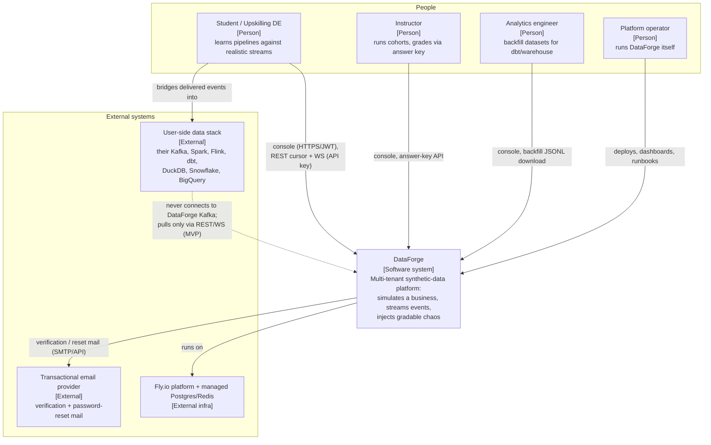
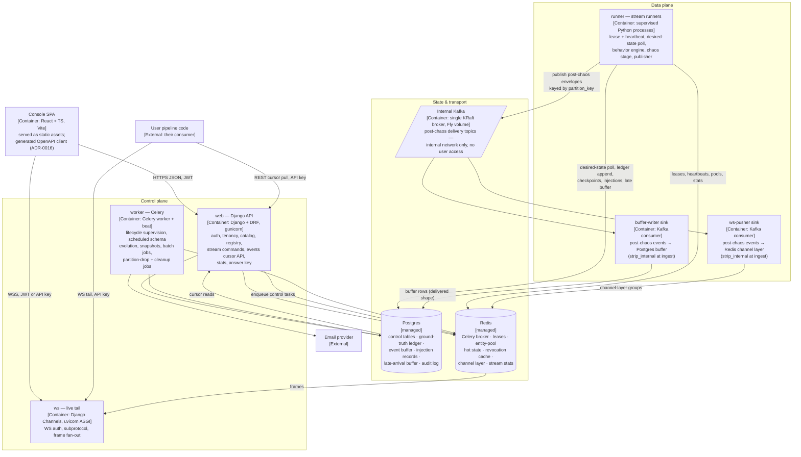
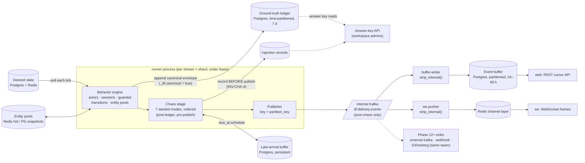
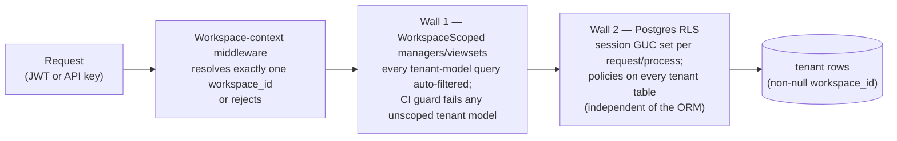

# DataForge — System Architecture

**Deliverable:** D2

This document is the structural map of DataForge: the C4 context and container views, the control-plane / data-plane split (ADR-0006), the internal Kafka backbone and the delivery-adapter seam (ADR-0005), the binding user consumption boundary, the end-to-end event flow from behavior engine to consumer, the full process inventory with dev-compose and Fly.io placement, the tenancy boundary overlaid on every storage and transport surface (ADR-0002), and the failure-domain / blast-radius analysis for each component. Terminology follows [../03-domain/domain-model.md](../03-domain/domain-model.md) exactly; the event contract that flows through everything here is [../03-domain/event-model.md](../03-domain/event-model.md); deployment mechanics live in [deployment-architecture.md](deployment-architecture.md); per-component capacity arithmetic lives in [scaling-strategy.md](scaling-strategy.md); SLOs that measure this architecture live in [observability.md](observability.md).

---

## 1. Architecture overview

DataForge is one logical system with two planes that share storage but never share a request path:

| Plane | Components | Character | Consistency |
|---|---|---|---|
| **Control plane** | Django/DRF API (`web`), Channels ASGI (`ws`, control frames only), Celery workers (`worker`), Postgres control tables, Redis (broker, revocation cache) | Low volume (≤ tens of req/s per tenant), CRUD + lifecycle commands, strongly consistent | Synchronous, transactional |
| **Data plane** | Stream runner processes (`runner`), internal Kafka backbone, chaos stage, buffer-writer and ws-pusher sinks, Postgres ledger/buffer, Redis entity pools and leases | High volume (1–1,000 TPS per stream MVP; 5k+ aggregate at GA; 100k staircase in [scaling-strategy.md](scaling-strategy.md)), throughput-oriented | Eventually consistent toward desired state (reconciliation, ADR-0006) |

Five structural rules govern every diagram in this document:

| # | Rule | Source |
|---|---|---|
| A-1 | Celery is control plane **only**; generation runs in long-lived, Redis-leased runner processes that reconcile desired state. A Celery task never generates events. | ADR-0006 |
| A-2 | Internal Kafka is the backbone from day one (in Docker Compose at Phase 1, carrying events at Phase 5); every delivery channel is a Kafka consumer adapter behind the `DeliveryChannel` interface. There is no interim transport and no substrate swap, ever. | ADR-0005 |
| A-3 | The data plane is a strict staged pipeline: **Behavior → ground-truth ledger → Chaos → internal Kafka → delivery sinks**. Stages never reach backward (chaos never touches pools; sinks never read the ledger). | ADR-0009, INV-CHA-1, INV-DEL-1 |
| A-4 | Every web/ws process is stateless and horizontally replicable; all stream state lives in Redis, Postgres, or Kafka. | NFR "stateless API layer" |
| A-5 | `workspace_id` rides every tenant-owned row, envelope, Kafka message key, Redis key, and counter; isolation is enforced at one chokepoint plus RLS as a second wall. | ADR-0002, INV-TEN-1 |

---

## 2. C4 Level 1 — system context



| Actor / system | Interaction surface | Protocol & credential |
|---|---|---|
| Console users (all personas) | SPA → `/api/v1/*`, `/ws/*` | HTTPS JSON + JWT (ADR-0011); WSS |
| Machine consumers (user pipeline code) | `/api/v1/streams/{id}/events` cursor pull; `/ws/streams/{id}/events` tail | API key `df_<env>_<prefix>_<secret>`, workspace-scoped |
| Transactional email provider | Outbound only (verification, password reset) | Provider HTTP API; secrets in Fly secrets store |
| User-side data stack | Receives events the **user** moved out of DataForge (the bridge exercise); Phase 12 adds hosted per-workspace Kafka topics and webhooks | User-owned; DataForge has no inbound dependency on it |
| Fly.io + managed Postgres/Redis | Hosting substrate | [deployment-architecture.md](deployment-architecture.md) |

---

## 3. C4 Level 2 — containers



| Container | Plane | Technology | Owns | Spec owner |
|---|---|---|---|---|
| Console SPA | — | React + TypeScript, Vite, TanStack Query | All 7 console page groups | [frontend-architecture.md](frontend-architecture.md) |
| `web` | Control | Django 5 + DRF, gunicorn (WSGI) | `/api/v1/*` REST surface incl. events cursor reads; serves SPA static assets via WhiteNoise in MVP | [backend-architecture.md](backend-architecture.md), [../05-interfaces/api-specification.md](../05-interfaces/api-specification.md) |
| `ws` | Control (delivery egress) | Django Channels, uvicorn (ASGI), Redis channel layer | `/ws/streams/{id}/events` versioned subprotocol | [../04-engines/delivery-channels.md](../04-engines/delivery-channels.md) |
| `worker` | Control | Celery (Redis broker) + one beat scheduler | Lifecycle supervision tasks, scheduled schema upgrades, pool snapshots, batch/backfill jobs, buffer/ledger partition-drop jobs, cleanup | [backend-architecture.md](backend-architecture.md) |
| `runner` | Data | Supervised long-lived Python processes | Shard leases, behavior engine, ledger append, chaos stage, Kafka publish, checkpoints | [../04-engines/behavior-engine.md](../04-engines/behavior-engine.md), [../04-engines/chaos-engine.md](../04-engines/chaos-engine.md) |
| `buffer-writer` | Data | Kafka consumer group `df.sink.rest-buffer.v1` | Post-chaos events → time-partitioned Postgres buffer (24–48 h TTL) | [../04-engines/delivery-channels.md](../04-engines/delivery-channels.md) |
| `ws-pusher` | Data | Kafka consumer group `df.sink.websocket.v1` | Post-chaos events → Redis channel-layer groups for `ws` fan-out | [../04-engines/delivery-channels.md](../04-engines/delivery-channels.md) |
| Postgres | State | Managed (Fly Postgres) | Control tables, ledger, buffer, injections, late-arrival buffer, audit, checkpoints, pool snapshots | [../03-domain/database-schema.md](../03-domain/database-schema.md) |
| Redis | State | Managed | Broker, leases, hot pools, revocation cache, channel layer, stats | [backend-architecture.md](backend-architecture.md) (key catalog) |
| Internal Kafka | Transport | Single-broker KRaft on a Fly VM + volume, internal network only | Post-chaos delivery topics | §7 here; topic naming/config in [backend-architecture.md](backend-architecture.md) |

---

## 4. The consumption boundary (binding, user-confirmed)

This section is the normative statement of the user-confirmed consumption model. Every other document defers to it; [../04-engines/delivery-channels.md](../04-engines/delivery-channels.md) restates it channel by channel.

> **Users never touch DataForge's internal Kafka.** It is server-side infrastructure — a Compose service in dev, an internal-network-only single-broker KRaft node on Fly.io in prod. In the MVP, users consume hosted DataForge **over the internet via cursor-based REST and WebSocket, authenticated by a workspace-scoped API key**. Bridging events into their own Kafka is *their* exercise, supported by connection guides. Post-MVP (Phase 12), users gain direct consumption from DataForge-hosted **per-workspace external Kafka topics** with SASL/SCRAM credentials and ACLs, plus HMAC-signed webhooks. Later still: S3/Iceberg/CDC export to user-provided storage.

The rules, individually testable:

| # | Rule | Enforcement |
|---|---|---|
| CB-1 | No network path exists from any user or tenant credential to the internal Kafka broker: it binds only to the Fly private network (dev: the Compose network), exposes no public listener, and **no tenant-issuable credential for it exists** in any phase. | Network policy in [deployment-architecture.md](deployment-architecture.md); negative test in [../06-quality/testing-strategy.md](../06-quality/testing-strategy.md) |
| CB-2 | MVP consumption surfaces are exactly two: `GET /api/v1/streams/{id}/events` (cursor, at-least-once, replayable within retention) and `WS /ws/streams/{id}/events` (best-effort tail). Per-channel guarantees: event-model §6. | [../05-interfaces/api-specification.md](../05-interfaces/api-specification.md) |
| CB-3 | The REST→user-Kafka bridge is a documented exercise (PRD E8), not a platform feature: DataForge ships connection guides (Kafka bridge, Spark, Flink, dbt), never broker credentials. | PRD §2.3, §5 |
| CB-4 | Phase 12 hosted per-workspace topics are a **separate external sink** behind the same `DeliveryChannel` seam — provisioned topics on a (by then managed, ADR-0015) broker surface with per-workspace SASL/ACL credentials. They are never the internal backbone topics. | ADR-0005, ADR-0015; [../04-engines/delivery-channels.md](../04-engines/delivery-channels.md) |
| CB-5 | Every consumption surface, current and future, authenticates with workspace-scoped API keys (or workspace-scoped sink credentials) and serves only that workspace's events (INV-DEL-6). | [../06-quality/security-architecture.md](../06-quality/security-architecture.md) |

Why this shape: it keeps the MVP operable (one internal broker, zero tenant-facing Kafka ops), keeps the teaching story honest (consuming an API and standing up your own Kafka *is* the curriculum for the student persona), and loses nothing architecturally — because every channel is already a consumer adapter (A-2), adding hosted topics in Phase 12 is another instance through an existing seam, not a redesign.

---

## 5. End-to-end event flow

### 5.1 Pipeline view



Three properties of this picture are load-bearing:

1. **The ledger is written before chaos may read (INV-GEN-5).** Business truth is durable and clean before any corruption exists; the answer key (ADR-0017) is a join of ledger + injection records, never a reconstruction.
2. **Kafka carries only the post-chaos stream.** The canonical stream's durable home is the Postgres ledger, not a topic; chaos is an in-runner transform between ledger append and publish (ADR-0009). Control flow (desired state, lifecycle commands) never rides Kafka — runners poll Postgres/Redis (ADR-0006).
3. **Sinks are symmetric.** buffer-writer, ws-pusher, and every Phase 12+ sink implement the same `DeliveryChannel` contract (`deliver(batch)`, cursor/ack, backpressure signal) and call the shared `strip_internal()` at ingest (event-model SB-2). Adding a channel changes zero generation-side code — the Phase 12 exit criterion.

### 5.2 One event's journey (sequence)

```mermaid
sequenceDiagram
    autonumber
    participant U as User (console/API)
    participant W as web (Django API)
    participant R as runner (shard lease holder)
    participant L as Postgres ledger
    participant K as internal Kafka
    participant B as buffer-writer
    participant PB as Postgres buffer
    participant C as Consumer (cursor client)

    U->>W: POST /api/v1/streams/{id}/start
    W->>W: quota guard (INV-TEN-5), audit entry
    W-->>U: 202 {status: "starting"}
    Note over R: poll sees desired=running,<br/>acquires lease (Redis), seeds/restores
    loop every tick (default 1 s; behavior-engine.md owns the loop)
        R->>R: behavior: guarded transitions, pool mutations
        R->>L: append canonical envelopes (batch)
        R->>R: chaos transform (seeded; records injections first)
        R->>K: publish post-chaos envelopes (key = partition_key)
    end
    K->>B: consumer-group fetch (batch)
    B->>PB: strip_internal() → insert delivered shape
    C->>W: GET /streams/{id}/events?cursor=…  (API key)
    W->>PB: scoped + RLS-guarded read
    W-->>C: 200 {data: […], next_cursor: …}
```

### 5.3 Hop latency budget (steady state, chaos-free, k = 1)

These budgets are what the Phase 6 soak and the data-plane SLO in [observability.md](observability.md) measure. They are per-hop p95 targets, not guarantees.

| Hop | Budget (p95) | Measured by |
|---|---|---|
| Behavior tick → ledger append committed | ≤ 500 ms | `df_ledger_append_duration_seconds` |
| Ledger append → Kafka publish acked (chaos transform included) | ≤ 500 ms | `df_kafka_publish_duration_seconds` |
| Kafka publish → buffer row visible to cursor reads | ≤ 2 s | `df_buffer_commit_lag_seconds` |
| Kafka publish → WS frame sent | ≤ 1 s | `df_ws_fanout_lag_seconds` |
| End-to-end: canonical `emitted_at` → REST-visible | ≤ 3 s p95; ≤ 30 s at the 99.0% SLO floor | data-plane SLI ([observability.md](observability.md) §7) |
| Stats counter staleness | ≤ 5 s (INV-OBS-2) | Phase 6 exit criterion |

### 5.4 Backpressure and flow control

Every stage either paces itself or signals upstream; nothing buffers unboundedly. The chain, downstream to upstream:

| Stage | Mechanism | When saturated |
|---|---|---|
| REST consumer | Client-paced by definition (cursor pull) | Falls behind → replays within retention; past retention → `410 cursor-expired` (INV-DEL-4) |
| WS consumer | Per-connection send queue, bounded (default 1,000 frames) | Drop-oldest with an explicit drop-notice frame carrying the dropped count (INV-DEL-5); never blocks the bridge |
| buffer-writer / ws-pusher | Kafka consumer groups — lag *is* the buffer; batch size adapts (`deliver(batch)` returns a backpressure signal per the `DeliveryChannel` contract) | Lag grows on the broker (6 h retention headroom, [backend-architecture.md](backend-architecture.md) §9.1); `ConsumerLagGrowing` alert ([observability.md](observability.md) §9); generation is **not** slowed — sinks must catch up or be scaled, the canonical record is already safe |
| Runner publisher | `acks=all` to the single broker; bounded in-flight batches | Publish failure/stall halts the tick loop **before** the next behavior step — generation never outruns delivery by more than the in-flight window (§9.1 Kafka row) |
| Behavior engine | Token-bucket pacing to `target_tps`; tick overruns counted (`df_runner_tick_overruns_total`) | A shard that cannot sustain its TPS is a capacity signal, never silent degradation — remedies per rung in [scaling-strategy.md](scaling-strategy.md) |
| Ledger append | Synchronous batch insert ahead of chaos/publish (INV-GEN-5) | Postgres slowness throttles the whole shard naturally — correctness-preserving by construction |
| Control plane | Per-key rate limits + quota guards at command time (INV-TEN-5) | `429` with RFC 9457 body; signup abuse controls in [../06-quality/security-architecture.md](../06-quality/security-architecture.md) |

---

## 6. Process inventory

One container image serves every backend process; the role is selected purely by start command. This guarantees code/config lockstep across planes (ADR-0001) and makes the inventory below a deployment matrix, not a build matrix.

| Logical process | Plane | Entrypoint (role) | Dev Compose service | Fly.io placement (ADR-0015) | First live | Replicas MVP → GA | Local state |
|---|---|---|---|---|---|---|---|
| `web` (Django API) | Control | `gunicorn config.wsgi` | `api` | Process group **web** | Phase 1 | 1 → 2+ | None (stateless; SPA assets baked into image) |
| `ws` (Channels) | Control | `uvicorn config.asgi` | `ws` | Process group **ws** (dedicated, per ADR-0013) | Phase 1 (stub) / Phase 6 (live) | 1 → 2+ | Socket connections only (clients reconnect) |
| `worker` (Celery) | Control | `celery -A config worker` | `worker` | Process group **worker** | Phase 1 | 1 → 2+ | None |
| `beat` (scheduler) | Control | `celery -A config beat` | `worker` (same container, supervised) | Singleton inside **worker** group (Redis lock guards double-start) | Phase 1 | exactly 1 | None |
| `runner` (stream runners) | Data | `python -m runner --role generation` (dev) / `--role all` (prod) | `runner` | Process group **runner** | Phase 1 (stub) / Phase 5 (live) | 1 → N (lease-sharded) | None durable (checkpoints in Postgres; pools in Redis) |
| buffer-writer sink | Data | sink consumer inside `python -m runner` (role `sinks`/`all`) | `buffer-writer` (stub Phase 1) | Supervised child **inside the runner process group** (see placement note) | Phase 5 | 1 per runner VM | Kafka consumer-group offsets (in Kafka) |
| ws-pusher sink | Data | sink consumer inside `python -m runner` (role `sinks`/`all`) | `buffer-writer` (same dev container) | Supervised child inside the **runner** group | Phase 6 | 1 per runner VM | Consumer-group offsets |
| Frontend dev server | — | `vite dev` | `web` | — (prod SPA is static assets served by `web` via WhiteNoise; CDN is a post-GA refinement owned by [frontend-architecture.md](frontend-architecture.md)) | Phase 1 | dev only | — |
| Kafka (KRaft) | Transport | upstream image | `kafka` | Dedicated Fly machine + volume, private network only | Phase 1 | exactly 1 (until ADR-0015 trigger) | Topic log on volume |
| Postgres | State | managed | `postgres` | Fly managed Postgres | Phase 1 | primary (+ standby at GA) | All durable state |
| Redis | State | managed | `redis` | Managed Redis | Phase 1 | 1 | Ephemeral-by-contract (every Redis structure is rebuildable or lease-style) |

**Buffer-writer placement (decided here):** in the MVP Fly topology, each `runner` VM's supervisor (`python -m runner --role all`) starts, alongside its shard runners, exactly one buffer-writer and one ws-pusher sink consumer. The sinks join Kafka consumer groups (`df.sink.rest-buffer.v1`, `df.sink.websocket.v1` — [backend-architecture.md](backend-architecture.md) §8.6), so adding runner VMs scales sink consumption and generation together — the common case, since both loads grow with aggregate TPS. The four ADR-0015 process groups (web/ws/worker/runner) are preserved. **Pre-committed split trigger:** when sink CPU contends with generation on runner VMs (sustained runner-VM CPU > 70% with `df_kafka_consumer_lag` growing — the Phase 11 load test measures this), sinks move to a fifth `sink` process group; because the role is command-selected from the same image, the split is a `fly.toml` change only. Refined in Phase 11 with measured numbers; what exists until then is the co-located topology above.

**Health surfaces:** `web` and `ws` serve `/healthz` and `/readyz` on their service ports; the `runner` entrypoint (and therefore the dev `buffer-writer` container) serves both on its internal aiohttp listener `:8081` ([backend-architecture.md](backend-architecture.md) §8.1); `worker` exposes the TCP health port `:8092` ([deployment-architecture.md](deployment-architecture.md) §3.2); every process exposes Prometheus metrics on `DF_METRICS_PORT` (default 9091) at `/metrics`. Semantics per process: [observability.md](observability.md) §6.

### 6.1 Scaling axes per component

How each component grows, in one table — the arithmetic per rung (how many of each at 1k / 5k / 25k / 100k TPS) is [scaling-strategy.md](scaling-strategy.md)'s deliverable; the *axes* are fixed here so no rung changes the shape.

| Component | Scaling axis | Unit of parallelism | Hard coupling |
|---|---|---|---|
| `web` | Horizontal replicas behind the LB | Process (stateless, A-4) | Postgres connection budget (PgBouncer at GA) |
| `ws` | Horizontal replicas; connections distribute | Process; channel-layer groups span instances | Redis channel-layer throughput |
| `worker` | Horizontal replicas per queue | Celery worker process | Redis broker; `beat` stays a singleton |
| `runner` | More VMs → more claimable shard leases | (stream, shard) lease | Shards per stream (1 in MVP; N at Phase 11) bound per-stream ceiling |
| Stream throughput | Shard count per stream (Phase 11) | Shard = actor partition by `partition_key` hash | Per-shard ordering scope (event-model §2.2.2) is preserved by design |
| Kafka | Partition count, then managed multi-broker (ADR-0015) | Topic partition | Partition count ≥ active sink consumers per group for full parallelism |
| `buffer-writer` / `ws-pusher` | Consumer-group membership (grows with runner VMs; dedicated `sink` group after the split trigger) | Consumer instance | ≤ partition count consumers do useful work |
| Postgres | Vertical + table partitioning (ledger/buffer by time) first; read replicas post-GA | Partition / replica | Buffer ingest write throughput is a named staircase bottleneck ([scaling-strategy.md](scaling-strategy.md)) |
| Redis | Vertical; functional split (broker vs pools vs channel layer onto separate instances) at the rung where contention appears | Logical database / instance | Entity-pool memory per stream bounded by manifest B-08/B-09 |

---

## 7. Internal Kafka backbone

### 7.1 Topic layout and tenancy budgeting (decided here)

The internal backbone uses **shared multi-tenant topics, not topic-per-stream or topic-per-workspace**:

| Aspect | Decision | Rationale |
|---|---|---|
| Topic family | One logical delivery topic, `df.delivery.events`, MVP default **12 partitions** (single broker). Exact naming conventions and broker configs are owned by [backend-architecture.md](backend-architecture.md); partition counts per scaling rung by [scaling-strategy.md](scaling-strategy.md). | A classroom future (thousands of workspaces × tens of streams) makes per-stream topics a partition-exhaustion and broker-metadata bomb on a single broker; shared topics keep partition count a function of *throughput*, not tenant count. |
| Message key | `partition_key` (workspace-prefixed, event-model §2.2.3), so per-key FIFO gives per-actor/per-entity ordering inside shared topics and tenant attribution is inspectable at the broker. | ADR-0002, ADR-0004 |
| Tenant isolation on the backbone | Not credential-based — **no tenant has any backbone credential** (CB-1). Isolation is achieved at the edges: runners stamp `workspace_id` into every envelope and key; sinks write into workspace-scoped storage (buffer rows under RLS, channel groups named by workspace+stream). | ADR-0002; §8 |
| Per-workspace fairness | Enforced upstream of Kafka by quota TPS caps (PRD §7: per-stream and aggregate workspace caps) and concurrent-stream limits — a workspace cannot publish more than its quota admits, so no Kafka-level quota mechanism is needed in MVP. Broker-side produce quotas become available (and necessary) only at the managed-Kafka rung; [scaling-strategy.md](scaling-strategy.md) owns that arithmetic. | INV-TEN-5 |
| Retention | Delivery topics retain **24 h** — enough for sink restart/recovery and consumer-lag incidents, deliberately ≤ the Postgres buffer retention so the buffer (not Kafka) is always the replay surface users depend on. | ADR-0013 |
| Late re-emissions | Published by the chaos late-arrival scheduler to the **same** delivery topic at `due_at`; they are ordinary post-chaos messages. | [../04-engines/chaos-engine.md](../04-engines/chaos-engine.md) |
| Per-workspace **external** topics | Phase 12 feature on a managed broker with SASL/SCRAM + ACLs, provisioned per workspace as a sink. Capacity budget (topics/partitions per workspace, retention) is defined in [../04-engines/delivery-channels.md](../04-engines/delivery-channels.md) when that sink's contract is specified — it never affects the internal backbone layout. | ADR-0005, ADR-0015 |

### 7.2 Broker posture and the migration trigger

MVP Kafka is a **single KRaft broker** on a dedicated Fly machine with a volume, reachable only on the private network (dev: single-node KRaft in Compose — same topology, no swap between dev and prod shapes). Replication factor 1; durability for events does not depend on Kafka (the ledger and buffer are Postgres) — Kafka loss is an *availability* event for delivery, not a *data-loss* event for business truth (§9).

The pre-committed migration trigger to managed Kafka (Confluent/Redpanda/Upstash), any one sufficient (ADR-0015):

1. The external Kafka delivery channel ships (Phase 12), **or**
2. Sustained aggregate TPS exceeds ~5,000, **or**
3. The availability SLO ([observability.md](observability.md) §7) is breached by broker incidents.

Broker endpoints are configuration; the swap is infra-only.

---

## 8. Tenancy boundary overlay

The tenant is the **workspace** (never the user account). The boundary is enforced independently on every surface; a cross-tenant breach requires at least two simultaneous control failures (INV-G-1).



| Surface | `workspace_id` carrier | Enforcement mechanism | Spec owner |
|---|---|---|---|
| HTTP API (`web`) | Request context (from key scope or JWT + workspace path param) | Middleware + mandatory `WorkspaceScoped` managers + CI guard | [../06-quality/security-architecture.md](../06-quality/security-architecture.md) |
| Postgres (all tenant tables: streams, instances, keys, ledger, buffer, injections, late buffer, audit, checkpoints, snapshots) | Non-null `workspace_id` column | RLS policies from Phase 2 (second wall, ORM-independent); verified with ORM bypassed in the cross-tenant attack suite | [../03-domain/database-schema.md](../03-domain/database-schema.md) |
| Internal Kafka | First segment of `partition_key` on every message key; `workspace_id` field in every envelope | No tenant access at all (CB-1); sinks route by envelope `workspace_id` into scoped storage | this doc §7 |
| Redis | Key convention: every tenant-scoped key is prefixed `df:ws:{workspace_id}:…` (pools, stats, chaos config cache); platform keys (`df:lease:…`, broker queues) carry stream/shard ids that resolve to a workspace | Key-prefix convention + the only readers are platform processes; full key catalog in [backend-architecture.md](backend-architecture.md) | [backend-architecture.md](backend-architecture.md) |
| Channels (WS) | Group name `events.{workspace_id}.{stream_id}` | `ws` authenticates the key/JWT, resolves workspace, and only joins matching groups; group membership is the isolation unit | [../04-engines/delivery-channels.md](../04-engines/delivery-channels.md) |
| Stats & metrics | Redis stats keys carry the prefix; Prometheus metrics never carry tenant labels (cardinality rule, [observability.md](observability.md) §4.1) | INV-OBS-3 | [observability.md](observability.md) |
| Audit | `workspace_id` column (nullable only for account-level events) | Admin-scoped query API; RLS | domain model §2.10 |
| Cross-tenant attack suite | — | Permanent CI gate from Phase 2: every endpoint probed with foreign-workspace credentials must return 403/404 | [../06-quality/testing-strategy.md](../06-quality/testing-strategy.md) |

Data-plane corollary (INV-STR-6): a stream's shards, leases, checkpoints, Kafka keys, buffer rows, injection records, and late-buffer entries all carry its `workspace_id` — the tenancy walls hold even for processes that never see an HTTP request.

---

## 9. Failure domains and blast radius

Single-region MVP honesty up front: **Postgres and the single Kafka broker are platform-wide failure domains.** Everything else degrades partially. This is the architectural fact behind the SLO posture in [observability.md](observability.md) §7 (single-region MVP cannot honestly target 99.9%) and behind the ADR-0015 migration trigger.

### 9.1 Per-component analysis

| Component | Failure mode | Blast radius (user-visible) | Detection | Recovery | Data-loss exposure |
|---|---|---|---|---|---|
| One `web` instance | Crash / OOM | In-flight requests on that instance fail; others unaffected (stateless, A-4) | Fly health checks (`/healthz`) | Fly restarts; LB routes around; seconds | None |
| All `web` instances (bad deploy) | 5xx on console + REST consumption | Control plane down; **streams keep generating** (runners reconcile from stored desired state, not from `web`); WS unaffected until token refresh | SLO fast-burn alert | Rollback (image pin); minutes | None |
| One `ws` instance | Crash | Connected sockets drop; clients reconnect with backoff and resume-from-cursor (ADR-0016, ADR-0013); WS is at-most-once anyway | Fly health checks | Restart; clients re-handshake | None beyond WS's documented at-most-once semantics |
| `worker` / `beat` | Crash, queue backlog | Lifecycle commands and scheduled jobs (partition drops, snapshots, schema upgrades, backfills) delayed; **running streams unaffected** (A-1: Celery is not in the generation path) | `df_celery_queue_depth`, beat-heartbeat alert | Restart; tasks are idempotent and re-queued | None (tasks idempotent); retention drift if partition-drop jobs stall long enough — alarmed via buffer-age metric |
| One `runner` VM | Crash / host loss | Streams whose shard leases lived there stall ≤ 15 s (lease TTL), then fail over: another runner claims the expired lease and restores from checkpoint within **30 s** total (Phase 5 kill-test). Stream stays `running`; co-located buffer-writer/ws-pusher instances drop out and their consumer groups rebalance | Lease-expiry + heartbeat-gap metrics | Automatic failover (ADR-0006); fencing tokens prevent dual emission (INV-STR-2) | None canonical (ledger + checkpoint). Events between last checkpoint (≤ 30 s old) and crash are **re-derived deterministically** (INV-GEN-3) and may be re-published → at-least-once duplicates, within the delivered-stream contract |
| All `runner` capacity | No lease acquired in 60 s | New starts fail to `failed` (T4); running streams stall | `df_runner_active_leases` vs desired | Scale/restart runner group | None |
| `buffer-writer` (all instances) | Consumer stall | REST consumption goes stale (cursor reads return no new events); generation, ledger, WS unaffected | `df_kafka_consumer_lag{group="df.sink.rest-buffer.v1"}` growth alert | Restart; resumes from committed offsets; Kafka's 6 h topic retention is the catch-up window | None if recovered within topic retention; beyond that, gap in the *buffer* only — canonical truth still in ledger |
| `ws-pusher` (all instances) | Consumer stall | Live tails go silent; REST unaffected | Consumer-lag alert | Restart; tail resumes (no replay on WS by contract) | None (WS is at-most-once) |
| **Kafka broker** (single, MVP) | Down / volume loss | **All delivery halts platform-wide**: nothing new reaches buffer or WS. Runners stall at the publish stage and stop advancing (backpressure — ledger-ahead-of-publish divergence is bounded to in-flight batches); streams stay `running` with a platform incident banner | `/readyz` Kafka probe on runners + broker-down alert | Restart broker / restore volume; runners re-run the deterministic chaos transform from the last published position and resume. Volume loss: recreate topics, resume from ledger positions — delivered duplicates possible, never canonical loss | None for business truth (ledger is Postgres). Delivery availability loss only — this is why broker incidents are an SLO-breach trigger for managed Kafka (§7.2) |
| **Postgres** | Down / failover | **Platform-wide outage**: control plane 5xx; runners halt (cannot append ledger — generation never outruns durable truth, INV-GEN-5); buffer writes fail; only already-connected WS tails continue briefly until the bridge stalls | Everything's `/readyz`; SLO fast burn | Managed-Postgres failover (minutes); runners resume from checkpoints | Bounded by Postgres durability (managed backups + WAL; restore rehearsal is a Phase 11 exit criterion) |
| **Redis** | Down / flush | Leases unverifiable → runners **fail safe**: a runner that cannot heartbeat stops emitting within one lease TTL (15 s). API-key revocation cache falls back to per-request DB lookup (fail-closed correctness, slower). Channel layer down → WS frames stop. Hot entity pools lost → on recovery, runners restore pools from the last Postgres snapshot + checkpoint and re-derive deterministically ([../04-engines/behavior-engine.md](../04-engines/behavior-engine.md) owns restore semantics) | `/readyz` Redis probes | Managed-Redis restart; runners re-acquire leases and restore | None canonical; stats counters reset (rebuildable, domain §2.9) |
| Fly region | Region outage | Full platform outage — single-region MVP, stated honestly | External uptime probe | Region recovery; multi-region is the post-GA availability path ([observability.md](observability.md) §7.4, [scaling-strategy.md](scaling-strategy.md)) | None (Postgres backups are off-VM) |
| Pathological tenant (manifest or chaos abuse) | Resource exhaustion attempt | Bounded by design, not ops: manifest resource bounds + dry-run budget (scenario-plugin §8, B-01…B-17), quota TPS/stream caps (INV-TEN-5), per-key rate limits, chaos rate cap ≤ 0.5 (B-16). Worst case degrades only that workspace's streams | Quota metrics, validation rejections | Quota pause (`paused_quota`), key revocation | None |

### 9.2 Shared-fate summary

| Failure domain | Members (shared fate) | Isolation between domains |
|---|---|---|
| Per-request | One `web`/`ws` process | Stateless; LB |
| Per-stream-shard | One lease, one checkpoint lineage, one slice of pool state | Lease fencing; per-shard checkpoints |
| Per-runner-VM | Its shard leases + its sink consumer instances | Lease failover + consumer-group rebalance |
| Per-plane | Control plane can be fully down while streams generate; data-plane delivery can stall while control plane serves | Desired-state reconciliation is the only coupling, and it is a poll |
| Platform-wide (MVP) | Postgres; Kafka broker; Fly region | None in MVP — eliminated stepwise post-GA (managed Kafka → HA Postgres → multi-region), per the availability roadmap in [observability.md](observability.md) §7.4 |

The plane separation is the architecture's best operational property and is preserved deliberately: **no control-plane outage stops event generation, and no data-plane stall blocks the control plane.** The only shared dependencies are the stores (Postgres, Redis) — which is exactly why their failure rows above are the worst ones.

---

## 10. Ownership boundaries

What this document deliberately does not specify, and where it lives:

| Concern | Owner |
|---|---|
| Django app layering, Kafka topic naming/configs, Redis key catalog, lease-fencing implementation | [backend-architecture.md](backend-architecture.md) |
| Compose file contents, fly.toml process groups, secrets, env promotion, Kafka VM sizing | [deployment-architecture.md](deployment-architecture.md) |
| Capacity arithmetic per scaling rung (runner ceilings, partition counts, buffer ingest limits) | [scaling-strategy.md](scaling-strategy.md) |
| Log schema, metrics catalog, health/readiness semantics, SLOs, error budget, audit catalog | [observability.md](observability.md) |
| Envelope contract, strip boundary, per-channel guarantees | [../03-domain/event-model.md](../03-domain/event-model.md) |
| Sink interface (`DeliveryChannel`), REST/WS/external-channel contracts | [../04-engines/delivery-channels.md](../04-engines/delivery-channels.md) |
| Tenancy enforcement stack details, key lifecycle, threat models | [../06-quality/security-architecture.md](../06-quality/security-architecture.md) |
| Tables, partitioning, RLS DDL | [../03-domain/database-schema.md](../03-domain/database-schema.md) |
