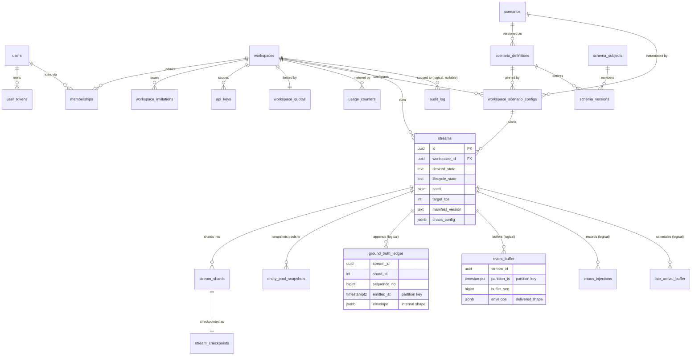

# DataForge — Database Schema

**Deliverable:** D4

This document is the full PostgreSQL schema for DataForge: every table with DDL-style listings (columns, types, defaults, keys, indexes), the time-partitioning and retention design for the high-volume data-plane tables (ground-truth ledger, event buffer, chaos injections, audit log), the REST cursor encoding over the buffer, the Row-Level Security model that backstops tenancy (ADR-0002), and the migration policy. Domain semantics and invariants (`INV-*`) are owned by [domain-model.md](domain-model.md); the envelope content stored in the ledger and buffer is frozen in [event-model.md](event-model.md); manifest content stored in `scenario_definitions` is contracted in [../04-engines/scenario-plugin-architecture.md](../04-engines/scenario-plugin-architecture.md). This document is the **persistence authority**: any column, constraint, or partition rule cited elsewhere must match what is written here.

---

## 1. Conventions and global decisions

| # | Decision | Rationale |
|---|---|---|
| C-1 | **PostgreSQL 16**, single database, single schema (`public`). No schema-per-tenant, no db-per-tenant (ADR-0002). | One enforcement chokepoint; RLS as second wall. |
| C-2 | **Table names are fixed here** and set explicitly via Django `Meta.db_table` (no app-name prefixes). One Django app per bounded context per domain-model §1.3; table↔app mapping in §2.1. | Specs, SQL, and code reference identical names. |
| C-3 | **Primary keys are `uuid`**, generated app-side (UUIDv7 for time-ordered rows: audit entries, injections, tokens; UUIDv4 otherwise). No DB-side `gen_random_uuid()` defaults — the app is the id authority so ids exist before commit (needed for the workspace-creation RLS flow, §9.4). | Deterministic ids where required; no sequence coupling. |
| C-4 | **Timestamps are `timestamptz`**, always UTC. Columns holding simulated (virtual-clock) time are explicitly marked `-- simulated` in DDL comments; everything else is wall-clock (clock-domain table: event-model §3.5). | INV-GEN-4 clock-domain hygiene extends into the schema. |
| C-5 | **Enumerations are `text` + named `CHECK` constraints**, never PG `ENUM` types. | Additive evolution without `ALTER TYPE`; plays well with expand/contract (§10). |
| C-6 | **`jsonb` for documents** (manifests, overrides, envelopes, chaos details). Note: `jsonb` does not preserve key order. Canonical envelope byte-form (event-model S-2) is *re-derivable* deterministically from content, so ledger storage as `jsonb` is sound; golden-seed tests compare canonical re-serialization, not stored bytes. `jsonb` output is itself deterministic, which is what makes REST replay byte-stable within the buffer's stored form (INV-DEL-3, event-model S-3). | Queryability + replay stability without dual storage. |
| C-7 | **Foreign keys exist on control-plane tables only** (`ON DELETE RESTRICT` unless stated). The four high-volume partitioned tables (`ground_truth_ledger`, `event_buffer`, `chaos_injections`, `audit_log`) and `late_arrival_buffer` carry **no FK constraints**: per-row FK checks at data-plane write rates and FK interactions with partition drop are unacceptable. Integrity there is app-enforced, and `workspace_id` is denormalized onto every row (INV-TEN-1). | Throughput and partition-drop safety. |
| C-8 | **Every tenant-owned row carries a direct non-null `workspace_id` column** — including child tables that could derive it by join (e.g. `stream_checkpoints`). RLS policies never join (§9.3). The two hybrid catalogs (scenarios, registry) carry a *nullable* `workspace_id` where `NULL` = platform-global (§4, §9.5). | INV-TEN-1; O(1) policy evaluation. |
| C-9 | Workspace deletion is an **orchestrated app process** (stop streams → revoke keys → tombstone audit → delete rows), not a DB cascade. `users.deleted_at` / `workspaces.deleted_at` are soft-delete tombstones; hard row deletion of tenant data follows the retention matrix (§8.3). | INV-TEN-6; no accidental cascades. |
| C-10 | **Money is never stored as float** anywhere: monetary values inside envelopes are decimal strings (event-model S-6); the schema has no monetary columns of its own. | Contract consistency. |
| C-11 | Required extensions: none beyond core PG 16 (`gen_random_uuid` unused per C-3; no `pg_partman` — partition management is in-house, §8.2; no `citext` — case-insensitive email via functional index, §3.1). | Fly.io managed-Postgres portability. |

---

## 2. Schema overview

### 2.1 Table inventory

| Table | Context (app) | Tenant-owned | Partitioned | Lands in phase |
|---|---|---|---|---|
| `users` | Identity (`identity`) | No (§9.6) | — | 2 |
| `user_tokens` | Identity (`identity`) | No (§9.6) | — | 2 |
| `workspaces` | Tenancy (`tenancy`) | Self (§9.4) | — | 2 |
| `memberships` | Tenancy (`tenancy`) | Yes (+user read, §9.4) | — | 2 |
| `workspace_invitations` | Tenancy (`tenancy`) | Yes | — | 2 |
| `api_keys` | Tenancy (`tenancy`) | Yes | — | 2 |
| `workspace_quotas` | Tenancy (`tenancy`) | Yes | — | 2 (enforced 11) |
| `usage_counters` | Tenancy (`tenancy`) | Yes | — | 5 (enforced 11) |
| `scenarios` | Scenario Catalog (`catalog`) | Hybrid (global/workspace) | — | 3 |
| `scenario_definitions` | Scenario Catalog (`catalog`) | Hybrid | — | 3 |
| `workspace_scenario_configs` | Scenario Catalog (`catalog`) | Yes | — | 3 |
| `schema_subjects` | Schema Registry (`registry`) | Hybrid | — | 3 |
| `schema_versions` | Schema Registry (`registry`) | Hybrid | — | 3 |
| `streams` | Stream Control (`streams`) | Yes | — | 5 |
| `stream_shards` | Stream Control (`streams`) | Yes | — | 5 |
| `stream_checkpoints` | Generation (`generation`) | Yes | — | 5 |
| `entity_pool_snapshots` | Generation (`generation`) | Yes | — | 4 |
| `ground_truth_ledger` | Generation (`generation`) | Yes | RANGE, daily | 4 |
| `event_buffer` | Delivery (`delivery`) | Yes | RANGE, hourly | 5 |
| `chaos_injections` | Chaos (`chaos`) | Yes | RANGE, daily | 9 |
| `late_arrival_buffer` | Chaos (`chaos`) | Yes | — | 9 |
| `audit_log` | Audit (`audit`) | Yes (nullable ws, §9.5) | RANGE, monthly | 2 |

Django framework tables (`django_migrations`, `django_content_type`, auth scaffolding, Celery results if enabled) are platform-internal, contain no tenant data, and are out of RLS scope.

### 2.2 Entity-relationship diagram

FK lines on partitioned data-plane tables are *logical* (no DB constraint, per C-7).



---

## 3. Identity and tenancy

### 3.1 `users` — accounts (Identity)

Workspace-agnostic by design (domain model §2.1). **Not tenant-owned**; see §9.6.

```sql
CREATE TABLE users (
    id              uuid PRIMARY KEY,
    email           text NOT NULL,                 -- normalized lowercase at the boundary
    password_hash   text NOT NULL,                 -- algorithm owned by security-architecture.md
    is_verified     boolean NOT NULL DEFAULT false,
    created_at      timestamptz NOT NULL DEFAULT now(),
    updated_at      timestamptz NOT NULL DEFAULT now(),
    deleted_at      timestamptz NULL               -- soft-delete tombstone (INV-ID-4)
);

-- INV-ID-1: case-insensitive uniqueness across non-deleted users
CREATE UNIQUE INDEX users_email_uq ON users (lower(email)) WHERE deleted_at IS NULL;
```

### 3.2 `user_tokens` — verification and reset tokens (Identity)

One table for both single-use token kinds (domain model: TTL 24 h verification, 1 h reset, enforced via `expires_at` set at issuance).

```sql
CREATE TABLE user_tokens (
    id           uuid PRIMARY KEY,                          -- UUIDv7
    user_id      uuid NOT NULL REFERENCES users (id) ON DELETE CASCADE,
    kind         text NOT NULL
                 CONSTRAINT user_tokens_kind_ck
                 CHECK (kind IN ('email_verification', 'password_reset')),
    token_hash   text NOT NULL UNIQUE,                      -- SHA-256 hex; plaintext never stored
    expires_at   timestamptz NOT NULL,
    consumed_at  timestamptz NULL,                          -- INV-ID-3: single-use
    created_at   timestamptz NOT NULL DEFAULT now()
);

CREATE INDEX user_tokens_user_kind_ix ON user_tokens (user_id, kind);
```

Issuing a new token of a kind marks prior unconsumed tokens of that kind consumed (supersession, INV-ID-3) — app-enforced in one transaction. Expired/consumed rows are purged after 30 days (§8.3).

### 3.3 `workspaces` — the tenant (Tenancy)

```sql
CREATE TABLE workspaces (
    id          uuid PRIMARY KEY,
    name        text NOT NULL CHECK (char_length(name) BETWEEN 1 AND 100),
    slug        text NOT NULL CHECK (slug ~ '^[a-z][a-z0-9-]{1,38}[a-z0-9]$'),
    plan        text NOT NULL DEFAULT 'free'
                CONSTRAINT workspaces_plan_ck CHECK (plan IN ('free', 'classroom', 'pro')),
    created_by  uuid NOT NULL REFERENCES users (id),
    created_at  timestamptz NOT NULL DEFAULT now(),
    updated_at  timestamptz NOT NULL DEFAULT now(),
    deleted_at  timestamptz NULL                   -- tombstone; INV-TEN-6 cascade is app-orchestrated
);

CREATE UNIQUE INDEX workspaces_slug_uq ON workspaces (slug) WHERE deleted_at IS NULL;
```

### 3.4 `memberships` — (user, workspace, role) (Tenancy)

```sql
CREATE TABLE memberships (
    id            uuid PRIMARY KEY,
    workspace_id  uuid NOT NULL REFERENCES workspaces (id),
    user_id       uuid NOT NULL REFERENCES users (id),
    role          text NOT NULL
                  CONSTRAINT memberships_role_ck CHECK (role IN ('admin', 'member')),
    created_at    timestamptz NOT NULL DEFAULT now(),
    CONSTRAINT memberships_user_ws_uq UNIQUE (user_id, workspace_id)   -- INV-TEN-2
);

CREATE INDEX memberships_ws_role_ix ON memberships (workspace_id, role);
```

**INV-TEN-3 (sole-admin rule) is application-enforced**, not a DB constraint: it is a cross-row invariant ("≥ 1 admin remains"), checked inside the demote/remove/delete transaction under `SELECT … FOR UPDATE` on the workspace's admin memberships. A trigger-based guard was considered and rejected: the workspace-deletion path legitimately removes the last admin, and encoding that exception in a trigger duplicates app-layer orchestration (C-9).

### 3.5 `workspace_invitations` — classroom onboarding (Tenancy)

```sql
CREATE TABLE workspace_invitations (
    id            uuid PRIMARY KEY,                -- UUIDv7
    workspace_id  uuid NOT NULL REFERENCES workspaces (id),
    email         text NOT NULL,                   -- normalized lowercase
    role          text NOT NULL DEFAULT 'member'
                  CONSTRAINT ws_invites_role_ck CHECK (role IN ('admin', 'member')),
    token_hash    text NOT NULL UNIQUE,
    invited_by    uuid NOT NULL REFERENCES users (id),
    expires_at    timestamptz NOT NULL,            -- issuance sets now() + 7 days
    accepted_at   timestamptz NULL,
    created_at    timestamptz NOT NULL DEFAULT now()
);

-- one open invitation per address per workspace
CREATE UNIQUE INDEX ws_invites_open_uq
    ON workspace_invitations (workspace_id, lower(email)) WHERE accepted_at IS NULL;
```

### 3.6 `api_keys` — data-plane credentials (Tenancy, ADR-0011)

Key format `df_<env>_<prefix>_<secret>`; the stored `key_prefix` is the full public part up to the secret (`df_live_a1b2c3d4`), unique, used for O(1) lookup before hash comparison. Revocation takes effect ≤ 1 s via the Redis revocation cache (security-architecture owns the cache); this table is the durable truth.

```sql
CREATE TABLE api_keys (
    id            uuid PRIMARY KEY,
    workspace_id  uuid NOT NULL REFERENCES workspaces (id),
    name          text NOT NULL CHECK (char_length(name) BETWEEN 1 AND 100),
    key_prefix    text NOT NULL UNIQUE,            -- e.g. 'df_live_a1b2c3d4'
    key_hash      text NOT NULL UNIQUE,            -- SHA-256 hex of the full key (INV-TEN-4)
    last4         text NOT NULL CHECK (last4 ~ '^[A-Za-z0-9]{4}$'),
    scopes        text[] NOT NULL
                  CONSTRAINT api_keys_scopes_ck CHECK (
                      scopes <@ ARRAY['events:read','streams:read','streams:write',
                                      'schemas:read','answer_key:read']::text[]
                      AND cardinality(scopes) >= 1),
    created_by    uuid NOT NULL REFERENCES users (id),
    created_at    timestamptz NOT NULL DEFAULT now(),
    expires_at    timestamptz NULL,                -- null = non-expiring (domain model §5)
    revoked_at    timestamptz NULL,                -- terminal (no reactivation)
    revoked_by    uuid NULL REFERENCES users (id),
    last_used_at  timestamptz NULL                 -- write-behind, minute precision sufficient
);

CREATE INDEX api_keys_ws_ix ON api_keys (workspace_id);
```

Derived state (no stored status column): `active` ⇔ `revoked_at IS NULL AND (expires_at IS NULL OR expires_at > now())`.

### 3.7 `workspace_quotas` — plan-tier limits (Tenancy, PRD §7)

One row per workspace, created in the workspace-creation transaction with Free-tier defaults; values are per-workspace copies so plan upgrades and bespoke classroom licenses are row updates, not code. Enforcement is command-time app logic (INV-TEN-5), fully wired in Phase 11.

```sql
CREATE TABLE workspace_quotas (
    workspace_id            uuid PRIMARY KEY REFERENCES workspaces (id),
    max_members             integer NOT NULL DEFAULT 3,
    max_concurrent_streams  integer NOT NULL DEFAULT 2,
    per_stream_tps_cap      integer NOT NULL DEFAULT 50,
    aggregate_tps_cap       integer NOT NULL DEFAULT 100,
    events_per_day          bigint  NOT NULL DEFAULT 1000000,
    buffer_retention_hours  integer NOT NULL DEFAULT 24
                            CONSTRAINT ws_quotas_retention_ck
                            CHECK (buffer_retention_hours IN (24, 48)),
    backfill_max_days       integer NOT NULL DEFAULT 7,
    backfill_max_events     bigint  NOT NULL DEFAULT 1000000,
    idle_pause_minutes      integer NOT NULL DEFAULT 120,
    max_api_keys            integer NOT NULL DEFAULT 5,
    updated_at              timestamptz NOT NULL DEFAULT now()
);
```

Tier values (Free / Classroom / Pro) are exactly PRD §7; the Classroom row example: `60, 20, 100, 1000, 10000000, 48, 30, 5000000, 480, 100`.

### 3.8 `usage_counters` — events/day metering (Tenancy)

Durable copy of the hot Redis counters: runners increment Redis per emission; a Celery flush task upserts deltas here every 30 s. The quota check (Phase 11) reads Redis, falling back to this table on cache loss. Window is the UTC wall-clock day (event-model §3.5: quota windows are wall time).

```sql
CREATE TABLE usage_counters (
    workspace_id      uuid NOT NULL REFERENCES workspaces (id),
    window_date       date NOT NULL,               -- UTC day
    events_generated  bigint NOT NULL DEFAULT 0,   -- canonical ledger appends (the quota basis)
    events_delivered  bigint NOT NULL DEFAULT 0,   -- post-chaos instances handed to sinks
    backfill_events   bigint NOT NULL DEFAULT 0,
    updated_at        timestamptz NOT NULL DEFAULT now(),
    PRIMARY KEY (workspace_id, window_date)
);
```

**Quota basis decision:** `events_generated` (canonical events appended to the ledger, including CDC) is what counts against `events_per_day` — chaos duplicates do not double-bill, and the number is deterministic per seed. Rows older than 13 months are purged (§8.3) — long enough for the PRD §8 metric windows.

---

## 4. Scenario catalog and schema registry

### 4.1 `scenarios` — scenario roots (Scenario Catalog)

Hybrid ownership: `workspace_id IS NULL` ⇔ `visibility = 'global'` (platform-curated, e.g. the builtin `ecommerce`); workspace-visible rows are tenant-owned — the seam for future AI-generated manifests (domain model §2.3).

```sql
CREATE TABLE scenarios (
    id            uuid PRIMARY KEY,
    slug          text NOT NULL CHECK (slug ~ '^[a-z][a-z0-9_]{0,31}$'),
    title         text NOT NULL,
    description   text NOT NULL DEFAULT '',
    visibility    text NOT NULL
                  CONSTRAINT scenarios_visibility_ck CHECK (visibility IN ('global', 'workspace')),
    workspace_id  uuid NULL REFERENCES workspaces (id),
    created_at    timestamptz NOT NULL DEFAULT now(),
    CONSTRAINT scenarios_visibility_ws_ck
        CHECK ((visibility = 'global') = (workspace_id IS NULL))
);

CREATE UNIQUE INDEX scenarios_global_slug_uq ON scenarios (slug) WHERE workspace_id IS NULL;
CREATE UNIQUE INDEX scenarios_ws_slug_uq     ON scenarios (workspace_id, slug) WHERE workspace_id IS NOT NULL;
```

Slug resolution rule: a workspace slug shadows nothing — global and workspace namespaces are disjoint at the API layer (`scenario_slug` lookups try workspace scope first, then global); a workspace cannot create a slug that collides with a global slug (app-validated at create time).

### 4.2 `scenario_definitions` — manifest versions (Scenario Catalog)

One row per published-or-draft manifest version (domain model: ManifestVersion). The manifest is stored canonicalized to JSON (plugin-architecture §8 parse hardening); `manifest_sha256` is the hash of the canonical JSON and is what the builtin loader compares against the repo YAML to detect drift. `builtin = true` marks rows loaded from the repo's builtin manifest path by the Phase 3 seed command — provenance, immutable.

```sql
CREATE TABLE scenario_definitions (
    id                 uuid PRIMARY KEY,
    scenario_id        uuid NOT NULL REFERENCES scenarios (id),
    workspace_id       uuid NULL,                  -- denormalized from scenarios (C-8); NULL = global
    version            text NOT NULL CHECK (version ~ '^\d+\.\d+\.\d+$'),   -- semver
    manifest           jsonb NOT NULL,             -- canonical JSON, conforms to Manifest v0 JSON Schema
    manifest_sha256    text NOT NULL,
    builtin            boolean NOT NULL DEFAULT false,
    status             text NOT NULL DEFAULT 'draft'
                       CONSTRAINT scenario_defs_status_ck
                       CHECK (status IN ('draft', 'published', 'deprecated')),
    validation_report  jsonb NOT NULL DEFAULT '{}'::jsonb,   -- MAN-S*/V*/D* outcomes (INV-CAT-2)
    published_at       timestamptz NULL,
    created_at         timestamptz NOT NULL DEFAULT now(),
    CONSTRAINT scenario_defs_version_uq UNIQUE (scenario_id, version),
    CONSTRAINT scenario_defs_published_ck
        CHECK (status = 'draft' OR published_at IS NOT NULL)
);

CREATE INDEX scenario_defs_scenario_ix ON scenario_definitions (scenario_id, status);
```

Immutability (INV-CAT-1) is enforced in two layers: the app exposes no update path for `manifest` once `status <> 'draft'`, and a row-level trigger rejects any `UPDATE` that changes `manifest`, `manifest_sha256`, `version`, or `builtin` after publication (the one DB trigger in the schema — cheap, and the catalog is low-volume). `deprecated` only flips `status` (INV-CAT-5).

### 4.3 `workspace_scenario_configs` — scenario instances (Scenario Catalog)

The persistence of the **ScenarioInstance** aggregate (domain model §2.3) — the table name is fixed as `workspace_scenario_configs`; the API and domain term remains *scenario instance*. `overrides` holds the workspace overlay (transition probabilities, dwell distributions, catalog sizes, intensity curves, CDC entity toggles, chaos defaults, simulated timezone — plugin-architecture §11), re-validated as a merged document on every write (INV-CAT-3).

```sql
CREATE TABLE workspace_scenario_configs (
    id                      uuid PRIMARY KEY,      -- = scenario_instance_id in domain language
    workspace_id            uuid NOT NULL REFERENCES workspaces (id),
    scenario_id             uuid NOT NULL REFERENCES scenarios (id),
    scenario_definition_id  uuid NOT NULL REFERENCES scenario_definitions (id),  -- pinned version
    name                    text NOT NULL CHECK (char_length(name) BETWEEN 1 AND 100),
    overrides               jsonb NOT NULL DEFAULT '{}'::jsonb,
    config_version          integer NOT NULL DEFAULT 1,   -- increments on every overrides/re-pin edit
    default_seed            bigint NULL CHECK (default_seed >= 0),  -- instructor convenience; streams copy it
    created_by              uuid NOT NULL REFERENCES users (id),
    created_at              timestamptz NOT NULL DEFAULT now(),
    updated_at              timestamptz NOT NULL DEFAULT now(),
    CONSTRAINT ws_scenario_configs_name_uq UNIQUE (workspace_id, name)
);

CREATE INDEX ws_scenario_configs_ws_ix ON workspace_scenario_configs (workspace_id);
```

`config_version` is an optimistic-concurrency and provenance counter: every edit increments it in the same transaction, and a stream records the `config_version` it copied at start (§5.1), so "which configuration produced this lab" is always answerable. Editing a config **never** affects running streams (INV-CAT-4): streams copy, they do not reference.

### 4.4 `schema_subjects` — registry subjects (Schema Registry, ADR-0010)

Subject naming is Confluent-compatible: `{scenario_slug}.{event_type}` for business events, `{scenario_slug}.cdc.{entity_type}` for CDC row images (INV-REG-1). Hybrid ownership mirrors the scenario that derived the subject.

```sql
CREATE TABLE schema_subjects (
    id                  uuid PRIMARY KEY,
    subject             text NOT NULL CHECK (subject ~ '^[a-z][a-z0-9_]*(\.cdc)?\.[a-z][a-z0-9_]*$'),
    scenario_id         uuid NOT NULL REFERENCES scenarios (id),
    workspace_id        uuid NULL,                 -- denormalized (C-8); NULL = builtin/global subject
    compatibility_mode  text NOT NULL DEFAULT 'BACKWARD_ADDITIVE'
                        CONSTRAINT schema_subjects_compat_ck
                        CHECK (compatibility_mode = 'BACKWARD_ADDITIVE'),   -- MVP: single mode (domain model §2.4)
    created_at          timestamptz NOT NULL DEFAULT now()
);

CREATE UNIQUE INDEX schema_subjects_global_uq ON schema_subjects (subject) WHERE workspace_id IS NULL;
CREATE UNIQUE INDEX schema_subjects_ws_uq     ON schema_subjects (workspace_id, subject) WHERE workspace_id IS NOT NULL;
```

### 4.5 `schema_versions` — immutable schema documents (Schema Registry)

```sql
CREATE TABLE schema_versions (
    id                      uuid PRIMARY KEY,
    subject_id              uuid NOT NULL REFERENCES schema_subjects (id),
    workspace_id            uuid NULL,             -- denormalized (C-8)
    version                 integer NOT NULL CHECK (version >= 1),   -- monotonic per subject (INV-REG-2)
    json_schema             jsonb NOT NULL,        -- closed JSON Schema (R-DER-3)
    fingerprint             text NOT NULL,         -- SHA-256 of canonical schema JSON
    compat_checked_against  integer NULL,          -- version the additive check ran against (null for v1)
    derived_from_definition uuid NULL REFERENCES scenario_definitions (id),  -- manifest provenance (R-DER-4)
    registered_at           timestamptz NOT NULL DEFAULT now(),
    CONSTRAINT schema_versions_subject_uq UNIQUE (subject_id, version),
    CONSTRAINT schema_versions_fp_uq      UNIQUE (subject_id, fingerprint)
);
```

Compat metadata: `compat_checked_against` records the version against which `BACKWARD_ADDITIVE` was verified at registration (INV-REG-3); registration and the check run in one transaction with the subject row locked (`SELECT … FOR UPDATE`), making version assignment race-free. Rows are immutable: no update or delete surface exists (same trigger pattern as §4.2). Envelope `schema_ref {subject, version}` resolves here (INV-REG-4); the drift chaos mode reads "registered next version" from this table (INV-REG-5).

---

## 5. Stream control and generation

### 5.1 `streams` — the stream aggregate (Stream Control)

Persists desired state, lifecycle state, the immutable determinism pin, the virtual-clock configuration, and live-mutable parameters (domain model §4). The configuration **copy** at start (INV-CAT-4) is materialized here as `pinned_config`.

```sql
CREATE TABLE streams (
    id                       uuid PRIMARY KEY,
    workspace_id             uuid NOT NULL REFERENCES workspaces (id),
    scenario_config_id       uuid NOT NULL REFERENCES workspace_scenario_configs (id),
    scenario_slug            text NOT NULL,        -- denormalized for envelope stamping without joins
    name                     text NOT NULL CHECK (char_length(name) BETWEEN 1 AND 100),

    -- determinism pin (immutable once first started; INV-STR-5)
    manifest_version         text NOT NULL,        -- semver of the pinned scenario_definition
    scenario_definition_id   uuid NOT NULL REFERENCES scenario_definitions (id),
    pinned_config            jsonb NOT NULL,       -- merged manifest-overlay snapshot copied at start
    pinned_config_version    integer NOT NULL,     -- workspace_scenario_configs.config_version copied
    seed                     bigint NOT NULL CHECK (seed >= 0),

    -- desired state (user-settable; runners reconcile — ADR-0006)
    desired_state            text NOT NULL DEFAULT 'stopped'
                             CONSTRAINT streams_desired_ck
                             CHECK (desired_state IN ('running', 'paused', 'stopped')),
    target_tps               integer NOT NULL DEFAULT 10
                             CONSTRAINT streams_tps_ck CHECK (target_tps BETWEEN 1 AND 100000),
                             -- schema admits the design ceiling; the API validates 1-1,000 as the v1
                             -- request bound (400 validation-error, api-specification §4.8.2), and the
                             -- plan caps (50/100/1000) are quota checks (403 quota-exceeded, INV-TEN-5)
    chaos_config             jsonb NOT NULL DEFAULT '{}'::jsonb,   -- live ChaosPolicy; shape owned by chaos-engine.md
    schema_version_pins      jsonb NOT NULL DEFAULT '{}'::jsonb,   -- {subject: version}; empty = latest at start
    schema_upgrade_schedule  jsonb NULL,           -- list of upgrade entries {upgrade_id, subject, target_version,
                                                   --   at (simulated), status} — schema-registry.md §10.3; Phase 10 surface, contract fixed now

    -- lifecycle (runner-converged; domain model §4.2–4.3)
    lifecycle_state          text NOT NULL DEFAULT 'created'
                             CONSTRAINT streams_lifecycle_ck
                             CHECK (lifecycle_state IN ('created','starting','running','pausing',
                                    'paused','resuming','stopping','stopped','failed')),
    status_reason            text NOT NULL DEFAULT 'none'
                             CONSTRAINT streams_reason_ck
                             CHECK (status_reason IN ('none','user','quota','idle','error','failover_exhausted')),

    -- virtual clock (pinned at start; ADR-0008)
    virtual_epoch            timestamptz NOT NULL,             -- simulated
    speed_multiplier         numeric(8,2) NOT NULL DEFAULT 1.0 CHECK (speed_multiplier > 0),
    clock_mode               text NOT NULL DEFAULT 'live'
                             CONSTRAINT streams_clock_mode_ck CHECK (clock_mode IN ('live', 'backfill')),
    backfill_days            integer NULL CHECK (backfill_days >= 1),

    shard_count              integer NOT NULL DEFAULT 1 CHECK (shard_count BETWEEN 1 AND 64),
    created_by               uuid NOT NULL REFERENCES users (id),
    created_at               timestamptz NOT NULL DEFAULT now(),
    updated_at               timestamptz NOT NULL DEFAULT now(),
    first_started_at         timestamptz NULL,
    CONSTRAINT streams_backfill_ck CHECK ((clock_mode = 'backfill') = (backfill_days IS NOT NULL))
);

CREATE INDEX streams_ws_ix        ON streams (workspace_id, lifecycle_state);
CREATE INDEX streams_reconcile_ix ON streams (desired_state, lifecycle_state)
    WHERE desired_state IS DISTINCT FROM 'stopped';   -- control-plane convergence scans
```

Pin immutability (`manifest_version`, `scenario_definition_id`, `pinned_config`, `seed`, virtual-clock columns, `shard_count` after `first_started_at` is set) is app-enforced at the serializer/service layer; the API surface simply has no mutation path for them (domain model §4.4). The deletable-states guard (T14: only `created`/`stopped`/`failed`) is likewise a service-layer check.

### 5.2 `stream_shards` — shard registry and the lease decision

**Decision (closing the panel's open point): leases are Redis-only; Postgres holds the durable shard registry, the fencing-token authority, and an advisory audit copy of lease transitions.** Rationale: a lease is a TTL'd heartbeat object (5 s beat, 15 s TTL — domain model §2.5); writing heartbeats to Postgres would add ~0.2 writes/s/shard of pure churn and make failover latency a function of Postgres health. But fencing tokens must be **monotonic across Redis loss** (a flushed Redis must not let an old runner win a token race), so the token counter lives here, incremented transactionally on every acquisition.

```sql
CREATE TABLE stream_shards (
    stream_id              uuid NOT NULL REFERENCES streams (id),
    shard_id               integer NOT NULL CHECK (shard_id >= 0),
    workspace_id           uuid NOT NULL,           -- denormalized (C-8)
    fencing_token          bigint NOT NULL DEFAULT 0,   -- durable monotonic counter (INV-STR-2)
    -- advisory audit copy of the Redis lease (observability; never authoritative)
    last_runner_id         text NULL,
    last_acquired_at       timestamptz NULL,
    last_released_at       timestamptz NULL,
    created_at             timestamptz NOT NULL DEFAULT now(),
    PRIMARY KEY (stream_id, shard_id)
);

CREATE INDEX stream_shards_ws_ix ON stream_shards (workspace_id);
```

Acquisition protocol (authority split is the contract; runner mechanics owned by [../02-architecture/backend-architecture.md](../02-architecture/backend-architecture.md)):

1. Runner executes `UPDATE stream_shards SET fencing_token = fencing_token + 1, last_runner_id = $runner, last_acquired_at = now() WHERE stream_id = $s AND shard_id = $n RETURNING fencing_token` — Postgres is the token authority.
2. Runner attempts `SET key=lease:{stream_id}:{shard_id} value={runner_id, fencing_token} NX EX 15` in Redis. On failure (live holder), the token increment is harmless — tokens are monotonic, not contiguous.
3. Heartbeats refresh the Redis TTL only. Every durable write a runner makes (`stream_checkpoints`, `entity_pool_snapshots`) carries its fencing token and is conditioned on it (§5.3), so a deposed runner's writes are rejected even if it never noticed losing the lease.
4. Release (graceful stop) deletes the Redis key and stamps `last_released_at`. Crash failover needs no Postgres write to detect — the TTL expiry is the signal.

### 5.3 `stream_checkpoints` — pause/stop/crash restore points (Generation)

One row per (stream, shard), **updated in place** (single-row upsert): the checkpoint is a restore point, not a history — history would re-derive identically from the seed anyway (INV-GEN-3). Written every 30 s and on pause/stop (domain model §2.6).

```sql
CREATE TABLE stream_checkpoints (
    stream_id          uuid NOT NULL,
    shard_id           integer NOT NULL,
    workspace_id       uuid NOT NULL,               -- denormalized (C-8)
    checkpoint_seq     bigint NOT NULL,             -- monotonic write counter
    fencing_token      bigint NOT NULL,             -- writer's token; see conditional write below
    state              bytea NOT NULL,              -- zstd-compressed canonical JSON
    state_format       integer NOT NULL DEFAULT 1,  -- payload layout version (behavior-engine.md owns layout)
    last_sequence_no   bigint NOT NULL,             -- envelope sequence_no high-water mark
    virtual_clock_at   timestamptz NOT NULL,        -- simulated position at checkpoint
    updated_at         timestamptz NOT NULL DEFAULT now(),
    PRIMARY KEY (stream_id, shard_id),
    CONSTRAINT stream_checkpoints_shard_fk
        FOREIGN KEY (stream_id, shard_id) REFERENCES stream_shards (stream_id, shard_id)
);
```

**Conditional write (fencing):** `INSERT … ON CONFLICT (stream_id, shard_id) DO UPDATE SET … WHERE stream_checkpoints.fencing_token <= EXCLUDED.fencing_token AND stream_checkpoints.checkpoint_seq < EXCLUDED.checkpoint_seq`. A stale runner (lower token) or replayed write (lower seq) updates zero rows and must treat that as lease loss. `state` content (actor/session machines, dwell timers, pool cursors, RNG positions) is contracted in [../04-engines/behavior-engine.md](../04-engines/behavior-engine.md); the size bound is 32 MiB compressed per row (a generation error above it — checkpoints scale with active actors, bounded by manifest resource bounds).

### 5.4 `entity_pool_snapshots` — durable pool images (Generation)

Periodic Postgres snapshots of the Redis-resident entity pools (ADR-0007): one row per (stream, shard, entity_type), upserted with the same fencing condition as checkpoints.

```sql
CREATE TABLE entity_pool_snapshots (
    stream_id       uuid NOT NULL,
    shard_id        integer NOT NULL,
    entity_type     text NOT NULL,                 -- manifest entity name
    workspace_id    uuid NOT NULL,                 -- denormalized (C-8)
    snapshot_epoch  bigint NOT NULL,               -- = the checkpoint_seq this snapshot belongs to
    fencing_token   bigint NOT NULL,
    payload         bytea NOT NULL,                -- zstd-compressed JSONL, one pooled entity per line
    entity_count    integer NOT NULL,
    updated_at      timestamptz NOT NULL DEFAULT now(),
    PRIMARY KEY (stream_id, shard_id, entity_type)
);

CREATE INDEX entity_pool_snapshots_ws_ix ON entity_pool_snapshots (workspace_id);
```

**Write/restore ordering (the commit-marker rule):** a checkpoint cycle writes all pool snapshots first (each stamped with the upcoming `checkpoint_seq` as `snapshot_epoch`), then writes the `stream_checkpoints` row last — the checkpoint row is the commit marker. Restore loads the checkpoint row, then loads snapshots `WHERE snapshot_epoch = checkpoint_seq`; a snapshot with `snapshot_epoch > checkpoint_seq` (crash mid-cycle) is ignored and overwritten on the next cycle. Payload bound: 128 MiB compressed per row (manifest catalog max 100,000 entities × ~1 KiB raw comfortably fits).

### 5.5 `ground_truth_ledger` — the canonical event store (Generation, ADR-0009)

Append-only, **time-partitioned by `emitted_at` (wall clock), daily partitions, 7-day rolling retention via partition drop** (event-model §3.5). Stores the **internal envelope** (including `_df`, with `_df.canonical = true` on every row — INV-GEN-5). Substrate for the chaos stage, the answer key, and batch JSONL downloads.

```sql
CREATE TABLE ground_truth_ledger (
    workspace_id  uuid NOT NULL,
    stream_id     uuid NOT NULL,
    shard_id      integer NOT NULL,
    sequence_no   bigint NOT NULL,                 -- gapless per (stream, shard) (INV-GEN-7)
    event_id      uuid NOT NULL,                   -- UUIDv7, deterministic (event-model §2.2.1)
    event_type    text NOT NULL,
    occurred_at   timestamptz NOT NULL,            -- simulated
    emitted_at    timestamptz NOT NULL,            -- wall; partition key
    envelope      jsonb NOT NULL,                  -- internal shape, all 20 fields + _df
    PRIMARY KEY (stream_id, shard_id, sequence_no, emitted_at)
) PARTITION BY RANGE (emitted_at);

-- per-partition indexes (created by the partition manager from this template):
CREATE INDEX ground_truth_ledger_event_ix ON ground_truth_ledger (stream_id, event_id);
CREATE INDEX ground_truth_ledger_ws_ix    ON ground_truth_ledger (workspace_id, stream_id, occurred_at);
```

Notes:

- **Why `emitted_at` partitions a "business-time" store:** retention is an operational (wall-clock) quantity. In backfill mode `occurred_at` spans simulated weeks while `emitted_at` is generation time — partitioning on `occurred_at` would scatter one backfill across dozens of partitions and break drop-based retention. `occurred_at` ordering within a stream is recovered by `(shard_id, sequence_no)`.
- **Uniqueness scope:** PostgreSQL requires the partition key inside any unique constraint, so the PK includes `emitted_at`; true global uniqueness of `(stream_id, shard_id, sequence_no)` is guaranteed by the generator (a gapless counter restored from checkpoints) — the PK is the per-partition backstop. Same pattern on every partitioned table below.
- Writes are batched `COPY`/multi-row inserts from runners, one transaction per (stream, shard) tick batch, fenced by lease tokens at the application layer.
- No FK to `streams` (C-7). Answer-key queries join `chaos_injections` to this table on `(stream_id, event_id)` — the `event_ix` index exists for exactly that.
- Default retention 7 days is platform-wide. **Refined in Phase 11:** backup/export of expiring partitions to object storage before drop and per-plan retention differentiation; until then, partitions are dropped unarchived at 7 days, and the limit is documented to users of the answer-key API.

### 5.6 Redis keyspace (non-Postgres state, for completeness)

Redis holds only rebuildable or TTL'd state — losing Redis loses no durable truth. Authoritative inventory (key shapes fixed here; semantics owned by the citing specs): `lease:{stream_id}:{shard_id}` (lease, §5.2), `pool:{stream_id}:{shard_id}:{entity_type}` (hot entity pools, hash), `stats:{stream_id}` (counters, INV-OBS-2), `revoked_keys` (API-key revocation set, ADR-0011), `usage:{workspace_id}:{yyyymmdd}` (hot quota counters, §3.8), Channels groups `ws.stream.{stream_id}`. Every tenant-state key embeds the owning `stream_id`/`workspace_id` (INV-TEN-1 applied to the Redis keyspace).

---

## 6. Delivery and chaos

### 6.1 `event_buffer` — the REST delivery buffer (Delivery, ADR-0013)

Post-chaos events in **delivered shape** (`_df` stripped at sink ingestion — event-model §5.2), written by the buffer-writer Kafka consumer. **Time-partitioned by `partition_ts` (wall clock), hourly partitions.** Physical retention is 48 h for all plans; the Free plan's 24 h window is enforced **logically** at read time against `workspace_quotas.buffer_retention_hours` — one physical retention policy, zero per-plan partition machinery.

```sql
CREATE TABLE event_buffer (
    workspace_id  uuid NOT NULL,
    stream_id     uuid NOT NULL,
    partition_ts  timestamptz NOT NULL,            -- wall; partition key; assigned at write
    buffer_seq    bigint NOT NULL,                 -- per-stream monotonic append counter
    event_id      uuid NOT NULL,
    event_type    text NOT NULL,
    occurred_at   timestamptz NOT NULL,            -- simulated
    emitted_at    timestamptz NOT NULL,            -- wall (post-chaos; lateness already applied)
    envelope      jsonb NOT NULL,                  -- delivered shape: exactly the 20 contract fields
    PRIMARY KEY (stream_id, partition_ts, buffer_seq)
) PARTITION BY RANGE (partition_ts);

-- per-partition index template:
CREATE INDEX event_buffer_ws_ix ON event_buffer (workspace_id, stream_id);
```

**`buffer_seq` assignment:** the buffer-writer assigns a strictly increasing `buffer_seq` per stream at write time, together with `partition_ts = now()` clamped non-decreasing per stream — so `(partition_ts, buffer_seq)` ordering is identical to `buffer_seq` ordering, and the composite enables partition pruning on every page read. On restart the writer recovers the counter with `SELECT max(buffer_seq) FROM event_buffer WHERE stream_id = $1` (bounded by retention — the true high-water mark is always within 48 h). Single-writer-per-stream is guaranteed in MVP (one shard, one topic partition, one consumer); **Phase 11 keeps the guarantee** by assigning all of a stream's internal-topic partitions to one buffer-writer member via a custom partition assignor — contract fixed now, mechanics in [../02-architecture/scaling-strategy.md](../02-architecture/scaling-strategy.md).

**Cursor design (the REST replay contract, INV-DEL-3/4):**

| Aspect | Contract |
|---|---|
| Position | Composite `(partition_ts, buffer_seq)` of the **last delivered row** (exclusive on read) |
| Encoding | `c1.` + base64url (no padding) of canonical JSON `{"f": <stream+filter fingerprint>, "p": <partition_ts epoch ms>, "s": <buffer_seq>}` — the normative encoding is owned by [../04-engines/delivery-channels.md](../04-engines/delivery-channels.md) §5.2 (RC-7); this table owns only the `(partition_ts, buffer_seq)` position contract. The `c1.` prefix versions the encoding. Opaque: clients must not parse or construct cursors (domain model §6.1); the encoding may change under a `c2.` prefix without notice. |
| Page query | `SELECT … FROM event_buffer WHERE stream_id = $1 AND (partition_ts, buffer_seq) > ($p, $s) ORDER BY partition_ts, buffer_seq LIMIT $page_size` — row-comparison drives partition pruning + PK index order; replaying the same cursor re-runs the identical query over immutable rows ⇒ identical page (INV-DEL-3). |
| Expiry check (before querying) | `cursor.p < now() − plan_retention` **or** `cursor.p <` lower bound of the oldest attached partition ⇒ **HTTP 410**, problem type `cursor-expired` (INV-DEL-4) — explicit, never a silent skip. |
| Malformed / wrong stream | Undecodable token, unknown prefix, or an `f` fingerprint that does not match the requested stream and filter set (delivery-channels RC-8) ⇒ **HTTP 400**, problem type `cursor-invalid`. Full problem catalog: [../05-interfaces/api-specification.md](../05-interfaces/api-specification.md). |
| Initial cursors | `from=earliest` (start of retained window) and `from=latest` (tail) are API-level synthetics resolving to concrete `(p, s)` pairs server-side. |

### 6.2 `chaos_injections` — the answer-key store (Chaos, ADR-0017)

One row per injection (**InjectionRecord** aggregate), written **before** the affected instance is published or suppressed (INV-CHA-4). Time-partitioned by `recorded_at`, daily, 7-day retention aligned with the ledger (the answer key joins both; PRD §8's exercise-completion window is 7 days).

```sql
CREATE TABLE chaos_injections (
    injection_id          uuid NOT NULL,            -- UUIDv7
    workspace_id          uuid NOT NULL,
    stream_id             uuid NOT NULL,
    shard_id              integer NOT NULL,
    mode                  text NOT NULL
                          CONSTRAINT chaos_injections_mode_ck
                          CHECK (mode IN ('duplicates','late_arriving','missing','out_of_order',
                                          'corrupted_values','nulls','schema_drift')),
    event_id              uuid NOT NULL,            -- canonical event affected
    sequence_no           bigint NOT NULL,
    occurred_at           timestamptz NOT NULL,     -- simulated; copied from the canonical event
    canonical_emitted_at  timestamptz NOT NULL,     -- wall; the canonical instance's emitted_at
    details               jsonb NOT NULL,           -- mode-specific (mirrors _df.chaos shapes, event-model §5.1):
                                                    --   duplicates: {copies}
                                                    --   late_arriving: {delay_simulated_ms, due_at_wall,
                                                    --                   realized_wall_delay_ms, outcome}
                                                    --   corrupted_values/nulls: {mutations:[{path, original_value}]}
                                                    --   schema_drift: {from_version, to_version, fields_added}
                                                    --   out_of_order: {displaced_from_position, window_simulated_ms}
                                                    --   missing: {}
    recorded_at           timestamptz NOT NULL DEFAULT now(),   -- wall; partition key
    PRIMARY KEY (injection_id, recorded_at)
) PARTITION BY RANGE (recorded_at);

-- per-partition index templates (answer-key access paths):
CREATE INDEX chaos_injections_stream_mode_ix ON chaos_injections (stream_id, mode, recorded_at);
CREATE INDEX chaos_injections_event_ix       ON chaos_injections (stream_id, event_id);
```

Determinism note: identical `(seed, chaos_config)` reproduces identical `details` content (INV-CHA-2) except the realized-timing fields (`realized_wall_delay_ms`, `outcome`), which record what *actually happened* across pauses/failovers (event-model §3.4) — configured-vs-realized is exactly what the instructor panel shows.

### 6.3 `late_arrival_buffer` — pending re-emissions (Chaos)

The **durable** schedule of `late_arriving` re-emissions — the panel gap closed by ADR-0009/INV-CHA-5: pending entries survive pause and runner failover because they live here, not in process memory. Each row carries a full copy of the internal envelope so re-emission never depends on a ledger partition that might age out mid-delay.

```sql
CREATE TABLE late_arrival_buffer (
    id            uuid PRIMARY KEY,                -- UUIDv7
    workspace_id  uuid NOT NULL,
    stream_id     uuid NOT NULL,
    shard_id      integer NOT NULL,
    injection_id  uuid NOT NULL,                   -- logical ref to chaos_injections (no FK, C-7)
    event_id      uuid NOT NULL,
    envelope      jsonb NOT NULL,                  -- internal shape incl. _df late-arrival labels
    due_at        timestamptz NOT NULL,            -- wall (event-model §3.4)
    state         text NOT NULL DEFAULT 'pending'
                  CONSTRAINT late_buffer_state_ck CHECK (state IN ('pending','emitted','discarded')),
    created_at    timestamptz NOT NULL DEFAULT now(),
    resolved_at   timestamptz NULL                 -- when state left 'pending'
);

CREATE INDEX late_buffer_due_ix    ON late_arrival_buffer (due_at) WHERE state = 'pending';
CREATE INDEX late_buffer_stream_ix ON late_arrival_buffer (stream_id, state);
CREATE INDEX late_buffer_ws_ix     ON late_arrival_buffer (workspace_id);
```

Lifecycle semantics (mechanics owned by [../04-engines/chaos-engine.md](../04-engines/chaos-engine.md)): the shard's lease holder polls `pending` rows with `due_at <= now()` using `FOR UPDATE SKIP LOCKED`, publishes with `emitted_at := now()`, then flips `state = 'emitted'` — publish-then-flip means a crash between the two yields at-most-one extra delivery, which at-least-once semantics already permits. Pause holds rows untouched (T6); resume emits overdue rows promptly; `stop` applies `OnStopPolicy` (`discard` default → `state = 'discarded'`, recorded on the injection row's `details.outcome`; `flush` → immediate emission). Terminal rows (`emitted`/`discarded`) are deleted after 7 days by the cleanup job; `pending` rows are deleted only by stream deletion (T14). The table stays small by construction: only in-flight delays live here.

---

## 7. Audit

### 7.1 `audit_log` — append-only security record (Audit)

Time-partitioned by `occurred_at`, **monthly** partitions. Append-only at every layer: no update/delete surface in the app (INV-AUD-1), and the `dataforge_app` role is granted `SELECT, INSERT` only on this table (§9.2) — the one place the grant matrix, not just RLS, encodes the invariant.

```sql
CREATE TABLE audit_log (
    audit_id          uuid NOT NULL,               -- UUIDv7
    occurred_at       timestamptz NOT NULL DEFAULT now(),   -- wall; partition key
    workspace_id      uuid NULL,                   -- NULL = account-level entry (INV-AUD-4)
    actor_type        text NOT NULL
                      CONSTRAINT audit_actor_ck CHECK (actor_type IN ('user','api_key','system')),
    actor_user_id     uuid NULL,
    actor_api_key_id  uuid NULL,
    action            text NOT NULL,               -- '{context}.{object}.{verb}' (domain model §2.10)
    target_type       text NOT NULL,
    target_id         text NOT NULL,
    metadata          jsonb NOT NULL DEFAULT '{}'::jsonb,   -- never secrets (INV-AUD-3)
    request_id        text NULL,
    PRIMARY KEY (audit_id, occurred_at),
    CONSTRAINT audit_actor_presence_ck CHECK (
        (actor_type = 'user'    AND actor_user_id IS NOT NULL) OR
        (actor_type = 'api_key' AND actor_api_key_id IS NOT NULL) OR
        (actor_type = 'system')
    )
) PARTITION BY RANGE (occurred_at);

-- per-partition index templates:
CREATE INDEX audit_log_ws_ix   ON audit_log (workspace_id, occurred_at DESC);
CREATE INDEX audit_log_user_ix ON audit_log (actor_user_id, occurred_at DESC);
```

Entries are written in the **same transaction** as the mutation they record (INV-AUD-2) — possible because every audited action is a control-plane Postgres write. Retention: nothing is dropped in MVP; the decided post-GA contract is export-to-object-storage then drop for partitions older than 12 months, implemented with the Phase 11 backup jobs ([../02-architecture/deployment-architecture.md](../02-architecture/deployment-architecture.md)). Workspace deletion does **not** delete audit rows — they are the tombstone (INV-TEN-6).

---

## 8. Time partitioning and retention

### 8.1 Partition layout

| Table | Partition key (wall clock) | Granularity | Naming | Pre-created ahead |
|---|---|---|---|---|
| `ground_truth_ledger` | `emitted_at` | daily | `ground_truth_ledger_p20260610` | 3 days |
| `event_buffer` | `partition_ts` | hourly | `event_buffer_p2026061014` | 6 hours |
| `chaos_injections` | `recorded_at` | daily | `chaos_injections_p20260610` | 3 days |
| `audit_log` | `occurred_at` | monthly | `audit_log_p202606` | 2 months |

All four use declarative `RANGE` partitioning with UTC-aligned bounds. There is **no DEFAULT partition**: a write outside any attached range is a loud failure, which is the correct behavior — it means the partition manager is down, and silently accumulating rows in a default partition would make later attach/drop operations unsafe.

### 8.2 Partition manager (in-house, not pg_partman — C-11)

A Celery beat task `manage_partitions` runs **hourly** under the `dataforge_maintenance` role (§9.2):

1. **Pre-create:** for each table, create-and-attach missing future partitions per the "ahead" column, applying the per-partition index templates and the RLS enable/force/policy template (§9.7) to every new partition.
2. **Drop:** detach (`DETACH PARTITION CONCURRENTLY`) then `DROP` every partition whose entire range is older than the retention horizon. Detach-then-drop keeps the parent lockless for readers.
3. **Alert:** if fewer than 2 future partitions exist for any table after the run, emit a critical metric (observability catalog: [../02-architecture/observability.md](../02-architecture/observability.md)) — the no-DEFAULT-partition design makes this the failure that must page.

The task is idempotent and safe to run concurrently (advisory lock `pg_advisory_xact_lock` on a fixed key serializes it). `/readyz` does not depend on it; partition headroom is monitored, not gating.

### 8.3 Retention matrix (authoritative)

| Data | Mechanism | Horizon | Notes |
|---|---|---|---|
| `event_buffer` partitions | partition drop | **48 h physical**; 24 h logical for Free at read time (§6.1) | ADR-0013; cursor past horizon ⇒ `410 cursor-expired` |
| `ground_truth_ledger` partitions | partition drop | **7 days** | Refined in Phase 11: pre-drop export to object storage; per-plan differentiation |
| `chaos_injections` partitions | partition drop | **7 days** | Aligned with ledger — the answer key needs both |
| `audit_log` partitions | none in MVP | ≥ 12 months; export-then-drop post-GA (Phase 11 jobs) | INV-AUD-1; never reduced silently |
| `late_arrival_buffer` terminal rows | row delete (daily cleanup task) | 7 days after `resolved_at` | `pending` rows only die with their stream (T14) |
| `user_tokens` consumed/expired rows | row delete (daily cleanup) | 30 days | forensic window for abuse investigation |
| `workspace_invitations` expired rows | row delete (daily cleanup) | 30 days after `expires_at` | — |
| `usage_counters` rows | row delete (monthly cleanup) | 13 months | covers PRD §8 metric windows |
| `stream_checkpoints`, `entity_pool_snapshots`, `stream_shards` | deleted with their stream (T14) | stream lifetime | single-row-per-key upserts; no growth |
| Control-plane tables (users, workspaces, catalog, registry, streams, quotas) | no time-based retention | indefinite | soft-delete tombstones per C-9 |

---

## 9. Row-Level Security

### 9.1 Doctrine: RLS is the backstop, not the guard

The tenancy enforcement stack (ADR-0002) is, in order: **(1) the request-bound workspace-context middleware + mandatory `WorkspaceScoped` ORM managers/viewsets** — the primary guard every query path goes through; **(2) the CI guard** that fails the build on any tenant model or view bypassing the scoped base classes; **(3) Postgres RLS** — an independent second wall that holds even if layers 1–2 are both defeated (raw SQL, a forgotten `.objects` escape hatch, a future bug). Application code is written as if RLS did not exist: every query is explicitly workspace-filtered by the ORM layer. RLS returning zero rows where the ORM expected data is a **bug signal** (alerted via the empty-result-on-scoped-query metric), never a control flow mechanism. The CI guard and middleware specifics are owned by [../06-quality/security-architecture.md](../06-quality/security-architecture.md); a planted unscoped model failing CI is a Phase 2 exit criterion.

### 9.2 Database roles

| Role | RLS | Used by | Grants |
|---|---|---|---|
| `dataforge_app` | **subject to RLS** (no `BYPASSRLS`, not table owner) | API processes, WS processes, Celery workers, runners, buffer-writer — every application code path | `SELECT/INSERT/UPDATE/DELETE` per table, except `audit_log` (`SELECT, INSERT` only, §7.1) and registry/catalog immutables |
| `dataforge_migrator` | table owner | Django migrations only (deploy step) | DDL |
| `dataforge_maintenance` | `BYPASSRLS` | Partition manager, retention/cleanup jobs, backups, the CI cross-tenant attack suite's verification probes | task-specific; its use sites are an audited allowlist in [../06-quality/security-architecture.md](../06-quality/security-architecture.md) |

All RLS tables get `FORCE ROW LEVEL SECURITY`, so even an ownership misconfiguration cannot silently bypass policies.

### 9.3 Session variables and helper functions

Two request-scoped GUCs carry identity into SQL. They are set with `set_config(name, value, is_local => true)` — transaction-local, which is mandatory for safety under transaction-mode connection pooling (a pooled connection never leaks context across requests because the setting dies with the transaction).

```sql
-- Null-safe accessors (missing GUC ⇒ NULL ⇒ every tenant policy evaluates false)
CREATE FUNCTION app_workspace_id() RETURNS uuid
    LANGUAGE sql STABLE PARALLEL SAFE
    RETURN nullif(current_setting('app.workspace_id', true), '')::uuid;

CREATE FUNCTION app_user_id() RETURNS uuid
    LANGUAGE sql STABLE PARALLEL SAFE
    RETURN nullif(current_setting('app.user_id', true), '')::uuid;
```

### 9.4 How the application sets the GUCs

| Surface | Mechanism |
|---|---|
| REST/console request | `ATOMIC_REQUESTS = True` wraps each request in one transaction. The workspace-context middleware runs after authentication: it always sets `app.user_id` (JWT subject) when a user is authenticated; it resolves workspace context (URL `workspace_id` + membership check for JWT, or the key's `workspace_id` for API-key auth) **via the scoped ORM**, then executes `SELECT set_config('app.workspace_id', %s, true)`. Endpoints without workspace context (login, signup, token refresh, account pages) never set it — tenant tables are then invisible by construction. |
| WebSocket (Channels) | The auth middleware resolves the API key once at connect; every DB access from the consumer goes through a helper that opens a transaction and sets both GUCs before querying. |
| Celery workers (control plane) | Task base class: tasks carrying a `workspace_id` argument open their transaction with both GUCs set; maintenance tasks run as `dataforge_maintenance` instead. |
| Runners / chaos stage | Each (stream, shard) tick batch is one transaction with `app.workspace_id` = the stream's workspace — a runner only ever touches one workspace per transaction. |
| Buffer-writer | A consumed Kafka batch may span workspaces: the writer groups rows by `workspace_id` and commits **one transaction per workspace group**, each with its own `set_config`. The data plane therefore runs fully RLS-subject — no bypass role in any hot path. |
| Workspace creation | The service generates the new `workspace_id` app-side (C-3), calls `set_config('app.workspace_id', new_id, true)` *first*, then inserts `workspaces` + creator `memberships` + `workspace_quotas` in that transaction — satisfying the `WITH CHECK` policies without a special case. |

### 9.5 Policy templates

The conceptual template from ADR-0002 — `USING (workspace_id = current_setting('app.workspace_id')::uuid)` — is implemented in its null-safe helper form. Five policy classes cover every table:

```sql
-- Class T: standard tenant table (the default; one policy, USING doubles as WITH CHECK)
ALTER TABLE {t} ENABLE ROW LEVEL SECURITY;
ALTER TABLE {t} FORCE ROW LEVEL SECURITY;
CREATE POLICY tenant_isolation ON {t} FOR ALL
    USING      (workspace_id = app_workspace_id())
    WITH CHECK (workspace_id = app_workspace_id());

-- Class W: workspaces itself (PK is the tenant id; user-scoped listing of own workspaces)
CREATE POLICY workspace_self ON workspaces FOR ALL
    USING (id = app_workspace_id()
           OR EXISTS (SELECT 1 FROM memberships m
                      WHERE m.workspace_id = workspaces.id AND m.user_id = app_user_id()))
    WITH CHECK (id = app_workspace_id());

-- Class M: memberships (workspace-scoped, plus "my memberships" across workspaces)
CREATE POLICY membership_access ON memberships FOR ALL
    USING      (workspace_id = app_workspace_id() OR user_id = app_user_id())
    WITH CHECK (workspace_id = app_workspace_id());

-- Class H: hybrid catalogs (global rows readable by every tenant; writes tenant-only —
-- global rows are written exclusively by dataforge_maintenance seed/loader jobs)
CREATE POLICY catalog_read  ON {t} FOR SELECT
    USING (workspace_id IS NULL OR workspace_id = app_workspace_id());
CREATE POLICY catalog_write ON {t} FOR INSERT WITH CHECK (workspace_id = app_workspace_id());
CREATE POLICY catalog_upd   ON {t} FOR UPDATE
    USING (workspace_id = app_workspace_id()) WITH CHECK (workspace_id = app_workspace_id());
CREATE POLICY catalog_del   ON {t} FOR DELETE USING (workspace_id = app_workspace_id());

-- Class A: audit_log (workspace entries to the workspace; account-level entries to their owner)
CREATE POLICY audit_read ON audit_log FOR SELECT
    USING (workspace_id = app_workspace_id()
           OR (workspace_id IS NULL AND actor_user_id = app_user_id()));
CREATE POLICY audit_insert ON audit_log FOR INSERT
    WITH CHECK (workspace_id = app_workspace_id()
                OR (workspace_id IS NULL AND actor_user_id = app_user_id())
                OR actor_type = 'system');
```

The Class M subquery inside Class W is safe: `memberships`' own policy admits rows where `user_id = app_user_id()`, so the membership probe sees exactly the requesting user's rows — no recursion, no leak.

### 9.6 Tables **not** under tenant RLS — the explicit list and why

| Table(s) | Why not tenant-owned | Access control instead |
|---|---|---|
| `users`, `user_tokens` | Identity is workspace-agnostic by design (domain model §2.1): an account exists before any workspace and may belong to many. There is no `workspace_id` to police, and pre-auth flows (login by email, token consumption) must read these tables before any context exists. | App layer only: authentication code paths are the narrow, security-reviewed surface ([../06-quality/security-architecture.md](../06-quality/security-architecture.md)); no generic viewset exposes them. |
| `scenarios`, `scenario_definitions` (global rows, `workspace_id IS NULL`) | The builtin catalog (`ecommerce` and future platform scenarios) is shared read-only product content (ADR-0003, INV-CAT-6) — every tenant must read it. | Class H policy: global rows are world-readable, never tenant-writable; mutations only via `dataforge_maintenance` loader/seed jobs. |
| `schema_subjects`, `schema_versions` (global rows) | Builtin subjects derive from builtin manifests (R-DER-1) and must resolve for every workspace's envelopes (INV-REG-4). | Same Class H pattern; registry writes happen only inside manifest publication. |
| `workspace_quotas` update path | The row is tenant-*readable* and created with the workspace (Class T applies), but plan changes are platform decisions, not tenant self-service in MVP. | `dataforge_app` gets `SELECT, INSERT` only (insert = the creation-transaction default row, §3.7); `UPDATE` runs as `dataforge_maintenance` until Phase 11 billing lands (PRD §7 "refined in Phase 11"). |
| Django framework tables | No tenant data. | Default grants; not exposed. |

Everything else in §2.1 carries Class T (or M/W/A as listed) — **every table with a `workspace_id` column has RLS enabled and forced**, which is exactly the property the Phase 2 CI guard asserts mechanically against `pg_catalog` (`relrowsecurity AND relforcerowsecurity` for every relation whose attributes include `workspace_id`).

### 9.7 RLS on partitioned tables

Policies attach to the partitioned parents, and all application access goes through parents. Because direct-to-partition access would consult only the partition's own policies, the partition manager applies the enable/force/policy template to **every newly created partition** as well (§8.2 step 1) — belt and suspenders, and it makes the CI catalog check (§9.6) pass uniformly for partitions.

---

## 10. Migration policy

Tooling: Django migrations, one app per bounded context (domain model §1.3), `Meta.db_table` pinned to the names in this document. The policy is **additive-first, expand/contract**:

| # | Rule |
|---|---|
| M-1 | **Additive first.** New tables, new nullable columns, columns with constant defaults (PG 11+ metadata-only), new indexes. Any release's schema must be compatible with the previous release's code — Fly deploys roll; old and new code briefly coexist against the new schema. |
| M-2 | **Expand/contract for any reshaping.** Rename/retype = add new column → dual-write in code → backfill → switch reads → stop writes to old → drop in a **later** release. A single release never both introduces and requires a reshaped column. |
| M-3 | **Contract steps ship at least one release after** the last code reference is removed, and are listed in the release notes' schema section ([../07-plan/incremental-roadmap.md](../07-plan/incremental-roadmap.md) review gates). |
| M-4 | **No long-lock DDL on hot tables.** `CREATE INDEX CONCURRENTLY` (in `atomic = False` migrations); `NOT NULL` via `CHECK … NOT VALID` + `VALIDATE CONSTRAINT`; no table rewrites on partitioned tables — a rewrite-requiring change on ledger/buffer is expressed as new-partition-generation-forward instead. |
| M-5 | **Partition DDL is excluded from Django migrations.** The parent tables and templates are migrations; individual partitions are owned by the partition manager (§8.2). Migrations never reference partition names. |
| M-6 | **RLS ships with the table.** The migration creating any table with a `workspace_id` column must, in the same migration, `ENABLE`/`FORCE` RLS and create its policies. The Phase 2 CI guard (§9.6) fails the build otherwise — this is the planted-unscoped-model test. |
| M-7 | **Backfills are not migrations.** Data backfills on tenant-scale tables run as idempotent, resumable management commands or Celery batches (chunked, rate-limited), never inside schema migrations. |
| M-8 | **Contract-frozen shapes follow their own rules.** Columns mirroring the envelope (ledger/buffer extracted columns) evolve only per event-model §8 (additive, EV-1–7); registry rows are immutable (INV-REG-2); `audit_log` columns are extend-only. |
| M-9 | **Destructive operations on tenant data** are only: partition drops per §8.3, retention row-deletes per §8.3, and stream/workspace deletion flows (T14, INV-TEN-6). Any other `DELETE`/`TRUNCATE`/`DROP` on tenant tables in a migration fails review by policy. |

---

## 11. Ownership boundaries

What this document deliberately does not specify, and where it lives:

| Concern | Owner |
|---|---|
| Envelope field semantics stored in `envelope` columns | [event-model.md](event-model.md) |
| Manifest document shape stored in `scenario_definitions.manifest` | [../04-engines/scenario-plugin-architecture.md](../04-engines/scenario-plugin-architecture.md) |
| Checkpoint `state` payload layout, pool snapshot content | [../04-engines/behavior-engine.md](../04-engines/behavior-engine.md) |
| Chaos stage mechanics, `chaos_config` JSON shape, late-buffer scheduling algorithm | [../04-engines/chaos-engine.md](../04-engines/chaos-engine.md) |
| Registry registration/compat algorithms, v1/v2/v3 walkthrough | [../04-engines/schema-registry.md](../04-engines/schema-registry.md) |
| Endpoint shapes, problem-details catalog (`cursor-expired`, `cursor-invalid`), pagination params | [../05-interfaces/api-specification.md](../05-interfaces/api-specification.md) |
| Middleware/manager/CI-guard implementation, key hashing, revocation cache, abuse controls | [../06-quality/security-architecture.md](../06-quality/security-architecture.md) |
| Kafka topic layout, runner process topology, lease-fencing runtime mechanics | [../02-architecture/backend-architecture.md](../02-architecture/backend-architecture.md) |
| Capacity arithmetic (buffer ingest ceilings, partition counts per rung) | [../02-architecture/scaling-strategy.md](../02-architecture/scaling-strategy.md) |
| Backup/restore jobs, managed-Postgres topology, env promotion | [../02-architecture/deployment-architecture.md](../02-architecture/deployment-architecture.md) |
| Which test suite proves which constraint (RLS probes, cursor-expiry tests, golden replay) | [../06-quality/testing-strategy.md](../06-quality/testing-strategy.md) |
