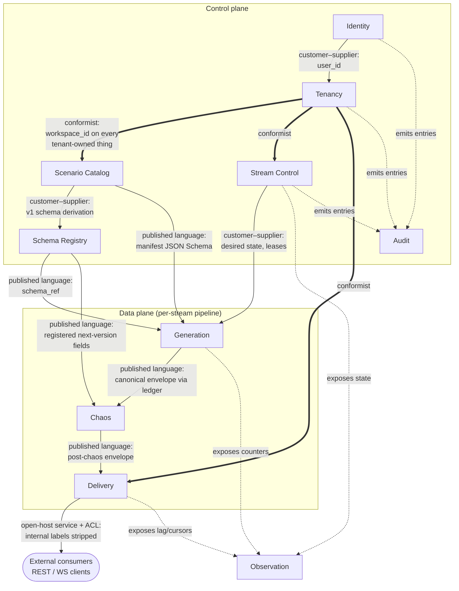
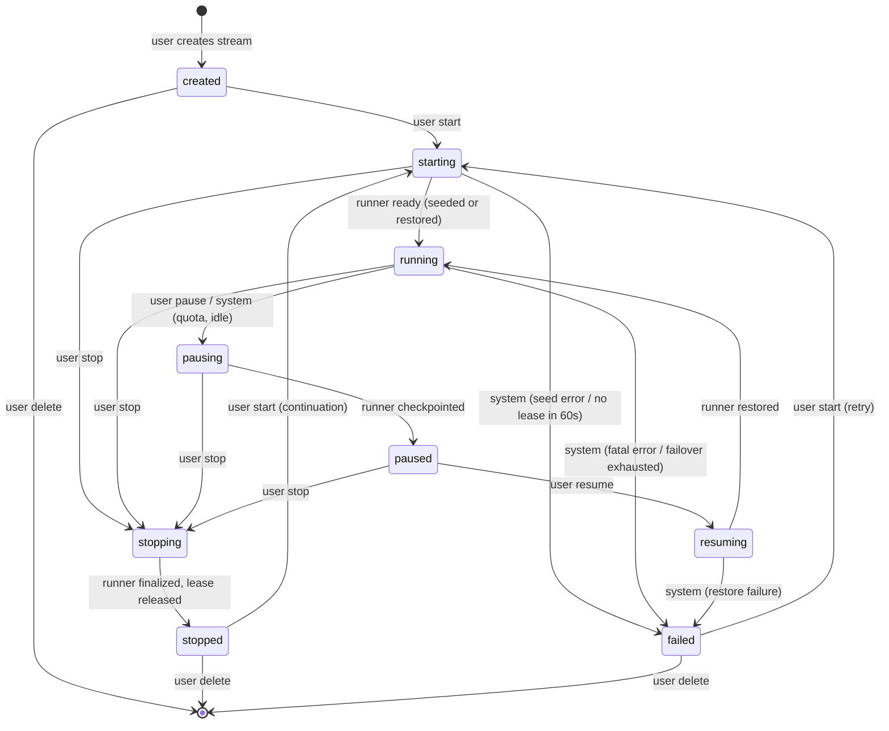
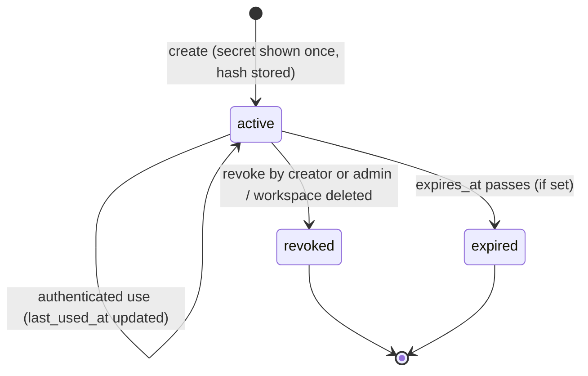

# DataForge — Domain Model

**Deliverable:** D3

This document is the strategic domain design for DataForge: the bounded-context map, the aggregates/entities/value objects and invariants of each context, the stream and API-key lifecycles, and the ubiquitous language glossary. It is the **terminology authority** for the entire specs tree — every other document uses the terms defined in §6 exactly as written here, and every invariant carries a stable ID (`INV-*`) so [../06-quality/testing-strategy.md](../06-quality/testing-strategy.md) can bind tests to it. Structural decisions referenced here are fixed by the ADRs indexed in [../adr/README.md](../adr/README.md); persistence shapes live in [database-schema.md](database-schema.md); the event contract lives in [event-model.md](event-model.md).

---

## 1. Strategic overview

DataForge decomposes into ten bounded contexts across two planes:

| Plane | Contexts | Character |
|---|---|---|
| **Control plane** | Identity, Tenancy, Scenario Catalog, Schema Registry, Stream Control, Audit | Low-volume, strongly consistent, Django/DRF + Celery (ADR-0006) |
| **Data plane** | Generation, Chaos, Delivery | High-volume, throughput-oriented, runner processes + Kafka backbone (ADR-0005, ADR-0006) |
| **Cross-cutting** | Observation | Read-only over both planes; eventually consistent |

The data plane is a strict pipeline — **Behavior → ground-truth ledger → Chaos → Delivery** (ADR-0009) — and the contract flowing through it is the canonical event envelope (ADR-0004), which acts as the published language between Generation, Chaos, and Delivery.

### 1.1 Bounded-context map

### 1.2 Context relationships

| Upstream | Downstream | Pattern | Contract artifact | Notes |
|---|---|---|---|---|
| Identity | Tenancy | Customer–supplier | `user_id` (UUID) | Tenancy references users; Identity knows nothing about workspaces |
| Tenancy | Scenario Catalog, Schema Registry, Stream Control, Generation, Chaos, Delivery, Observation, Audit | Conformist | `workspace_id` (UUID, non-null) | Every tenant-owned row, envelope, partition key, and counter carries `workspace_id` (ADR-0002) |
| Scenario Catalog | Generation | Published language | Manifest JSON Schema ([../04-engines/scenario-plugin-architecture.md](../04-engines/scenario-plugin-architecture.md)) | The generic runtime interprets manifests; no scenario logic in core (ADR-0003) |
| Scenario Catalog | Schema Registry | Customer–supplier | Manifest event-type definitions | Registering a manifest version derives v1 payload schemas per event type |
| Schema Registry | Generation | Published language | `schema_ref {subject, version}` | Every envelope stamps a resolvable `schema_ref` (ADR-0010) |
| Schema Registry | Chaos | Published language | Registered next-version field lists | Schema-drift injections may only use fields from a registered next version (ADR-0010) |
| Stream Control | Generation | Customer–supplier | Desired-state document + Redis leases | Runners poll and reconcile; users never talk to runners (ADR-0006) |
| Generation | Chaos | Published language | Canonical envelope, read from the ground-truth ledger | Chaos never reads entity pools or mutates the ledger (ADR-0009) |
| Chaos | Delivery | Published language | Post-chaos envelope on internal Kafka topics | All sinks are Kafka consumer adapters (ADR-0005) |
| Delivery | External consumers | Open-host service + anti-corruption layer | REST/WS API ([../05-interfaces/api-specification.md](../05-interfaces/api-specification.md)) | The ACL strips internal ground-truth/chaos labels at the delivery boundary (ADR-0004, ADR-0017) |
| All contexts | Observation | Conformist (read-only) | Counters, heartbeats, health probes | Observation never writes back into any context |
| Identity, Tenancy, Scenario Catalog, Schema Registry, Stream Control | Audit | Conformist (append-only) | Audit entry schema (§2.10) | Every security-relevant mutation produces exactly one entry |

### 1.3 Context → Django app mapping

Backend code organizes one Django app per bounded context; [../02-architecture/backend-architecture.md](../02-architecture/backend-architecture.md) owns the layering inside each app. App names are fixed here so imports and table prefixes stay consistent:

| Context | Django app | Plane |
|---|---|---|
| Identity | `identity` | control |
| Tenancy | `tenancy` | control |
| Scenario Catalog | `catalog` | control |
| Schema Registry | `registry` | control |
| Stream Control | `streams` | control |
| Generation | `generation` | data (runner processes; models for ledger/snapshots) |
| Chaos | `chaos` | data |
| Delivery | `delivery` | data |
| Observation | `observation` | cross-cutting |
| Audit | `audit` | control |

---

## 2. Bounded contexts

Each context section lists its responsibility, building blocks (aggregate roots in **bold**), and numbered invariants. Invariant IDs are stable and citable.

### 2.1 Identity

**Responsibility:** who a human is. Account registration, email verification, password authentication, JWT issuance/refresh for the console, password reset, account deletion. Identity is workspace-agnostic: it never stores or filters by `workspace_id`.

| Element | Kind | Description |
|---|---|---|
| **User** | Aggregate root | `user_id` (UUID), email, password hash, `is_verified`, `created_at`, `deleted_at` (soft-delete tombstone) |
| EmailVerificationToken | Entity (owned by User) | Single-use, TTL **24 h**, invalidated on use or reissue |
| PasswordResetToken | Entity (owned by User) | Single-use, TTL **1 h**, invalidated on use, reissue, or password change |
| EmailAddress | Value object | Case-insensitively unique, normalized to lowercase at the boundary |
| PasswordHash | Value object | One-way hash; algorithm and policy owned by [../06-quality/security-architecture.md](../06-quality/security-architecture.md) |

Invariants:

- **INV-ID-1** — Email addresses are unique case-insensitively across all non-deleted users.
- **INV-ID-2** — An unverified user can authenticate to the console but cannot create workspaces, accept invitations, or create API keys; every tenant-creating command requires `is_verified = true`.
- **INV-ID-3** — Verification and reset tokens are single-use and expire on their TTL; a consumed or superseded token is permanently invalid.
- **INV-ID-4** — Account deletion removes all memberships; a workspace is never left without an admin as a result (the sole-admin rule **INV-TEN-3** blocks deletion until the user transfers or deletes the workspace).

JWT mechanics (token lifetimes, rotation, revocation) are owned by [../06-quality/security-architecture.md](../06-quality/security-architecture.md) per ADR-0011.

### 2.2 Tenancy

**Responsibility:** the isolation boundary. Workspaces, memberships and roles, API keys, plan tiers and quotas. **The workspace is DataForge's tenant** — all isolation language in every spec refers to workspaces, never to user accounts.

| Element | Kind | Description |
|---|---|---|
| **Workspace** | Aggregate root | `workspace_id` (UUID), name, slug, plan tier, `created_at` |
| Membership | Entity (owned by Workspace) | (`user_id`, `workspace_id`, role); role ∈ {`admin`, `member`} |
| QuotaPolicy | Value object (on Workspace) | Plan-tier limits from [../01-product/prd.md](../01-product/prd.md) §7: concurrent streams, per-stream/aggregate TPS caps, events/day, buffer retention, backfill caps, key count, idle-pause window |
| **ApiKey** | Aggregate root | `api_key_id` (UUID), `workspace_id`, name, prefix, SHA-256 hash, last4, scopes, `created_by`, `last_used_at`, `expires_at` (nullable), state |
| KeyScope | Value object | Scope vocabulary: `events:read`, `streams:read`, `streams:write`, `schemas:read`, `answer_key:read` |
| Role | Value object | `admin` (manage workspace, members, keys, quotas view, answer key) or `member` (use scenarios/streams/keys they create). "Instructor" and "student" are personas, not roles — an instructor is the `admin` of a classroom workspace |

Invariants:

- **INV-TEN-1** — Every tenant-owned row, event envelope, Kafka partition key, Redis key for tenant state, and stats counter carries a non-null `workspace_id` (ADR-0002). This is the master tenancy invariant; the enforcement stack (scoped managers + CI guard + Postgres RLS) is specified in [../06-quality/security-architecture.md](../06-quality/security-architecture.md).
- **INV-TEN-2** — A (user, workspace) pair has at most one membership.
- **INV-TEN-3** — A workspace has at least one `admin` member at all times; the last admin cannot leave, be demoted, or delete their account without deleting or transferring the workspace.
- **INV-TEN-4** — An API key is scoped to exactly one workspace and grants nothing outside its scope set; the plaintext secret exists only in the creation response (reveal-once) and is stored solely as a SHA-256 hash (ADR-0011).
- **INV-TEN-5** — Quota limits are enforced at command time: starting a stream, raising TPS, or requesting a backfill that would exceed `QuotaPolicy` is rejected synchronously; running streams that exhaust the events/day quota are system-paused, never deleted (PRD §7).
- **INV-TEN-6** — Workspace deletion cascades: revokes all its API keys, stops all its streams, and tombstones (never silently drops) its audit trail.

### 2.3 Scenario Catalog

**Responsibility:** what can be simulated. Versioned declarative scenario manifests, manifest validation, the catalog browse/configure API, and per-workspace scenario instances. The catalog stores manifests; it never interprets them — interpretation is Generation's job (ADR-0003).

| Element | Kind | Description |
|---|---|---|
| **Scenario** | Aggregate root | `scenario_slug` (e.g. `ecommerce`), display name, description, visibility ∈ {`global`, `workspace`}; workspace-visible scenarios carry `workspace_id` (the seam for future AI-generated manifests) |
| ManifestVersion | Entity (owned by Scenario) | Semver, the manifest document, validation report, status ∈ {`draft`, `published`, `deprecated`}, `published_at` |
| ManifestDocument | Value object | YAML/JSON conforming to the manifest JSON Schema: entities, attribute-generator vocabulary, relationships, event types, state machines with transition probabilities, preconditions, CDC config, chaos defaults ([../04-engines/scenario-plugin-architecture.md](../04-engines/scenario-plugin-architecture.md)) |
| ValidationReport | Value object | Outcome of schema validation + semantic checks: resource bounds, probability sums, reachability/termination |
| **ScenarioInstance** | Aggregate root | `scenario_instance_id`, `workspace_id`, pinned `(scenario_slug, manifest_version)`, configuration overrides (transition probabilities, dwell distributions, catalog sizes, intensity curves, CDC entity toggles, chaos defaults, simulated timezone) |

Invariants:

- **INV-CAT-1** — A `published` manifest version is immutable forever; any change creates a new version (ADR-0003).
- **INV-CAT-2** — A manifest version can reach `published` only if its ValidationReport passes all checks: JSON Schema conformance, resource bounds (max entities, event types, actor-pool sizes, attribute cardinality), per-state transition-probability sums, and state-machine reachability/termination.
- **INV-CAT-3** — A ScenarioInstance pins exactly one published manifest version; its configuration overrides must themselves re-validate (probability sums remain valid after override).
- **INV-CAT-4** — **Pinning rule for running streams:** a stream copies its instance's `(manifest_version, configuration)` at start. Changing the instance — re-pinning the version or editing overrides — affects only streams started afterwards; it never mutates a running stream. The only live-mutable stream parameters are desired run-state, target TPS, chaos configuration, and scheduled schema-version upgrades (§4.1).
- **INV-CAT-5** — Deprecating a manifest version blocks new instances and new stream starts against it; running streams pinned to it are unaffected.
- **INV-CAT-6** — Workspace-visible scenarios are tenant-owned (carry `workspace_id`, **INV-TEN-1** applies); global scenarios are platform-curated and read-only to tenants.

### 2.4 Schema Registry

**Responsibility:** the versioned payload-schema authority. JSON Schema documents in Postgres keyed by Confluent-compatible subject, with enforced additive compatibility (ADR-0010). Full design: [../04-engines/schema-registry.md](../04-engines/schema-registry.md).

| Element | Kind | Description |
|---|---|---|
| **Subject** | Aggregate root | Subject name `{scenario_slug}.{event_type}` (e.g. `ecommerce.order_placed`), compatibility mode |
| SchemaVersion | Entity (owned by Subject) | Monotonic integer version (1, 2, 3 …), JSON Schema document, `registered_at`; immutable once registered |
| SchemaRef | Value object | `{subject, version}` — the pointer stamped into every envelope |
| CompatibilityMode | Value object | Fixed at `BACKWARD_ADDITIVE` for MVP: a new version may only add optional fields; it must not remove fields, change types, or add required fields |

Invariants:

- **INV-REG-1** — Subject names follow `{scenario_slug}.{event_type}` exactly (Confluent-compatible), so mirroring to Confluent Schema Registry at Phase 12 is mechanical (ADR-0010).
- **INV-REG-2** — Schema versions are immutable and monotonically increasing per subject; no deletion, no in-place edits.
- **INV-REG-3** — Version registration is rejected unless it is additive-compatible with the latest version under `BACKWARD_ADDITIVE`.
- **INV-REG-4** — Every envelope's `schema_ref` resolves to a registered (subject, version) at emission time; an unresolvable ref is a generation bug, never delivered.
- **INV-REG-5** — Schema-drift chaos may inject only fields defined in a registered version newer than the stream's effective version — the pinned version, until a mid-stream upgrade applies ([../04-engines/schema-registry.md](../04-engines/schema-registry.md) §10.2; ADR-0010); drift can never invent unregistered fields.

### 2.5 Stream Control

**Responsibility:** the lifecycle and desired state of streams. Users issue commands against the Stream aggregate; Celery (control plane) records desired state and supervises; runners (Generation context) reconcile toward it via Redis leases (ADR-0006). Stream Control owns *what should be running*; Generation owns *running it*.

| Element | Kind | Description |
|---|---|---|
| **Stream** | Aggregate root | `stream_id` (UUID), `workspace_id`, `scenario_instance_id`, copied pin `(manifest_version, configuration)`, `seed`, desired state, lifecycle state + `status_reason`, virtual-clock config, shard count, `created_at` |
| Shard | Entity (owned by Stream) | `shard_id` (0..N−1); the unit of lease acquisition and parallel generation. MVP: 1 shard per stream; N shards land in Phase 11 |
| DesiredState | Value object | `{run_state ∈ running\|paused\|stopped, target_tps (1–1,000 MVP, quota-capped), chaos_config_ref, schema_upgrade_schedule}` |
| Lease | Value object (Redis-resident) | `(stream_id, shard_id) → runner_id`, heartbeat every **5 s**, TTL **15 s**; atomically acquired; expiry makes the shard claimable |
| VirtualClockConfig | Value object | `{virtual_epoch, speed_multiplier (default 1.0), mode ∈ live\|backfill, backfill_days}` (ADR-0008) |
| StatusReason | Value object | `user`, `quota`, `idle`, `error`, `failover_exhausted`, `none` — combined with lifecycle state into the API-surfaced status string (e.g. `paused_quota`, see §4.3) |

Invariants:

- **INV-STR-1** — Lifecycle transitions occur only along the edges of the state diagram in §4; any other transition is a bug.
- **INV-STR-2** — At most one live lease exists per (stream, shard) at any instant; a runner that loses its lease must stop emitting for that shard before the new holder's first tick (enforced by lease fencing tokens, detailed in [../02-architecture/backend-architecture.md](../02-architecture/backend-architecture.md)).
- **INV-STR-3** — Lifecycle commands are idempotent: `start` on a running stream, `pause` on a paused stream, and `stop` on a stopped stream are no-ops that return the current state.
- **INV-STR-4** — Users affect streams only through desired-state changes on the control-plane API; no user-facing surface addresses runners, leases, or internal Kafka directly.
- **INV-STR-5** — `(manifest_version, seed, configuration)` is immutable for the life of a stream once started; together they are the determinism unit (ADR-0008). Restarting a stopped stream continues from its last checkpoint — it never re-rolls the seed.
- **INV-STR-6** — A stream's shards, leases, checkpoints, Kafka partition keys, and buffer rows all carry its `workspace_id` (**INV-TEN-1** applied to the data plane).

### 2.6 Generation

**Responsibility:** producing the canonical stream. The behavior engine interprets the pinned manifest: it seeds entity pools, runs per-actor session state machines with guarded transitions and dwell times under intensity curves and the virtual clock, mutates pooled entities, and emits business + CDC events into the ground-truth ledger and onto internal Kafka (ADR-0007, ADR-0008, ADR-0012). Full design: [../04-engines/behavior-engine.md](../04-engines/behavior-engine.md).

| Element | Kind | Description |
|---|---|---|
| **EntityPool** | Aggregate root (per stream × entity type) | The live population of simulated entities; hot state in Redis, periodic snapshots to Postgres |
| PooledEntity | Entity (owned by EntityPool) | Entity key, current attribute values, entity version (increments per mutation), lifecycle status per manifest |
| **Actor** | Aggregate root (per stream) | A simulated participant bound to exactly one PooledEntity of the scenario's actor entity type (e-commerce: a `users` entity); holds its state-machine position and RNG cursor |
| Session | Entity (owned by Actor) | One traversal of a session state machine: `session_id`, current state, dwell timer, cart/working set; bounded by the manifest session timeout |
| GroundTruthLedger | Append-only store | Time-partitioned Postgres ledger of every canonical event with full envelope **including** internal labels; the substrate for chaos input, the answer key, and batch downloads. Default retention **7 days** rolling; refined in Phase 11 (backup/retention jobs) |
| Checkpoint | Entity (per stream × shard) | Serialized actor/session machine states, dwell timers, pool cursors, RNG positions, virtual-clock position, last `sequence_no`; written on pause/stop and periodically (every **30 s**) for crash recovery |
| Seed / SubSeed | Value object | Per-stream seed; namespaced sub-seeds derived as `HMAC(seed, namespace)` for `values`, `transitions`, `pools`, `chaos` — Chaos consumes the `chaos` sub-seed (shared kernel by derivation rule, ADR-0008) |
| IntensityCurve | Value object | Diurnal/weekly multipliers renormalized to mean 1.0; defaults in [../01-product/prd.md](../01-product/prd.md) §4.3 |

Invariants:

- **INV-GEN-1** — An event never references a nonexistent entity: every entity reference in a payload resolves to a PooledEntity that existed in the pool at the event's `occurred_at`. This is structural — transitions are precondition-guarded — not filtered after the fact (ADR-0007).
- **INV-GEN-2** — A state-machine transition fires only when its manifest-declared preconditions hold (e.g. `refund_requested` requires a delivered shipment or lost shipment); invalid sequences cannot be generated.
- **INV-GEN-3** — Same `(manifest_version, seed, configuration)` ⇒ byte-identical canonical event sequence, independent of wall-clock pacing, TPS changes, pauses, or restarts (ADR-0008).
- **INV-GEN-4** — `occurred_at` is always virtual-clock time and is monotonically non-decreasing per actor; `emitted_at` is always wall-clock time ([event-model.md](event-model.md) owns the full clock-domain rules).
- **INV-GEN-5** — The ground-truth ledger is append-only and immutable; every canonical event is persisted to the ledger before the chaos stage may read it (ADR-0009).
- **INV-GEN-6** — CDC and business events derive from the same entity-pool mutation: each mutation of a CDC-enabled entity emits exactly one CDC event whose `before`/`after` images match the pool state around that mutation, sharing a correlation id with the business event that caused it; no `u`/`d` is ever emitted before the entity's `c` (ADR-0012).
- **INV-GEN-7** — Canonical `sequence_no` is gapless and monotonic per (stream, shard); delivered streams may show gaps or duplicates only as recorded chaos injections (**INV-CHA-4**).

### 2.7 Chaos

**Responsibility:** controlled corruption of delivery truth. A seeded, ordered, composable transform stage that reads the canonical stream post-ledger and applies the seven failure modes before publication to delivery topics (ADR-0009). Full design: [../04-engines/chaos-engine.md](../04-engines/chaos-engine.md).

| Element | Kind | Description |
|---|---|---|
| **ChaosPolicy** | Aggregate root (per stream) | The live chaos configuration: per-mode enable + rate + parameters; runtime-mutable via the streams API |
| ChaosMode | Value object | Canonical mode names: `duplicates`, `late_arriving`, `missing`, `out_of_order`, `corrupted_values`, `nulls`, `schema_drift` — these exact identifiers appear in configs, presets, injection records, and the answer key |
| StageOrder | Value object | Normative pipeline order: `missing → duplicates → corrupted_values → nulls → schema_drift → out_of_order → late_arriving` (rationale in [../04-engines/chaos-engine.md](../04-engines/chaos-engine.md)) |
| **InjectionRecord** | Aggregate root (append-only) | One row per injection: `injection_id`, `workspace_id`, `stream_id`, mode, affected `event_id`(s), field-level mutation details, configured vs realized timing, `recorded_at`. The answer-key substrate (ADR-0017) |
| **LateArrivalBuffer** | Aggregate root (per stream, persistent) | Scheduled re-emissions for `late_arriving`: entries `{event ref, due_at (wall-clock), state ∈ pending\|emitted\|discarded}` |
| OnStopPolicy | Value object | `discard` (default): pending re-emissions are dropped at stop and marked `discarded` in their InjectionRecords; `flush`: pending re-emissions are emitted immediately (not at `due_at`) during the stopping phase |

Invariants:

- **INV-CHA-1** — **Chaos corrupts delivery truth, never business truth:** chaos reads only the ledger output and writes only to delivery topics; it never mutates entity pools, the ledger, or any canonical record (ADR-0009).
- **INV-CHA-2** — Chaos is deterministic: identical `(seed, chaos configuration)` yields identical injections — same events selected, same mutations, same delays (ADR-0008).
- **INV-CHA-3** — Schema-drift injections use only fields from a registered next version (**INV-REG-5**).
- **INV-CHA-4** — Every injection is recorded in an InjectionRecord before the affected event is published (or suppressed); the answer key therefore exactly matches what was delivered, to the event.
- **INV-CHA-5** — Pending late re-emissions survive stream pause and runner failover (the buffer is persistent); a paused stream resumes with its pending re-emissions intact; `stop` applies the OnStopPolicy.
- **INV-CHA-6** — Late-arrival delays are specified in simulated time and realized in wall delivery time ([event-model.md](event-model.md) §3.4); a late event keeps its original `occurred_at` — `emitted_at` is the only envelope field chaos may move.
- **INV-CHA-7** — Internal labels (injection markers, ground-truth pointers) ride the envelope through the chaos stage and are stripped at the delivery boundary (**INV-DEL-2**); chaos at any configured rate never causes cross-workspace effects.

### 2.8 Delivery

**Responsibility:** getting post-chaos events to users. Every channel is a Kafka consumer adapter behind the `DeliveryChannel` interface (ADR-0005): the REST buffer-writer and WebSocket pusher in MVP; external Kafka, webhooks, and S3/Iceberg/CDC export later through the same seam. Full design: [../04-engines/delivery-channels.md](../04-engines/delivery-channels.md).

| Element | Kind | Description |
|---|---|---|
| **SinkBinding** | Aggregate root | A configured delivery channel instance: `sink_id`, `workspace_id`, `stream_id`, sink type ∈ {`rest_buffer`, `websocket`, `kafka_external`, `webhook`, `object_export`}, channel-specific config, state. MVP provisions `rest_buffer` and `websocket` implicitly per stream |
| **EventBuffer** | Aggregate root | The time-partitioned Postgres buffer serving REST pulls; retention by partition drop: **24 h** (Free) / **48 h** (Classroom, Pro) per PRD §7 (ADR-0013) |
| BufferPartition | Entity (owned by EventBuffer) | One time slice; dropped whole when it ages out of retention |
| Cursor | Value object | Opaque, URL-safe token encoding a consumer's position in a stream's buffer; treat the encoding as private — clients must not parse it |
| DeliveredEvent | Value object | The external event shape: canonical envelope minus internal-only fields |

Invariants:

- **INV-DEL-1** — Sinks consume only the post-chaos stream from internal Kafka; no sink reads the ledger, entity pools, or pre-chaos topics.
- **INV-DEL-2** — **Strip boundary:** internal ground-truth and chaos labels never appear in any delivered payload on any channel (ADR-0004, ADR-0017). The answer-key API is the only external surface for that information.
- **INV-DEL-3** — REST delivery is at-least-once and replayable within retention: re-reading the same cursor returns identical events in identical order.
- **INV-DEL-4** — A cursor pointing into a dropped partition fails explicitly with **HTTP 410 Gone**, problem type `cursor-expired` (RFC 9457) — never a silent skip to the oldest retained event ([../05-interfaces/api-specification.md](../05-interfaces/api-specification.md) owns the full error catalog).
- **INV-DEL-5** — WebSocket is a best-effort live tail: under backpressure it drops oldest frames with an explicit drop notice; it is never the bulk-throughput path (ADR-0013).
- **INV-DEL-6** — A sink never crosses workspaces: buffer rows, channel groups, future external topics and credentials are all workspace-scoped (**INV-TEN-1**).

### 2.9 Observation

**Responsibility:** seeing without touching. Per-stream stats counters, health/readiness probes, metrics, SLO measurement, and the monitoring API/console surface. Catalog and SLO definitions: [../02-architecture/observability.md](../02-architecture/observability.md).

| Element | Kind | Description |
|---|---|---|
| **StreamStats** | Aggregate root (Redis-resident, rebuildable) | Per-stream counters: `total_events`, `observed_tps`, per-event-type counts, `last_event_at`, consumer-lag indicators |
| HealthProbe | Value object | `/healthz` (liveness) and `/readyz` (readiness over Postgres/Redis/Kafka) results per process group |
| MetricPoint | Value object | Structured metric samples with `workspace_id`/`stream_id` labels |

Invariants:

- **INV-OBS-1** — Observation is read-only over all other contexts: it never issues commands or mutates domain state (idle-detection *signals* feed Stream Control, which owns the resulting pause command).
- **INV-OBS-2** — Stats are eventually consistent with bounded staleness: counters lag actual delivery by at most **5 s** under normal operation, and must reconcile with an independent consumer-side tally over a soak window (Phase 6 exit criterion).
- **INV-OBS-3** — Counters are workspace- and stream-labeled; no aggregate metric exposed to a tenant ever includes another tenant's data.

### 2.10 Audit

**Responsibility:** the immutable record of who did what. Append-only entries for every security-relevant mutation, queryable per workspace by admins, feeding success metrics (PRD §8) and incident forensics.

| Element | Kind | Description |
|---|---|---|
| **AuditEntry** | Aggregate root (immutable) | `audit_id` (UUIDv7), `occurred_at` (wall-clock), actor (`user_id`, `api_key_id`, or `system`), `workspace_id` (nullable for account-level events), `action`, target object ref, metadata, `request_id` |
| ActionName | Value object | Convention `{context}.{object}.{verb}` past tense — e.g. `identity.user.registered`, `tenancy.api_key.revoked`, `streams.stream.pause_requested`, `catalog.manifest_version.published` |

Minimum audited action set (extended, never reduced): signup, login success/failure, email verification, password reset, account deletion; workspace create/delete, membership add/remove/role-change; API key create/revoke/expire; stream create/start/pause/resume/stop/delete and system pauses (quota, idle); scenario-instance create/update; manifest-version publish/deprecate; schema-version registration; chaos-policy changes; answer-key access.

Invariants:

- **INV-AUD-1** — Audit entries are append-only: no update or delete surface exists, in any API, ever.
- **INV-AUD-2** — Every action in the minimum audited set writes exactly one entry, transactionally with the mutation it records (same-database commit).
- **INV-AUD-3** — Entries never contain secrets: no key material, no password hashes, no token values — references and prefixes only.
- **INV-AUD-4** — Workspace-scoped entries carry `workspace_id` and are visible only to that workspace's admins; account-level entries (`workspace_id = null`) are visible only to the account owner and platform operators.

---

## 3. Cross-context invariants

The five global invariants every spec and test suite anchors on:

- **INV-G-1 (Tenancy)** — Every tenant-owned row carries `workspace_id`; no cross-workspace data access exists on any surface — API, WS, Kafka key-space, Redis key-space, buffer, ledger, stats, audit. A breach requires at least two simultaneous control failures (scoped managers + CI guard + RLS, ADR-0002).
- **INV-G-2 (Referential integrity)** — On the canonical stream, an event never references a nonexistent entity, at any volume, structurally (**INV-GEN-1/2**).
- **INV-G-3 (Truth separation)** — Chaos corrupts delivery truth, never business truth: the ledger is always clean; every delivered deviation from the ledger is a recorded injection (**INV-CHA-1/4**).
- **INV-G-4 (Determinism)** — `(manifest_version, seed, configuration)` reproduces the identical canonical sequence *and* identical chaos injections (**INV-GEN-3**, **INV-CHA-2**); golden-seed replay is a permanent CI gate.
- **INV-G-5 (Contract stability)** — The canonical envelope and CDC shape are frozen at Phase 0 and evolve additively only (ADR-0004); the delivered shape on every channel is the envelope minus internal labels (**INV-DEL-2**).

---

## 4. Stream lifecycle

### 4.1 Desired state vs lifecycle state

Stream control is a reconciliation system (ADR-0006). Users set **desired state** (`running`, `paused`, `stopped`) plus live-mutable parameters (target TPS, chaos config, scheduled schema upgrades); runners converge the **lifecycle state** toward it. The four transitional states (`starting`, `pausing`, `resuming`, `stopping`) are observable convergence phases, not user-settable values.

| Desired state | Converging lifecycle states | Settled lifecycle state |
|---|---|---|
| `running` | `starting`, `resuming` | `running` |
| `paused` | `pausing` | `paused` |
| `stopped` | `stopping` | `stopped` |

### 4.2 State diagram

### 4.3 Transition catalog

| # | From → To | Trigger (who) | Guard | Effect |
|---|---|---|---|---|
| T1 | ∅ → `created` | User: create stream | Verified user, workspace member, valid scenario instance | Stream row created; desired = `stopped`; pin `(manifest_version, configuration)` copied; seed fixed (client-supplied or generated) |
| T2 | `created` → `starting` | User: start (desired = `running`) | Quota: concurrent-stream count and TPS caps (**INV-TEN-5**) | Control plane publishes desired state; shards become claimable |
| T3 | `starting` → `running` | Runner | Lease acquired; entity pools seeded (first start) or checkpoint restored (restart) | First tick emits; heartbeats every 5 s |
| T4 | `starting` → `failed` | System | No runner acquires a lease within **60 s**, or pool seeding / manifest interpretation fails | `status_reason = error`; diagnostic surfaced via Observation |
| T5 | `running` → `pausing` | User: pause; **or** System: quota exhaustion (`status_reason = quota`), idle auto-pause (`status_reason = idle`) | — | Desired = `paused`; runner finishes current tick only |
| T6 | `pausing` → `paused` | Runner | Emission halted within one tick; checkpoint persisted | Lease retained; pending late re-emissions held (**INV-CHA-5**); audit entry on system pauses |
| T7 | `paused` → `resuming` | User: resume | If `status_reason = quota`: quota headroom restored | Desired = `running` |
| T8 | `resuming` → `running` | Runner | Checkpoint restored; dwell timers rebased to the virtual clock | In-flight funnels continue with zero sequence gaps |
| T9 | `running`/`pausing`/`paused`/`starting` → `stopping` | User: stop | — | Desired = `stopped`; stop overrides any in-flight pause/start |
| T10 | `stopping` → `stopped` | Runner | Final checkpoint persisted (retained for restart); LateArrivalBuffer OnStopPolicy applied (`discard` default); lease released | Emission ceases ≤ 5 s after the stop command (Phase 5 exit criterion) |
| T11 | `running`/`resuming` → `failed` | System | Non-retryable error, or **3** consecutive failed lease takeovers within 10 min | `status_reason = failover_exhausted` or `error` |
| T12 | `stopped` → `starting` | User: start | Same guards as T2 | **Continuation:** resumes from last checkpoint; `sequence_no` and virtual clock continue monotonically; the seed is never re-rolled (**INV-STR-5**) |
| T13 | `failed` → `starting` | User: start (retry) | Same guards as T2 | Restores from the last good checkpoint |
| T14 | `created`/`stopped`/`failed` → deleted | User: delete | Only these three states are deletable | Buffer rows, checkpoints, and pending re-emissions removed; ledger and audit entries follow retention policy, not deletion |

**Crash without state change:** a runner crash while `running` is *not* a lifecycle transition when failover succeeds — another runner claims the expired lease (≤ 15 s detection) and resumes from the latest checkpoint within **30 s** total (Phase 5 exit criterion). The stream stays `running`; the heartbeat gap is visible in Observation. Only failover exhaustion produces `failed` (T11).

**Surfaced status string:** the API `status` field is the lifecycle state, suffixed with the reason when the reason is not `user`/`none` — `running`, `paused`, `paused_quota`, `paused_idle`, `failed`. This is how the PRD's `paused_quota` contract (PRD §7) maps onto the state model.

### 4.4 Live-mutable vs pinned

| Parameter | Mutability while running | Mechanism |
|---|---|---|
| Desired run-state | Live | T2/T5/T7/T9 |
| `target_tps` | Live (1–1,000 MVP, quota-capped); effective ≤ 2 s | Desired-state poll each tick |
| Chaos configuration | Live toggle per mode | ChaosPolicy update, picked up next tick |
| Schema version upgrade | Scheduled ("evolve to v2 at T+x", Phase 10) | `schema_upgrade_schedule` in DesiredState |
| Manifest version, seed, probability/dwell overrides, catalog sizes, virtual-clock config | **Pinned at start** (**INV-CAT-4**, **INV-STR-5**) | Change instance → start a new stream |

---

## 5. API-key lifecycle

| Aspect | Contract |
|---|---|
| Creation | Any verified workspace member (so students issue their own keys, PRD §2.2); key format `df_<env>_<prefix>_<secret>` (ADR-0011); plaintext returned exactly once in the creation response |
| Storage | SHA-256 hash + prefix + last4 only (**INV-TEN-4**) |
| Scopes | Subset of `events:read`, `streams:read`, `streams:write`, `schemas:read`, `answer_key:read`; `answer_key:read` grantable only by a workspace admin |
| Expiry | `expires_at` optional, default null (non-expiring); transition to `expired` is system-driven |
| Revocation | By the key's creator or any workspace admin; effective within **1 s** via the Redis revocation cache (Phase 2 exit criterion); workspace deletion cascades revocation (**INV-TEN-6**) |
| Terminality | `revoked` and `expired` are terminal — no reactivation; issue a new key |
| Usage tracking | `last_used_at` updated on authenticated use (write-behind; precision to the minute is sufficient) |
| Auth failures | Unknown/revoked/expired key → **401**; valid key with insufficient scope or foreign workspace → **403/404** per the cross-tenant policy in [../06-quality/security-architecture.md](../06-quality/security-architecture.md) |
| Audit | `tenancy.api_key.created` / `.revoked` / `.expired` entries (**INV-AUD-2**) |

---

## 6. Ubiquitous language glossary

These definitions are canonical. Every spec, API description, console label, error message, and test name uses these terms exactly; §6.3 lists banned synonyms.

### 6.1 Core terms

| Term | Canonical definition | Owning context |
|---|---|---|
| **tenant** | The isolation unit of DataForge: synonymous with *workspace* in every isolation discussion. A user account is not a tenant; a user may belong to many workspaces. | Tenancy |
| **workspace** | The tenant boundary that owns scenarios instances, streams, API keys, events, stats, and audit history. Identified by `workspace_id`, which appears on every tenant-owned row, envelope, and partition key (**INV-TEN-1**). | Tenancy |
| **membership** | The (user, workspace, role) association admitting a user to a workspace, with role `admin` or `member`. At most one per (user, workspace). | Tenancy |
| **scenario** | A simulated business domain (e.g. E-Commerce) published in the catalog as a set of versioned manifests. Identified by `scenario_slug`. | Scenario Catalog |
| **manifest** | The declarative, versioned YAML/JSON document that fully defines a scenario — entities, attribute generators, relationships, event types, state machines with transition probabilities, preconditions, CDC config, chaos defaults — validated against the manifest JSON Schema and interpreted by the generic runtime (ADR-0003). | Scenario Catalog |
| **scenario instance** (scenario config) | A workspace's configured copy of a scenario: a pinned manifest version plus workspace-level overrides (probabilities, dwell distributions, catalog sizes, curves, CDC toggles, chaos defaults). Streams are started from instances. | Scenario Catalog |
| **stream** | The unit of continuous event generation and delivery: one scenario instance + one seed + one configuration, with a lifecycle (§4), a virtual clock, and desired state (run-state, TPS, chaos). Identified by `stream_id`. | Stream Control |
| **runner** | A long-lived supervised data-plane process that acquires shard leases, polls desired state, runs the behavior and chaos engines, and publishes to internal Kafka (ADR-0006). Distinct from a Celery *worker*, which is control plane only. | Generation |
| **shard** | The unit of parallelism within a stream: a partition of its actors by `partition_key`, generated under one lease. MVP streams have 1 shard; Phase 11 introduces N. | Stream Control |
| **lease** | The Redis-held, TTL-bounded (15 s, heartbeat 5 s) exclusive claim a runner holds on a (stream, shard). Lease expiry is the failover signal; at most one live lease per shard (**INV-STR-2**). | Stream Control |
| **actor** | A simulated participant (e.g. a shopper) bound to one entity in the scenario's actor entity pool, executing session state machines per the manifest. | Generation |
| **session** | One bounded traversal of a session state machine by an actor (e.g. a shopping visit), identified by `session_id`, subject to the manifest session timeout. | Generation |
| **entity pool** | The per-stream, per-entity-type population of simulated entities (Redis hot state, Postgres snapshots) that is the source of truth for referential integrity; all events derive from pool mutations (ADR-0007, ADR-0012). | Generation |
| **ground-truth ledger** | The append-only, time-partitioned Postgres record of the canonical (pre-chaos) stream with full envelopes including internal labels; input to chaos, the answer key, and batch downloads (**INV-GEN-5**). | Generation |
| **event envelope** | The frozen canonical wrapper on every event: `envelope_version`, `event_id` (UUIDv7), `workspace_id`, `stream_id`, `scenario_slug`, `event_type`, `schema_ref`, `sequence_no`, `partition_key`, `occurred_at`, `emitted_at`, `actor_id`/`session_id`, correlation/causation ids, `op` for CDC, `payload` (ADR-0004; [event-model.md](event-model.md)). | Generation (shape frozen platform-wide) |
| **business event** | An event expressing a domain occurrence (e.g. `order_placed`) emitted as the consequence of a state-machine transition mutating the entity pool. | Generation |
| **CDC event** | A change-data-capture event in Debezium shape — `op` ∈ `c`/`u`/`d` with `before`/`after` images — emitted from the same entity-pool mutation as its corresponding business event (ADR-0012, **INV-GEN-6**). | Generation |
| **chaos injection** | One recorded act of the chaos engine on one or more events: a duplicate, delay, suppression, reorder, value corruption, null, or drift-field addition. Every injection is recorded before its effect is delivered (**INV-CHA-4**). | Chaos |
| **answer key** | The workspace-admin-queryable record of ground truth: all injection records plus the canonical clean sequence, exposed via dedicated endpoints and console panel (ADR-0017); never present in delivered payloads. | Chaos |
| **delivery channel** | A way users receive events. Every channel implements the `DeliveryChannel` interface (`deliver(batch)`, cursor/ack semantics, backpressure signal) as a consumer of internal Kafka (ADR-0005). MVP: REST cursor pull and WebSocket tail. | Delivery |
| **sink** | A configured delivery-channel instance bound to a stream/workspace (a SinkBinding): the REST buffer, a WS group, a future external Kafka topic, webhook endpoint, or object export. | Delivery |
| **buffer** | The time-partitioned Postgres store of post-chaos events serving REST pulls, retained 24–48 h by plan via partition drop (ADR-0013). Distinct from the ledger (canonical, pre-chaos) and from the late-arrival buffer (chaos-internal). | Delivery |
| **cursor** | The opaque, URL-safe token marking a consumer's replayable position in a stream's buffer. At-least-once: re-reading a cursor returns identical events. A cursor past retention fails with `410` `cursor-expired` (**INV-DEL-4**). | Delivery |
| **schema subject** | The registry key for one event type's payload schema lineage, named `{scenario_slug}.{event_type}` (Confluent-compatible, ADR-0010). | Schema Registry |
| **schema version** | One immutable, monotonically numbered JSON Schema document under a subject; new versions must be additive-compatible (**INV-REG-3**). Referenced from envelopes as `schema_ref {subject, version}`. | Schema Registry |
| **virtual clock** | The per-stream simulated clock that stamps `occurred_at` and drives dwell times and intensity curves; advances at `speed_multiplier` × wall time in live mode, or as fast as generation allows in backfill mode (ADR-0008). | Generation |
| **speed multiplier** | The factor relating virtual time to wall time (default 1.0); at 60×, a 2.5-simulated-day delivery latency elapses in ~1 wall-hour. Pinned at stream start. | Generation |
| **backfill** | Generation mode producing N simulated days of history as a bounded dataset (JSONL download) under the same manifest, seed, and curves — complete lifecycles materialized without pacing (ADR-0008; quota caps in PRD §7). | Generation |
| **seed** | The per-stream root of all randomness; namespaced sub-seeds (`values`, `transitions`, `pools`, `chaos`) make data, behavior, and chaos jointly reproducible: same `(manifest_version, seed, configuration)` ⇒ identical canonical sequence and identical injections (**INV-G-4**). | Generation |

### 6.2 Supporting terms

| Term | Canonical definition | Owning context |
|---|---|---|
| **API key** | The opaque machine credential for the data plane: `df_<env>_<prefix>_<secret>`, workspace-scoped, scope-limited, hashed at rest, revealed once, revocable within 1 s (ADR-0011; §5). | Tenancy |
| **desired state** | The user-set target a stream's runners reconcile toward: run-state, target TPS, chaos config, schema-upgrade schedule (§4.1). | Stream Control |
| **checkpoint** | The serialized restore point of a shard's generation state — actor/session machines, timers, pool cursors, RNG positions, virtual-clock position, last `sequence_no` — written on pause/stop and every 30 s. | Generation |
| **canonical stream** | The clean, referentially valid event sequence as generated and persisted to the ledger, before chaos. | Generation |
| **delivered stream** | What a consumer actually receives on a channel: the canonical stream as transformed by enabled chaos modes, minus internal labels. | Delivery |
| **partition key** | The envelope field keying internal Kafka partitioning and ordering scope, prefixed with `workspace_id` (ADR-0002, ADR-0004). | Generation |
| **sequence number** (`sequence_no`) | The per-(stream, shard) gapless monotonic counter on canonical events; delivered gaps/duplicates relative to it are always recorded injections (**INV-GEN-7**). | Generation |
| **occurred_at / emitted_at** | The dual timestamps: `occurred_at` = virtual-clock business time; `emitted_at` = wall-clock delivery time. Chaos lateness shifts only `emitted_at` ([event-model.md](event-model.md)). | Generation |
| **intensity curve** | The renormalized (mean 1.0) diurnal/weekly multiplier set modulating session arrival rate; defaults in PRD §4.3. | Generation |
| **chaos mode** | One of the seven failure-mode identifiers: `duplicates`, `late_arriving`, `missing`, `out_of_order`, `corrupted_values`, `nulls`, `schema_drift`. | Chaos |
| **late-arrival buffer** | The persistent, per-stream schedule of chaos re-emissions whose `due_at` is in wall-clock time; survives pause and failover (**INV-CHA-5**). | Chaos |
| **exercise preset** | A named bundle of scenario/chaos configuration implementing a lab from the PRD exercise catalog (e.g. "Dedup 101"), selectable in the console. | Chaos |
| **quota** | A workspace's plan-tier limits (PRD §7), enforced at command time; exhaustion system-pauses streams with status `paused_quota` (**INV-TEN-5**). | Tenancy |
| **audit entry** | One immutable record of a security-relevant action, named `{context}.{object}.{verb}` (§2.10). | Audit |
| **injection record** | The persisted ground-truth row describing one chaos injection; the unit the answer key aggregates. | Chaos |
| **stream stats** | The Redis-resident, rebuildable per-stream counters (totals, observed TPS, per-type, `last_event_at`) with ≤ 5 s staleness (**INV-OBS-2**). | Observation |

### 6.3 Terminology rules — say this, not that

| Say | Never say | Why |
|---|---|---|
| workspace | project, organization, team, account (for the tenant) | The tenant unit has exactly one name (**INV-TEN-1** language) |
| stream | job, pipeline, simulation run | "Pipeline" is what *users* build against DataForge |
| runner | worker (for data plane) | *Worker* means Celery control-plane worker only (ADR-0006) |
| manifest | plugin, config file, scenario code | Scenarios are declarative data, not code (ADR-0003) |
| event | message, record, row (in delivery contexts) | The envelope is the contract; "record" is reserved for CDC `before`/`after` images |
| ledger | archive, history table | "Ledger" always means the canonical pre-chaos ground truth |
| buffer | cache, queue | The REST buffer is replayable storage, not a cache |
| cursor | offset, page token | Cursors are opaque and replayable (ADR-0014) |
| sink | consumer (for our adapters) | "Consumer" unqualified means the *user's* consumer |
| chaos injection | error, glitch, fault (in specs/UI) | Injections are deliberate, recorded, gradable |
| answer key | ground-truth API (in UI) | Product-facing name fixed by ADR-0017 |
| virtual clock / occurred_at | event time (unqualified) | Always name the clock domain explicitly (ADR-0004) |
| canonical vs delivered stream | clean vs dirty data | Precise truth-separation language (**INV-G-3**) |

---

## 7. Document ownership boundaries

What this document deliberately does *not* specify, and where it lives instead:

| Concern | Owner |
|---|---|
| Tables, columns, indexes, RLS policies, partitioning DDL | [database-schema.md](database-schema.md) |
| Envelope field-by-field contract, CDC shape, clock-domain rules, per-channel ordering | [event-model.md](event-model.md) |
| Manifest JSON Schema, semantic validation algorithms, AI-manifest threat model | [../04-engines/scenario-plugin-architecture.md](../04-engines/scenario-plugin-architecture.md) |
| State-machine interpretation, dwell sampling, pool mechanics, checkpoint format | [../04-engines/behavior-engine.md](../04-engines/behavior-engine.md) |
| Chaos stage mechanics, per-mode parameters, late-buffer scheduling | [../04-engines/chaos-engine.md](../04-engines/chaos-engine.md) |
| Endpoint catalog, status codes, problem types, pagination, WS subprotocol | [../05-interfaces/api-specification.md](../05-interfaces/api-specification.md) |
| Auth mechanics, tenancy enforcement stack, abuse controls | [../06-quality/security-architecture.md](../06-quality/security-architecture.md) |
| Process topology, lease fencing implementation, Kafka topic layout | [../02-architecture/backend-architecture.md](../02-architecture/backend-architecture.md), [../02-architecture/system-architecture.md](../02-architecture/system-architecture.md) |
| Invariant test bindings (which suite proves which `INV-*`) | [../06-quality/testing-strategy.md](../06-quality/testing-strategy.md) |
