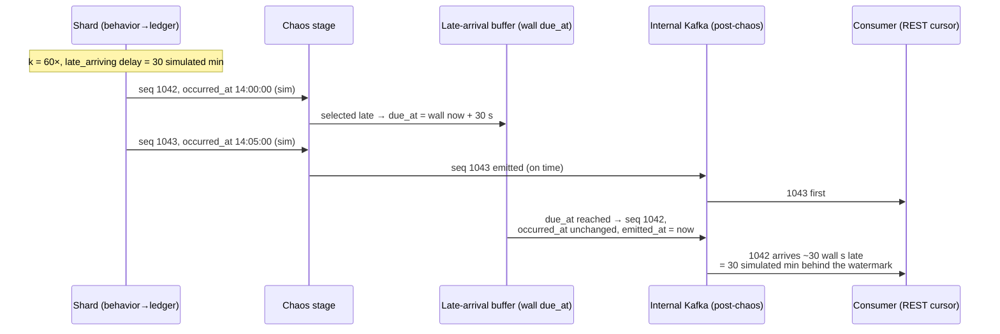
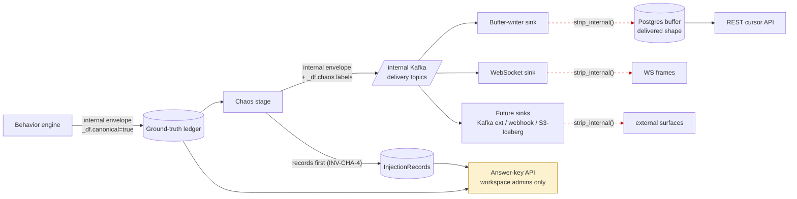

# DataForge — Event Model

**Deliverable:** D5

This document freezes the canonical event envelope (ADR-0004): the exact field-by-field contract every DataForge event carries on every surface — the ground-truth ledger, internal Kafka topics, and all delivery channels — plus the Debezium-shaped CDC sub-envelope (ADR-0012), the clock-domain rules that reconcile the virtual clock with wall-clock delivery (ADR-0008), the internal ground-truth/chaos metadata and its strip boundary (ADR-0017), per-channel ordering/lateness/duplicate guarantees, and the additive-only evolution policy. Terminology follows [domain-model.md](domain-model.md) exactly; invariants referenced as `INV-*` are defined there. Persistence shapes for the ledger and buffer live in [database-schema.md](database-schema.md); endpoint shapes in [../05-interfaces/api-specification.md](../05-interfaces/api-specification.md); ADRs are indexed in [../adr/README.md](../adr/README.md).

---

## 1. Contract status and scope

| Aspect | Status |
|---|---|
| Envelope version | **`1.0`**, frozen in Phase 0 (this document is the freeze) |
| Evolution | Additive-only, minor-version bumps; fields are never removed, renamed, retyped, or made stricter (§8; INV-G-5) |
| First implementation | Phase 3 (envelope round-trip with `schema_ref` stamped); first emission Phase 4 |
| Normative artifact | A machine-readable JSON Schema for envelope `1.0` is generated in Phase 3 as a CI artifact and golden-fixture-tested against this document; this document is authoritative on any discrepancy |
| Applies to | Every event: business and CDC, canonical and chaos-transformed, on every channel, in every phase |

The envelope is the **published language** between Generation, Chaos, and Delivery (domain model §1). Two shapes exist:

- **Internal envelope** — fields 1–20 plus the internal-only `_df` block (§5). Lives in the ground-truth ledger and on internal Kafka topics.
- **Delivered envelope** — fields 1–20 exactly. What every channel hands to users, produced by stripping `_df` at the delivery boundary (INV-DEL-2).

---

## 2. The envelope

### 2.1 Field catalog (frozen, envelope `1.0`)

Fields are listed in canonical serialization order (§2.4). "Null" means the field is present with JSON `null`; absent fields are never permitted in envelope `1.0` — every delivered event carries all 20 keys.

| # | Field | Type | Null | Semantics | Example |
|---|---|---|---|---|---|
| 1 | `envelope_version` | string | no | Envelope contract version, `major.minor`. Frozen major `1`; minor bumps are additive (§8). | `"1.0"` |
| 2 | `event_id` | string, UUIDv7 (RFC 9562, lowercase) | no | Globally unique id of the **canonical** event and the consumer's idempotency key. Timestamp bits encode `occurred_at` (simulated) milliseconds; random bits come from the stream's seeded PRNG, so ids are deterministic (INV-GEN-3) and k-sortable in event time. Delivered streams may repeat an `event_id` (chaos duplicates, at-least-once redelivery) — repetition is the teaching point, never a new identity. | `"019ea1c5-4b2d-7e3f-8a91-c2d4e6f8a0b1"` |
| 3 | `workspace_id` | string, UUID | no | Owning tenant (INV-TEN-1). Also the mandatory prefix of `partition_key` (ADR-0002). | `"0d9f7b42-3a61-4c2e-9b8f-5e1a2c3d4f60"` |
| 4 | `stream_id` | string, UUID | no | The stream that generated the event. | `"7b1e9c3a-2f54-4d08-a6b9-1c2d3e4f5a6b"` |
| 5 | `shard_id` | integer ≥ 0 | no | Generation shard within the stream (the `sequence_no` scope, §2.2.2). Shard count is pinned at stream start; MVP streams have exactly one shard, so `shard_id = 0` until Phase 11. | `0` |
| 6 | `scenario_slug` | string, `[a-z][a-z0-9_]*`, ≤ 32 chars | no | Scenario identifier from the manifest. | `"ecommerce"` |
| 7 | `manifest_version` | string, semver | no | The manifest version the stream pinned at start (INV-CAT-4, INV-STR-5). | `"1.0.0"` |
| 8 | `event_type` | string, ≤ 64 chars | no | Business events: snake_case past-tense verb phrase (`order_placed`). CDC events: `cdc.{entity_type}` (`cdc.users`). The only dot-bearing form is the `cdc.` prefix. | `"order_placed"` |
| 9 | `schema_ref` | object `{subject: string, version: integer ≥ 1}` | no | Pointer into the schema registry resolving the `payload` schema: `subject = "{scenario_slug}.{event_type}"` (INV-REG-1), `version` = registered integer version. Must resolve at emission time (INV-REG-4). String form `subject:version` (`ecommerce.order_placed:1`) is used in logs and docs, never on the wire. | `{"subject": "ecommerce.order_placed", "version": 1}` |
| 10 | `sequence_no` | integer ≥ 1 (≤ 2⁵³ − 1) | no | Canonical position within `(stream_id, shard_id)`: starts at 1, **gapless and strictly monotonic on the canonical stream** (INV-GEN-7), continues across stop/restart (never resets, T12). Delivered streams may show gaps, repeats, and local disorder — see §2.2.2. | `48213` |
| 11 | `partition_key` | string, ≤ 256 chars | no | Ordering and Kafka-keying scope: `{workspace_id}:{stream_id}:{entity_type}:{entity_key}`. Derivation rules in §2.2.3. | `"0d9f7b42-…:7b1e9c3a-…:users:usr_a3f81c2e9b4d"` |
| 12 | `occurred_at` | string, RFC 3339 UTC, exactly 6 fractional digits, `Z` suffix | no | **Simulated (virtual-clock) business time** of the state transition (INV-GEN-4). Never modified by chaos. Non-decreasing per `(stream_id, shard_id)` on the canonical stream; ties broken by `sequence_no`. | `"2026-06-10T14:23:05.123456Z"` |
| 13 | `emitted_at` | string, RFC 3339 UTC, 6 fractional digits, `Z` | no | **Wall-clock delivery time**: when the post-chaos instance was published to delivery topics. The only timestamp chaos may move (INV-CHA-6). On the ledger, the canonical publish wall time. | `"2026-06-10T14:23:05.287113Z"` |
| 14 | `actor_id` | string (entity key) | yes | Entity key of the actor's pooled entity (e-commerce: a `users` key). Non-null on all session and lifecycle events driven by an actor state machine; `null` only for events with no owning actor (e.g. CDC from background mutations, op `r` snapshot reads). | `"usr_a3f81c2e9b4d"` |
| 15 | `session_id` | string, UUIDv7 | yes | The session traversal that produced the event. Non-null for in-session events; `null` for post-session lifecycle events (e.g. `shipment_delivered` days after the visit) and CDC events not caused by an in-session action. | `"019ea1b9-2c4d-7a6e-b8f0-1a2b3c4d5e6f"` |
| 16 | `entity_refs` | array of `{entity_type: string, entity_key: string}` | no | Every pooled entity the payload references, partition entity first, then payload declaration order. Enables channel-agnostic per-entity filtering (Phase 8 CDC filtering) and answer-key joins without parsing `payload`. CDC events list exactly one ref: the mutated entity. Never empty. | `[{"entity_type": "users", "entity_key": "usr_a3f81c2e9b4d"}]` |
| 17 | `correlation_id` | string, UUIDv7 | no | Causal-chain id: the `event_id` of the chain root, propagated to every downstream event in the chain (in-session funnel, post-session order lifecycle, and the CDC events those mutations emit). A chain root carries its own `event_id` here. | `"019ea1b9-2c4d-7000-a111-223344556677"` |
| 18 | `causation_id` | string, UUIDv7 | yes | `event_id` of the immediate cause: the previous event in the chain, or the business event whose mutation produced this CDC event. `null` at chain roots and for background-mutation CDC (§4.4 R-CDC-3). | `"019ea1c5-3a1b-7c2d-9e8f-001122334455"` |
| 19 | `op` | string enum `"c"`, `"u"`, `"d"`, `"r"` | yes | CDC discriminator. `null` ⇔ business event; non-null ⇔ CDC event whose `payload` is the Debezium-shaped sub-envelope (§4). The enum is closed and frozen. | `null` |
| 20 | `payload` | object | no | Business events: the domain document conforming to `schema_ref`. CDC events: the sub-envelope of §4 whose `before`/`after` row images conform to `schema_ref`. | `{ "order_id": "ord_5f2e…", … }` |
| 21 | `_df` | object | internal only | Ground-truth/chaos metadata (§5). Present on the ledger and internal Kafka; **stripped at the delivery boundary, never delivered on any channel** (INV-DEL-2). Not part of the compatibility contract. | — |

Size bounds (enforced by the manifest validator at publish via worst-case estimation, and at emission as a generation error — an oversized event is a bug, never delivered): `payload` ≤ 64 KiB serialized; full delivered envelope ≤ 96 KiB serialized.

### 2.2 Identity and ordering fields

#### 2.2.1 `event_id` — UUIDv7 under determinism

A naive UUIDv7 embeds wall-clock milliseconds, which would break INV-GEN-3 (byte-identical canonical sequences regardless of wall pacing). Envelope `1.0` therefore pins:

- **Timestamp bits** (48): milliseconds of `occurred_at` — simulated time.
- **Random bits** (74): drawn from the stream's seeded PRNG (`values` sub-seed namespace, ADR-0008), one draw per event, so collisions within the same simulated millisecond are avoided deterministically.

Consequences: ids are reproducible from `(manifest_version, seed, configuration)`; lexicographic id order ≈ event-time order (useful for learners); and `event_id` is the **only** correct dedup key — `sequence_no` repeats on duplicates too, but `event_id` is what survives every channel.

#### 2.2.2 `sequence_no` — scope and gaps-allowed semantics

**Scope (exact):** `sequence_no` is monotonic per `(stream_id, shard_id)`. It is meaningless to compare across shards or streams. Consumers must always treat `(stream_id, shard_id, sequence_no)` as the composite ordering key. Both business and CDC events draw from the same per-shard counter (§4.4 R-CDC-2).

| Surface | Guarantee |
|---|---|
| Canonical stream (ledger, answer key) | Gapless, strictly monotonic, starts at 1, continues across pause/resume and stop/restart (INV-GEN-7, T12). Shard count is immutable per stream, so the scope never shifts. |
| Delivered stream (every channel) | **Gaps allowed** (`missing` chaos suppresses events; their `sequence_no` simply never arrives), **repeats allowed** (`duplicates` chaos and at-least-once redelivery repeat the full envelope including `sequence_no`), **local disorder allowed** (`out_of_order` and `late_arriving` chaos). |

Contract for consumers, stated in user docs verbatim: *a gap in `sequence_no` is not an error; it is either an injected `missing` event or an event you have not received yet.* Every delivered deviation from gapless order is a recorded injection verifiable through the answer key (INV-CHA-4, INV-G-3). Consumers re-sorting a chaos stream restore canonical order by `(shard_id, sequence_no)` — that is exercise E3.

#### 2.2.3 `partition_key` — definition and derivation rules

**Definition (frozen):**

```
partition_key = "{workspace_id}:{stream_id}:{partition_entity_type}:{partition_entity_key}"
```

Components never contain `:` (UUIDs, validated slugs, validated entity keys ≤ 64 chars), so the key is unambiguous. `workspace_id` is the mandatory first segment (ADR-0002): every internal Kafka message is keyed by a workspace-prefixed key, making tenant attribution inspectable at the broker.

**Derivation rules:**

| Rule | Event class | Partition entity |
|---|---|---|
| PK-1 | Business event | The entity named by the event type's manifest `partition_by` declaration; **default = the actor's root entity** (the scenario's actor entity type). |
| PK-2 | CDC event | Always the mutated entity itself: `{entity_type}:{entity_key}` of the `before`/`after` images. Not overridable — this matches Debezium's table-PK keying and is what makes SCD2 (E4) correct. |
| PK-3 | Snapshot read (`op: "r"`) | Same as PK-2. |

**E-commerce derivation table** (normative for the reference manifest, [../04-engines/scenarios/ecommerce.md](../04-engines/scenarios/ecommerce.md)):

| Events | Partition entity | Why |
|---|---|---|
| All ~20 business event types (`session_started` … `refund_approved`) | `users:{actor's user key}` | One customer's entire funnel and order lifecycle is totally ordered on one key — joins across the funnel need no cross-partition reasoning |
| `cdc.users` | `users:{user_id}` | Per-row CDC ordering |
| `cdc.products` | `products:{product_id}` | 〃 |
| `cdc.orders` | `orders:{order_id}` | 〃 |
| `cdc.payments` | `payments:{payment_id}` | 〃 |
| `cdc.refunds` | `refunds:{refund_id}` | 〃 |
| `cdc.inventory` | `inventory:{inventory_id}` | All inventory changes for one SKU serialize on one key even when caused by actors in different shards |
| `cdc.reviews` | `reviews:{review_id}` | 〃 |
| `cdc.shipments` | `shipments:{shipment_id}` | 〃 |

**Ordering scope consequence (stated, not accidental):** a business event and the CDC events it causes usually carry *different* partition keys (PK-1 vs PK-2), so no relative-order guarantee exists between them across keys. Their join keys are `correlation_id`/`causation_id`, and per-entity CDC total order is `source.entity_version` (§4.2) — never arrival order.

**Relation to shards:** actors are assigned to shards by hash of their PK-1 key (ADR-0006), so all of one actor's business events are generated by one shard. A shared entity (e.g. `inventory`) may be mutated from several shards; its CDC events still converge on one Kafka partition via PK-2, where `source.entity_version` provides the authoritative per-entity order.

### 2.3 Causality fields — assignment rules

| Rule | Statement |
|---|---|
| C-1 | A **chain root** is the first event of a new causal chain (e-commerce: `session_started`; background CDC per R-CDC-3). It sets `correlation_id = event_id`, `causation_id = null`. |
| C-2 | Every non-root event copies `correlation_id` from its cause and sets `causation_id` to the cause's `event_id`. |
| C-3 | Post-session lifecycle events (payment, shipment, review, refund chains) keep the originating session chain's `correlation_id` — the whole order saga is one chain. |
| C-4 | CDC events take `correlation_id`/`causation_id` from the business event whose mutation produced them (INV-GEN-6); background-mutation CDC events are chain roots (R-CDC-3). |
| C-5 | Chaos never modifies causality fields; duplicates copy them verbatim. |

### 2.4 Serialization rules

| Rule | Statement |
|---|---|
| S-1 | Encoding is JSON, UTF-8, no BOM. `NaN`/`Infinity` are forbidden. All integers must fit IEEE-754 double-safe range (< 2⁵³) for JS clients. |
| S-2 | **Canonical serialization** (used by the ledger, golden-seed fixtures, and byte-identity tests): envelope keys in the exact order of the §2.1 catalog, `payload` keys in the payload schema's declared property order, no insignificant whitespace, timestamps exactly as pinned in §2.1. |
| S-3 | Wire form on delivery channels MAY differ in key order and whitespace; consumers must not depend on either. Replay stability (INV-DEL-3) guarantees identical *content*, byte-identical within a channel's stored form. |
| S-4 | All 20 delivered keys are always present (`null` where permitted); consumers MUST ignore unknown additional keys (forward compatibility, §8) and MUST NOT emit or expect any key starting with `_df` (§5). |
| S-5 | Internal Kafka message mapping: key = `partition_key` as UTF-8 bytes, value = internal envelope in canonical serialization. Topic layout is owned by [../02-architecture/backend-architecture.md](../02-architecture/backend-architecture.md). |
| S-6 | Monetary amounts in payloads are decimal **strings** (`"64.97"`), never floats — pinned here because the `corrupted_values` chaos mode (`amount: "abc"`) must corrupt a string field without changing its JSON type. Payload conventions beyond this are owned by the manifest and registry. |

---

## 3. Clock-domain rules

This section closes the panel gap "is a 30-min-late event 30 simulated or 30 wall minutes late?" — the answer is frozen here, before the envelope is implemented.

### 3.1 The two clocks

| Clock | Stamps | Definition |
|---|---|---|
| **Virtual clock** (simulated time) | `occurred_at`, `event_id` timestamp bits, `cdc.source.ts_ms` | Per-stream clock starting at `virtual_epoch`, advancing at `speed_multiplier × wall` while the stream is `running`, **frozen while paused/stopped**, and rebased on resume (ADR-0008). All business-time quantities live here: dwell times, lifecycle latencies (PRD §4.2), intensity curves (PRD §4.3), return windows, session timeouts. |
| **Wall clock** (delivery time) | `emitted_at`, `cdc.ts_ms`, late-buffer `due_at`, buffer retention, cursor expiry, quotas, rate limits, leases | Real UTC time at the platform. All operational quantities live here. |

Formally, with run segments `i` having wall start `w_i` and virtual start `v_i`: `virtual_now = v_i + k × (wall_now − w_i)` during segment `i`, where `k = speed_multiplier` (pinned at stream start, default `1.0`).

### 3.2 Mapping under a speed multiplier

- Two canonical events whose `occurred_at` differ by `Δv` are emitted `Δv / k` apart in wall time (modulo pipeline latency, typically < 1 s).
- At `k = 1`, `emitted_at − occurred_at` is just pipeline latency on a chaos-free stream.
- At `k = 60`, the L3 shipping latency (median 2.5 simulated days) elapses in **60 wall minutes**; the full diurnal curve plays out in 24 wall minutes.
- `occurred_at` is **never** derived from `emitted_at` or vice versa; they are independently stamped in their own domains.

### 3.3 Backfill mode

In backfill mode (`mode: backfill`, `backfill_days: N`) the virtual clock advances as fast as generation allows over `[virtual_epoch, virtual_epoch + N days]`:

- `occurred_at` spans the full simulated window with correct dwell times and intensity-curve shape — a 30-day backfill shows the diurnal/weekly pattern (Phase 8 exit criterion).
- `emitted_at` is the wall time of generation: near-constant, monotone non-decreasing across the batch. It carries no business meaning in backfill and user docs say so.
- The JSONL download order is delivery order: `(shard_id, sequence_no)` after chaos transforms (§3.4 for how lateness appears in a file).

### 3.4 Chaos temporal parameters — simulated-time specification, wall-clock realization

**Frozen rule:** every temporal chaos parameter — the `late_arriving` delay distribution, the `out_of_order` shuffle window, and any future time-shaped parameter — is specified in **simulated time**, like every other temporal quantity in a manifest. The *realization* of lateness is purely in the wall/delivery domain: only `emitted_at` moves, `occurred_at` never changes (INV-CHA-6), and the late-arrival buffer schedules in wall time:

```
wall_delay      = simulated_delay / k
due_at (wall)   = canonical emitted_at + wall_delay
delivered event = canonical envelope with emitted_at := actual publish wall time, ≥ due_at
                  (all other fields untouched)
```

This is what ADR-0004's "lateness is defined in delivery (wall) time" means operationally: the displacement *happens* in wall time; the *parameter* is simulated so an exercise keeps its event-time meaning at any multiplier. A watermark lab cares about event-time lateness — `max(occurred_at seen) − occurred_at(late event)` — and under this rule that gap equals the configured simulated delay **regardless of `k`**. Were the parameter wall-time instead, the same lab at 60× would produce events 30 simulated *hours* late, silently changing the exercise.

**Worked examples (normative):**

| Configured delay (simulated) | `speed_multiplier` | Wall delay applied to `emitted_at` | Event-time lateness a consumer measures |
|---|---|---|---|
| 30 min | 1× | 30 wall minutes | ~30 simulated minutes |
| **30 min** | **60×** | **30 wall seconds** | ~30 simulated minutes |
| 2 h | 24× | 5 wall minutes | ~2 simulated hours |
| 30 min | backfill | none (no pacing) — event re-inserted at the output position where the virtual clock first reaches `occurred_at + 30 min` | ~30 simulated minutes |

At the default 1× multiplier the two domains coincide, which is why the PRD's E2 preset ("~30 minutes late") reads identically in either domain at default settings.



Lifecycle interaction (full design in [../04-engines/chaos-engine.md](../04-engines/chaos-engine.md)): pending `due_at` entries are persistent — they survive pause (held, not dropped) and runner failover (INV-CHA-5); `stop` applies the stream's `OnStopPolicy` (`discard` default, `flush` optional), and either outcome is recorded on the injection records. Pause does **not** stretch a pending wall delay: an entry due during a pause is emitted promptly on resume, and the realized wall delay is recorded in the injection record alongside the configured simulated delay.

### 3.5 Clock-domain reference table

The complete assignment of every time-shaped quantity in the platform to its clock. Any new quantity must be added to this table with its domain before use.

| Quantity | Domain | Owner |
|---|---|---|
| `occurred_at` | Simulated | this doc |
| `emitted_at` | Wall | this doc |
| `event_id` timestamp bits | Simulated (= `occurred_at` ms) | this doc §2.2.1 |
| `cdc.ts_ms` | Wall (= `emitted_at` ms) | this doc §4.2 |
| `cdc.source.ts_ms` | Simulated (= `occurred_at` ms) | this doc §4.2 |
| Dwell times, lifecycle latencies (L1–L8), return windows, session timeout | Simulated | manifest / [../04-engines/behavior-engine.md](../04-engines/behavior-engine.md) |
| Intensity curves (hour-of-day, day-of-week) | Simulated local clock (instance timezone) | PRD §4.3 |
| Chaos `late_arriving` delay, `out_of_order` window | **Simulated** (realized in wall per §3.4) | this doc §3.4 / chaos-engine.md |
| Late-buffer `due_at` | Wall | chaos-engine.md |
| Schema upgrade `at` | Simulated | [../04-engines/schema-registry.md](../04-engines/schema-registry.md) §10.3 |
| Buffer retention (24–48 h), cursor expiry | Wall | ADR-0013 / database-schema.md |
| Ledger retention (7 d default) | Wall | database-schema.md |
| Quota windows (events/day), rate limits, idle auto-pause | Wall | PRD §7 |
| Lease TTL (15 s) / heartbeat (5 s), checkpoint interval (30 s) | Wall | domain-model.md §2.5–2.6 |

---

## 4. CDC sub-envelope (Debezium-shaped)

### 4.1 Shape

A CDC event is a normal envelope whose `op` (field 19) is non-null and whose `payload` is the Debezium-shaped document below. `op` appears both at envelope level (filter/route without parsing the payload) and inside the payload (Debezium tooling compatibility); the two MUST be equal. The frame (`before`/`after`/`op`/`ts_ms`/`source`) is part of the **envelope contract frozen here**; the row-image shape inside `before`/`after` is registry-versioned via `schema_ref` (subject `{scenario_slug}.cdc.{entity_type}`).

### 4.2 CDC payload field catalog (frozen)

| Field | Type | Null | Semantics |
|---|---|---|---|
| `before` | object | yes | Full row image **before** the mutation, conforming to `schema_ref`. `null` for `op` ∈ {`c`, `r`}. |
| `after` | object | yes | Full row image **after** the mutation, conforming to `schema_ref`. `null` for `op = "d"`. |
| `op` | string enum `"c"`,`"u"`,`"d"`,`"r"` | no | Must equal envelope `op`. |
| `ts_ms` | integer (epoch ms) | no | Wall-clock processing time, ≡ envelope `emitted_at` in ms — Debezium's "time the connector processed the change". Moves with `emitted_at` under chaos lateness. |
| `source` | object | no | Provenance block, fields below. |
| `source.version` | string | no | ≡ `envelope_version` (`"1.0"`). |
| `source.connector` | string | no | Constant `"dataforge"`. |
| `source.name` | string | no | Logical server name: `"dataforge.{workspace_id}"`. |
| `source.ts_ms` | integer (epoch ms) | no | **Simulated** change time, ≡ envelope `occurred_at` in ms — Debezium's "time of the database change". The `source.ts_ms` (event time) vs `ts_ms` (processing time) split maps exactly onto `occurred_at`/`emitted_at`; user docs teach it as such. |
| `source.snapshot` | string enum `"true"`,`"false"`,`"last"` | no | `"true"` on `op = "r"` rows; `"last"` on the final snapshot row per entity type; `"false"` otherwise (Debezium convention). |
| `source.db` | string | no | ≡ `scenario_slug`. |
| `source.table` | string | no | ≡ mutated `entity_type` (e.g. `"users"`). |
| `source.seq` | integer | no | ≡ envelope `sequence_no` (LSN-equivalent within the shard). |
| `source.entity_version` | integer ≥ 1 | no | The pooled entity's version assigned by this mutation: `1` at `c`; increments by exactly 1 per mutation; on `d`, the version the delete itself assigns. `before` image corresponds to `entity_version − 1`. **The authoritative per-entity total order**, valid across shards. |
| `source.tx_id` | string, UUIDv7 | yes | `event_id` of the causing business event (≡ envelope `causation_id`); `null` for background mutations and snapshots. |

### 4.3 `op` semantics

| `op` | Meaning | `before` | `after` | When emitted |
|---|---|---|---|---|
| `c` | Entity created by behavior during the run (e.g. `user_registered`, order creation) | `null` | full image | At the creating mutation |
| `u` | Entity attribute(s) mutated | full image | full image | At the mutating transition or background mutation |
| `d` | Entity removed per manifest lifecycle (e.g. cart line purge; rare in e-commerce) | full image | `null` | At the deleting mutation |
| `r` | **Snapshot read**: pre-existing pool state surfaced without a mutation | `null` | full image | Exactly once per (stream, CDC-enabled entity instance) for entities **seeded into the pool before the virtual clock starts**; at the head of every backfill JSONL download; `occurred_at = virtual_epoch` |

Snapshot rules: CDC entity toggles are scenario-instance configuration, pinned at stream start (INV-CAT-4) — there is no mid-stream CDC enablement, so `r` rows occur only at the head of the feed. No Kafka-style null-value tombstone records exist in the envelope contract; if the Phase 12 external Kafka sink emits native tombstones for `d`, that is a sink-level mapping owned by [../04-engines/delivery-channels.md](../04-engines/delivery-channels.md) — the envelope `d` event remains the contract.

### 4.4 Consistency rules: one mutation, two views

State-first generation (ADR-0012, INV-GEN-6) makes CDC and business events two projections of the same entity-pool mutation. The binding rules:

| Rule | Statement |
|---|---|
| R-CDC-1 | Every mutation of a CDC-enabled entity emits **exactly one** CDC event whose `before`/`after` images equal the pool state immediately around that mutation. No mutation is skipped; no CDC event exists without a pool mutation. |
| R-CDC-2 | **Ordering within a shard:** the causing business event is emitted first; its CDC event(s) follow immediately with consecutive `sequence_no`s, in the manifest-declared mutation order (e.g. `order_placed` seq *n* → `cdc.orders` (`c`) seq *n*+1 → `cdc.inventory` (`u`) seq *n*+2). All share the business event's `occurred_at`. |
| R-CDC-3 | **Background mutations** (manifest-declared attribute drift with no business event, e.g. the 0.5%/actor/day address change of exercise E4) emit CDC only: `causation_id = null`, `correlation_id = event_id` (chain root), `actor_id = null`, `source.tx_id = null`. |
| R-CDC-4 | No `u` or `d` is ever emitted for an entity before its `c` (or `r`) within a stream — structurally guaranteed, and a permanent Phase 8 CI property test. |
| R-CDC-5 | `source.entity_version` is gapless per entity instance; consumers reconstruct exact SCD2 validity intervals from (`entity_version`, `source.ts_ms`). The answer key exposes the ground-truth mutation log for grading (ADR-0017). |
| R-CDC-6 | Chaos applies to CDC events exactly as to business events (they are envelopes like any other), with one restriction: `schema_drift` injects next-version fields into the `after` image and business payloads only, never into `before` (a field that did not exist cannot have a before-value). |
| R-CDC-7 | Per-entity CDC filtering on consumption (Phase 8) matches on `event_type = "cdc.{entity_type}"` and `entity_refs` — defined here so every channel implements identical filter semantics. |

---

## 5. Internal metadata and the strip boundary

### 5.1 The `_df` block (internal envelope only)

Everything DataForge knows about an event beyond what users may see rides in `_df`. It exists so internal consumers (answer-key materializer, observability, debugging) can attribute any in-flight instance without joins. It is **not** covered by the §8 compatibility policy — internal shape may change freely between phases; the authoritative gradable record is the InjectionRecord store plus the ledger, not `_df`.

| Field | Type | Semantics |
|---|---|---|
| `_df.canonical` | boolean | `true` iff this instance is the untouched canonical event (always `true` on ledger rows); `false` for every chaos artifact (duplicate copy, mutated instance, re-emission). |
| `_df.injection_ids` | array of UUID | InjectionRecord ids applied to this instance; `[]` on canonical instances. |
| `_df.chaos` | object \| null | Mode-specific detail, keyed by mode: `duplicates` → `{duplicate_index}` (0 = original, ≥ 1 = copy); `corrupted_values`/`nulls` → `{mutations: [{path, original_value}]}`; `late_arriving` → `{delay_simulated_ms, due_at_wall}`; `schema_drift` → `{from_version, to_version, fields_added}`; `out_of_order` → `{displaced_from_position}`. `null` when no mode touched the instance. |

### 5.2 Strip boundary

**The delivery boundary is sink ingestion.** Internal Kafka delivery topics carry the internal envelope; every sink (`rest_buffer` writer, WS pusher, and all future sinks) strips `_df` via the single shared `strip_internal(envelope)` function before any external persistence or serialization. Downstream of a sink, internal labels do not exist: buffer rows store the delivered shape exactly (which is also what makes REST replay trivially byte-stable), WS frames carry the delivered shape, and Phase 12+ sinks inherit the same call by contract ([../04-engines/delivery-channels.md](../04-engines/delivery-channels.md)).



Enforcement (all binding):

| # | Rule |
|---|---|
| SB-1 | Keys beginning `_df` are **reserved at every nesting level** of envelope and payload: never delivered on any channel, and the manifest validator rejects any manifest declaring an attribute or event field with the prefix. |
| SB-2 | Every sink calls `strip_internal` exactly once at ingest; a sink that persists or transmits an unstripped envelope is a release-blocking defect. |
| SB-3 | Permanent CI contract test (from Phase 5, extended per channel): scan every channel's delivered output for the reserved prefix; any hit fails the build ([../06-quality/testing-strategy.md](../06-quality/testing-strategy.md)). |
| SB-4 | Ground truth reaches users through exactly one surface: the answer-key API (ADR-0017), gated by workspace-admin role or the `answer_key:read` key scope, reading the ledger + InjectionRecords — never the delivered stream. |

---

## 6. Per-channel delivery guarantees

The user-facing guarantee table — published verbatim in API docs. "Order" below always means order of delivered instances; canonical order is always recoverable via `(shard_id, sequence_no)` and the answer key. Future-channel rows are the **frozen contract** those channels must meet when they ship (cross-channel contract tests, Phase 12 exit criterion); the envelope they carry is identical.

| Channel | Phase | Delivery semantics | Ordering guarantee | Duplicates | How lateness appears | Replay |
|---|---|---|---|---|---|---|
| **REST cursor pull** | 5 | At-least-once, client-paced | Total order per stream: buffer append order, **replay-stable** (INV-DEL-3). Per-`partition_key` arrival order preserved; interleaving *across* keys is stable but not meaningful | Chaos-injected + client cursor re-reads | Late event appears at its delayed buffer position with original `occurred_at` | Any cursor within retention (24–48 h by plan); beyond → `410` `cursor-expired` (INV-DEL-4), never a silent skip |
| **WebSocket tail** | 6 | At-most-once per connection (best-effort live tail; INV-DEL-5) | Same append order as REST, minus dropped frames; drops are signaled with an explicit drop-notice frame (count included) | Chaos-injected only (no redelivery within a connection) | Late event arrives when re-emitted, original `occurred_at` | None on the socket; resume-from-cursor hands off to REST semantics (ADR-0013) |
| **External Kafka (hosted per-workspace topics)** | 12 | At-least-once | Per-partition FIFO keyed by `partition_key` — strongest per-key guarantee of any channel | Chaos-injected + producer-retry duplicates | Late event published at `due_at`; lands at the partition tail | Consumer-group offsets within topic retention (7 d default at GA of the channel) |
| **Webhook (HMAC-signed)** | 12 | At-least-once with exponential-backoff retries + DLQ | In-order within a delivery batch; no cross-batch guarantee under retry | Chaos-injected + retry redeliveries (idempotency key = `event_id`) | Late event posted in a later batch | Redelivery from DLQ on request; no arbitrary replay |
| **S3/Iceberg export** | post-12 (contract frozen now) | Exactly-once per committed file/snapshot | Within a file: `(shard_id, sequence_no)`; file/partition layout by `occurred_at` window | None beyond chaos (commit protocol deduplicates) | Late event lands in a **later-committed** file whose `occurred_at` falls in an earlier window — the classic lakehouse late-data shape | Files are immutable once committed; full re-export is a new dataset |

**Which chaos mode is licensed to break which guarantee** (each break is a recorded injection — INV-CHA-4):

| Chaos mode | Guarantee deliberately violated | What stays true |
|---|---|---|
| `duplicates` | "each `event_id` delivered once" | Copies are byte-identical (§7.3); canonical stream has exactly one |
| `late_arriving` | timely arrival; cross-key interleaving order | `occurred_at` unchanged; event-time lateness = configured simulated delay (§3.4) |
| `missing` | `sequence_no` contiguity | Suppression recorded; answer key lists every suppressed `event_id` |
| `out_of_order` | local arrival order within the configured simulated window | `(shard_id, sequence_no)` still restores canonical order |
| `corrupted_values` / `nulls` | payload validity against `schema_ref` | Envelope fields untouched; field-level original values in the answer key |
| `schema_drift` | "payload has only pinned-version fields" | Injected fields always resolve to a registered next version (INV-REG-5) |

Invariant across all channels: the delivered envelope is identical — same 20 fields, same values for the same delivered instance. A consumer migrating REST → Kafka (Phase 12) changes transport code only. That property is enforced by the cross-channel contract suite.

---

## 7. Worked examples

All examples share one stream: workspace `0d9f7b42-3a61-4c2e-9b8f-5e1a2c3d4f60`, stream `7b1e9c3a-2f54-4d08-a6b9-1c2d3e4f5a6b`, scenario `ecommerce`, manifest `1.0.0`, one shard, `speed_multiplier = 1.0`. Values are illustrative; field set, types, and rules are normative.

### 7.1 Business event — `order_placed` (funnel step F4 succeeded)

```json
{
  "envelope_version": "1.0",
  "event_id": "019ea1c5-4b2d-7e3f-8a91-c2d4e6f8a0b1",
  "workspace_id": "0d9f7b42-3a61-4c2e-9b8f-5e1a2c3d4f60",
  "stream_id": "7b1e9c3a-2f54-4d08-a6b9-1c2d3e4f5a6b",
  "shard_id": 0,
  "scenario_slug": "ecommerce",
  "manifest_version": "1.0.0",
  "event_type": "order_placed",
  "schema_ref": { "subject": "ecommerce.order_placed", "version": 1 },
  "sequence_no": 48213,
  "partition_key": "0d9f7b42-3a61-4c2e-9b8f-5e1a2c3d4f60:7b1e9c3a-2f54-4d08-a6b9-1c2d3e4f5a6b:users:usr_a3f81c2e9b4d",
  "occurred_at": "2026-06-10T14:23:05.123456Z",
  "emitted_at": "2026-06-10T14:23:05.287113Z",
  "actor_id": "usr_a3f81c2e9b4d",
  "session_id": "019ea1b9-2c4d-7a6e-b8f0-1a2b3c4d5e6f",
  "entity_refs": [
    { "entity_type": "users", "entity_key": "usr_a3f81c2e9b4d" },
    { "entity_type": "orders", "entity_key": "ord_5f2e7d1a8c3b" },
    { "entity_type": "products", "entity_key": "prd_9c4b2a6e1f8d" },
    { "entity_type": "products", "entity_key": "prd_3e7a5d9b2c6f" }
  ],
  "correlation_id": "019ea1b9-2c4d-7000-a111-223344556677",
  "causation_id": "019ea1c5-3a1b-7c2d-9e8f-001122334455",
  "op": null,
  "payload": {
    "order_id": "ord_5f2e7d1a8c3b",
    "user_id": "usr_a3f81c2e9b4d",
    "items": [
      { "product_id": "prd_9c4b2a6e1f8d", "quantity": 1, "unit_price": "39.99" },
      { "product_id": "prd_3e7a5d9b2c6f", "quantity": 2, "unit_price": "9.99" }
    ],
    "currency": "USD",
    "subtotal": "59.97",
    "shipping_fee": "4.99",
    "total": "64.97",
    "shipping_country": "US"
  }
}
```

Reading the causality fields: `correlation_id` is the `event_id` of this session's `session_started` (chain root, C-1); `causation_id` is the preceding `checkout_started`. Per R-CDC-2, sequence 48214 is `cdc.orders` (`c`) and 48215 is `cdc.inventory` (`u`, stock decrement) — same `occurred_at`, `causation_id = "019ea1c5-4b2d-7e3f-8a91-c2d4e6f8a0b1"`.

### 7.2 CDC event — `cdc.users` update with before/after (background address mutation, exercise E4)

```json
{
  "envelope_version": "1.0",
  "event_id": "019ea2d8-1f3a-7b5c-9d0e-4a6b8c0d2e4f",
  "workspace_id": "0d9f7b42-3a61-4c2e-9b8f-5e1a2c3d4f60",
  "stream_id": "7b1e9c3a-2f54-4d08-a6b9-1c2d3e4f5a6b",
  "shard_id": 0,
  "scenario_slug": "ecommerce",
  "manifest_version": "1.0.0",
  "event_type": "cdc.users",
  "schema_ref": { "subject": "ecommerce.cdc.users", "version": 1 },
  "sequence_no": 51077,
  "partition_key": "0d9f7b42-3a61-4c2e-9b8f-5e1a2c3d4f60:7b1e9c3a-2f54-4d08-a6b9-1c2d3e4f5a6b:users:usr_a3f81c2e9b4d",
  "occurred_at": "2026-06-10T16:02:41.009314Z",
  "emitted_at": "2026-06-10T16:02:41.155002Z",
  "actor_id": null,
  "session_id": null,
  "entity_refs": [
    { "entity_type": "users", "entity_key": "usr_a3f81c2e9b4d" }
  ],
  "correlation_id": "019ea2d8-1f3a-7b5c-9d0e-4a6b8c0d2e4f",
  "causation_id": null,
  "op": "u",
  "payload": {
    "before": {
      "user_id": "usr_a3f81c2e9b4d",
      "email": "rosa.delgado@example.net",
      "full_name": "Rosa Delgado",
      "address": {
        "street": "117 Birch Lane",
        "city": "Columbus",
        "state": "OH",
        "postal_code": "43004",
        "country": "US"
      },
      "marketing_opt_in": true,
      "created_at": "2026-05-02T09:14:33.000000Z",
      "updated_at": "2026-05-28T11:40:12.557210Z"
    },
    "after": {
      "user_id": "usr_a3f81c2e9b4d",
      "email": "rosa.delgado@example.net",
      "full_name": "Rosa Delgado",
      "address": {
        "street": "2204 Harbor Court",
        "city": "Austin",
        "state": "TX",
        "postal_code": "78702",
        "country": "US"
      },
      "marketing_opt_in": true,
      "created_at": "2026-05-02T09:14:33.000000Z",
      "updated_at": "2026-06-10T16:02:41.009314Z"
    },
    "op": "u",
    "ts_ms": 1781193761155,
    "source": {
      "version": "1.0",
      "connector": "dataforge",
      "name": "dataforge.0d9f7b42-3a61-4c2e-9b8f-5e1a2c3d4f60",
      "ts_ms": 1781193761009,
      "snapshot": "false",
      "db": "ecommerce",
      "table": "users",
      "seq": 51077,
      "entity_version": 7,
      "tx_id": null
    }
  }
}
```

Background mutation per R-CDC-3: no causing business event, so `causation_id`/`tx_id` are `null` and the event is its own chain root. The SCD2 grading contract: `before` is the row at `entity_version` 6; the validity interval of version 6 closed at `source.ts_ms` (simulated). Row images include `updated_at` (simulated) precisely so dbt snapshots have a usable change column.

### 7.3 Chaos duplicate pair — what the consumer sees vs the answer key

Stream config: `chaos.duplicates{rate: 0.05}` (exercise E1). The chaos stage selected canonical event seq 48217 (`cart_item_added`) for duplication.

**What the consumer receives on any channel — the same envelope twice, byte-for-byte identical** (same `event_id`, same `sequence_no`, same `emitted_at`; a real producer-retry duplicate is indistinguishable from its original, and so is this one):

```json
{
  "envelope_version": "1.0",
  "event_id": "019ea1c6-0a2b-7c4d-8e1f-3a5b7c9d0e2f",
  "workspace_id": "0d9f7b42-3a61-4c2e-9b8f-5e1a2c3d4f60",
  "stream_id": "7b1e9c3a-2f54-4d08-a6b9-1c2d3e4f5a6b",
  "shard_id": 0,
  "scenario_slug": "ecommerce",
  "manifest_version": "1.0.0",
  "event_type": "cart_item_added",
  "schema_ref": { "subject": "ecommerce.cart_item_added", "version": 1 },
  "sequence_no": 48217,
  "partition_key": "0d9f7b42-3a61-4c2e-9b8f-5e1a2c3d4f60:7b1e9c3a-2f54-4d08-a6b9-1c2d3e4f5a6b:users:usr_d7e2f9a1b5c8",
  "occurred_at": "2026-06-10T14:23:18.640221Z",
  "emitted_at": "2026-06-10T14:23:18.801550Z",
  "actor_id": "usr_d7e2f9a1b5c8",
  "session_id": "019ea1c4-9e8d-7f6a-b0c1-d2e3f4a5b6c7",
  "entity_refs": [
    { "entity_type": "users", "entity_key": "usr_d7e2f9a1b5c8" },
    { "entity_type": "products", "entity_key": "prd_9c4b2a6e1f8d" }
  ],
  "correlation_id": "019ea1c4-9e8d-7000-b222-334455667788",
  "causation_id": "019ea1c5-8b7a-7d6c-a9f0-112233445566",
  "op": null,
  "payload": {
    "user_id": "usr_d7e2f9a1b5c8",
    "product_id": "prd_9c4b2a6e1f8d",
    "quantity": 1,
    "unit_price": "39.99"
  }
}
```

*(delivered a second time, identical to the byte — dedup on `event_id` collapses the pair; counting rows double-counts revenue, the E1 lesson)*

**What rode the internal topic for the copy (pre-strip), never delivered** — the only difference from the original instance is `_df`:

```json
{
  "...": "all 20 fields exactly as above",
  "_df": {
    "canonical": false,
    "injection_ids": ["019ea1c6-9988-7766-5544-332211aabbcc"],
    "chaos": { "duplicates": { "duplicate_index": 1 } }
  }
}
```

**What the instructor sees in the answer key** (content contract fixed here; endpoint and response shape owned by [../05-interfaces/api-specification.md](../05-interfaces/api-specification.md)) — `GET /api/v1/streams/{stream_id}/answer-key/injections?mode=duplicates`:

```json
{
  "data": [
    {
      "injection_id": "019ea1c6-9988-7766-5544-332211aabbcc",
      "mode": "duplicates",
      "stream_id": "7b1e9c3a-2f54-4d08-a6b9-1c2d3e4f5a6b",
      "shard_id": 0,
      "event_id": "019ea1c6-0a2b-7c4d-8e1f-3a5b7c9d0e2f",
      "sequence_no": 48217,
      "copies": 1,
      "occurred_at": "2026-06-10T14:23:18.640221Z",
      "canonical_emitted_at": "2026-06-10T14:23:18.801550Z",
      "recorded_at": "2026-06-10T14:23:18.799304Z"
    }
  ],
  "next_cursor": null
}
```

The ledger holds exactly one canonical row for seq 48217 (`_df.canonical = true`, `injection_ids: []`). `recorded_at` precedes the copy's publication — recording before delivery is INV-CHA-4, and it is why answer-key counts match delivered chaos exactly, to the event (Phase 9 exit criterion).

---

## 8. Envelope evolution policy

The envelope is the contract whose retrofit cost dominates everything else (ADR-0004); the policy is deliberately rigid.

| # | Rule |
|---|---|
| EV-1 | **Additive-only.** The only permitted change is adding a new optional top-level field (nullable or with a constant default), with a minor bump of `envelope_version` (`1.0` → `1.1` → …). One bump may carry several additions. |
| EV-2 | **Never, at any version:** remove a field, rename a field, change a field's type, narrow a nullable field to non-null, change the meaning of an existing field, reorder canonical serialization of existing fields (additions append), or extend a closed enum (`op` is frozen at `c`/`u`/`d`/`r` forever — a hypothetical new change kind would be a new field). |
| EV-3 | A field can be *deprecated* only in documentation; it is emitted, populated, and supported indefinitely. |
| EV-4 | Consumers MUST ignore unknown fields and MUST accept any `1.x`; producers MUST NOT require consumers to read fields introduced after `1.0` for correct dedup, ordering, or tenancy attribution — those semantics are complete in `1.0`. |
| EV-5 | There is no envelope `2.0` within the lifetime of `/api/v1`. A breaking envelope change would require a new API major version, a new WS subprotocol version, and a new internal topic generation simultaneously — listed here so the cost is visible and the change is effectively never made. |
| EV-6 | Process for an addition: superseding ADR referencing ADR-0004 → update §2.1 of this document → regenerate the envelope JSON Schema CI artifact → update golden-seed fixtures. The CI contract test pins the exact field set per `envelope_version`; an unannounced field appearing in emission fails the build. |
| EV-7 | Out of contract: the `_df` block (§5, internal, changes freely), payload schemas (registry-versioned per subject under `BACKWARD_ADDITIVE`, INV-REG-3 — a separate, parallel evolution axis), and answer-key response shapes (owned by the API spec under `/api/v1` rules, ADR-0014). |

---

## 9. Ownership boundaries

What this document deliberately does not specify, and where it lives:

| Concern | Owner |
|---|---|
| Ledger/buffer DDL, partitioning, retention jobs, RLS | [database-schema.md](database-schema.md) |
| Internal Kafka topic naming, partition counts, lease fencing | [../02-architecture/backend-architecture.md](../02-architecture/backend-architecture.md) |
| Chaos stage ordering, per-mode config schema, late-buffer mechanics | [../04-engines/chaos-engine.md](../04-engines/chaos-engine.md) |
| State machines, dwell sampling, pool mutation mechanics, checkpoint format | [../04-engines/behavior-engine.md](../04-engines/behavior-engine.md) |
| Subject registration, compatibility enforcement, v1/v2/v3 evolution exercise | [../04-engines/schema-registry.md](../04-engines/schema-registry.md) |
| Sink interface, REST/WS endpoint specs, future-channel contracts | [../04-engines/delivery-channels.md](../04-engines/delivery-channels.md), [../05-interfaces/api-specification.md](../05-interfaces/api-specification.md) |
| Manifest fields that feed the envelope (`partition_by`, CDC toggles, entity key formats) | [../04-engines/scenario-plugin-architecture.md](../04-engines/scenario-plugin-architecture.md) |
| Test bindings for every rule above (golden fixtures, strip scans, cross-channel suite) | [../06-quality/testing-strategy.md](../06-quality/testing-strategy.md) |
