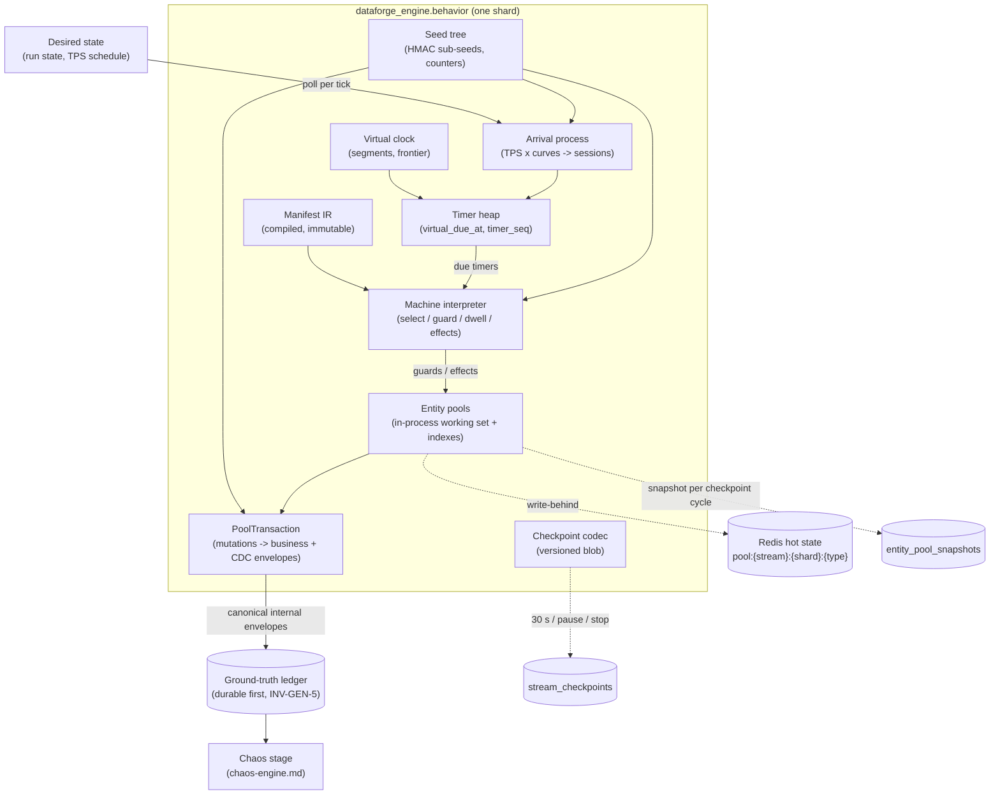
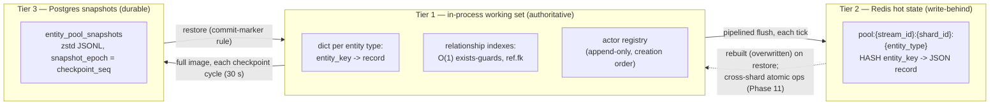

# DataForge — Behavior Engine

**Deliverable:** D7

This document is the runtime design of the behavior engine: the generic interpreter that executes manifest-declared state machines (ADR-0003, ADR-0007) over entity pools to produce the canonical event stream. It specifies the actor/session execution model, the three-tier entity-pool architecture (in-process working set, Redis hot state, Postgres snapshots), guard evaluation that makes invalid sequences structurally impossible, the virtual clock and timer scheduler, dwell-time sampling, intensity curves, the arrival process that maps `target_tps` to session arrivals, the full seed-derivation tree and the determinism boundary (ADR-0008), backfill mode, the checkpoint codec and restore semantics for pause/resume/restart/failover, and the CDC emission hook (ADR-0012). The manifest grammar it interprets is owned by [scenario-plugin-architecture.md](scenario-plugin-architecture.md); the envelope it emits is frozen in [../03-domain/event-model.md](../03-domain/event-model.md); the process that hosts it is [../02-architecture/backend-architecture.md](../02-architecture/backend-architecture.md) §8; invariants cited as `INV-*` are defined in [../03-domain/domain-model.md](../03-domain/domain-model.md).

---

## 1. Position and design tenets

The behavior engine is the **Generation** stage of the pipeline Behavior → ground-truth ledger → Chaos → Delivery (ADR-0009). It lives in the framework-free package `dataforge_engine.behavior` (backend-architecture §4): zero Django imports, stdlib + `jsonschema` only (BE-ENG-1), wall-clock time injected by the host, all I/O through the ports in `dataforge_engine.ports`. The same code runs in three hosts — the runner shard worker (production), the Layer-3 dry-run Celery worker (manifest validation, [scenario-plugin-architecture.md](scenario-plugin-architecture.md) §8.4), and plain pytest (golden-seed replay, [../06-quality/testing-strategy.md](../06-quality/testing-strategy.md) §6).

| # | Tenet | Consequence |
|---|---|---|
| BE-T1 | **Generic interpreter, zero scenario code.** The engine executes any compiled manifest IR; there is no e-commerce branch, subclass, or string match on `scenario_slug` anywhere in `dataforge_engine.behavior` (plugin-architecture P-2). | Expressiveness gaps are manifest-grammar extensions, never runtime special cases. A grep gate for scenario slugs in engine code is part of the Phase 4 CI suite. |
| BE-T2 | **State first.** Every event — business and CDC — is the consequence of an entity-pool mutation or a state-machine transition over pooled entities (ADR-0012). The engine never fabricates an event from nothing. | Referential integrity is structural (INV-GEN-1/2); CDC and business views cannot diverge (INV-GEN-6). |
| BE-T3 | **Content is a pure function of recorded inputs.** The canonical sequence depends only on `(manifest_version, seed, merged configuration)` — PIN-1, the determinism unit — plus the stream's recorded TPS schedule (§3.6); never on wall pacing, tick boundaries, batch sizes, pauses, restarts, or failover (INV-GEN-3). | Golden replay, gradable exercises, and idempotent failover regeneration all hinge on §7. |
| BE-T4 | **Always clean.** The engine emits only canonical, referentially valid events to the ledger; it contains no chaos logic and no knowledge of chaos configuration (INV-CHA-1). Chaos is a downstream transform on the ledger output ([chaos-engine.md](chaos-engine.md)). | The ledger is always business truth; every delivered deviation is a recorded injection (INV-G-3). |
| BE-T5 | **Simulated time is the only business clock.** Dwell times, lifecycle latencies, intensity curves, return windows, and session timeouts all live on the virtual clock and stamp `occurred_at`; the engine touches the wall clock only for `emitted_at` stamping and pacing (event-model §3). | A 60× stream and a 30-day backfill produce the same business-time shapes as a 1× live stream. |

### 1.1 Component map



The runner's reconciliation tick (backend-architecture §8.3) drives this machine: poll desired state → reconcile lifecycle → set pacing → `shard.generate(budget, until)` → durable ledger append → hand the batch to chaos. Everything below specifies what happens inside `generate` and the state it keeps.

---

## 2. Actor and session model

### 2.1 Definitions (from the domain model, applied)

| Concept | Runtime realization |
|---|---|
| **Actor** | A simulated participant bound 1:1 to a pooled entity of the manifest's `metadata.actor_entity` type (e-commerce: a `users` entity). The actor's identity **is** that entity's key (`actor_id` = entity key, envelope field 14). An actor persists for the life of the stream; it exists from pool seeding (or from a later `create` effect on the actor entity type) and carries no machine state of its own — state lives in traversals. |
| **Session** | One traversal of the manifest's single `session` machine by one actor (one shopping visit): `session_id` (UUIDv7, §7.2), current state, pending dwell timer, session working memory (`remember` keys — the cart), and its two RNG cursors (§7.1). Bounded by the manifest `session_timeout` (default `PT30M`, simulated). |
| **Lifecycle traversal** | One traversal of a `lifecycle` machine, spawned when an entity of the machine's bound type is created (plugin-architecture §6.1) — e.g. `order_lifecycle` starts at order creation. Subject = the created entity. Exactly one traversal per (machine, entity instance), for the entity's life. |

### 2.2 Binding rules

| # | Rule |
|---|---|
| BE-A1 | A session arrival (§3.5) binds exactly one actor. The actor is drawn uniformly from the shard's **eligible** actor set: live actor entities assigned to this shard, not currently in an active session. Draw mechanics: index `i₀ = ⌊u·N⌋` over the shard's actor registry (append-only creation-order list), then deterministic circular scan forward to the first eligible actor. The draw `u` is keyed on the arrival index (§7.1), so binding is replay-stable. |
| BE-A2 | **At most one active session per actor.** A new arrival never preempts or parallels an actor's running session. This keeps per-actor state races impossible and per-actor `occurred_at` monotonic (INV-GEN-4) without locks. |
| BE-A3 | If no actor is eligible (all in session — possible only at extreme TPS over a tiny catalog), the arrival is **dropped deterministically**: no session, no event, a `sessions_dropped` count in stream stats. Structural safety is preserved; the realized arrival rate degrades visibly rather than corrupting state. |
| BE-A4 | Lifecycle traversals never bind actors; they bind their subject entity. Events they emit carry `actor_id` of the actor that owns the causal chain when the manifest payload references one (e.g. the order's `user_id` actor), else the actor recorded at spawn from the creating transition's context; `session_id` is `null` for post-session lifecycle events (event-model field 15). |
| BE-A5 | A traversal ends by: reaching a `terminal: true` state; absorption via a `remainder: exit` (or guard fall-through to it, §5.1); or — sessions only — the `session_timeout` timer firing. Ending a session frees its actor (BE-A2 eligibility) and discards session memory. Timeout absorption emits **no event**: an abandoned visit simply stops, exactly like real clickstream data. |
| BE-A6 | **Traversal hard cap:** 10,000 transitions per traversal (plugin-architecture B-13). Crossing it raises `GenerationError` — the manifest validator's expected-steps bound (MAN-V207) makes this unreachable for any published manifest, so it is a defense line, not a behavior. |

### 2.3 The interpretation algorithm (per due timer)

When the scheduler (§3.2) delivers a due timer for a traversal sitting in state `s` at virtual time `v` (= the timer's `virtual_due_at`), the interpreter executes exactly the contract of plugin-architecture §6.2, in this order:

1. **Timeout check.** If the timer is a state-`timeout` edge (it beat the sampled dwell, rule 5), fire that edge: go to step 4 with the timeout's `to`/`emit`.
2. **Select.** One uniform draw `u` from the traversal's `transitions` cursor (§7.1). Walk the state's transitions in declaration order accumulating probabilities; `u ≥ Σpᵢ` selects the remainder policy (`exit` absorbs the traversal per BE-A5; `stay` re-enters `s` and schedules a re-evaluation timer with a freshly sampled dwell).
3. **Guard.** Evaluate the selected transition's guard against the binding context (§5). On failure, **fall through to the remainder policy without re-drawing** (rule 3) — probability mass is never silently redistributed.
4. **Effects.** Open a `PoolTransaction` (§6) and execute the transition's effects in declaration order (`create`, `update`, `adjust`, `delete`, `remember`), ≤ 8 per transition (B-07). `adjust` on a guarded attribute is check-and-adjust atomic (§5.3); an atomicity failure aborts the whole transaction and falls to the remainder policy as if the guard had failed.
5. **Emit.** Stamp the transition's single `emit` event (if declared) at `occurred_at = v`, then the transaction's CDC events in effect order with consecutive `sequence_no`s and the same `occurred_at` (event-model R-CDC-2). Causality fields per event-model §2.3: sessions root their chain at `session_started`; lifecycle events keep the originating chain's `correlation_id` (C-3).
6. **Advance.** Enter the target state. If it is terminal, end the traversal (BE-A5). Otherwise sample the next dwell from the next selection's distribution — selection and dwell sampling happen together at this moment (rule 4) — clamp the sample at `P365D` (B-15 ceiling, deterministic), and push a timer at `v + dwell`. If the state declares a `timeout {after, to}` and the sampled dwell exceeds `after`, push the timeout edge's timer at `v + after` instead (rule 5).

Spawned entities trigger lifecycle-machine spawns inside step 4: a `create` effect on an entity type bound by a lifecycle machine pushes that machine's `initial`-state timer at `v + dwell(initial)` within the same transaction, so the new traversal's first event can never precede its subject's `c` event.

---

## 3. Time: virtual clock, scheduler, arrivals, pacing

### 3.1 Virtual clock and the generation frontier

The per-stream virtual clock is fixed by [../03-domain/event-model.md](../03-domain/event-model.md) §3.1: during run segment `i`, `virtual_now = vᵢ + k × (wall_now − wᵢ)` with `k = speed_multiplier` pinned at stream start (default `1.0`; configurable in Phase 8, fixed `1.0` before that). The clock is frozen while paused/stopped; resume opens a new segment anchored at `(wall_resume, v_checkpoint)`.

The engine adds one derived quantity: the **generation frontier `F`** — the virtual time up to and including which this shard has processed timers. Invariants:

| # | Rule |
|---|---|
| BE-C1 | `F ≤ virtual_now` in live mode, always: the engine never generates the future. In backfill mode `virtual_now` is undefined and `F` advances as fast as generation allows (§8). |
| BE-C2 | Every emitted event's `occurred_at` equals the virtual due time of the timer that produced it — **never** the value of `virtual_now` at processing. This single rule is what makes content independent of pacing: a starved shard processes the same timers at the same virtual stamps, just later in wall time. |
| BE-C3 | `F` advances monotonically; timers are processed in the total order of §3.2, so `occurred_at` is non-decreasing per shard, hence per actor (INV-GEN-4), with ties broken by `sequence_no`. |
| BE-C4 | If the shard falls behind (`virtual_now − F` grows because the token bucket or CPU starves it), content is unaffected; the lag is visible operationally as `df_runner_tick_overruns_total` and tick-duration saturation ([../02-architecture/observability.md](../02-architecture/observability.md) §4.4). Sustained lag is a capacity problem ([../02-architecture/scaling-strategy.md](../02-architecture/scaling-strategy.md) §2.1), never a correctness one. |

### 3.2 Timer heap

One binary min-heap per shard. Entry shape and total order are frozen because checkpoint restore and determinism depend on them:

| Field | Type | Semantics |
|---|---|---|
| `virtual_due_at` | int (simulated µs since `virtual_epoch`) | Primary order key |
| `timer_seq` | uint64 | Shard-local monotonic counter assigned at scheduling time; tie-breaker making heap order a deterministic **total** order; checkpointed |
| `kind` | enum | `arrival`, `dwell`, `state_timeout`, `session_timeout`, `background_day`, `bg_mutation` |
| `ref` | object | Traversal id (`session_id` or `{machine, subject_key}`), arrival index, or background-rule reference |

Timer kinds:

| Kind | Scheduled when | Fires |
|---|---|---|
| `arrival` | At stream start and after each arrival (§3.5) | Spawns one session: bind actor (BE-A1), create session, process the `initial` state immediately at the arrival's virtual time |
| `dwell` | At transition selection (§2.3 step 6) | Executes §2.3 for the traversal |
| `state_timeout` | When the sampled dwell exceeds the state's `timeout.after` | Fires the timeout edge (e.g. PRD L1: 30 min unpaid → `order_cancelled`) |
| `session_timeout` | At session spawn, at `v_spawn + session_timeout` | Absorbs the session if still active (BE-A5); cancelled lazily — a fired timer whose session already ended is discarded |
| `background_day` | At each simulated midnight (instance timezone), one per shard | Evaluates all background-mutation rules for the new simulated day and schedules that day's `bg_mutation` timers (§6.3) |
| `bg_mutation` | By `background_day` | Executes one background mutation (CDC-only, R-CDC-3) |

Cancellation is lazy everywhere (heap entries are never removed in place): a timer whose referent is gone or superseded is discarded on pop. Lazy discards are deterministic — whether a referent is gone is itself a pure function of prior content.

### 3.3 The generation call (inside the runner tick)

`shard.generate(budget, until)` — `budget` = tokens granted by the bucket this pass, `until` = `virtual_now` at tick end (live) or the backfill window end (§8):

```text
batch = []
while heap.peek().virtual_due_at <= until and budget - len(batch) >= 9:
    timer = heap.pop()                         # 9 = worst-case events per transaction
                                               # (1 business + 8 CDC, B-07): headroom is
                                               # checked BEFORE interpreting, so a
                                               # transaction is never split or re-run
    if stale(timer): continue                  # lazy cancellation
    F = timer.virtual_due_at                   # frontier advances on processing only
    batch += interpret(timer)                  # §2.3; sequence_no assigned here, gapless
return batch
```

Stopping a pass early (budget exhausted) is a wall-side decision: it shifts which pass an event lands in, never its content (BE-C2).

The runner calls this in **pipeline passes of ≤ 500 events** (the `max_batch` in backend-architecture §8.3 bounds one pass, not one tick): each pass runs generate → ledger append → chaos → publish, and passes repeat within the 1,000 ms tick while the bucket has tokens and timers are due. A transition's business event and its CDC events always land in the same pass (atomic with their transaction), so the ledger never holds a half-applied mutation.

### 3.4 Intensity curves — Phase 8 (flat `1.0` before)

Curves come from the manifest `intensity` section, overridable per scenario instance, and modulate **session arrival rate only** (PRD §4.3); per-session pacing is dwell-driven (L7/L8).

**Renormalization (exact).** Expand the manifest's diurnal buckets — which contiguously cover [0, 24) when declared (layer-2 rule, plugin-architecture §9.1 notes; a manifest that omits `diurnal` is flat `1.0`) — to 24 per-hour values `d(h)` and the weekly map to 7 values `w(j)`. The engine uses `d′(h) = d(h) / mean₂₄(d)` and `w′(j) = w(j) / mean₇(w)` — both means simple averages. Consequence (binding, unit-tested per testing-strategy §3): **changing curve shape never changes average throughput**; `target_tps` remains the daily average exactly.

**Evaluation.** Curves evaluate at the *arrival's virtual time* in the scenario instance's `simulated_timezone` (default UTC): `intensity(v) = d′(hour_local(v)) × w′(dow_local(v))`. The product is piecewise-constant with breakpoints at simulated hour and day boundaries — which is what makes arrival-time inversion closed-form (§3.5). Multiplier bounds `[0, 10]` per B-15; a zero-intensity span simply schedules no arrivals.

### 3.5 Arrival process: from `target_tps` to sessions

The manifest validator's Layer-3 dry run persists `mean_events_per_session` (`mes`) in the ValidationReport (plugin-architecture §8.4; `11.4` for the reference manifest) — the mean number of canonical events (business + CDC, lifecycle and background amortized in) per completed session. A manifest version without a persisted `mes` cannot start streams (guaranteed by INV-CAT-2 from Phase 4 on). The arrival rate is `λ(v) = ρ(v) × intensity(v)` sessions per **simulated** second, with the base density `ρ`:

```text
live mode:      rho(v) = tps(v) / (mes × shard_count × k)        k = speed_multiplier
backfill mode:  rho    = catalog_size(actor_entity) × visits_per_actor_day / 86,400
```

where `tps(v)` is the recorded TPS schedule of §3.6 evaluated at `v`. The `/k` factor is a frozen semantic, not an implementation detail: **`target_tps` is a wall-clock throughput contract** (quotas, rate caps, and the token bucket all live in the wall domain, event-model §3.5), so the wall event rate must converge on `target_tps` at any multiplier — wall session rate = `k × λ = tps / mes` per shard ⇒ wall event rate ≈ `target_tps`, and the bucket paces jitter rather than systematically starving. The corollary is stated plainly in user docs: a 60× stream compresses *latencies* 60× while holding wall throughput, so it simulates proportionally lighter per-simulated-day traffic; full-density compressed history is what backfill mode is for (§8). Backfill density is population-driven instead — `visits_per_actor_day` is fixed at **1.0** by this spec (a future manifest grammar version may expose it additively per §9.3 of the plugin architecture) — giving the reference manifest ≈ 5,000 sessions/simulated-day ≈ 57k events/day ≈ 1.7M events per 30-day dataset, the PRD E7 envelope. The dataset admission estimate is `simulated_days × catalog_size(actor_entity) × visits_per_actor_day × mes + snapshot_rows`, which is the formula [../05-interfaces/api-specification.md](../05-interfaces/api-specification.md) §4.10 delegates here.

**Inversion sampling (exact).** Arrivals are an inhomogeneous Poisson process realized by inversion over integrated intensity. Per shard, arrival `n` (n = 0, 1, …):

1. Gap draw: `Eₙ = −ln(1 − uₙ)`, with `uₙ` keyed on the arrival index — `uₙ = u(K_arr, n)`, `K_arr = stream_key(transitions, "arrival:{shard_id}")` (§7.1). Unit-mean exponential in integrated-intensity space; stateless, replay-stable.
2. Solve `∫_{vₙ₋₁}^{vₙ} λ(v) dv = Eₙ` by stepping the piecewise-constant segments of `λ` (hour boundaries, day boundaries, TPS-schedule steps): within a segment of rate `λₛ` and remaining mass `E`, if `λₛ·Δ ≥ E` the arrival lands at `v + E/λₛ`; else subtract and step. Zero-rate segments are skipped.
3. Schedule an `arrival` timer at `vₙ`; when it fires, bind an actor (BE-A1), mint `session_id` (§7.2), start the session machine at `initial`, and immediately schedule arrival `n + 1` by repeating from step 1.

Scheduler state is two numbers per shard — next arrival index and the partially-integrated solve position — both checkpointed (§9.1). If the TPS schedule or (at Phase 8) an instance's curves change the step function while an arrival timer is pending, the pending arrival is re-solved from the same `(vₙ₋₁, Eₙ)` against the updated step function: deterministic, because the schedule rows themselves are recorded inputs (§3.6).

### 3.6 TPS: token-bucket pacing and the recorded TPS schedule

Two mechanisms share one input and must never be conflated:

| Mechanism | Domain | Controls |
|---|---|---|
| **Token bucket** (per shard) | Wall | How fast canonical events leave the engine: rate = `target_tps / shard_count` tokens/s, capacity = `max(2 × rate, 1)` (a 2-second burst bound), continuous refill from the injected wall clock. Every canonical event — business, CDC, `op:"r"` snapshot row — costs one token. A pass that cannot publish does not advance (publish-failure backpressure, backend-architecture §9.2): the bucket starves, events are never dropped. |
| **TPS schedule** (per stream) | Simulated | How many sessions arrive per simulated second, via `tps(v)` in §3.5's `λ`. |

**The recorded TPS schedule (closes INV-GEN-3's "independent of TPS changes" mechanically).** `target_tps` is live-mutable (domain-model §4.4) yet the canonical sequence must be replay-stable across failover regeneration and restarts (ADR-0008: "independent of wall pacing, TPS changes, pauses, restarts, and failover"). Both hold because a TPS change is a **virtual-time-anchored durable input**, not an ambient read:

| # | Rule |
|---|---|
| BE-P1 | When the control plane accepts a TPS change (`PATCH` per [../05-interfaces/api-specification.md](../05-interfaces/api-specification.md)), it stamps `effective_virtual_at = virtual_now` (computed from the stream's persisted segment anchors) and appends `(effective_virtual_at, target_tps)` to the stream's desired-state document **before** the new value is visible to any runner poll. |
| BE-P2 | The engine evaluates `tps(v)` as the step function defined by the recorded entries: arrivals with `vₙ ≥ effective_virtual_at` integrate at the new rate (re-solving a pending arrival per §3.5); the bucket adopts the new rate at the next tick poll. Net effect ≤ 2 s wall (one 1 s poll + one pacing adjustment) — the Phase 6 exit criterion. An entry stamped behind the frontier applies from `max(F, effective_virtual_at)` — identically in any replay, since `F` crosses the recorded stamp at the same content position. |
| BE-P3 | The desired-state document retains every entry not yet superseded by a durable checkpoint: entries with `effective_virtual_at <` the latest checkpoint's frontier are pruned (regeneration never replays behind a checkpoint, §9.3), and the checkpoint records `tps_in_effect` at its frontier. Bound: ≤ 16 retained entries; a 17th change inside one checkpoint window is rejected `429` by the control plane (no legitimate workflow flips TPS 16 times in 30 s). |
| BE-P4 | **Determinism statement, exact:** the canonical sequence is a pure function of `(manifest_version, seed, merged-config sha256)` — PIN-1 — **plus the recorded TPS schedule and pinned `shard_count`**. Replays of the *same stream* (failover regeneration, stop/restart continuation) read the same recorded schedule and are byte-identical. Cross-run reproducibility surfaces — golden fixtures, datasets, graded exercises — hold TPS constant, where the schedule is the single pinned initial value and the guarantee reduces to PIN-1 alone, exactly as INV-GEN-3 and INV-G-4 state it. Per-session content is TPS-independent under all circumstances (every draw is keyed by traversal identity, §7.1); the schedule influences only *which* arrivals occur and *when* in simulated time. |

---

## 4. Entity pools

Entity pools are the per-stream, per-entity-type populations of simulated entities — the source of truth every event derives from (ADR-0007, ADR-0012). The architecture is three-tier, matching the access pattern measured in [../02-architecture/scaling-strategy.md](../02-architecture/scaling-strategy.md) §2.1 (~3 amortized Redis ops/event, shard-local working set):



### 4.1 Tier roles and consistency

| Tier | Role | Consistency contract |
|---|---|---|
| In-process working set | The **authoritative** live state the interpreter reads and mutates. One shard worker exclusively owns its slice (lease + fencing, INV-STR-2), so reads/guards/mutations are lock-free dict operations. | Always exact for shard-owned entities. |
| Redis hot state | Write-behind mirror flushed once per tick (pipelined `HSET`/`HDEL`). Serves: (a) cross-shard shared-entity operations at Phase 11 (§4.6); (b) read-only introspection (console pool counts, debugging) — never the interpreter's read path for owned entities. | Staleness ≤ 1 tick (1 s) for owned entities. Never used for restore: it may be ahead of the last durable checkpoint. |
| Postgres snapshots | Durable full images per (stream, shard, entity_type), one per checkpoint cycle, governed by the commit-marker rule ([../03-domain/database-schema.md](../03-domain/database-schema.md) §5.4): all snapshots written first stamped with the upcoming `checkpoint_seq`, then the checkpoint row last. | Exactly consistent with the checkpoint they accompany; fencing-conditioned writes reject deposed runners. |

**Why full images, not deltas:** pools are bounded by manifest resource bounds (B-08: ≤ 100,000 entities per type, Σ ≤ 250,000 ≈ 244 MiB raw), a 30 s full image is a single zstd-compressed upsert per type (≤ 128 MiB bound per row), restore is a read-then-load with no log replay, and idempotent re-writes need no compaction machinery. Deltas would buy bandwidth the system does not need at the cost of a recovery-path bug class.

### 4.2 Pooled-entity record and in-process structures

Per pooled entity, the record the interpreter holds (and the JSON the Redis hash and snapshot JSONL serialize):

| Field | Type | Semantics |
|---|---|---|
| `entity_key` | string `{key_prefix}_{16 hex}` | Identity; hex from the `pools` sub-seed (§7.1); ≤ 25 chars, never contains `:` (partition-key grammar) |
| `attributes` | object | Current attribute values per the manifest declaration |
| `entity_version` | int ≥ 1 | Increments by exactly 1 per mutation; the authoritative per-entity total order (event-model §4.2) |
| `created_at` / `updated_at` | RFC 3339, simulated | Runtime-maintained on every pooled entity (plugin-architecture §3.1); included in CDC row images |
| `status` | enum `live`, `terminal`, `deleted` | `terminal` = all lifecycle traversals for this entity have ended; `deleted` = removed by a `delete` effect (record dropped after its CDC `d` emits) |
| `in_session` | bool (actor entities only) | BE-A2 eligibility flag |

In-process indexes, built at seed/restore and maintained transactionally with mutations:

| Index | Shape | Serves |
|---|---|---|
| Relationship index, one per declared relationship (≤ 100, B-11) | `target_entity_key → set(source_entity_key)` | `exists` guards and `via` traversals in O(1) (plugin-architecture §3.2) |
| Live-key registry per entity type | append-only list of keys in creation order + tombstone bitmap | Uniform/zipf/recent `ref.fk` selection by index draw; the actor registry (BE-A1) is this structure for the actor entity |
| Recent window per entity type (only if a `ref.fk` uses `selection: recent`) | ring of (created_at, key) | `ref.fk` `recent` window selection |

Indexes are derived state: never checkpointed, always rebuilt from the loaded pool image on restore.

### 4.3 Redis key shapes, eviction, lifecycle

Key shapes are fixed in the Redis inventory of [../03-domain/database-schema.md](../03-domain/database-schema.md) §6; pool semantics are owned here:

| Key | Type | Content |
|---|---|---|
| `pool:{stream_id}:{shard_id}:{entity_type}` | HASH | `entity_key → JSON record` (§4.2 shape) |
| `pool:{stream_id}:{shard_id}:{entity_type}:meta` | HASH | `count`, `last_flush_seq`, `key_counter` — flush bookkeeping and introspection |

| Aspect | Contract |
|---|---|
| **Eviction: none.** | Pool keys carry **no TTL** and the backing Redis runs `maxmemory-policy noeviction` ([../02-architecture/deployment-architecture.md](../02-architecture/deployment-architecture.md) owns the instance config). Losing pool keys loses no durable truth (Postgres snapshots are the restore source), but silent LRU eviction would corrupt the Phase 11 cross-shard read path — so it is forbidden outright. |
| Removal by policy only | Entries leave the hash exactly three ways: a manifest `delete` effect (after its CDC `d` emits); terminal-entity archival (§4.4); stream deletion (T14 removes all `pool:{stream_id}:*` keys). |
| Memory bound | B-08/B-09 manifest bounds cap the worst case at ≈ 244 MiB per stream; `df_pool_entities` gauges the realized footprint ([../02-architecture/observability.md](../02-architecture/observability.md) §4.4). |
| Tenancy | Every pool key embeds its `stream_id` (workspace-resolvable, INV-TEN-1 applied to the Redis keyspace per database-schema §6); pool keys for one stream are never read in the context of another. |

### 4.4 Terminal-entity archival (the B-09 growth valve)

Long-running streams create entities without bound (orders, shipments). The live working set is capped at **500,000 per entity type per stream** (B-09); archival keeps a steady state under it:

| # | Rule |
|---|---|
| BE-E1 | The IR compiler computes, per entity type, `reachability_window` = the maximum simulated duration over every guard `within` clause, state `timeout`, and dwell bound that can reference the type (e-commerce shipments: the 30-day return window on `shipments.delivered_at` dominates). Capped at `P365D` (B-15). |
| BE-E2 | An entity is **archivable** when `status = terminal`, no pending timer references it, and `virtual_frontier − updated_at > reachability_window`. Archival removes it from Tier 1 and Tier 2; it persists in the ledger's history and in past snapshots, and its CDC stream is complete (no further mutations are possible by definition of `terminal`). Archived entities are invisible to `ref.fk` selection and `exists` guards — deterministically, since archival eligibility is a pure function of content and the archival sweep runs at each `background_day` timer (simulated midnight). |
| BE-E3 | If a sweep finds the live set still above cap, it archives `terminal` entities oldest-`updated_at` first **even inside their reachability window** — graceful degradation: a guard against an archived entity simply evaluates false (structurally safe; statistically negligible at the volumes that trigger it), counted in stream stats as `entities_force_archived`. |
| BE-E4 | If live **non-terminal** entities alone exceed the cap, generation raises `GenerationError` and the stream fails with `status_reason: error` (T11) — reachable only by a pathological manifest, which MAN-V207 and the L3 dry run exist to reject. |
| BE-E5 | The actor entity type is never force-archived (BE-E3 skips it): actors are the binding population. Its B-09 seed bound (≤ 100,000) plus BE-E4 still apply to runtime growth via `create` effects. |

### 4.5 Seeding from the manifest catalog

First start of a stream (T3, "seeded"); inputs: the merged config's `seeding.catalogs` sizes (instance-overridable within the manifest's declared `min`/`max`; defaults from the manifest, e.g. 5,000 `users` / 1,000 `products`).

1. **Order:** entity types in manifest declaration order; within a type, ordinal `0 … size−1`. Types whose entities are only created by effects (orders, shipments) have catalog size 0 and seed nothing.
2. **Keys:** entity key hex = one `u64` draw from `stream_key(pools, "keys:{entity_type}")` at counter = ordinal, rendered as 16 lowercase hex chars. On the (negligible) in-type collision, increment the type's `key_counter` and redraw — deterministic. Runtime `create` effects continue the same counter (checkpointed, §9.1).
3. **Attributes:** generated per the entity's declared generator specs in attribute declaration order, drawing from `stream_key(values, "entity:{entity_type}:{ordinal}")` counters (§7.1). `ref.fk` attributes resolve against already-seeded types — the validator's seed-order reference-DAG check (MAN-V111) guarantees declaration order suffices.
4. **Timestamps:** seeded entities get `created_at = updated_at = virtual_epoch`, `entity_version = 1`.
5. **CDC snapshot reads:** for every CDC-enabled entity instance seeded before the clock starts, emit exactly one `op:"r"` event (`before: null`, `after` = full image, `occurred_at = virtual_epoch`, `source.snapshot` per event-model §4.3) at the head of the stream, in seeding order, before any arrival timer fires. These rows flow through the full pipeline (ledger → chaos → delivery) and consume bucket tokens like any canonical event.
6. **Indexes and mirrors:** Tier-1 indexes built; Tier-2 hashes bulk-loaded; the first checkpoint cycle (snapshot + commit marker) completes **before** the runner reports `running` — so T4's "pool seeding fails" can only happen before any event exists.

Seeding cost is bounded by B-08 (≤ 250,000 entities): worst case low single-digit seconds, inside T4's 60 s lease-to-running budget.

### 4.6 Shared entities and cross-shard ownership — refined in Phase 11

MVP streams have exactly one shard; everything above is the whole story until Phase 11 sharding ([../02-architecture/scaling-strategy.md](../02-architecture/scaling-strategy.md) §2.2). The contract decided now, so sharding changes no interfaces:

| # | Rule |
|---|---|
| BE-S1 | Every pooled entity has exactly one **owner shard**: `owner = hash64(entity_key) mod shard_count` — the same assignment that routes actors (ADR-0006), so an actor and its created entities usually co-locate. Owned entities live in the owner's Tier 1/Tier 2 slice. |
| BE-S2 | A cross-shard effect (e.g. shard 2's checkout decrementing `inventory` owned by shard 0) executes as an **atomic Lua script on the owner's Redis hash**: apply mutation, bump `entity_version`, return `(before, after, entity_version)`. The emitting shard builds the CDC event from the returned images; PK-2 keying converges all of that entity's CDC on one Kafka partition where `source.entity_version` is the authoritative order (event-model §2.2.3). |
| BE-S3 | Cross-shard **reads** (guards over non-owned entities) are read-through against the owner's Redis hash with per-tick caching (staleness ≤ 1 s). Guard races are closed by §5.3 check-and-adjust atomicity, never by locks. |
| BE-S4 | **Determinism scope at `shard_count > 1`:** each shard's canonical sub-sequence is byte-identical per BE-P4 *except* the `before`/`after` images and `entity_version` values of cross-shard shared-entity CDC, whose interleaving across shards reflects execution order. The per-entity `entity_version` chain remains gapless and self-consistent (R-CDC-5), the multiset of deltas is deterministic, and all MVP/graded/golden surfaces run `shard_count = 1` where the carve-out is empty. This carve-out is stated now so Phase 11 inherits a decided contract, not a surprise. |

---

## 5. Guarded transitions: structural impossibility

### 5.1 Evaluation semantics

Guards are manifest-declared preconditions (plugin-architecture §6.3): a conjunction of ≤ 8 conditions (≤ 2 `exists`), referencing only declared entities, attributes, and relationships (MAN-V102/V103; paths and ops type-checked by MAN-V104). The runtime contract:

| # | Rule |
|---|---|
| BE-G1 | Guards are evaluated at transition selection time (§2.3 step 3), against the **current Tier-1 pool state** at the firing virtual time. Attribute conditions resolve context paths (`actor.*`, `subject.*`, `session.*`); `within` compares against the firing time (`virtual_frontier − subject.<ts> ≤ window`); `exists` is a relationship-index lookup with ≤ 4 `where` filters — O(1) plus filter cost, never a scan. |
| BE-G2 | A failed guard **falls through to the state's remainder policy for this evaluation** — no re-draw, no retry loop, no event. Realized transition rates therefore condition on guard pass; the L3 dry run reports realized vs configured rates so manifest authors see the gap (plugin-architecture §8.4). |
| BE-G3 | **There is no other path to an event.** The interpreter constructs an event only inside §2.3 step 5, which is reachable only through a passed guard on a declared transition (or a declared timeout edge). No API, no chaos stage, no replay path can mint a canonical event outside this funnel — chaos operates strictly post-ledger on existing events (INV-CHA-1) and can suppress, repeat, delay, or mutate, but never invent. Validity is therefore *structural*: the invalid sequence is not filtered out, it is never representable (INV-GEN-2). |
| BE-G4 | Guard evaluation performs no mutation and no draw — it cannot perturb RNG cursors, so adding or tightening a guard in a new manifest version shifts realized rates but never scrambles unrelated content. |

### 5.2 Worked example: a refund structurally requires a delivered (or lost) order

Manifest fragment (the reference scenario's refund gate — [scenarios/ecommerce.md](scenarios/ecommerce.md) §2, `shipment_lifecycle.delivered`, abridged to the refund edge; the parallel 0.25 review edge is elided):

```yaml
state_machines:
  shipment_lifecycle:
    type: lifecycle
    binds: shipments
    initial: created
    states:
      delivered:                           # entered when shipment_delivered fired
        remainder: exit                    # F8 0.25 + F9 0.05 + 70% quiet exit
        transitions:
          - to: refund_requested_exit      # PRD F9: 5% within the return window
            probability: 0.05
            dwell: { family: lognormal, median: P4D, p95: P21D }   # PRD L5
            guard:
              all:
                - { path: subject.status, op: eq, value: delivered }
                - { path: subject.delivered_at, op: within, value: P30D }   # 30-day return window
            effects:
              - action: create
                entity: refunds
                set: { order_id: { from: subject.order_id }, user_id: { from: subject.user_id },
                       amount: { from: subject.total }, status: { const: requested },
                       reason: { const: product_return } }
            emit: refund_requested
```

Execution trace for order `ord_3c9f21ab44e0d217` (one shard, times simulated):

| v | Timer | Pool state before | Outcome |
|---|---|---|---|
| 14:23:05 | session dwell: `checkout → order_done` | no `orders` row for this purchase yet | `create orders` → `ord_3c9f…` (`entity_version 1`, CDC `c`); `order_lifecycle` traversal spawns; `order_placed` emitted, seq *n*; CDC row seq *n+1* |
| 14:23:51 | order dwell (L1, 46 s): `placed → reserving` (stock guard passes) | order `status: placed` | `payment_authorized` emitted; order `u`; reservation follows (`inventory_adjusted`, inventory `u`) |
| +18 h | order dwell (L2): `awaiting_fulfillment → fulfilling` | payment authorized | `shipment_created`; `shipments` row `shp_…` created (`status: created`); **`shipment_lifecycle` traversal spawns — subject = the shipment** |
| +12 h | shipment dwell: `created → in_transit` | shipment `status: created` | `shipment_shipped`; shipment `u` |
| +2.6 d | shipment dwell (L3): `in_transit → delivered` (p 0.97) | shipment `status: in_transit` | `shipment_delivered`; shipment `u` sets `status: delivered` **and `delivered_at`**; order `u` sets `status: completed` via `subject.via.shipment_order`; traversal enters `delivered` |
| +4.2 d | shipment dwell (L5): selection draw `u = 0.031 < 0.05` → refund edge selected | shipment `status: delivered`, `delivered_at` 4.2 d ago | guard: `subject.status eq delivered` ✓; `subject.delivered_at within P30D` ✓ → `create refunds` (reason `product_return`) → **`refund_requested` emitted** |

The two failure paths, same draw `u = 0.031`:

| Counterfactual | Guard / structure | Outcome |
|---|---|---|
| Dwell sample lands 31+ simulated days after delivery | `within P30D` → false | Fall through to `remainder: exit` — traversal absorbed; **no refund event exists, ever, for this order** (the return window is closed) |
| Shipment never delivered (still in transit, or lost via the 3 % edge / 14-day timeout) | the traversal never enters `delivered`, so the refund edge is never even evaluated | The only refund for that order is the `lost` state's auto-refund (reason `shipment_lost`) — still a `create refunds` effect, reachable only after a terminal shipment outcome |

There is no event-construction path that bypasses these transitions (BE-G3), the chaos stage cannot create a `refund_requested` (INV-CHA-1), and the manifest validator rejects guards over undeclared attributes or relationships (MAN-V102/V103) — so "refund without delivered order" is not low-probability; it is **unrepresentable**. The Phase 8 exit criterion property test (1M-event soak, zero `refund_requested` without a prior `shipment_delivered`/`shipment_lost` on the same order) verifies the implementation against this section ([../06-quality/testing-strategy.md](../06-quality/testing-strategy.md)).

### 5.3 Check-and-adjust atomicity (inventory never negative)

A guard can pass and the world change before the effect applies — across shards (Phase 11) or between two transitions in the same pass touching one entity. The closure:

| # | Rule |
|---|---|
| BE-G5 | An `adjust` effect whose attribute appears in the firing transition's guard is executed as **check-and-adjust**: the relevant condition is re-validated atomically with the mutation (Tier-1 dict op at one shard; the BE-S2 Lua script cross-shard). On failure the entire `PoolTransaction` aborts — no mutation, no events — and the selection falls to the remainder policy exactly as a guard failure (BE-G2). |
| BE-G6 | Numeric floors are absolute: an `adjust` may never take a guarded numeric attribute below the bound its guard implies (e-commerce: `inventory.stock ≥ 0`). PRD §4.4's "inventory never negative" is enforced by BE-G5, not by clamping — a clamped value would silently falsify CDC images. |

---

## 6. CDC emission hook (ADR-0012) — shape frozen Phase 0, emission ships Phase 8

### 6.1 PoolTransaction: one mutation, two views

Every transition's effects run inside a `PoolTransaction`. On commit it produces the canonical envelopes for the pass, enforcing event-model §4.4 mechanically:

1. Collect mutations in effect declaration order, each capturing `(entity_type, entity_key, before_image, after_image, op, entity_version)` — images copied at mutation time from Tier 1, including runtime-maintained `created_at`/`updated_at`.
2. On commit, assign `sequence_no`s: business event first (if the transition declares `emit`), then one CDC event per mutation of a CDC-enabled entity whose `op` is listed in the entity's `cdc.ops` — consecutive, same `occurred_at` (R-CDC-2). Mutations of non-CDC entities still happen; they just emit nothing (R-CDC-M1).
3. Stamp CDC envelopes: `op` at envelope and payload level (equal, event-model §4.1); `payload` = Debezium sub-envelope with `source.entity_version` from step 1, `source.tx_id = causation_id =` the business event's `event_id`, `correlation_id` inherited from the chain (C-4); `partition_key` per PK-2 (the mutated entity itself, never overridable); `schema_ref` = `{scenario_slug}.cdc.{entity_type}` at the stream's pinned version; `entity_refs` = exactly the mutated entity (event-model field 16).
4. Abort (BE-G5, or any `GenerationError`) discards the transaction wholesale: no partial mutation is ever visible to a later timer in the same pass.

This is the **only** CDC emission point in the platform: CDC cannot drift from business truth because both are projections of the same committed transaction (INV-GEN-6). R-CDC-4 (`u`/`d` never before `c`/`r`) holds structurally — a mutation requires a Tier-1 record, which exists only via seeding (which emitted `r`) or a `create` effect (which emitted `c`).

### 6.2 Background mutations (R-CDC-3)

Manifest-declared attribute drift with no causing business event (exercise E4's 0.5 %/entity/day address change):

| # | Rule |
|---|---|
| BE-B1 | At each `background_day` timer (simulated midnight, instance timezone), for every rule and every eligible pooled entity: occurrence draw from digest `draw(stream_key(pools, "bg:{rule_name}:{entity_key}"), day_index)` — bytes 0–8 as `u_occur` (mutate iff `u_occur < probability`), bytes 8–16 as `u_time` (firing time = day start + `u_time` × 24 h). One digest decides both; `day_index` = whole simulated days since `virtual_epoch`. |
| BE-B2 | The fired `bg_mutation` timer opens a PoolTransaction with the rule's `set` generators (values keyed per §7.1), emitting CDC only: chain root (`correlation_id = event_id`, `causation_id = null`), `actor_id = null`, `session_id = null`, `source.tx_id = null` (R-CDC-3). |
| BE-B3 | Bounds: ≤ 8 rules/entity, ≤ 20/manifest, `probability ≤ 1.0`/entity-day (B-14) — worst-case background volume is catalog × rules/day, which the L3 dry run folds into `mes`, keeping §3.5's TPS conversion honest. |
| BE-B4 | Entities created mid-day become eligible at the next simulated midnight — eligibility is evaluated only at `background_day`, keeping the schedule a pure function of (rule, entity, day). |

---

## 7. Seeds and determinism (ADR-0008)

### 7.1 The derivation tree

The stream `seed` is a non-negative 63-bit integer (domain [0, 2⁶³−1]; API: decimal string, [../05-interfaces/api-specification.md](../05-interfaces/api-specification.md) R-3), client-supplied or server-generated at stream creation, immutable forever (INV-STR-5). All randomness in the platform derives from it through exactly two HMAC levels plus a counter (`dataforge_engine.seeds`, backend-architecture §4.1):

```text
seed_bytes          = BE64(seed)                                  # 8 bytes, big-endian
subseed(ns)         = HMAC-SHA256(key = seed_bytes, msg = utf8(ns))      # 32 bytes
stream_key(ns, ctx) = HMAC-SHA256(key = subseed(ns), msg = utf8(ctx))   # 32 bytes
draw(K, n)          = HMAC-SHA256(key = K, msg = BE64(n))         # 32-byte digest
u64(K, n)           = bytes 0..8 of draw(K, n) as big-endian uint64
u(K, n)             = u64(K, n) / 2^64                            # uniform [0, 1)
```

The four top-level namespaces are fixed by ADR-0008: `values`, `transitions`, `pools`, `chaos`. The `chaos` sub-seed is handed to the chaos engine and consumed per [chaos-engine.md](chaos-engine.md) §4.1 — the behavior engine never draws from it, which is why toggling chaos can never perturb canonical content (namespace isolation). The behavior engine's complete context catalog (any new draw site must be added here before use, mirroring the chaos draw-catalog discipline):

| Namespace | Context `ctx` | Counter | Decides |
|---|---|---|---|
| `transitions` | `arrival:{shard_id}` | arrival index `n` | Exponential gap `Eₙ` (§3.5) |
| `transitions` | `bind:{shard_id}:{n}` | retry `i` (0…) | Actor-binding index draw (BE-A1) |
| `transitions` | `session:{session_id}` | per-session cursor | Selection draws and dwell samples for the session traversal |
| `transitions` | `lifecycle:{machine}:{subject_key}` | per-traversal cursor | Selection draws and dwell samples for the lifecycle traversal |
| `values` | `arrival:{shard_id}:{n}` | 0 | `session_id` UUIDv7 random bits (§7.2) |
| `values` | `session:{session_id}` | per-session cursor | Payload-attribute generator draws and `event_id` digests for in-session events |
| `values` | `lifecycle:{machine}:{subject_key}` | per-traversal cursor | Same, for lifecycle events |
| `values` | `entity:{entity_type}:{ordinal}` | per-entity cursor | Seeding-time attribute generation (§4.5) |
| `values` | `bg:{rule_name}:{entity_key}:{day_index}` | per-mutation cursor | Background-mutation `set` generator draws and the CDC event's `event_id` digest |
| `pools` | `keys:{entity_type}` | creation ordinal | Entity-key hex digits (seeding and runtime creates share the counter) |
| `pools` | `bg:{rule_name}:{entity_key}` | `day_index` | Background occurrence + time-of-day (one digest, BE-B1) |
| `chaos` | — (owned by chaos-engine.md) | — | All injection decisions |

Properties this buys, stated once: **per-traversal isolation** (one session's draw count never shifts another's — sessions are independently replayable); **per-generator accounting** (every generator sample consumes a deterministic number of draws from its context, §7.3, so adding an attribute to a *new* manifest version never scrambles existing attributes' values within a context); **identity keying over order keying** (arrival gaps, bindings, entity keys, and background schedules are PRF evaluations on stable identities, immune to processing order); and **cursor restorability** (the only mutable RNG state is a set of named uint64 counters, checkpointed in §9.1 — ADR-0008's "RNG cursor positions").

### 7.2 Deterministic UUIDv7 assembly

`event_id` (and `session_id`) follow event-model §2.2.1: 48 timestamp bits = simulated milliseconds of `occurred_at` (sessions: the arrival's virtual time), randomness from the seeded tree. Exact layout from one digest `D = draw(K, n)` (one counter consumption):

| UUID bytes | Content |
|---|---|
| 0–5 | `occurred_at` simulated epoch-milliseconds, big-endian 48 bits |
| 6 | `0x70 \| (D[0] & 0x0F)` — version 7 + rand_a high nibble |
| 7 | `D[1]` |
| 8 | `0x80 \| (D[2] & 0x3F)` — RFC 9562 variant + rand_b high bits |
| 9–15 | `D[3..10]` |

74 random bits per id from a context private to the traversal/entity — collision within one simulated millisecond is avoided deterministically, ids are k-sortable in event time, and identical inputs reproduce identical ids (the property `event_id`-keyed chaos draws depend on, chaos-engine §4.2).

### 7.3 Distribution sampling (closed catalog)

Every sample consumes **exactly one** draw (`fixed` consumes zero) — fixed-draw accounting is what makes cursors restorable and content additive-change-safe:

| Family | Sample from `u` | Notes |
|---|---|---|
| `fixed value` | `value` | No draw |
| `uniform min max` | `min + u × (max − min)` | Durations or numerics |
| `exponential mean` | `−mean × ln(1 − u)` | — |
| `lognormal median p95` | `exp(ln(median) + σ · Φ⁻¹(u_c))`, `σ = ln(p95/median) / 1.6448536269514722` | `Φ⁻¹` = `statistics.NormalDist().inv_cdf` (stdlib, BE-ENG-1); `u_c = clamp(u, 2⁻⁶⁴, 1 − 2⁻⁵³)` guards the open interval |
| Dwell ceiling | all dwell samples clamp at `P365D` | B-15 hard bound, deterministic |

Discrete generators (`choice.*`, `number.int`, zipf, etc.) map `u` per their plugin-architecture §4 catalogs; multi-draw generators (`template`, `address.full`) consume their fixed per-call draw count in placeholder/property declaration order. Attribute and payload-field evaluation order is the manifest's declaration order — pinned, because reordering draws is a content change.

### 7.4 The determinism guarantee and its boundary

**Guarantee (INV-GEN-3, INV-G-4, operationalized):** same `(manifest_version, seed, merged-config sha256)` — PIN-1 — with the same recorded TPS schedule and pinned `shard_count` ⇒ byte-identical canonical sequence per shard under canonical serialization (event-model S-2), and (via the `chaos` sub-seed and PRF keying) identical chaos injections. Verified permanently by the GOLD suite ([../06-quality/testing-strategy.md](../06-quality/testing-strategy.md) §6) and the published-manifest replay gate.

**Inside the boundary (content — must never vary):** every envelope field except `emitted_at`; payload bytes; `sequence_no` assignment; entity keys, attribute values, `entity_version` chains; timer order; arrival times in simulated time; UUIDv7 ids; CDC images.

**Outside the boundary (timing and interleaving — explicitly allowed to vary):**

| Varies freely | Why it cannot touch content |
|---|---|
| Wall-clock pacing: tick boundaries, pass sizes, bucket starvation, CPU scheduling | Events stamp `occurred_at` from timer due-times, never from `virtual_now` at processing (BE-C2); the heap is a total order (§3.2) |
| `emitted_at` and CDC `ts_ms` | Wall-domain by definition (event-model §3.1); golden runs pin them via the **injectable wall clock** the engine requires of every host (BE-ENG-1; testing-strategy §6 injects 1 ms-per-event) |
| Cross-shard interleaving on Kafka, in the buffer, on any channel | Consumers' only ordering keys are `(shard_id, sequence_no)` and `partition_key` FIFO (event-model §6); the merge order of independent shards is not part of any contract |
| Pause/resume, stop/restart, lease failover | Checkpoint + deterministic regeneration into idempotent sinks (§9.3); the canonical sequence continues, never re-rolls (T12, INV-STR-5) |
| Chaos toggles, delivery behavior, consumer speed | Post-ledger stages read content, never feed back (INV-CHA-1, INV-DEL-1) |
| Shared-entity CDC interleaving at `shard_count > 1` | The single stated carve-out, BE-S4 — empty in MVP and on every graded surface |

---

## 8. Backfill mode — engine mode ships Phase 4; curves and multiplier land Phase 8

Backfill (`mode: backfill`, `backfill_days: N`) materializes N simulated days as a bounded batch — the datasets resource is its only API surface ([../05-interfaces/api-specification.md](../05-interfaces/api-specification.md) §4.10; quota caps 7/30/90 days and 1M/5M/20M events per PRD §7, estimated pre-admission from `mes`).

| # | Rule |
|---|---|
| BE-F1 | **Prefix property (binding):** a backfill over `[virtual_epoch, virtual_epoch + N days]` produces **byte-identical canonical content** to the first N simulated days of any run with the same PIN-1 inputs and the same arrival-density function `ρ × intensity(v)` (§3.5) — backfill is the same interpreter with pacing removed, not a second generator. The Phase 4 golden fixture proves it by running the engine twice over one window: backfill mode vs. simulated-live mode (injected wall clock, matched `ρ`), asserting byte equality under canonical serialization. |
| BE-F2 | Mechanics: no token bucket, no `virtual_now`; `generate` is called with `until = window_end` in memory-bounded passes (≤ 500 events), the frontier advancing as fast as timers process. `emitted_at` = wall time of generation — near-constant, monotone, explicitly meaningless in backfill (event-model §3.3). |
| BE-F3 | Termination: generation stops at the first timer due past `window_end`; in-flight lifecycles truncate exactly as a live stream observed at that instant would — open orders simply have no later events in the dataset (the realistic shape: a snapshot of a business mid-flight). |
| BE-F4 | Arrival density is population-driven per §3.5: `ρ = catalog_size(actor_entity) × 1.0 / 86,400` sessions per simulated second — fixed for the whole dataset (no TPS schedule exists in backfill). Intensity curves apply in full from Phase 8, so a 30-day backfill visibly shows the diurnal/weekly shape (Phase 8 exit criterion; flat 1.0 before). The admission estimate (`simulated_days × catalog × mes + snapshot_rows`) gates the request against the plan's day/event caps before any work is queued. |
| BE-F5 | Dataset head: the `op:"r"` snapshot rows of §4.5 step 5 for every CDC-enabled seeded entity, then the stream body in `(shard_id, sequence_no)` **post-chaos** order — chaos applies positionally per [chaos-engine.md](chaos-engine.md) §2.4 and event-model §3.4 (a 30-simulated-minute-late event re-inserts where the frontier first passes `occurred_at + 30 min`). |
| BE-F6 | Backfill runs in the runner process group as a leased single-shard generation (Celery orchestrates the job lifecycle only, ADR-0006); its pools and checkpoint state are job-scoped and deleted on completion — datasets are regenerable bit-for-bit from `(manifest_version, seed, config)` (INV-G-4), which is why dataset expiry (7 days) is loss-free. |

---

## 9. Checkpoint and restore

### 9.1 Codec (versioned; the `state` blob of `stream_checkpoints`)

One checkpoint blob per (stream, shard): zstd-compressed canonical JSON, ≤ 32 MiB compressed ([../03-domain/database-schema.md](../03-domain/database-schema.md) §5.3 — exceeding it is a `GenerationError`, bounded in practice by B-06/B-08/B-10). Written by `dataforge_engine.behavior`'s checkpoint codec; the row's `fencing_token`, `checkpoint_seq`, `last_sequence_no`, and `virtual_clock_at` columns duplicate blob fields for SQL-side inspection.

| Field | Type | Contents |
|---|---|---|
| `codec_version` | int | `1`. Restore refuses an unknown major; additive fields bump minors inside the blob (`codec_minor`) |
| `pin_echo` | object | `{scenario_slug, manifest_version, config_sha256, seed, shard_count}` — validated against the stream pin on restore; mismatch = corruption, refuse to start (T4) |
| `sequence_no_last` | uint64 | Last assigned canonical sequence number (gapless counter resumes at +1, INV-GEN-7) |
| `vclock` | object | `{virtual_epoch, speed_multiplier, frontier_us, mode}` — `frontier_us` is `F` in simulated µs; resume anchors a new segment at `(wall_resume, frontier_us)` |
| `tps` | object | `{in_effect, pending: [{effective_virtual_at, target_tps}]}` — the §3.6 schedule tail not yet behind this checkpoint |
| `arrival` | object | `{next_index, solve_from_us, gap_remaining}` — the §3.5 integrator position |
| `timer_seq_next` | uint64 | Heap tie-breaker counter (§3.2) |
| `timers` | array | Every live heap entry (serialized §3.2 shape), including pending `arrival`, `session_timeout`, and `background_day` timers |
| `sessions` | object | `session_id → {actor_key, machine_state, memory, rng_cursors: {transitions, values}, spawned_at_us, transition_count}` — bounded by B-10 memory caps |
| `lifecycles` | object | `{machine}:{subject_key} → {machine_state, rng_cursors, chain: {correlation_id, last_event_id}, transition_count}` |
| `pool_counters` | object | Per-entity-type `{key_counter, created_total, archived_total}`; per-actor `in_session` flags ride the pool snapshot, not the checkpoint |
| `bg_day_cursor` | int | Last simulated `day_index` whose background sweep completed |

Pool **contents** are deliberately absent: they live in `entity_pool_snapshots` rows stamped `snapshot_epoch = checkpoint_seq`, written in the same cycle under the commit-marker rule (database-schema §5.4) — snapshots first, checkpoint row last, all fencing-conditioned. A crash mid-cycle leaves orphan snapshots with a higher epoch, ignored and overwritten next cycle.

### 9.2 Write triggers (backend-architecture §8.4, restated with engine duties)

| Trigger | When | Engine duty |
|---|---|---|
| Periodic | every 30 s of wall time while `running` | Serialize between passes (never mid-transaction); snapshots + commit marker |
| Pause (T6) | once, before reporting `paused` | Same, synchronous; the virtual clock freezes at `frontier_us` |
| Stop (T10) | once, retained for restart-as-continuation (T12) | Same; the chaos late-arrival buffer applies its own OnStopPolicy independently ([chaos-engine.md](chaos-engine.md) §6) |
| Crash | never | Recovery = last periodic checkpoint + deterministic regeneration (§9.3) |

### 9.3 Restore semantics

One restore path serves resume (T8), restart-as-continuation (T12), retry-from-failed (T13), and lease failover ("crash without state change", domain-model §4.3):

1. **Load** the checkpoint row under the new fencing token; verify `pin_echo`. `None` ⇒ first start ⇒ seed per §4.5 instead.
2. **Load pool images** `WHERE snapshot_epoch = checkpoint_seq`; rebuild Tier 1 (records, indexes, actor registry) and **overwrite** Tier-2 Redis hashes wholesale — Redis is never trusted on restore (§4.1).
3. **Rebuild** the heap from `timers`, restore RNG cursors, arrival integrator, TPS schedule tail (merging any desired-state entries newer than the checkpoint, BE-P3), `sequence_no_last`, `timer_seq_next`.
4. **Re-anchor** the virtual clock: new segment `(wall_now, frontier_us)`. Dwell timers need no recomputation — they store absolute virtual due-times and the clock was frozen (or, after a crash, the gap is regenerated, not skipped).
5. **Resume ticking.** After a crash, up to 30 s of generation is **re-executed deterministically**: identical events re-append to the ledger (`ON CONFLICT (stream_id, shard_id, sequence_no) DO NOTHING` — byte-identical rows, INV-GEN-3), identical injection records no-op on their deterministic ids, and re-published Kafka messages are licensed at-least-once duplicates (event-model §6). In-flight funnels continue with zero sequence gaps — the Phase 6 exit criterion — because nothing about a traversal lives outside the checkpoint + pool image + seed tree.

What restore explicitly does **not** touch: the chaos late-arrival buffer (persistent, survives pause and failover per INV-CHA-5 — chaos-engine.md §6 owns its lifecycle matrix) and the delivery buffer/cursors (sink-side state, [delivery-channels.md](delivery-channels.md)).

---

## 10. Interaction contracts

| Counterpart | Contract |
|---|---|
| **Chaos stage** | The behavior engine **always emits clean canonical events to the ledger** — every pass appends durably (`LedgerSink`, INV-GEN-5) *before* the same batch is handed to `shard.chaos.transform(batch)` in-process (backend-architecture §8.3 steps 5–6). Behavior holds no chaos config, reads no chaos state, and shares nothing but the derivation rule for the `chaos` sub-seed (§7.1). Chaos may suppress, duplicate, delay, mutate — downstream, on copies, recorded (INV-CHA-1/4). |
| **Ground-truth ledger** | Append-only, idempotent on `(stream_id, shard_id, sequence_no)`, full internal envelope with `_df.canonical = true`. The ledger is the substrate for the answer key (ADR-0017) and batch downloads; the engine never reads it back (its memory of the past is the checkpoint + pools). |
| **Schema registry** | Every emitted envelope stamps `schema_ref` at the stream's pinned (or scheduled-upgraded, Phase 10) version; an unresolvable ref is a generation bug and the event is never emitted (INV-REG-4). Payloads are built from the manifest's field mappings; conformance to the derived schema is by construction (R-DER rules) and re-verified by contract tests, not runtime validation on the hot path. |
| **Stream Control / runner** | The engine is a library: the runner owns leases, fencing, polling, pacing calls, and lifecycle reporting (backend-architecture §8); the engine raises typed exceptions and never sleeps, retries, or reads the wall clock except through the injected `now` (BE-ENG-1/2). |
| **Observation** | Per-pass `StatsEmitter.incr` with per-type counts and `last_event_at` (≤ 5 s staleness, INV-OBS-2), plus `sessions_dropped` (BE-A3) and `entities_force_archived` (BE-E3) counters surfaced through stream stats. |
| **Quotas** | Invisible to the engine: quota exhaustion arrives as desired state `paused` (`status_reason: quota`), enforced by the control plane (INV-TEN-5). |

## 11. Engine configuration surface (the merged config the IR carries)

Everything the engine reads from the stream's pinned `(manifest_version, configuration)` copy — pinned at start, never live-mutated (INV-CAT-4, INV-STR-5); live inputs are exactly desired run-state, the TPS schedule (§3.6), and chaos config (which bypasses behavior entirely):

| Input | Source | Default | Bounds |
|---|---|---|---|
| Transition probabilities | manifest + instance overrides | PRD §4.1 funnel values | override `min`/`max` per transition; sums re-validated (INV-CAT-3) |
| Dwell distributions | manifest + overrides (params only, family fixed) | PRD §4.2 L1–L8 | every duration ≤ P365D (B-15) |
| Catalog sizes | manifest `seeding` + overrides | e.g. 5,000 users / 1,000 products | manifest `min`/`max`, B-08/B-09 |
| Intensity curves | manifest `intensity` + overrides | PRD §4.3 diurnal/weekly | multipliers ∈ [0, 10]; renormalized to mean 1.0 (§3.4) |
| `simulated_timezone` | manifest metadata + override | UTC | IANA zone |
| CDC entity toggles | manifest `cdc` + instance enable set | per-entity `enabled_default` | subset of manifest `cdc.entities` (R-CDC-M1) |
| `seed` | stream | server-generated in [0, 2⁶³−1] (R-3) | immutable (INV-STR-5) |
| `virtual_epoch`, `speed_multiplier`, mode | stream virtual-clock config | now / 1.0 / `live` | multiplier ∈ [0.1, 1000] (Phase 8); `backfill_days` per plan quota |
| `shard_count` | stream (Phase 11; MVP = 1) | 1 | ≤ 64 |
| `mes` (`mean_events_per_session`) | manifest ValidationReport (L3) | — | required to start streams (§3.5) |

## 12. Ownership boundaries

| Concern | Owner |
|---|---|
| Manifest grammar, validation pipeline, generator catalogs, override merge | [scenario-plugin-architecture.md](scenario-plugin-architecture.md) |
| Envelope fields, clock-domain rules, CDC sub-envelope, UUIDv7 bit rules | [../03-domain/event-model.md](../03-domain/event-model.md) |
| Chaos stages, injection records, late-arrival buffer lifecycle | [chaos-engine.md](chaos-engine.md) |
| Ledger/checkpoint/snapshot DDL, Redis key inventory, retention | [../03-domain/database-schema.md](../03-domain/database-schema.md) |
| Runner process, leases/fencing, tick loop, Kafka topology, ports | [../02-architecture/backend-architecture.md](../02-architecture/backend-architecture.md) |
| Per-shard capacity ceilings, sharding arithmetic | [../02-architecture/scaling-strategy.md](../02-architecture/scaling-strategy.md) |
| Stream lifecycle states/transitions, aggregate definitions, invariants | [../03-domain/domain-model.md](../03-domain/domain-model.md) |
| Datasets API, stream APIs, error catalog | [../05-interfaces/api-specification.md](../05-interfaces/api-specification.md) |
| Golden/statistical/property suites proving this design | [../06-quality/testing-strategy.md](../06-quality/testing-strategy.md) |
| Realism defaults (funnel, latencies, curves) | [../01-product/prd.md](../01-product/prd.md) §4 |
