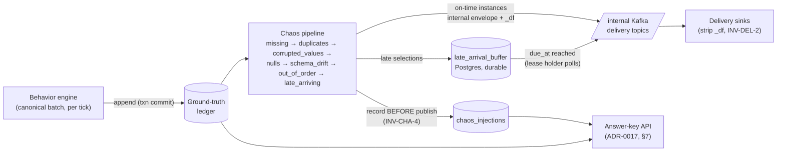

# DataForge — Chaos Engine

**Deliverable:** D8

This document is the full design of the chaos engine: the seeded, ordered, composable transform stage that corrupts **delivery truth** — and never business truth — between the ground-truth ledger and the delivery topics (ADR-0009). It freezes the canonical stage order and its rationale, the per-stream configuration schema and exact transformation semantics for all seven failure modes (`duplicates`, `late_arriving`, `missing`, `out_of_order`, `corrupted_values`, `nulls`, `schema_drift`), the durable late-arrival buffer and its complete lifecycle matrix (pause/resume/stop/crash/failover), the determinism contract, the ground-truth injection record and the instructor answer-key query contract (ADR-0017), exercise presets, and the per-workspace isolation guarantee. Terminology follows [../03-domain/domain-model.md](../03-domain/domain-model.md) exactly; invariants `INV-CHA-1…7` and the `ChaosPolicy`/`InjectionRecord`/`LateArrivalBuffer` aggregates are defined there (§2.7). Clock-domain rules and the `_df` label shapes are frozen in [../03-domain/event-model.md](../03-domain/event-model.md) (§3.4, §5.1); the manifest-side `chaos_defaults` shape is frozen in [scenario-plugin-architecture.md](scenario-plugin-architecture.md) (§9.1, B-16). The engine ships in Phase 9 ([../07-plan/phases/phase-09-chaos-engine.md](../07-plan/phases/phase-09-chaos-engine.md)).

---

## 1. Doctrine and pipeline placement

### 1.1 Delivery truth vs business truth

The single load-bearing rule (INV-G-3, INV-CHA-1): **the behavior engine always produces a clean, referentially valid canonical stream; chaos transforms only what consumers receive.** The ledger is always clean. Every delivered deviation from the ledger is a recorded injection. This is what makes exercises gradable (ADR-0017) and chaos modes independently testable.

What chaos may and may not touch — the exhaustive contract:

| Surface | Chaos may | Chaos may never |
|---|---|---|
| Ground-truth ledger | read (its sole input) | write, mutate, delete (INV-GEN-5) |
| Entity pools | — | read or mutate (chaos sees only envelopes) |
| Delivered **presence** | suppress an instance (`missing`), add instances (`duplicates`) | alter which canonical events *exist* |
| Delivered **timing/position** | shift `emitted_at` (`late_arriving`), displace local order (`out_of_order`) | touch `occurred_at`, `sequence_no`, `event_id`, or `partition_key` |
| **Payload values** | mutate leaf values (`corrupted_values`, `nulls`), add registered next-version fields (`schema_drift`) | touch any envelope field other than `emitted_at`; remove payload fields; invent unregistered fields (INV-REG-5); mutate the CDC frame (§5.3) |
| Causality / identity | — | modify `correlation_id`, `causation_id`, `actor_id`, `session_id`, `op`, `schema_ref` (event-model C-5) |
| Other streams / workspaces | — | anything, at any configured rate (INV-CHA-7, §9) |

`emitted_at` is therefore the **only** envelope field any mode may move (INV-CHA-6) — and `duplicates` copies even that verbatim (a copy is byte-identical to its original, event-model §7.3).

### 1.2 Placement: post-ledger, pre-publish

The chaos stage runs **inside the runner process, per shard**, between the ledger append and publication to the internal Kafka delivery topics (ADR-0009, ADR-0006). No canonical event may enter chaos before its ledger row is committed (INV-GEN-5); no sink ever sees a pre-chaos event (INV-DEL-1).



Per-tick integration (the runner's reconciliation loop; tick mechanics owned by [behavior-engine.md](behavior-engine.md)):

1. Poll desired state (run-state, `target_tps`, **chaos config** — §3.5).
2. Behavior engine generates the tick's canonical batch; ledger append committed.
3. Chaos pipeline processes the batch in stage order (§2.2); injections recorded; late selections inserted into the buffer.
4. Surviving/added instances published to the stream's internal Kafka delivery topic, keyed by `partition_key`.
5. Late-buffer poll: due entries published (§6.2).
6. Heartbeat, checkpoint (per schedule).

In **backfill mode** (ADR-0008) the same pipeline runs unpaced; realization differences per mode are pinned in §2.4.

### 1.3 What the chaos engine is not

- Not a fault injector for DataForge's own infrastructure — it simulates *upstream producer* pathologies for the consumer's benefit; platform resilience is [../06-quality/testing-strategy.md](../06-quality/testing-strategy.md) kill-tests.
- Not a filter or validator — it never rejects canonical events; it only adds, removes, mutates, or displaces **delivered instances**.
- Not random noise — every decision is a seeded, recorded, reproducible injection (§4); chaos above 50 % per mode is rejected as noise, not teaching signal (B-16).

---

## 2. Stage pipeline framework

### 2.1 Stage contract

Each mode is one stage implementing a single interface. Stages are composed in the fixed order of §2.2; disabled modes are skipped (identity). The pipeline is the only consumer of the canonical stream and the only producer onto delivery topics.

| Aspect | Contract |
|---|---|
| Interface | `process(batch: list[InternalEnvelope], ctx: StageContext) -> list[InternalEnvelope]` — input is the upstream stage's output in delivery order; output is this stage's delivery order |
| `StageContext` | `{stream_id, shard_id, workspace_id, chaos_subseed, mode_config, virtual_clock, registry_view, recorder, late_buffer}` — read-only except `recorder`/`late_buffer` |
| Side effects | Exactly two, both append-only: `recorder.record(InjectionRecord)` (must complete before the affected instance is emitted or suppressed — INV-CHA-4) and `late_buffer.insert(entry)` (`late_arriving` only) |
| State | Stages are stateless across ticks except: `out_of_order` holds the open window buffer (§5.6) and `late_arriving` removes instances from the in-line flow (§5.7). Both held states are covered by checkpoint/durability rules (§6) |
| Purity | A stage's output is a pure function of `(input batch, chaos_subseed, mode_config, registry_view)` — no wall-clock reads except stamping `emitted_at` at publish, no I/O beyond the two side effects |
| Labels | Every instance a stage touches gets `_df.canonical = false`, the stage's `injection_id` appended to `_df.injection_ids`, and the mode-specific `_df.chaos` block of event-model §5.1 |

### 2.2 Canonical stage order (normative)

The order is fixed by `StageOrder` (domain model §2.7) and is **not configurable**:

```
missing → duplicates → corrupted_values → nulls → schema_drift → out_of_order → late_arriving
```

Why this order — each placement is load-bearing:

| # | Placement | Rationale |
|---|---|---|
| O-1 | `missing` first | A suppressed event must exit before any other stage spends a decision on it: **a dropped event cannot also be duplicated, corrupted, or delayed.** Suppressing first also keeps every later mode's `rate` interpretable as "per delivered canonical event" (§2.3 CR-3). |
| O-2 | `duplicates` second, before the value stages | Copies must exist before value mutation so that the value stages — whose decisions are keyed per **canonical event** (CR-1) — stamp identical mutations onto every copy. That is what makes duplicate pairs byte-identical (event-model §7.3): a real producer-retry duplicate carries the same bad payload twice, and so does ours. Duplicates also precede the temporal stages so each copy can be displaced or delayed **independently** (CR-2) — the classic "redelivered duplicate arrives late" shape. |
| O-3 | `corrupted_values` before `nulls` | Both mutate payload leaves. Running corruption first and excluding already-mutated fields from null eligibility (CR-4) pins a deterministic outcome when both modes are enabled and guarantees each mutated field is attributable to exactly one injection record — gradability requires single-mode attribution per field. |
| O-4 | `schema_drift` after both value stages | Drift-injected next-version fields are added after corruption/nulls ran, so injected fields are **never** corrupted or nulled: a drift exercise's new fields are always clean and schema-valid against the next version, and a DLQ exercise's corruptions are always pinned-version fields. Also enforces R-CDC-6 cleanly (drift writes only into `after` images and business payloads). |
| O-5 | `out_of_order` after all content stages | Shuffling must operate on **finalized** instances — payload bytes settled, copies present, suppressions gone — so the recorded displacement describes exactly what the consumer receives. |
| O-6 | `late_arriving` last, terminal | A late selection physically leaves the in-line pipeline into the durable buffer and re-enters at the publish boundary at `due_at` (§6). Nothing may run after extraction — a stage downstream of `late_arriving` would never see the extracted instance and could not be deterministic over it. The terminal position is structural, not stylistic. |

### 2.3 Composition rules

| # | Rule |
|---|---|
| CR-1 | **Content decisions are keyed per canonical event.** `missing`, `duplicates` (selection + copy count), `corrupted_values`, `nulls`, and `schema_drift` derive every decision from `PRF(chaos_subseed, mode, event_id, label)` (§4.1). All instances of one `event_id` therefore receive identical content treatment — duplicate copies are byte-identical. |
| CR-2 | **Temporal decisions are keyed per instance.** `out_of_order` and `late_arriving` key their draws on `(event_id, duplicate_index)`, so an original can arrive on time while its copy arrives 30 minutes late. `duplicate_index` is deterministic (0 = original, 1…n = copies), so per-instance keying preserves full reproducibility. |
| CR-3 | **Rate semantics.** Each mode's `rate` is the selection probability per *eligible instance reaching that stage* (eligibility = `event_types`/`fields`/registry filters, §3.3). Because selections are PRF-keyed, modes are statistically independent: an event may simultaneously be duplicated, corrupted, and late. `missing` removes events before all other stages, so realized downstream rates are measured against delivered canonical events — exactly what a consumer can observe and a grader can verify. |
| CR-4 | **Disjoint field rule.** Within one event, the field sets mutated by `corrupted_values`, `nulls`, and `schema_drift` are pairwise disjoint: `nulls` excludes fields already corrupted; `schema_drift` only adds fields that did not exist. Every mutated field maps to exactly one injection record. |
| CR-5 | **Bounded amplification.** Delivered instances ≤ canonical × 1.5: `rate × E[copies] ≤ 0.5` for `duplicates` (§5.2, consistent with B-16's stated 1.5× cap), and no other mode adds instances. `missing` only shrinks. This bound is what lets quota and capacity arithmetic ([../02-architecture/scaling-strategy.md](../02-architecture/scaling-strategy.md)) treat chaos as a ≤ 1.5× multiplier. |
| CR-6 | **Envelope immutability.** No stage modifies any envelope field except `emitted_at` (stamped at actual publish for every instance) — enforced by a unit-level contract test that diffs pre/post-stage envelopes field by field. |
| CR-7 | **Record-before-effect.** `recorder.record()` is a synchronous Postgres insert committed before the affected instance is published, buffered, or suppressed (INV-CHA-4). A recorder failure fails the tick — the runner retries the whole tick batch idempotently (publication is at-least-once; records are keyed by deterministic `injection_id`, §7.1, so retries never double-count). |
| CR-8 | **CDC events are envelopes like any other.** All modes apply to CDC events, with two pinned restrictions: `schema_drift` writes only into `after` images and business payloads, never `before` (event-model R-CDC-6); `corrupted_values`/`nulls` may mutate row-image leaves but never the Debezium frame fields (`op`, `ts_ms`, `source.*`) — frame corruption would break answer-key joinability without adding a realistic producer pathology (§5.3). |

### 2.4 Realization in backfill mode

Backfill (ADR-0008) runs the identical pipeline with identical PRF decisions — same seed + config ⇒ the same events are duplicated, corrupted, dropped. Realization differences are purely about pacing:

| Mode | Live realization | Backfill realization |
|---|---|---|
| `missing`, `duplicates`, `corrupted_values`, `nulls`, `schema_drift` | identical | identical (content modes are pacing-independent) |
| `out_of_order` | window held until the virtual clock passes the window end (§5.6) | windows close as generation crosses the boundary — no wall delay |
| `late_arriving` | durable buffer + wall `due_at` (§6) | **buffer bypassed**: the instance is re-inserted in-stream at the first output position whose `occurred_at` ≥ original `occurred_at` + configured simulated delay (event-model §3.4 worked-example row). The injection record's `outcome` is `emitted` with `realized_wall_delay_ms = 0` and the positional displacement recorded |

In a backfill JSONL download, `emitted_at` is generation wall time and carries no business meaning (event-model §3.3); event-time lateness — `max(occurred_at seen) − occurred_at` — still equals the configured simulated delay, which is the point.

---

## 3. Configuration

### 3.1 Config layering

| Layer | Artifact | Mutability | Owner |
|---|---|---|---|
| 1. Manifest `chaos_defaults` | per-mode `{enabled, rate, params}` defaults for new scenario instances; all modes disabled by default (PRD §8 guardrail: first-run defaults are chaos-off) | immutable per published manifest version (INV-CAT-1) | [scenario-plugin-architecture.md](scenario-plugin-architecture.md) §2 |
| 2. Instance overlay `chaos` key | workspace override of layer 1, validated against this document's mode schemas (B-16: `rate ≤ 0.5`) | new `config_revision` per write (PIN rules) | scenario-plugin §11 |
| 3. Stream `ChaosPolicy` | the **live** per-stream config, initialized from the merged pin at stream start (T1), then runtime-mutable | live-mutable per PIN-3: toggles/rates/params within the pinned bounds | this document |

The pinned artifact is the *bounds*; the live `ChaosPolicy` value is desired state (scenario-plugin PIN-3). Every applied change is audit-logged as `streams.stream.chaos_policy_changed` (domain model §2.10).

### 3.2 ChaosPolicy document (normative shape)

One JSON document per stream — the seven mode keys (always present) plus `on_stop_policy`:

```json
{
  "duplicates":       { "enabled": true,  "rate": 0.05,
                        "params": { "copies": [ { "count": 1, "weight": 1.0 } ],
                                    "spacing": { "mode": "adjacent" },
                                    "event_types": ["*"] } },
  "late_arriving":    { "enabled": true,  "rate": 0.03,
                        "params": { "delay": { "family": "lognormal", "median": "PT30M", "p95": "PT2H" },
                                    "max_delay": "PT24H",
                                    "event_types": ["*"] } },
  "missing":          { "enabled": false, "rate": 0.01, "params": { "event_types": ["*"] } },
  "out_of_order":     { "enabled": false, "rate": 0.10,
                        "params": { "window": "PT60S", "event_types": ["*"] } },
  "corrupted_values": { "enabled": false, "rate": 0.02,
                        "params": { "fields": ["*"], "kinds": ["*"],
                                    "max_fields_per_event": 1, "event_types": ["*"] } },
  "nulls":            { "enabled": false, "rate": 0.02,
                        "params": { "fields": ["*"], "include_nullable": false,
                                    "max_fields_per_event": 1, "event_types": ["*"] } },
  "schema_drift":     { "enabled": false, "rate": 0.20,
                        "params": { "subjects": ["*"], "fields": ["*"] } },
  "on_stop_policy":   "discard"
}
```

`on_stop_policy ∈ {"discard", "flush"}` (default `"discard"`) is the stream's `OnStopPolicy` value (domain model §2.7) governing pending late re-emissions at stop (§6.3); it is live-mutable exactly like the modes via the same `GET | PATCH /api/v1/streams/{stream_id}/chaos` endpoint (api-spec §4.8.3), and the value in effect at the moment the stop command is processed applies.

Common keys per mode (the manifest `chaosMode` shape, scenario-plugin §9.1):

| Key | Type | Constraint | Default |
|---|---|---|---|
| `enabled` | boolean | required | `false` |
| `rate` | number | `0 < rate ≤ 0.5` (B-16); required when `enabled: true` | mode-specific preset values (§8) |
| `params` | object | ≤ 8 top-level keys; per-mode catalogs in §5 | per-mode defaults |

All durations are ISO-8601 (scenario-plugin §9.1 `duration` pattern — D/H/M/S only) and are **simulated time** (event-model §3.4 frozen rule). Mode identifiers are exactly the seven `ChaosMode` strings of domain model §2.7 — these appear verbatim in configs, presets, `_df.chaos` keys, injection records, answer-key responses, and metrics labels.

### 3.3 Shared selector grammar

| Selector | Grammar | Semantics |
|---|---|---|
| `event_types` | array of 1–50 strings; each an event type name (`order_placed`), a CDC form (`cdc.users`), or the sole wildcard `["*"]` (default) | Restricts mode eligibility to listed types. Names must exist in the pinned manifest's event-type/CDC set, validated at config write (CH-V05). |
| `fields` (`corrupted_values`, `nulls`) | array of 1–32 strings; each `{event_type}.{field_path}` with dotted nesting and `[]` for array items: `order_placed.total`, `order_placed.items[].unit_price`, `cdc.users.after.address.city`, or wildcard `*.amount`, or `["*"]` (all eligible leaves, default) | Restricts which payload **scalar leaf** fields may be targeted. Paths must resolve against the pinned-version registry schema for the event type (CH-V06). CDC paths must begin `before.`/`after.` and never address frame fields (CR-8). |
| `fields` (`schema_drift`) | array of field names, or `["*"]` (default) | Subset of the **added** fields of the registered next version per subject (§5.5). |
| `subjects` (`schema_drift`) | array of subject names or `["*"]` (default) | Restricts drift to listed subjects; each must have a registered version newer than the stream's **effective version** (the pinned version, until a mid-stream upgrade applies — schema-registry §10.2) (CH-V07). |

### 3.4 Validation rules

Applied identically wherever a chaos config is written: manifest `chaos_defaults` (layer-2 manifest validation), overlay writes, stream start, and live `ChaosPolicy` updates. Violations return `422` problem-details ([../05-interfaces/api-specification.md](../05-interfaces/api-specification.md) owns the error catalog) with the codes below.

| Code | Rule |
|---|---|
| CH-V01 | `rate ∈ (0, 0.5]` per mode (B-16); `enabled: true` requires `rate` |
| CH-V02 | `duplicates`: `copies` is 1–3 entries of `{count ∈ {1,2,3}, weight > 0}`; **`rate × E[copies] ≤ 0.5`** (CR-5 amplification bound); `spacing.mode ∈ {adjacent, gap}`; `gap` requires `max_events ∈ [1, 1000]` |
| CH-V03 | `late_arriving`: `delay` is a scenario-plugin §9.1 distribution (`fixed`/`uniform`/`lognormal`/`exponential`) in simulated time; `max_delay ≤ P30D` simulated; **`max_delay / speed_multiplier ≤ PT24H` wall** — keeps every pending horizon inside ledger retention (7 d) and bounds buffer dwell. Validated against the stream's pinned `speed_multiplier` at stream start and on every live update |
| CH-V04 | `out_of_order`: `window ∈ [PT1S, PT5M]` simulated |
| CH-V05 | Every `event_types` entry resolves in the pinned manifest |
| CH-V06 | Every `fields` path resolves to a scalar leaf in the pinned-version schema; CDC paths exclude frame fields |
| CH-V07 | `schema_drift` enablement requires ≥ 1 eligible subject with a registered next version (INV-REG-5); otherwise rejected — `422` `manifest-validation-failed` with the chaos-scoped error code `CH-V07` (api-spec §4.8.3) |
| CH-V08 | `corrupted_values.kinds` ⊆ the §5.3 vocabulary; `max_fields_per_event ∈ [1, 4]` |
| CH-V09 | The document contains exactly the seven known mode keys plus `on_stop_policy ∈ {discard, flush}`; unknown keys rejected (closed shape, mirroring the manifest `chaosDefaults` schema + api-spec §4.8.3) |

### 3.5 Runtime toggling semantics

Chaos config is **live-mutable** per stream (PIN-3; the only other live-mutable parameters are run-state, `target_tps`, and scheduled schema upgrades — INV-CAT-4). Mechanics:

| Aspect | Contract |
|---|---|
| Surface | `GET \| PATCH /api/v1/streams/{stream_id}/chaos` (mode-level merge, mode-internal replace — [../05-interfaces/api-specification.md](../05-interfaces/api-specification.md) §4.8.3); console chaos panel from Phase 9 |
| Propagation | Written to the stream's desired-state document; the runner's per-tick desired-state poll picks it up — **applied at the next tick boundary, end-to-end ≤ 2 s** (same contract as `target_tps`, domain model §4.4) |
| Granularity | Per mode: enable/disable, `rate`, `params` — independently, atomically per update |
| Mid-flight: `late_arriving` disable | Stops **new** selections only. Pending buffer entries are already-recorded injections and emit at their `due_at` unchanged — disabling a mode never un-records truth |
| Mid-flight: `out_of_order` disable | The open window closes immediately and flushes in canonical order with **no** injections recorded for it; re-enable takes effect from the next window boundary (§5.6) |
| Mid-flight: all other modes | Per-event decisions simply use the config active at the processing tick |
| Audit | Every applied change writes `streams.stream.chaos_policy_changed` with the before/after mode diff (INV-AUD-2) |
| Determinism interaction | INV-CHA-2 is conditional on config: identical `(seed, chaos config)` over an interval yields identical injections over that interval. Golden-replay fixtures (§11) run with a fixed config for the whole run |

---

## 4. Determinism

### 4.1 The chaos sub-seed and the PRF draw

All chaos randomness derives from the stream's `chaos` sub-seed: `chaos_subseed = HMAC-SHA256(stream_seed, "chaos")` (domain model §2.6, ADR-0008). Every decision is a pseudo-random function evaluation, never a stateful RNG cursor:

```
draw(mode, event_id, label[, instance])
  = first_8_bytes( HMAC-SHA256(chaos_subseed, mode ‖ ":" ‖ event_id ‖ ":" ‖ label [‖ ":" ‖ instance]) )
    as uint64 / 2^64          → u ∈ [0, 1)
```

Draw catalog (complete — any new draw must be added here before use):

| Mode | Key | Labels |
|---|---|---|
| `missing` | `event_id` | `select` |
| `duplicates` | `event_id` | `select`, `copies`, `gap:{i}` (per copy i) |
| `corrupted_values` | `event_id` | `select`, `field:{n}`, `kind:{n}` (per mutation n) |
| `nulls` | `event_id` | `select`, `field:{n}` |
| `schema_drift` | `event_id` | `select`, `value:{field_name}` (per injected field) |
| `out_of_order` | `(event_id, duplicate_index)` | `select`; window permutation seeded by `HMAC(chaos_subseed, "out_of_order:window:" ‖ shard_id ‖ ":" ‖ window_index)` |
| `late_arriving` | `(event_id, duplicate_index)` | `select`, `delay` |

Because draws are keyed on identifiers that are themselves deterministic (event-model §2.2.1: `event_id` is reproducible from the seed), the chain is closed: **same `(manifest_version, seed, configuration)` ⇒ identical canonical sequence (INV-GEN-3) ⇒ identical chaos decisions (INV-CHA-2)** — same events selected, same mutations, same delays, same shuffle.

### 4.2 Independence properties

PRF keying (not draw-order consumption) buys the properties golden replay needs:

| Property | Why it holds |
|---|---|
| Arrival/batch independence | A decision depends only on the event's identity, never on tick boundaries, batch sizes, or TPS pacing |
| Pause/resume/restart independence | No RNG cursor to checkpoint or corrupt; a restarted stream re-derives identical decisions for identical events (the canonical sequence continues, T12, so no event is ever re-decided) |
| Shard independence | Keys include nothing shard-relative except `out_of_order`'s per-shard window seed — and shard assignment is itself deterministic (ADR-0006) |
| Toggle locality | Enabling a mode mid-stream affects only events processed after the toggle; decisions for those events are still pure PRF evaluations |

Phase 9 exit criterion bound to this section: two runs with identical seed + config produce byte-identical injection record sets (modulo `recorded_at`/realized-wall fields, which are wall-clock and excluded from golden comparison — §11).

---

## 5. The seven modes

Summary (each mode is then specified exactly):

| Stage | Mode | Guarantee deliberately broken (event-model §6) | Decision key | Adds/removes instances |
|---|---|---|---|---|
| 1 | `missing` | `sequence_no` contiguity | canonical event | removes |
| 2 | `duplicates` | "each `event_id` delivered once" | canonical event | adds |
| 3 | `corrupted_values` | payload validity vs `schema_ref` | canonical event | — |
| 4 | `nulls` | payload validity vs `schema_ref` | canonical event | — |
| 5 | `schema_drift` | "payload has only effective-version fields" | canonical event | — |
| 6 | `out_of_order` | local arrival order within the window | instance | — |
| 7 | `late_arriving` | timely arrival; cross-key interleaving | instance | — (defers) |

All worked examples below share the event-model §7 stream: workspace `0d9f7b42-3a61-4c2e-9b8f-5e1a2c3d4f60`, stream `7b1e9c3a-2f54-4d08-a6b9-1c2d3e4f5a6b`, scenario `ecommerce`, manifest `1.0.0`, shard 0, `speed_multiplier = 1.0`. Injection-record common fields are defined in §7.1; per-mode sections list only the mode-specific fields.

### 5.1 `missing` — suppression with ledger retained

**Config.**

| Param | Type / bounds | Default | Meaning |
|---|---|---|---|
| `rate` | (0, 0.5] | preset-specific | P(suppress) per eligible instance |
| `params.event_types` | selector (§3.3) | `["*"]` | eligible types |

**Transformation (exact).** For each eligible event: if `draw(missing, event_id, select) < rate`, the event is removed from the batch — it is **never published to the delivery topics on any instance**. The ledger row is untouched (it was committed before the stage ran); the answer key can always produce the suppressed event in full. Suppression is keyed per canonical event (CR-1), so a suppressed event also produces no duplicates, no mutations, no late entry — it simply never existed in delivery truth.

**Worked example.** Canonical seq 48218 (`checkout_started`, `event_id` `019ea1c5-77aa-7bbc-9001-aabbccddeeff`) is selected. The consumer's cursor page shows `sequence_no` 48217 followed by 48219 — the documented consumer contract applies verbatim: *a gap in `sequence_no` is not an error* (event-model §2.2.2). No delivered instance exists, so no `_df.chaos` shape is defined for this mode (event-model §5.1 lists none — consistent).

**Injection record (mode-specific fields).** None beyond the §7.1 common fields — the record *is* the suppression: the answer key lists every suppressed `event_id` with its full canonical position, satisfying E1/E3-style grading ("which gaps were injected vs not yet received").

### 5.2 `duplicates` — byte-identical re-deliveries

**Config.**

| Param | Type / bounds | Default | Meaning |
|---|---|---|---|
| `rate` | (0, 0.5]; `rate × E[copies] ≤ 0.5` (CH-V02) | 0.05 (preset E1) | P(duplicate) per eligible event |
| `params.copies` | 1–3 entries `{count ∈ {1,2,3}, weight > 0}` | `[{count: 1, weight: 1.0}]` | distribution over number of extra copies |
| `params.spacing` | `{mode: adjacent}` or `{mode: gap, max_events: 1–1000}` | `adjacent` | where copies land in the delivered order |
| `params.event_types` | selector | `["*"]` | eligible types |

**Transformation (exact).**
1. Selection: `draw(duplicates, event_id, select) < rate`.
2. Copy count: weighted choice over `copies` using `draw(…, copies)`.
3. Each copy is a **byte-identical** clone of the original's delivered envelope — same `event_id`, `sequence_no`, `occurred_at`, **and `emitted_at`** (event-model §7.3: indistinguishable from a producer-retry duplicate). Only `_df` differs: `_df.chaos.duplicates.duplicate_index = i` (original = 0, copies ≥ 1), `_df.canonical = false` on copies.
4. Spacing: `adjacent` emits copies immediately after the original in the stage output. `gap` holds copy *i* and re-inserts it `g_i` positions later, `g_i` uniform over `[1, max_events]` from `draw(…, gap:i)`, realized within the stage's bounded hold buffer (≤ 1000 instances/shard by CH-V02's `max_events` cap).
5. Downstream, temporal stages treat each instance independently (CR-2) — a copy may additionally be shuffled or arrive late.

**Worked example.** Exactly event-model §7.3: seq 48217 `cart_item_added` selected at `rate 0.05`, 1 copy, adjacent — the consumer receives the identical envelope twice; dedup on `event_id` collapses the pair; counting rows double-counts revenue (the E1 lesson).

**Injection record (mode-specific fields).** `copies` (integer ≥ 1) — matching event-model §7.3's answer-key example and the `details` shape in [../03-domain/database-schema.md](../03-domain/database-schema.md) §6.2 exactly. The realized spacing is observable in the delivered order and reproducible from the seed (§4.1); it is not separately recorded.

### 5.3 `corrupted_values` — type-breaking mutations from a closed vocabulary

**Config.**

| Param | Type / bounds | Default | Meaning |
|---|---|---|---|
| `rate` | (0, 0.5] | 0.02 (preset E6) | P(corrupt) per eligible event |
| `params.fields` | field selector (§3.3), ≤ 32 | `["*"]` | targetable scalar leaves |
| `params.kinds` | subset of the vocabulary below | `["*"]` | permitted corruption kinds |
| `params.max_fields_per_event` | 1–4 | 1 | mutations per selected event |
| `params.event_types` | selector | `["*"]` | eligible types |

**Eligibility.** Scalar **leaf** payload fields only (strings, numbers, integers, booleans, date-times, enums, decimal strings) — arrays and objects are never replaced wholesale, but their scalar leaves (`items[].unit_price`) are eligible. CDC: leaves inside `before`/`after` images are eligible; the Debezium frame (`op`, `ts_ms`, `source.*`) never is (CR-8). Envelope fields never (CR-6).

**Corruption vocabulary (closed; the only permitted mutations).** Kind selection is a seeded choice among kinds valid for the target's pinned-version schema type:

| Kind | Valid for | Mutation | Example |
|---|---|---|---|
| `alpha_string` | decimal string, integer, number | replace with `"abc"` | `"total": "64.97"` → `"total": "abc"` — the PRD's canonical example |
| `locale_comma` | decimal string | `.` → `,` | `"64.97"` → `"64,97"` |
| `empty_string` | string, decimal string | replace with `""` | `"currency": ""` |
| `truncate` | string (length > 1) | keep first character | `"Rosa Delgado"` → `"R"` |
| `mojibake` | string | replace with a fixed mis-encoded token `"éöñ"` | encoding-bug shape |
| `wrong_type_number` | string, enum | replace with integer `123` | JSON type break |
| `string_wrap` | integer, number, boolean | wrap value in quotes | `"quantity": 1` → `"quantity": "1"` |
| `negative_flip` | integer, number | negate | `"quantity": 1` → `-1` |
| `int_overflow` | integer | replace with `9007199254740993` (> 2⁵³) | breaks JS consumers (event-model S-1 is violated *deliberately*) |
| `epoch_millis` | date-time string | replace with epoch-ms integer | `"2026-06-10T…Z"` → `1781187785123` |
| `invalid_timestamp` | date-time string | replace with `"2026-13-45T99:99:99Z"` | unparseable |
| `naive_local` | date-time string | strip the `Z` suffix | timezone-ambiguity bug |
| `out_of_vocabulary` | enum | replace with `"__unknown__"` | closed-enum break |
| `bool_string` | boolean | replace with `"yes"` | type break |

Every kind produces a payload that **violates the pinned `schema_ref`** (derived schemas are closed and exactly typed, scenario-plugin R-DER-3) — corruption is always machine-detectable, which is what makes E6's DLQ contents gradable to the event.

**Transformation (exact).** On selection: choose `max_fields_per_event` distinct eligible fields via `draw(…, field:n)` (uniform over the resolved selector set), then a valid kind per field via `draw(…, kind:n)`; apply mutations; label `_df.chaos.corrupted_values = {mutations: [{path, original_value}]}` (event-model §5.1 shape). Keyed per canonical event (CR-1): every duplicate copy carries the identical corruption.

**Worked example.** Seq 48213 `order_placed` (event-model §7.1) selected; field `total`, kind `alpha_string`:

```json
// canonical payload (ledger)                  // delivered payload
"subtotal": "59.97",                           "subtotal": "59.97",
"shipping_fee": "4.99",                        "shipping_fee": "4.99",
"total": "64.97",                              "total": "abc",
```

All 19 other envelope fields are byte-identical to the canonical event.

**Injection record (mode-specific fields).** `mutations: [{path: "total", original_value: "64.97"}]` — the `details` shape of database-schema §6.2, mirroring `_df.chaos` (event-model §5.1). The delivered corrupted value sits on the delivered instance itself and the chosen kind is reproducible from the seed (§4.1), so recording the original is sufficient: a grader verifies a learner's repaired value against `original_value` exactly.

### 5.4 `nulls` — unexpected nulls on non-nullable targets

**Config.**

| Param | Type / bounds | Default | Meaning |
|---|---|---|---|
| `rate` | (0, 0.5] | 0.02 (preset E6) | P(null-inject) per eligible event |
| `params.fields` | field selector, ≤ 32 | `["*"]` | targetable leaves |
| `params.include_nullable` | boolean | `false` | widen eligibility to schema-nullable fields |
| `params.max_fields_per_event` | 1–4 | 1 | nulled fields per selected event |
| `params.event_types` | selector | `["*"]` | eligible types |

**Nullable-target selection (exact).** Default eligibility is scalar leaf fields whose pinned-version schema does **not** admit `null` — so every injected null is schema-violating and detectable (the "unexpected null" of E6). With `include_nullable: true`, fields typed `["T","null"]` (manifest `nullable: true`, R-DER-2) become eligible too; nulling those is schema-*valid* but still breaks value-assuming pipelines — whether a given injected null violates the schema is derivable from the recorded `path` plus the pinned-version schema's nullability, so graders can distinguish the two classes without an extra record field. Fields already mutated by `corrupted_values` on the same event are excluded (CR-4). CDC frame fields and envelope fields: never (CR-8, CR-6).

**Transformation (exact).** On selection: choose target fields via `draw(nulls, event_id, field:n)`; set each to JSON `null` (the key remains present — a *null*, not a missing field; field removal is not a v0 chaos capability and would collide with `schema_drift`'s field-set semantics); label `_df.chaos.nulls = {mutations: [{path, original_value}]}`. Keyed per canonical event (CR-1).

**Worked example.** Seq 48230 `payment_authorized` selected; field `payment_method`:

```json
// canonical payload                            // delivered payload
"payment_id": "pay_2c8d4e6f0a1b",               "payment_id": "pay_2c8d4e6f0a1b",
"order_id": "ord_5f2e7d1a8c3b",                 "order_id": "ord_5f2e7d1a8c3b",
"payment_method": "credit_card",                "payment_method": null,
"amount": "64.97",                              "amount": "64.97",
```

**Injection record (mode-specific fields).** `mutations: [{path: "payment_method", original_value: "credit_card"}]` (database-schema §6.2 `details` shape, mirroring `_df.chaos.nulls`).

### 5.5 `schema_drift` — fields only from a registered next version

**Config.**

| Param | Type / bounds | Default | Meaning |
|---|---|---|---|
| `rate` | (0, 0.5] | 0.20 (preset E5) | P(drift) per eligible event |
| `params.subjects` | subject selector (§3.3) | `["*"]` | which subjects drift |
| `params.fields` | subset of next-version added fields | `["*"]` | which added fields are injected |

**The registry gate (INV-REG-5, INV-CHA-3).** Drift may inject **only** fields defined in a registered schema version newer than the stream's **effective version** for that subject (the pinned version, until a mid-stream upgrade applies — schema-registry §10.2). The target is always the *lowest* registered version greater than the effective version ("next", not "latest" — drift teaches one evolution step at a time; the v1→v2→v3 walkthrough is [schema-registry.md](schema-registry.md)). Eligibility per subject is resolved from the `registry_view` snapshot refreshed at each desired-state poll: a subject with no next version is simply ineligible — drift can never invent a field (CH-V07 rejects enabling the mode when *no* subject is eligible). Cross-reference: registration and `BACKWARD_ADDITIVE` compatibility are owned by [schema-registry.md](schema-registry.md); because next versions are additive-only (INV-REG-3), injected fields are always *new optional* fields — exactly the production drift shape.

**Transformation (exact).** For each eligible event (its subject has a next version and matches `subjects`): on `draw(schema_drift, event_id, select) < rate`, add **all** fields selected by `params.fields` from the next version's added-field set, with values synthesized from the next version's JSON Schema (table below) via `draw(…, value:{field_name})`. The envelope's `schema_ref` **keeps the stream's effective version** — the teachable signal is a payload carrying fields the declared schema does not define; the consumer's job (E5) is to detect unknown fields and resolve the next version from the registry API. For CDC events, fields are added to the `after` image and business payloads only, never `before` (R-CDC-6). Label: `_df.chaos.schema_drift = {from_version, to_version, fields_added}` (event-model §5.1 shape).

**Type-directed value synthesis (closed; drift has only the registry schema, not the next manifest's generators):**

| Next-version field schema | Synthesized value |
|---|---|
| `const` | the constant |
| `enum` | seeded choice among members |
| `boolean` | seeded boolean |
| `integer` / `number` | seeded value within schema `minimum`/`maximum` (defaults [0, 1000]) |
| decimal-string pattern | seeded conformant value, 2-digit scale (e.g. `"12.50"`) |
| `format: date-time` | the target event's `occurred_at` value — a pure function of the input batch (§2.1 purity), byte-stable across replays, and defined in backfill where `virtual_now` does not exist (behavior-engine BE-F2) |
| entity-key pattern `^{prefix}_[0-9a-f]{16}$` | seeded conformant token — **synthetic, not a live pooled entity**; drift values are schema-valid but referentially meaningless, pinned and documented (the exercise is schema handling, not joins) |
| plain string | seeded token from a fixed 64-word pool |
| array / object | minimal valid instance: 1 synthesized item / all required properties, recursion depth ≤ 4 |
| nullable (`["T","null"]`) | the non-null branch (an injected `null` field would be invisible) |

**Worked example.** Stream effective at `ecommerce.order_placed` version 1; version 2 is registered adding optional `shipping_state` (string — the normative schema-registry §9.3 evolution). Seq 48213 selected:

```json
// delivered payload — v1 fields unchanged, plus:
"shipping_state": "harbor"        // plain-string synthesis: seeded token from the 64-word pool
// envelope schema_ref UNCHANGED: { "subject": "ecommerce.order_placed", "version": 1 }
```

**Injection record (mode-specific fields).** `from_version: 1`, `to_version: 2`, `fields_added: [{path: "shipping_state", value: "harbor"}]` — E5's answer key (drift start time, affected types, field list, v-next event count) aggregates directly from these records.

### 5.6 `out_of_order` — tumbling-window shuffle

**Config.**

| Param | Type / bounds | Default | Meaning |
|---|---|---|---|
| `rate` | (0, 0.5] | 0.10 (preset E3) | P(displace) per instance per window |
| `params.window` | duration, `[PT1S, PT5M]` simulated (CH-V04) | `PT60S` | tumbling window width |
| `params.event_types` | selector | `["*"]` | eligible types |

**Window semantics (exact).** Windows are **tumbling, per shard, in simulated time, anchored at the virtual epoch**: window *i* covers `[virtual_epoch + i·W, virtual_epoch + (i+1)·W)` and an instance belongs to the window containing its `occurred_at`. Membership is therefore deterministic and arrival-independent — the same events fall in the same windows on every replay regardless of pacing, pauses, or TPS.

**Transformation (exact).**
1. The stage holds arriving instances until the shard's virtual clock passes the window end (live mode: a wall delay of at most `W / speed_multiplier`; backfill: no wall delay — §2.4). Hold capacity is capped at **50,000 instances per shard**; if the cap is reached the window closes early and flushes (no injections recorded for the truncated remainder; surfaced as the `df_chaos_window_truncations_total` metric, §10 — capacity is an operational bound, never silent corruption).
2. At window close, each eligible instance is selected with `draw(out_of_order, (event_id, duplicate_index), select) < rate` (per instance, CR-2).
3. The **selected subset's positions are permuted** by a seeded Fisher–Yates over those positions, RNG seeded by `HMAC(chaos_subseed, "out_of_order:window:{shard_id}:{window_index}")`. Unselected instances keep their positions; positions are 0-based indexes in the window's canonical order (ascending `sequence_no`, copies after originals).
4. The window flushes in the permuted order. `emitted_at` is stamped at actual publish, so all instances of one window carry near-identical `emitted_at` — consistent with INV-CHA-6 (only `emitted_at` moves) and recorded as such.
5. Labels: every instance whose position changed gets `_df.chaos.out_of_order = {displaced_from_position}` (event-model §5.1 shape). A selected instance the permutation maps to its own position is **not** an injection (nothing observable happened; recording it would make answer-key counts unverifiable against delivery).

Consumers restore canonical order by `(shard_id, sequence_no)` — exercise E3; a correct re-sort is byte-comparable against the answer key's canonical sequence (§7.3).

**Worked example.** Window 872 covers `14:23:00–14:24:00` simulated and holds seqs 48213–48224 (positions 0–11). Selected: 48215 (pos 2), 48221 (pos 8); the permutation swaps them. Delivered order: `…48214, 48221, 48216, …, 48220, 48215, 48222…` — a consumer sorting by arrival sees seq 48221 before 48216 while both `occurred_at` values are untouched.

**Injection record (mode-specific fields).** `displaced_from_position: 2`, `window_simulated_ms: 60000` (database-schema §6.2 `details` shape; one record per displaced instance, with the instance's `duplicate_index` carried in `details` — §7.1). The realized destination position is observable in the delivered order and reproducible from the seed; the canonical baseline for an E3 re-sort comes from the answer-key `canonical` endpoint (§7.3).

### 5.7 `late_arriving` — simulated-time delay via the durable buffer

**Config.**

| Param | Type / bounds | Default | Meaning |
|---|---|---|---|
| `rate` | (0, 0.5] | 0.03 (preset E2) | P(late) per instance |
| `params.delay` | distribution (`fixed`/`uniform`/`lognormal`/`exponential`), **simulated time** | `lognormal {median PT30M, p95 PT2H}` | delay drawn per selected instance |
| `params.max_delay` | duration ≤ `P30D` simulated; `max_delay / k ≤ PT24H` wall (CH-V03) | `PT24H` | hard clamp on every draw |
| `params.event_types` | selector | `["*"]` | eligible types |

**Clock-domain rule (frozen in event-model §3.4, restated operationally).** The delay parameter is **simulated time** — like every temporal quantity in a manifest — so an exercise keeps its event-time meaning at any speed multiplier. Realization is wall time:

```
simulated_delay = clamp(draw from params.delay, ≤ max_delay)     // draw(late_arriving, (event_id, dup_idx), delay)
wall_delay      = simulated_delay / speed_multiplier
due_at (wall)   = canonical emitted_at + wall_delay
delivered event = canonical envelope with emitted_at := actual publish time at/after due_at
                  (occurred_at and all other fields untouched — INV-CHA-6)
```

A consumer measuring event-time lateness — `max(occurred_at seen) − occurred_at(late event)` — observes the configured simulated delay **regardless of `k`**: 30 simulated minutes is 30 wall minutes at 1×, 30 wall seconds at 60× (event-model §3.4 worked table is normative). At the default 1× the two domains coincide, which is why preset E2 reads "~30 minutes late" in either domain.

**Transformation (exact).**
1. Per instance (CR-2): `draw(late_arriving, (event_id, duplicate_index), select) < rate`.
2. Selected instances are **extracted from the in-line flow** — they are not published this tick. The stage inserts one `late_arrival_buffer` entry (§6.1) carrying the full internal envelope (with `_df.chaos.late_arriving = {delay_simulated_ms, due_at_wall}` — event-model §5.1 shape) and records the injection (`outcome: pending`) in the same transaction, before the tick's publish step (INV-CHA-4).
3. Re-emission at `due_at` is the buffer scheduler's job (§6.2); the re-emitted envelope differs from canonical **only** in `emitted_at`.
4. Unselected instances pass through untouched.

**Worked example (k = 1, delay realizes 30 min).** Seq 48224 `shipment_created`, canonical `emitted_at 14:23:41Z`, drawn `simulated_delay = PT30M` → buffer entry `due_at 14:53:41Z`. The consumer's cursor sees seqs …48223, 48225, 48226… and — pages later, after `14:53:41Z` — seq 48224 with `occurred_at 14:23:41Z` (original) and `emitted_at 14:53:41.2Z`: the event arrives ~30 minutes behind the watermark with its event time intact, the E2 lesson. The event-model §3.4 sequence diagram shows the identical flow at 60×.

**Injection record (mode-specific fields).** `delay_simulated_ms: 1800000`, `due_at_wall: "2026-06-10T14:53:41.000000Z"`, `outcome: pending → emitted | flushed | discarded` (§6.4), `realized_wall_delay_ms` (set at finalization; ≥ `delay_simulated_ms / k` when emission was deferred by a pause or failover — both configured and realized timing are graded surfaces, event-model §3.4). This is the `details` shape of database-schema §6.2; the realized `emitted_at` is observable on the delivered instance itself.

---

## 6. Late-arrival buffer lifecycle

The `LateArrivalBuffer` is a **per-stream, Postgres-backed, durable** schedule of pending re-emissions (domain model §2.7; INV-CHA-5). It is the only chaos state that outlives a tick, which is why its lifecycle is specified to the case — the panel-flagged gap this section closes.

### 6.1 Entry shape (logical; DDL owned by [../03-domain/database-schema.md](../03-domain/database-schema.md))

| Field | Type | Notes |
|---|---|---|
| `id` | UUIDv7 | PK |
| `workspace_id` | UUID | INV-TEN-1; RLS-covered |
| `stream_id`, `shard_id` | UUID, integer | scheduler scope |
| `injection_id` | UUID | logical ref to `chaos_injections` (§7.1) — no FK constraint (database-schema C-7) |
| `event_id` | UUIDv7 | the deferred canonical event; the instance's `duplicate_index` rides inside the stored envelope's `_df.chaos.duplicates` label and the injection record's `details` |
| `envelope` | JSONB | the full **internal** envelope (incl. `_df` late-arrival labels) — self-contained re-emission, no ledger read on the hot path; bounded by the 96 KiB envelope cap (event-model §2.1) |
| `due_at` | timestamptz | wall clock (event-model §3.4) |
| `state` | enum `pending` \| `emitted` \| `discarded` | three states, frozen in the DDL check constraint (database-schema §6.3); a stop-flush publishes early and lands in `emitted` — the *injection record's* `outcome` distinguishes `flushed` from `emitted` (§6.4) |
| `created_at`, `resolved_at` | timestamptz | `resolved_at` set when `state` leaves `pending` |

Indexes (DDL): `(due_at) WHERE state = 'pending'` (the scheduler scan), `(stream_id, state)`, `(workspace_id)`. Retention: terminal rows (`emitted`/`discarded`) are deleted after 7 days by the cleanup job; `pending` rows are deleted only by stream deletion (T14) — CH-V03 bounds their horizon to ≤ 24 h wall, so the table stays small by construction.

```mermaid
stateDiagram-v2
    [*] --> pending : late selection (recorded first, INV-CHA-4)
    pending --> emitted : due_at reached, stream running (scheduler publish; outcome = emitted)
    pending --> emitted : resume after pause — overdue entries publish promptly (outcome = emitted)
    pending --> emitted : stop with on_stop_policy = flush — publish now, ignore due_at (outcome = flushed)
    pending --> discarded : stop with on_stop_policy = discard (default; outcome = discarded)
    pending --> [*] : stream deleted (T14 — entries removed)
    emitted --> [*]
    discarded --> [*]
```



### 6.2 Scheduler

The shard's **current lease holder** owns re-emission (ADR-0006). Each tick, while the stream is `running`:

```sql
SELECT … FROM late_arrival_buffer
WHERE stream_id = $1 AND shard_id = $2 AND state = 'pending' AND due_at <= now()
ORDER BY due_at LIMIT 500 FOR UPDATE SKIP LOCKED;
```

For each row: publish the stored envelope to the stream's delivery topic with `emitted_at := now()`, then mark `emitted` (setting `resolved_at`) and finalize the injection record (`outcome`, `realized_wall_delay_ms`) in one transaction. `FOR UPDATE SKIP LOCKED` plus the lease (INV-STR-2) prevents concurrent emission; a crash **between publish and mark** may re-emit one entry once on recovery — explicitly inside the platform's at-least-once delivery contract (event-model §6) and indistinguishable from a redelivery duplicate. Re-emissions are paced within the runner's token budget so a large overdue backlog (post-resume) drains at bounded rate rather than as a single burst.

### 6.3 Lifecycle matrix (every case pinned)

| Stream event | Buffer behavior |
|---|---|
| **Running (steady state)** | Due entries publish within one tick of `due_at`; realized delay ≈ configured `wall_delay` + ≤ 1 tick. |
| **Pause** (`pausing → paused`, user or system `quota`/`idle`) | Re-emission **freezes with the virtual clock**: the scheduler does not poll while the stream is not `running`, so nothing is published. Entries are retained verbatim; `due_at` is **not rebased** — a pause never stretches the pending wall schedule (event-model §3.4 lifecycle note). T6 explicitly retains pending re-emissions (INV-CHA-5). |
| **Resume** (`resuming → running`) | Scheduling continues. Entries whose `due_at` passed during the pause are **overdue** and publish promptly on the first running ticks, in `due_at` order, paced per §6.2; their injection records show `realized_wall_delay_ms > delay_simulated_ms / k`, with both values queryable — a paused stream resumes with pending re-emissions intact (Phase 9 exit criterion). Entries still in the future publish at their original `due_at`. |
| **Stop** (`stopping → stopped`) | The stream's `on_stop_policy` applies (ChaosPolicy §3.2; `OnStopPolicy` value object, domain model §2.7), default **`discard`**: pending entries → `discarded` (injection `outcome: discarded`); the canonical events remain in the ledger but were never delivered — the answer key reports them as late-selected-then-discarded, never silently lost. **`flush`**: during the stopping phase the runner publishes every pending entry immediately (ignoring `due_at`, in `due_at` order) before releasing the lease (T10), marking the rows `emitted` with injection `outcome: flushed` (the buffer's three-state enum does not distinguish early publication; the outcome does — database-schema §6.3). Default rationale (documented to users): stop promises "emission ceases ≤ 5 s" (T10); publishing events scheduled up to 24 h out would violate that promise and surprise graders mid-exercise. `flush` is the opt-in for labs that need closure on every selected event. |
| **Restart after stop** (T12 continuation) | `emitted`/`discarded` are terminal — a restart never resurrects settled entries. Generation continues from the checkpoint; newly generated events get fresh (deterministic) chaos decisions. |
| **Runner crash / failover** (no lifecycle transition) | The buffer is durable Postgres state: nothing is lost. The new lease holder resumes polling on its first tick (≤ 30 s end-to-end per the Phase 5 failover criterion); entries that came due during the gap publish immediately, realized delay extended by the gap and recorded. At most one entry may double-emit per §6.2's publish/mark window. |
| **Stream delete** (T14) | Pending entries are removed with the stream's buffer rows and checkpoints. Injection records and ledger rows follow retention policy, not deletion (T14). |
| **Chaos toggle off** (`late_arriving` disabled live) | New selections stop; pending entries are untouched and emit at `due_at` (§3.5 — recorded truth is never un-recorded). |
| **Buffer cap reached** (100,000 pending entries/stream — cap value and alert owned by [scaling-strategy §4.5](../02-architecture/scaling-strategy.md)) | New `late_arriving` selections are **skipped at selection time**: the instance passes through in-line undelayed, no buffer row is created, and the injection is recorded with `outcome: skipped_cap` plus the cap size in `details` — recorded truth never under-counts (CR-7). Pending entries are untouched and drain normally; `df_chaos_late_buffer_skips_total` increments and the §10 alert fires. Sustained skipping means the chaos config exceeds platform bounds (B-15/B-16 keep legitimate configs far below the cap). |
| **Backfill** | Buffer bypassed entirely — positional re-insertion in-stream (§2.4). |

```mermaid
sequenceDiagram
    participant R1 as Runner A (lease holder)
    participant PG as late_arrival_buffer (Postgres)
    participant R2 as Runner B (new lease holder)
    participant K as Internal Kafka
    R1->>PG: insert entry (due_at = T+30m, state=pending)
    Note over R1: runner A crashes at T+10m
    Note over PG: entry persists — durable, no loss (INV-CHA-5)
    R2->>R2: lease expires (≤15 s) → acquires shard, restores checkpoint
    R2->>PG: tick poll: due_at <= now()? not yet
    Note over R2: at T+30m
    R2->>PG: SELECT … FOR UPDATE SKIP LOCKED → entry
    R2->>K: publish envelope (emitted_at = now)
    R2->>PG: state := emitted; finalize injection record (same txn)
```

### 6.4 Outcome accounting

Every entry finalizes in exactly one buffer state, `emitted` or `discarded`, and the owning injection record's `outcome` refines the disposition: `emitted` (published at/after `due_at`), `flushed` (published early by a stop-flush), `discarded`. The answer-key invariant Phase 9 verifies end-to-end, counted over outcomes: `selected = emitted + flushed + discarded + pending + skipped_cap` — `skipped_cap` instances (§6.3 cap row) never enter the buffer and are delivered in-line undelayed — and the count of *late* instances a consumer actually received equals `emitted + flushed` exactly.

---

## 7. Ground-truth recording and the answer-key API (ADR-0017)

### 7.1 The `chaos_injections` record

One row per injection, append-only (`InjectionRecord` aggregate, domain model §2.7; table `chaos_injections`, DDL in [../03-domain/database-schema.md](../03-domain/database-schema.md), time-partitioned with ledger-aligned 7-day retention). Common fields on every record:

| Field | Type | Notes |
|---|---|---|
| `injection_id` | UUIDv7 | **Deterministic**, assembled per event-model §2.2.1's byte layout: timestamp bits (48) = the canonical event's `occurred_at` simulated milliseconds; rand_a/rand_b bits (74) = bytes of the **full 32-byte HMAC digest** behind `draw(mode, event_id, "injection_id"[, duplicate_index])` (§4.1's digest before its 8-byte truncation), filled per the §2.2.1 layout. No wall-clock bit anywhere — idempotent re-recording under tick retries (CR-7) and byte-stable across golden replays (§11) |
| `workspace_id` | UUID | INV-TEN-1; RLS-covered |
| `stream_id`, `shard_id` | UUID, int | — |
| `mode` | enum | one of the seven `ChaosMode` identifiers (DDL check constraint) |
| `event_id` | UUIDv7 | the affected canonical event |
| `sequence_no`, `occurred_at`, `canonical_emitted_at` | bigint, timestamptz ×2 | denormalized from the canonical event so listings carry position and timing without a ledger join; `event_type` and full canonical payloads resolve via the join on `(stream_id, event_id)` — the index pair database-schema §6.1/§6.2 provides for exactly that |
| `recorded_at` | timestamptz | wall; precedes the effect (INV-CHA-4); partition key |
| `details` | JSONB | mode-specific fields per §5.1–5.7, mirroring the `_df.chaos` shapes (database-schema §6.2); instance-keyed modes (`out_of_order`, `late_arriving`) additionally carry the target instance's `duplicate_index` (0 = original, ≥ 1 = copy — CR-2, needed to tell "the copy arrived late" from "the original did"). Answer-key responses flatten `details` to the top level, matching event-model §7.3's duplicates example exactly |

Recording protocol: insert committed **before** the affected instance is published, buffered, or suppressed (CR-7). This ordering — visible in event-model §7.3 where `recorded_at` precedes the copy's publication — is why answer-key counts match delivered chaos *to the event*, the Phase 9 exit criterion.

### 7.2 Authorization, audit, and the strip boundary

| Rule | Statement |
|---|---|
| AK-1 | Readable by workspace **admins** (console JWT) and by API keys carrying the `answer_key:read` scope — a scope only admins may grant (domain model §5). A `member` or unscoped key receives `403`. Cross-workspace access follows the global 403/404 policy ([../06-quality/security-architecture.md](../06-quality/security-architecture.md)). |
| AK-2 | The answer key is the **only** external surface for ground truth (SB-4): delivered streams never carry `_df`, and no delivered field reveals injection status. |
| AK-3 | Every answer-key read writes an audit entry `chaos.answer_key.accessed` (the domain model's minimum audited set) with the queried stream and filter set — instructors can prove students did not peek. |
| AK-4 | All responses are workspace-scoped through the standard tenancy stack (scoped managers + RLS on `chaos_injections` and the ledger). |

### 7.3 Query contract

Endpoint shapes (paths, query grammar, problem types, pagination encoding) are owned by [../05-interfaces/api-specification.md](../05-interfaces/api-specification.md) §4.13; the content each must return is fixed here.

| Endpoint | Returns |
|---|---|
| `GET /api/v1/streams/{stream_id}/answer-key/summary` | Window aggregate (query `from`/`to` on canonical `occurred_at`, default the full retained window): `{stream_id, window, canonical_events, by_mode, as_of}`. `by_mode` has all seven mode keys (zeros included), each with `injections`; `duplicates` adds `extra_copies`; `late_arriving` adds the outcome breakdown `{pending, emitted, discarded}` where `emitted` includes stop-flushed entries (the per-injection `outcome` distinguishes `flushed` — §6.4). `canonical_events` counts ledger rows in the window, so "delivered minus duplicates equals canonical" (E1) grades from this one response. The *when-did-rates-change* timeline graders need is the `streams.stream.chaos_policy_changed` audit trail (§3.5) plus the policy's `updated_at`. |
| `GET /api/v1/streams/{stream_id}/answer-key/injections` | Cursor-paginated injection records (§7.1 shape, `details` flattened). Filters: `mode` (one of the seven identifiers), `event_id` (exact), `from`/`to` (canonical `occurred_at`), `cursor`, `limit`. |
| `GET /api/v1/streams/{stream_id}/answer-key/canonical` | The **canonical clean sequence** from the ledger in delivered shape (`_df` stripped via the same `strip_internal`, SB-2), cursor over `(shard_id, sequence_no)` — gapless, strictly monotonic (INV-GEN-7); filters `types`, `from`/`to`. This is the byte-comparison baseline for E3 re-sorts and the source of E7's canonical aggregates. A cursor or range pointing past ledger retention fails explicitly with `410` `cursor-expired` carrying `retention_hours: 168` — the answer-key analogue of INV-DEL-4, never a silent skip. |

The duplicates response in event-model §7.3 (`data` + `next_cursor`, record fields as listed there) is the normative worked example of the injections contract; the full response examples live in api-spec §4.13.

---

## 8. Exercise presets

Presets are **named, platform-defined ChaosPolicy bundles** (constants versioned with the application, not catalog rows), selectable in the console and applicable either as a scenario-instance `chaos` overlay or directly to a running stream's `ChaosPolicy` (both paths re-validate per §3.4). Each implements one exercise from the PRD §5 catalog (the Exercise column is the binding mapping); preset names follow the Phase 9 plan ("Dedup 101", "Late data 30min", "Drift day").

| Preset slug | Display name | Exercise | Bundle (only listed modes enabled) |
|---|---|---|---|
| `dedup_101` | Dedup 101 | E1 | `duplicates {rate: 0.05, copies: [{count: 1, weight: 1.0}], spacing: adjacent}` |
| `late_data_30min` | Late data 30min | E2 | `late_arriving {rate: 0.03, delay: lognormal {median: PT30M, p95: PT2H}, max_delay: PT24H}` |
| `out_of_order_60s` | Out-of-order 60s | E3 | `out_of_order {rate: 0.10, window: PT60S}` |
| `dlq_mix` | DLQ handling | E6 | `corrupted_values {rate: 0.02, max_fields_per_event: 1}` + `nulls {rate: 0.02, include_nullable: false}` |
| `drift_day` | Drift day | E5 | `schema_drift {rate: 0.20, subjects: ["*"], fields: ["*"]}` — requires a registered next version (CH-V07); the documented lab flow is: start the stream clean, then the instructor live-toggles the preset on at the chosen moment (§3.5) so "mid-exercise, payloads start carrying v-next fields"; the graded drift start time is the toggle's `streams.stream.chaos_policy_changed` audit timestamp (§7.3 summary row) |
| `consumer_group_spice` | Consumer-group lab (optional chaos) | E8 | `duplicates {rate: 0.02, copies: [{count: 1, weight: 1.0}], spacing: gap {max_events: 100}}` |

Preset semantics: applying a preset **replaces** the seven-mode document with the bundle (unlisted modes set `enabled: false`) — labs start from a known-exact state, and the same preset + same seed reproduces the identical lab next semester (PRD §2.2, ADR-0008). Presets are listed via the API (catalog endpoint owned by the API spec) with their full bundles so instructors can inspect before applying.

---

## 9. Isolation guarantee

Chaos configuration and effects are strictly per-stream and per-workspace (INV-CHA-7). The enforcement is structural at every layer:

| Layer | Mechanism |
|---|---|
| Config | `ChaosPolicy` lives on the Stream aggregate (workspace-scoped row; scoped managers + RLS, ADR-0002); no global or cross-stream chaos surface exists in any API |
| Execution | The pipeline runs inside the shard's runner for exactly one stream; its only inputs are that stream's canonical batch, sub-seed, and config — there is no code path referencing another stream |
| Outputs | Injections, buffer entries, and post-chaos instances all carry `workspace_id`/`stream_id`; publication is keyed by the stream's own workspace-prefixed `partition_key` to the stream's own topic (ADR-0002, ADR-0005) |
| Blast radius | Max-rate chaos is compute-bounded: amplification ≤ 1.5× (CR-5), window hold ≤ 50,000 instances (§5.6), buffer horizon ≤ 24 h wall (CH-V03), per-stream TPS quota-capped (INV-TEN-5) — one workspace's maximal chaos cannot degrade another's delivery beyond ordinary multi-tenant load, which the runner lease/pacing model already isolates (ADR-0006, scenario-plugin T-7) |
| Verification | Phase 9 exit criterion: a soak with every mode at maximum rate on workspace A shows zero injections, zero `_df` leakage, and unchanged delivery semantics on a concurrent workspace B stream — a permanent test in the cross-tenant suite ([../06-quality/testing-strategy.md](../06-quality/testing-strategy.md)) |

---

## 10. Observability

Metric and log catalogs are owned by [../02-architecture/observability.md](../02-architecture/observability.md); the names below are its catalog names verbatim. Per the owner's cardinality policy, platform metrics carry low-cardinality labels only — per-stream chaos visibility comes from the stream-stats document (`chaos_injections_by_mode.{mode}`, counts only; details stay behind the answer key, SB-4), and injections are never logged per-injection at INFO (LV-2: they are `chaos_injections` rows and counters, not log lines).

| Signal | Type | Labels | Meaning |
|---|---|---|---|
| `df_chaos_injections_total` | counter | `mode` | injection volume; must reconcile with `chaos_injections` row counts (§11); feeds the Phase 9 ±1 pp statistical gates |
| `df_chaos_streams_enabled` | gauge | `mode` | how much chaos is live platform-wide |
| `df_chaos_late_buffer_pending` | gauge | — | scheduled re-emissions not yet due |
| `df_chaos_late_buffer_overdue` | gauge | — | entries past `due_at` and not emitted — must hover near 0 while streams run; growth means the scheduler is starved (owner's alert `LateBufferOverdue`: > 100 for 5 min pages) |
| `df_chaos_reemissions_total` | counter | `outcome` (`emitted`, `discarded_on_stop`, `flushed_on_stop`) | late-buffer lifecycle accounting vs `on_stop_policy` (§6.4) |
| `df_chaos_window_truncations_total` | counter | — | out-of-order early window closes (§5.6) — emitted by this engine into the same catalog family |
| `df_chaos_stage_duration_seconds` | histogram | `mode` | per-stage processing time per tick — emitted by this engine into the same catalog family |

Performance budget: with all seven modes enabled at maximum configured rates, the pipeline adds ≤ 25 % to per-event generation cost versus a chaos-off baseline — measured in the Phase 9 soak against the MAN-D604 1,000 events/s-per-shard floor, so chaos can never silently push a manifest below its validated throughput.

---

## 11. Statistical acceptance and test bindings

Tolerances align with PRD §4's realism contract and the Phase 9 exit criteria; suites live in [../06-quality/testing-strategy.md](../06-quality/testing-strategy.md).

| Property | Acceptance (binding) |
|---|---|
| Per-mode realized rate | Within max(±1 pp absolute, ±10 % relative) of configured `rate` over ≥ 50,000 eligible instances — e.g. configured 5 % duplicates realizes 5 % ± 1 % over 50k (E1, Phase 9 exit) |
| Late delay distribution | Realized simulated-delay median within ±15 % of configured median at n ≥ 10,000 selections; every late instance satisfies `occurred_at` unchanged and `emitted_at ≥ due_at` |
| Determinism (INV-CHA-2) | Golden replay: identical seed + config ⇒ byte-identical injection sets and delivered sequences, excluding `recorded_at` and the realized-timing fields `realized_wall_delay_ms`/`outcome` — which record what *actually happened* across pauses and failovers (database-schema §6.2 determinism note) |
| Answer-key exactness (INV-CHA-4) | Independent consumer-side tally of every observable deviation (duplicate `event_id`s, gaps, unknown fields, schema violations, late arrivals) equals the answer key exactly, to the event, over a full soak |
| Lifecycle | Pause/resume preserves pending re-emissions intact; runner kill-test resumes scheduled re-emissions ≤ 30 s; `stop` honors `OnStopPolicy` with outcomes recorded (§6.3) |
| Composition | All 2⁷ enable combinations run crash-free in a matrix smoke; CR-4 disjointness and CR-6 envelope immutability property-tested per event |
| Isolation | §9 cross-workspace soak; `_df` strip scan on every channel (SB-3) |

---

## 12. Ownership boundaries

| Concern | Owner |
|---|---|
| Envelope contract, `_df.chaos` label shapes, clock-domain rules, per-channel guarantees | [../03-domain/event-model.md](../03-domain/event-model.md) |
| `ChaosPolicy`/`InjectionRecord`/`LateArrivalBuffer` aggregates, `StageOrder`, INV-CHA-1…7, stream lifecycle (T-transitions) | [../03-domain/domain-model.md](../03-domain/domain-model.md) |
| `chaos_injections` and `late_arrival_buffer` DDL, partitioning, retention jobs, RLS | [../03-domain/database-schema.md](../03-domain/database-schema.md) |
| Manifest `chaos_defaults` grammar, B-16 bound, overlay validation plumbing | [scenario-plugin-architecture.md](scenario-plugin-architecture.md) |
| Registered next versions, additive compatibility, v1/v2/v3 walkthrough that `schema_drift` consumes | [schema-registry.md](schema-registry.md) |
| Tick loop, runner leases, checkpointing, token-bucket pacing | [behavior-engine.md](behavior-engine.md), [../02-architecture/backend-architecture.md](../02-architecture/backend-architecture.md) |
| Sink behavior on the post-chaos stream, `strip_internal` call sites | [delivery-channels.md](delivery-channels.md) |
| Answer-key and chaos-policy endpoint shapes, problem types, cursor encoding | [../05-interfaces/api-specification.md](../05-interfaces/api-specification.md) |
| Answer-key authorization stack, audit pipeline | [../06-quality/security-architecture.md](../06-quality/security-architecture.md) |
| Test suites binding every acceptance row in §11 | [../06-quality/testing-strategy.md](../06-quality/testing-strategy.md) |
| Phase scope, demo script, exit criteria for shipping this engine | [../07-plan/phases/phase-09-chaos-engine.md](../07-plan/phases/phase-09-chaos-engine.md) |
