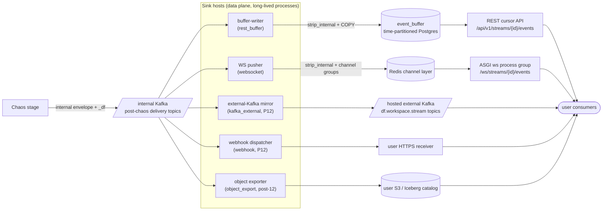
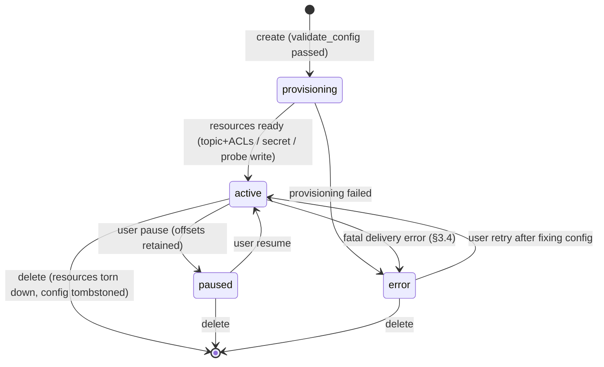
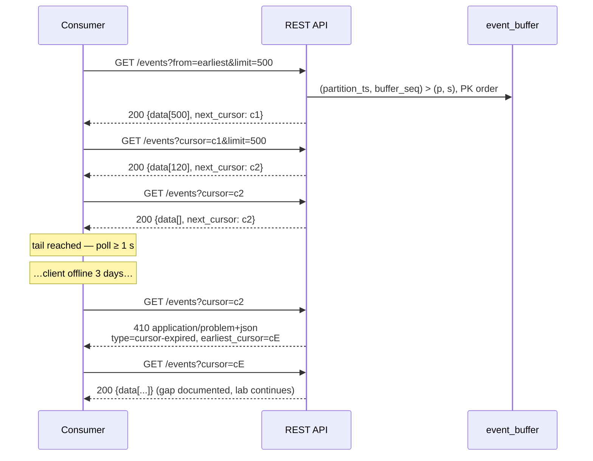
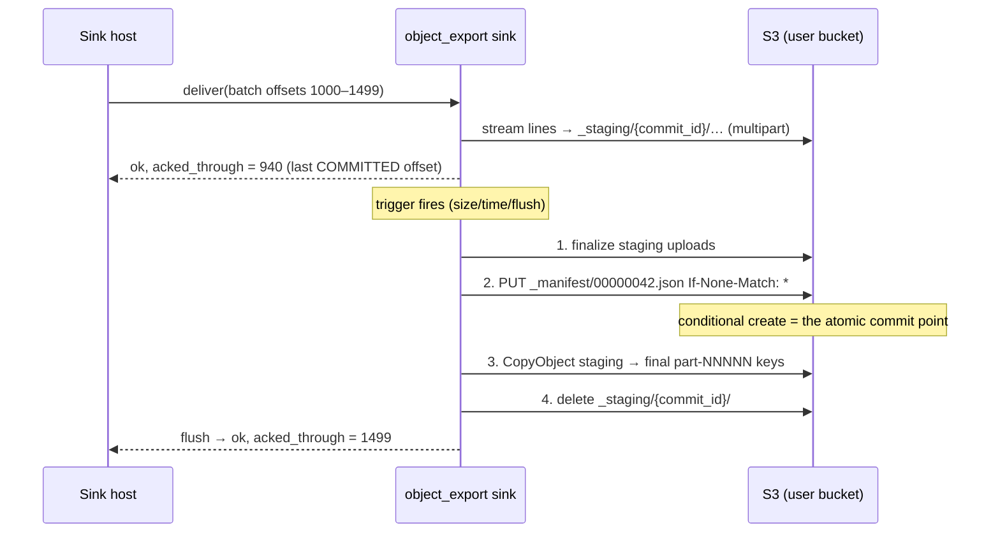

# DataForge — Delivery Channels

**Deliverable:** supports D2 (System Architecture), D5 (Event Model), D15 (Scaling Strategy)

This document is the design authority for DataForge's delivery plane: the `DeliveryChannel` sink contract every channel implements (ADR-0005), the two MVP channels (REST cursor pull over the time-partitioned event buffer, WebSocket live tail — ADR-0013), the Phase 12 channels at full contract level (hosted per-workspace Kafka topics, HMAC-signed webhooks), and the post-MVP object-export channels (S3, Iceberg, CDC export) whose file/commit semantics are frozen **now** so the sink interface is provably not REST/WS-shaped. The envelope every channel carries and the per-channel guarantee table users see are owned by [../03-domain/event-model.md](../03-domain/event-model.md); domain terms and invariants (`INV-DEL-*`, SinkBinding, EventBuffer, Cursor) by [../03-domain/domain-model.md](../03-domain/domain-model.md); endpoint shapes and the problem-details catalog by [../05-interfaces/api-specification.md](../05-interfaces/api-specification.md).

---

## 1. The consumption boundary (binding)

### 1.1 Statement

The user-confirmed consumption model, verbatim:

> Users never touch DataForge's internal Kafka — it is server-side infrastructure (compose service in dev; internal-only single-broker KRaft on Fly.io in prod). MVP consumption: users pull from hosted DataForge over the internet via cursor-based REST and WebSocket using an API key; bridging events into their own local Kafka is their exercise (connection guides provided). Post-MVP (Phase 12): users consume directly from DataForge-hosted per-workspace Kafka topics with SASL/ACL credentials, plus HMAC-signed webhooks. Future: S3/Iceberg/CDC export to user-provided storage.

Consequences, restated as enforceable rules:

| # | Rule |
|---|---|
| CB-1 | Internal Kafka topics, brokers, and consumer groups are never reachable from outside the platform network. No user-facing surface (API, console, docs, error message) exposes internal topic names, offsets, or broker addresses (INV-STR-4). |
| CB-2 | Every external delivery path is a consumer adapter behind the `DeliveryChannel` interface (§3), consuming the post-chaos internal topics (INV-DEL-1) and stripping `_df` at ingest (INV-DEL-2, event-model §5.2). |
| CB-3 | The Phase 12 hosted Kafka channel is a **separate, external-facing cluster surface** (§7) fed by a sink — it is never a hole punched into the internal backbone, even after the managed-Kafka migration (ADR-0015). |
| CB-4 | The MVP teaches the bridge: getting events from the REST cursor API into the user's own Kafka is exercise E8 (PRD §5), supported by the connection guides in §1.3 — it is deliberately not a platform feature before Phase 12. |

### 1.2 Channel availability by phase

| Channel | Sink type ([../03-domain/domain-model.md](../03-domain/domain-model.md) §2.8) | Phase | Status of this spec |
|---|---|---|---|
| REST cursor pull | `rest_buffer` | 5 | Full design (§4, §5) |
| WebSocket live tail | `websocket` | 6 | Full design (§6) |
| Hosted per-workspace Kafka | `kafka_external` | 12 | Contract-level (§7); implementation refined in Phase 12 |
| HMAC-signed webhooks | `webhook` | 12 | Contract-level (§8); implementation refined in Phase 12 |
| S3 / Iceberg / CDC export | `object_export` | post-12 | Contract frozen now (§9); implementation post-MVP |

### 1.3 Connection guides (outline)

Guides are published docs, versioned with the API. G1 ships with Phase 5 documentation; G2–G4 ship in Phase 12 (phase plan, [../07-plan/phases/README.md](../07-plan/phases/README.md)).

| Guide | Ships | Outline |
|---|---|---|
| **G1 — REST → local Kafka bridge** (the E8 MVP lab) | Phase 5 | 1. Prereqs: Docker single-node Kafka, API key with `events:read`. 2. The poll loop: `GET /events` with `cursor`, persist `next_cursor` to a checkpoint file **after** producing the batch (at-least-once end to end). 3. Produce keyed by `partition_key` with an idempotent producer (`enable.idempotence=true`, `acks=all`) — preserves per-key order. 4. Handling `410 cursor-expired`: reset to `earliest_cursor` from the problem body and document the gap. 5. Verify: bridged topic count vs `GET /streams/{id}/stats`. |
| **G2 — Spark Structured Streaming** | 12 | Read hosted topic with SASL/SCRAM config; JSON envelope schema (from registry); watermarking on `occurred_at` (exercise E2); checkpoint location discipline. |
| **G3 — Flink** | 12 | KafkaSource with SCRAM; event-time = `occurred_at`, watermark strategy; keyBy `partition_key`; exactly-once sink patterns. |
| **G4 — Kafka Connect** | 12 | Source = hosted topic; SMT examples (extract `payload`, route `cdc.*` by `event_type`); JDBC/S3 sink configs; converter settings for the JSON envelope. |

---

## 2. Delivery-plane architecture

### 2.1 Position in the pipeline

Delivery is the last stage of the strict pipeline Behavior → ledger → Chaos → Delivery (ADR-0009). Sinks consume only the post-chaos internal topics; nothing downstream of a sink contains `_df` (event-model §5.2).



Internal topic naming, partition counts, and broker placement are owned by [../02-architecture/backend-architecture.md](../02-architecture/backend-architecture.md); the capacity arithmetic for buffer ingest and sink fan-out by [../02-architecture/scaling-strategy.md](../02-architecture/scaling-strategy.md).

### 2.2 SinkBinding lifecycle

`rest_buffer` and `websocket` bindings are implicit — provisioned automatically with every stream, never user-configured, always `active`. Phase 12+ bindings are explicit resources (`POST /api/v1/streams/{id}/sinks`, shapes owned by the API spec).



| Rule | Statement |
|---|---|
| SB-L1 | A paused sink retains its consumer-group offsets; resuming continues from them, subject to internal topic retention. A sink paused longer than internal retention restarts from the earliest retained offset and the gap is surfaced in the sink's status detail. |
| SB-L2 | `error` is entered only on **fatal** classification (§3.4); retryable failures never change binding state, they back off (§3.3 SINK-9). Entering `error` writes an audit entry (`delivery.sink.errored`) and a console notification. |
| SB-L3 | All binding mutations are audit-logged; sink resources (topics, ACLs, SCRAM users, secrets) are torn down on delete within 60 s (INV-TEN-6 analogue). |

### 2.3 Consumption signals (idle auto-pause inputs)

Idle auto-pause (PRD §7) needs a per-channel definition of "consumption". Delivery emits these signals to Observation; Stream Control owns the resulting pause command (INV-OBS-1).

| Channel | Consumption signal | Recorded as |
|---|---|---|
| REST | Any authenticated `GET /events` call (even an empty page) | `last_consumed_at` (Redis, per stream) |
| WebSocket | An open, authenticated connection (heartbeat-alive) | connection registry, per stream |
| External Kafka (P12) | Committed consumer-group offset advanced within the window | broker group-offset poll, 60 s cadence |
| Webhook (P12) | Any 2xx delivery | delivery log |
| Object export (post-12) | Sink binding `active` counts as consumption (exports are unattended by design) | binding state |

---

## 3. The `DeliveryChannel` sink contract

Every channel — MVP and future — is an implementation of this interface, hosted by the generic sink host (§3.5). The interface is deliberately shaped by its most demanding implementor (file-committing object exports), not by REST/WS: that is what keeps the seam honest (§10).

### 3.1 Interface definition

```python
class DeliveryChannel(Protocol):
    channel_type: ClassVar[str]  # "rest_buffer" | "websocket" | "kafka_external"
                                 # | "webhook" | "object_export"

    @classmethod
    def validate_config(cls, config: Mapping[str, Any]) -> list[ConfigProblem]:
        """Static validation at SinkBinding create/update (control plane).
        Includes live probes where the config names external resources
        (S3 probe write, Iceberg catalog ping, webhook URL policy check).
        Empty list = valid."""

    def configure(self, binding: SinkBinding, secrets: SecretBundle) -> None:
        """Instantiate at sink-host start / partition assignment.
        Must be side-effect-free beyond connection setup; provisioning
        (topic creation, ACLs) happens in the control plane, not here."""

    def deliver(self, batch: DeliveryBatch) -> DeliveryResult:
        """Deliver one ordered batch from one internal topic-partition.
        Must call strip_internal() on every envelope before any external
        persistence or serialization (event-model SB-2)."""

    def flush(self, reason: FlushReason) -> DeliveryResult:
        """Force sink-internal staging to durability (file commit, outbox
        fsync). Called on shutdown, partition revocation, and the host's
        flush interval. reason ∈ {"interval", "rebalance", "shutdown"}."""

    def healthcheck(self) -> SinkHealth:
        """Cheap liveness signal for /readyz and sink status (≤ 100 ms)."""

    def close(self) -> None:
        """Release connections. Host guarantees flush() completed first."""
```

### 3.2 Batch and result types

```python
@dataclass(frozen=True)
class DeliveryBatch:
    workspace_id: UUID            # tenant attribution (INV-TEN-1)
    stream_id: UUID
    topic: str                    # internal topic
    partition: int                # internal topic-partition
    first_offset: int             # inclusive
    last_offset: int              # inclusive
    events: Sequence[InternalEnvelope]   # offset order; _df still present

@dataclass(frozen=True)
class DeliveryResult:
    status: Literal["ok", "backpressure", "fatal"]
    acked_through: int | None     # highest internal-Kafka offset (inclusive)
                                  # that is DURABLY delivered; None = no progress
    retry_after_ms: int | None    # backpressure only; host pauses the partition
    error: SinkError | None      # fatal only; classification per §3.4
```

### 3.3 Contract rules

| # | Rule |
|---|---|
| SINK-1 | **Input scope.** A sink consumes only post-chaos internal delivery topics (INV-DEL-1). Batches arrive per internal topic-partition in offset order, ≤ 500 events and ≤ 8 MiB serialized per batch, exactly one `deliver()` in flight per (sink instance, topic-partition). |
| SINK-2 | **Strip duty.** The sink calls the single shared `strip_internal(envelope)` exactly once per event at ingest (event-model SB-2). The permanent CI scan (SB-3) covers every channel's external output. |
| SINK-3 | **Deferred acknowledgement.** `acked_through` is the durability cursor, decoupled from batch boundaries. A sink MAY return `acked_through < batch.last_offset` (it staged events without committing them — file sinks) or `None` (no new durability). The host commits internal consumer-group offsets only up to `acked_through`; everything above it is redelivered after a crash. |
| SINK-4 | **Idempotent redelivery.** Because of SINK-3, a sink MUST tolerate redelivery of any offset range above its last ack with at-least-once or exactly-once semantics per its channel row in §3.6 — never with data loss, never with corruption. Chaos duplicates are distinct internal offsets and MUST be preserved; only transport redelivery (same offsets) may be deduplicated. |
| SINK-5 | **Ordering.** A sink MUST NOT reorder events within a batch or across batches of the same topic-partition, except where its channel contract defines a different externally visible order (S3 files sort by `(shard_id, sequence_no)` within a file, §9.1). |
| SINK-6 | **Flush obligation.** After `flush(reason)` returns `ok`, everything previously accepted by `deliver()` is durable and reflected in `acked_through`. The host calls `flush` before partition revocation and shutdown; a sink that cannot flush returns `backpressure` and the host retries before releasing the partition. |
| SINK-7 | **Tenancy.** Every external resource a sink touches is workspace-scoped — buffer rows, channel groups, external topics, SCRAM users, webhook secrets, object prefixes (INV-DEL-6). A batch's `workspace_id` is authoritative; a sink MUST refuse (fatal) a batch whose envelopes disagree with it. |
| SINK-8 | **Backpressure signal.** `status: backpressure` pauses the internal topic-partition (Kafka `pause()`) for `retry_after_ms` (host clamps to [100 ms, 60 s], exponential growth ×2 from the sink's hint, ±20 % jitter, reset on first `ok`). Internal Kafka retention (≥ 24 h) is the loss-protection budget; consumer lag is the upstream-visible signal (metrics catalog in [../02-architecture/observability.md](../02-architecture/observability.md)). |
| SINK-9 | **Retryable ≠ fatal.** A retryable failure (§3.4) is expressed as `backpressure` — the host never counts retries toward binding state. `fatal` transitions the SinkBinding to `error` (SB-L2) and stops consumption for that binding; other bindings and the generation side are unaffected. |
| SINK-10 | **No upstream coupling.** Sinks never read the ledger, entity pools, control-plane tables, or chaos internals; the batch is their entire input. This is what makes Phase 12's "diff confined to delivery adapters" exit criterion checkable. |
| SINK-11 | **Determinism boundary.** Sinks add no randomness to delivered content. Anything a sink must invent (file part numbers, delivery ids) is either deterministic from the offset range (§9.1) or operational metadata outside the envelope. |
| SINK-12 | **Filter semantics.** Where a channel exposes event filters — REST `types` / `entity_type`+`entity_key` (API-spec §4.9.1), WS `types` (§6.2), Phase 12+ binding fields `event_types`/`cdc_entities`/`cdc_only` (§8.1, §9.3) — matching uses `event_type` and `entity_refs` exactly as defined in event-model R-CDC-7, identical on every channel. Filters narrow delivery; they never renumber positions (RC-4). |

### 3.4 Error classification

| Class | Examples | Sink response | Host/binding effect |
|---|---|---|---|
| **Retryable** | Network timeout; Postgres unavailable; S3 5xx/throttle; broker `NOT_ENOUGH_REPLICAS`; webhook receiver 5xx/timeout/429; Iceberg commit conflict | `status: backpressure` with hint | Partition paused + backoff (SINK-8); lag alert at 5 min sustained |
| **Fatal — config** | Bucket/role access revoked; webhook URL DNS-invalid or returns 410; external topic deleted out of band; catalog credential rejected | `status: fatal` | Binding → `error` (SB-L2); user action required |
| **Fatal — contract** | Envelope fails `strip_internal` invariants; `workspace_id` mismatch (SINK-7); oversized event (> 96 KiB — impossible per event-model §2.1, hence a bug) | `status: fatal` | Binding → `error`; release-blocking defect — paging alert, since upstream validation should make this unreachable |
| **Poison event** (channels with a DLQ only) | Webhook batch permanently rejected (receiver 4xx ≠ 408/429) | Sink moves the batch to its DLQ (§8.3), then `ok` | Delivery log + DLQ row; consumption continues |

### 3.5 Sink host runtime

The sink host is a generic, channel-agnostic Kafka consumer harness; channels plug into it.

| Aspect | Contract |
|---|---|
| Process model | Long-lived supervised data-plane processes (never Celery tasks, ADR-0006). MVP: buffer-writer and WS pusher run as dedicated entrypoints inside the `runner` process group (one Fly app, ADR-0015); a dedicated `sink` process group splits out at Phase 11 per [../02-architecture/scaling-strategy.md](../02-architecture/scaling-strategy.md). Placement detail owned by [../02-architecture/deployment-architecture.md](../02-architecture/deployment-architecture.md). |
| Consumer groups | Platform-shared channels: one group per channel — `df.sink.rest-buffer.v1`, `df.sink.websocket.v1` (naming owned by [../02-architecture/backend-architecture.md](../02-architecture/backend-architecture.md)) — subscribed to all delivery topics. Per-binding channels (P12+): one group per binding — `df.sink.{sink_type}.{sink_id}.v1` — subscribed to the bound stream's topics. |
| Offset policy | Commit only `acked_through` (SINK-3); `enable.auto.commit=false`; commit cadence 1 s or 1,000 events, whichever first. |
| Rebalance | Cooperative-sticky assignment; on revocation the host calls `flush("rebalance")` then commits before releasing (SINK-6). |
| Flush interval | Host calls `flush("interval")` every 5 s on sinks reporting staged-but-unacked data; file sinks additionally self-trigger on their commit rules (§9). |
| Isolation | One binding's `backpressure`/`error` never stalls another binding's partitions; per-binding consumption is independent by group separation. |

### 3.6 Per-channel guarantees

The user-facing authority is event-model §6 (published verbatim in API docs); this table restates it with the **implementing mechanism** and must never disagree with it. Cross-channel invariant: the delivered envelope is identical — same 20 fields, same values for the same delivered instance.

| Channel | Delivery semantics | Ordering (mechanism) | Duplicate sources | Backpressure behavior | Replay |
|---|---|---|---|---|---|
| REST cursor (`rest_buffer`) | At-least-once, client-paced | Total order per stream = buffer append order (`buffer_seq`, §4.2), replay-stable | Chaos + client cursor re-reads (+ rare writer crash-window redelivery within the at-least-once allowance, BW-3) | None needed — clients pace themselves; writer backpressure is invisible latency | Any cursor within retention; beyond → `410 cursor-expired` (§5.4) |
| WebSocket (`websocket`) | At-most-once per connection | Buffer append order minus dropped frames; drops signaled (`drop_notice`) | Chaos only | Drop-oldest per connection queue (§6.5); never pauses Kafka | None on the socket; resume-from-cursor (§6.4) |
| External Kafka (`kafka_external`) | At-least-once | Per-partition FIFO keyed by `partition_key` (idempotent mirror producer) | Chaos + producer-retry | Producer buffer full → `backpressure` | Consumer-group offsets within 7 d topic retention |
| Webhook (`webhook`) | At-least-once, retries + DLQ | In-order within a batch; no cross-batch order under retry (durable outbox, §8.5) | Chaos + retry redelivery (idempotency key `event_id`) | Outbox depth cap → `backpressure` | DLQ redelivery on request only |
| S3/Iceberg (`object_export`) | Exactly-once per committed file/snapshot | Within a file: `(shard_id, sequence_no)`; layout by `occurred_at` window | None beyond chaos (commit protocol deduplicates transport redelivery) | S3/catalog throttle → `backpressure` | Files/snapshots immutable; re-export = new dataset |

### 3.7 Conformance suite

Every channel ships with the cross-channel contract tests ([../06-quality/testing-strategy.md](../06-quality/testing-strategy.md)); passing them is a phase exit criterion for each channel's phase:

| Test | Asserts |
|---|---|
| Envelope identity | Same input partition slice → byte-equal delivered envelopes (content-wise per event-model S-3) on every active channel |
| Strip scan | No `_df`-prefixed key anywhere in any channel's external output (SB-3) |
| Kill/replay | `SIGKILL` the sink host mid-batch → after restart, no event lost; duplicates only as the channel's §3.6 row permits |
| Chaos-duplicate preservation | Injected duplicates (distinct offsets) survive every channel, including exactly-once file sinks (SINK-4) |
| Ordering | Per-channel ordering column of §3.6 holds over a 100k-event soak |
| Tenancy | A binding never emits another workspace's events; foreign-credential negative probes fail (Phase 12 exit criterion) |
| Backpressure | Forced sink stall pauses only the affected binding's partitions; lag recovers after release with zero loss |

---

## 4. Buffer-writer: the `rest_buffer` sink

The buffer-writer turns the internal Kafka stream into the replayable Postgres buffer the REST channel reads (ADR-0013). Ships in Phase 5.

### 4.1 Topology and batching

| # | Rule |
|---|---|
| BW-1 | One platform-wide consumer group `df.sink.rest-buffer.v1` over the post-chaos delivery topic (`df.delivery.events.v1`; naming owned by [../02-architecture/backend-architecture.md](../02-architecture/backend-architecture.md)). MVP: 1 instance; Phase 11: N instances scale by internal partition assignment, with **all of one stream's partitions on one member** via the custom partition assignor (BW-7). |
| BW-2 | Poll batches of ≤ 500 events with 250 ms linger (SINK-1). Each batch: `strip_internal` every envelope (SINK-2), then write to `event_buffer` via `COPY` (preferred) or multi-row `INSERT` inside one transaction, in batch order. Per-process throughput targets and batch-cost arithmetic are owned by [../02-architecture/scaling-strategy.md](../02-architecture/scaling-strategy.md). |
| BW-3 | Internal offsets are committed only after the database transaction commits (`acked_through = last_offset`). A crash between DB commit and offset commit redelivers the tail batch, producing duplicate buffer rows under fresh `buffer_seq` values — the rare server-side duplicate the channel's at-least-once contract already licenses (§3.6). Replay stability (INV-DEL-3) is unaffected: once written, rows are immutable and their order never changes. |
| BW-4 | **The writer never deduplicates on `event_id`.** Chaos duplicates are distinct delivered instances and MUST all be stored (SINK-4); deduplicating on `event_id` would erase the E1 exercise and is forbidden. Consumers deduplicate on `event_id` — deliberately, since that is the skill being taught. |
| BW-5 | Buffer rows store the **delivered shape exactly** (post-strip canonical JSON in `envelope`) plus the indexed columns `workspace_id`, `stream_id`, `partition_ts`, `buffer_seq`, `event_id`, `event_type`, `occurred_at`, `emitted_at`. DDL, indexes, and RLS are owned by [../03-domain/database-schema.md](../03-domain/database-schema.md) §6.1. |

### 4.2 `buffer_seq` and replay stability

INV-DEL-3 (re-reading a cursor returns identical events in identical order) requires that a row, once visible to any reader, is never preceded by a later-appearing row. The design ([../03-domain/database-schema.md](../03-domain/database-schema.md) §6.1 owns the DDL) achieves this with a single writer per stream, not with a coordination layer:

| # | Rule |
|---|---|
| BW-6 | `buffer_seq` is a **per-stream monotonic append counter assigned by the writer** at insert time; primary key `(stream_id, partition_ts, buffer_seq)`. `partition_ts = now()` is clamped non-decreasing per stream, so `(partition_ts, buffer_seq)` order is identical to `buffer_seq` order and every page read prunes partitions. Rows are immutable (no UPDATE surface exists). |
| BW-7 | **Single writer per stream.** MVP: structural — one shard → one internal topic partition → one consumer. Phase 11: preserved by a custom partition assignor that keeps all of a stream's internal-topic partitions on one buffer-writer member (contract fixed in [../03-domain/database-schema.md](../03-domain/database-schema.md) §6.1; mechanics in [../02-architecture/scaling-strategy.md](../02-architecture/scaling-strategy.md)). Because the only writer for a stream commits transactions in append order, a reader can never observe row N+1 before row N — replay stability without a frontier watermark. |
| BW-8 | **Counter recovery.** On start/reassignment the writer recovers each stream's counter with `SELECT max(buffer_seq) FROM event_buffer WHERE stream_id = $1` (always within the 48 h retention window) and continues from it. Recovery after redelivery (BW-3) therefore appends duplicates, never collides. |

### 4.3 Partitioning and retention

| Aspect | Contract |
|---|---|
| Partition scheme | `event_buffer` is range-partitioned by `partition_ts` (wall clock, write-assigned per BW-6) on UTC-hour boundaries. |
| Physical retention | A Celery beat job drops whole partitions older than **48 h** (the maximum plan retention), hourly — one physical policy for all plans. Partition drop is the only deletion mechanism (ADR-0013). |
| Logical retention | Plan windows (Free 24 h, Classroom/Pro 48 h — PRD §7) are enforced at read time against `workspace_quotas.buffer_retention_hours`: a cursor or row older than the workspace's window is expired (§5.4) even if the partition still physically exists. |
| Earliest cursor | `earliest_cursor(stream)` = position of the oldest retained row within the plan window — computable from the partition floor + plan window without scanning; returned in every `410` body (§5.4). |

### 4.4 Throughput and latency targets

| Metric | Target | Verified |
|---|---|---|
| Ingest lag (`emitted_at` → row readable) | p95 ≤ 2 s, p99 ≤ 5 s (consistent with INV-OBS-2's 5 s staleness bound) | Phase 6 soak; Phase 11 load test |
| Per-instance write throughput | 15,000 rows/s planning number, ≥ 25,000 measured target (the 5k-TPS GA floor needs one instance with ≥ 2× headroom; staircase arithmetic owned by [../02-architecture/scaling-strategy.md](../02-architecture/scaling-strategy.md)) | Phase 11 load test |
| Consumer lag alert | Sustained lag > 60 s → page (runbook in [../02-architecture/observability.md](../02-architecture/observability.md)) | — |

---

## 5. REST cursor pull channel

The bulk consumption path of the MVP: at-least-once, replayable, client-paced reads over the event buffer. Ships in Phase 5. Endpoint shapes, auth wiring, and rate limits are owned by [../05-interfaces/api-specification.md](../05-interfaces/api-specification.md); the semantics below are this document's contract on them.

### 5.1 Endpoint semantics

`GET /api/v1/streams/{stream_id}/events` — authenticated by an API key with `events:read` via `X-API-Key`, or a console JWT for workspace members (auth matrix A-5 in [../05-interfaces/api-specification.md](../05-interfaces/api-specification.md) §2.2). Parameter shapes are owned by the API spec §4.9.1 and restated here because the channel semantics hang off them:

| Parameter | Type / default | Semantics |
|---|---|---|
| `cursor` | opaque string, optional | Resume position. Mutually exclusive with `from`. |
| `from` | `earliest` \| `latest` \| RFC 3339, default `earliest` | First-call start position: oldest retained row, current tail, or the first buffer position with `emitted_at` ≥ the given wall time. |
| `limit` | int 1–1,000, default 100 | Max events returned. The server may return fewer than `limit` (page assembly caps a response at 8 MiB serialized); this is normal, not an error. |
| `types` | comma list, ≤ 20 entries | Exact-match filter on envelope `event_type` (business names and `cdc.{entity}`). Unknown types match nothing. |
| `entity_type`, `entity_key` | both or neither | Per-entity filter matching `entity_refs` (R-CDC-7 semantics, SINK-12). Ships Phase 8. |

Response `200` (the pagination envelope of API-spec §2.6):

```json
{
  "data": [ { "...": "delivered 20-field envelopes, buffer order" } ],
  "next_cursor": "c1.eyJmIjoiMzc1ZTNjMTkiLCJwIjoxNzgxMTkzNzg1Mjg3LCJzIjo0ODIxNH0"
}
```

| # | Rule |
|---|---|
| RC-1 | At-least-once: the same cursor re-read returns identical events in identical order (INV-DEL-3, backed by BW-6/7). Clients deduplicate on `event_id` — deliberately, since that is exercise E1's skill. |
| RC-2 | `next_cursor` is **never `null`** on this endpoint (API-spec P-2/E-1), including on empty pages; it always points after the last returned (or filtered-skipped, RC-4) position. A full page means more may be available — poll again immediately; an empty page means the tail was reached — poll again after ≥ 1 s (guidance; per-key rate limits are the hard bound). |
| RC-3 | The steady-state tail response is `200` with `{"data": [], "next_cursor": "<same position>"}` — never `204`/`404`. Reading from a `paused`/`stopped` stream is valid within retention (API-spec E-6). |
| RC-4 | Filters narrow delivery, never renumber it: the cursor advances over the **unfiltered** stream and filtered-out events are skipped server-side, so a filtered consumer's cursor is gap-free over its filter set. A cursor is **bound to the filter set it was created under** (API-spec P-3/E-3): presenting it with a different filter set fails `400` `cursor-invalid` — start a fresh pagination (`from`) to change filters. |
| RC-5 | Cross-workspace access (foreign key/JWT) is `404` per the anti-enumeration policy in [../06-quality/security-architecture.md](../06-quality/security-architecture.md); insufficient scope is `403`. |
| RC-6 | **Refined in Phase 11 (contract decided now):** `GET …/events/batch` (API-spec §4.9.2) is the NDJSON bulk variant — same position space, interchangeable cursors, identical replay/expiry semantics; only the page envelope differs (headers instead of JSON wrapper). |

### 5.2 Cursor format

A cursor encodes the composite position `(partition_ts, buffer_seq)` of the last delivered row (exclusive on read — the position points *before* the next row strictly greater than it), exactly the position contract of [../03-domain/database-schema.md](../03-domain/database-schema.md) §6.1, plus the filter fingerprint that implements API-spec P-3:

```
plain  = canonical JSON, sorted keys, no whitespace:
         {"f":"<fingerprint>","p":<partition_ts_epoch_ms>,"s":<buffer_seq>}
cursor = "c1." + base64url_without_padding(utf8(plain))

p           = the row's partition_ts as epoch milliseconds (BW-6)
s           = the row's per-stream buffer_seq (BW-6)
f           = first 8 lowercase hex chars of SHA-256(stream_id || "|" ||
              canonical_filter_set) — binds the cursor to its stream AND
              the filter set it was created under (RC-7)
```

| # | Rule |
|---|---|
| RC-7 | **Opacity is contractual.** Clients MUST treat cursors as opaque, URL-safe tokens ≤ 128 chars (domain-model Cursor VO; API-spec P-1: "position + filter hash, versioned"). The encoding above is normative for the server and may change only with a version-prefix bump (`c1.` → `c2.`); old prefixes remain decodable for ≥ 90 days after a change. |
| RC-8 | `f` rejects a cursor presented against a different `stream_id` or a different filter set, and any undecodable/unknown-prefix token, with `400`, problem type `cursor-invalid` (API-spec §2.7.1) — distinct from expiry. |
| RC-9 | `p` exists so expiry (§5.4) and partition pruning are O(1) — the server compares `p` against the retention floor and the oldest attached partition without scanning. The page query is the row-comparison `(partition_ts, buffer_seq) > ($p, $s)` over the PK index (database-schema §6.1). |

### 5.3 Pagination loop



### 5.4 The `cursor-expired` contract

This closes the panel gap "REST cursor vs retention edge case": expiry is an explicit, named, teachable failure — never a silent skip to the oldest retained event (INV-DEL-4).

| # | Rule |
|---|---|
| RC-10 | A cursor is **expired** iff `p < now() − plan_retention` (logical window, §4.3) **or** `p` precedes the lower bound of the oldest attached partition (physical drop). Both cases return the identical error, checked before any query (RC-9). |
| RC-11 | Status **`410 Gone`**, media type `application/problem+json` (RFC 9457), problem type `cursor-expired`. The body MUST name the earliest available cursor so recovery is one request away. The problem-type URI base, registry, and extension members (`earliest_cursor`, `retention_hours`) are owned by [../05-interfaces/api-specification.md](../05-interfaces/api-specification.md) §2.7. |
| RC-12 | The response is identical for REST pagination and WS resume (§6.4) — one contract, every surface. |

```json
{
  "type": "https://docs.dataforge.dev/problems/cursor-expired",
  "title": "Cursor expired",
  "status": 410,
  "detail": "This cursor points into a buffer partition dropped by the 24h retention policy. Resume from 'earliest_cursor', or restart from ?from=earliest. Events older than retention are not replayable on this channel.",
  "instance": "/api/v1/streams/7b1e9c3a-2f54-4d08-a6b9-1c2d3e4f5a6b/events",
  "request_id": "req_019ea1d5-3c2b-7a1f-8d9e-0f1a2b3c4d5e",
  "earliest_cursor": "c1.eyJmIjoiMzc1ZTNjMTkiLCJwIjoxNzgxMTA3MjAwMDAwLCJzIjo5MDEyfQ",
  "retention_hours": 24
}
```

User docs frame this as the lakehouse-retention teaching moment: production streams expire too; checkpoint your cursor like you would a Kafka offset.

---

## 6. WebSocket channel

Live tail for humans and light consumers. Ships in Phase 6. **Doctrine (binding, ADR-0013 / INV-DEL-5): WS is a best-effort tail and debugging surface — never the bulk-throughput path.** Anything that needs completeness uses REST (MVP) or hosted Kafka (Phase 12); the console's own tail applies client-side sampling above ~100 events/s (ADR-0016).

### 6.1 Topology

| Aspect | Contract |
|---|---|
| Server | Django Channels on a **dedicated ASGI process group** (`ws` in the Fly app, ADR-0015) — the REST tier stays stateless and the WS tier scales independently. |
| Fan-out | The WS pusher sink (consumer group `df.sink.websocket.v1`) consumes the post-chaos delivery topic, strips (SINK-2), stamps a per-stream monotonic `frame_seq`, and publishes frames to the Redis channel-layer group `stream_{stream_id}` (wiring owned by [../02-architecture/backend-architecture.md](../02-architecture/backend-architecture.md)). The per-connection ASGI consumer joins its authenticated stream's group and detects `frame_seq` gaps, so channel-layer capacity drops surface as an explicit `drop_notice` — never silently (INV-DEL-5). Tenant isolation comes from the auth gate on joining (WS-3) plus globally unique `stream_id`s (INV-DEL-6). |
| Ack model | The pusher acks Kafka immediately after `group_send` (`acked_through = batch.last_offset`): at-most-once per connection is the contract, so durability ends at the channel layer. |
| Endpoint | `wss://api.dataforge.dev/ws/streams/{stream_id}/events` |

### 6.2 Subprotocol and authentication

The user-facing protocol (handshake, frames, close codes, auth matrix) is owned by [../05-interfaces/api-specification.md](../05-interfaces/api-specification.md) §5; the rules below restate it as channel obligations and must never disagree with it.

| # | Rule |
|---|---|
| WS-1 | Versioned subprotocol: the client MUST offer `dataforge.events.v1` in `Sec-WebSocket-Protocol`; the server selects and echoes it. A handshake offering no supported subprotocol is rejected at HTTP level with `400`. Protocol evolution = new token (`dataforge.events.v2`) offered side by side, server selects the highest mutually supported; `v1` frames never change incompatibly. |
| WS-2 | **First-message auth** (browsers cannot set WS headers): the client MUST send an `auth` frame within **10 s** of connect or the server closes `4408`. Credentials: `api_key` with `events:read` (canonical machine path) or `access_token` console JWT of a workspace member (the monitoring-page path). Credentials never appear in URLs — query-string tokens leak into logs and are not accepted. |
| WS-3 | Failure: invalid/revoked credentials `4401`; insufficient scope `4403`; unknown or foreign-workspace stream `4404` (anti-enumeration, mirrors RC-5). Revoked keys terminate live connections within 1 s via the Redis revocation cache (ADR-0011). |
| WS-4 | Connection quotas: 5 concurrent connections per API key, 250 per workspace; exceeded → handshake then close `4429`. Connect attempts are rate-limited by the `ws-connect` bucket (API-spec §2.8). |
| WS-5 | Filters are set in the `auth` frame — `types` (array, ≤ 20, SINK-12 semantics; CDC filtering is `types:["cdc.users"]`) and `sample_rate` ∈ (0,1], default 1.0. `sample_rate < 1` applies server-side uniform random per-event sampling before queueing: a debug-tail affordance, deliberately unseeded and non-deterministic (the gradable surfaces are REST and the answer key). Changing filters = reconnect; `resume` only re-positions (§6.4). |

### 6.3 Frame catalog (JSON text frames; client frames ≤ 16 KiB; binary frame → close `4400`)

| Direction | Frame | Shape / semantics |
|---|---|---|
| C→S | `auth` | `{"type":"auth","api_key":"df_…"}` *or* `{"type":"auth","access_token":"…"}`; optional `cursor`, `types`, `sample_rate` (WS-2/WS-5) |
| C→S | `resume` | `{"type":"resume","cursor":"…"}` — mid-connection re-position request; replies `resume_ack` (§6.4) |
| S→C | `ready` | `{"type":"ready","protocol":"dataforge.events.v1","stream_id":"…","position":{"cursor":"…"},"filters":{"types":[…],"sample_rate":1.0}}` — auth accepted; tailing begins |
| S→C | `resume_ack` | `{"type":"resume_ack","position":{"cursor":"…"},"behind":{"events":2864,"from_cursor":"…"}\|null}` — response to a `cursor` in `auth`/`resume` (§6.4) |
| S→C | `event` | `{"type":"event","cursor":"…","event":{…20-field envelope…}}` — `cursor` is the REST-compatible position *after* this event: the client's resume bookmark and REST handoff point |
| S→C | `heartbeat` | `{"type":"heartbeat","server_time":"…","last_cursor":"…","delivered":312,"dropped":0}` — every 15 s; per-connection counters |
| S→C | `drop_notice` | `{"type":"drop_notice","dropped":250,"resume_cursor":"…"}` — frames discarded under backpressure; `resume_cursor` is the position before the gap, for REST gap-fill (INV-DEL-5: drops are always signaled, with count) |
| S→C | `error` | `{"type":"error","problem":{…RFC 9457 object, same catalog as REST…}}` — sent once before an error close, or standalone for non-fatal errors (WS-8) |

One stream per connection (the URL names it). Frame JSON Schemas ship as the CI artifact `backend/schema/ws-protocol-v1.schema.json` (API-spec §5.5, §6).

### 6.4 Resume-from-cursor

| # | Rule |
|---|---|
| WS-6 | **The socket never replays** (event-model §6: replay on this channel is "none on the socket"). A `cursor` in `auth`/`resume` does not rewind the tail. The server replies `resume_ack`: `behind` reports the approximate gap (`events`, `from_cursor`) between the cursor and the live position, or `null` when the cursor is at/ahead of it. |
| WS-7 | The client backfills the gap over REST — `GET /events?cursor=<from_cursor>` (at-least-once, §5) — while the socket tails live: this is precisely "resume-from-cursor hands off to REST semantics" (ADR-0013). Every `event` frame's `cursor` is REST-interchangeable (same position space, §5.2), so the handoff needs no translation. Keeping bulk catch-up off the socket is what keeps WS off the bulk path (INV-DEL-5). |
| WS-8 | An expired cursor in `auth`/`resume` does not close the socket: the server sends `error` with the §5.4 `cursor-expired` problem (including `earliest_cursor`, RC-12) and continues tailing live. |
| WS-9 | There is no server-side per-connection offset memory: the client's last seen `event.cursor` (or `drop_notice.resume_cursor`) is the only resume state, held by the client. |

### 6.5 Backpressure, liveness, and close codes

| # | Rule |
|---|---|
| WS-10 | Per-connection send queue cap: **1,000 frames**. On overflow the server drops **oldest** frames and emits a `drop_notice` with the count and `resume_cursor`. Dropping never blocks the channel layer or Kafka consumption — slow sockets hurt only themselves; the tail stays live and completeness is REST's job. |
| WS-11 | Channel-layer capacity drops (upstream of any connection queue) are detected via `frame_seq` gaps at the per-connection consumer (§6.1) and reported through the same `drop_notice` frame — both drop paths are client-visible. |
| WS-12 | Liveness: `heartbeat` every 15 s plus protocol-level ping/pong; a client silent at the socket level for 90 s is closed `1001`. Under platform overload the server may close `1013`; clients reconnect with exponential backoff + jitter (the console WS hook layer implements this per ADR-0016; script consumers are advised to in the public docs). |

| Close code | Meaning |
|---|---|
| 1000 | Normal close (either side) |
| 1001 | Going away (deploy/restart, or client silent 90 s) — reconnect |
| 1011 | Internal server error |
| 1013 | Overload — reconnect with backoff |
| 4400 | Protocol violation: malformed frame, binary frame, unknown `type`, frame before `auth` |
| 4401 | Authentication failed (invalid/revoked key, bad/expired JWT) |
| 4403 | Authenticated but forbidden (missing `events:read` scope) |
| 4404 | Stream not found — including cross-tenant masking |
| 4408 | Auth deadline (10 s) expired |
| 4429 | Connection quota exceeded (WS-4) |

---

## 7. Phase 12 — hosted per-workspace Kafka topics (contract)

**Refined in Phase 12.** Everything in this section is the decided contract the Phase 12 implementation must meet; nothing here exists at MVP GA except the seam it plugs into (§3) and the quota rows reserved for it (PRD §7: Free — no; Classroom — add-on; Pro — yes). Shipping this channel is itself a managed-Kafka migration trigger (ADR-0015); the external cluster is the managed one, never the internal MVP broker (CB-3).

### 7.1 Topic naming and the partition budget (panel gap, closed)

| # | Rule |
|---|---|
| XK-1 | One external topic per sink binding, i.e. per (workspace, stream): `df.{workspace_id}.{stream_id}`. The workspace-first hierarchy makes every ACL a single prefix rule (§7.3) and tenant attribution broker-inspectable. |
| XK-2 | Per-topic partitions = `max(3, stream shard count)` at binding creation, capped at 8. The floor of 3 makes the consumer-group lab (E8) meaningful on day one; partition count is fixed for the binding's life (repartitioning = delete + recreate binding). |
| XK-3 | **Partition budget per workspace** (enforced at binding creation; exceeding it returns `422`, problem type `partition-budget-exceeded`): Classroom add-on **16**, Pro **32** external partitions total across all bindings. Combined with the concurrent-stream quotas (PRD §7) this bounds broker metadata at ≤ ~32k external partitions per 1,000 hosted-Kafka workspaces — inside the managed-cluster envelope priced in [../02-architecture/scaling-strategy.md](../02-architecture/scaling-strategy.md). |
| XK-4 | Records: key = `partition_key` UTF-8 bytes (identical to internal keying, event-model S-5 — per-key FIFO is the channel's headline guarantee); value = delivered envelope JSON; record headers `df-event-id`, `df-schema-subject`, `df-schema-version` for header-routing tooling. Partitioner: default murmur2 over the key. |
| XK-5 | Topic config: `retention.ms` = 7 days, `cleanup.policy=delete`, `max.message.bytes` = 1 MiB (envelope hard cap is 96 KiB — 10× headroom). Topics are deleted when the binding is deleted (SB-L3). |

### 7.2 Credential provisioning (SASL/SCRAM)

| Aspect | Contract |
|---|---|
| Mechanism | `SASL_SSL` with `SCRAM-SHA-256` on a TLS 1.3 external listener (`kafka.dataforge.dev:9094`); the internal listener remains network-isolated (CB-1). |
| Provisioning | `POST /api/v1/workspaces/{id}/kafka-credentials` → `{username: "df.{workspace_id}.{cred8}", password, bootstrap, mechanism}` — password generated server-side (32 bytes), **shown once** (same reveal-once doctrine as API keys, ADR-0011); the broker stores only the SCRAM verifier. ≤ 5 credentials per workspace. |
| Revocation | `DELETE …/kafka-credentials/{id}` removes the SCRAM user immediately (new connections fail at once) and live sessions die at re-authentication: `connections.max.reauth.ms = 300000`, so revocation is fully effective ≤ 5 min. Both provisioning and revocation are audit-logged (`delivery.kafka_credential.created`/`.revoked`). |
| Console | Credentials panel mirrors the API-key page: name, created, last-authenticated (broker metric), revoke. |

### 7.3 ACLs — consume-direction only

Allow-list ACLs on an otherwise deny-by-default cluster; per credential `User:df.{workspace_id}.{cred8}`:

| Resource | Pattern | Operations | Why |
|---|---|---|---|
| Topic | PREFIXED `df.{workspace_id}.` | `READ`, `DESCRIBE` | Consume any own-workspace topic |
| Group | PREFIXED `df.{workspace_id}.` | `READ` | Consumer groups must be workspace-prefixed (documented in G2–G4) |
| Everything else | — | **none** | No `WRITE`, `CREATE`, `DELETE`, `ALTER`, `CLUSTER` anywhere: the channel is consume-direction only; producing into DataForge is not a feature on any surface |

Phase 12 exit criterion (binding): `kafka-console-consumer` with issued credentials receives only own-workspace events, and the same command with foreign credentials fails authorization — both as permanent CI/negative tests (§3.7 tenancy row).

### 7.4 Sink implementation

The `kafka_external` sink is a mirror producer: consume internal partition slice → strip (SINK-2) → produce to the binding's external topic with an idempotent producer (`enable.idempotence=true`, `acks=all`) → `acked_through` = highest internal offset whose produce future completed. At-least-once across host restarts (producer-retry duplicates are the channel's §3.6 duplicate source); per-`partition_key` order preserved because keying is identical on both sides. Producer buffer exhaustion → `backpressure` (SINK-8). Zero changes anywhere upstream of the sink — the Phase 12 exit criterion's diff boundary.

---

## 8. Phase 12 — webhooks (contract)

**Refined in Phase 12.** Push delivery for receivers that cannot poll. Same caveat as §7: contract decided now, implementation in Phase 12.

### 8.1 Binding configuration

| Field | Contract |
|---|---|
| `url` | HTTPS only; DNS-resolving public host. IP-literals, private/link-local ranges, and platform-internal hosts rejected at `validate_config` and re-checked at each delivery (SSRF policy owned by [../06-quality/security-architecture.md](../06-quality/security-architecture.md)). |
| `secret` | Server-generated `df_whsec_{43 base64url chars}` (32 random bytes), shown once. Rotation creates a second active secret for a 24 h overlap; during overlap each delivery carries two `v1=` signatures (§8.2). |
| `event_types` / `cdc_entities` | Optional filters, SINK-12 semantics. |
| `batch_max_events` | 1–500, default 100. Also bounded by 1 MiB serialized body. |
| `min_interval_ms` | ≥ 250, default 1,000 — floor between consecutive deliveries to one endpoint. |

### 8.2 Request and HMAC-SHA256 signature

```
POST {url}
Content-Type: application/json
User-Agent: DataForge-Webhook/1.0
DF-Webhook-Id: 019ea3aa-7c1d-7e2f-9a0b-1c2d3e4f5a6b      # delivery id, UUIDv7
DF-Webhook-Attempt: 1                                     # 1-based
DF-Webhook-Signature: t=1781193761,v1=5f8a…e2c1[,v1=…]    # see below

{
  "delivery_id": "019ea3aa-7c1d-7e2f-9a0b-1c2d3e4f5a6b",
  "workspace_id": "0d9f7b42-…",
  "stream_id": "7b1e9c3a-…",
  "sent_at": "2026-06-10T16:02:41Z",
  "events": [ { "...": "delivered 20-field envelopes, buffer order" } ]
}
```

| # | Rule |
|---|---|
| WH-1 | Signature: `v1 = lowercase_hex(HMAC_SHA256(secret, "{t}" + "." + raw_request_body))` where `t` is the header's epoch-seconds value and `raw_request_body` is the exact bytes sent. Receivers MUST verify with constant-time comparison and reject `|now − t| > 300 s` (replay window). During secret rotation two `v1=` values are present; any match passes. |
| WH-2 | Success = any `2xx` within a 10 s total timeout. Redirects are not followed (a `3xx` is a failure). `429` honors `Retry-After` up to a 1 h cap. `408`/`429`/`5xx`/network = retryable; other `4xx` = poison (→ DLQ, §3.4); `410` = fatal — the binding auto-disables (`error`, reason `receiver_gone`). |
| WH-3 | Idempotency for receivers: `event_id` per event (chaos and retry duplicates are both intentional); `DF-Webhook-Id` per delivery; a redelivered DLQ batch gets a fresh `delivery_id` and header `DF-Webhook-Redelivery: true`. |

### 8.3 Retry schedule and DLQ

| Attempt | Delay after previous | Cumulative (approx.) |
|---|---|---|
| 1 | immediate | 0 |
| 2 | 30 s | 30 s |
| 3 | 2 min | 2.5 min |
| 4 | 10 min | 12.5 min |
| 5 | 1 h | ~1.2 h |
| 6 | 4 h | ~5.2 h |
| 7 | 12 h | ~17.2 h |

All delays carry ±20 % jitter. After attempt 7 (or on poison classification, WH-2) the batch moves to the DLQ: a Postgres `webhook_dlq` row (delivery_id, sink_id, batch payload reference, attempt history, `dlq_at`), retained **7 days**, listable via `GET …/sinks/{sink_id}/dlq` and redeliverable via `POST …/dlq/{delivery_id}:redeliver` (one manual redelivery cycle, then back to DLQ on failure). A binding whose deliveries fail 100 % over 24 h auto-disables with an audit entry and console notification.

### 8.4 Delivery logs

Every attempt writes a log row: `delivery_id`, attempt number, request `sent_at`, response status, latency ms, response-body snippet (≤ 1 KiB, secrets-scrubbed), outcome class. Retention 7 days; queryable `GET …/sinks/{sink_id}/deliveries` (cursor-paginated per ADR-0014). These rows are the consumption signal (§2.3) and the debugging surface the console's webhook panel renders.

### 8.5 Sink implementation

`deliver()` appends the batch to a durable Postgres outbox and immediately returns `acked_through = batch.last_offset` — internal consumption is decoupled from receiver behavior, so a dead receiver never grows internal Kafka lag. A dispatcher (data-plane process; Celery beat only schedules retry sweeps) executes attempts per §8.3, serializing deliveries per binding (in-order within a batch; later batches may overtake a batch that is sleeping between retries — exactly the §3.6 ordering row). Outbox depth > 10,000 batches for one binding → `backpressure` on that binding's partitions only.

---

## 9. Post-MVP — object-export contracts (frozen now)

**Refined in post-MVP (post-Phase 12); the contracts below are frozen now.** This section exists so the sink interface is provably not REST/WS-shaped (the panel gap): file commit protocols, layouts, and exactly-once semantics are decided before any implementation, and §3's interface already carries everything they need (`acked_through` decoupling, `flush`, deterministic naming under SINK-11). All three exports write to **user-provided** storage; DataForge hosts nothing here.

### 9.1 S3 export

**Binding config:** `bucket`, `region`, optional `prefix`, credentials = IAM role ARN assumed with `external_id = workspace_id` (preferred) or static keys; `validate_config` performs a probe write+delete under the prefix. Format v1 is fixed: gzip JSONL, one delivered envelope per line in canonical serialization.

**Object layout (frozen):**

```
{prefix}/{workspace_id}/{stream_id}/dt=YYYY-MM-DD/hour=HH/part-{NNNNN}.jsonl.gz
{prefix}/{workspace_id}/{stream_id}/_manifest/{MMMMMMMM}.json
{prefix}/{workspace_id}/{stream_id}/_staging/{commit_id}/…          (transient)
```

| # | Rule |
|---|---|
| S3-1 | `dt`/`hour` derive from **`occurred_at`** (UTC) — the event-time window, per event-model §6. One commit writes one file per (dt, hour) bucket it touches; a late event therefore lands in a later-committed file under an earlier hour directory — the classic lakehouse late-data shape, preserved deliberately. |
| S3-2 | Within a file, lines sort by `(shard_id, sequence_no)` (the channel's §3.6 ordering). Chaos duplicates are distinct internal offsets and appear as distinct lines (SINK-4). |
| S3-3 | Commit triggers (whichever first): 128 MiB uncompressed staged bytes, 100,000 events, or 300 s since the first staged event; plus every `flush("rebalance"\|"shutdown")` (SINK-6). |
| S3-4 | **Naming determinism:** `part-{NNNNN}` numbers increase monotonically per (stream, dt, hour) directory in manifest order, starting `00000`, never reused; `{MMMMMMMM}` is the manifest chain sequence, starting `00000000`. Both are pure functions of the manifest chain — re-executing a crashed commit reproduces identical names and bytes. |

**Commit protocol (exactly-once per file):**



| # | Rule |
|---|---|
| S3-5 | The manifest object records `{commit_id (UUIDv7), files: [{key, sha256, bytes, events, first/last (topic, partition, offset)}], kafka_offsets}`. Its conditional `PUT` (`If-None-Match: *` on the next chain sequence) is the single atomic commit point — two racing writers cannot both win. |
| S3-6 | Internal offsets are acked only through the last manifest-committed offset (SINK-3). Crash before step 2 → staging garbage-collected (> 24 h old), offsets redelivered, files regenerated identically (S3-4). Crash between 2 and 3 → recovery re-runs the copies; deterministic names + identical bytes make the copy idempotent. Result: every offset appears in exactly one committed file — exactly-once per file, with transport redelivery deduplicated by the manifest and chaos duplicates preserved (the §3.6 row, verbatim). |
| S3-7 | Committed files are immutable; readers list final `dt=`/`hour=` prefixes (staging and `_manifest/` are name-excluded) or consume the manifest chain as the authoritative inventory + offset audit trail. A full re-export is a new binding writing a new prefix — never an in-place rewrite. |

### 9.2 Iceberg export

**Binding config:** Iceberg **REST catalog** only — `catalog_uri`, `warehouse`, credential (OAuth2 client credentials or bearer token), target `namespace` (default `dataforge`). The REST catalog protocol is the decided integration surface because it is the vendor-neutral one (Polaris, Nessie, Lakekeeper, Glue and Unity REST endpoints all speak it); catalog-specific SDKs are ruled out.

| # | Rule |
|---|---|
| ICE-1 | **Table-per-event-type** (decided): one table per registry subject — `{namespace}.{scenario_slug}__{event_type}` with `.` → `_` (e.g. `dataforge.ecommerce__order_placed`, `dataforge.ecommerce__cdc_users`). A single-table layout would force `payload` into an opaque string column, destroying the typed-modeling exercises; per-subject tables map 1:1 onto the registry ([schema-registry.md](schema-registry.md)) and evolve in lockstep with it. |
| ICE-2 | Column layout: envelope fields as typed top-level columns (`envelope_version string`, `event_id string`, `workspace_id string`, `stream_id string`, `shard_id int`, `manifest_version string`, `sequence_no long`, `partition_key string`, `occurred_at timestamptz`, `emitted_at timestamptz`, `actor_id string`, `session_id string`, `correlation_id string`, `causation_id string`, `op string`, `schema_subject string`, `schema_version int`, `entity_refs list<struct<entity_type:string, entity_key:string>>`) plus the payload's fields flattened as top-level columns. `scenario_slug` and `event_type` are not columns — they are encoded in the table name per ICE-1 (the table-name mapping is the columnar form of those two fields, so all 20 delivered-envelope fields remain recoverable from every row). |
| ICE-3 | Payload type mapping (inverse of manifest R-DER-2): JSON Schema `string` → `string`; `integer` → `long`; `number` → `double`; decimal-pattern string → `decimal(18,4)`; `format: date-time` → `timestamptz`; `boolean` → `boolean`; `enum` → `string`; closed `object` → `struct`; `array` → `list<struct>`. Field IDs are assigned at table creation and never reused. |
| ICE-4 | Schema evolution: a new registry version under `BACKWARD_ADDITIVE` (INV-REG-3) maps exactly onto Iceberg's add-optional-column evolution — the sink applies `ADD COLUMN` on first sight of a new `schema_version` and never drops, renames, or retypes. The two additive-only regimes are deliberately congruent. |
| ICE-5 | Partition spec: `days(occurred_at)`; write sort order `(occurred_at, sequence_no)`. Same late-data placement consequence as S3-1. |
| ICE-6 | Commit cadence: one Iceberg snapshot per table per **300 s** (configurable 60–900 s) or 100 MiB staged data, plus `flush()` (SINK-6). Single writer per binding (host group ownership) avoids routine commit conflicts; a genuine conflict (external writer) retries with backoff, then `backpressure`. |
| ICE-7 | Exactly-once: every snapshot's summary carries `dataforge.commit-id` and `dataforge.kafka-offsets` (JSON map of internal `topic:partition` → last offset included). On restart the sink reads the latest snapshot summaries to resume; an offset range already present in a committed snapshot is skipped. `acked_through` advances only on successful catalog commit (SINK-3). |

### 9.3 CDC export

CDC export is **not a sixth sink type**: it is a projection mode on `kafka_external` and `object_export` bindings — `cdc_only: true` plus `format: "envelope" | "debezium"`. The filter matches `event_type` = `cdc.*` with R-CDC-7 semantics (SINK-12).

| # | Rule |
|---|---|
| CDCX-1 | `format: envelope` (default): CDC events delivered as standard 20-field envelopes, identical to every other channel — the cross-channel invariant holds untouched. This is the format the answer key grades against. |
| CDCX-2 | `format: debezium` is the explicitly licensed sink-level projection (event-model §4.3): the delivered value is the **payload sub-envelope verbatim** (`before`/`after`/`op`/`ts_ms`/`source` — already Debezium-shaped per ADR-0012), unwrapped from the envelope so Debezium-ecosystem tooling (Kafka Connect SMTs, Flink CDC, dbt packages) consumes it without adaptation. |
| CDCX-3 | Debezium-format Kafka shape: topic per entity, `df.{workspace_id}.{stream_id}.cdc.{entity_type}` (maps onto Debezium's `{server}.{db}.{table}` with server = `source.name`, db = `scenario_slug`, table = entity); key = JSON `{"{key_attribute}": "{entity_key}"}` (Debezium table-PK keying, matching PK-2); header `df-event-id` preserves the dedup key. Optional `tombstones: true` appends a null-value record after each `d` for log-compaction consumers — the envelope `d` event remains the contract; the tombstone is additive. These topics count against the §7.1 partition budget. |
| CDCX-4 | Debezium-format JSONL shape: lines are the payload sub-envelope; layout `…/{stream_id}/cdc/{entity_type}/dt=…/hour=…/part-{NNNNN}.jsonl.gz` under the identical §9.1 manifest commit protocol (manifests record the same offset ranges — exactly-once unchanged). |
| CDCX-5 | The projection is lossy by design (envelope-only fields are dropped; `event_id` survives only as a Kafka header, not in JSONL): documented in user docs with the guidance that graded exercises (E4) use `format: envelope` or the answer key, whose ground-truth mutation log (R-CDC-5) is unaffected by any sink projection. |

---

## 10. Proving the seam

ADR-0005's claim — every future channel is "another instance through an existing seam" — is checkable against §3. The table maps each channel onto the same six interface obligations:

| Obligation | `rest_buffer` (§4) | `websocket` (§6) | `kafka_external` (§7) | `webhook` (§8) | `object_export` (§9) |
|---|---|---|---|---|---|
| `validate_config` / `configure` | implicit binding; DB pool | implicit; channel layer | topic + ACL + SCRAM provisioning probe | URL policy + secret | bucket probe / catalog ping |
| `deliver(batch)` does | strip + `COPY` rows in one txn | strip + fan-out to channel groups | strip + idempotent produce | strip + durable outbox append | strip + stage lines (no commit) |
| `acked_through` means | last offset whose row txn committed | `batch.last_offset` immediately (at-most-once ends at the layer) | last offset whose produce future completed | last outboxed offset | last offset in the last committed manifest/snapshot — **lags batches by design** |
| Backpressure trigger | DB unavailable / txn failure | never (drop-oldest absorbs it, WS-10) | producer buffer full | outbox depth > 10,000 | S3/catalog throttling, commit conflict |
| Fatal examples | contract violation (a bug) | — | topic deleted out of band; auth revoked | receiver `410`; URL policy violation | role/credential revoked; table dropped |
| `flush(reason)` does | commit open txn | no-op | producer flush | outbox fsync | the §9 commit protocol |

Why the interface is provably not REST/WS-shaped:

1. **Deferred acknowledgement** (SINK-3) exists only because file sinks commit on size/time boundaries that cross batch boundaries; the MVP sinks simply always ack the whole batch. Had the interface been designed from REST/WS alone, `deliver()` would return a boolean — and S3/Iceberg would have forced a breaking interface change. It is in the contract from Phase 5.
2. **`flush()`** (SINK-6) is meaningless for the buffer-writer beyond committing an open transaction, but it is the commit trigger object exports cannot live without — and the host already calls it on rebalance/shutdown from Phase 5.
3. **Deterministic naming** (SINK-11) is a no-op for MVP sinks and the load-bearing rule for S3-4's idempotent crash recovery.
4. **Duplicate doctrine** (SINK-4: dedupe transport redelivery by provenance, preserve chaos duplicates) is stated channel-agnostically and lands differently in each row of §3.6 — including "exactly-once per file with chaos duplicates intact", which would be incoherent if dedup keyed on `event_id`.

Phase 12's binding exit criterion operationalizes the proof: the external-Kafka + webhook diff is confined to delivery adapters and configuration — zero changes in behavior-engine, chaos, runner, or envelope code — and the §3.7 cross-channel suite passes on all four live channels.

---

## 11. Ownership boundaries

What this document deliberately does not specify, and where it lives:

| Concern | Owner |
|---|---|
| Envelope field contract, strip boundary, per-channel guarantee table (user-facing) | [../03-domain/event-model.md](../03-domain/event-model.md) |
| `event_buffer` / outbox / DLQ DDL, partition DDL, retention jobs, RLS | [../03-domain/database-schema.md](../03-domain/database-schema.md) |
| Internal Kafka topic naming, partition counts, process topology, lease fencing | [../02-architecture/backend-architecture.md](../02-architecture/backend-architecture.md) |
| Endpoint catalog, problem-type registry (incl. `cursor-expired`, `cursor-invalid`; Phase 12 adds `partition-budget-exceeded` additively), rate limits, WS protocol surface, OpenAPI | [../05-interfaces/api-specification.md](../05-interfaces/api-specification.md) |
| API-key/JWT mechanics, revocation cache, SSRF policy, anti-enumeration 404 policy | [../06-quality/security-architecture.md](../06-quality/security-architecture.md) |
| Buffer ingest and sink fan-out capacity arithmetic; sink process-group scaling | [../02-architecture/scaling-strategy.md](../02-architecture/scaling-strategy.md) |
| Sink metrics, lag alerts, SLOs, consumption-signal wiring | [../02-architecture/observability.md](../02-architecture/observability.md) |
| Chaos mechanics that shape delivered streams (late buffer, duplicates) | [chaos-engine.md](chaos-engine.md) |
| Registry subjects/compatibility that drive ICE-3/4 schema mapping | [schema-registry.md](schema-registry.md) |
| Cross-channel contract suite, kill/replay tests, strip scans | [../06-quality/testing-strategy.md](../06-quality/testing-strategy.md) |
| Phase scope and exit criteria for each channel | [../07-plan/phases/README.md](../07-plan/phases/README.md) |
