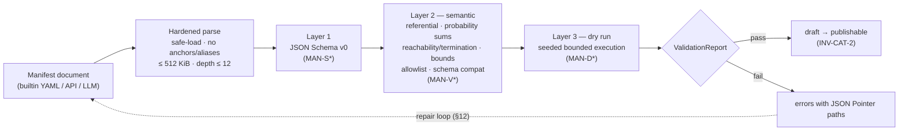
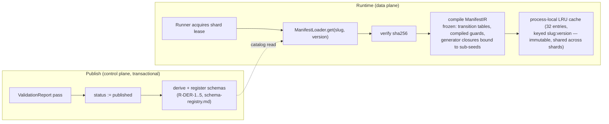

# DataForge — Scenario Plugin Architecture

**Deliverable:** D6

This document defines the declarative scenario manifest: the versioned data document that fully describes a simulated business domain (entities, generators, relationships, event types, state machines, preconditions, CDC config, intensity curves, seed catalogs, chaos defaults) and that one generic runtime interprets (ADR-0003). It freezes the Manifest v0 JSON Schema, the built-in generator vocabulary, the three-layer validation pipeline with concrete resource bounds, the version-pinning semantics for running streams, the loader/catalog design, the AI-generation slot-in contract, the threat model for untrusted manifests, and the workspace configuration overlay. Terminology follows [../03-domain/domain-model.md](../03-domain/domain-model.md); the envelope fields a manifest feeds (`partition_by`, entity key formats, CDC toggles) are contracted in [../03-domain/event-model.md](../03-domain/event-model.md); the full worked example is [scenarios/ecommerce.md](scenarios/ecommerce.md).

---

## 1. Design principles

| # | Principle | Consequence |
|---|---|---|
| P-1 | **Scenarios are versioned data, not code.** A scenario is a YAML/JSON manifest stored in the catalog; adding a scenario never touches core code (ADR-0003). | The reference e-commerce scenario exists only as a manifest file; `grep -r ecommerce backend/ --include='*.py'` matching anything but the builtin YAML path is a CI failure from Phase 3 ("zero e-commerce logic in Python" exit criterion). |
| P-2 | **One generic runtime.** The behavior engine ([behavior-engine.md](behavior-engine.md)) interprets any valid manifest; there is no per-scenario interpreter, subclass, or branch. | Manifest expressiveness gaps are fixed by extending the manifest grammar (additively), never by special-casing the runtime. |
| P-3 | **Python hooks for value generation only — never control flow.** A `hook` generator may compute one attribute value. Hooks cannot appear in transition probabilities, guards, dwell distributions, effects targets, or payload structure: those grammars have no hook slot, so control-flow hooks are unrepresentable, not merely forbidden. | Hooks are platform-registered code (§4.6), allowlisted by name. |
| P-4 | **The reference scenario uses zero hooks.** The shipped `ecommerce` manifest must contain no `hook` generator — a permanent CI assertion ([../06-quality/testing-strategy.md](../06-quality/testing-strategy.md)). The 41-generator built-in vocabulary must be sufficient for the full 8-entity scenario; if it is not, the vocabulary grows. | The manifest DSL stays honest: what the reference scenario needs, every scenario gets declaratively. |
| P-5 | **Untrusted by default.** Every manifest — builtin, human-authored, LLM-emitted — passes the identical three-layer validation pipeline (§8). There is no trust gradient in validation; trust differences exist only in *capability* (hooks, §4.6) and *visibility* (§10.1). | AI-generated scenarios are "a manifest that validates", not a special integration (§12). |
| P-6 | **Published versions are immutable; streams pin.** A published manifest version never changes (INV-CAT-1); a running stream's behavior is fixed by its copied `(manifest_version, configuration)` pin (INV-CAT-4, INV-STR-5). | Determinism (INV-G-4) and gradable exercises survive catalog evolution. |

---

## 2. Manifest anatomy

A manifest is a single document with eight top-level sections plus a schema discriminator. Authoring format is YAML or JSON; the catalog canonicalizes to JSON for storage, hashing, and validation (§10).

| Section | Required | Contents | Consumed by |
|---|---|---|---|
| `manifest_schema` | yes | Constant `"v0"` — grammar version of this document (§9.3) | validator, loader |
| `metadata` | yes | `slug`, semver `version`, `title`, `description`, `actor_entity`, `simulated_timezone` | catalog, runtime |
| `entities` | yes | Entity types: key prefix, key attribute, attribute generators (§4) | entity pools, schema derivation |
| `relationships` | no | FK declarations: cardinality, ownership, delete behavior (§3.2) | referential validation, `ref.fk`, exists-guards |
| `event_types` | yes | Payload field mappings from entity/session state; `partition_by` (§5) | emission, schema derivation (registry) |
| `state_machines` | yes | Session + lifecycle machines: states, probabilistic transitions, dwell, guards, effects (§6) | behavior engine |
| `cdc` | no | Which entities emit `c`/`u`/`d`; background mutation rules (§7) | CDC emission (ADR-0012) |
| `intensity` | no | Diurnal/weekly multiplier curves (defaults: flat 1.0) | arrival pacing (ADR-0007) |
| `seeding` | yes | Per-entity seed catalog sizes: default/min/max | pool seeding |
| `chaos_defaults` | no | Per-mode default chaos config for new scenario instances (defaults: all disabled) | chaos engine ([chaos-engine.md](chaos-engine.md)) |

Illustrative excerpt (the normative full manifest is [scenarios/ecommerce.md](scenarios/ecommerce.md)):

```yaml
manifest_schema: v0
metadata:
  slug: ecommerce
  version: 1.0.0
  title: E-Commerce
  actor_entity: users
  simulated_timezone: UTC
entities:
  users:
    key_prefix: usr
    key_attribute: user_id
    attributes:
      full_name:  { generator: person.full_name }
      email:      { generator: person.email, params: { from: full_name } }
      address:    { generator: address.full }
      marketing_opt_in: { generator: choice.boolean, params: { p_true: 0.6 } }
relationships:
  - name: order_user
    source_entity: orders
    source_attribute: user_id
    target_entity: users
    cardinality: many_to_one
    on_target_delete: restrict
event_types:
  order_placed:
    partition_by: actor            # PK-1 default, stated explicitly
    payload:
      order_id: { from: created.orders.order_id }
      user_id:  { from: actor.user_id }
      items:    { from: session.cart_items }
      total:    { generated: { generator: derived.expr,
                  params: { expr: "round(sum(session.cart_items[].unit_price) + 4.99, 2)",
                            output: decimal } } }
state_machines:
  shopping_session:
    type: session
    binds: users
    initial: session_started
    session_timeout: PT30M
    states:
      checkout_started:
        remainder: exit            # 30% abandon at checkout (PRD F4)
        transitions:
          - to: order_placed
            probability: 0.70
            dwell: { family: lognormal, median: PT3M, p95: PT12M }
            effects:
              - { action: create, entity: orders, set: { user_id: { from: actor.user_id } } }
            emit: order_placed
            override: { allowed: true, min: 0.10, max: 0.95 }
  order_lifecycle:                 # the stock guard runs here, where the order is the subject
    type: lifecycle
    binds: orders
    initial: placed
    states:
      placed:
        transitions:
          - to: reserving
            probability: 0.95
            guard:
              all:
                - exists:
                    relationship: inventory_product
                    of: subject.via.order_primary_product
                    where:
                      - { attribute: stock, op: gte, ref: subject.item_count }
            emit: payment_authorized
cdc:
  entities:
    users:
      enabled_default: true
      ops: [c, u]
      background_mutations:
        - name: address_change      # exercise E4: 0.5%/entity/day
          rate: { per: entity_day, probability: 0.005 }
          set: { address: { generator: address.full } }
seeding:
  catalogs:
    users:    { default: 5000, min: 100, max: 100000 }
    products: { default: 1000, min: 50,  max: 100000 }
intensity:
  diurnal:                         # buckets contiguously cover [0, 24) (layer 2, §9.1 notes)
    - { from_hour: 0,  to_hour: 6,  multiplier: 0.30 }
    - { from_hour: 6,  to_hour: 20, multiplier: 1.00 }
    - { from_hour: 20, to_hour: 22, multiplier: 1.80 }
    - { from_hour: 22, to_hour: 24, multiplier: 0.80 }
  weekly: { mon: 0.9, tue: 0.9, wed: 0.95, thu: 1.0, fri: 1.1, sat: 1.2, sun: 1.0 }
chaos_defaults:
  duplicates: { enabled: false, rate: 0.05 }
```

---

## 3. Entities and relationships

### 3.1 Entities

Each entity type declares:

| Field | Contract |
|---|---|
| `key_prefix` | 2–8 lowercase letters. Pooled entity keys are `{key_prefix}_{16 lowercase hex}` (≤ 25 chars, never containing `:` — required by the `partition_key` grammar, event-model §2.2.3). Hex digits come from the `pools` sub-seed (ADR-0008). |
| `key_attribute` | The attribute name carrying the key in payloads and CDC row images (`user_id`, `order_id`). Implicitly present; not redeclared in `attributes`. |
| `attributes` | Name → generator spec (§4). Names match `^[a-z][a-z0-9_]{0,63}$` — the leading-lowercase rule makes the reserved `_df` prefix (event-model SB-1) structurally impossible at layer 1. |

Two timestamps, `created_at` and `updated_at` (simulated time, RFC 3339), are maintained automatically by the runtime on every pooled entity and included in CDC row images (they are what makes dbt snapshots workable, event-model §7.2); manifests must not declare attributes with those names (MAN-V110).

Nesting in v0 exists only through object-yielding generators (`address.full`); arbitrary nested attribute trees are not part of v0 — a future generator or a `v1` grammar adds them additively (§9.3).

### 3.2 Relationships

```yaml
- name: order_user
  source_entity: orders          # entity holding the FK attribute
  source_attribute: user_id
  target_entity: users           # FK points at this entity's key
  cardinality: many_to_one       # many_to_one | one_to_one (m:n via a join entity)
  on_target_delete: restrict     # restrict | cascade | set_null (default restrict)
  owned: false                   # true = source lifecycle is bounded by target (composition)
```

Relationships are the only license for cross-entity reference: every `ref.fk` generator, every `ref.attr` traversal, every exists-guard lookup, and every `via` segment in an effect target must name a declared relationship (MAN-V103). The behavior engine indexes pools by relationship so exists-guards are O(1) lookups, not scans.

---

## 4. Generator vocabulary

The vocabulary is a **closed allowlist of 41 built-in generators** plus the gated `hook`. A `generator` value outside this list fails validation (MAN-V401); generator `params` are validated per the catalogs below (MAN-V402). All generators draw exclusively from the stream's `values` sub-seed (ADR-0008) — same seed, same values, byte-identical (INV-GEN-3).

### 4.1 Identity, personal, and address (faker-style)

| Generator | Params (type, default) | Output | Notes |
|---|---|---|---|
| `id.uuid` | — | string | UUIDv4-format, seeded PRNG (deterministic) |
| `id.seq` | `start` (int, 1), `step` (int, 1) | integer | Per-entity-type monotonic counter |
| `person.first_name` | `locale` (string, `en_US`) | string | Locale ∈ shipped locale set; unknown locale → MAN-V402 |
| `person.last_name` | `locale` | string | — |
| `person.full_name` | `locale` | string | — |
| `person.email` | `from` (sibling attr name, optional), `domains` (string[], default pool of 12) | string | With `from`, derives `rosa.delgado@…` from the name attribute |
| `person.username` | `from` (optional) | string | — |
| `person.phone` | `locale` | string | E.164-shaped per locale |
| `address.street` / `.city` / `.state` / `.postal_code` / `.country` | `locale` | string | Individually usable |
| `address.full` | `locale` | object | `{street, city, state, postal_code, country}` — the only nested-object source in v0 |

### 4.2 Commerce, internet, text

| Generator | Params (type, default) | Output | Notes |
|---|---|---|---|
| `commerce.product_name` | — | string | Adjective + material + noun pools |
| `commerce.category` | `depth` (int 1–3, 1) | string | Taxonomy path, `/`-joined at depth > 1 |
| `commerce.brand` | — | string | — |
| `commerce.sku` | `pattern` (template ≤ 64 chars, `"{#hex8}"`) | string | — |
| `commerce.price` | `min` (decimal str, `"1.00"`), `max` (decimal str, `"999.99"`), `distribution` (`uniform`\|`lognormal`, `lognormal`) | decimal string | Money is always a decimal string, 2-digit scale (event-model S-6) |
| `internet.ip_v4` | `private` (bool, false) | string | — |
| `internet.user_agent` | — | string | Pool of 40 realistic UAs |
| `internet.url` | `domains` (string[]) | string | — |
| `text.word` | — | string | — |
| `text.sentence` | `max_words` (int ≤ 30, 12) | string | — |
| `text.paragraph` | `max_sentences` (int ≤ 5, 3) | string | Review bodies |

### 4.3 Numeric distributions, choice, time

| Generator | Params (type, default) | Output | Notes |
|---|---|---|---|
| `number.int` | `min`, `max` (int, required) | integer | Uniform |
| `number.float` | `min`, `max` (required), `precision` (int 0–6, 2) | number | Uniform |
| `number.normal` | `mean`, `stddev` (required), `min`, `max` (clamps), `precision` | number | Clamped Gaussian |
| `number.lognormal` | `median`, `p95` (required), `min`, `max`, `precision` | number | Parameterized exactly like PRD §4.2 latencies |
| `number.zipf` | `n` (int ≤ 100,000, required), `s` (number 0.5–2.0, 1.0) | integer | Rank draw — popularity skew for products |
| `number.decimal` | `min`, `max` (decimal str, required), `scale` (int 0–4, 2), `distribution` (`uniform`\|`normal`\|`lognormal`, `uniform`) | decimal string | — |
| `choice.weighted` | `options` ([{`value` scalar, `weight` number > 0}], 1–100 items, required) | scalar | Weights normalized; e.g. review ratings {5★: 45, 4★: 30, …} |
| `choice.uniform` | `options` (scalar[], 1–100, required) | scalar | — |
| `choice.boolean` | `p_true` (number 0–1, 0.5) | boolean | — |
| `time.now` | — | string (RFC 3339) | Current **virtual-clock** time |
| `time.between` | `start`, `end` (ISO durations relative to `virtual_epoch`, required) | string (RFC 3339) | Seeded-pool backstories (`created_at` of pre-seeded users) |

### 4.4 Templates, references, derived

| Generator | Params | Output | Notes |
|---|---|---|---|
| `template` | `pattern` (string ≤ 1,024 chars, ≤ 16 placeholders, required) | string | Placeholders: `{attr_name}` (sibling attribute, resolved post-generation in dependency order; cycles → MAN-V405) and random tokens `{#hex8}`, `{#hex16}`, `{#digits4}`, `{#digits8}`, `{#upper4}` |
| `ref.fk` | `relationship` (declared relationship name, required), `selection` (`uniform`\|`zipf`\|`recent`, `uniform`), `s` (zipf exponent 0.5–2.0, 1.0), `window` (duration, for `recent`) | string (entity key) | Picks a **live** pooled entity of the relationship's target — referential integrity by construction (INV-GEN-1) |
| `ref.attr` | `via` (sibling `ref.fk` attribute name, required), `attribute` (attr on target, required) | target attr type | Denormalized copy (e.g. `unit_price` from the product) |
| `derived.expr` | `expr` (string ≤ 256 chars, ≤ 32 tokens, depth ≤ 4, required), `output` (`number`\|`integer`\|`decimal`, required), `scale` (int 0–4, 2; decimal only) | per `output` | Grammar in §4.5 |

### 4.5 `derived.expr` grammar (closed)

```
expr     := term (('+'|'-') term)*
term     := factor (('*'|'/') factor)*
factor   := NUMBER | path | func | '(' expr ')'
func     := ('round'|'min'|'max'|'sum'|'count') '(' args ')'
path     := contextPath          # actor.x, subject.y, session.cart_items[].unit_price
```

No variables, no conditionals, no loops, no string operations, no function composition beyond depth 4. `sum`/`count` accept only `session.<key>[].<field>` list paths. Division by a value that realizes to zero is a generation error (the event is a bug, never emitted — INV-REG-4 analogue); the dry run (§8.4) flags expressions whose operands can realize to zero.

### 4.6 `hook` — the gated escape hatch

| Aspect | Contract |
|---|---|
| Spec form | `{ generator: hook, params: { name: <registered name>, args: {…} } }` |
| Registration | Platform code only: `@register_value_hook("risk_score", output_type="number")` in `backend/<app>/hooks/`; the registry is frozen at process start. Hooks are code-reviewed platform artifacts, never tenant uploads. |
| Signature | `def hook(rng: Random, args: Mapping, entity: EntityView) -> value` — pure function of its inputs; `rng` is namespaced from the `values` sub-seed; `entity` is a read-only view; no I/O, no imports of network/file modules (import-linted in CI). |
| Budget | ≤ 100 µs per call target; the dry run (§8.4) measures realized cost and fails publication on budget breach (MAN-D604 via the events/s floor). |
| Visibility gate | Only `global`-visibility (platform-curated) manifests may reference hooks. Any `workspace`-visibility manifest containing a `hook` generator fails validation (MAN-V404) — tenant and LLM manifests can never reach hook code. |
| Reference-scenario ban | The shipped `ecommerce` manifest contains zero hooks (P-4); CI asserts it permanently. |

---

## 5. Event types and schema derivation

### 5.1 Event type declaration

```yaml
event_types:
  order_placed:
    description: Checkout completed; order created
    partition_by: actor                  # optional; default = actor (PK-1)
    payload:
      order_id: { from: created.orders.order_id }
      user_id:  { from: actor.user_id }
      items:    { from: session.cart_items }
      currency: { const: "USD" }
      total:    { generated: { generator: derived.expr, params: { … } } }
```

| Rule | Statement |
|---|---|
| R-EVT-1 | Event type names match `^[a-z][a-z0-9_]{0,63}$` (snake_case past-tense by convention). The pattern admits no dot, so collision with the reserved `cdc.{entity}` namespace (event-model §2.1 field 8) is structurally impossible. |
| R-EVT-2 | Payload field sources are exactly three forms: `from` (context path), `const` (scalar literal), `generated` (generator spec). A field may add `nullable: true` (default false). |
| R-EVT-3 | Context paths resolve against the emitting transition's binding context: `actor.*` (the actor's pooled entity), `subject.*` (the entity the machine traversal is bound to), `created.<entity>.*` (an entity created by this transition's effects), `session.<key>` (session working memory, §6.4). Unresolvable paths → MAN-V105. |
| R-EVT-4 | `partition_by` is an entity-ref (`actor`, `subject`, `created.<entity>`); default `actor` — exactly PK-1 of event-model §2.2.3. CDC events ignore it (PK-2 is not overridable). |
| R-EVT-5 | The envelope's `entity_refs` (field 16) is derived automatically: the partition entity first, then every distinct pooled entity referenced by `from` paths and `ref.fk`-typed fields, in payload declaration order. Cap: 16 refs (B-12). |
| R-EVT-6 | Every event type must be `emit`-ted by at least one transition, and every `emit` must name a declared event type (MAN-V107); unreachable event types are a dry-run warning (W-D611). |

### 5.2 Schema derivation rules (feeding the registry)

Publishing a manifest version derives JSON Schemas and registers them in the schema registry ([schema-registry.md](schema-registry.md)) inside the same transaction (§10.3). Derivation is deterministic: re-deriving the same manifest version yields byte-identical schemas.

| Rule | Statement |
|---|---|
| R-DER-1 | Each business event type → subject `{scenario_slug}.{event_type}` (INV-REG-1). Each CDC-enabled entity → subject `{scenario_slug}.cdc.{entity_type}` whose schema is the **row image** (all declared attributes + `key_attribute` + auto `created_at`/`updated_at`); the Debezium frame around it is the frozen envelope contract (event-model §4.1), not a registry concern. |
| R-DER-2 | Type mapping: string-output generators → `{"type":"string"}`; `number.int`, `id.seq`, `number.zipf` → `integer`; `number.float/normal/lognormal` → `number`; `number.decimal`, `commerce.price`, `derived.expr(output: decimal)` → `{"type":"string","pattern":"^-?\\d+\\.\\d{1,4}$"}`; `choice.boolean` → `boolean`; `choice.weighted/uniform` with all-scalar options → `{"enum":[…]}` **when no effect writes to the attribute** — an entity attribute targeted by any `create`/`update` effect `set` (or a `cdc.background_mutations` `set`) has a machine-defined value domain, so it derives the options' base scalar type instead (`{"type":"string"}`/`integer`/`number`/`boolean`; mixed-type options → MAN-V402): effect-written values are type-checked against that fragment by MAN-V407, and the base type stays fragment-stable across minor versions that rewire machines (a member-union enum would change an existing property's fragment and trip REG-C002); payload `generated` choice fields are never effect-written and always derive enums; `time.*` → `{"type":"string","format":"date-time"}`; `address.full` → closed object of its five string properties; `ref.fk` → `{"type":"string","pattern":"^{key_prefix}_[0-9a-f]{16}$"}`; `const` → `{"const": value}`; `hook` → its registered `output_type`; `session.<key>` list paths → `{"type":"array","items":{closed object of the remembered fields}}`. `nullable: true` wraps the type in `["…","null"]`. |
| R-DER-3 | Derived payload schemas are **closed**: every field `required`, `additionalProperties: false`. This is deliberate — `schema_drift` chaos must *violate* the pinned schema (event-model §6), and `corrupted_values`/`nulls` must be detectable against it. |
| R-DER-4 | First publication of a scenario registers version 1 of every subject. A later manifest version registers a next schema version **only** for subjects whose derived schema changed, and the change must satisfy `BACKWARD_ADDITIVE` (INV-REG-3). The registry compatibility check runs during manifest validation; a non-additive payload change fails publication with MAN-V501 — fail at the manifest, not at the registry. |
| R-DER-5 | Subject uniqueness: event type names and entity names share no namespace, but the derived subject set must be collision-free per scenario (MAN-V502 — only reachable via an entity named like an event type with CDC enabled producing `slug.cdc.x` vs a business event literally named `cdc` — excluded by R-EVT-1, kept as a defensive check). |

The v1→v2→v3 e-commerce evolution exercise (Phase 10) is three manifest minor versions whose payload additions register registry versions 2 and 3 per R-DER-4; the walkthrough lives in [schema-registry.md](schema-registry.md).

---

## 6. State machines

The manifest declares machine *shape*; runtime interpretation semantics (tick loop, dwell timers, checkpointing) are owned by [behavior-engine.md](behavior-engine.md). The contract both sides honor:

### 6.1 Machine kinds and spawning

| Kind | Count | Binds | Spawns |
|---|---|---|---|
| `session` | exactly one per manifest (MAN-V210) | the `metadata.actor_entity` (MAN-V211) | by the arrival process: `target_tps`-derived session arrival rate × intensity curves (ADR-0007); each traversal binds one actor |
| `lifecycle` | 0–9 | any entity type | a traversal starts when an entity of the bound type is **created** (e.g. the `order_lifecycle` machine starts at order creation), beginning at `initial` |

`session_timeout` (session machines only, default `PT30M`, simulated time) absorbs any in-flight traversal — the ultimate termination backstop for session machines.

### 6.2 Transition selection and the remainder rule (exact)

For each non-terminal state `s` with transitions `t_1…t_n` (declaration order), probabilities `p_i ∈ (0, 1]`:

1. **Sum rule:** `S = Σ p_i ≤ 1.0 + 1e-9` (MAN-V201). The **remainder** `r = max(0, 1 − S)` belongs to the state's `remainder` policy: `exit` (default) — the traversal is absorbed in `s`; `stay` — the state is re-entered and re-evaluated (self-loop). Declaring `remainder` on a state where `S = 1.0` exactly is dead configuration and an error (MAN-V202).
2. **Selection:** one uniform draw `u ∈ [0,1)` from the `transitions` sub-seed; cumulative intervals in declaration order; `u ≥ S` selects the remainder.
3. **Guards:** if the selected transition's guard evaluates false, the selection **falls through to the remainder policy** for this evaluation (it does not re-draw — re-drawing would silently redistribute probability mass). Realized rates therefore condition on guard pass; the dry run reports realized vs configured rates (§8.4).
4. **Dwell:** the selected transition's `dwell` distribution (default `fixed PT0S`) is sampled at selection; the transition fires after that much **simulated** time (PRD §4.2 clock-domain rule).
5. **Timeout:** a state-level `timeout {after, to, emit?}` competes: if the sampled dwell exceeds `after`, the timeout edge fires instead (this is how PRD L1's "30 min, else `order_cancelled`" is expressed).
6. Self-transitions are legal and are how browse loops work (PRD F1's Geometric(0.25) views-per-session emerges from a `product_viewed → product_viewed` edge at p = 0.75).
7. A non-terminal state must have ≥ 1 transition or a `timeout` (MAN-V209); a `terminal: true` state must have neither, and no `remainder` (MAN-V203).

### 6.3 Guards (preconditions)

A guard is a conjunction (`all`, 1–8 conditions). Disjunction is expressed inside a condition via `op: in`. Two condition forms:

```yaml
# attribute comparison against the binding context
- { path: subject.status, op: eq, value: delivered }
# return window: virtual_now − subject.delivered_at ≤ P30D
- { path: subject.delivered_at, op: within, value: P30D }
# existence over a declared relationship (the refund gate)
- exists:
    relationship: shipment_order        # shipments.order_id → orders
    of: subject                         # the order this traversal is bound to
    where:
      - { attribute: status, op: in, value: [delivered, lost] }
```

Ops: `eq, ne, gt, gte, lt, lte, in, not_in, within`. `exists` may set `negate: true` and carries ≤ 4 `where` clauses comparing target attributes to literals (`value`) or context paths (`ref`). Guards reference only declared entities/attributes/relationships (MAN-V102/V103), and their paths and ops type-check (MAN-V104) — this is what makes "refund requires a delivered order" a validated, structural precondition (INV-GEN-2), not a runtime filter.

### 6.4 Effects and session memory

Effects execute in declaration order when the transition fires; that order **is** the CDC emission order (event-model R-CDC-2: business event at `sequence_no` n, CDC events n+1, n+2, … per mutated entity).

| Action | Shape | Semantics |
|---|---|---|
| `create` | `{action: create, entity, set: {attr: valueSource…}}` | New pooled entity; unset attributes generate from the entity's declared generators; emits CDC `c` if enabled |
| `update` | `{action: update, target, set: {…}}` | Mutates attributes; bumps `entity_version`; emits CDC `u` |
| `adjust` | `{action: adjust, target, attribute, by: <number or from-path>}` | Numeric increment/decrement (inventory); emits CDC `u` |
| `delete` | `{action: delete, target}` | Removes from pool per lifecycle; emits CDC `d`; blocked by `on_target_delete: restrict` relationships |
| `remember` | `{action: remember, key, mode: set\|append, value: {field: valueSource…}}` | Session working memory (the cart): ≤ 16 keys, ≤ 100 entries per list, ≤ 16 fields per entry (B-10); readable as `session.<key>` paths |

`target` grammar: `actor | subject | created.<entity>`, optionally extended by `.via.<relationship>` segments (≤ 2) to reach related entities (e.g. decrement the inventory row of a created order's product). A transition carries ≤ 8 effects and ≤ 1 `emit` (B-07) — one business event per transition keeps R-CDC-2 ordering trivial; multi-event consequences are modeled as transition chains.

---

## 7. CDC configuration

```yaml
cdc:
  entities:
    users:
      enabled_default: true        # scenario-instance toggle default (pinned at stream start)
      ops: [c, u]                  # subset of c/u/d this entity may emit
      background_mutations:
        - name: address_change
          rate: { per: entity_day, probability: 0.005 }
          set: { address: { generator: address.full } }
```

| Rule | Statement |
|---|---|
| R-CDC-M1 | Only entities listed under `cdc.entities` may emit CDC; the *instance-level* enable set (overlay §11) must be a subset of them. Mutation of a CDC-enabled entity by any effect emits the corresponding op if that op is in `ops`; ops not listed are silently not emitted (the mutation still happens — `ops` filters emission, not behavior). |
| R-CDC-M2 | `background_mutations` are mutations with no causing business event (event-model R-CDC-3: CDC-only, chain-root, `actor_id` null). `per: entity_day` is the only v0 rate basis: each eligible pooled entity mutates with the given probability per simulated day, scheduled deterministically from the `pools` sub-seed. ≤ 8 rules per entity, ≤ 20 per manifest (B-14). |
| R-CDC-M3 | Snapshot `r` events are not configurable: they are emitted per event-model §4.3 (seeded entities at stream start, head of backfill downloads) whenever the entity is CDC-enabled. |
| R-CDC-M4 | Enabling CDC for an entity derives a `{slug}.cdc.{entity}` subject (R-DER-1); per-entity consumption filtering matches event-model R-CDC-7. |

---

## 8. Validation pipeline

Every manifest — builtin file, console upload, LLM output — passes the same pipeline; so does every workspace override set (re-validated as a merged document, §11). The pipeline is the load-bearing wall that makes untrusted manifests safe to *accept* (P-5) before quotas make them safe to *run* (§13).



**Parse hardening (before any layer):** YAML safe loader only; anchors and aliases rejected outright (billion-laughs); raw document ≤ 512 KiB (B-01); nesting depth ≤ 12 (B-02); canonicalization to JSON before hashing/storage. Violations → MAN-S001/S002/S003. Layers 1+2 run synchronously (≤ 60 s budget, B-17); layer 3 runs as a Celery job with the report polled (§12).

### 8.1 Layer 1 — JSON Schema

The document must conform to the Manifest v0 JSON Schema (§9.1); violations are MAN-S004 with a JSON Pointer per failure. The schema encodes every bound expressible structurally (counts via `maxProperties`/`maxItems`, patterns, ranges); per-generator `params` constraints are layer-2 (the §4 catalogs are normative).

### 8.2 Layer 2 — semantic checks

**Referential integrity (MAN-V1xx):**

| Code | Check |
|---|---|
| MAN-V101 | Every entity name referenced anywhere (`relationships`, `cdc`, `seeding`, `binds`, `metadata.actor_entity`, effects) is declared |
| MAN-V102 | Every attribute referenced (context paths, `ref.attr`, guards, `set`/`adjust` targets, `template` placeholders) is declared on its entity |
| MAN-V103 | Every `ref.fk`, exists-guard, and `.via.` segment names a declared relationship with compatible direction |
| MAN-V104 | Guard paths/ops type-check (e.g. `within` requires a timestamp attribute; `gte` requires numeric) |
| MAN-V105 | Payload `from` paths resolve in the emitting transitions' binding contexts (an event emitted by a transition with no `created.orders` effect cannot map `from: created.orders.*`) |
| MAN-V106 | `partition_by` resolves in every emitting context |
| MAN-V107 | `emit` ⇄ `event_types` closure both directions (R-EVT-6) |
| MAN-V108 | `cdc.entities` keys and instance-default CDC set are declared entities |
| MAN-V109 | Reserved names: no `cdc`-colliding subjects (R-DER-5), no `_df*` anywhere (event-model SB-1 — double-checked beyond the layer-1 pattern) |
| MAN-V110 | No declared attribute named `created_at`/`updated_at` (§3.1) or shadowing `key_attribute` |
| MAN-V111 | **Seed-order reference DAG:** every attribute of a seeded entity (one listed in `seeding.catalogs`) that uses `ref.fk` must target an entity that is also seeded and declared **earlier** in `entities` — the seed-time reference graph over seeded entities is a DAG respecting declaration order, which is what lets the behavior engine seed pools in declaration order ([behavior-engine.md](behavior-engine.md) §4.5 step 3) |

**Probability and machine structure (MAN-V2xx):**

| Code | Check (exact rule) |
|---|---|
| MAN-V201 | Per state: `Σ p_i ≤ 1.0 + 1e-9` (§6.2 rule 1) |
| MAN-V202 | `remainder` declared on a fully-allocated state (`S = 1.0`) |
| MAN-V203 | Terminal state with transitions, timeout, or remainder |
| MAN-V204 | **Orphan state:** unreachable from `initial` over transition + timeout edges |
| MAN-V205 | **Guaranteed-infinite cycle:** a reachable strongly-connected component with no escape edge (no path to a terminal state, an exit-remainder, or — session machines — the implicit `session_timeout` absorption). Absorption must be reachable from every reachable state. |
| MAN-V206 | A state whose every outgoing transition is guarded must declare `remainder: exit` (guard-starved actors must leave, never spin) |
| MAN-V207 | **Expected-steps bound:** treating guards as passing and `stay` remainders as self-loops, the absorbing-chain expected transition count from `initial` (fundamental matrix `N = (I − Q)⁻¹`, ≤ 40×40 per B-06) must be ≤ 1,000 (B-13). A singular `(I − Q)` within tolerance is reported as V205. Recomputed for every override set (§11). |
| MAN-V208 | Each `p_i ∈ (0, 1]`; `override.min ≤ p_i ≤ override.max` where declared |
| MAN-V209 | Non-terminal state with no transitions and no timeout |
| MAN-V210/211 | Exactly one `session` machine; it `binds` `metadata.actor_entity` |

**Resource bounds (MAN-V3xx — one code per bound, MAN-V301…V317):**

| ID | Bound | Limit | Justification |
|---|---|---|---|
| B-01 | Raw manifest size | ≤ 512 KiB | Full 8-entity reference manifest canonicalizes to ≈ 35 KiB → 14× headroom; caps parser CPU/memory on untrusted input |
| B-02 | Parse shape | no anchors/aliases; depth ≤ 12 | Billion-laughs and quadratic-blowup parses are rejected before validation spends a cycle |
| B-03 | Entities | ≤ 50 | E-commerce uses 8; the largest plausible scenarios (healthcare, fintech) fit in ~30; 50 caps pool count and CDC subject fan-out |
| B-04 | Attributes | ≤ 100 per entity; ≤ 2,000 total | Bounds row-image size and per-mutation CDC cost; 100 attrs ≈ realistic wide table |
| B-05 | Event types | ≤ 200 business; ≤ 250 subjects incl. derived `cdc.*` | Caps registry writes per publish and per-stream schema cache |
| B-06 | Machines | ≤ 10; states ≤ 40/machine; transitions ≤ 20/state, ≤ 200/machine | Keeps V207's matrix inversion trivial (40×40) and the checkpoint small; e-commerce needs 2 machines, ~15 states |
| B-07 | Per transition | guards ≤ 8 conditions (≤ 2 `exists`); effects ≤ 8; `emit` ≤ 1 | Bounds per-tick work and CDC burst per transition (≤ 8 CDC events follow one business event) |
| B-08 | Seed catalogs | ≤ 100,000 per entity; Σ `default` and Σ configured ≤ 250,000 | At ≤ ~1 KiB hot state per pooled entity, worst case ≈ 244 MiB Redis per stream — inside the per-stream budget in [../02-architecture/scaling-strategy.md](../02-architecture/scaling-strategy.md) |
| B-09 | Actor pool | = seed catalog of `actor_entity`, ≤ 100,000; runtime live working set ≤ 500,000 per entity per stream (growth handled by terminal-entity archival, [behavior-engine.md](behavior-engine.md)) | 100k actors saturates Pro's 1,000 TPS many times over (≈ 10 events/actor/day at 1k TPS); larger pools add memory, not realism |
| B-10 | Generator payloads | `choice` options ≤ 100; `template` ≤ 1,024 chars / ≤ 16 placeholders; `expr` ≤ 256 chars / ≤ 32 tokens / depth ≤ 4; `remember` ≤ 16 keys / ≤ 100 entries / ≤ 16 fields | Caps per-event CPU and session-memory footprint |
| B-11 | Relationships | ≤ 100 | Bounds pool index count |
| B-12 | Event size | payload fields ≤ 64; worst-case serialized payload ≤ 64 KiB (estimated at publish per R-DER-2 maxima, enforced again at emission); `entity_refs` ≤ 16 | Ties directly to the frozen envelope bound (event-model §2.1) |
| B-13 | Traversal length | expected ≤ 1,000 (V207); runtime hard cap 10,000 transitions/traversal | Reference session ≈ 10–15 events → 70× headroom; catches adversarial near-absorbing loops (stay p = 0.999 ⇒ expected 1,000) |
| B-14 | Background mutations | ≤ 8 per entity, ≤ 20 per manifest; `probability` ≤ 1.0/entity-day | Caps CDC background volume at catalog-size × 1/day |
| B-15 | Durations | every dwell/timeout/window ≤ P365D; intensity multipliers ∈ [0, 10] | A year-long dwell exceeds any plausible exercise; 10× multiplier bounds burst arithmetic |
| B-16 | Chaos defaults | per-mode `rate` ≤ 0.5 | Chaos above 50% is noise, not teaching signal; caps duplicate amplification at 1.5× |
| B-17 | Validation budget | L1+L2 ≤ 60 s wall, single worker; L3 per §8.4 | The validator itself must not be the DoS target (T-6) |

**Generators and schema compatibility (MAN-V4xx/V5xx):** MAN-V401 unknown generator (allowlist, §4); V402 invalid params (per-generator catalogs); V403 `hook.name` not registered; V404 hook in a `workspace`-visibility manifest (§4.6); V405 template placeholder unresolvable or cyclic; V406 expression violates §4.5; V407 effect-write type mismatch — every value a `create`/`update` effect `set`, an `adjust`, or a `cdc.background_mutations` `set` writes to an entity attribute must satisfy that attribute's derived R-DER-2 fragment (`const` scalars validated directly; `from` sources and `generated` specs by fragment compatibility; `adjust` requires a numeric fragment), so CDC row images and `from`-mapped payload fields can never fail emission validation (registry EM-2/EM-3): the mismatch fails at publish, never at runtime; V501 derived schema non-additive vs the prior manifest version (R-DER-4); V502 subject collision (R-DER-5); V503 worst-case payload estimate > 64 KiB (B-12).

### 8.3 ValidationReport

Stored on the ManifestVersion (domain model §2.3); shape:

```json
{
  "status": "failed",
  "schema_version": "v0",
  "errors": [
    { "code": "MAN-V201", "path": "/state_machines/shopping_session/states/checkout_started",
      "message": "outgoing probabilities sum to 1.15; must be <= 1.0",
      "bound": 1.0, "actual": 1.15, "scope": "manifest" }
  ],
  "warnings": [
    { "code": "W-D610", "path": "/state_machines/order_lifecycle/states/delivered/transitions/2",
      "message": "guard never passed in dry run (0/4112 selections); transition is unreachable in practice" }
  ],
  "dry_run": {
    "events_generated": 50000, "traversals_completed": 1000,
    "mean_events_per_session": 11.4, "max_payload_bytes": 2210,
    "p99_payload_bytes": 1894, "est_eps_per_shard": 8400,
    "realized_rates": { "shopping_session.checkout_started.order_placed": 0.69 }
  }
}
```

`scope` is `manifest` or `override` (§11). Error `path` is always a JSON Pointer into the canonical document — machine-actionable by construction (§12).

### 8.4 Layer 3 — dry-run budget check

The candidate manifest is executed by the **actual generic runtime** in a sandboxed, bounded mode — the only check that observes realized behavior (guard interaction, hook cost, true payload sizes).

| Parameter | Value |
|---|---|
| Seed | Fixed published validation seed `424242424242` (results comparable across runs and manifests) |
| Catalogs | `min(default, 1,000)` per entity; chaos disabled; intensity flat; `speed_multiplier` irrelevant (backfill-style unpaced execution) |
| Budget | 30 s wall, 256 MiB RSS delta, stop at 50,000 events or 1,000 completed session traversals — whichever first |
| MAN-D601 | Budget exhausted before reaching either completion target |
| MAN-D602 | Any traversal hit the 10,000-transition hard cap (B-13) — guard-induced livelock V205/V207 could not see |
| MAN-D603 | A division-by-zero or unresolvable value realized in `derived.expr`/`template` |
| MAN-D604 | `est_eps_per_shard` < 1,000 measured on the validation worker (same instance class as runners, [../02-architecture/deployment-architecture.md](../02-architecture/deployment-architecture.md)) — a manifest that cannot sustain 1,000 events/s per shard cannot honor Pro's 1,000 TPS cap (PRD §7) on any reasonable shard count |
| MAN-D605 | Realized serialized payload > 64 KiB (B-12 enforced empirically) |
| Warnings | W-D610 guard-starved transitions; W-D611 event types never emitted; W-D612 entities never referenced |

`mean_events_per_session` is persisted and consumed by the behavior engine to convert `target_tps` into a session arrival rate ([behavior-engine.md](behavior-engine.md)). **Sequencing:** layers 1+2 ship in Phase 3 with the validator; layer 3 lands with the behavior engine in Phase 4 — the only manifests published in that one-phase window are the builtin subset, which Phase 4 CI retroactively re-validates through L3 (per-phase gates in [../06-quality/testing-strategy.md](../06-quality/testing-strategy.md)).

---

## 9. Manifest v0 JSON Schema

### 9.1 The schema (normative, frozen at Phase 0; CI artifact from Phase 3 per ADR-0001)

```json
{
  "$schema": "https://json-schema.org/draft/2020-12/schema",
  "$id": "https://dataforge.dev/schemas/manifest/v0.json",
  "title": "DataForge scenario manifest, grammar v0",
  "type": "object",
  "additionalProperties": false,
  "required": ["manifest_schema", "metadata", "entities", "event_types", "state_machines", "seeding"],
  "properties": {
    "manifest_schema": { "const": "v0" },
    "metadata": {
      "type": "object",
      "additionalProperties": false,
      "required": ["slug", "version", "title", "actor_entity"],
      "properties": {
        "slug": { "$ref": "#/$defs/identifier" },
        "version": { "type": "string", "pattern": "^(0|[1-9]\\d*)\\.(0|[1-9]\\d*)\\.(0|[1-9]\\d*)$" },
        "title": { "type": "string", "minLength": 1, "maxLength": 120 },
        "description": { "type": "string", "maxLength": 2000 },
        "actor_entity": { "$ref": "#/$defs/identifier" },
        "simulated_timezone": { "type": "string", "maxLength": 64, "default": "UTC" }
      }
    },
    "entities": {
      "type": "object",
      "minProperties": 1,
      "maxProperties": 50,
      "propertyNames": { "pattern": "^[a-z][a-z0-9_]{0,31}$" },
      "additionalProperties": { "$ref": "#/$defs/entity" }
    },
    "relationships": {
      "type": "array",
      "maxItems": 100,
      "items": { "$ref": "#/$defs/relationship" }
    },
    "event_types": {
      "type": "object",
      "minProperties": 1,
      "maxProperties": 200,
      "propertyNames": { "pattern": "^[a-z][a-z0-9_]{0,63}$" },
      "additionalProperties": { "$ref": "#/$defs/eventType" }
    },
    "state_machines": {
      "type": "object",
      "minProperties": 1,
      "maxProperties": 10,
      "propertyNames": { "pattern": "^[a-z][a-z0-9_]{0,31}$" },
      "additionalProperties": { "$ref": "#/$defs/stateMachine" }
    },
    "cdc": { "$ref": "#/$defs/cdcConfig" },
    "intensity": { "$ref": "#/$defs/intensityConfig" },
    "seeding": { "$ref": "#/$defs/seedingConfig" },
    "chaos_defaults": { "$ref": "#/$defs/chaosDefaults" }
  },
  "$defs": {
    "identifier": { "type": "string", "pattern": "^[a-z][a-z0-9_]{0,31}$" },
    "identifier64": { "type": "string", "pattern": "^[a-z][a-z0-9_]{0,63}$" },
    "duration": { "type": "string", "pattern": "^P(?!$)([0-9]+D)?(T(?=[0-9])([0-9]+H)?([0-9]+M)?([0-9]+(\\.[0-9]+)?S)?)?$" },
    "probability": { "type": "number", "exclusiveMinimum": 0, "maximum": 1 },
    "contextPath": {
      "type": "string", "maxLength": 160,
      "pattern": "^(actor|subject|session|created\\.[a-z][a-z0-9_]{0,31})(\\.[a-z][a-z0-9_]{0,63}(\\[\\])?){1,3}$"
    },
    "entityRef": {
      "type": "string", "maxLength": 160,
      "pattern": "^(actor|subject|created\\.[a-z][a-z0-9_]{0,31})(\\.via\\.[a-z][a-z0-9_]{0,31}){0,2}$"
    },
    "generatorSpec": {
      "type": "object",
      "additionalProperties": false,
      "required": ["generator"],
      "properties": {
        "generator": {
          "enum": [
            "id.uuid", "id.seq",
            "person.first_name", "person.last_name", "person.full_name",
            "person.email", "person.username", "person.phone",
            "address.street", "address.city", "address.state",
            "address.postal_code", "address.country", "address.full",
            "commerce.product_name", "commerce.category", "commerce.brand",
            "commerce.sku", "commerce.price",
            "internet.ip_v4", "internet.user_agent", "internet.url",
            "text.word", "text.sentence", "text.paragraph",
            "number.int", "number.float", "number.normal",
            "number.lognormal", "number.zipf", "number.decimal",
            "choice.weighted", "choice.uniform", "choice.boolean",
            "time.now", "time.between",
            "template", "ref.fk", "ref.attr", "derived.expr",
            "hook"
          ]
        },
        "params": { "type": "object", "maxProperties": 16 }
      }
    },
    "valueSource": {
      "type": "object",
      "additionalProperties": false,
      "properties": {
        "from": { "$ref": "#/$defs/contextPath" },
        "const": { "type": ["string", "number", "boolean"] },
        "generated": { "$ref": "#/$defs/generatorSpec" },
        "nullable": { "type": "boolean", "default": false }
      },
      "oneOf": [
        { "required": ["from"] },
        { "required": ["const"] },
        { "required": ["generated"] }
      ]
    },
    "entity": {
      "type": "object",
      "additionalProperties": false,
      "required": ["key_prefix", "key_attribute", "attributes"],
      "properties": {
        "description": { "type": "string", "maxLength": 500 },
        "key_prefix": { "type": "string", "pattern": "^[a-z]{2,8}$" },
        "key_attribute": { "$ref": "#/$defs/identifier64" },
        "attributes": {
          "type": "object",
          "minProperties": 1,
          "maxProperties": 100,
          "propertyNames": { "pattern": "^[a-z][a-z0-9_]{0,63}$" },
          "additionalProperties": { "$ref": "#/$defs/generatorSpec" }
        }
      }
    },
    "relationship": {
      "type": "object",
      "additionalProperties": false,
      "required": ["name", "source_entity", "source_attribute", "target_entity", "cardinality"],
      "properties": {
        "name": { "$ref": "#/$defs/identifier" },
        "source_entity": { "$ref": "#/$defs/identifier" },
        "source_attribute": { "$ref": "#/$defs/identifier64" },
        "target_entity": { "$ref": "#/$defs/identifier" },
        "cardinality": { "enum": ["many_to_one", "one_to_one"] },
        "on_target_delete": { "enum": ["restrict", "cascade", "set_null"], "default": "restrict" },
        "owned": { "type": "boolean", "default": false }
      }
    },
    "eventType": {
      "type": "object",
      "additionalProperties": false,
      "required": ["payload"],
      "properties": {
        "description": { "type": "string", "maxLength": 500 },
        "partition_by": { "$ref": "#/$defs/entityRef" },
        "payload": {
          "type": "object",
          "minProperties": 1,
          "maxProperties": 64,
          "propertyNames": { "pattern": "^[a-z][a-z0-9_]{0,63}$" },
          "additionalProperties": { "$ref": "#/$defs/valueSource" }
        }
      }
    },
    "distribution": {
      "oneOf": [
        { "type": "object", "additionalProperties": false, "required": ["family", "value"],
          "properties": { "family": { "const": "fixed" }, "value": { "$ref": "#/$defs/duration" } } },
        { "type": "object", "additionalProperties": false, "required": ["family", "min", "max"],
          "properties": { "family": { "const": "uniform" },
            "min": { "$ref": "#/$defs/duration" }, "max": { "$ref": "#/$defs/duration" } } },
        { "type": "object", "additionalProperties": false, "required": ["family", "median", "p95"],
          "properties": { "family": { "const": "lognormal" },
            "median": { "$ref": "#/$defs/duration" }, "p95": { "$ref": "#/$defs/duration" } } },
        { "type": "object", "additionalProperties": false, "required": ["family", "mean"],
          "properties": { "family": { "const": "exponential" }, "mean": { "$ref": "#/$defs/duration" } } }
      ]
    },
    "comparison": {
      "type": "object",
      "additionalProperties": false,
      "required": ["path", "op"],
      "properties": {
        "path": { "$ref": "#/$defs/contextPath" },
        "op": { "enum": ["eq", "ne", "gt", "gte", "lt", "lte", "in", "not_in", "within"] },
        "value": {
          "type": ["string", "number", "boolean", "array"],
          "items": { "type": ["string", "number", "boolean"] },
          "maxItems": 50
        }
      }
    },
    "existsCondition": {
      "type": "object",
      "additionalProperties": false,
      "required": ["exists"],
      "properties": {
        "exists": {
          "type": "object",
          "additionalProperties": false,
          "required": ["relationship", "of"],
          "properties": {
            "relationship": { "$ref": "#/$defs/identifier" },
            "of": { "$ref": "#/$defs/entityRef" },
            "negate": { "type": "boolean", "default": false },
            "where": {
              "type": "array",
              "maxItems": 4,
              "items": {
                "type": "object",
                "additionalProperties": false,
                "required": ["attribute", "op"],
                "properties": {
                  "attribute": { "$ref": "#/$defs/identifier64" },
                  "op": { "enum": ["eq", "ne", "gt", "gte", "lt", "lte", "in", "not_in", "within"] },
                  "value": { "type": ["string", "number", "boolean", "array"],
                             "items": { "type": ["string", "number", "boolean"] }, "maxItems": 50 },
                  "ref": { "$ref": "#/$defs/contextPath" }
                }
              }
            }
          }
        }
      }
    },
    "guardCondition": {
      "oneOf": [ { "$ref": "#/$defs/comparison" }, { "$ref": "#/$defs/existsCondition" } ]
    },
    "effect": {
      "oneOf": [
        { "type": "object", "additionalProperties": false, "required": ["action", "entity"],
          "properties": { "action": { "const": "create" }, "entity": { "$ref": "#/$defs/identifier" },
            "set": { "type": "object", "maxProperties": 100,
                     "additionalProperties": { "$ref": "#/$defs/valueSource" } } } },
        { "type": "object", "additionalProperties": false, "required": ["action", "target", "set"],
          "properties": { "action": { "const": "update" }, "target": { "$ref": "#/$defs/entityRef" },
            "set": { "type": "object", "minProperties": 1, "maxProperties": 100,
                     "additionalProperties": { "$ref": "#/$defs/valueSource" } } } },
        { "type": "object", "additionalProperties": false, "required": ["action", "target", "attribute", "by"],
          "properties": { "action": { "const": "adjust" }, "target": { "$ref": "#/$defs/entityRef" },
            "attribute": { "$ref": "#/$defs/identifier64" },
            "by": { "oneOf": [ { "type": "number" }, { "$ref": "#/$defs/contextPath" } ] } } },
        { "type": "object", "additionalProperties": false, "required": ["action", "target"],
          "properties": { "action": { "const": "delete" }, "target": { "$ref": "#/$defs/entityRef" } } },
        { "type": "object", "additionalProperties": false, "required": ["action", "key", "mode", "value"],
          "properties": { "action": { "const": "remember" }, "key": { "$ref": "#/$defs/identifier" },
            "mode": { "enum": ["set", "append"] },
            "value": { "type": "object", "minProperties": 1, "maxProperties": 16,
                       "additionalProperties": { "$ref": "#/$defs/valueSource" } } } }
      ]
    },
    "transition": {
      "type": "object",
      "additionalProperties": false,
      "required": ["to", "probability"],
      "properties": {
        "to": { "$ref": "#/$defs/identifier" },
        "probability": { "$ref": "#/$defs/probability" },
        "dwell": { "$ref": "#/$defs/distribution" },
        "guard": {
          "type": "object", "additionalProperties": false, "required": ["all"],
          "properties": { "all": { "type": "array", "minItems": 1, "maxItems": 8,
                                   "items": { "$ref": "#/$defs/guardCondition" } } }
        },
        "effects": { "type": "array", "maxItems": 8, "items": { "$ref": "#/$defs/effect" } },
        "emit": { "$ref": "#/$defs/identifier64" },
        "override": {
          "type": "object", "additionalProperties": false,
          "properties": {
            "allowed": { "type": "boolean", "default": true },
            "min": { "type": "number", "minimum": 0, "maximum": 1 },
            "max": { "type": "number", "minimum": 0, "maximum": 1 }
          }
        }
      }
    },
    "state": {
      "type": "object",
      "additionalProperties": false,
      "properties": {
        "terminal": { "type": "boolean", "default": false },
        "remainder": { "enum": ["exit", "stay"] },
        "timeout": {
          "type": "object", "additionalProperties": false, "required": ["after", "to"],
          "properties": { "after": { "$ref": "#/$defs/duration" },
            "to": { "$ref": "#/$defs/identifier" }, "emit": { "$ref": "#/$defs/identifier64" } }
        },
        "transitions": { "type": "array", "maxItems": 20, "items": { "$ref": "#/$defs/transition" } }
      }
    },
    "stateMachine": {
      "type": "object",
      "additionalProperties": false,
      "required": ["type", "binds", "initial", "states"],
      "properties": {
        "type": { "enum": ["session", "lifecycle"] },
        "binds": { "$ref": "#/$defs/identifier" },
        "initial": { "$ref": "#/$defs/identifier" },
        "session_timeout": { "$ref": "#/$defs/duration" },
        "states": {
          "type": "object", "minProperties": 1, "maxProperties": 40,
          "propertyNames": { "pattern": "^[a-z][a-z0-9_]{0,31}$" },
          "additionalProperties": { "$ref": "#/$defs/state" }
        }
      }
    },
    "cdcConfig": {
      "type": "object",
      "additionalProperties": false,
      "required": ["entities"],
      "properties": {
        "entities": {
          "type": "object", "minProperties": 1, "maxProperties": 50,
          "propertyNames": { "pattern": "^[a-z][a-z0-9_]{0,31}$" },
          "additionalProperties": {
            "type": "object", "additionalProperties": false,
            "properties": {
              "enabled_default": { "type": "boolean", "default": false },
              "ops": { "type": "array", "items": { "enum": ["c", "u", "d"] },
                       "uniqueItems": true, "minItems": 1, "default": ["c", "u", "d"] },
              "background_mutations": {
                "type": "array", "maxItems": 8,
                "items": {
                  "type": "object", "additionalProperties": false,
                  "required": ["name", "rate", "set"],
                  "properties": {
                    "name": { "$ref": "#/$defs/identifier" },
                    "rate": {
                      "type": "object", "additionalProperties": false,
                      "required": ["per", "probability"],
                      "properties": { "per": { "const": "entity_day" },
                        "probability": { "$ref": "#/$defs/probability" } }
                    },
                    "set": { "type": "object", "minProperties": 1, "maxProperties": 16,
                             "additionalProperties": { "$ref": "#/$defs/generatorSpec" } }
                  }
                }
              }
            }
          }
        }
      }
    },
    "intensityConfig": {
      "type": "object",
      "additionalProperties": false,
      "properties": {
        "diurnal": {
          "type": "array", "minItems": 1, "maxItems": 24,
          "items": {
            "type": "object", "additionalProperties": false,
            "required": ["from_hour", "to_hour", "multiplier"],
            "properties": {
              "from_hour": { "type": "integer", "minimum": 0, "maximum": 23 },
              "to_hour": { "type": "integer", "minimum": 1, "maximum": 24 },
              "multiplier": { "type": "number", "minimum": 0, "maximum": 10 }
            }
          }
        },
        "weekly": {
          "type": "object", "additionalProperties": false,
          "required": ["mon", "tue", "wed", "thu", "fri", "sat", "sun"],
          "properties": {
            "mon": { "type": "number", "minimum": 0, "maximum": 10 },
            "tue": { "type": "number", "minimum": 0, "maximum": 10 },
            "wed": { "type": "number", "minimum": 0, "maximum": 10 },
            "thu": { "type": "number", "minimum": 0, "maximum": 10 },
            "fri": { "type": "number", "minimum": 0, "maximum": 10 },
            "sat": { "type": "number", "minimum": 0, "maximum": 10 },
            "sun": { "type": "number", "minimum": 0, "maximum": 10 }
          }
        }
      }
    },
    "seedingConfig": {
      "type": "object",
      "additionalProperties": false,
      "required": ["catalogs"],
      "properties": {
        "catalogs": {
          "type": "object", "minProperties": 1, "maxProperties": 50,
          "propertyNames": { "pattern": "^[a-z][a-z0-9_]{0,31}$" },
          "additionalProperties": {
            "type": "object", "additionalProperties": false, "required": ["default"],
            "properties": {
              "default": { "type": "integer", "minimum": 0, "maximum": 100000 },
              "min": { "type": "integer", "minimum": 0, "maximum": 100000 },
              "max": { "type": "integer", "minimum": 0, "maximum": 100000 }
            }
          }
        }
      }
    },
    "chaosMode": {
      "type": "object",
      "additionalProperties": false,
      "required": ["enabled"],
      "properties": {
        "enabled": { "type": "boolean" },
        "rate": { "type": "number", "minimum": 0, "maximum": 0.5 },
        "params": { "type": "object", "maxProperties": 8 }
      }
    },
    "chaosDefaults": {
      "type": "object",
      "additionalProperties": false,
      "properties": {
        "duplicates": { "$ref": "#/$defs/chaosMode" },
        "late_arriving": { "$ref": "#/$defs/chaosMode" },
        "missing": { "$ref": "#/$defs/chaosMode" },
        "out_of_order": { "$ref": "#/$defs/chaosMode" },
        "corrupted_values": { "$ref": "#/$defs/chaosMode" },
        "nulls": { "$ref": "#/$defs/chaosMode" },
        "schema_drift": { "$ref": "#/$defs/chaosMode" }
      }
    }
  }
}
```

Notes binding the schema to other contracts: `chaosMode.params` per-mode contents (e.g. `late_arriving.params.delay` as a §9.1 `distribution` in **simulated time**, `out_of_order.params.window`) are validated in layer 2 against the per-stream chaos config schema owned by [chaos-engine.md](chaos-engine.md) — the manifest embeds that schema's mode shapes verbatim; intensity buckets must contiguously cover [0, 24) with `from_hour < to_hour` (layer 2); `seeding` requires `min ≤ default ≤ max` and an actor-entity `default ≥ 1` (layer 2); durations admit only D/H/M/S components — calendar months/years are ambiguous under a virtual clock and are rejected by the pattern.

### 9.2 Manifest semver semantics

| Bump | Permitted changes | Effect |
|---|---|---|
| Patch (`1.0.0 → 1.0.1`) | Documentation only: `title`, `description`s | No schema derivation; no behavioral change permitted (hash of behavioral sections must be unchanged — checked at publish) |
| Minor (`1.0.0 → 1.1.0`) | Additive: new entities, attributes, event types, payload fields, machines, states, transitions, CDC entities, generators on new attributes | Changed subjects register next registry versions (R-DER-4) |
| Major (`1.x → 2.0.0`) | Anything else: removals, renames, retypes, probability restructures, machine rewires | New version published alongside; never affects pinned streams (INV-CAT-1/4) |

Streams pin the exact version regardless of bump size; semver communicates intent to humans and gates R-DER-4's compatibility expectations.

### 9.3 Grammar versioning (`manifest_schema`)

`v0` is frozen at Phase 0. Additive grammar growth — new generators in the §4 allowlist, new optional fields with defaults — stays `v0`: published `v0` documents remain valid forever. A breaking grammar change creates `v1` via a superseding ADR; the validator and loader support every grammar version any published manifest pins, indefinitely (published manifests are immutable, so old grammars never die).

---

## 10. Loader and catalog registry

### 10.1 DB-backed catalog

The Scenario Catalog context (domain model §2.3) stores manifests in Postgres; tables (`scenarios`, `manifest_versions` with canonical-JSON `document`, `sha256`, `status`, `validation_report`, `published_at`, `created_by`) are DDL-specified in [../03-domain/database-schema.md](../03-domain/database-schema.md). `visibility = global` rows are platform-curated and tenant-read-only; `visibility = workspace` rows carry `workspace_id` and are tenant-owned (INV-CAT-6) — the seam through which AI-generated manifests arrive (§12).

```mermaid
stateDiagram-v2
    [*] --> draft : ingest (parse + L1/L2 pass; L3 job queued)
    draft --> draft : re-upload (new draft content, report reset)
    draft --> published : publish (full ValidationReport passed, INV-CAT-2)
    draft --> [*] : discard draft
    published --> deprecated : deprecate (blocks new instances/streams, INV-CAT-5)
    note right of published
        immutable forever (INV-CAT-1) —
        schema derivation committed
        in the same transaction
    end note
```



### 10.2 Builtin scenarios: YAML in repo, registered by command

Builtin manifests ship as files at `backend/catalog/builtin/{slug}/{version}.yaml` (monorepo layout per [../07-plan/project-folder-structure.md](../07-plan/project-folder-structure.md)). The idempotent management command `manage.py sync_builtin_scenarios` runs post-migrate in every deploy ([../02-architecture/deployment-architecture.md](../02-architecture/deployment-architecture.md)):

| Case | Action |
|---|---|
| `(slug, version)` absent from DB | Run the full pipeline (§8); insert as `published`. A builtin failing validation **aborts the release** — builtins are held to the same wall as tenant manifests, by construction. |
| Present, `sha256` matches | No-op |
| Present, `sha256` differs | **Hard failure** — editing a published version in place is an INV-CAT-1 violation; the fix is a new version file |

Phase sequencing: the e-commerce *subset* manifest (`1.0.0`: users, products, orders, payments + purchase funnel) registers at Phase 3; the full 8-entity manifest (written at Phase 0 as [scenarios/ecommerce.md](scenarios/ecommerce.md), the DSL forcing function) registers at Phase 8 as a minor version.

### 10.3 Publish path and runtime loading



The ManifestIR is immutable post-compile: probability tables as cumulative arrays, guards compiled to closures over pool indexes, payload mappings to field-resolver lists. Compilation failure of a *published* manifest is a release-blocking defect (the published set is replay-tested in CI), never a runtime surprise. Runners never re-read the catalog mid-stream — the pin (§11.2) plus the IR cache make manifest reads a stream-start event.

---

## 11. Workspace configuration overlay

### 11.1 What a workspace may tune

A ScenarioInstance (domain model §2.3) holds the overlay — never a forked manifest. Overlay document shape (stored as `configuration`, validated on every write):

```yaml
probabilities:                       # keyed "machine.state.to"
  shopping_session.checkout_started.order_placed: 0.55
dwell:                               # same key; same distribution family only
  shopping_session.checkout_started.order_placed: { family: lognormal, median: PT2M, p95: PT8M }
catalog_sizes: { users: 20000, products: 5000 }
intensity: { diurnal: [ … ], weekly: { … } }      # full replacement, §9.1 shapes
cdc_entities: [users, products, inventory]          # subset of manifest cdc.entities
chaos: { duplicates: { enabled: true, rate: 0.05 } }
simulated_timezone: America/New_York
```

| Knob | Constraint |
|---|---|
| Transition probabilities | Only transitions with `override.allowed: true`; value within `[override.min, override.max]` (defaults `[0, 1]`); resulting per-state sums and termination must re-validate (MAN-V201/V207, INV-CAT-3) |
| Dwell distributions | Parameters only — the family is fixed by the manifest; durations within B-15 |
| Catalog sizes | Within each entity's `[min, max]`; Σ configured ≤ 250,000 (B-08); additionally capped by plan quota at stream start (INV-TEN-5) |
| Intensity curves | §9.1 shapes; engine renormalizes to mean 1.0, so curve edits never change average TPS (PRD §4.3) |
| CDC toggles | Subset of manifest `cdc.entities` (R-CDC-M1) |
| Chaos | Per-mode config within the chaosMode shape (rate ≤ 0.5, B-16); full per-mode parameter bounds owned by [chaos-engine.md](chaos-engine.md) |
| Seed | **Not in the overlay** — the seed is a per-stream creation parameter (domain model T1), client-supplied or generated, immutable for the stream's life (INV-STR-5) |

Overlay writes run layer 2 against the **merged** document synchronously (probability sums, V207 expected-steps recompute, bounds, referential checks for `cdc_entities`/`catalog_sizes` keys); errors reuse the MAN-V codes with `"scope": "override"`. Layer 3 is **not** re-run for overlays: an overlay cannot add states, generators, entities, or payload fields — every structural worst case was already dry-run-validated at manifest publish, and the parameters it can move are bounded by V207's recomputation and B-08/B-15/B-16.

### 11.2 Version pinning for running streams (the panel-gap rule, exact)

Three artifacts version independently and pin together:

| Artifact | Versioned as | Mutability |
|---|---|---|
| Manifest | `(scenario_slug, manifest_version)`, semver | Published versions immutable forever (INV-CAT-1) |
| Overlay | `config_revision` — integer on the ScenarioInstance, starts at 1, +1 per successful overlay write | Each write is a new revision; revisions are never edited in place |
| Stream pin | Copied at stream start (T1): the materialized merged document `(manifest_version, config_revision → merged config)` + its `sha256` stored on the Stream row | Immutable for the stream's life (INV-STR-5) |

Rules:

| # | Rule |
|---|---|
| PIN-1 | A stream's behavior is a pure function of its pin plus seed: `(manifest_version, seed, merged-config sha256)` is the determinism unit (INV-G-4). The sha256 appears in golden-replay fixtures. |
| PIN-2 | Re-pinning a ScenarioInstance to a newer manifest version, or writing a new `config_revision`, affects **only streams started afterwards**. Running, paused, and stopped streams keep their copied pin; restarting a stopped stream continues under the original pin and never re-rolls the seed (T12, INV-CAT-4). |
| PIN-3 | **Live-mutable** on a running stream (desired-state document, domain model §4.4): desired run-state, `target_tps` (effective ≤ 2 s), per-mode chaos toggles/rates within the pinned bounds, and scheduled schema-version upgrade events ("evolve to v2 at T+x", Phase 10). Chaos config changes are config-*state*, not pin changes: the pinned artifact is the *bounds*, the live value is desired state — and every applied change is audit-logged (`streams.stream.chaos_policy_changed`). |
| PIN-4 | **New-stream-required** (not merely restart — restart continues the old pin): manifest version, seed, probability/dwell overrides, catalog sizes, intensity curves, CDC toggles, `simulated_timezone`, virtual-clock config (`virtual_epoch`, `speed_multiplier`, backfill mode). The console surfaces this as "changes apply to new streams". |
| PIN-5 | Deprecating a manifest version blocks new instances and new stream starts; pinned streams are untouched (INV-CAT-5). Deleting is impossible — published versions are referenced by streams, ledgers, and answer keys indefinitely. |

---

## 12. AI-generation slot-in contract

The contract is deliberately thin: **an AI-generated scenario is a manifest document that passes §8.** No model integration touches the runtime.

```mermaid
sequenceDiagram
    participant L as LLM / user tooling
    participant API as Catalog API (/api/v1/scenarios)
    participant V as Validator (L1+L2 sync, L3 Celery job)
    participant REG as Schema registry
    L->>API: POST /scenarios {document}  (workspace visibility)
    API->>V: parse-hardened ingest → L1+L2
    V-->>API: errors? ValidationReport (JSON Pointer paths)
    API-->>L: 422 problem-details + report  (repair loop)
    L->>API: POST corrected document
    API->>V: L1+L2 pass → draft created, L3 queued
    L->>API: GET /scenarios/{slug}/versions/{v}/validation  (poll)
    API-->>L: report: passed
    L->>API: POST …/versions/{v}/publish
    API->>REG: derive + register schemas (transactional)
    API-->>L: 200 — published; usable by streams like any builtin
```

Binding properties of the slot-in:

| # | Property |
|---|---|
| AI-1 | **Same pipeline, same bounds, zero core change** (ADR-0003): the generated document enters the identical §8 pipeline and runs on the identical runtime. There is nothing to integrate beyond document ingestion. |
| AI-2 | **Machine-actionable failure:** every error carries `{code, path (JSON Pointer), message, bound, actual}` (§8.3) — designed as the LLM repair-loop input. Error text never echoes document content beyond the pointed-at values (no prompt-injection amplification through the validator). |
| AI-3 | **Capability ceiling:** generated manifests are `workspace` visibility — hooks forbidden (MAN-V404), tenant-owned (INV-CAT-6), invisible to other workspaces. Promotion to `global` is a platform code-review act, never an API call. |
| AI-4 | **Validator quotas** (anti-DoS of the pipeline itself, enforced with the rate-limit stack in [../06-quality/security-architecture.md](../06-quality/security-architecture.md)): ≤ 30 validation runs/workspace/hour; ≤ 20 draft versions/workspace; one L3 job per workspace in flight. |
| AI-5 | **Endpoint shapes** (paths, problem types, async-job polling) are owned by [../05-interfaces/api-specification.md](../05-interfaces/api-specification.md); the semantics above are this document's contract on them. |

**Refined in post-MVP (Phase 12+):** the prompt→manifest generation service itself ("create a food delivery platform") and the tenant-facing manifest upload console. What exists from Phase 3 — and is permanently exercised by builtin registration (§10.2) and overlay validation (§11.1) — is everything the slot-in needs: the validation pipeline, the error catalog, the visibility model, and the catalog APIs. The decided contract is this section; the later phase adds callers, not rules.

---

## 13. Threat model: untrusted manifests

A manifest is attacker-controlled input that the platform will *execute*. The attacker is a tenant (or an LLM acting for one); the asset is platform availability and other tenants' isolation. A pathological manifest is a **tenant-level DoS vector** — the panel gap this section closes. Defense in depth has four rings: **static bounds (B-01…B-17) → generator allowlist → dry-run observation → runtime quotas/leases**. Cross-tenant impact additionally requires defeating the tenancy stack (INV-G-1), which is independent of everything here. The security architecture owns the platform-wide view ([../06-quality/security-architecture.md](../06-quality/security-architecture.md), untrusted-manifest section); this table is the engine-side contract:

| # | Threat | Vector | Mitigations (enforced where) |
|---|---|---|---|
| T-1 | Combinatorial state explosion | 40-state machines with dense self-loops and near-1.0 stay mass → unbounded traversals, checkpoint bloat | B-06 counts; V205 escape-edge check; V207 expected-steps ≤ 1,000; D602 empirical cap; runtime hard cap 10,000 transitions/traversal (behavior engine) |
| T-2 | Memory exhaustion via pools | 100k-row catalogs × 50 entities; unbounded runtime entity growth | B-08 Σ ≤ 250,000 seeded (≈ 244 MiB worst case); B-09 live working-set cap 500,000/entity with terminal-entity archival; per-stream Redis budget ([../02-architecture/scaling-strategy.md](../02-architecture/scaling-strategy.md)) |
| T-3 | CPU exhaustion via adversarial generators | Pathological zipf `n`, mega-templates, deep expressions, hook abuse | Closed allowlist (V401) + per-generator param ranges (V402, §4 catalogs); B-10 size caps; hooks unreachable from tenant manifests (V404); D604 events/s floor proves realized cost |
| T-4 | Payload amplification | 64-field payloads of 1 KiB strings at max TPS → broker/buffer pressure | B-12 worst-case ≤ 64 KiB at publish (V503) + emission-time enforcement (event-model §2.1); plan TPS caps bound bytes/s (PRD §7) |
| T-5 | Registry pollution | 200 event types × repeated minor versions → subject/version spam | B-05 subject cap; R-DER-4 registers only changed subjects; AI-4 draft/validation quotas; per-workspace subject quota (security architecture) |
| T-6 | DoS of the validator itself | Billion-laughs YAML, 512 KiB pathological regex bait, validation-loop spam | Parse hardening pre-validation (anchors banned, depth ≤ 12, size first); B-17 60 s budget; all patterns in §9.1 are linear-time (no backtracking constructs); AI-4 rate quotas |
| T-7 | Noisy-neighbor on shared runners | One stream's heavy manifest starves co-located shards | D604 floor guarantees per-event cost ceiling; lease-based shard placement and per-stream token-bucket pacing isolate budgets (ADR-0006, [behavior-engine.md](behavior-engine.md)); quota TPS caps (INV-TEN-5) |
| T-8 | Malicious *content* (not load): offensive strings, phishing URLs, PII-mimicking values in `const`/`choice`/`template` literals | Literals are delivered verbatim in events | Containment, not scanning, in MVP: workspace-visibility manifests deliver only to their own workspace (INV-DEL-6) — the author attacks only themselves; builtin vocabulary outputs are synthetic pools. ToS governs tenant literals. The prompt→manifest service (Phase 12+) adds content moderation at generation time as a launch requirement recorded in the security architecture. |
| T-9 | Determinism poisoning | Manifest crafted so replay diverges (wall-clock leakage via generator side channels) | No generator may read wall time (`time.now` is virtual); hooks receive only `(rng, args, entity)`; golden-seed replay of every published manifest is a permanent CI gate (INV-G-4, [../06-quality/testing-strategy.md](../06-quality/testing-strategy.md)) |

Residual risk statement: a manifest that passes all four rings can still be *boring or weird* (unrealistic distributions, dead funnels) — that is a product-quality concern handled by dry-run warnings (W-D610/611/612) and console preview, deliberately not a security gate.

---

## 14. Ownership boundaries

| Concern | Owner |
|---|---|
| Catalog/manifest-version DDL, JSONB storage, indexes | [../03-domain/database-schema.md](../03-domain/database-schema.md) |
| Runtime interpretation: tick loop, dwell timers, pool mechanics, checkpoint format, working-set archival | [behavior-engine.md](behavior-engine.md) |
| Per-mode chaos parameter schemas, stage order, late-buffer mechanics | [chaos-engine.md](chaos-engine.md) |
| Subject registration mechanics, compatibility algorithm, v1/v2/v3 walkthrough | [schema-registry.md](schema-registry.md) |
| Envelope fields fed by the manifest (`partition_by` → PK rules, key formats, CDC shape) | [../03-domain/event-model.md](../03-domain/event-model.md) |
| Catalog/validation endpoint shapes, problem types, async-job API | [../05-interfaces/api-specification.md](../05-interfaces/api-specification.md) |
| Platform threat model, validator rate limiting, tenancy enforcement stack | [../06-quality/security-architecture.md](../06-quality/security-architecture.md) |
| Test bindings: golden replay, no-hooks-in-reference CI assert, validator property tests, cross-tenant suite | [../06-quality/testing-strategy.md](../06-quality/testing-strategy.md) |
| The normative full e-commerce manifest (DSL expressiveness proof) | [scenarios/ecommerce.md](scenarios/ecommerce.md) |
