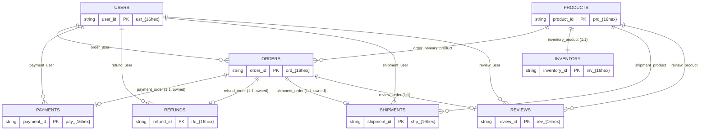
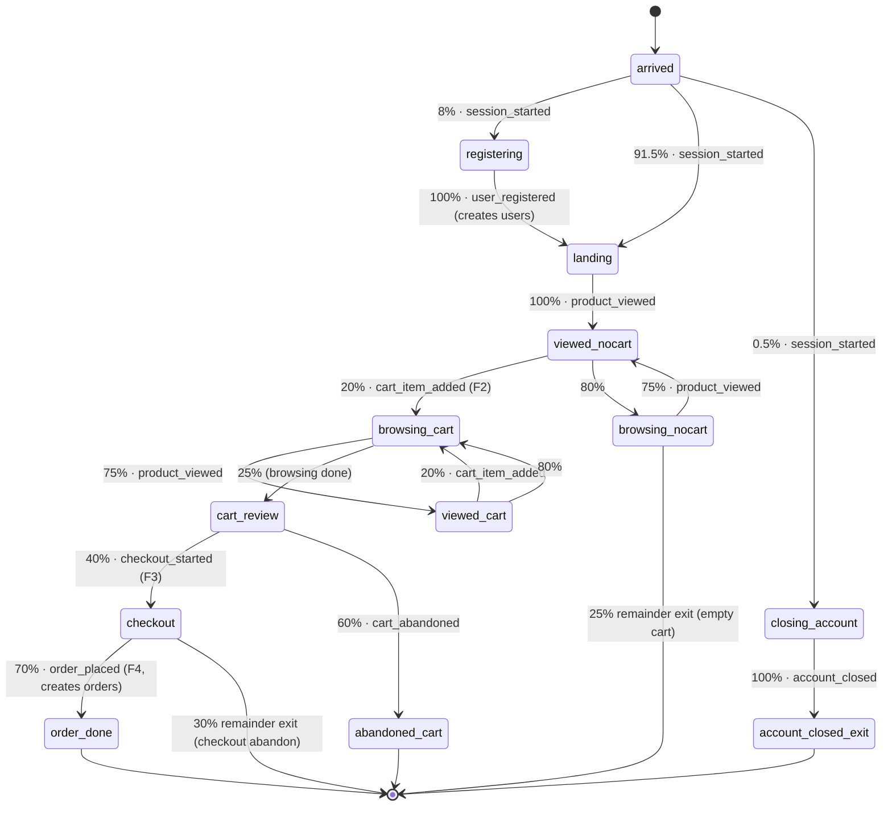

# DataForge — Reference Scenario: E-Commerce (Full Manifest)

**Deliverable:** D6 (reference scenario worked example; companion to [../scenario-plugin-architecture.md](../scenario-plugin-architecture.md))

This document is the normative full e-commerce scenario manifest — the DSL expressiveness forcing function of Phase 0 (ADR-0003, P-4). It contains the complete 8-entity manifest as a single YAML document strictly conforming to the Manifest v0 JSON Schema ([../scenario-plugin-architecture.md](../scenario-plugin-architecture.md) §9.1), implementing every default the PRD pins ([../../01-product/prd.md](../../01-product/prd.md) §4: funnel probabilities F1–F10, lifecycle latencies L1–L8, intensity curves) with **zero `hook` generators** (P-4, permanent CI assertion). It then proves the manifest by inspection: a full-funnel actor walkthrough listing every emitted business and CDC event with envelope highlights ([../../03-domain/event-model.md](../../03-domain/event-model.md)), a rule-by-rule validation checklist against the manifest-spec pipeline (§8 of the plugin spec), the event-type → registry-subject table ([../schema-registry.md](../schema-registry.md)), and the catalog of v0 expressiveness findings this exercise surfaced. Terminology follows [../../03-domain/domain-model.md](../../03-domain/domain-model.md).

---

## 1. Scenario at a glance

### 1.1 Version lineage

| Manifest version | Registers | Content |
|---|---|---|
| `ecommerce 1.0.0` (subset) | Phase 3 | `users`, `products`, `orders`, `payments`; purchase funnel through the payment outcome — event types 1–4 and 6–10 (`session_started` … `payment_authorized`/`payment_failed`/`order_cancelled`); CDC subjects derived for all four entities, default-enabled `users`/`products`/`orders` (`cdc.payments` capable but off — §5) — a projection of this document: every 1.0.0 part appears below, verbatim except the two transitions re-declared for 1.0.0, enumerated in §2's preamble |
| `ecommerce 1.1.0` (full, **this document**) | Phase 8 | All 8 entities, 21 business event types, 5 state machines, CDC for all 8 entities, intensity curves — a **minor** (additive) bump per §9.2 of the plugin spec: `order_placed` derives byte-identically to its v1 registry schema (no new subject version, registry §9.1), while `cdc.users` gains the `status` attribute and registers version 2 (R-DER-4) |

### 1.2 Inventory of parts

| Part | Count | Bound | Items |
|---|---|---|---|
| Entities | 8 | ≤ 50 (B-03) | `users`, `products`, `orders`, `payments`, `refunds`, `inventory`, `shipments`, `reviews` |
| Relationships | 13 | ≤ 100 (B-11) | see §2 `relationships` |
| Business event types | 21 | ≤ 200 (B-05) | see §1.3 |
| CDC subjects | 8 | with business: 29 ≤ 250 (B-05) | `ecommerce.cdc.{entity}` for every entity (all CDC-capable; default-enabled: `users`, `products`, `orders`, `inventory`) |
| State machines | 5 (1 session + 4 lifecycle) | ≤ 10, lifecycle ≤ 9 (B-06, MAN-V210) | `shopping_session`, `order_lifecycle`, `shipment_lifecycle`, `refund_lifecycle`, `review_lifecycle` |
| States | 13 + 8 + 7 + 4 + 2 = 34 | ≤ 40/machine (B-06) | — |
| Seed catalogs | 3 (Σ defaults 7,000) | Σ ≤ 250,000 (B-08) | `users` 5,000; `products` 1,000; `inventory` 1,000 |
| `hook` generators | **0** | P-4 ban | CI-asserted forever |

There is no pooled `order_items` entity: effects are statically declared per transition (B-07), so a per-cart-line entity cannot be created for a variable-length cart. Cart lines live in session working memory (`session.cart_items`) and are delivered inside `order_placed.items` — exactly the frozen payload shape of event-model §7.1 and registry §9.2 (finding F-1, §6).

### 1.3 Business event types → PRD rules

| # | Event type | Emitted by (machine.state) | PRD rule |
|---|---|---|---|
| 1 | `session_started` | `shopping_session.arrived` (all 3 edges) | F1 root; envelope chain root (C-1) |
| 2 | `user_registered` | `shopping_session.registering` | 8% of sessions create a new account |
| 3 | `product_viewed` | `shopping_session.landing` / `browsing_*` | F1: ≥ 1 view; views/session ~ Geometric(0.25), mean 4 |
| 4 | `cart_item_added` | `shopping_session.viewed_*` | F2: 20% per view |
| 5 | `cart_abandoned` | `shopping_session.cart_review` | F3 complement: 60% of carted sessions |
| 6 | `checkout_started` | `shopping_session.cart_review` | F3: 40% of carted sessions |
| 7 | `order_placed` | `shopping_session.checkout` | F4: 70%; payload frozen (registry §9.2) |
| 8 | `payment_authorized` | `order_lifecycle.placed` | F5: 95%, dwell L1 |
| 9 | `payment_failed` | `order_lifecycle.placed` | F5 complement: 5% |
| 10 | `order_cancelled` | `order_lifecycle.failed_payment` / `awaiting_fulfillment` | F5/F6 failure paths + L1 timeout |
| 11 | `inventory_adjusted` | `order_lifecycle.reserving` | reservation rule; reconciles to order quantities (PRD §4.4) |
| 12 | `inventory_restocked` | `order_lifecycle.restock_after_cancel` | reservation release on post-reservation cancellation |
| 13 | `shipment_created` | `order_lifecycle.awaiting_fulfillment` | F6: 98%, dwell L2 |
| 14 | `shipment_shipped` | `shipment_lifecycle.created` | carrier pickup (additive detail between F6 and F7) |
| 15 | `shipment_delivered` | `shipment_lifecycle.in_transit` | F7: 97%, dwell completes L3 |
| 16 | `shipment_lost` | `shipment_lifecycle.in_transit` (edge + timeout) | F7 complement: 3%; L3 hard bound 14 d |
| 17 | `review_submitted` | `shipment_lifecycle.delivered` | F8: 25%, dwell L4; ratings {5★:45, 4★:30, 3★:12, 2★:6, 1★:7} |
| 18 | `refund_requested` | `order_lifecycle.cancel_refund`, `shipment_lifecycle.lost` / `delivered` | F9: 5% within 30 simulated days, gated on delivery; auto on loss |
| 19 | `refund_approved` | `refund_lifecycle.requested` / `auto_approving` | F10: 80%, dwell L6 (+ 7 d auto-approve timeout) |
| 20 | `refund_denied` | `refund_lifecycle.requested` | F10 complement: 20% |
| 21 | `account_closed` | `shopping_session.closing_account` | 0.5% of sessions; drives `cdc.users` `u` |

The task-level names `added_to_cart`, `order_created`, `payment_completed`, `refund_completed` map to the established ubiquitous-language names `cart_item_added`, `order_placed`, `payment_authorized`, `refund_approved` used across every sibling spec; `user_address_changed` is not a business event — it is the `address_change` CDC background mutation (R-CDC-3, exercise E4).

### 1.4 Entity-relationship diagram



### 1.5 Session funnel (states as declared in §2)



Post-order progress (`order_lifecycle` → `shipment_lifecycle` → `refund_lifecycle`) is drawn in PRD §4.1's state diagram; the declared machines in §2 realize it transition-for-transition.

---

## 2. The manifest (normative)

The complete `ecommerce 1.1.0` manifest. This single YAML document is the artifact that ships at `backend/catalog/builtin/ecommerce/1.1.0.yaml` (plugin spec §10.2) and registers at Phase 8. The Phase 3 subset `1.0.0` is this document minus `refunds`/`inventory`/`shipments`/`reviews` (their entities, relationships, seed catalogs, and `cdc.entities` entries), minus event types 5 and 11–21, minus the three lifecycle machines beyond `order_lifecycle`, minus `order_lifecycle`'s post-payment states (`reserving`, `awaiting_fulfillment`, `cancel_refund`, `restock_after_cancel`, `fulfilling`), and minus `users.status` — with exactly **two transitions re-declared** for 1.0.0, both forced by the removals: (i) `shopping_session.arrived` drops its 0.5% `closing_account` edge (event type 21 and the `closing_account`/`account_closed_exit` states do not exist in 1.0.0) and folds that mass into the `landing` edge (92.0%, keeping the MAN-V201 sum at 1.0); (ii) `order_lifecycle.placed`'s 0.95 success edge drops its `inventory_product` stock guard (no `inventory` entity exists in 1.0.0) and targets a 1.0.0-only terminal state `authorized` instead of `reserving` — probability, dwell, the payment-creating effects, the `status: authorized` subject update, `emit: payment_authorized`, and the override bounds are unchanged. `failed_payment` and `closed_cancelled` are retained verbatim, making `failed_payment` the only `order_cancelled` emitter in 1.0.0. Inline comments are annotations for the reader; they are stripped by YAML canonicalization and carry no semantics.

```yaml
manifest_schema: v0

metadata:
  slug: ecommerce
  version: 1.1.0
  title: E-Commerce
  description: >-
    Reference business simulation: a retail storefront with users, a product
    catalog, inventory, orders, payments, refunds, shipments, and reviews.
    Implements the PRD default funnel (F1-F10), lifecycle latencies (L1-L8),
    and retail intensity curves. Zero hooks (P-4).
  actor_entity: users
  simulated_timezone: UTC

entities:

  users:
    description: Shoppers; the scenario's actor entity. CDC row image feeds exercise E4 (SCD2).
    key_prefix: usr
    key_attribute: user_id
    attributes:
      full_name:        { generator: person.full_name }
      email:            { generator: person.email, params: { from: full_name } }
      address:          { generator: address.full }
      marketing_opt_in: { generator: choice.boolean, params: { p_true: 0.6 } }
      status:           { generator: choice.uniform, params: { options: [active] } }   # 1.1.0 addition -> cdc.users v2

  products:
    description: Catalog items. Popularity skew comes from zipf selection at view time, not from the entity.
    key_prefix: prd
    key_attribute: product_id
    attributes:
      name:     { generator: commerce.product_name }
      category: { generator: commerce.category, params: { depth: 2 } }
      brand:    { generator: commerce.brand }
      sku:      { generator: commerce.sku }
      price:    { generator: commerce.price, params: { min: "3.99", max: "499.00", distribution: lognormal } }
      active:   { generator: choice.boolean, params: { p_true: 0.95 } }

  orders:
    description: >-
      One order per completed checkout. primary_product_id / item_count /
      neg_item_count are denormalized accounting attributes copied from session
      memory at creation (findings F-1, F-2): they let lifecycle effects and
      guards reach the inventory row of the representative cart line.
    key_prefix: ord
    key_attribute: order_id
    attributes:
      user_id:            { generator: ref.fk, params: { relationship: order_user } }
      primary_product_id: { generator: ref.fk, params: { relationship: order_primary_product } }
      status:             { generator: choice.uniform, params: { options: [placed] } }
      item_count:         { generator: number.int, params: { min: 1, max: 8 } }
      neg_item_count:     { generator: number.int, params: { min: -8, max: -1 } }
      total:              { generator: number.decimal, params: { min: "4.99", max: "4500.00", scale: 2 } }

  payments:
    description: Exactly one per order that reaches authorization (success or declined).
    key_prefix: pay
    key_attribute: payment_id
    attributes:
      order_id: { generator: ref.fk, params: { relationship: payment_order } }
      user_id:  { generator: ref.fk, params: { relationship: payment_user } }
      amount:   { generator: number.decimal, params: { min: "4.99", max: "4500.00", scale: 2 } }
      method:   { generator: choice.weighted, params: { options: [
                    { value: card,      weight: 70 },
                    { value: paypal,    weight: 15 },
                    { value: apple_pay, weight: 10 },
                    { value: gift_card, weight: 5 } ] } }
      status:   { generator: choice.uniform, params: { options: [authorized] } }

  refunds:
    description: At most one per order; created only from cancellation, loss, or in-window return paths (structural gate).
    key_prefix: rfd
    key_attribute: refund_id
    attributes:
      order_id: { generator: ref.fk, params: { relationship: refund_order } }
      user_id:  { generator: ref.fk, params: { relationship: refund_user } }
      amount:   { generator: number.decimal, params: { min: "4.99", max: "4500.00", scale: 2 } }
      status:   { generator: choice.uniform, params: { options: [requested] } }
      reason:   { generator: choice.uniform, params: { options: [product_return] } }

  inventory:
    description: >-
      Exactly one row per product (inventory_product is one_to_one; seed
      catalogs are equal-sized so seeding yields a bijection). stock is the
      only adjusted attribute; non-negativity is enforced by the behavior
      engine's pool mutation rule (PRD §4.4), see §6 F-3.
    key_prefix: inv
    key_attribute: inventory_id
    attributes:
      product_id: { generator: ref.fk, params: { relationship: inventory_product } }
      stock:      { generator: number.int, params: { min: 80, max: 500 } }
      warehouse:  { generator: choice.uniform, params: { options: [east, west, central] } }

  shipments:
    description: >-
      One per fulfilled order. user_id / primary_product_id / total are
      denormalized from the order at creation so that downstream effects
      (reviews, refunds) can be expressed with 1-segment context paths
      (finding F-4: context paths cannot traverse relationships).
    key_prefix: shp
    key_attribute: shipment_id
    attributes:
      order_id:           { generator: ref.fk, params: { relationship: shipment_order } }
      user_id:            { generator: ref.fk, params: { relationship: shipment_user } }
      primary_product_id: { generator: ref.fk, params: { relationship: shipment_product } }
      total:              { generator: number.decimal, params: { min: "4.99", max: "4500.00", scale: 2 } }
      carrier:            { generator: choice.weighted, params: { options: [
                              { value: ups,   weight: 35 },
                              { value: fedex, weight: 30 },
                              { value: usps,  weight: 25 },
                              { value: dhl,   weight: 10 } ] } }
      tracking_number:    { generator: template, params: { pattern: "1Z{#upper4}{#digits8}" } }
      status:             { generator: choice.uniform, params: { options: [created] } }
      delivered_at:       { generator: time.between, params: { start: P0D, end: P0D } }   # placeholder until delivery; see §6 F-6

  reviews:
    description: Created on the F8 path; review_lifecycle deletes ~2% (moderation) emitting cdc.reviews op d when enabled.
    key_prefix: rev
    key_attribute: review_id
    attributes:
      user_id:    { generator: ref.fk, params: { relationship: review_user } }
      product_id: { generator: ref.fk, params: { relationship: review_product } }
      order_id:   { generator: ref.fk, params: { relationship: review_order } }
      rating:     { generator: choice.weighted, params: { options: [
                      { value: 5, weight: 45 },
                      { value: 4, weight: 30 },
                      { value: 3, weight: 12 },
                      { value: 2, weight: 6 },
                      { value: 1, weight: 7 } ] } }
      title:      { generator: text.sentence, params: { max_words: 8 } }
      body:       { generator: text.paragraph, params: { max_sentences: 3 } }

relationships:
  - { name: order_user,            source_entity: orders,    source_attribute: user_id,            target_entity: users,    cardinality: many_to_one, on_target_delete: restrict }
  - { name: order_primary_product, source_entity: orders,    source_attribute: primary_product_id, target_entity: products, cardinality: many_to_one, on_target_delete: restrict }
  - { name: payment_order,         source_entity: payments,  source_attribute: order_id,           target_entity: orders,   cardinality: one_to_one,  on_target_delete: restrict, owned: true }
  - { name: payment_user,          source_entity: payments,  source_attribute: user_id,            target_entity: users,    cardinality: many_to_one, on_target_delete: restrict }
  - { name: refund_order,          source_entity: refunds,   source_attribute: order_id,           target_entity: orders,   cardinality: one_to_one,  on_target_delete: restrict, owned: true }
  - { name: refund_user,           source_entity: refunds,   source_attribute: user_id,            target_entity: users,    cardinality: many_to_one, on_target_delete: restrict }
  - { name: inventory_product,     source_entity: inventory, source_attribute: product_id,         target_entity: products, cardinality: one_to_one,  on_target_delete: restrict }
  - { name: shipment_order,        source_entity: shipments, source_attribute: order_id,           target_entity: orders,   cardinality: one_to_one,  on_target_delete: restrict, owned: true }
  - { name: shipment_user,         source_entity: shipments, source_attribute: user_id,            target_entity: users,    cardinality: many_to_one, on_target_delete: restrict }
  - { name: shipment_product,      source_entity: shipments, source_attribute: primary_product_id, target_entity: products, cardinality: many_to_one, on_target_delete: restrict }
  - { name: review_user,           source_entity: reviews,   source_attribute: user_id,            target_entity: users,    cardinality: many_to_one, on_target_delete: restrict }
  - { name: review_product,        source_entity: reviews,   source_attribute: product_id,         target_entity: products, cardinality: many_to_one, on_target_delete: restrict }
  - { name: review_order,          source_entity: reviews,   source_attribute: order_id,           target_entity: orders,   cardinality: one_to_one,  on_target_delete: restrict }

event_types:

  # ---- session funnel -------------------------------------------------------
  session_started:
    description: Chain root of every session (event-model C-1).
    partition_by: actor
    payload:
      user_id:    { from: actor.user_id }
      channel:    { generated: { generator: choice.weighted, params: { options: [
                      { value: web,        weight: 55 },
                      { value: mobile_app, weight: 30 },
                      { value: mobile_web, weight: 15 } ] } } }
      ip_address: { generated: { generator: internet.ip_v4 } }
      user_agent: { generated: { generator: internet.user_agent } }

  user_registered:
    description: A new account created mid-session; pairs with cdc.users op c (R-CDC-2).
    partition_by: actor
    payload:
      user_id:          { from: created.users.user_id }
      email:            { from: created.users.email }
      full_name:        { from: created.users.full_name }
      marketing_opt_in: { from: created.users.marketing_opt_in }
      referral_channel: { generated: { generator: choice.weighted, params: { options: [
                            { value: organic,     weight: 40 },
                            { value: paid_search, weight: 25 },
                            { value: social,      weight: 20 },
                            { value: referral,    weight: 15 } ] } } }

  product_viewed:
    description: One per view; zipf product selection gives catalog popularity skew.
    partition_by: actor
    payload:
      user_id:    { from: actor.user_id }
      product_id: { from: session.last_viewed.product_id }
      price:      { from: session.last_viewed.unit_price }

  cart_item_added:
    description: Field set frozen by event-model §7.3. Quantity is always 1 (one line per add; §6 F-8).
    partition_by: actor
    payload:
      user_id:    { from: actor.user_id }
      product_id: { from: session.last_viewed.product_id }
      quantity:   { const: 1 }
      unit_price: { from: session.last_viewed.unit_price }

  cart_abandoned:
    description: Emitted only for non-empty carts (F3 complement); empty-cart sessions exit silently.
    partition_by: actor
    payload:
      user_id:    { from: actor.user_id }
      items:      { from: session.cart_items }
      item_count: { from: session.cart_units.units }
      cart_value: { generated: { generator: derived.expr, params: {
                      expr: "round(sum(session.cart_items[].unit_price), 2)", output: decimal, scale: 2 } } }

  checkout_started:
    partition_by: actor
    payload:
      user_id:    { from: actor.user_id }
      items:      { from: session.cart_items }
      item_count: { from: session.cart_units.units }
      subtotal:   { generated: { generator: derived.expr, params: {
                      expr: "round(sum(session.cart_items[].unit_price), 2)", output: decimal, scale: 2 } } }

  order_placed:
    description: >-
      Payload derives byte-identically to registry subject ecommerce.order_placed
      version 1 (schema-registry §9.2) — order_id, user_id, items, currency,
      subtotal, shipping_fee, total, shipping_country, in this order.
    partition_by: actor
    payload:
      order_id:         { from: created.orders.order_id }
      user_id:          { from: actor.user_id }
      items:            { from: session.cart_items }
      currency:         { const: "USD" }
      subtotal:         { generated: { generator: derived.expr, params: {
                            expr: "round(sum(session.cart_items[].unit_price), 2)", output: decimal, scale: 2 } } }
      shipping_fee:     { generated: { generator: derived.expr, params: {
                            expr: "4.99", output: decimal, scale: 2 } } }
      total:            { generated: { generator: derived.expr, params: {
                            expr: "round(sum(session.cart_items[].unit_price) + 4.99, 2)", output: decimal, scale: 2 } } }
      shipping_country: { from: actor.address.country }

  # ---- order lifecycle ------------------------------------------------------
  payment_authorized:
    description: Subject is the order; the payment row is created by the same transition.
    partition_by: actor
    payload:
      payment_id: { from: created.payments.payment_id }
      order_id:   { from: subject.order_id }
      user_id:    { from: subject.user_id }
      amount:     { from: subject.total }
      method:     { from: created.payments.method }
      currency:   { const: "USD" }

  payment_failed:
    partition_by: actor
    payload:
      payment_id:     { from: created.payments.payment_id }
      order_id:       { from: subject.order_id }
      user_id:        { from: subject.user_id }
      amount:         { from: subject.total }
      method:         { from: created.payments.method }
      failure_reason: { generated: { generator: choice.weighted, params: { options: [
                          { value: insufficient_funds, weight: 45 },
                          { value: card_declined,      weight: 30 },
                          { value: expired_card,       weight: 15 },
                          { value: fraud_suspected,    weight: 10 } ] } } }

  order_cancelled:
    description: >-
      Emitted from two contexts (failed payment; fulfillment cancellation) —
      the payload is the intersection resolvable in both (MAN-V105); the cause
      is recoverable from the preceding event via causation_id (§6 F-5).
    partition_by: actor
    payload:
      order_id: { from: subject.order_id }
      user_id:  { from: subject.user_id }
      total:    { from: subject.total }

  inventory_adjusted:
    description: Stock reservation at payment authorization; delta is negative (reservation rule).
    partition_by: actor
    payload:
      order_id:   { from: subject.order_id }
      product_id: { from: subject.primary_product_id }
      delta:      { from: subject.neg_item_count }
      reason:     { const: order_reservation }

  inventory_restocked:
    description: Reservation release when a reserved order is cancelled (F6 path); delta is positive.
    partition_by: actor
    payload:
      order_id:   { from: subject.order_id }
      product_id: { from: subject.primary_product_id }
      delta:      { from: subject.item_count }
      reason:     { const: order_cancelled }

  shipment_created:
    partition_by: actor
    payload:
      shipment_id:     { from: created.shipments.shipment_id }
      order_id:        { from: subject.order_id }
      user_id:         { from: subject.user_id }
      carrier:         { from: created.shipments.carrier }
      tracking_number: { from: created.shipments.tracking_number }

  # ---- shipment lifecycle ---------------------------------------------------
  shipment_shipped:
    description: Carrier pickup; subject is the shipment.
    partition_by: actor
    payload:
      shipment_id:     { from: subject.shipment_id }
      order_id:        { from: subject.order_id }
      carrier:         { from: subject.carrier }
      tracking_number: { from: subject.tracking_number }

  shipment_delivered:
    partition_by: actor
    payload:
      shipment_id:  { from: subject.shipment_id }
      order_id:     { from: subject.order_id }
      user_id:      { from: subject.user_id }
      delivered_at: { from: subject.delivered_at }

  shipment_lost:
    description: Emitted by the 3% loss edge and by the 14-day L3 timeout edge (same context).
    partition_by: actor
    payload:
      shipment_id:     { from: subject.shipment_id }
      order_id:        { from: subject.order_id }
      carrier:         { from: subject.carrier }
      tracking_number: { from: subject.tracking_number }

  review_submitted:
    partition_by: actor
    payload:
      review_id:  { from: created.reviews.review_id }
      user_id:    { from: subject.user_id }
      product_id: { from: subject.primary_product_id }
      order_id:   { from: subject.order_id }
      rating:     { from: created.reviews.rating }
      title:      { from: created.reviews.title }
      body:       { from: created.reviews.body }

  # ---- refunds ---------------------------------------------------------------
  refund_requested:
    description: >-
      Emitted from three contexts (fulfillment cancellation: subject=order;
      loss and in-window return: subject=shipment). Every field reads from
      created.refunds.*, which resolves identically in all three (MAN-V105)
      and carries the per-path reason set at creation (§6 F-5 workaround).
    partition_by: actor
    payload:
      refund_id: { from: created.refunds.refund_id }
      order_id:  { from: created.refunds.order_id }
      user_id:   { from: created.refunds.user_id }
      amount:    { from: created.refunds.amount }
      reason:    { from: created.refunds.reason }

  refund_approved:
    partition_by: actor
    payload:
      refund_id: { from: subject.refund_id }
      order_id:  { from: subject.order_id }
      amount:    { from: subject.amount }
      reason:    { from: subject.reason }

  refund_denied:
    partition_by: actor
    payload:
      refund_id:     { from: subject.refund_id }
      order_id:      { from: subject.order_id }
      amount:        { from: subject.amount }
      denial_reason: { generated: { generator: choice.weighted, params: { options: [
                         { value: outside_window,  weight: 40 },
                         { value: item_used,       weight: 35 },
                         { value: fraud_suspected, weight: 25 } ] } } }

  # ---- account lifecycle -----------------------------------------------------
  account_closed:
    description: Sets users.status=closed; pairs with cdc.users op u. Hard deletes are blocked by order_user restrict.
    partition_by: actor
    payload:
      user_id: { from: actor.user_id }
      email:   { from: actor.email }

state_machines:

  shopping_session:
    type: session
    binds: users
    initial: arrived
    session_timeout: PT30M
    states:

      arrived:                              # probabilities sum to exactly 1.0
        transitions:
          - to: registering
            probability: 0.08
            emit: session_started
            override: { allowed: true, min: 0.0, max: 0.30 }
          - to: landing
            probability: 0.915
            emit: session_started
            override: { allowed: true, min: 0.50, max: 1.0 }
          - to: closing_account
            probability: 0.005
            emit: session_started
            override: { allowed: true, min: 0.0, max: 0.05 }

      registering:
        transitions:
          - to: landing
            probability: 1.0
            dwell: { family: lognormal, median: PT45S, p95: PT3M }
            effects:
              - { action: create, entity: users, set: {} }     # all attributes from declared generators; status=active
            emit: user_registered
            override: { allowed: false }

      closing_account:
        transitions:
          - to: account_closed_exit
            probability: 1.0
            dwell: { family: lognormal, median: PT1M, p95: PT5M }
            effects:
              - { action: update, target: actor, set: { status: { const: closed }, marketing_opt_in: { const: false } } }
            emit: account_closed
            override: { allowed: false }

      account_closed_exit: { terminal: true }

      landing:                              # F1 -- every session views >= 1 product
        transitions:
          - to: viewed_nocart
            probability: 1.0
            dwell: { family: lognormal, median: PT5S, p95: PT30S }
            effects:
              - action: remember
                key: last_viewed
                mode: set
                value:
                  product_id: { generated: { generator: ref.fk, params: { relationship: inventory_product, selection: zipf, s: 1.1 } } }
                  unit_price: { generated: { generator: ref.attr, params: { via: product_id, attribute: price } } }
            emit: product_viewed
            override: { allowed: false }

      viewed_nocart:                        # F2 -- 20% add-to-cart per view (sum 1.0)
        transitions:
          - to: browsing_cart
            probability: 0.20
            dwell: { family: lognormal, median: PT15S, p95: PT90S }
            effects:
              - action: remember
                key: cart_items
                mode: append
                value:
                  product_id: { from: session.last_viewed.product_id }
                  quantity:   { const: 1 }
                  unit_price: { from: session.last_viewed.unit_price }
              - action: remember
                key: last_added
                mode: set
                value:
                  product_id: { from: session.last_viewed.product_id }
              - action: remember
                key: cart_units
                mode: set
                value:
                  units:     { generated: { generator: derived.expr, params: { expr: "count(session.cart_items[].product_id)", output: integer } } }
                  neg_units: { generated: { generator: derived.expr, params: { expr: "0 - count(session.cart_items[].product_id)", output: integer } } }
            emit: cart_item_added
            override: { allowed: true, min: 0.01, max: 0.60 }
          - to: browsing_nocart
            probability: 0.80
            override: { allowed: true, min: 0.40, max: 0.99 }

      browsing_nocart:                      # geometric browse loop, mean 4 views (continue p=0.75)
        remainder: exit                     # 25% stop browsing with an empty cart -- silent session end
        transitions:
          - to: viewed_nocart
            probability: 0.75
            dwell: { family: lognormal, median: PT20S, p95: PT2M }    # L7
            effects:
              - action: remember
                key: last_viewed
                mode: set
                value:
                  product_id: { generated: { generator: ref.fk, params: { relationship: inventory_product, selection: zipf, s: 1.1 } } }
                  unit_price: { generated: { generator: ref.attr, params: { via: product_id, attribute: price } } }
            emit: product_viewed
            override: { allowed: true, min: 0.10, max: 0.95 }

      viewed_cart:                          # same add decision, cart already non-empty (sum 1.0)
        transitions:
          - to: browsing_cart
            probability: 0.20
            dwell: { family: lognormal, median: PT15S, p95: PT90S }
            effects:
              - action: remember
                key: cart_items
                mode: append
                value:
                  product_id: { from: session.last_viewed.product_id }
                  quantity:   { const: 1 }
                  unit_price: { from: session.last_viewed.unit_price }
              - action: remember
                key: last_added
                mode: set
                value:
                  product_id: { from: session.last_viewed.product_id }
              - action: remember
                key: cart_units
                mode: set
                value:
                  units:     { generated: { generator: derived.expr, params: { expr: "count(session.cart_items[].product_id)", output: integer } } }
                  neg_units: { generated: { generator: derived.expr, params: { expr: "0 - count(session.cart_items[].product_id)", output: integer } } }
            emit: cart_item_added
            override: { allowed: true, min: 0.01, max: 0.60 }
          - to: browsing_cart
            probability: 0.80
            override: { allowed: true, min: 0.40, max: 0.99 }

      browsing_cart:                        # browse loop with a non-empty cart (sum 1.0)
        transitions:
          - to: viewed_cart
            probability: 0.75
            dwell: { family: lognormal, median: PT20S, p95: PT2M }    # L7
            effects:
              - action: remember
                key: last_viewed
                mode: set
                value:
                  product_id: { generated: { generator: ref.fk, params: { relationship: inventory_product, selection: zipf, s: 1.1 } } }
                  unit_price: { generated: { generator: ref.attr, params: { via: product_id, attribute: price } } }
            emit: product_viewed
            override: { allowed: true, min: 0.10, max: 0.95 }
          - to: cart_review
            probability: 0.25
            dwell: { family: lognormal, median: PT30S, p95: PT3M }
            override: { allowed: true, min: 0.05, max: 0.90 }

      cart_review:                          # F3 -- evaluated once per session with >= 1 cart item (sum 1.0)
        transitions:
          - to: checkout
            probability: 0.40
            dwell: { family: lognormal, median: PT1M, p95: PT5M }
            emit: checkout_started
            override: { allowed: true, min: 0.05, max: 0.95 }
          - to: abandoned_cart
            probability: 0.60
            dwell: { family: lognormal, median: PT2M, p95: PT10M }
            emit: cart_abandoned
            override: { allowed: true, min: 0.05, max: 0.95 }

      abandoned_cart: { terminal: true }

      checkout:                             # F4 -- 70% place the order; remainder 30% abandon at checkout
        remainder: exit
        transitions:
          - to: order_done
            probability: 0.70
            dwell: { family: lognormal, median: PT3M, p95: PT12M }    # L8
            effects:
              - action: create
                entity: orders
                set:
                  user_id:            { from: actor.user_id }
                  primary_product_id: { from: session.last_added.product_id }
                  status:             { const: placed }
                  item_count:         { from: session.cart_units.units }
                  neg_item_count:     { from: session.cart_units.neg_units }
                  total:              { generated: { generator: derived.expr, params: {
                                          expr: "round(sum(session.cart_items[].unit_price) + 4.99, 2)", output: decimal, scale: 2 } } }
            emit: order_placed
            override: { allowed: true, min: 0.10, max: 0.95 }
      order_done: { terminal: true }

  order_lifecycle:                          # spawned when an orders entity is created
    type: lifecycle
    binds: orders
    initial: placed
    states:

      placed:                               # F5 + L1; stock guard = the reservation rule
        timeout: { after: PT30M, to: failed_payment }   # L1 hard bound; cancellation emitted by failed_payment
        transitions:
          - to: reserving
            probability: 0.95
            dwell: { family: lognormal, median: PT45S, p95: PT10M }   # L1
            guard:
              all:
                - exists:
                    relationship: inventory_product
                    of: subject.via.order_primary_product
                    where:
                      - { attribute: stock, op: gte, ref: subject.item_count }
            effects:
              - action: create
                entity: payments
                set:
                  order_id: { from: subject.order_id }
                  user_id:  { from: subject.user_id }
                  amount:   { from: subject.total }
                  status:   { const: authorized }
              - { action: update, target: subject, set: { status: { const: authorized } } }
            emit: payment_authorized
            override: { allowed: true, min: 0.50, max: 1.0 }
          - to: failed_payment
            probability: 0.05
            dwell: { family: lognormal, median: PT45S, p95: PT10M }
            effects:
              - action: create
                entity: payments
                set:
                  order_id: { from: subject.order_id }
                  user_id:  { from: subject.user_id }
                  amount:   { from: subject.total }
                  status:   { const: declined }
              - { action: update, target: subject, set: { status: { const: payment_failed } } }
            emit: payment_failed
            override: { allowed: true, min: 0.0, max: 0.50 }

      reserving:                            # reservation: decrement stock of the order's primary product
        transitions:
          - to: awaiting_fulfillment
            probability: 1.0
            effects:
              - action: adjust
                target: subject.via.order_primary_product.via.inventory_product
                attribute: stock
                by: subject.neg_item_count
            emit: inventory_adjusted
            override: { allowed: false }

      failed_payment:
        transitions:
          - to: closed_cancelled
            probability: 1.0
            dwell: { family: lognormal, median: PT5M, p95: PT30M }
            effects:
              - { action: update, target: subject, set: { status: { const: cancelled } } }
            emit: order_cancelled
            override: { allowed: false }

      awaiting_fulfillment:                 # F6 + L2 (sum 1.0)
        transitions:
          - to: fulfilling
            probability: 0.98
            dwell: { family: lognormal, median: PT18H, p95: PT48H }   # L2
            guard:
              all:
                - exists:
                    relationship: payment_order
                    of: subject
                    where:
                      - { attribute: status, op: eq, value: authorized }
            effects:
              - action: create
                entity: shipments
                set:
                  order_id:           { from: subject.order_id }
                  user_id:            { from: subject.user_id }
                  primary_product_id: { from: subject.primary_product_id }
                  total:              { from: subject.total }
                  status:             { const: created }
              - { action: update, target: subject, set: { status: { const: fulfilling } } }
            emit: shipment_created
            override: { allowed: true, min: 0.50, max: 1.0 }
          - to: cancel_refund
            probability: 0.02
            dwell: { family: lognormal, median: PT6H, p95: PT24H }
            effects:
              - { action: update, target: subject, set: { status: { const: cancelled } } }
            emit: order_cancelled
            override: { allowed: true, min: 0.0, max: 0.50 }

      cancel_refund:                        # F6: "with refund if captured"
        transitions:
          - to: restock_after_cancel
            probability: 1.0
            dwell: { family: lognormal, median: PT1H, p95: PT6H }
            effects:
              - action: create
                entity: refunds
                set:
                  order_id: { from: subject.order_id }
                  user_id:  { from: subject.user_id }
                  amount:   { from: subject.total }
                  status:   { const: requested }
                  reason:   { const: order_cancelled }
            emit: refund_requested
            override: { allowed: false }

      restock_after_cancel:                 # release the reservation
        transitions:
          - to: closed_cancelled
            probability: 1.0
            effects:
              - action: adjust
                target: subject.via.order_primary_product.via.inventory_product
                attribute: stock
                by: subject.item_count
            emit: inventory_restocked
            override: { allowed: false }

      fulfilling: { terminal: true }        # shipment_lifecycle carries the saga from here
      closed_cancelled: { terminal: true }

  shipment_lifecycle:                       # spawned when a shipments entity is created
    type: lifecycle
    binds: shipments
    initial: created
    states:

      created:
        transitions:
          - to: in_transit
            probability: 1.0
            dwell: { family: lognormal, median: PT12H, p95: PT36H }   # carrier pickup; first half of L3
            effects:
              - { action: update, target: subject, set: { status: { const: in_transit } } }
            emit: shipment_shipped
            override: { allowed: false }

      in_transit:                           # F7 + remainder of L3 (sum 1.0); 14 d hard bound
        timeout: { after: P14D, to: lost, emit: shipment_lost }
        transitions:
          - to: delivered
            probability: 0.97
            dwell: { family: lognormal, median: P2D, p95: P5D }       # 12h + 2d ~= L3 median 2.5d, p95 6d
            effects:
              - { action: update, target: subject, set: { status: { const: delivered }, delivered_at: { generated: { generator: time.now } } } }
              - { action: update, target: subject.via.shipment_order, set: { status: { const: completed } } }
            emit: shipment_delivered
            override: { allowed: true, min: 0.50, max: 1.0 }
          - to: lost
            probability: 0.03
            dwell: { family: lognormal, median: P4D, p95: P10D }
            emit: shipment_lost
            override: { allowed: true, min: 0.0, max: 0.50 }

      delivered:                            # F8 review 25% / F9 refund 5% / remainder 70% exit
        remainder: exit
        transitions:
          - to: reviewed
            probability: 0.25
            dwell: { family: lognormal, median: P3D, p95: P14D }      # L4
            effects:
              - action: create
                entity: reviews
                set:
                  user_id:    { from: subject.user_id }
                  product_id: { from: subject.primary_product_id }
                  order_id:   { from: subject.order_id }
            emit: review_submitted
            override: { allowed: true, min: 0.0, max: 0.80 }
          - to: refund_requested_exit
            probability: 0.05
            dwell: { family: lognormal, median: P4D, p95: P21D }      # L5
            guard:
              all:
                - { path: subject.status, op: eq, value: delivered }
                - { path: subject.delivered_at, op: within, value: P30D }   # 30-day return window (plugin spec §6.3 idiom)
            effects:
              - action: create
                entity: refunds
                set:
                  order_id: { from: subject.order_id }
                  user_id:  { from: subject.user_id }
                  amount:   { from: subject.total }
                  status:   { const: requested }
                  reason:   { const: product_return }
            emit: refund_requested
            override: { allowed: true, min: 0.0, max: 0.50 }

      lost:                                 # loss auto-triggers a refund (F7 note)
        transitions:
          - to: closed_lost
            probability: 1.0
            dwell: { family: lognormal, median: PT12H, p95: PT48H }
            effects:
              - { action: update, target: subject, set: { status: { const: lost } } }
              - action: create
                entity: refunds
                set:
                  order_id: { from: subject.order_id }
                  user_id:  { from: subject.user_id }
                  amount:   { from: subject.total }
                  status:   { const: requested }
                  reason:   { const: shipment_lost }
            emit: refund_requested
            override: { allowed: false }

      reviewed: { terminal: true }
      refund_requested_exit: { terminal: true }
      closed_lost: { terminal: true }

  refund_lifecycle:                         # spawned when a refunds entity is created
    type: lifecycle
    binds: refunds
    initial: requested
    states:

      requested:                            # F10 + L6 (sum 1.0); 7 d auto-approve hard bound
        timeout: { after: P7D, to: auto_approving }
        transitions:
          - to: approved
            probability: 0.80
            dwell: { family: lognormal, median: P1D, p95: P3D }       # L6
            effects:
              - { action: update, target: subject, set: { status: { const: approved } } }
              - { action: update, target: subject.via.refund_order, set: { status: { const: refunded } } }
            emit: refund_approved
            override: { allowed: true, min: 0.10, max: 1.0 }
          - to: denied
            probability: 0.20
            dwell: { family: lognormal, median: P1D, p95: P3D }
            effects:
              - { action: update, target: subject, set: { status: { const: denied } } }
            emit: refund_denied
            override: { allowed: true, min: 0.0, max: 0.90 }

      auto_approving:                       # timeout edges carry no effects (§6 F-7); chain the mutation here
        transitions:
          - to: approved
            probability: 1.0
            effects:
              - { action: update, target: subject, set: { status: { const: approved } } }
              - { action: update, target: subject.via.refund_order, set: { status: { const: refunded } } }
            emit: refund_approved
            override: { allowed: false }

      approved: { terminal: true }
      denied: { terminal: true }

  review_lifecycle:                         # spawned when a reviews entity is created; moderation deletes
    type: lifecycle
    binds: reviews
    initial: published
    states:
      published:
        remainder: exit                     # 98% of reviews persist
        transitions:
          - to: removed
            probability: 0.02
            dwell: { family: lognormal, median: P1D, p95: P7D }
            effects:
              - { action: delete, target: subject }    # cdc.reviews op d when enabled; no business event
            override: { allowed: true, min: 0.0, max: 0.20 }
      removed: { terminal: true }

cdc:
  entities:                                 # all 8 entities are CDC-capable (one subject each, R-DER-1);
    users:                                  # enabled_default marks the out-of-the-box emission set
      enabled_default: true
      ops: [c, u]                           # account closure is an update; hard delete blocked by order_user restrict
      background_mutations:
        - name: address_change              # exercise E4 (SCD2): 0.5%/entity/simulated-day
          rate: { per: entity_day, probability: 0.005 }
          set: { address: { generator: address.full } }
    products:
      enabled_default: true
      ops: [c, u]
      background_mutations:
        - name: price_change                # 1%/entity/day repricing -- products SCD2 material
          rate: { per: entity_day, probability: 0.01 }
          set: { price: { generator: commerce.price, params: { min: "3.99", max: "499.00", distribution: lognormal } } }
    orders:
      enabled_default: true
      ops: [c, u]                           # status walk: placed -> authorized -> fulfilling -> completed/cancelled/refunded
    inventory:
      enabled_default: true
      ops: [c, u]
      background_mutations:
        - name: restock                     # warehouse replenishment to a target level, 5%/row/day
          rate: { per: entity_day, probability: 0.05 }
          set: { stock: { generator: number.int, params: { min: 150, max: 600 } } }
    payments:
      enabled_default: false
      ops: [c, u]
    refunds:
      enabled_default: false
      ops: [c, u]
    shipments:
      enabled_default: false
      ops: [c, u]
    reviews:
      enabled_default: false
      ops: [c, d]                           # the only op-d emitter (review_lifecycle moderation delete)

intensity:                                  # PRD §4.3 exactly; engine renormalizes each curve to mean 1.0
  diurnal:
    - { from_hour: 0,  to_hour: 6,  multiplier: 0.30 }
    - { from_hour: 6,  to_hour: 9,  multiplier: 0.70 }
    - { from_hour: 9,  to_hour: 12, multiplier: 1.00 }
    - { from_hour: 12, to_hour: 14, multiplier: 1.25 }
    - { from_hour: 14, to_hour: 17, multiplier: 1.00 }
    - { from_hour: 17, to_hour: 20, multiplier: 1.55 }
    - { from_hour: 20, to_hour: 22, multiplier: 1.80 }
    - { from_hour: 22, to_hour: 24, multiplier: 0.80 }
  weekly: { mon: 0.90, tue: 0.90, wed: 0.95, thu: 1.00, fri: 1.10, sat: 1.20, sun: 1.00 }

seeding:
  catalogs:                                 # products and inventory must stay equal-sized (1:1 bijection)
    users:     { default: 5000, min: 100, max: 100000 }
    products:  { default: 1000, min: 50,  max: 100000 }
    inventory: { default: 1000, min: 50,  max: 100000 }

chaos_defaults:                             # all OFF (PRD §8 guardrail); rates/params mirror chaos-engine §3.2
  duplicates:       { enabled: false, rate: 0.05,
                      params: { copies: [ { count: 1, weight: 1.0 } ],
                                spacing: { mode: adjacent }, event_types: ["*"] } }
  late_arriving:    { enabled: false, rate: 0.03,
                      params: { delay: { family: lognormal, median: PT30M, p95: PT2H },
                                max_delay: PT24H, event_types: ["*"] } }
  missing:          { enabled: false, rate: 0.01, params: { event_types: ["*"] } }
  out_of_order:     { enabled: false, rate: 0.10, params: { window: PT60S, event_types: ["*"] } }
  corrupted_values: { enabled: false, rate: 0.02,
                      params: { fields: ["*"], kinds: ["*"], max_fields_per_event: 1, event_types: ["*"] } }
  nulls:            { enabled: false, rate: 0.02,
                      params: { fields: ["*"], include_nullable: false, max_fields_per_event: 1, event_types: ["*"] } }
  schema_drift:     { enabled: false, rate: 0.20, params: { subjects: ["*"], fields: ["*"] } }
```

---

## 3. Walkthrough: one actor, full funnel

Context (matching the worked-example stream of [../../03-domain/event-model.md](../../03-domain/event-model.md) §7): workspace `0d9f7b42-3a61-4c2e-9b8f-5e1a2c3d4f60`, stream `7b1e9c3a-2f54-4d08-a6b9-1c2d3e4f5a6b`, manifest `ecommerce 1.1.0`, one shard (`shard_id: 0`), `speed_multiplier: 1.0`, default CDC enable set (`users`, `products`, `orders`, `inventory`). The actor is seeded user **Rosa Delgado** `usr_a3f81c2e9b4d`; her session begins at virtual time **T = 2026-06-12T19:42:10Z** (Friday evening — diurnal 1.80× · weekly 1.10×, the curve peak). Sequence numbers are non-contiguous between her events because every other actor on the shard draws from the same per-shard counter (event-model §2.2.2); they are **strictly consecutive** only where R-CDC-2 requires it (a business event and the CDC events of its own mutations).

**At stream start, before any session:** every CDC-enabled seeded entity surfaced one snapshot read — 5,000 × `cdc.users`, 1,000 × `cdc.products`, 1,000 × `cdc.inventory` (`op: "r"`, `before: null`, `occurred_at = virtual_epoch`, `source.snapshot: "true"` with `"last"` on each entity type's final row). `orders` is CDC-enabled but seeds zero rows, so it produces no snapshot (event-model §4.3).

### 3.1 Event-by-event

| # | seq | Event | `op` | Virtual time | Partition entity | Cause (`causation_id` →) | Emitting transition |
|---|---|---|---|---|---|---|---|
| 1 | 18020 | `session_started` | — | T+0s | `users:usr_a3f8…` | `null` (chain root, C-1) | `arrived → landing` (p 0.915) |
| 2 | 18027 | `product_viewed` | — | T+6s | `users:usr_a3f8…` | #1 | `landing → viewed_nocart`; zipf pick `prd_9c4b2a6e1f8d3b07` @ 39.99 |
| 3 | 18033 | `cart_item_added` | — | T+24s | `users:usr_a3f8…` | #2 | `viewed_nocart → browsing_cart` (p 0.20); line 1, qty 1 |
| 4 | 18039 | `product_viewed` | — | T+49s | `users:usr_a3f8…` | #3 | `browsing_cart → viewed_cart` (p 0.75); `prd_3e7a5d9b2c6f4e18` @ 9.99 |
| 5 | 18044 | `cart_item_added` | — | T+63s | `users:usr_a3f8…` | #4 | line 2, qty 1 |
| 6 | 18051 | `product_viewed` | — | T+88s | `users:usr_a3f8…` | #5 | re-pick of `prd_3e7a…` (zipf may repeat) |
| 7 | 18057 | `cart_item_added` | — | T+101s | `users:usr_a3f8…` | #6 | line 3, qty 1 — cart now 39.99 + 9.99 + 9.99 |
| 8 | 18066 | `checkout_started` | — | T+3m12s | `users:usr_a3f8…` | #7 | `cart_review → checkout` (p 0.40); `item_count: 3`, `subtotal: "59.97"` |
| 9 | 18083 | `order_placed` | — | T+6m40s | `users:usr_a3f8…` | #8 | `checkout → order_done` (p 0.70); creates `ord_5f2e7d1a8c3b9d24`; `total: "64.97"` |
| 10 | 18084 | `cdc.orders` | `c` | T+6m40s | `orders:ord_5f2e…` | #9 (`source.tx_id` = #9) | R-CDC-2: consecutive seq, same `occurred_at` as #9 |
| 11 | 18139 | `payment_authorized` | — | T+7m31s | `users:usr_a3f8…` | #9 | `placed → reserving` (p 0.95, L1 dwell 51 s); stock guard 247 ≥ 3 passed; creates `pay_…` (CDC off → silent) |
| 12 | 18140 | `cdc.orders` | `u` | T+7m31s | `orders:ord_5f2e…` | #11 | `before.status: "placed"` → `after.status: "authorized"`, `entity_version: 2` |
| 13 | 18141 | `inventory_adjusted` | — | T+7m31s | `users:usr_a3f8…` | #11 | `reserving → awaiting_fulfillment` (p 1.0, PT0S); `delta: -3` |
| 14 | 18142 | `cdc.inventory` | `u` | T+7m31s | `inventory:inv_77a1…` | #13 | `before.stock: 247` → `after.stock: 244` |
| 15 | 24876 | `shipment_created` | — | T+21h04m | `users:usr_a3f8…` | #13 | `awaiting_fulfillment → fulfilling` (p 0.98, L2); payment-authorized exists-guard passed; creates `shp_b81c…` (CDC off) |
| 16 | 24877 | `cdc.orders` | `u` | T+21h04m | `orders:ord_5f2e…` | #15 | `status: "authorized"` → `"fulfilling"`, `entity_version: 3` |
| 17 | 30412 | `shipment_shipped` | — | T+1d11h | `users:usr_a3f8…` | #15 | `created → in_transit` (p 1.0); shipment status update (CDC off) |
| 18 | 52199 | `shipment_delivered` | — | T+3d17h | `users:usr_a3f8…` | #17 | `in_transit → delivered` (p 0.97); sets `delivered_at`; updates order via `subject.via.shipment_order` |
| 19 | 52200 | `cdc.orders` | `u` | T+3d17h | `orders:ord_5f2e…` | #18 | `status: "fulfilling"` → `"completed"`, `entity_version: 4` |
| 20 | 84531 | `review_submitted` | — | T+7d02h | `users:usr_a3f8…` | #18 | `delivered → reviewed` (p 0.25, L4 dwell); creates `rev_…` (CDC off); `rating: 5` |

### 3.2 Envelope highlights

1. **One chain, one `correlation_id`.** All 20 rows — business and CDC alike — carry `correlation_id` = the `event_id` of #1 (C-2/C-3/C-4): the whole order saga joins on a single key even though it spans 7 simulated days and three state machines.
2. **One partition key for the business funnel.** Every business event is keyed `…:users:usr_a3f81c2e9b4d` (PK-1, manifest `partition_by: actor` — for lifecycle traversals the runtime resolves `actor` through the causal chain to Rosa). The CDC rows key on their mutated entity (PK-2): `orders:ord_5f2e…` and `inventory:inv_77a1…` — so #9 and #10 sit on different Kafka partitions and their join key is `causation_id`, never arrival order (event-model §2.2.3).
3. **`session_id`** is non-null for #1–#9 (in-session) and `null` from #11 onward (post-session lifecycle); `actor_id` stays `usr_a3f81c2e9b4d` throughout.
4. **R-CDC-2 adjacency.** #9/#10, #11/#12, #13/#14, #15/#16, #18/#19 are consecutive `sequence_no` pairs sharing `occurred_at`; the CDC row's `source.tx_id` equals the business event's `event_id`.
5. **`schema_ref`** stamps `ecommerce.<type>:1` for every business event and `ecommerce.cdc.orders:1` / `ecommerce.cdc.inventory:1`; a stream pinned to `1.1.0` resolves `ecommerce.cdc.users:2` (the `status` addition, §1.1).
6. **Clock domains.** All "Virtual time" offsets are `occurred_at` (dwell sums); at `speed_multiplier: 60` the same 20 rows span ~2.8 wall hours with identical `occurred_at` values and only `emitted_at` compressed (event-model §3.2).
7. **Interleaved background CDC.** During the same window the stream also carries, e.g., seq 21055 `cdc.users` `u` (an `address_change` background mutation on another user — chain root, `actor_id: null`, `causation_id: null`, the E4 SCD2 feed) and seq 26880 `cdc.inventory` `u` (`restock`, stock 12 → 388): mutations with no business cause, exactly R-CDC-3.
8. **Roads not taken** (other draws at the same states): `placed` ⇒ 5% `payment_failed` → `order_cancelled`; `awaiting_fulfillment` ⇒ 2% `order_cancelled` → `refund_requested` → `inventory_restocked` (+3); `in_transit` ⇒ 3% (or 14-day timeout) `shipment_lost` → `refund_requested`; `delivered` ⇒ 5% `refund_requested` (guarded `status = delivered` ∧ `delivered_at within P30D`) → `refund_approved` (80%) / `refund_denied` (20%). Every refund path passes through a `create refunds` effect reachable only after delivery, loss, or cancellation — a refund without a delivered (or lost/cancelled) order is **structurally impossible**, not filtered (ADR-0007, PRD §4.4).

---

## 4. Validation by inspection

Phase 0 exit criterion: "the full e-commerce manifest example validates by inspection against the draft manifest schema." Each subsection walks one layer of the pipeline (plugin spec §8) over the §2 document. The arithmetic below was additionally machine-checked while authoring (YAML parse, per-state sums, emit closure, allowlist scan, duration patterns).

### 4.1 Parse hardening + Layer 1 (MAN-S001…S004)

| Check | Evidence |
|---|---|
| MAN-S001 size ≤ 512 KiB (B-01) | Canonical JSON of §2 measures **31.5 KiB** — consistent with B-01's stated "≈ 35 KiB" reference figure, 16× headroom |
| MAN-S002 no anchors/aliases | None used (`&`/`*` absent from the document) |
| MAN-S003 depth ≤ 12 (B-02) | Deepest path: `state_machines.*.states.*.transitions[].effects[].set.*.generated.params.options[]` = 11 levels |
| MAN-S004 JSON Schema v0 | `manifest_schema: "v0"`; all 6 required sections present + 4 optional; every name matches its `propertyNames` pattern (longest state name `restock_after_cancel`, 20 ≤ 32; all key prefixes 3 lowercase letters); every `valueSource` is exactly one of `from`/`const`/`generated`; every dwell matches a §9.1 `distribution` variant; all durations use D/H/M/S components only |

### 4.2 Layer 2 — referential (MAN-V101…V111)

| Code | Evidence in §2 |
|---|---|
| V101 | Entities referenced by `relationships` (16 endpoints), `cdc.entities` (8), `seeding.catalogs` (3), `binds` (5), `actor_entity`, and `create` effects (`users`, `orders`, `payments`, `shipments`, `refunds`, `reviews`) are all members of the 8 declared |
| V102 | Every context path lands on a declared attribute or implicit `key_attribute` (e.g. `subject.order_id` resolves on **both** `orders` — key — and `shipments` — FK attribute, which is what makes the three-context `refund_requested` payload legal) |
| V103 | All `ref.fk`/`exists`/`.via.` references name one of the 13 declared relationships; the two-segment target `subject.via.order_primary_product.via.inventory_product` traverses orders→products (forward) then products→inventory (reverse over the `one_to_one`) — the exact "decrement the inventory row of a created order's product" pattern blessed in plugin spec §6.4 |
| V104 | Guard type checks: `within P30D` applied to `delivered_at` (timestamp); `gte` compares `stock` (integer) to `subject.item_count` (integer); `eq`/`in` compare strings |
| V105 | Multi-context payloads resolve everywhere: `order_cancelled` reads only `subject.{order_id,user_id,total}` (orders in both contexts); `refund_requested` reads only `created.refunds.*` (all three emitting transitions create a refund); `shipment_lost` reads `subject.*` on both its edge and timeout emissions |
| V106 | `partition_by: actor` on all 21 types; `actor` resolves in session contexts directly and in lifecycle contexts via the causal chain (event-model §2.2.3 PK-1, field 14) |
| V107 | Emit closure both directions: 21 declared = 21 emitted (machine-checked; `emit` appears on 24 transitions + 1 timeout edge) |
| V108 | `cdc.entities` keys = the 8 declared entities |
| V109 | No subject collisions (no entity named like an event type emits `cdc.*` clashing with a business subject; §4.5 V502); no `_df` prefix anywhere (structurally impossible — all names start `[a-z]`) |
| V110 | No declared `created_at`/`updated_at`; no attribute shadows its entity's `key_attribute` |
| V111 | The only `ref.fk` on a seeded entity is `inventory.product_id` (`inventory_product` → `products`): `products` carries a catalog entry and is declared before `inventory`, so the seed-time reference graph is a one-edge DAG in declaration order (`users`/`products` use no `ref.fk`; `orders` etc. seed zero rows) |

### 4.3 Layer 2 — probability & machine structure (MAN-V201…V211)

Per-state sums (every non-terminal state; exact decimal arithmetic):

| State (machine) | Σ p | Remainder policy | Notes |
|---|---|---|---|
| `arrived` | 0.08 + 0.915 + 0.005 = **1.000** | none (V202-clean) | |
| `viewed_nocart` / `viewed_cart` | 0.20 + 0.80 = **1.000** | none | F2 per-view add |
| `browsing_nocart` | **0.750** | `exit` (declared) | 25% empty-cart session end |
| `browsing_cart` | 0.75 + 0.25 = **1.000** | none | |
| `cart_review` | 0.40 + 0.60 = **1.000** | none | F3 |
| `checkout` | **0.700** | `exit` (declared) | F4's 30% checkout abandon |
| `placed` | 0.95 + 0.05 = **1.000** | none | F5 |
| `awaiting_fulfillment` | 0.98 + 0.02 = **1.000** | none | F6 |
| `in_transit` | 0.97 + 0.03 = **1.000** | none | F7 |
| `delivered` | 0.25 + 0.05 = **0.300** | `exit` (declared) | F8 + F9 |
| `requested` | 0.80 + 0.20 = **1.000** | none | F10 |
| `published` | **0.020** | `exit` (declared) | review moderation |
| all chain states (`registering`, `closing_account`, `landing`, `reserving`, `failed_payment`, `cancel_refund`, `restock_after_cancel`, `created`, `lost`, `auto_approving`) | **1.000** | none | p = 1.0 single edge, `override.allowed: false` |

| Code | Evidence |
|---|---|
| V201 | Every sum above ≤ 1.0 |
| V202 | `remainder` declared only on the four states with Σ p < 1.0 |
| V203 | All 11 terminal states declare nothing but `terminal: true` |
| V204 | Reachability from each `initial`: every session state sits on the `arrived → … → order_done` lattice; every lifecycle state is on a path from its `initial` (incl. `auto_approving`/`lost`, reachable only via timeout edges — timeout edges count, §6.2) |
| V205 | The only cycles are `viewed_nocart ⇄ browsing_nocart`, `viewed_cart ⇄ browsing_cart` (and the cross-edge between them); both SCCs have escape edges (`remainder: exit`; `browsing_cart → cart_review`), and `session_timeout: PT30M` is the session backstop. No lifecycle machine contains a cycle |
| V206 | No state has *every* outgoing transition guarded: `placed` (guarded t1, unguarded t2), `awaiting_fulfillment` (same), `delivered` (unguarded t1, guarded t2) |
| V207 | Expected transitions from `initial`, guards-as-passing: session ≈ 2 + 2 × E[views] + tail ≈ **13**; order ≤ 5; shipment ≤ 4; refund ≤ 2; review = 1 — all ≪ 1,000 |
| V208 | Every `p ∈ (0, 1]`; every declared `override` satisfies `min ≤ p ≤ max` (e.g. `order_placed` 0.70 ∈ [0.10, 0.95], matching the plugin spec §2 excerpt); structural p = 1.0 chains pin `override.allowed: false` so overlays cannot break transition chains |
| V209 | Every non-terminal state has ≥ 1 transition (the two timeout-bearing states, `placed` and `in_transit`/`requested`, also have transitions) |
| V210/211 | Exactly one `session` machine; it binds `users` = `metadata.actor_entity` |

**Override-pairing note (INV-CAT-3 in practice):** complementary transitions carry matching override brackets (e.g. `viewed_* ` 0.20/[0.01, 0.60] and 0.80/[0.40, 0.99]); an overlay that moves one side must move the other or the merged-document re-validation fails MAN-V201 — the console pairs these sliders.

### 4.4 Layer 2 — resource bounds (MAN-V301…V317)

| Bound | Limit | This manifest | Margin |
|---|---|---|---|
| B-01 raw size | ≤ 512 KiB | 31.5 KiB canonical | 16× |
| B-02 depth | ≤ 12 | 11 | ✓ |
| B-03 entities | ≤ 50 | 8 | 6× |
| B-04 attributes | ≤ 100/entity, ≤ 2,000 total | max 8 (`shipments`); total 44 | ✓ |
| B-05 event types / subjects | ≤ 200 / ≤ 250 | 21 / 29 | ✓ |
| B-06 machines/states/transitions | ≤ 10 / ≤ 40 / ≤ 20 per state, ≤ 200 per machine | 5 / max 13 (`shopping_session`) / max 3 per state, max 16 per machine | ✓ |
| B-07 per transition | guards ≤ 8 (≤ 2 exists), effects ≤ 8, emit ≤ 1 | max 2 conditions (1 exists), max 3 effects, emit ≤ 1 everywhere | ✓ |
| B-08 seed Σ | ≤ 250,000 | 7,000 default (max configurable 300,000 is clipped by per-entity `max` ≤ 100,000 and the Σ check at overlay write) | ✓ |
| B-09 actor pool | ≤ 100,000 | 5,000 default | ✓ |
| B-10 generator payloads | options ≤ 100; template ≤ 1,024 c / ≤ 16 ph; expr ≤ 256 c / ≤ 32 tok / depth ≤ 4; remember ≤ 16 keys / ≤ 100 entries / ≤ 16 fields | max 5 options; 1 template (22 chars, 2 placeholders); longest expr 54 chars ≈ 13 tokens depth 3; 4 remember keys, ≤ 3 fields each | ✓ |
| B-11 relationships | ≤ 100 | 13 | ✓ |
| B-12 event size | ≤ 64 payload fields; ≤ 64 KiB worst case; `entity_refs` ≤ 16 | max 8 fields (`order_placed`); worst case ≈ 9.5 KiB (`items` at the 100-entry runtime cap × ~90 B + scalars); ≤ 4 refs | ✓ |
| B-13 traversal | expected ≤ 1,000 | ≈ 13 (session) | 75× |
| B-14 background mutations | ≤ 8/entity, ≤ 20 total, prob ≤ 1.0/day | 1 + 1 + 1 = 3; max 0.05 | ✓ |
| B-15 durations / multipliers | ≤ P365D / ∈ [0, 10] | max P30D (return window) / max 1.80 | ✓ |
| B-16 chaos rates | ≤ 0.5 | max 0.20 (`schema_drift` default) | ✓ |
| B-17 validation budget | L1+L2 ≤ 60 s | trivially within budget at 31.5 KiB / 34 states | ✓ |

### 4.5 Layer 2 — generators & schema compatibility (MAN-V401…V503)

| Code | Evidence |
|---|---|
| V401 | 23 distinct generators used — all members of the §4 allowlist: `address.full`, `choice.boolean/uniform/weighted`, `commerce.brand/category/price/product_name/sku`, `derived.expr`, `internet.ip_v4/user_agent`, `number.decimal/int`, `person.email/full_name`, `ref.attr/ref.fk`, `template`, `text.paragraph/sentence`, `time.between/now` |
| V402 | All params within catalog ranges: `zipf s: 1.1 ∈ [0.5, 2.0]` (on `ref.fk` selection); `commerce.price` decimal-string min/max; `category depth: 2 ≤ 3`; `text.sentence max_words: 8 ≤ 30`; `number.decimal scale: 2 ≤ 4` |
| V403/V404 | **Zero `hook` generators** (P-4) — grep-clean; trivially satisfies the workspace-visibility hook ban |
| V405 | One template (`tracking_number`), random tokens only — no placeholder cycles; `ref.attr` sibling dependencies (`unit_price via product_id` in `last_viewed`) are acyclic, resolved in dependency order |
| V406 | All four `derived.expr` expressions use the closed grammar (`round`, `sum`, `count`, `+`, `-`, literals, one list path each); no operand can realize to zero as a divisor (no division anywhere) |
| V407 | Every effect-written value type-checks against its target attribute's derived fragment: the six status walks (`users.status`, `orders.status`, `payments.status`, `shipments.status`, `refunds.status`) and `refunds.reason` write string `const`s to string-fragment attributes (effect-written `choice` attributes derive `{"type":"string"}`, not enums — R-DER-2 effect-write rule), `marketing_opt_in: false` is boolean, `delivered_at` is overwritten by `time.now` (date-time), both `adjust` targets hit `stock` (integer) with integer paths, and every `from`-written FK/amount copy matches its target's pattern fragment |
| V501 | vs `1.0.0`: `order_placed` derives **byte-identically** to registry v1 (§9.2 of [../schema-registry.md](../schema-registry.md)) — no new version; `cdc.users` adds `status` to `properties` as an **optional** field per REQ-RULE (registry §4.1/§5.1: `required(v2) = required(v1)` exactly; R-DER-3's all-required rule applies only to version 1) with fragment `{"type":"string"}` (effect-written, R-DER-2 effect-write rule), so the **row-image subject** registers version 2 through the registry §5.1 derived flow (R-DER-4) and passes the `BACKWARD_ADDITIVE` gate (REG-C003 would reject a new required field); all other 1.0.0 subjects unchanged — the 1.0.0 row images' effect-written attributes (`orders.status`, `payments.status`) already derived `{"type":"string"}`, so 1.1.0's added states and rewired machines change no existing fragment (no REG-C002 exposure) |
| V502 | 29 derived subjects (`ecommerce.{21 types}` + `ecommerce.cdc.{8 entities}`) are pairwise distinct |
| V503 | Worst-case payload ≈ 9.5 KiB ≤ 64 KiB (B-12 row above) |

### 4.6 Layer 3 — expected dry-run profile (MAN-D601…D605)

At the published validation seed `424242424242`, catalogs clipped to `min(default, 1000)`:

| Metric | Expected | Why |
|---|---|---|
| Completion | 1,000 session traversals well before 30 s / 256 MiB / 50,000 events | ≈ 8 business events + ≈ 2.5 CDC events per session at defaults ⇒ ≈ 10,500 events |
| `mean_events_per_session` | ≈ 8 (business) | 1 start + 3.98 views + 0.80 adds + 0.50 cart outcome + 0.08 registrations + ≈ 0.9 order-saga events |
| D602 | No traversal near the 10,000-transition cap | expected 13, geometric tail; `session_timeout` absorbs |
| D603 | No division/unresolvable realizations | no division; all paths guarded by structure |
| D604 `est_eps_per_shard` | ≥ 1,000 | no hooks; heaviest per-event work is one zipf draw + one `ref.attr` lookup |
| D605 | max payload ≈ 2 KiB realized (3-line carts) | ≪ 64 KiB |
| Warnings | **W-D610 expected on `awaiting_fulfillment → fulfilling`'s guard? No** — the payment-authorized exists-guard passes structurally (the payment is created by the only path into the state). No W-D611 (all 21 types emitted on main paths); no W-D612 (all 8 entities referenced) | |

**Realized-rate prediction (the §8.3 `realized_rates` block, and the Phase 8 statistical-test anchor):** with views/session ~ Geometric(0.25) and 20% add-per-view, P(cart non-empty) = 1 − E[0.8^N] = **0.500** exactly (not the ≈ 0.59 of PRD §4.1's fixed-4-views approximation), so order-per-session at defaults realizes 0.995 × 0.500 × 0.40 × 0.70 ≈ **13.9%**. The PRD's quoted sanity band [14%, 19%] inherits the approximation; the exact-chain value is the correct test anchor and is flagged to [../../06-quality/testing-strategy.md](../../06-quality/testing-strategy.md) (see Open question 1, recorded for the Phase 0 review).

---

## 5. Event type → registry subject table

Derived per R-DER-1/R-DER-2 at publication, inside the publish transaction ([../schema-registry.md](../schema-registry.md) §5.1). Versions shown are the state after the `1.1.0` (Phase 8) registration; Phase 10 adds `ecommerce.order_placed` 2/3 explicitly (registry §9). Partition entity per event-model §2.2.3 (normative table reproduced there).

| Subject | Kind | First registered | Version after 1.1.0 | Partition entity (PK rule) |
|---|---|---|---|---|
| `ecommerce.session_started` | business | 1.0.0 (Phase 3) | 1 | `users:{actor}` (PK-1) |
| `ecommerce.user_registered` | business | 1.0.0 | 1 | `users:{actor}` |
| `ecommerce.product_viewed` | business | 1.0.0 | 1 | `users:{actor}` |
| `ecommerce.cart_item_added` | business | 1.0.0 | 1 | `users:{actor}` |
| `ecommerce.cart_abandoned` | business | **1.1.0** (Phase 8) | 1 | `users:{actor}` |
| `ecommerce.checkout_started` | business | 1.0.0 | 1 | `users:{actor}` |
| `ecommerce.order_placed` | business | 1.0.0 | 1 (unchanged — registry §9.1) | `users:{actor}` |
| `ecommerce.payment_authorized` | business | 1.0.0 | 1 | `users:{actor}` |
| `ecommerce.payment_failed` | business | 1.0.0 | 1 | `users:{actor}` |
| `ecommerce.order_cancelled` | business | 1.0.0 | 1 | `users:{actor}` |
| `ecommerce.inventory_adjusted` | business | 1.1.0 | 1 | `users:{actor}` |
| `ecommerce.inventory_restocked` | business | 1.1.0 | 1 | `users:{actor}` |
| `ecommerce.shipment_created` | business | 1.1.0 | 1 | `users:{actor}` |
| `ecommerce.shipment_shipped` | business | 1.1.0 | 1 | `users:{actor}` |
| `ecommerce.shipment_delivered` | business | 1.1.0 | 1 | `users:{actor}` |
| `ecommerce.shipment_lost` | business | 1.1.0 | 1 | `users:{actor}` |
| `ecommerce.review_submitted` | business | 1.1.0 | 1 | `users:{actor}` |
| `ecommerce.refund_requested` | business | 1.1.0 | 1 | `users:{actor}` |
| `ecommerce.refund_approved` | business | 1.1.0 | 1 | `users:{actor}` |
| `ecommerce.refund_denied` | business | 1.1.0 | 1 | `users:{actor}` |
| `ecommerce.account_closed` | business | 1.1.0 | 1 | `users:{actor}` |
| `ecommerce.cdc.users` | CDC row image | 1.0.0 | **2** (+`status`) | `users:{user_id}` (PK-2) |
| `ecommerce.cdc.products` | CDC row image | 1.0.0 | 1 | `products:{product_id}` |
| `ecommerce.cdc.orders` | CDC row image | 1.0.0 | 1 | `orders:{order_id}` |
| `ecommerce.cdc.payments` | CDC row image | 1.0.0 | 1 | `payments:{payment_id}` |
| `ecommerce.cdc.refunds` | CDC row image | 1.1.0 | 1 | `refunds:{refund_id}` |
| `ecommerce.cdc.inventory` | CDC row image | 1.1.0 | 1 | `inventory:{inventory_id}` |
| `ecommerce.cdc.shipments` | CDC row image | 1.1.0 | 1 | `shipments:{shipment_id}` |
| `ecommerce.cdc.reviews` | CDC row image | 1.1.0 | 1 | `reviews:{review_id}` |

The Phase 3 subset registers the 1.0.0 rows above ("first registered: 1.0.0") including `cdc.payments`/`cdc.orders` (declared CDC-capable in the subset; `enabled_default` decides emission, not subject derivation — R-CDC-M4).

---

## 6. DSL expressiveness findings (the forcing function's output)

Writing this manifest is the Phase 0 stress test of the v0 grammar (P-4). Per the authoring rule, nothing below invents syntax; each finding records the gap, the workaround used in §2, and the additive grammar extension that would remove it (candidate `v0` additive growth per plugin spec §9.3 — none is required for MVP).

| # | Finding | Workaround in §2 | Possible additive fix (not committed) |
|---|---|---|---|
| F-1 | **Effects are statically declared**, so a variable-length cart cannot create per-line pooled entities (`order_items`) or adjust per-line inventory rows | Cart lines live in `session.cart_items`; inventory accounting is anchored on the order's `primary_product_id` (the last-added line) for the full cart's unit count — per-SKU stock is therefore approximate while the *total* unit flow reconciles exactly to order quantities | A `for_each: session.<key>` effect modifier |
| F-2 | **`adjust.by` admits no negation or expression**, only a literal or a context path | `orders.neg_item_count` precomputed at creation from `session.cart_units.neg_units` (itself `derived.expr "0 - count(…)"`) | Allow `by: { negate: <path> }` or expressions in `by` |
| F-3 | **Exists-guards cannot reach session memory** (`of` is an `entityRef`, whose grammar admits no `session` root), so a checkout-time per-cart stock check is inexpressible | The stock guard runs one step later on `order_lifecycle.placed`, where `of: subject.via.order_primary_product` is a valid entityRef (the form the plugin spec §2 excerpt now also shows); the hard floor "inventory never negative" is the behavior engine's pool-mutation rule (PRD §4.4), independent of any guard | Admit `session.<key>[]` quantification in `exists.where.ref` |
| F-4 | **Context paths cannot traverse relationships** (`via` exists only in entityRefs), so effects/payloads on a lifecycle subject cannot read related entities' attributes | Denormalized copies set at creation: `shipments.{user_id, primary_product_id, total}`, `orders.{primary_product_id, item_count, neg_item_count}` — these surface in CDC row images, which is acceptable (denormalized operational tables are realistic) | `from: subject.via.<rel>.<attr>` read paths |
| F-5 | **Payload mappings are per event type, not per transition**, so one event type emitted from several contexts cannot vary a field by path | `refund_requested` routes every varying value through the `created.refunds` row (whose `reason` is set per path at creation); `order_cancelled` omits a `reason` field entirely — consumers recover the cause from `causation_id`; the reservation/release pair is split into two event types (`inventory_adjusted`/`inventory_restocked`) | Per-transition payload overlays |
| F-6 | **No nullable/late-bound entity attributes** — every attribute generates at creation | `shipments.delivered_at` is created with a `time.between {P0D, P0D}` placeholder (= `virtual_epoch`) and overwritten at delivery with `time.now`; the `within P30D` guard only evaluates from the `delivered` state, where the real value is always set | `nullable: true` on entity attributes |
| F-7 | **Timeout edges carry no effects**, so a timeout cannot mutate state | Mutations chain through the timeout's target state (`auto_approving`, `lost`), whose p = 1.0 outgoing transition performs the update; consequence accepted: a timeout-lost shipment's `status` updates only when `lost`'s transition fires | `timeout.effects` |
| F-8 | **`sum()` takes a single list path** and remembered-list field sets are frozen by the registry shape (`items` = `{product_id, quantity, unit_price}` exactly, registry §9.2), so `Σ quantity × unit_price` is inexpressible | Cart lines are always `quantity: 1` (multi-unit purchases appear as repeated lines); `subtotal = sum(unit_price)` is then exact | Product-of-paths inside `sum()` |
| F-9 | **The registered actor is not the session's bound actor**: `create users` in `registering` adds a new pooled user, but the traversal's `actor_id` remains the bound (returning) user — `user_registered.payload.user_id ≠ envelope.actor_id` on that event | Accepted and documented: the new account enters the pool and is bound as the actor of *later* sessions, so "orders whose `user_id` matches an earlier `user_registered`" (PRD §2.1) holds across sessions | A `rebind: created.<entity>` transition modifier |
| F-10 | **Single-draw transition selection makes same-state outcomes exclusive**: a delivered order cannot both get a review and a refund | Matches PRD §4.1's own state diagram (F8/F9 are exclusive edges); accepted | None needed |
| F-11 | **Actor-pool eligibility is not manifest-expressible**: users with `status: closed` (account_closed) can still be bound by the arrival process | Accepted at 0.5%/session incidence; closed users shopping again reads as account reactivation | Arrival-eligibility predicate on `metadata.actor_entity` |
| F-12 | **`ref.fk` requires a relationship even for free-standing pool picks**: browsing selects products via the `inventory_product` relationship purely to name the `products` target pool | Accepted; documented inline in §2 | A `pool.pick {entity}` generator |

Two findings surfaced upstream-document frictions that were resolved during the Phase 0 review: the plugin spec §2 excerpt originally showed an `of: session` guard (F-3) and a `sum(session.cart_items[].line_total)` expression (F-8) that were not reproducible under the normative §9.1 schema + frozen registry shapes; the excerpt now carries this document's validated forms (the lifecycle stock guard via `of: subject.via.order_primary_product` and `sum(session.cart_items[].unit_price)`).

---

## 7. Ownership boundaries

| Concern | Owner |
|---|---|
| Manifest grammar, validation codes, bounds, pinning semantics cited throughout | [../scenario-plugin-architecture.md](../scenario-plugin-architecture.md) |
| Envelope fields, CDC sub-envelope, clock domains, partition-key rules shown in §3 | [../../03-domain/event-model.md](../../03-domain/event-model.md) |
| Subject registration mechanics; `order_placed` v1/v2/v3 evolution exercise | [../schema-registry.md](../schema-registry.md) |
| Runtime semantics: arrival process, actor binding, dwell timers, pool mutation floor (inventory non-negativity), checkpointing | [behavior-engine.md](../behavior-engine.md) |
| Chaos mode parameter schemas echoed in `chaos_defaults` | [../chaos-engine.md](../chaos-engine.md) |
| Funnel/latency/intensity defaults implemented here | [../../01-product/prd.md](../../01-product/prd.md) §4 |
| Statistical tolerances and the realized-rate anchors of §4.6 | [../../06-quality/testing-strategy.md](../../06-quality/testing-strategy.md) |
| Builtin file placement `backend/catalog/builtin/ecommerce/1.1.0.yaml` and sync command | plugin spec §10.2, [../../07-plan/project-folder-structure.md](../../07-plan/project-folder-structure.md) |
