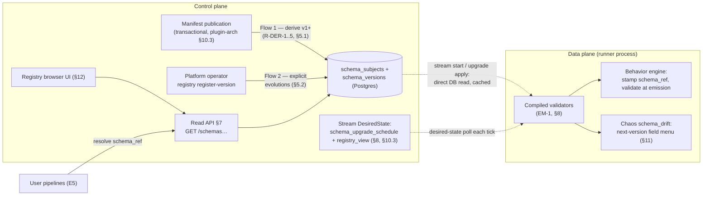
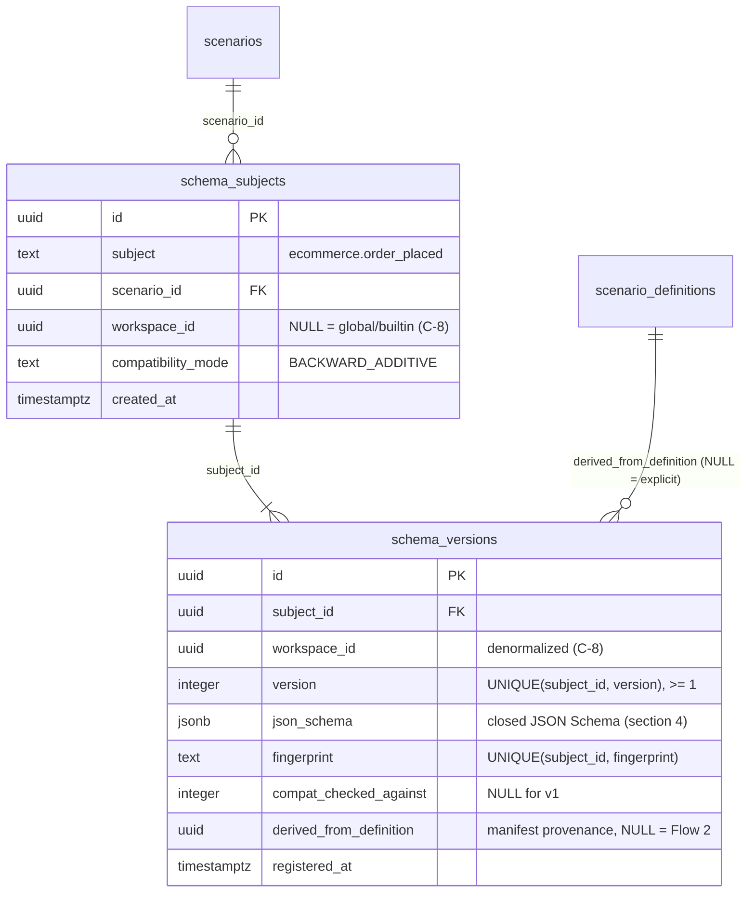
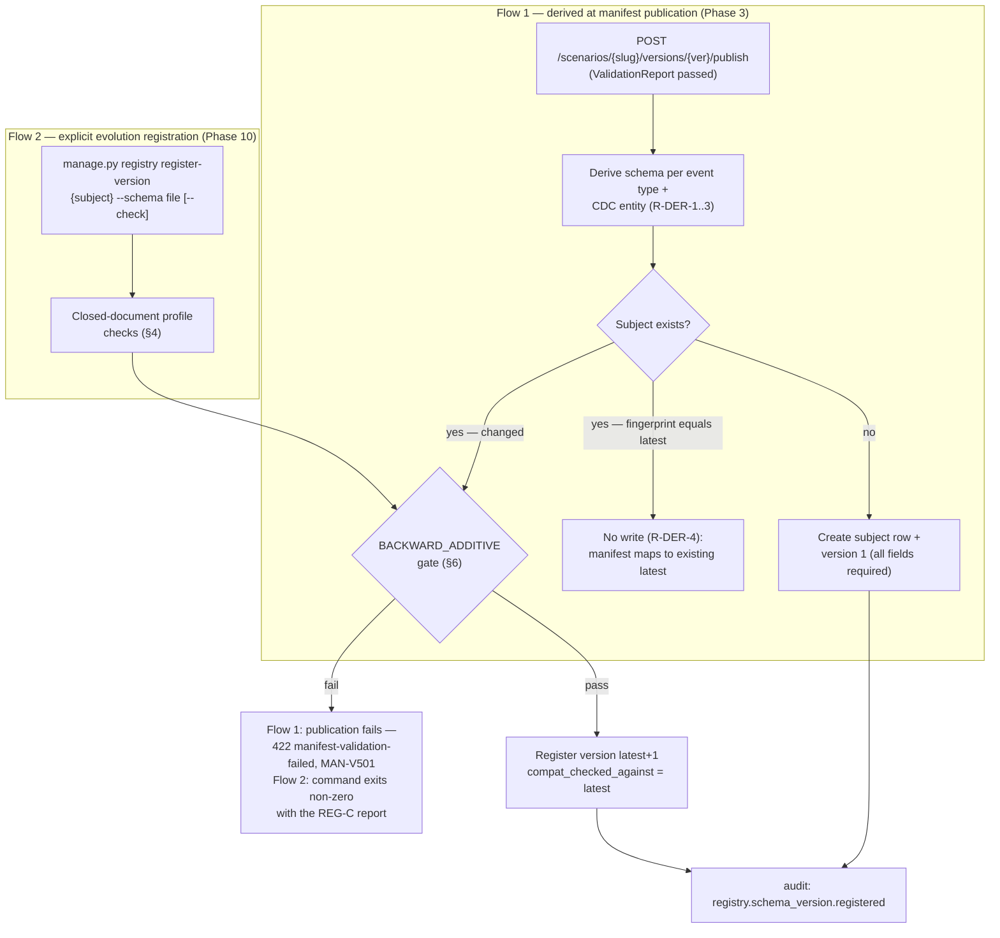
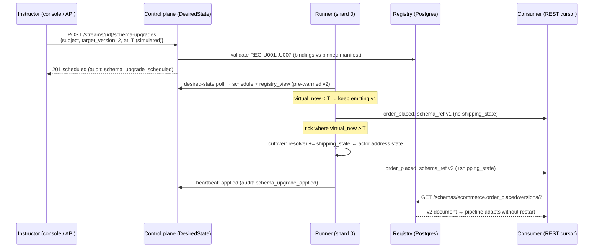

# DataForge — Schema Registry

**Deliverable:** D9

This document is the full design of DataForge's in-house schema registry (ADR-0010): the Postgres data model for subjects and versions (mirroring [../03-domain/database-schema.md](../03-domain/database-schema.md) §4.4–4.5 exactly), the Confluent-compatible subject naming fixed now so Phase 12 mirroring is mechanical, the two registration flows (automatic derivation at manifest publication, explicit registration of curated evolution versions), the exact `BACKWARD_ADDITIVE` compatibility algorithm with rejection codes and error shapes, the read API surface (owned at the wire level by [../05-interfaces/api-specification.md](../05-interfaces/api-specification.md) §4.12), the envelope-stamping and emission-validation contract, per-stream schema-version pinning and the scheduled mid-stream upgrade ("evolve to v2 at simulated time T"), the drift-mode linkage rule, the registry browser UI requirements, and the Confluent Schema Registry mirroring path. Terminology follows [../03-domain/domain-model.md](../03-domain/domain-model.md) (Schema Registry context §2.4, invariants INV-REG-1…5); the envelope field this registry resolves (`schema_ref`, field 9) is frozen in [../03-domain/event-model.md](../03-domain/event-model.md) §2.1; derivation inputs come from [scenario-plugin-architecture.md](scenario-plugin-architecture.md) §5.2 (R-DER-1…5); ADRs are indexed in [../adr/README.md](../adr/README.md).

---

## 1. Position in the system

The registry is the **versioned payload-schema authority** (domain model §2.4). It answers exactly one question on every surface: *given a `schema_ref {subject, version}`, what JSON Schema does this event's `payload` conform to?* — and it enforces that the answer can only evolve additively.

| Aspect | Decision (binding) |
|---|---|
| Implementation | In-house: Postgres tables + JSON Schema documents, served by the `registry` Django app (ADR-0010). Confluent Schema Registry is **not deployed** in MVP. |
| Schema language | JSON Schema draft 2020-12, closed-document profile (§4) |
| Subject naming | `{scenario_slug}.{event_type}` business / `{scenario_slug}.cdc.{entity_type}` CDC — Confluent-compatible, fixed at Phase 0 (§2, INV-REG-1) |
| Versioning | Monotonic integers per subject, starting at 1, server-assigned, gapless, immutable once registered (INV-REG-2) |
| Compatibility | `BACKWARD_ADDITIVE`, enforced at registration; the only mode in MVP (§6, INV-REG-3) |
| Writers | Two flows only: derivation inside the manifest-publish transaction (§5.1) and the explicit evolution-registration command (§5.2). There is **no schema-registration endpoint in `/api/v1`** (api-specification §4.12). |
| Readers | Console/API clients (read API §7), runners (direct DB read + process-local validator cache, §8), the chaos drift stage (next-version field menu, §11), the registry browser UI (§12) |
| Phases | Registry app, derivation, compat enforcement, read API: **Phase 3**. Drift linkage consumed: **Phase 9**. v2/v3 evolutions, pin surface, mid-stream upgrade, diff API, browser UI: **Phase 10**. Quota machinery for registration caps: **Phase 11**. Confluent mirroring: **Phase 12+** (§13). |



The registry is control-plane data with a data-plane read path: runners never call the HTTP API — they read Postgres directly at stream start and at upgrade application, then serve from an immutable process-local cache (EM-1), so registry availability is never on the per-event hot path.

---

## 2. Subject naming

### 2.1 Grammar (frozen, INV-REG-1)

```
subject       := scenario_slug "." event_type
scenario_slug := [a-z][a-z0-9_]*          (≤ 32 chars — envelope field 6)
event_type    := [a-z][a-z0-9_]*          (≤ 64 chars, business events — envelope field 8)
               | "cdc." entity_type        (CDC row-image subjects, one per CDC-enabled entity)
entity_type   := [a-z][a-z0-9_]*          (≤ 32 chars)
```

The structural check is the database CHECK constraint `subject ~ '^[a-z][a-z0-9_]*(\.cdc)?\.[a-z][a-z0-9_]*$'` ([../03-domain/database-schema.md](../03-domain/database-schema.md) §4.4); the length caps are enforced by the manifest grammar before any subject is created (scenario slug pattern `^[a-z][a-z0-9_]{0,31}$`, database-schema §4.1; event-type pattern `^[a-z][a-z0-9_]{0,63}$`, R-EVT-1). Maximum subject length: 97 characters. The first dot always separates scenario from event type; the only other permitted dot is the `cdc.` prefix — collision with a business event named `cdc` is structurally impossible (R-EVT-1 admits no dot in business event-type names; R-DER-5 keeps a defensive check, MAN-V502).

| Example subject | Kind | Schema content |
|---|---|---|
| `ecommerce.order_placed` | Business event | The event payload document |
| `ecommerce.session_started` | Business event | 〃 |
| `ecommerce.cdc.users` | CDC entity | The **row image** placed in `before`/`after` (the Debezium frame around it is the frozen envelope contract, event-model §4.1–4.2, not a registry concern) |

### 2.2 Why this is Confluent-compatible, and why it is fixed now

Confluent Schema Registry accepts any non-empty string as a subject; its conventional strategies are `TopicNameStrategy` (`{topic}-value`) and `RecordNameStrategy` (the fully-qualified record name). The DataForge grammar is a valid Confluent subject string verbatim, a valid record name (lowercase, dot-separated, no reserved characters), and far below every Confluent length limit. Fixing the grammar at Phase 0 means Phase 12 mirroring (§13) is a pure data copy — no renaming layer, no client-visible migration. Changing subject names after external consumers exist would break every `schema_ref` ever delivered; this is the one-way door ADR-0010 closes.

### 2.3 Uniqueness and tenancy scope

Subject ownership is **hybrid**, mirroring the scenario that derived it (database-schema C-8, INV-CAT-6):

| Scenario visibility | Subject ownership | Uniqueness enforcement |
|---|---|---|
| `global` (platform-curated, e.g. `ecommerce`) | `workspace_id IS NULL` on the subject row | `schema_subjects_global_uq` — unique on `(subject)` where `workspace_id IS NULL` |
| `workspace` (tenant-owned, the AI-manifest seam) | `workspace_id` set (INV-TEN-1 applies) | `schema_subjects_ws_uq` — unique on `(workspace_id, subject)` |

A name can never be ambiguous within one workspace's view: the scenario catalog forbids a workspace scenario slug that collides with a global slug (app-validated at scenario creation — database-schema §4.1 slug-resolution rule), so the two namespaces are disjoint at resolution time. Global subjects are readable by **any authenticated principal**; workspace subjects are tenant-scoped with 404 masking outside their workspace (W-3 policy, api-specification §2.3). At Phase 12 mirroring, workspace subjects are prefixed per §13.1.

---

## 3. Postgres data model

The registry owns two tables in the `registry` app. The DDL below is **identical** to [../03-domain/database-schema.md](../03-domain/database-schema.md) §4.4–4.5, which is the single owner of DDL text, trigger definitions, and RLS policy statements; this section is the semantic contract on those tables. They are small control-plane tables — no partitioning, no time-based retention (database-schema §8.1: control-plane tables are retained indefinitely with soft-delete tombstones).

### 3.1 ER diagram



### 3.2 Table contracts

**`schema_subjects`** — one row per subject (domain-model aggregate root **Subject**).

| Column | Type | Constraint | Semantics |
|---|---|---|---|
| `id` | uuid | PK | |
| `subject` | text | NOT NULL; CHECK against the §2.1 structural regex | The full subject name |
| `scenario_id` | uuid | NOT NULL; FK → `scenarios` | The scenario whose manifest derived this subject |
| `workspace_id` | uuid | NULL allowed (C-8) | `NULL` ⇔ global/builtin subject; non-null rows are tenant-owned and RLS-scoped |
| `compatibility_mode` | text | NOT NULL DEFAULT `'BACKWARD_ADDITIVE'`; CHECK `= 'BACKWARD_ADDITIVE'` | Single-value enum in MVP (domain model §2.4 CompatibilityMode); the column exists so a future mode lands as data + a widened CHECK, not a redesign (§13.3) |
| `created_at` | timestamptz | NOT NULL DEFAULT now() | |

Uniqueness: `schema_subjects_global_uq` on `(subject) WHERE workspace_id IS NULL` and `schema_subjects_ws_uq` on `(workspace_id, subject) WHERE workspace_id IS NOT NULL` (§2.3).

**`schema_versions`** — one row per immutable version (domain-model entity **SchemaVersion**).

| Column | Type | Constraint | Semantics |
|---|---|---|---|
| `id` | uuid | PK | |
| `subject_id` | uuid | NOT NULL; FK → `schema_subjects` | |
| `workspace_id` | uuid | NULL allowed | Denormalized from the subject (C-8) for O(1) RLS evaluation |
| `version` | integer | NOT NULL; CHECK `>= 1`; UNIQUE `(subject_id, version)` | Server-assigned, always `latest + 1`, gapless per subject (INV-REG-2). Clients and operators never choose it. |
| `json_schema` | jsonb | NOT NULL | The closed-profile JSON Schema document (§4), stored with annotations |
| `fingerprint` | text | NOT NULL; UNIQUE `(subject_id, fingerprint)` | SHA-256 (lowercase hex) of the RFC 8785 (JCS) canonicalization of the document's **comparison form** (§6.1). Because annotations are excluded, fingerprint equality ⇔ "no schema change" — this constraint is what makes Flow 1 no-change detection (R-DER-4) and Flow 2 idempotency a database guarantee. |
| `compat_checked_against` | integer | NULL | The version the `BACKWARD_ADDITIVE` gate ran against at registration (INV-REG-3): `NULL` for version 1, `N−1` for version `N`. Provenance for audits and the diff API. |
| `derived_from_definition` | uuid | NULL; FK → `scenario_definitions` | Manifest provenance (R-DER-4): set ⇔ Flow 1 (the manifest version whose publication registered this schema version); `NULL` ⇔ Flow 2 explicit registration. Surfaced as `manifest_version` on the read API (§7). |
| `registered_at` | timestamptz | NOT NULL DEFAULT now() | |

### 3.3 Concurrency, immutability, isolation

| Mechanism | Contract |
|---|---|
| Race-free version assignment | Registration and the compatibility check run in **one transaction with the subject row locked** (`SELECT … FOR UPDATE` on `schema_subjects`), so `latest + 1` cannot be assigned twice (database-schema §4.5). |
| Immutability | No application update path exists for `schema_versions` rows, and a `BEFORE UPDATE OR DELETE` row trigger rejects any mutation — the same trigger pattern as published `scenario_definitions` (database-schema §4.2). The `dataforge_app` role's grants exclude registry immutables from UPDATE/DELETE (database-schema §9.1). |
| Deletion | Schema versions are never deleted, even when a scenario is deprecated: streams, ledger rows, buffer rows, and answer keys reference `schema_ref` values indefinitely (PIN-5 of plugin-arch §11.2). Workspace deletion (INV-TEN-6) tombstones the workspace's scenarios; its subject rows are retained so historical `schema_ref` values in retained audit data remain resolvable to platform operators. |
| RLS | Global rows (`workspace_id IS NULL`) are readable by every authenticated role — the Class H hybrid pattern of database-schema §9.5, required because builtin subjects must resolve for every workspace's envelopes (INV-REG-4). Non-null rows carry the standard workspace policy (ADR-0002). |
| Where stream pins live | Not in registry tables: `streams.schema_version_pins` (jsonb `{subject: version}`, default `'{}'`) and `streams.schema_upgrade_schedule` (jsonb) on the stream row, per database-schema §5.1 — semantics in §10. |

### 3.4 Resolving "which version does a manifest produce?"

There is no materialized manifest→version map; it is derivable, and the derivation rule is normative:

> For subject `S` and manifest version `M` of its scenario: the schema version in force *at M's publication* is the highest `version` of `S` whose `registered_at` ≤ M's `published_at`. Because R-DER-4 registers a new version only when the derived schema changed, and Flow 1 runs inside the publish transaction, this is exactly "the latest version as of that publish".

Streams do not use this rule at runtime — they pin explicit versions or "latest at first start" (§10.1) — it exists for provenance queries and the seed/backfill tooling.

---

## 4. Schema document contract

Every stored schema — derived or explicit — conforms to the **closed-document profile**. The profile is what makes chaos detectable (a `corrupted_values`/`nulls`/`schema_drift` artifact must *fail* validation against the stamped version), drift value synthesis total (chaos-engine §5.5), and codegen deterministic.

| # | Rule |
|---|---|
| SD-1 | Top level: `"type": "object"`, `"additionalProperties": false`, a `properties` object, and a `required` array. No composition keywords anywhere (`allOf`/`anyOf`/`oneOf`/`if`/`$ref` are rejected — REG-C005). |
| SD-2 | Property names match `^[a-z][a-z0-9_]{0,63}$`; the `_df` prefix is reserved at every nesting level (event-model SB-1; double-checked at manifest level by MAN-V109) — REG-C009. |
| SD-3 | Property fragments use only the derived-type vocabulary of R-DER-2 ([scenario-plugin-architecture.md](scenario-plugin-architecture.md) §5.2): `{"type":"string"}` (optionally with `format: "date-time"` or a `pattern`), `{"type":"integer"}`, `{"type":"number"}`, `{"type":"boolean"}`, `{"enum":[…]}`, `{"const": …}`, decimal strings `{"type":"string","pattern":"^-?\\d+\\.\\d{1,4}$"}` (S-6: money is a decimal string), entity-key strings `{"type":"string","pattern":"^{key_prefix}_[0-9a-f]{16}$"}`, closed objects, and arrays of closed objects. Nullability is expressed as `"type": ["…","null"]`. Fragments outside this vocabulary are rejected (REG-C006) so drift value synthesis and the generated TypeScript client stay total over every registered schema. |
| SD-4 | Nesting depth ≤ 4 (objects/arrays); total properties across all levels ≤ 64 (B-12); worst-case instance size ≤ 64 KiB (B-12); serialized schema document ≤ 128 KiB — REG-C010. |
| SD-5 | Annotation keys are permitted anywhere and **excluded from comparison form, fingerprinting, and change detection** (§6.1): the standard annotations `$schema`, `$id`, `title`, `description`, `$comment`, `examples`, plus the platform annotation `x-df-binding` (§5.3). Normative header for stored documents: `$schema = "https://json-schema.org/draft/2020-12/schema"`, `$id = "https://docs.dataforge.dev/schemas/{subject}/versions/{version}.json"`, `title = "{subject} v{version}"`. |
| SD-6 | Documents are stored as parsed jsonb; canonical bytes for hashing are produced by RFC 8785 (JCS) over the comparison form (sorted keys, no insignificant whitespace, UTF-8). `fingerprint` is computed over that form (§3.2). |

### 4.1 The required-set rule (normative)

R-DER-3 fixes the closed shape and the **version-1** rule: in the first registered version of a subject, every property is in `required`. This document owns how `required` evolves — the compatibility-critical half of the contract:

> **REQ-RULE:** For every version `N ≥ 2`, `required(N) = required(N−1)`, exactly. Properties added in version `N` enter `properties` but never `required` — at any later version.

Consequences, all deliberate:

- A version-`N` validator accepts every document produced under versions `1..N` — the operational meaning of `BACKWARD_ADDITIVE` ("a new version may only add optional fields", domain model §2.4).
- A version-`N` validator **rejects** documents carrying version-`N+1` fields (`additionalProperties: false`) — which is exactly how `schema_drift` chaos violates the stamped schema (event-model §6) and how a consumer detects an upgrade it has not adopted.
- Generators still emit every field their effective version declares (added fields are optional in the *schema*, not in *emission* — EM-2): optionality exists purely so older data remains valid under newer schemas; data completeness is unaffected.

---

## 5. Registration flows

There are exactly two writers. Both end in the same compatibility gate (§6), the same `SELECT … FOR UPDATE` registration transaction (§3.3), and the same audit entry `registry.schema_version.registered` (one per registered version, transactional with the write — INV-AUD-2; the minimum audited action set in domain model §2.10 names schema-version registration explicitly).



### 5.1 Flow 1 — derivation at manifest publication (Phase 3)

Runs **inside the manifest-publish transaction** (plugin-arch §10.3; endpoint `POST /scenarios/{scenario_slug}/versions/{manifest_version}/publish`, api-specification §4.6): either the manifest version becomes `published` *and* every registry write commits, or neither. Algorithm, per manifest version `M` of scenario `S`:

1. Compute the derived schema for every business event type (subject `S.{event_type}`) and every CDC-enabled entity (subject `S.cdc.{entity_type}`; row image = all declared attributes + `key_attribute` + auto `created_at`/`updated_at` — R-DER-1), applying the R-DER-2 type mapping — including its effect-write rule: a `choice.*` attribute that any `create`/`update` effect `set` (or `cdc.background_mutations` `set`) targets derives the options' base scalar type, not an enum, and MAN-V407 has already type-checked every effect-written value against the derived fragment, so emission validation (EM-2) can never fail on an effect-mutated attribute. Derivation is deterministic: same canonical manifest ⇒ byte-identical comparison forms (golden-tested, [../06-quality/testing-strategy.md](../06-quality/testing-strategy.md)).
2. For each derived subject:
   - **Subject absent** → create the subject row (ownership per §2.3) and register version 1 with every property required (R-DER-3), `derived_from_definition = M`, `compat_checked_against = NULL`.
   - **Subject exists, candidate fingerprint = latest fingerprint** → register nothing (R-DER-4); the manifest simply emits at the existing latest version.
   - **Subject exists, changed** → apply REQ-RULE (properties present in the latest version keep their fragment and required status; new properties enter optional, each annotated with `x-df-binding` copied verbatim from its manifest payload declaration — §5.3), then run the §6 gate against the latest version. Pass → register `latest + 1` with `derived_from_definition = M`. Fail → the **manifest publication** fails: `422` `manifest-validation-failed` whose ValidationReport carries one MAN-V501 error per REG-C violation (§6.3) — errors surface at the manifest, not the registry, exactly as R-DER-4 prescribes.
3. Builtin scenarios reach this flow through the Phase 3 seed command that registers the repo YAML manifest (plugin-arch §10.2); tenant scenarios reach it through the manifest API. **Subjects come into existence only through this flow** — an event type must be declared in a published manifest for its events to exist at all, so Flow 2 can never create subjects (REG-C011).

Manifest semver interaction (plugin-arch §9.2): patch versions change no behavioral sections and derive nothing new; minor versions may add payload fields and thereby register next schema versions; a manifest change that would *remove or retype* a payload field is non-additive and fails publication via this gate (MAN-V501). This is also the **self-service evolution path for workspace scenarios**: a tenant evolves its payload schemas by publishing a manifest minor version — no operator involvement, no Flow 2.

### 5.2 Flow 2 — explicit registration of evolution versions (Phase 10)

The curated-evolution path for **platform-owned (global) scenarios**: registering a next payload-schema version that no published manifest derives, so the pinned manifest stays untouched, running v1-pinned streams can adopt the new version mid-stream through bindings alone (§10), and drift mode gains injectable fields (§11). This is how the e-commerce v2/v3 teaching evolutions ship.

| Aspect | Contract |
|---|---|
| Surface | `python manage.py registry register-version <subject> --schema <path> [--check] [--expected-latest <N>]` — a control-plane management command. There is deliberately **no `/api/v1` write endpoint** (api-specification §4.12: "writes happen only through manifest publication; there is no direct schema-registration endpoint in v1") and no console form (§12). |
| Authorization | Platform operators only (deploy/SSH access — the same trust class as the builtin-manifest seed command, plugin-arch §10.2). Workspace-scenario subjects are **not** registrable via Flow 2 at all: tenant evolutions go through manifest minor versions (§5.1), which carry the full manifest validation pipeline. |
| Input | A complete §4-profile JSON Schema document for the next version, versioned in the repo as a fixture (path convention owned by [../07-plan/project-folder-structure.md](../07-plan/project-folder-structure.md)); applied per environment by the Phase 10 seed/migration step. |
| Bindings | Every property added relative to the latest version MUST carry an `x-df-binding` annotation (§5.3) — a manifest valueSource (R-EVT-2): `{"from": "<contextPath>"}`, `{"const": <scalar>}`, or `{"generated": {"generator": …, "params": …}}` from the closed generator vocabulary; `hook.*` generators are forbidden in bindings. Bindings are validated at registration against the **latest published manifest version** of the scenario: every `from` path must resolve in the binding context (R-EVT-3) of every transition that emits the event type; `generated` specs must pass the per-generator param catalogs (plugin-arch §4). Failure → REG-C007. They are re-validated per stream at upgrade scheduling (REG-U005, §10.3). |
| CDC subjects | Rejected (REG-C012). A CDC row image is by definition the set of declared entity attributes; a field the manifest does not declare cannot have a truthful pool value, and CDC images must equal pool state (INV-GEN-6). CDC schemas evolve only through manifest minor versions (Flow 1). |
| Concurrency | `--expected-latest N` must equal the current latest when supplied; mismatch → REG-C008 (the gate transaction's `FOR UPDATE` lock makes the unsupplied case race-free anyway). |
| Idempotency | If the candidate's fingerprint equals the **latest** version's, the command exits 0 reporting the existing version — no write, no audit entry (Confluent-equivalent behavior, and what makes the seed step re-runnable). Equality with an *older* version is not idempotent; it fails the gate like any other regression (you cannot re-register v1 on top of v2). |
| `--check` | Dry-run: runs §4 + §6 and prints the report without writing — the CI gate for evolution fixtures. |
| Caps | ≤ 250 subjects per scenario including `cdc.*` (B-05); ≤ 100 versions per subject lifetime — decided defaults, enforced from Phase 10 as static checks; **refined in Phase 11** when they join the plan-tier quota machinery ([../06-quality/security-architecture.md](../06-quality/security-architecture.md) owns the quota stack; the values here are the decided bounds). |
| Effect on running streams | None, by itself: registering a version never changes any stream's emission (INV-STR-5). It *arms* two things — drift mode now has injectable fields (§11), and mid-stream upgrades to that version become schedulable (§10). |

### 5.3 The `x-df-binding` annotation and the computed added-fields diff

`x-df-binding` is a per-property annotation (SD-5) present on **every property introduced at version ≥ 2**, in both flows — Flow 1 copies the manifest payload declaration verbatim; Flow 2 requires it explicitly:

```json
"shipping_state": {
  "type": "string",
  "x-df-binding": { "from": "actor.address.state" }
}
```

It is what lets a runner whose pinned manifest predates the field populate it after a mid-stream upgrade (§10.4): `from` paths resolve against the same emission binding context the manifest's own fields use (R-EVT-3); `generated` bindings draw from the stream's `values` sub-seed (deterministic, INV-GEN-3). As an annotation it is excluded from comparison form and fingerprint (§6.1), ignored by standard JSON Schema validators, served verbatim on the read API, and stripped only at Confluent mirroring (§13.2). It is a schema *keyword*, not a property name, so the `_df` property-prefix reservation (SB-1) is untouched.

**Added-fields diff — computed, never stored.** `added(N) = properties(N) ∖ properties(N−1)` (recursively, including fields added inside existing nested objects), each entry carrying `{path, fragment, binding}`. Under `BACKWARD_ADDITIVE` this diff is complete (nothing is ever removed or changed), cheap (closed documents ≤ 128 KiB), and pure — so it is derived on demand by its three consumers: the diff API (§7), the upgrade resolver extension (§10.4), and the drift field menu (§11). No diff column exists in `schema_versions` (§3.2 is exhaustive).

---

## 6. Compatibility enforcement — `BACKWARD_ADDITIVE`

### 6.1 Comparison form

Both schemas (latest `L`, candidate `C`) are reduced to comparison form before checking: strip annotation keys (SD-5, including `x-df-binding`) at every level, then canonicalize (RFC 8785). "Identical", fingerprints (§3.2), and all checks below operate on comparison forms — a `description`- or binding-only change is *no change* (it neither registers a new version in Flow 1 nor breaks idempotency in Flow 2).

### 6.2 The algorithm (normative)

Registration of `C` against latest `L` is accepted iff **all** checks pass; each failure produces one error object `{code, path, message}` (path = JSON Pointer into `C`). Checks run in order but all violations are collected and reported together.

| Code | Reject when… | Message template |
|---|---|---|
| REG-C001 | A property of `L` is absent from `C` (field removal) | `field '{name}' removed; BACKWARD_ADDITIVE permits additions only` |
| REG-C002 | A property common to `L` and `C` has a different comparison-form fragment (retype, pattern change, enum narrowing *or widening*, nullability change — any difference) | `field '{name}' changed from {old} to {new}; existing fields are frozen` |
| REG-C003 | `required(C) ≠ required(L)` as sets (a new field marked required, or an existing required field dropped) | `required set changed; new fields must be optional and existing required fields stay required (REQ-RULE)` |
| REG-C004 | `additionalProperties` is not exactly `false` at the top level or in any nested object of `C` | `document must remain closed (additionalProperties: false)` |
| REG-C005 | `C` violates SD-1 top-level shape (composition keywords, missing `properties`/`required`, non-object type) | `schema must be a closed object document` |
| REG-C006 | An added property's fragment is outside the SD-3 vocabulary | `field '{name}' uses an unsupported schema construct` |
| REG-C007 | An added property lacks `x-df-binding`, or its binding fails valueSource validation against the latest published manifest (§5.2/§5.3) | `binding for '{name}' is missing or does not resolve in the emitting context` |
| REG-C008 | Flow 2: `--expected-latest` supplied and ≠ actual latest | `subject is at version {actual}; re-fetch and retry` |
| REG-C009 | An added property name violates SD-2 (pattern or reserved `_df` prefix) | `field name '{name}' is invalid or reserved` |
| REG-C010 | SD-4 size/depth bounds exceeded (incl. worst-case instance > 64 KiB, B-12) | `schema exceeds size bounds` |
| REG-C011 | Flow 2: subject does not exist (subjects are created only by manifest publication, §5.1) | `unknown subject; subjects are created by publishing a manifest` |
| REG-C012 | Flow 2: subject is a `cdc.*` subject (§5.2) | `CDC row-image schemas evolve only through manifest versions` |

Nested objects and array-item objects are compared recursively under the same rules: a field added *inside* an existing nested object is an addition (optional; REG-C003 applies to the nested `required` array identically); any other nested difference is REG-C002.

On Flow 1, checks C004–C006/C009/C010 are pre-empted by manifest validation (derivation cannot produce an ill-formed document from a valid manifest; MAN-V109 and B-12 run earlier), so the live Flow 1 failures are C001/C002/C003 — a manifest minor version that removes or retypes a payload field.

### 6.3 Error surfacing (both flows, one shape)

The error object `{code, path, message}` is identical everywhere; what differs is the carrier.

**Flow 1** — manifest publication fails with the standard problem type (catalog owned by api-specification §2.7), one `MAN-V501` entry per REG-C violation, `scope: "schema"`:

```
HTTP/1.1 422 Unprocessable Content
Content-Type: application/problem+json
```
```json
{
  "type": "https://docs.dataforge.dev/problems/manifest-validation-failed",
  "title": "Manifest validation failed",
  "status": 422,
  "detail": "derived schema for ecommerce.order_placed is not BACKWARD_ADDITIVE-compatible with version 2",
  "errors": [
    { "code": "MAN-V501", "scope": "schema",
      "path": "ecommerce.order_placed#/properties/shipping_state",
      "message": "REG-C001: field 'shipping_state' removed; BACKWARD_ADDITIVE permits additions only" },
    { "code": "MAN-V501", "scope": "schema",
      "path": "ecommerce.order_placed#/required",
      "message": "REG-C003: required set changed; new fields must be optional and existing required fields stay required (REQ-RULE)" }
  ],
  "request_id": "9f3a1c2e-…"
}
```

**Flow 2** — the command exits non-zero and prints the same objects as a JSON report:

```json
{
  "subject": "ecommerce.order_placed",
  "latest_version": 2,
  "compatible": false,
  "errors": [
    { "code": "REG-C001", "path": "/properties/shipping_state",
      "message": "field 'shipping_state' removed; BACKWARD_ADDITIVE permits additions only" }
  ]
}
```

No registry-specific HTTP problem type exists: the two write surfaces are the manifest API (whose problem types api-specification §2.7 already catalogs) and a CLI. Upgrade-scheduling violations use the `conflict` problem type (§10.3).

### 6.4 Worked rejections (normative examples)

Against `ecommerce.order_placed` v1 (§9.2):

| Candidate change | Verdict | Code |
|---|---|---|
| Add optional `shipping_state: {"type":"string"}` with a resolvable binding | **Accepted** → v2 | — |
| Add `shipping_state` and list it in `required` | Rejected | REG-C003 |
| Add `shipping_state` without `x-df-binding` | Rejected | REG-C007 |
| Drop `shipping_fee` | Rejected | REG-C001 |
| Change `items[].quantity` from `integer` to `string` | Rejected | REG-C002 (nested) |
| Change `currency` from `{"const":"USD"}` to `{"enum":["USD","EUR"]}` | Rejected | REG-C002 — enum widening is still a fragment change; a multi-currency scenario is a new manifest version, not a schema edit |
| Set top-level `additionalProperties: true` | Rejected | REG-C004 |
| Add `_df_grade: {"type":"string"}` | Rejected | REG-C009 |
| Register against `ecommerce.cdc.users` | Rejected | REG-C012 |

---

## 7. Read API surface

[../05-interfaces/api-specification.md](../05-interfaces/api-specification.md) §4.12 is the single owner of paths, wire shapes, problem types, pagination, and the OpenAPI artifact (ADR-0014); this section fixes the resource semantics those endpoints expose. Authorization: console JWT (any workspace member) or API key with the `schemas:read` scope (A-4); global-scenario subjects are readable by any authenticated principal, workspace-scenario subjects only within their workspace (404 `not-found` masking outside it, W-3). Key-authenticated calls draw from the `data-events` rate bucket (600/min, burst 100).

| # | Method + path | Phase | Purpose | Success | Errors |
|---|---|---|---|---|---|
| 62 | `GET /api/v1/schemas?scenario_slug=…&cursor=…&limit=…` | 3 | List subjects visible to the caller | 200 `{data: [subject summaries], next_cursor}` | — |
| 63 | `GET /api/v1/schemas/{subject}` | 3 | Subject detail: the summary plus `created_at` and per-version provenance | 200 | 404 `not-found` |
| 64 | `GET /api/v1/schemas/{subject}/versions` | 3 | Version history, paginated | 200 `{data, next_cursor}` | 404 |
| 65 | `GET /api/v1/schemas/{subject}/versions/{version}` | 3 | One version's full record including the schema document; `{version}` is an integer or the literal `latest` | 200 | 404 |
| 66 | `GET /api/v1/schemas/{subject}/diff?from={a}&to={b}` | 10 | Structured additive diff between two versions | 200 | 404 if either version absent; 400 `validation-error` if `from ≥ to` |

Subject names contain dots and are used verbatim as path segments. Subject summary (#62), matching api-specification §4.12:

```json
{
  "data": [
    {
      "subject": "ecommerce.order_placed",
      "scenario_slug": "ecommerce",
      "compatibility": "BACKWARD_ADDITIVE",
      "latest_version": 3,
      "versions": [1, 2, 3]
    },
    {
      "subject": "ecommerce.cdc.users",
      "scenario_slug": "ecommerce",
      "compatibility": "BACKWARD_ADDITIVE",
      "latest_version": 1,
      "versions": [1]
    }
  ],
  "next_cursor": null
}
```

Version list (#64) — `manifest_version` is the Flow 1 provenance (`derived_from_definition` joined to `scenario_definitions.version`), `null` for Flow 2 versions:

```json
{
  "data": [
    { "version": 1, "registered_at": "2026-03-02T00:00:00.000000Z", "manifest_version": "1.0.0" },
    { "version": 2, "registered_at": "2026-08-03T10:15:00.000000Z", "manifest_version": null },
    { "version": 3, "registered_at": "2026-08-03T10:16:00.000000Z", "manifest_version": null }
  ],
  "next_cursor": null
}
```

Version resource (#65) — what consumer pipelines fetch to resolve a `schema_ref` (exercise E5); the `schema` member is the stored document verbatim (annotations included):

```json
{
  "subject": "ecommerce.order_placed",
  "version": 2,
  "manifest_version": null,
  "registered_at": "2026-08-03T10:15:00.000000Z",
  "schema": { "…": "full JSON Schema document — §9.3" }
}
```

Diff (#66) — shape fixed by api-specification §4.12; under `BACKWARD_ADDITIVE`, `removed_fields`/`changed_fields` are empty by construction (INV-REG-3) and exist in the shape so the contract survives a future compatibility-mode addition without breaking (V-2). Multi-step ranges aggregate the computed per-version diffs (§5.3):

```json
{
  "subject": "ecommerce.order_placed",
  "from_version": 1,
  "to_version": 3,
  "added_fields": [
    { "path": "/properties/shipping_state", "type": "string", "required": false },
    { "path": "/properties/shipping_city",  "type": "string", "required": false }
  ],
  "removed_fields": [],
  "changed_fields": []
}
```

`type` mirrors the added fragment's `type` keyword (array form for nullable fields; `enum`/`const` fragments report their underlying primitive type — the full fragment is in the version document). These `added_fields` are also exactly the fields `schema_drift` may inject (INV-REG-5) — E5 consumers read this endpoint to adapt.

---

## 8. Envelope stamping and emission validation

### 8.1 The `schema_ref` contract

Every envelope carries `schema_ref = {"subject": "<subject>", "version": <int>}` (event-model §2.1 field 9); the string form `subject:version` (`ecommerce.order_placed:2`) appears in logs and docs, never on the wire. Resolution rule, frozen:

```
subject = "{scenario_slug}.{event_type}"          (event_type already carries the cdc. prefix for CDC events)
version = effective_version(stream, subject)       (§10.2)
```

INV-REG-4: the stamped `(subject, version)` must exist in the registry at emission time. There is no "stamp latest" at emission — every event names an exact immutable version, which is what makes a delivered event self-describing forever.

### 8.2 Runner loading, the `registry_view`, and validation

| # | Rule |
|---|---|
| EM-1 | At stream start (T3) and at each upgrade application (§10.4), the runner loads the stream's effective schema set via **direct Postgres read** and compiles each document into a process-local validator. Compiled validators are cached per `(subject, version)` — immutable, shared across shards and streams in the process (the same pattern as the ManifestIR cache, plugin-arch §10.3). Runners never call the HTTP read API. |
| EM-2 | Every **canonical** event is validated against its stamped schema before the ledger write (pre-ledger, pre-chaos). The generator emits *all* properties its effective version declares — including post-v1 optional fields (§4.1): optionality is a schema property, not an emission option. |
| EM-3 | A canonical validation failure is a **fatal generation defect**, never delivered: derivation and emission are driven by the same manifest, so a mismatch is a platform bug. The shard halts and the stream transitions per T11 (`failed`, `status_reason = "error"`); the diagnostic (subject, version, JSON Pointer) surfaces through Observation. Failing fast is correct in a deterministic system — the same input would fail identically forever (INV-GEN-3). |
| EM-4 | **Post-ledger chaos artifacts are exempt from re-validation.** `corrupted_values`, `nulls`, and `schema_drift` artifacts *deliberately* violate the stamped schema (event-model §6); validating them would veto the product's differentiator. The chaos stage never alters `schema_ref` (chaos-engine §2 "may never" column) — the stamped version always describes the *canonical* content. |
| EM-5 | **`registry_view`:** the control plane embeds, in each stream's desired-state document, a per-business-subject snapshot `{effective_version, next_version, next_added_fields: [{path, fragment}]}` refreshed on every desired-state poll. It is how the chaos drift stage gets its field menu (chaos-engine §5.5 names this snapshot) and how upgrade targets are pre-warmed (§10.4) — the data plane never blocks on a registry query mid-tick. |
| EM-6 | Cost budget: compiled closed-document validation of a ≤ 64 KiB payload is bounded by SD-4's depth/property caps; the manifest dry run measures the full emission path including validation, and its `est_eps_per_shard ≥ 1,000` floor (MAN-D604) is the binding performance gate — a scenario whose schemas are too expensive to validate cannot publish. |

---

## 9. Worked example — the e-commerce v1/v2/v3 evolution

The Phase 10 teaching arc (PRD exercises E4/E5) on subject `ecommerce.order_placed`: `shipping_country` (v1) → add `shipping_state` (v2) → add `shipping_city` (v3). The evolution is deliberately chosen so that **every added field already exists in pool state** — the `users` entity's `address.full` object has carried `street`, `city`, `state`, `postal_code`, `country` since manifest 1.0.0 (R-DER-2; event-model §7.2 shows the row image) — which is what lets v1-pinned streams adopt v2/v3 mid-stream with pure bindings (§10.4), no manifest change. A manifest minor version adding the same payload fields would derive the identical versions through Flow 1 (R-DER-4); the curated exercise uses Flow 2 precisely so manifest 1.1.0 stays untouched and the upgrade is a registry-side event.

### 9.1 Registration timeline

| When | Action | Flow | Result |
|---|---|---|---|
| Phase 3 | Publish manifest `ecommerce 1.0.0` (subset) | Flow 1 (§5.1) | Subject created; **version 1**, `derived_from_definition` = 1.0.0, `compat_checked_against = null` |
| Phase 8 | Publish manifest `ecommerce 1.1.0` (full 8 entities) | Flow 1 | `order_placed` payload unchanged ⇒ fingerprint match ⇒ **no new version** (R-DER-4); streams pinned to 1.1.0 emit v1 |
| Phase 10 | `registry register-version ecommerce.order_placed --schema …v2.json` | Flow 2 (§5.2) | **Version 2**, `derived_from_definition = null`, `compat_checked_against = 1`, binding `{"from": "actor.address.state"}` |
| Phase 10 | Same with the v3 document | Flow 2 | **Version 3**, `compat_checked_against = 2`, binding `{"from": "actor.address.city"}` |

### 9.2 Version 1 (full document, normative)

```json
{
  "$schema": "https://json-schema.org/draft/2020-12/schema",
  "$id": "https://docs.dataforge.dev/schemas/ecommerce.order_placed/versions/1.json",
  "title": "ecommerce.order_placed v1",
  "description": "Derived from manifest ecommerce 1.0.0, event type order_placed.",
  "type": "object",
  "additionalProperties": false,
  "required": [
    "order_id", "user_id", "items", "currency",
    "subtotal", "shipping_fee", "total", "shipping_country"
  ],
  "properties": {
    "order_id":  { "type": "string", "pattern": "^ord_[0-9a-f]{16}$" },
    "user_id":   { "type": "string", "pattern": "^usr_[0-9a-f]{16}$" },
    "items": {
      "type": "array",
      "items": {
        "type": "object",
        "additionalProperties": false,
        "required": ["product_id", "quantity", "unit_price"],
        "properties": {
          "product_id": { "type": "string", "pattern": "^prd_[0-9a-f]{16}$" },
          "quantity":   { "type": "integer" },
          "unit_price": { "type": "string", "pattern": "^-?\\d+\\.\\d{1,4}$" }
        }
      }
    },
    "currency":         { "const": "USD" },
    "subtotal":         { "type": "string", "pattern": "^-?\\d+\\.\\d{1,4}$" },
    "shipping_fee":     { "type": "string", "pattern": "^-?\\d+\\.\\d{1,4}$" },
    "total":            { "type": "string", "pattern": "^-?\\d+\\.\\d{1,4}$" },
    "shipping_country": { "type": "string" }
  }
}
```

Field-by-field derivation provenance (R-DER-2): `order_id` from `created.orders.order_id` (key attribute → entity-key pattern, prefix `ord`); `user_id` from `actor.user_id`; `items` from `session.cart_items` (remembered list → array of the closed remembered-field object); `currency` from `const: "USD"`; `subtotal`/`shipping_fee`/`total` from `derived.expr(output: decimal)` → the decimal-string pattern (event-model S-6 — which is what lets `corrupted_values` chaos set `"abc"` without changing JSON type); `shipping_country` from `actor.address.country` (string-output generator → plain string). This is exactly the payload of the frozen envelope example in [../03-domain/event-model.md](../03-domain/event-model.md) §7.1.

### 9.3 Version 2 (full document)

```json
{
  "$schema": "https://json-schema.org/draft/2020-12/schema",
  "$id": "https://docs.dataforge.dev/schemas/ecommerce.order_placed/versions/2.json",
  "title": "ecommerce.order_placed v2",
  "description": "Adds optional shipping_state (REQ-RULE: required set unchanged). Registered explicitly in Phase 10.",
  "type": "object",
  "additionalProperties": false,
  "required": [
    "order_id", "user_id", "items", "currency",
    "subtotal", "shipping_fee", "total", "shipping_country"
  ],
  "properties": {
    "order_id":  { "type": "string", "pattern": "^ord_[0-9a-f]{16}$" },
    "user_id":   { "type": "string", "pattern": "^usr_[0-9a-f]{16}$" },
    "items": {
      "type": "array",
      "items": {
        "type": "object",
        "additionalProperties": false,
        "required": ["product_id", "quantity", "unit_price"],
        "properties": {
          "product_id": { "type": "string", "pattern": "^prd_[0-9a-f]{16}$" },
          "quantity":   { "type": "integer" },
          "unit_price": { "type": "string", "pattern": "^-?\\d+\\.\\d{1,4}$" }
        }
      }
    },
    "currency":         { "const": "USD" },
    "subtotal":         { "type": "string", "pattern": "^-?\\d+\\.\\d{1,4}$" },
    "shipping_fee":     { "type": "string", "pattern": "^-?\\d+\\.\\d{1,4}$" },
    "total":            { "type": "string", "pattern": "^-?\\d+\\.\\d{1,4}$" },
    "shipping_country": { "type": "string" },
    "shipping_state":   { "type": "string",
                          "x-df-binding": { "from": "actor.address.state" } }
  }
}
```

### 9.4 Version 3 (full document)

```json
{
  "$schema": "https://json-schema.org/draft/2020-12/schema",
  "$id": "https://docs.dataforge.dev/schemas/ecommerce.order_placed/versions/3.json",
  "title": "ecommerce.order_placed v3",
  "description": "Adds optional shipping_city on top of v2. Registered explicitly in Phase 10.",
  "type": "object",
  "additionalProperties": false,
  "required": [
    "order_id", "user_id", "items", "currency",
    "subtotal", "shipping_fee", "total", "shipping_country"
  ],
  "properties": {
    "order_id":  { "type": "string", "pattern": "^ord_[0-9a-f]{16}$" },
    "user_id":   { "type": "string", "pattern": "^usr_[0-9a-f]{16}$" },
    "items": {
      "type": "array",
      "items": {
        "type": "object",
        "additionalProperties": false,
        "required": ["product_id", "quantity", "unit_price"],
        "properties": {
          "product_id": { "type": "string", "pattern": "^prd_[0-9a-f]{16}$" },
          "quantity":   { "type": "integer" },
          "unit_price": { "type": "string", "pattern": "^-?\\d+\\.\\d{1,4}$" }
        }
      }
    },
    "currency":         { "const": "USD" },
    "subtotal":         { "type": "string", "pattern": "^-?\\d+\\.\\d{1,4}$" },
    "shipping_fee":     { "type": "string", "pattern": "^-?\\d+\\.\\d{1,4}$" },
    "total":            { "type": "string", "pattern": "^-?\\d+\\.\\d{1,4}$" },
    "shipping_country": { "type": "string" },
    "shipping_state":   { "type": "string",
                          "x-df-binding": { "from": "actor.address.state" } },
    "shipping_city":    { "type": "string",
                          "x-df-binding": { "from": "actor.address.city" } }
  }
}
```

### 9.5 Compatibility properties the trio demonstrates

| Check | v1 → v2 | v2 → v3 |
|---|---|---|
| Properties superset, common fragments frozen | ✓ (`+shipping_state`) | ✓ (`+shipping_city`) |
| `required` unchanged (REQ-RULE, 8 fields) | ✓ | ✓ |
| v2/v3 validator accepts v1 documents (the `BACKWARD` direction) | ✓ | ✓ |
| v1 validator rejects v2 documents (`shipping_state` unknown under `additionalProperties: false`) | ✓ — deliberate forward incompatibility: the drift/evolution detection signal | ✓ |
| Fingerprints distinct (binding annotations excluded; the property additions alone change the comparison form) | ✓ | ✓ |

---

## 10. Per-stream pinning and the scheduled mid-stream upgrade

### 10.1 Pin initialization — `streams.schema_version_pins`

The pin is the stream column `schema_version_pins` (jsonb `{subject: version}`, default `'{}'` — database-schema §5.1), set at stream creation and immutable once first started (part of the determinism pin, INV-STR-5):

| Rule | Contract |
|---|---|
| PIN-R1 | **Empty map (default) = latest at first start:** at T1→T3 the runner materializes, for every subject the pinned manifest emits, the latest registered version *at that moment* — including Flow 2 evolutions. The materialized map is written to the first checkpoint; restarts (T12/T13) continue it unchanged, so "latest" is resolved exactly once per stream. |
| PIN-R2 | Explicit entries override per subject: `{"ecommerce.order_placed": 1}` starts that subject at v1 even after v2/v3 exist — how a fresh stream runs the evolution exercise. Unlisted subjects follow PIN-R1. |
| PIN-R3 | Validation at create: every key must be a subject the stream's scenario emits, every value a registered version of it; violations → `422` `validation-error`. Pinning above latest is impossible (the version must exist); pinning below latest is the point. |
| PIN-R4 | CDC subjects are pinnable like any other (their versions only ever come from Flow 1). |

### 10.2 Effective version

```
effective_version(stream, subject) =
    max(materialized pin, highest applied upgrade target for subject)
```

The effective map lives in runner state and **every checkpoint**, so pause/resume, stop/restart, and lease failover preserve applied upgrades exactly (the same guarantee class as the late-buffer's INV-CHA-5). It is surfaced read-only as the `schema_versions` field of the Stream resource (`GET /api/v1/streams/{stream_id}`, additive Phase 10 response field per V-2), alongside the upgrade list endpoint below.

### 10.3 The upgrade schedule (control-plane contract)

The Phase 10 "evolve to v2 at simulated time T" surface — endpoints #50–52 of the api-specification catalog (`/streams/{stream_id}/schema-upgrades`), authorization JWT or API key with `streams:write` (the same class as chaos toggles; domain model §4.4 lists the schedule as live-mutable DesiredState). Persistence: the entry list is the stream column `schema_upgrade_schedule` (jsonb, database-schema §5.1) and rides the desired-state document runners poll each tick.

**`POST /api/v1/streams/{stream_id}/schema-upgrades`** — body:

```json
{
  "subject": "ecommerce.order_placed",
  "target_version": 2,
  "at": "2026-06-12T00:00:00.000000Z"
}
```

**`at` is simulated time** (`occurred_at` domain, the stream's virtual clock; optional — omitted means "the next tick boundary", i.e. effectively immediately). This is a load-bearing choice, not a convenience: the cutover keys on `occurred_at` (§10.4), so the upgrade lands at the same simulated instant — and therefore the same canonical position — at any `speed_multiplier`, across pauses, after failover, and in backfill. A wall-clock trigger would put the cutover at a different `sequence_no` on every replay and could not exist in backfill at all. Per event-model §3.5's standing rule ("any new time-shaped quantity must be added to the clock-domain reference table with its domain before use"), that table gains one row from this section: *schema upgrade `at` — Simulated — schema-registry.md §10.3*.

`201` (matching the api-specification resource fields):

```json
{
  "upgrade_id": "019f02a4-7c1e-7b3a-9d5f-aabbccdd0011",
  "stream_id": "7b1e9c3a-2f54-4d08-a6b9-1c2d3e4f5a6b",
  "subject": "ecommerce.order_placed",
  "target_version": 2,
  "at": "2026-06-12T00:00:00.000000Z",
  "status": "scheduled",
  "created_at": "2026-06-10T14:30:00.221100Z"
}
```

Validation — violations return `409` `conflict` (the api-specification catalog type) with an `errors[] {code, path, message}` extension member listing every failed check:

| Code | Reject when… |
|---|---|
| REG-U001 | `subject` is not emitted by the stream's pinned manifest version |
| REG-U002 | `target_version` is not a registered version of the subject |
| REG-U003 | `target_version` ≤ the stream's current effective version (downgrades and re-application are impossible) |
| REG-U004 | `at` supplied and < the stream's current virtual time |
| REG-U005 | Any version in `(effective, target]` carries a binding that does not resolve against **this stream's pinned manifest version** in every context that emits the event type (a stream pinned to manifest 1.0.0 may predate a context path that resolves under 1.1.0; §5.2 validated against *latest*, this validates against *pinned*) |
| REG-U006 | `subject` is a `cdc.*` subject — synthesized row-image fields would violate INV-GEN-6 (drift is licensed to corrupt delivery truth; upgrades are not) |
| REG-U007 | A `scheduled` entry already exists for the same subject (at most one pending upgrade per subject per stream; cancel it first) |

**`GET /api/v1/streams/{stream_id}/schema-upgrades`** — paginated list; `status` ∈ `scheduled | applied | cancelled`; applied entries additionally carry `applied_at_wall` and per-shard `applied_sequence_no`. **`DELETE …/schema-upgrades/{upgrade_id}`** — cancel; only `scheduled` entries → otherwise `409` `invalid-state-transition`; `204` (cancelled entries are retained in the list — irreversible history is the audit posture). Audit entries: `streams.stream.schema_upgrade_scheduled` / `_cancelled` / `_applied` (INV-AUD-2).

Version skipping is legal (`1 → 3` directly): the runner applies the union of added fields and bindings of versions 2 and 3 at one cutover; REG-U005 validates the whole chain.

### 10.4 Runner behavior at the cutover

Each tick, after the desired-state poll, the runner checks `scheduled` entries against the virtual clock. When `virtual_now ≥ at`:

1. Load and compile the target schema version (EM-1; cache hit in practice — the `registry_view` in the desired-state document pre-warmed the target at scheduling time, EM-5).
2. Extend the event type's payload resolver with the chain's added fields and their bindings (§5.3): `from` paths resolve against the same emission binding context the manifest's own fields use (R-EVT-3); `generated` bindings draw from the `values` sub-seed (deterministic, INV-GEN-3).
3. Atomically — between two events, never mid-event — switch the subject's effective version. **Cutover rule:** the first event of that subject whose `occurred_at ≥ at` carries the new `schema_ref.version` and the added fields; every earlier event carries the old version. Since `occurred_at` is monotonic per shard (INV-GEN-4) and all shards compute virtual time from the same stream formula (event-model §3.1), the cutover is consistent in event time across shards even when their ticks are skewed in wall time.
4. Mark the entry `applied`, recording `applied_at_wall` and the first post-cutover `applied_sequence_no` per shard; report via heartbeat; the control plane writes `streams.stream.schema_upgrade_applied`.
5. The next `registry_view` refresh rebuilds the drift field menu (§11, DR-4): the now-effective version's fields are no longer injectable.

Lifecycle interactions:

| Situation | Behavior |
|---|---|
| Pause | The virtual clock freezes (event-model §3.1), so a pending upgrade cannot fire while paused; on resume it fires when `virtual_now` crosses `at`. |
| Stop / restart | Effective versions and pending entries live in the checkpoint and the desired state; a restarted stream (T12) continues with applied upgrades intact and pending ones still armed. |
| Runner failover | The replacement runner restores the effective map from the checkpoint (≤ 30 s, Phase 5 semantics); an upgrade whose `at` passed during the gap fires on the first post-restore tick — the cutover rule keys on `occurred_at`, not on when the runner noticed, so the consumer-visible boundary is unchanged. |
| Backfill | Fully supported because `at` is simulated: a 30-day backfill with an upgrade at day 10 produces v1 payloads for days 0–10 and v2 thereafter — the downloadable dataset for the evolution exercise. |
| Late-arriving chaos | A canonical pre-cutover event re-emitted after the cutover keeps its original `schema_ref` (v1) and payload — consumers see a v1 straggler *after* v2 began, the realistic production shape (chaos never modifies canonical content; only `emitted_at` moves, INV-CHA-6). |
| `manifest_version` envelope field | Unchanged by upgrades — the stream still runs its pinned manifest (field 7 stays `"1.1.0"`); only `schema_ref.version` bumps. The behavioral pin (state machines, probabilities, seed) is untouched, keeping INV-STR-5 intact: this is an additive payload-schema upgrade, not a manifest re-pin. |

### 10.5 Consumer-visible effect (sequence and timeline)



Concrete timeline on one shard — upgrade `at = 2026-06-12T00:00:00Z` (simulated), `speed_multiplier = 1.0`:

| `sequence_no` | `occurred_at` (simulated) | `schema_ref` | Payload keys (delta) |
|---|---|---|---|
| 91204 | 2026-06-11T23:58:12.412050Z | `ecommerce.order_placed:1` | …, `shipping_country` |
| 91271 | 2026-06-11T23:59:41.907334Z | `ecommerce.order_placed:1` | …, `shipping_country` |
| 91322 | 2026-06-12T00:00:03.219808Z | `ecommerce.order_placed:2` | …, `shipping_country`, **`shipping_state`** |
| 91467 | 2026-06-12T00:04:55.002161Z | `ecommerce.order_placed:2` | …, `shipping_country`, `shipping_state` |
| (late re-emission) | 2026-06-11T23:59:30.118402Z (original, unchanged) | `ecommerce.order_placed:1` | v1 straggler delivered after the cutover |

This is the Phase 10 demo verbatim: a live stream emits v1, upgrades to v2 at the scheduled simulated time **without restart**, consumers resolve both versions from the registry, and the stream never stops ([../07-plan/phases/phase-10-schema-evolution.md](../07-plan/phases/phase-10-schema-evolution.md) exit criterion 1).

### 10.6 Upgrade vs drift — the two evolution teaching tools

| | Mid-stream upgrade (§10) | `schema_drift` chaos (§11) |
|---|---|---|
| Nature | Legitimate, announced evolution | Injected fault, recorded injection |
| `schema_ref` | **Bumps** to the target version | **Unchanged** — payload carries fields the stamped schema does not declare |
| Payload validity | Valid against the new stamped version | Deliberately invalid against the stamped version |
| Values | Real pool/context values via bindings (§5.3) | Type-directed synthesis from the next version's fragments (chaos-engine §5.5) — schema-valid, referentially meaningless |
| Determinism anchor | Simulated-time schedule in desired state | Chaos sub-seed + rate (INV-CHA-2) |
| Ground truth | Audit entries (`schema_upgrade_*`); not an injection | One InjectionRecord per event; answer-key queryable (ADR-0017) |
| What it teaches | Consumer adaptation to announced evolution (E5 second half, SCD2 arcs) | Drift *detection* of an unannounced contract violation (E5 first half) |

---

## 11. Drift-mode linkage

The binding rule (INV-REG-5, INV-CHA-3, ADR-0010), restated operationally:

> `schema_drift` chaos may inject into an event only fields **defined in a registered version of the event's subject newer than the stream's effective version for that subject** (the pinned version, until a mid-stream upgrade applies — §10.2), with the exact fragments those versions declare. The injection target is always the **next** registered version — the lowest one strictly greater than the effective version ("next, not latest": drift teaches one evolution step at a time, chaos-engine §5.5). Drift can never invent a field, never uses an unregistered type, and never injects into CDC `before` images (event-model R-CDC-6 — a field that did not exist cannot have a before-value).

Selection rates, stage ordering, value synthesis, and the `params.subjects`/`params.fields` config schema are owned by [chaos-engine.md](chaos-engine.md) §5.5; the registry-side contract is fixed here:

| # | Rule |
|---|---|
| DR-1 | **Field menu provisioning:** the `registry_view` snapshot (EM-5), refreshed at every desired-state poll, carries per business subject the `next_version` and its added-field set relative to the effective version — `{path, fragment}` per field, computed per §5.3. The chaos stage reads only this snapshot; it never queries the registry directly. |
| DR-2 | **Values are synthesized, not bound:** the chaos stage runs post-ledger and may not read entity pools (INV-CHA-1), so `x-df-binding` is unusable there. Values are generated type-directed from the fragment using the `chaos` sub-seed — deterministic per INV-CHA-2; the synthesis table (string/pattern/enum/integer/decimal/entity-key) is chaos-engine §5.5's. The SD-3 closed vocabulary is what makes that synthesis total. |
| DR-3 | **Arming check:** enabling `schema_drift` on a stream where *no* eligible business subject has a registered version above its effective version is rejected at config time — CH-V07, `422` problem type `manifest-validation-failed` (chaos-engine §3.4). Per-subject ineligibility with the mode otherwise armed is not an error: ineligible subjects are simply never selected. |
| DR-4 | **Upgrade interaction:** applying a mid-stream upgrade rebuilds the menu at the next `registry_view` refresh (§10.4 step 5). A subject upgraded to its highest registered version becomes ineligible from the cutover forward; already-delivered drift artifacts and their InjectionRecords are unaffected (INV-CHA-4). |
| DR-5 | **Answer key:** every drift injection records `{from_version, to_version, fields_added: [{path, value}]}` on its InjectionRecord (chaos-engine §7), and the internal `_df.chaos.schema_drift` block carries the same (event-model §5.1) — exactly E5's answer key: drift start time, affected event types, injected field list, v-next event count. |
| DR-6 | **Permanent test:** "every drift-injected field resolves to a registered version newer than the stream's effective version" is a CI property test from Phase 9 over the InjectionRecord stream joined to the registry ([../06-quality/testing-strategy.md](../06-quality/testing-strategy.md)); a single unresolvable field fails the build. |

Worked linkage on the §9 trio: a stream effective at `ecommerce.order_placed:1` with v2 and v3 registered drifts **only** `shipping_state` (v2 is the next version — one step, not two). After the stream upgrades to v2, the menu rebuild makes `shipping_city` (v3) the injectable field. After an upgrade to v3, the subject is ineligible and the console shows why (§12, `DriftModeNote`).

---

## 12. Registry browser UI requirements

The console surface ships in Phase 10. Component architecture, routing, query keys, and data fetching are owned by [../02-architecture/frontend-architecture.md](../02-architecture/frontend-architecture.md) (§3 route table, §9.4); everything below renders from the §7 read API and the §10 stream surfaces — no UI-private backend endpoint exists. The registry browser is **read-only**: Flow 2 registration is an operator command (§5.2), so no registration form exists in the console.

| # | Requirement | Frontend binding |
|---|---|---|
| UI-1 | **Subject list** — table of subjects visible to the workspace (#62): subject name, scenario, latest version, version count, compatibility chip (`BACKWARD_ADDITIVE`), kind badge (`business`/`cdc`); filter by scenario; search by name. | `RegistryBrowserPage`, route `/w/:slug/schemas`; SideNav "Schemas" item appears at Phase 10 |
| UI-2 | **Version history** — per subject (#64): version timeline with provenance badge (`manifest x.y.z` when `manifest_version` is set, `explicit` when null), added-field chips from the diff API, `registered_at`. | `SubjectDetailPage`, route `/w/:slug/schemas/:subject` |
| UI-3 | **Schema viewer** — per version (#65): the full JSON Schema document, syntax-highlighted with copy action; the `$id` URL and the `schema_ref` string form (`subject:version`) shown for pasteable use in consumer code. Documents are immutable, so the query caches with `staleTime: Infinity`. | `JsonViewer`; query key `['w', wsId, 'schemas', subject, 'versions', version]` |
| UI-4 | **Diff view** — any two versions (#66): added properties highlighted (green); an explicit "removed/changed: none — BACKWARD_ADDITIVE" statement so the guarantee is visible, not implied. | `SchemaDiff` |
| UI-5 | **Stream schema panel** — on the stream detail page: the effective version map (`schema_versions` on the Stream resource), scheduled/applied/cancelled upgrades (#51) with a **simulated-time countdown** computed from the stream's virtual clock (never wall time), and the scheduling form (subject picker limited to business subjects with a higher registered version; REG-U* violations rendered inline from the problem `errors[]`). | `scheduleSchemaUpgrade` mutation, invalidates `['w', id, 'streams', sid]` |
| UI-6 | **Drift armament indicator** — `schema_drift` card disabled with explanation when no eligible next version exists, naming the highest registered version per subject ("register or upgrade to arm drift"); when armed, shows the injectable field list ("v2 adds shipping_state"). | `DriftModeNote` on the chaos panel |
| UI-7 | **Roles:** all registry views are readable by any workspace member; upgrade scheduling (UI-5) is available to any member, like other stream controls (`streams:write` class); 403/404 semantics follow W-3. | — |

---

## 13. Future Confluent Schema Registry mirroring

**Refined in Phase 12** (the external-Kafka delivery phase, ADR-0015 trigger). What exists today — and is the complete enabling contract — is everything above: Confluent-valid subject names (§2), gapless server-assigned integer versions (§3), JSON Schema documents (§4), and a compatibility mode strictly stronger than Confluent `BACKWARD` (§6). What Phase 12 adds is a copy job, not a redesign.

### 13.1 Mapping table (mechanical by construction)

| DataForge concept | Confluent SR concept | Mapping |
|---|---|---|
| Subject `ecommerce.order_placed` | Subject | Identity under `RecordNameStrategy`; under `TopicNameStrategy`, `{external_topic}-value` where the per-workspace external topic name embeds the same `scenario_slug.event_type` (topic naming owned by [delivery-channels.md](delivery-channels.md)) |
| Workspace-scenario subject | Subject | Prefixed `ws.{workspace_slug}.{subject}` to restore global uniqueness in the shared external registry (§2.3) |
| Integer version (gapless, server-assigned) | Version (gapless, server-assigned) | Replayed in registration order; version numbers coincide |
| `json_schema` (JSON Schema 2020-12) | Schema of type `JSON` | Posted with `x-df-binding` annotations removed (platform-internal); standard annotations kept — Confluent SR natively supports the JSON Schema type |
| `BACKWARD_ADDITIVE` | Per-subject compatibility `BACKWARD` | Strictly stronger (Confluent `BACKWARD` also admits removing optional fields; DataForge never does), so every mirrored registration passes Confluent's check by construction |
| `schema_ref {subject, version}` | Subject + version lookup | Consumers on hosted Kafka resolve against either registry with identical results |

### 13.2 Mirroring procedure (decided now)

1. **One-time backfill:** for each mirrored subject, `POST /subjects/{name}/versions` to the external SR in version order; assert returned version numbers match ours — gaplessness makes the assertion deterministic.
2. **Steady state:** the registration transaction (§5) enqueues a Celery mirroring task per new version (control-plane work, ADR-0006); the task is idempotent (re-posting an identical schema is a no-op in Confluent SR, matching our fingerprint idempotency, §5.2).
3. **Divergence detection:** a daily reconciliation job diffs version lists and schema fingerprints both ways; any divergence alerts, and **the Postgres registry remains the source of truth** — the mirror is a read replica for Kafka-native tooling, never a write surface.

### 13.3 What never changes

Subject grammar, version monotonicity, document immutability, and the closed-document profile are frozen regardless of mirroring. If a future scenario class ever justifies a weaker compatibility mode, that is a superseding ADR against ADR-0010, a widened `compatibility_mode` CHECK (§3.2), and per-subject opt-in — never a change to existing subjects, and the diff API shape already reserves the fields it would need (§7).

---

## 14. Ownership boundaries

What this document deliberately does not specify, and where it lives:

| Concern | Owner |
|---|---|
| Registry DDL text, trigger definitions, RLS policy statements, role grants | [../03-domain/database-schema.md](../03-domain/database-schema.md) §4.4–4.5, §9 (this doc's §3 mirrors it) |
| The `schema_ref` envelope field, clock-domain table, CDC frame around row images, `_df` labels | [../03-domain/event-model.md](../03-domain/event-model.md) |
| Manifest payload grammar, derivation type mapping (R-DER-1..5), MAN-V501 surfacing, publish transaction | [scenario-plugin-architecture.md](scenario-plugin-architecture.md) §5, §8.3, §10.3 |
| Drift stage order, rates, `subjects`/`fields` params, value-synthesis table, CH-V07, InjectionRecords | [chaos-engine.md](chaos-engine.md) §3–5, §7 |
| Endpoint wire shapes, OpenAPI artifact, problem-type catalog, pagination, rate buckets | [../05-interfaces/api-specification.md](../05-interfaces/api-specification.md) §2, §4.12, §4.8.4 |
| Registry browser components, routes, query keys, generated-client wiring | [../02-architecture/frontend-architecture.md](../02-architecture/frontend-architecture.md) §3, §9.4 |
| Quota machinery for registration caps, operator trust model, cross-tenant 403/404 policy | [../06-quality/security-architecture.md](../06-quality/security-architecture.md) |
| Test bindings: golden derivation, compat property suite, DR-6 drift gate, upgrade replay/lifecycle tests | [../06-quality/testing-strategy.md](../06-quality/testing-strategy.md) |
| Hosted-Kafka topic naming, external SR deployment choice at Phase 12 | [delivery-channels.md](delivery-channels.md), [../02-architecture/deployment-architecture.md](../02-architecture/deployment-architecture.md) |
| Phase 10 implementation scope, demo script, exit criteria | [../07-plan/phases/phase-10-schema-evolution.md](../07-plan/phases/phase-10-schema-evolution.md) |
