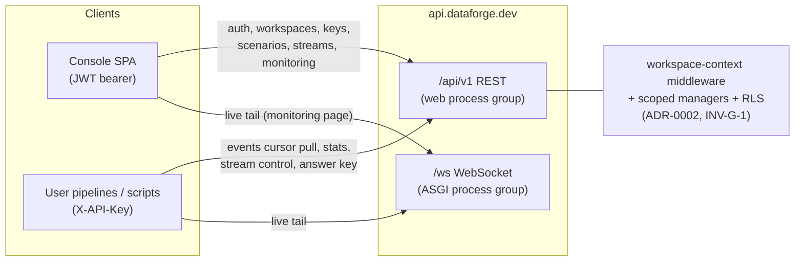
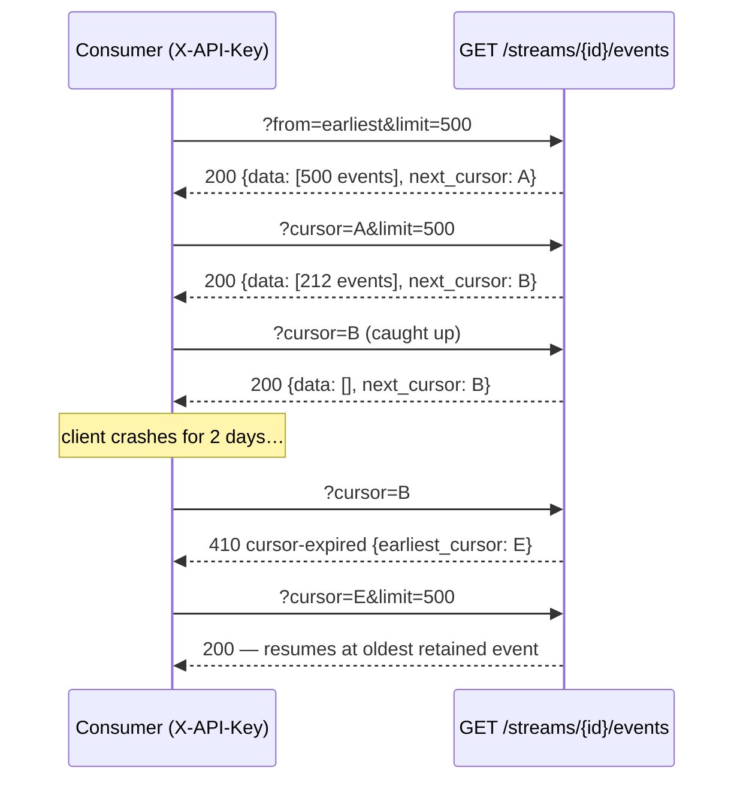
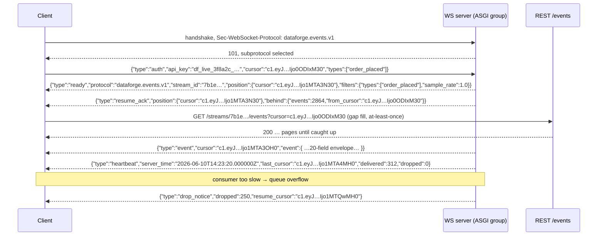

# DataForge — API Specification

**Deliverable:** D10

This document is the complete external interface contract of DataForge: the `/api/v1` REST surface (conventions, every endpoint with request/response shapes and status codes, the RFC 9457 problem-details error catalog, cursor pagination, rate limits, idempotency) and the versioned WebSocket protocol. It is the single owner of endpoint paths, problem types, and wire shapes per ADR-0014; domain semantics behind each endpoint are owned by the specs it cross-references. Terminology follows [../03-domain/domain-model.md](../03-domain/domain-model.md) exactly; the delivered event shape is frozen in [../03-domain/event-model.md](../03-domain/event-model.md); auth mechanics (token lifetimes, hashing, abuse controls) are owned by [../06-quality/security-architecture.md](../06-quality/security-architecture.md); the console consumes this API through a generated TypeScript client ([../02-architecture/frontend-architecture.md](../02-architecture/frontend-architecture.md), ADR-0016).

---

## 1. Surface overview

| Surface | Base | Transport | Primary principal |
|---|---|---|---|
| Control-plane REST (console + automation) | `https://api.dataforge.dev/api/v1` | HTTPS, JSON | JWT bearer (humans) |
| Data-plane REST (event consumption, stream control by machines) | `https://api.dataforge.dev/api/v1` | HTTPS, JSON / NDJSON | `X-API-Key` (machines) |
| WebSocket live tail | `wss://api.dataforge.dev/ws` | WebSocket, JSON frames, subprotocol `dataforge.events.v1` | API key (first-message auth), §5 |
| Health probes | `https://api.dataforge.dev/healthz`, `/readyz` | HTTPS | none (unversioned, unauthenticated; owned by [../02-architecture/observability.md](../02-architecture/observability.md)) |
| OpenAPI document | `GET https://api.dataforge.dev/api/v1/openapi.json` | HTTPS | none (public read) |

Path-based routing sends `/ws/*` to the dedicated ASGI process group and everything else to the web group (ADR-0013, ADR-0015; routing detail owned by [../02-architecture/deployment-architecture.md](../02-architecture/deployment-architecture.md)).



The consumption-model boundary is binding (PRD §3): in the MVP, users pull events over the internet via the cursor REST API and the WebSocket tail using an API key. DataForge's internal Kafka is never an external surface. Phase 12 adds hosted per-workspace Kafka topics and webhooks as *new sinks*, not new REST semantics ([../04-engines/delivery-channels.md](../04-engines/delivery-channels.md)).

---

## 2. Conventions (ADR-0014)

### 2.1 Versioning and stability

| Rule | Statement |
|---|---|
| V-1 | All REST paths are prefixed `/api/v1`. There is no header- or query-based version negotiation. |
| V-2 | Within `v1`, changes are **additive only**: new endpoints, new optional request fields, new response fields, new problem types, new enum values in *response* fields. Clients MUST ignore unknown response fields. |
| V-3 | Never within `v1`: removing/renaming fields or endpoints, changing types or semantics, tightening validation on existing fields, changing a success status code, adding required request fields. |
| V-4 | A breaking change requires `/api/v2` plus a new WS subprotocol version — and per event-model EV-5 it would also require a new envelope major, so it is effectively never made. |
| V-5 | The OpenAPI artifact is the machine-readable form of this contract; CI fails on any non-additive diff (§6). |

### 2.2 Authentication and principals

Two principal types exist (ADR-0011); every request authenticates as **exactly one**.

| Principal | Header | Issued by | Identifies | Used for |
|---|---|---|---|---|
| **User (JWT)** | `Authorization: Bearer <access-token>` | `POST /api/v1/auth/login` / `/refresh` (SimpleJWT) | a human user, with per-request workspace resolution via membership | Console and account/tenancy management; all endpoints |
| **API key** | `X-API-Key: df_<env>_<prefix>_<secret>` | `POST /api/v1/workspaces/{workspace_id}/api-keys` | a machine, bound to exactly one workspace and a scope set (INV-TEN-4) | Data plane: events, stats, stream control, schemas, answer key |

Rules:

| # | Rule |
|---|---|
| A-1 | Token lifetimes are pinned here and owned by [../06-quality/security-architecture.md](../06-quality/security-architecture.md): access token TTL **15 min**; refresh token TTL **7 days**, rotated on every refresh with reuse detection (reuse revokes the token family). |
| A-2 | A request presenting **both** `Authorization` and `X-API-Key` fails with `400` `ambiguous-credentials`. A request presenting neither, on an endpoint requiring auth, fails `401` `authentication-required` (JWT-only endpoints) or `401` `invalid-api-key` (when only `X-API-Key` is accepted). |
| A-3 | API-key authentication failures never distinguish unknown / revoked / expired keys: all are `401` `invalid-api-key` (no key-state oracle). Revocation is effective within 1 s via the Redis revocation cache (domain model §5). |
| A-4 | Scope vocabulary is fixed by the domain model §2.2: `events:read`, `streams:read`, `streams:write`, `schemas:read`, `answer_key:read`. A valid key lacking a required scope → `403` `permission-denied`. |
| A-5 | The endpoint tables in §4 mark auth as **JWT** (JWT only), **Key(scope)** (API key with that scope), or **JWT \| Key(scope)** (either). Console-facing event/stat/answer-key reads accept JWT so the monitoring UI needs no key; canonical machine access is the key. |
| A-6 | Unverified users (`is_verified = false`) can authenticate but every tenant-creating command (workspace create, membership accept, key create) fails `403` `email-not-verified` (INV-ID-2). |
| A-7 | 401 responses carry `WWW-Authenticate: Bearer` (JWT surfaces) or `WWW-Authenticate: APIKey realm="dataforge"` (key surfaces). |
| A-8 | CORS: console origin (`https://app.dataforge.dev`) is allowlisted for credentialed requests; data-plane GET endpoints allow any origin (keys are bearer secrets; CORS is not their protection). Policy detail owned by the security architecture. |

### 2.3 Workspace scoping rules

The workspace is the tenant (INV-TEN-1). How a request's workspace context is established:

| # | Rule |
|---|---|
| W-1 | **API-key requests:** the workspace is the key's workspace, always. Any `workspace_id` appearing in path, query, or body MUST equal it; mismatch → `404` `not-found` (masking, W-3). |
| W-2 | **JWT requests:** workspace-nested paths (`/api/v1/workspaces/{workspace_id}/…`) take context from the path. Flat collection routes (`GET /api/v1/streams`, `GET /api/v1/datasets`, `POST /api/v1/streams`, …) require `workspace_id` as a query/body parameter. Flat single-resource routes (`/api/v1/streams/{stream_id}`) resolve the workspace from the resource and verify membership. |
| W-3 | **Cross-tenant masking:** a resource that exists but belongs to a workspace the principal cannot access returns `404` `not-found` — indistinguishable from nonexistence. Insufficient *scope or role* within an accessible workspace returns `403` `permission-denied`. This is the 403/404 policy referenced by domain model §5. |
| W-4 | Role gates: `admin`-only operations are marked in §4. "Instructor" is a persona, not a role — instructor surfaces (answer key) are gated on `admin` or the `answer_key:read` scope (ADR-0017). |

### 2.4 Common request/response rules

| # | Rule |
|---|---|
| R-1 | Request and response bodies are JSON (`application/json; charset=utf-8`) unless stated (NDJSON batch §4.9.2, dataset download §4.10.3, problem details §2.7). Unknown *request* fields are rejected with `400` `validation-error` (strict parsing keeps the generated client honest). |
| R-2 | Identifiers are lowercase UUID strings. Timestamps are RFC 3339 UTC with `Z` suffix; envelope timestamps carry exactly 6 fractional digits per event-model §2.1. |
| R-3 | Money, seeds, and any integer that may exceed 2⁵³−1 are decimal **strings** (event-model S-1/S-6). A stream `seed` is a non-negative 63-bit integer — domain [0, 2⁶³−1], i.e. a non-negative int64, storable in a Postgres `bigint` (database-schema §5.1) — serialized as a decimal string, e.g. `"424242424242"`. |
| R-4 | Every response carries `X-Request-Id` (UUIDv7, generated server-side or echoed from a client-supplied `X-Request-Id`); problem bodies repeat it as `request_id`. Audit entries record the same id (domain model §2.10). |
| R-5 | `PATCH` uses JSON merge-patch semantics (RFC 7386) over the documented mutable fields; `PUT` is full replacement of the addressed document. |
| R-6 | List ordering: collection endpoints return newest-first by `created_at` (audit log: `occurred_at` desc); the events endpoints return buffer append order ascending (event-model §6). Ordering is part of the cursor contract (§2.6). |
| R-7 | `DELETE` returns `204` with empty body. Lifecycle verbs return `200` with the updated resource. Creations return `201` (or `202` for async dataset generation) with the resource body and a `Location` header. |

### 2.5 Idempotency keys

Lifecycle and creation `POST`s accept an `Idempotency-Key` header (client-generated, 8–64 chars, `[A-Za-z0-9_-]`; UUIDs recommended).

| # | Rule |
|---|---|
| I-1 | Applies to: `POST /workspaces`, `POST /workspaces/{id}/api-keys`, `POST /workspaces/{id}/scenario-instances`, `POST /scenarios`, `POST /streams`, `POST /streams/{id}/(start\|pause\|resume\|stop)`, `POST /streams/{id}/schema-upgrades`, `POST /datasets`. Optional everywhere it applies. |
| I-2 | Storage: Redis, keyed `(principal, method, path, idempotency_key)` with the request-body SHA-256 and the first response (status + body), TTL **24 h**. |
| I-3 | Replay (same key, same body hash, within TTL): the stored response is returned verbatim with header `Idempotency-Replayed: true`. No re-execution. |
| I-4 | Conflict (same key, different body hash): `409` `idempotency-key-conflict`. Concurrent duplicate while the original is in flight: `409` `idempotency-key-conflict` with `detail` `"original request still in progress"`. |
| I-5 | Stream lifecycle verbs are additionally idempotent by domain semantics (INV-STR-3): `start` on a running stream returns `200` with current state even without the header. The header exists so a retried `POST /streams` cannot create two streams. |

### 2.6 Cursor pagination

Cursor pagination everywhere; offset pagination exists nowhere (ADR-0014).

**Request:** `?cursor=<opaque>&limit=<int>`. `limit` default **100**; max **500** on collection endpoints, max **1,000** on `GET /streams/{id}/events`. First page: omit `cursor`.

**Response envelope (all paginated endpoints):**

```json
{
  "data": [ /* resources, in the endpoint's documented order */ ],
  "next_cursor": "c1.eyJmIjoiMzc1ZTNjMTkiLCJwIjoxNzgxMTkzNzg1Mjg3LCJzIjo0ODIxM30"
}
```

| # | Rule |
|---|---|
| P-1 | Cursors are opaque, URL-safe strings. Clients MUST NOT parse or construct them (domain model §6.1); the internal encoding (position + filter hash, versioned) may change at any time. The only contract is replay behavior. |
| P-2 | Collection endpoints: `next_cursor: null` means no further page. The events endpoints **never** return `null` — the tail cursor is returned so clients keep polling (§4.9). |
| P-3 | A cursor is bound to its endpoint, its resource, and the exact filter set it was created under. Reusing it elsewhere, or with different filters, fails `400` `cursor-invalid`. |
| P-4 | Event cursors are replayable within buffer retention: re-reading the same cursor returns identical events in identical order (INV-DEL-3). A cursor pointing into a dropped buffer partition fails `410` `cursor-expired` — never a silent skip (INV-DEL-4); the problem body includes `earliest_cursor` (§2.7.3). |
| P-5 | Collection cursors expire after **24 h** of non-use; expired collection cursors also return `410` `cursor-expired` (re-list from the first page). |

### 2.7 Errors — RFC 9457 problem details

Every non-2xx response body is `application/problem+json`. Base members: `type` (URI `https://docs.dataforge.dev/problems/{slug}`), `title`, `status`, `detail`, `instance` (request path). DataForge extension members are snake_case; `request_id` is always present.

#### 2.7.1 Problem-type catalog (closed for MVP; additions are additive)

| Type slug | Status | When | Extension members |
|---|---|---|---|
| `validation-error` | 400 | Malformed body/query/header; unknown request fields; bad parameter values | `errors[] {field, code, message}` |
| `cursor-invalid` | 400 | Unparseable cursor, or cursor used with a different endpoint/resource/filter set (P-3) | — |
| `ambiguous-credentials` | 400 | Both `Authorization` and `X-API-Key` present (A-2) | — |
| `authentication-required` | 401 | Missing/expired/invalid JWT on a JWT surface | — |
| `authentication-failed` | 401 | Bad email/password at login | — |
| `invalid-api-key` | 401 | Unknown, revoked, or expired API key (A-3, no state oracle) | — |
| `email-not-verified` | 403 | Tenant-creating command by an unverified user (A-6) | — |
| `permission-denied` | 403 | Authenticated principal lacks role or key scope (W-3) | `required_scope` or `required_role` |
| `quota-exceeded` | 403 | Command would exceed a plan quota (INV-TEN-5; PRD §7) | `quota`, `limit`, `current`, `plan` |
| `not-found` | 404 | Absent resource, or cross-tenant masking (W-3) | — |
| `conflict` | 409 | Uniqueness/state conflicts: duplicate email or slug, sole-admin rule (INV-TEN-3), instance has live streams, deprecated manifest version on start (INV-CAT-5), schema-upgrade scheduling violations (REG-U001..U007, §4.8.4) | `errors[] {code, path, message}` (schema-upgrade scheduling only) |
| `invalid-state-transition` | 409 | Stream lifecycle command illegal from current state (domain model §4.3, e.g. delete while running) | `current_state`, `attempted` |
| `idempotency-key-conflict` | 409 | Same `Idempotency-Key`, different body, or original still in flight (I-4) | — |
| `cursor-expired` | 410 | Cursor points past retention (P-4/P-5; INV-DEL-4) | `earliest_cursor`, `retention_hours` |
| `payload-too-large` | 413 | Body exceeds endpoint cap (manifest raw document > 512 KiB, B-01) | `limit_bytes` |
| `manifest-validation-failed` | 422 | Manifest or configuration-overlay semantic validation failure; carries MAN-* errors per [../04-engines/scenario-plugin-architecture.md](../04-engines/scenario-plugin-architecture.md) §8.3 | `errors[] {code, path, message, bound, actual, scope}`, `warnings[]` |
| `rate-limited` | 429 | Rate-limit bucket exhausted (§2.8) | `Retry-After` header; `retry_after_seconds` |
| `internal-error` | 500 | Unhandled server fault (body never leaks internals; `request_id` is the support handle) | — |
| `service-unavailable` | 503 | Dependency outage / not ready (mirrors `/readyz`) | `Retry-After` header |

#### 2.7.2 Validation, auth, and quota examples

`400` `validation-error` — `GET /api/v1/streams/7b1e9c3a-…/events?limit=5000`:

```json
{
  "type": "https://docs.dataforge.dev/problems/validation-error",
  "title": "Request validation failed",
  "status": 400,
  "detail": "1 invalid parameter.",
  "instance": "/api/v1/streams/7b1e9c3a-2f54-4d08-a6b9-1c2d3e4f5a6b/events",
  "request_id": "req_019ea1d2-7c4a-7b1e-9f3d-5a6b7c8d9e0f",
  "errors": [
    { "field": "limit", "code": "max_value", "message": "must be <= 1000" }
  ]
}
```

`401` `invalid-api-key`:

```json
{
  "type": "https://docs.dataforge.dev/problems/invalid-api-key",
  "title": "Invalid API key",
  "status": 401,
  "detail": "The presented API key is unknown, revoked, or expired.",
  "instance": "/api/v1/streams/7b1e9c3a-2f54-4d08-a6b9-1c2d3e4f5a6b/events",
  "request_id": "req_019ea1d3-1a2b-7c3d-8e4f-9a0b1c2d3e4f"
}
```

`403` `quota-exceeded` — third concurrent stream on the Free plan:

```json
{
  "type": "https://docs.dataforge.dev/problems/quota-exceeded",
  "title": "Workspace quota exceeded",
  "status": 403,
  "detail": "Starting this stream would exceed the 'concurrent_streams' quota (2) for plan 'free'.",
  "instance": "/api/v1/streams/2a4c6e8f-0b1d-4f3a-9c5e-7a8b9c0d1e2f/start",
  "request_id": "req_019ea1d4-9e8d-7c6b-a5f4-3e2d1c0b9a8f",
  "quota": "concurrent_streams",
  "limit": 2,
  "current": 2,
  "plan": "free"
}
```

#### 2.7.3 `cursor-expired` example (the documented teaching moment, PRD §7)

`410` — cursor older than the workspace's 24 h buffer retention:

```json
{
  "type": "https://docs.dataforge.dev/problems/cursor-expired",
  "title": "Cursor expired",
  "status": 410,
  "detail": "This cursor points into a buffer partition dropped by the 24h retention policy. Resume from 'earliest_cursor', or restart from ?from=earliest. Events older than retention are not replayable on this channel.",
  "instance": "/api/v1/streams/7b1e9c3a-2f54-4d08-a6b9-1c2d3e4f5a6b/events",
  "request_id": "req_019ea1d5-3c2b-7a1f-8d9e-0f1a2b3c4d5e",
  "earliest_cursor": "c1.eyJmIjoiMzc1ZTNjMTkiLCJwIjoxNzgxMTA3MjAwMDAwLCJzIjo5MDEyfQ",
  "retention_hours": 24
}
```

#### 2.7.4 `manifest-validation-failed` example

`422` — `PUT …/scenario-instances/{id}/configuration` with an overlay that breaks a probability sum:

```json
{
  "type": "https://docs.dataforge.dev/problems/manifest-validation-failed",
  "title": "Manifest validation failed",
  "status": 422,
  "detail": "1 error in semantic validation (layer 2).",
  "instance": "/api/v1/workspaces/0d9f7b42-3a61-4c2e-9b8f-5e1a2c3d4f60/scenario-instances/3f7a9c1e-5b2d-4f6a-8c0e-1b3d5f7a9c2e/configuration",
  "request_id": "req_019ea1d6-8b7a-7d6c-9e0f-1a2b3c4d5e6f",
  "errors": [
    {
      "code": "MAN-V201",
      "path": "/state_machines/shopping_session/states/checkout_started",
      "message": "outgoing probabilities sum to 1.15; must be <= 1.0",
      "bound": 1.0,
      "actual": 1.15,
      "scope": "override"
    }
  ],
  "warnings": []
}
```

#### 2.7.5 `rate-limited` example

`429` with `Retry-After: 21`:

```json
{
  "type": "https://docs.dataforge.dev/problems/rate-limited",
  "title": "Rate limit exceeded",
  "status": 429,
  "detail": "Bucket 'data-events' (600 requests/min per API key) exhausted.",
  "instance": "/api/v1/streams/7b1e9c3a-2f54-4d08-a6b9-1c2d3e4f5a6b/events",
  "request_id": "req_019ea1d7-2f3e-7a4b-8c5d-6e7f8a9b0c1d",
  "retry_after_seconds": 21
}
```

### 2.8 Rate limits

Token-bucket limits per ADR-0014, enforced at the API edge, keyed per principal. Quotas (events/day, TPS caps) are a separate command-time mechanism (INV-TEN-5) — rate limits protect the API; quotas meter the product.

| Bucket | Keyed by | Sustained | Burst (bucket size) | Applies to |
|---|---|---|---|---|
| `auth-public` | IP, per endpoint | 5/hour | 3 | `signup`, `resend-verification`, `password-reset` |
| `auth-login` | IP **and** account | 10/min per IP; 20/hour per account | 5 | `login` |
| `console` | user (JWT) | 120/min | 240 | every JWT-authenticated endpoint |
| `data-events` | API key | 600/min | 100 | `GET /events`, `/stats`, `/schemas/*`, `/answer-key/*` (key-authenticated) |
| `data-batch` | API key | 6/min | 2 | `GET /events/batch`, `GET /datasets/{id}/download` |
| `data-control` | API key | 60/min | 20 | stream lifecycle verbs, `PATCH` stream/chaos, `POST /datasets` |
| `ws-connect` | API key | 10/min | 5 | WebSocket handshakes (§5) |
| `validator` | workspace | 30/hour | 5 | manifest validation runs (binding AI-4 quota, plugin architecture §12) |

Headers on every rate-limited surface: `RateLimit-Limit`, `RateLimit-Remaining`, `RateLimit-Reset` (seconds until refill); `Retry-After` on 429. Per-key buckets are independent per key — a Classroom cohort where each student holds their own key scales naturally (PRD §2.2). Anti-abuse tuning beyond these values is owned by [../06-quality/security-architecture.md](../06-quality/security-architecture.md).

---

## 3. Endpoint index

Complete `/api/v1` catalog. Auth column per §2.2 A-5; Phase = first phase the endpoint ships ([../07-plan/phases/README.md](../07-plan/phases/README.md)).

| # | Method | Path | Auth | Success | Phase |
|---|---|---|---|---|---|
| 1 | POST | `/auth/signup` | none | 201 | 2 |
| 2 | POST | `/auth/verify-email` | none | 200 | 2 |
| 3 | POST | `/auth/resend-verification` | none | 202 | 2 |
| 4 | POST | `/auth/login` | none | 200 | 2 |
| 5 | POST | `/auth/refresh` | none (refresh token in body) | 200 | 2 |
| 6 | POST | `/auth/logout` | JWT | 204 | 2 |
| 7 | POST | `/auth/password-reset` | none | 202 | 2 |
| 8 | POST | `/auth/password-reset/confirm` | none | 200 | 2 |
| 9 | GET | `/users/me` | JWT | 200 | 2 |
| 10 | POST | `/users/me/password` | JWT | 204 | 2 |
| 11 | DELETE | `/users/me` | JWT | 204 | 2 |
| 12 | GET | `/workspaces` | JWT | 200 | 2 |
| 13 | POST | `/workspaces` | JWT (verified) | 201 | 2 |
| 14 | GET | `/workspaces/{workspace_id}` | JWT | 200 | 2 |
| 15 | PATCH | `/workspaces/{workspace_id}` | JWT (admin) | 200 | 2 |
| 16 | DELETE | `/workspaces/{workspace_id}` | JWT (admin) | 204 | 2 |
| 17 | GET | `/workspaces/{workspace_id}/members` | JWT | 200 | 2 |
| 18 | POST | `/workspaces/{workspace_id}/members` | JWT (admin) | 201 | 2 |
| 19 | PATCH | `/workspaces/{workspace_id}/members/{user_id}` | JWT (admin) | 200 | 2 |
| 20 | DELETE | `/workspaces/{workspace_id}/members/{user_id}` | JWT (admin, or self-leave) | 204 | 2 |
| 21 | GET | `/workspaces/{workspace_id}/quotas` | JWT \| Key(`streams:read`) | 200 | 2 (usage metering 11) |
| 22 | POST | `/workspaces/{workspace_id}/api-keys` | JWT (verified member) | 201 | 2 |
| 23 | GET | `/workspaces/{workspace_id}/api-keys` | JWT | 200 | 2 |
| 24 | DELETE | `/workspaces/{workspace_id}/api-keys/{api_key_id}` | JWT (creator or admin) | 204 | 2 |
| 25 | GET | `/workspaces/{workspace_id}/audit-log` | JWT (admin) | 200 | 2 |
| 26 | GET | `/scenarios` | JWT \| Key(any scope) | 200 | 3 |
| 27 | GET | `/scenarios/{scenario_slug}` | JWT \| Key(any scope) | 200 | 3 |
| 28 | GET | `/scenarios/{scenario_slug}/versions` | JWT \| Key(any scope) | 200 | 3 |
| 29 | GET | `/scenarios/{scenario_slug}/versions/{manifest_version}` | JWT \| Key(any scope) | 200 | 3 |
| 30 | GET | `/scenarios/{scenario_slug}/versions/{manifest_version}/validation` | JWT | 200 | 3 |
| 31 | POST | `/scenarios` | JWT (verified; workspace visibility) | 201 | 3 |
| 32 | POST | `/scenarios/{scenario_slug}/versions/{manifest_version}/publish` | JWT (admin of owning workspace) | 200 | 3 |
| 33 | GET | `/workspaces/{workspace_id}/scenario-instances` | JWT \| Key(`streams:read`) | 200 | 3 |
| 34 | POST | `/workspaces/{workspace_id}/scenario-instances` | JWT (verified member) | 201 | 3 |
| 35 | GET | `/workspaces/{workspace_id}/scenario-instances/{scenario_instance_id}` | JWT \| Key(`streams:read`) | 200 | 3 |
| 36 | GET | `…/scenario-instances/{scenario_instance_id}/configuration` | JWT \| Key(`streams:read`) | 200 | 3 |
| 37 | PUT | `…/scenario-instances/{scenario_instance_id}/configuration` | JWT (member) | 200 | 3 |
| 38 | DELETE | `…/scenario-instances/{scenario_instance_id}` | JWT (member) | 204 | 3 |
| 39 | POST | `/streams` | JWT \| Key(`streams:write`) | 201 | 5 |
| 40 | GET | `/streams` | JWT \| Key(`streams:read`) | 200 | 5 |
| 41 | GET | `/streams/{stream_id}` | JWT \| Key(`streams:read`) | 200 | 5 |
| 42 | DELETE | `/streams/{stream_id}` | JWT \| Key(`streams:write`) | 204 | 5 |
| 43 | POST | `/streams/{stream_id}/start` | JWT \| Key(`streams:write`) | 200 | 5 |
| 44 | POST | `/streams/{stream_id}/stop` | JWT \| Key(`streams:write`) | 200 | 5 |
| 45 | POST | `/streams/{stream_id}/pause` | JWT \| Key(`streams:write`) | 200 | 6 |
| 46 | POST | `/streams/{stream_id}/resume` | JWT \| Key(`streams:write`) | 200 | 6 |
| 47 | PATCH | `/streams/{stream_id}` | JWT \| Key(`streams:write`) | 200 | 6 |
| 48 | GET | `/streams/{stream_id}/chaos` | JWT \| Key(`streams:read`) | 200 | 9 |
| 49 | PATCH | `/streams/{stream_id}/chaos` | JWT \| Key(`streams:write`) | 200 | 9 |
| 50 | POST | `/streams/{stream_id}/schema-upgrades` | JWT \| Key(`streams:write`) | 201 | 10 |
| 51 | GET | `/streams/{stream_id}/schema-upgrades` | JWT \| Key(`streams:read`) | 200 | 10 |
| 52 | DELETE | `/streams/{stream_id}/schema-upgrades/{upgrade_id}` | JWT \| Key(`streams:write`) | 204 | 10 |
| 53 | GET | `/streams/{stream_id}/events` | JWT \| Key(`events:read`) | 200 | 5 (CDC filters 8) |
| 54 | GET | `/streams/{stream_id}/events/batch` | Key(`events:read`) | 200 | 11 |
| 55 | GET | `/streams/{stream_id}/stats` | JWT \| Key(`streams:read`) | 200 | 6 |
| 56 | GET | `/workspaces/{workspace_id}/stats` | JWT \| Key(`streams:read`) | 200 | 7 |
| 57 | POST | `/datasets` | JWT \| Key(`streams:write`) | 201 / 202 | 4 |
| 58 | GET | `/datasets` | JWT \| Key(`streams:read`) | 200 | 4 |
| 59 | GET | `/datasets/{dataset_id}` | JWT \| Key(`streams:read`) | 200 | 4 |
| 60 | GET | `/datasets/{dataset_id}/download` | JWT \| Key(`events:read`) | 200 | 4 |
| 61 | DELETE | `/datasets/{dataset_id}` | JWT \| Key(`streams:write`) | 204 | 4 |
| 62 | GET | `/schemas` | JWT \| Key(`schemas:read`) | 200 | 3 |
| 63 | GET | `/schemas/{subject}` | JWT \| Key(`schemas:read`) | 200 | 3 |
| 64 | GET | `/schemas/{subject}/versions` | JWT \| Key(`schemas:read`) | 200 | 3 |
| 65 | GET | `/schemas/{subject}/versions/{version}` | JWT \| Key(`schemas:read`) | 200 | 3 |
| 66 | GET | `/schemas/{subject}/diff` | JWT \| Key(`schemas:read`) | 200 | 10 |
| 67 | GET | `/streams/{stream_id}/answer-key/injections` | JWT (admin) \| Key(`answer_key:read`) | 200 | 9 |
| 68 | GET | `/streams/{stream_id}/answer-key/summary` | JWT (admin) \| Key(`answer_key:read`) | 200 | 9 |
| 69 | GET | `/streams/{stream_id}/answer-key/canonical` | JWT (admin) \| Key(`answer_key:read`) | 200 | 9 |
| 70 | GET | `/openapi.json` | none | 200 | 1 |

---

## 4. Resource reference

### 4.1 Auth (`/api/v1/auth/*`)

Endpoint shapes are owned here; token mechanics, hashing, abuse thresholds, and email content by [../06-quality/security-architecture.md](../06-quality/security-architecture.md) (ADR-0011). All auth mutations are audited (domain model §2.10).

**`POST /auth/signup`** — body `{"email": "rosa@example.net", "password": "…"}`. Password policy: ≥ 10 chars (full policy owned by the security architecture). `201`:

```json
{
  "user_id": "4c1a8e6f-2b3d-4a5c-9e8f-7a6b5c4d3e2f",
  "email": "rosa@example.net",
  "is_verified": false,
  "created_at": "2026-06-10T09:12:44.118201Z"
}
```

A verification email is sent. Duplicate email → `409` `conflict` (enumeration accepted as a deliberate tradeoff, mitigated by the `auth-public` bucket; recorded in the security architecture). Weak password → `400` `validation-error`.

**`POST /auth/verify-email`** — body `{"token": "<from email link>"}`. `200` `{"user_id": "…", "is_verified": true}`. Tokens are single-use, TTL 24 h (INV-ID-3); consumed/expired token → `400` `validation-error` with `errors[0].code = "token_invalid"`.

**`POST /auth/resend-verification`** — body `{"email": "…"}`. Always `202` `{"detail": "If the address exists and is unverified, a new email was sent."}` (no enumeration on this path).

**`POST /auth/login`** — body `{"email": "…", "password": "…"}`. `200`:

```json
{
  "access_token": "eyJhbGciOiJIUzI1NiIsInR5cCI6IkpXVCJ9.…",
  "refresh_token": "eyJhbGciOiJIUzI1NiIsInR5cCI6IkpXVCJ9.…",
  "token_type": "Bearer",
  "access_expires_in": 900,
  "refresh_expires_in": 604800
}
```

Bad credentials → `401` `authentication-failed`. Unverified users **can** log in (INV-ID-2). Login success and failure are both audited.

**`POST /auth/refresh`** — body `{"refresh_token": "…"}`. `200` with the same shape as login; the refresh token is **rotated** — the presented token is invalidated, and reuse of a rotated token revokes the whole family (A-1) → `401` `authentication-required`.

**`POST /auth/logout`** — JWT + body `{"refresh_token": "…"}`. Invalidates the refresh-token family; the access token expires naturally (≤ 15 min). `204`.

**`POST /auth/password-reset`** — body `{"email": "…"}`. Always `202` (no enumeration). Reset token TTL 1 h, single-use (INV-ID-3).

**`POST /auth/password-reset/confirm`** — body `{"token": "…", "new_password": "…"}`. `200` `{"detail": "Password updated."}`. Side effects: all refresh-token families revoked; outstanding reset/verification tokens invalidated.

### 4.2 Users (`/api/v1/users/me`)

**`GET /users/me`** — `200`:

```json
{
  "user_id": "4c1a8e6f-2b3d-4a5c-9e8f-7a6b5c4d3e2f",
  "email": "rosa@example.net",
  "is_verified": true,
  "created_at": "2026-06-10T09:12:44.118201Z",
  "memberships": [
    {
      "workspace_id": "0d9f7b42-3a61-4c2e-9b8f-5e1a2c3d4f60",
      "name": "DE Bootcamp Cohort 12",
      "slug": "de-bootcamp-12",
      "role": "member"
    }
  ]
}
```

**`POST /users/me/password`** — body `{"current_password": "…", "new_password": "…"}`. `204`. Revokes all refresh families except the current session's.

**`DELETE /users/me`** — body `{"password": "…"}` (re-confirmation). `204`. Removes all memberships; blocked with `409` `conflict` if the user is the sole admin of any workspace (INV-ID-4/INV-TEN-3): `detail` names the blocking workspaces — transfer or delete them first.

### 4.3 Workspaces and memberships

**Workspace resource:**

```json
{
  "workspace_id": "0d9f7b42-3a61-4c2e-9b8f-5e1a2c3d4f60",
  "name": "DE Bootcamp Cohort 12",
  "slug": "de-bootcamp-12",
  "plan": "classroom",
  "role": "admin",
  "member_count": 41,
  "created_at": "2026-05-02T08:00:11.402113Z"
}
```

`role` is the calling user's role (omitted on API-key reads). `plan` ∈ `free | classroom | pro` (PRD §7); plan changes are an operator action until self-serve billing (PRD §7, refined in Phase 11).

| Endpoint | Contract |
|---|---|
| `GET /workspaces` | Paginated list of the caller's workspaces (`data`/`next_cursor`). |
| `POST /workspaces` | Body `{"name": "…", "slug": "…"}`; `slug` optional (derived from name), `^[a-z][a-z0-9-]{2,47}$`, globally unique → `409` `conflict` if taken. Creator becomes `admin`. Requires verified email (A-6). New workspaces are `free` plan. `201`. |
| `PATCH /workspaces/{id}` | Body `{"name": "…"}` (slug immutable). Admin only. `200`. |
| `DELETE /workspaces/{id}` | Admin only. Cascades per INV-TEN-6: revokes all keys, stops all streams, tombstones audit. Irreversible; requires header `X-Confirm-Delete: {workspace_id}` else `400` `validation-error`. `204`. |

**Membership resource:** `{"user_id": "…", "email": "…", "role": "admin|member", "joined_at": "…"}`.

| Endpoint | Contract |
|---|---|
| `GET /workspaces/{id}/members` | Paginated; any member may list. |
| `POST /workspaces/{id}/members` | Body `{"email": "student@uni.edu", "role": "member"}`. Admin only. The email must belong to an **existing verified account** → membership created immediately, `201`; otherwise `404` `not-found` with `detail` "no verified account for this email — the user must sign up first". Duplicate membership → `409` `conflict` (INV-TEN-2). **Refined in Phase 7:** pending email invitations for unregistered addresses ship with the console as an additive `POST /workspaces/{id}/invitations` resource following the same role rules; the decided Phase 2 contract is direct-add of existing verified users. |
| `PATCH …/members/{user_id}` | Body `{"role": "admin"}`. Admin only. Demoting the last admin → `409` `conflict` (INV-TEN-3). `200`. |
| `DELETE …/members/{user_id}` | Admin removes anyone; a member may remove themself (leave). Last admin cannot leave (INV-TEN-3) → `409` `conflict`. `204`. |

### 4.4 Quotas

**`GET /workspaces/{workspace_id}/quotas`** — plan limits (PRD §7) plus live usage. Limits are served from Phase 2; usage metering completes in Phase 11 (until then, unmetered counters report `0` and quota enforcement is limited to the synchronously checkable limits: members, keys, concurrent streams, TPS caps). `200`:

```json
{
  "workspace_id": "0d9f7b42-3a61-4c2e-9b8f-5e1a2c3d4f60",
  "plan": "classroom",
  "quotas": {
    "workspace_members": { "limit": 60, "used": 41 },
    "concurrent_streams": { "limit": 20, "used": 3 },
    "per_stream_tps_cap": { "limit": 100 },
    "aggregate_tps_cap": { "limit": 1000, "used": 150 },
    "events_per_day": { "limit": 10000000, "used": 1412000, "resets_at": "2026-06-11T00:00:00.000000Z" },
    "buffer_retention_hours": { "limit": 48 },
    "backfill": { "max_simulated_days": 30, "max_events": 5000000 },
    "api_keys": { "limit": 100, "used": 44 },
    "idle_auto_pause_hours": { "limit": 8 }
  }
}
```

Quota exhaustion at command time → `403` `quota-exceeded` (§2.7.2); running streams that exhaust `events_per_day` are system-paused with status `paused_quota`, never deleted (INV-TEN-5, domain model §4.3).

### 4.5 API keys

Key format `df_<env>_<prefix>_<secret>` with `env ∈ live | dev`; storage is SHA-256 hash + `prefix` + `last4` only (ADR-0011, INV-TEN-4). Lifecycle: domain model §5.

**`POST /workspaces/{id}/api-keys`** — any verified member; body:

```json
{
  "name": "spark-lab-key",
  "scopes": ["events:read", "streams:read"],
  "expires_at": null
}
```

`scopes` ⊆ the fixed vocabulary (A-4); `answer_key:read` is grantable only by a workspace admin → otherwise `403` `permission-denied`. Key-count quota enforced (INV-TEN-5). `201` — **the only response that ever contains the secret**:

```json
{
  "api_key_id": "9e2f4a6c-8b1d-4e3f-a5c7-2d4f6a8c0e1b",
  "workspace_id": "0d9f7b42-3a61-4c2e-9b8f-5e1a2c3d4f60",
  "name": "spark-lab-key",
  "key": "df_live_3f8a2c_Zk9rT2pQw7uXv4sYbN1mC6hJd8eFgA3LqRiWoP5tUxKz",
  "prefix": "3f8a2c",
  "last4": "UxKz",
  "scopes": ["events:read", "streams:read"],
  "state": "active",
  "expires_at": null,
  "created_by": "4c1a8e6f-2b3d-4a5c-9e8f-7a6b5c4d3e2f",
  "created_at": "2026-06-10T10:01:02.334455Z"
}
```

**`GET /workspaces/{id}/api-keys`** — paginated list; the `key` field never appears — entries carry `prefix`, `last4`, `scopes`, `state` (`active | revoked | expired`), `last_used_at` (minute precision, write-behind), `expires_at`, `created_by`, `created_at`:

```json
{
  "data": [
    {
      "api_key_id": "9e2f4a6c-8b1d-4e3f-a5c7-2d4f6a8c0e1b",
      "name": "spark-lab-key",
      "prefix": "3f8a2c",
      "last4": "UxKz",
      "scopes": ["events:read", "streams:read"],
      "state": "active",
      "last_used_at": "2026-06-10T13:58:00.000000Z",
      "expires_at": null,
      "created_by": "4c1a8e6f-2b3d-4a5c-9e8f-7a6b5c4d3e2f",
      "created_at": "2026-06-10T10:01:02.334455Z"
    }
  ],
  "next_cursor": null
}
```

**`DELETE /workspaces/{id}/api-keys/{api_key_id}`** — revoke (terminal; no reactivation). Permitted to the key's creator or any admin. Effective within 1 s via the Redis revocation cache (Phase 2 exit criterion). `204`. Revoking an already-revoked key is a no-op `204` (idempotent delete).

### 4.6 Scenario catalog and manifests

The catalog API serves global (platform-curated) scenarios to everyone and `workspace`-visibility scenarios to their owning workspace only (INV-CAT-6). Manifest semantics, validation layers, and error codes are owned by [../04-engines/scenario-plugin-architecture.md](../04-engines/scenario-plugin-architecture.md); this section owns the endpoint shapes (its AI-5 contract).

**`GET /scenarios`** — query: `workspace_id` (JWT callers, optional — include that workspace's own scenarios alongside globals; API-key callers get their key's workspace automatically), `visibility` (`global | workspace`), `cursor`, `limit`. `200`:

```json
{
  "data": [
    {
      "scenario_slug": "ecommerce",
      "title": "E-Commerce",
      "description": "A complete online retailer: 8 entities, ~20 event types, full purchase funnel with refunds, CDC-enabled.",
      "visibility": "global",
      "latest_version": "1.1.0",
      "published_versions": ["1.0.0", "1.1.0"],
      "created_at": "2026-03-01T00:00:00.000000Z"
    }
  ],
  "next_cursor": null
}
```

**`GET /scenarios/{scenario_slug}`** — the resource above plus `versions[]` summaries (`{manifest_version, status, published_at}`, status ∈ `draft | published | deprecated`).

**`GET /scenarios/{scenario_slug}/versions`** — paginated version list.

**`GET /scenarios/{scenario_slug}/versions/{manifest_version}`** — includes the full canonical-JSON manifest document:

```json
{
  "scenario_slug": "ecommerce",
  "manifest_version": "1.0.0",
  "status": "published",
  "sha256": "9f2d4e6a8c0b1d3f5a7c9e0b2d4f6a8c0e1b3d5f7a9c2e4a6c8e0f1a3b5c7d9e",
  "published_at": "2026-03-01T00:00:00.000000Z",
  "document": { "manifest_schema": "v0", "metadata": { "slug": "ecommerce", "version": "1.0.0" } }
}
```

(`document` abbreviated here; the normative full manifest is [../04-engines/scenarios/ecommerce.md](../04-engines/scenarios/ecommerce.md).)

**`GET /scenarios/{scenario_slug}/versions/{manifest_version}/validation`** — the ValidationReport (plugin architecture §8.3), the polling target for the async layer-3 dry run. `200` with `status` ∈ `pending | running | passed | failed` plus `errors[]`/`warnings[]`/`dry_run` when complete.

**`POST /scenarios`** — create a draft manifest version (workspace visibility — the AI-manifest slot-in seam, plugin architecture §12). Body:

```json
{ "workspace_id": "0d9f7b42-3a61-4c2e-9b8f-5e1a2c3d4f60", "document": { "manifest_schema": "v0", "…": "…" } }
```

Behavior: parse hardening + layers 1–2 run synchronously; failure → `422` `manifest-validation-failed` (§2.7.4) and no draft is created. Success → `201` draft with the layer-3 job queued; poll endpoint #30. Raw document > 512 KiB → `413` `payload-too-large` (B-01). Hook generators in a workspace manifest → `422` (MAN-V404). Subject to the `validator` bucket (§2.8, AI-4). Existing `(slug, version)` → `409` `conflict`. These endpoints exist from Phase 3 (exercised by builtin sync and tests); the tenant-facing upload console and prompt→manifest generation are post-MVP callers (plugin architecture §12 — they add callers, not rules).

**`POST /scenarios/{scenario_slug}/versions/{manifest_version}/publish`** — requires the full ValidationReport passed (INV-CAT-2); derives and registers payload schemas transactionally (R-DER-1..5). `200` with the version resource (`status: "published"`). Unpassed validation → `409` `conflict`; non-additive schema derivation already failed validation as MAN-V501.

### 4.7 Scenario instances (workspace configuration)

A ScenarioInstance pins one published manifest version plus a workspace overlay (domain model §2.3). Overlay grammar and validation: plugin architecture §11.

**Instance resource:**

```json
{
  "scenario_instance_id": "3f7a9c1e-5b2d-4f6a-8c0e-1b3d5f7a9c2e",
  "workspace_id": "0d9f7b42-3a61-4c2e-9b8f-5e1a2c3d4f60",
  "name": "dedup-101-lab",
  "scenario_slug": "ecommerce",
  "manifest_version": "1.0.0",
  "config_revision": 3,
  "created_at": "2026-06-08T15:30:00.000000Z",
  "updated_at": "2026-06-10T09:00:00.000000Z"
}
```

| Endpoint | Contract |
|---|---|
| `POST …/scenario-instances` | Body `{"name", "scenario_slug", "manifest_version", "configuration": {…}}`; `configuration` optional (defaults = empty overlay, `config_revision` 1). Pinning a `deprecated` version → `409` `conflict` (INV-CAT-5). Overlay validated as merged document → `422` `manifest-validation-failed` with `scope: "override"` errors. `201`. |
| `GET …/scenario-instances` / `GET …/{id}` | Paginated list / single resource. |
| `GET …/{id}/configuration` | `200` with the overlay document plus `config_revision`: `{"config_revision": 3, "configuration": {"probabilities": {"shopping_session.checkout_started.order_placed": 0.55}, "chaos": {"duplicates": {"enabled": true, "rate": 0.05}}, "catalog_sizes": {"users": 20000}}}`. |
| `PUT …/{id}/configuration` | Full replacement of the overlay. Synchronous layer-2 re-validation of the merged document (probability sums, V207 recompute, bounds); failure → `422` (§2.7.4) and **no revision is written**. Success → `200` with `config_revision` incremented. Per PIN-2, the new revision affects only streams started afterwards — running streams keep their copied pin; the console surfaces this as "changes apply to new streams". |
| `DELETE …/{id}` | Blocked while any non-deleted stream references the instance → `409` `conflict` ("delete the streams first"). `204`. |

### 4.8 Streams

Stream semantics — lifecycle states, desired-state reconciliation, pinning, determinism — are the domain model's §4 and INV-STR-*; this section is their wire shape.

**Stream resource:**

```json
{
  "stream_id": "7b1e9c3a-2f54-4d08-a6b9-1c2d3e4f5a6b",
  "workspace_id": "0d9f7b42-3a61-4c2e-9b8f-5e1a2c3d4f60",
  "scenario_instance_id": "3f7a9c1e-5b2d-4f6a-8c0e-1b3d5f7a9c2e",
  "name": "dedup-101-run-1",
  "scenario_slug": "ecommerce",
  "manifest_version": "1.0.0",
  "config_revision": 3,
  "pin_sha256": "5a7c9e0b2d4f6a8c0e1b3d5f7a9c2e4a6c8e0f1a3b5c7d9e9f2d4e6a8c0b1d3f",
  "seed": "424242424242",
  "status": "running",
  "status_reason": "none",
  "desired_state": { "run_state": "running", "target_tps": 50 },
  "virtual_clock": {
    "virtual_epoch": "2026-06-10T12:00:00.000000Z",
    "speed_multiplier": 1.0,
    "virtual_now": "2026-06-10T14:23:05.000000Z"
  },
  "shard_count": 1,
  "created_at": "2026-06-10T11:58:21.004412Z",
  "started_at": "2026-06-10T12:00:00.118734Z",
  "last_transition_at": "2026-06-10T12:00:00.118734Z"
}
```

`status` is the surfaced lifecycle string from domain model §4.3: `created | starting | running | pausing | paused | paused_quota | paused_idle | resuming | stopping | stopped | failed`. `pin_sha256` is the determinism fingerprint (PIN-1) that appears in golden-replay fixtures.

**`POST /streams`** — body:

```json
{
  "workspace_id": "0d9f7b42-3a61-4c2e-9b8f-5e1a2c3d4f60",
  "scenario_instance_id": "3f7a9c1e-5b2d-4f6a-8c0e-1b3d5f7a9c2e",
  "name": "dedup-101-run-1",
  "seed": "424242424242",
  "target_tps": 50,
  "virtual_clock": { "virtual_epoch": "2026-06-10T12:00:00Z", "speed_multiplier": 1.0 },
  "chaos": { "duplicates": { "enabled": true, "rate": 0.05 } }
}
```

Defaults and bounds: `seed` optional (server-generated in the R-3 domain [0, 2⁶³−1] when omitted; immutable forever, INV-STR-5); `target_tps` integer 1–1,000, default **10**, quota-capped at command time; `speed_multiplier` ∈ [0.1, 1000.0], default 1.0; `virtual_epoch` default = wall time of first start; `chaos` optional initial policy (defaults = the instance's chaos defaults), validated like `PATCH /chaos`. Creation copies the instance pin `(manifest_version, config_revision → merged config)` (T1, INV-CAT-4). Streams are created with `status: "created"`, desired `stopped` — emission begins at `start`. Live streaming in `v1` runs the virtual clock in `live` mode only; bulk history generation is the datasets resource (§4.10), which is the API surface of backfill mode (ADR-0008). `201`.

**`GET /streams`** — query: `workspace_id` (required for JWT, W-2), `status` (comma list), `scenario_instance_id`, `cursor`, `limit`. Paginated.

**`GET /streams/{stream_id}`** — the resource above. **`DELETE /streams/{stream_id}`** — only from `created`, `stopped`, or `failed` (T14) → otherwise `409` `invalid-state-transition`; removes buffer rows, checkpoints, pending re-emissions; ledger and audit follow retention policy, not deletion. `204`.

#### 4.8.1 Lifecycle verbs

`POST /streams/{stream_id}/start | pause | resume | stop` — each sets desired state and returns `200` with the stream resource immediately (reconciliation is asynchronous; poll `status` or watch the console). All four are idempotent (INV-STR-3): re-issuing the current desired state is a no-op returning current state.

| Verb | Guards (failure) | Convergence contract |
|---|---|---|
| `start` | quota: concurrent streams + TPS caps (`403` `quota-exceeded`); pinned manifest version deprecated (`409` `conflict`, INV-CAT-5); from `created`/`stopped`/`failed` only — `start` while `pausing` → `409` `invalid-state-transition` | runner lease + seed/restore; `failed` with `status_reason: "error"` if no lease within 60 s (T4). Restart from `stopped` is **continuation**: checkpoint restore, `sequence_no` and virtual clock continue, seed never re-rolled (T12) |
| `pause` | from `running` | emission halts within one tick; checkpoint persisted; pending late re-emissions held (INV-CHA-5) |
| `resume` | from `paused*`; if `status_reason = quota`, requires restored headroom → else `403` `quota-exceeded` (T7) | checkpoint restore; in-flight funnels continue with zero sequence gaps (T8) |
| `stop` | any non-terminal state; overrides in-flight pause/start (T9) | emission ceases ≤ 5 s (T10); LateArrivalBuffer `OnStopPolicy` applied (`discard` default) |

#### 4.8.2 Live mutation — `PATCH /streams/{stream_id}`

Mutable fields: `name`, `target_tps` (PIN-3). Example `{"target_tps": 500}` → `200` with `desired_state.target_tps: 500`; the runner applies it within **2 s** (Phase 6 exit criterion). Out of range 1–1,000 → `400` `validation-error`; above the plan's per-stream or aggregate TPS cap → `403` `quota-exceeded`. Everything else on the stream is pinned (PIN-4) — patching it → `400` `validation-error` with `errors[0].code = "immutable_field"` and a message naming the new-stream-required rule.

#### 4.8.3 Chaos configuration — `GET | PATCH /streams/{stream_id}/chaos`

Chaos is live-mutable desired state within the pinned bounds (PIN-3); mode semantics and per-mode `params` schemas are owned by [../04-engines/chaos-engine.md](../04-engines/chaos-engine.md). `GET` returns the live policy:

```json
{
  "stream_id": "7b1e9c3a-2f54-4d08-a6b9-1c2d3e4f5a6b",
  "modes": {
    "duplicates":       { "enabled": true,  "rate": 0.05, "params": {} },
    "late_arriving":    { "enabled": true,  "rate": 0.03,
                          "params": { "delay": { "family": "lognormal", "median": "PT30M", "p95": "PT2H" } } },
    "missing":          { "enabled": false, "rate": 0.01, "params": {} },
    "out_of_order":     { "enabled": false, "rate": 0.10, "params": { "window": "PT60S" } },
    "corrupted_values": { "enabled": false, "rate": 0.02, "params": {} },
    "nulls":            { "enabled": false, "rate": 0.02, "params": {} },
    "schema_drift":     { "enabled": false, "rate": 0.20, "params": { "subjects": ["*"], "fields": ["*"] } },
    "on_stop_policy": "discard"
  },
  "updated_at": "2026-06-10T12:00:00.118734Z"
}
```

`PATCH` body carries only the modes to change; each present mode is replaced whole (merge at mode level, replace within a mode): `{"late_arriving": {"enabled": true, "rate": 0.05, "params": {"delay": {"family": "lognormal", "median": "PT30M", "p95": "PT2H"}}}}` → `200` with the full policy. Validation: mode names are the closed seven (domain model §2.7) + `on_stop_policy` (`discard | flush`); `rate` ≤ 0.5 (B-16); temporal params are **simulated-time** distributions (event-model §3.4); violations → `422` `manifest-validation-failed` with chaos-scoped errors. Every applied change is audited (`streams.stream.chaos_policy_changed`) and takes effect next tick. Changes apply to events not yet through the chaos stage; injections already recorded are unaffected (INV-CHA-4).

#### 4.8.4 Scheduled schema upgrades — `/streams/{stream_id}/schema-upgrades`

The Phase 10 "evolve to v2 at simulated time T" surface (domain model §4.4). The endpoint shapes are owned here; application mechanics (validation chain REG-U001..U007, cutover rule, runner behavior, lifecycle interactions) are owned by [../04-engines/schema-registry.md](../04-engines/schema-registry.md) §10.3–10.4 — **refined in Phase 10**.

**`POST`** — body:

```json
{
  "subject": "ecommerce.order_placed",
  "target_version": 2,
  "at": "2026-06-12T00:00:00.000000Z"
}
```

`at` is **simulated time** (the `occurred_at` domain — the stream's virtual clock, event-model §3.5); optional — omitted means "the next tick boundary", i.e. effectively immediately. The cutover keys on `occurred_at` (registry §10.4), so the upgrade lands at the same simulated instant — and the same canonical position — at any `speed_multiplier`, across pauses, after failover, and in backfill. Constraints (the registry's REG-U001..U007): `subject` must be a business subject emitted by the stream's pinned manifest version (CDC subjects are not upgradable); `target_version` must be a registered version of the subject strictly greater than the stream's current effective version (downgrades and re-application are impossible; version skipping `1 → 3` is legal); `at`, when supplied, must be ≥ the stream's current virtual time; every version in `(effective, target]` must carry bindings that resolve against the stream's pinned manifest version; and **at most one `scheduled` upgrade may exist per subject per stream** (cancel it first). Violations → `409` `conflict` with an `errors[] {code, path, message}` extension member listing every failed REG-U check. Semantics: the first event of the subject whose `occurred_at ≥ at` carries `schema_ref.version = target_version` with the added fields populated via their registered bindings; the behavioral pin (state machines, probabilities, seed) and the envelope `manifest_version` are untouched — this is the additive payload-only upgrade that keeps INV-STR-5 intact while satisfying the Phase 10 exercise. `201`:

```json
{
  "upgrade_id": "019f02a4-7c1e-7b3a-9d5f-aabbccdd0011",
  "stream_id": "7b1e9c3a-2f54-4d08-a6b9-1c2d3e4f5a6b",
  "subject": "ecommerce.order_placed",
  "target_version": 2,
  "at": "2026-06-12T00:00:00.000000Z",
  "status": "scheduled",
  "created_at": "2026-06-10T14:30:00.221100Z"
}
```

**`GET`** — paginated list, `status` ∈ `scheduled | applied | cancelled`; `applied` entries additionally carry `applied_at_wall` and per-shard `applied_sequence_no` (registry §10.3). **`DELETE …/{upgrade_id}`** — cancel; only `scheduled` → else `409` `invalid-state-transition`; cancelled entries are retained in the list. `204`.

### 4.9 Events (cursor pull)

The REST delivery channel (ADR-0013): at-least-once, replayable within buffer retention, total order per stream = buffer append order (event-model §6). Events are the **delivered envelope** — all 20 frozen fields, `_df` stripped (INV-DEL-2).

#### 4.9.1 `GET /streams/{stream_id}/events`

Query parameters:

| Param | Type / bounds | Default | Semantics |
|---|---|---|---|
| `cursor` | opaque | — | Resume position. Mutually exclusive with `from`. |
| `from` | `earliest` \| `latest` \| RFC 3339 | `earliest` | First-call start position: oldest retained, current tail, or the first buffer position with `emitted_at` ≥ the given wall time. |
| `limit` | int 1–1,000 | 100 | Max events returned. |
| `types` | comma list, ≤ 20, each matching the `event_type` grammar | all | Filter on envelope `event_type` (business names and `cdc.{entity}`). Pattern-validated only; unknown types match nothing. |
| `entity_type`, `entity_key` | both or neither | — | Per-entity filter matching `entity_refs` (event-model R-CDC-7) — identical semantics on every channel. Ships Phase 8. |

`200`:

```json
{
  "data": [
    {
      "envelope_version": "1.0",
      "event_id": "019ea1c5-4b2d-7e3f-8a91-c2d4e6f8a0b1",
      "workspace_id": "0d9f7b42-3a61-4c2e-9b8f-5e1a2c3d4f60",
      "stream_id": "7b1e9c3a-2f54-4d08-a6b9-1c2d3e4f5a6b",
      "shard_id": 0,
      "scenario_slug": "ecommerce",
      "manifest_version": "1.0.0",
      "event_type": "order_placed",
      "schema_ref": { "subject": "ecommerce.order_placed", "version": 1 },
      "sequence_no": 48213,
      "partition_key": "0d9f7b42-3a61-4c2e-9b8f-5e1a2c3d4f60:7b1e9c3a-2f54-4d08-a6b9-1c2d3e4f5a6b:users:usr_a3f81c2e9b4d",
      "occurred_at": "2026-06-10T14:23:05.123456Z",
      "emitted_at": "2026-06-10T14:23:05.287113Z",
      "actor_id": "usr_a3f81c2e9b4d",
      "session_id": "019ea1b9-2c4d-7a6e-b8f0-1a2b3c4d5e6f",
      "entity_refs": [
        { "entity_type": "users", "entity_key": "usr_a3f81c2e9b4d" },
        { "entity_type": "orders", "entity_key": "ord_5f2e7d1a8c3b" },
        { "entity_type": "products", "entity_key": "prd_9c4b2a6e1f8d" },
        { "entity_type": "products", "entity_key": "prd_3e7a5d9b2c6f" }
      ],
      "correlation_id": "019ea1b9-2c4d-7000-a111-223344556677",
      "causation_id": "019ea1c5-3a1b-7c2d-9e8f-001122334455",
      "op": null,
      "payload": {
        "order_id": "ord_5f2e7d1a8c3b",
        "user_id": "usr_a3f81c2e9b4d",
        "items": [
          { "product_id": "prd_9c4b2a6e1f8d", "quantity": 1, "unit_price": "39.99" },
          { "product_id": "prd_3e7a5d9b2c6f", "quantity": 2, "unit_price": "9.99" }
        ],
        "currency": "USD",
        "subtotal": "59.97",
        "shipping_fee": "4.99",
        "total": "64.97",
        "shipping_country": "US"
      }
    }
  ],
  "next_cursor": "c1.eyJmIjoiMzc1ZTNjMTkiLCJwIjoxNzgxMTkzNzg1Mjg3LCJzIjo0ODIxNH0"
}
```

Contract details:

| # | Rule |
|---|---|
| E-1 | `next_cursor` is never `null` (P-2): an empty poll returns `{"data": [], "next_cursor": "<same position>"}` — keep polling. Recommended idle poll interval ≥ 1 s; there is no long-polling in `v1` (the WS tail is the push channel). |
| E-2 | Replay: re-reading any cursor within retention returns identical `data` content in identical order (INV-DEL-3). Replay duplicates are the client's own at-least-once duplicates — the E1/idempotency teaching point (event-model §6). |
| E-3 | A cursor created with filters replays only under the same filters; different filters → `400` `cursor-invalid` (P-3). Filters narrow delivery, never renumber it: filtered-out events still advance the cursor position. |
| E-4 | Past retention → `410` `cursor-expired` with `earliest_cursor` (§2.7.3). Retention: 24 h Free / 48 h Classroom, Pro (PRD §7; ADR-0013). |
| E-5 | Sequence gaps, repeats, and disorder in delivered data are chaos (or replay) per event-model §2.2.2 — "a gap in `sequence_no` is not an error". |
| E-6 | Reading events from a `paused`/`stopped` stream is valid: the buffer serves whatever was delivered, within retention. |



#### 4.9.2 `GET /streams/{stream_id}/events/batch` (Phase 11)

The bulk-throughput escape valve named in the Phase 11 backpressure policy. Same query parameters as §4.9.1 except `limit` is replaced by `max_events` (int 1–10,000, default 5,000) and `max_bytes` (int ≤ 33,554,432, default 8,388,608). Response is **NDJSON** (`Content-Type: application/x-ndjson`): one delivered envelope per line, in buffer append order; gzip via standard `Accept-Encoding`. Pagination travels in headers (the body is pure data): `X-Next-Cursor`, `X-Event-Count`. Cursor semantics, replay, filters, and `410` behavior are identical to §4.9.1; cursors are interchangeable between the two endpoints (same position space). Key-only auth (`events:read`); `data-batch` bucket (§2.8).

### 4.10 Datasets (backfill batch generation)

The API surface of backfill mode (ADR-0008; Phase 4): N simulated days of history under the same manifest, seed, and curves, materialized as a downloadable JSONL dataset — the analytics-engineer entry point (PRD §2.4, exercise E7).

#### 4.10.1 `POST /datasets`

```json
{
  "workspace_id": "0d9f7b42-3a61-4c2e-9b8f-5e1a2c3d4f60",
  "scenario_instance_id": "3f7a9c1e-5b2d-4f6a-8c0e-1b3d5f7a9c2e",
  "name": "june-backfill-30d",
  "seed": "424242424242",
  "simulated_days": 30,
  "virtual_epoch": "2026-05-11T00:00:00Z",
  "chaos": { "duplicates": { "enabled": false } },
  "compression": "gzip"
}
```

Rules: `seed` optional (generated when omitted); `simulated_days` integer ≥ 1, capped by plan (`403` `quota-exceeded` beyond 7/30/90 days or the 1M/5M/20M estimated-event cap, PRD §7 — the estimate derives from the manifest's dry-run `mean_events_per_session`, [../04-engines/behavior-engine.md](../04-engines/behavior-engine.md)); `virtual_epoch` default = request time − `simulated_days`; `chaos` optional (default = instance chaos defaults; lateness appears positionally per event-model §3.4); `compression` ∈ `gzip` (default) \| `none`. Dataset content: delivered envelopes in `(shard_id, sequence_no)` post-chaos order, CDC `r` snapshot rows at the head (event-model §4.3).

Response: **`201`** with `status: "ready"` when the estimate is ≤ 50,000 events (generated synchronously); otherwise **`202`** with `status: "queued"` and a Celery-backed job (Phase 4 "sync small / async large" contract).

#### 4.10.2 Dataset resource — `GET /datasets/{dataset_id}`, `GET /datasets`

```json
{
  "dataset_id": "6a2c4e8f-1b3d-4a5c-8e0f-2a4c6e8a0c2d",
  "workspace_id": "0d9f7b42-3a61-4c2e-9b8f-5e1a2c3d4f60",
  "scenario_instance_id": "3f7a9c1e-5b2d-4f6a-8c0e-1b3d5f7a9c2e",
  "name": "june-backfill-30d",
  "status": "generating",
  "progress": 0.41,
  "seed": "424242424242",
  "pin_sha256": "5a7c9e0b2d4f6a8c0e1b3d5f7a9c2e4a6c8e0f1a3b5c7d9e9f2d4e6a8c0b1d3f",
  "simulated_window": { "from": "2026-05-11T00:00:00.000000Z", "to": "2026-06-10T00:00:00.000000Z" },
  "estimated_events": 1740000,
  "event_count": null,
  "size_bytes": null,
  "compression": "gzip",
  "created_at": "2026-06-10T14:40:00.000000Z",
  "ready_at": null,
  "expires_at": null,
  "download_path": "/api/v1/datasets/6a2c4e8f-1b3d-4a5c-8e0f-2a4c6e8a0c2d/download"
}
```

`status` ∈ `queued | generating | ready | failed | expired`. On `ready`: `event_count`, `size_bytes`, `ready_at`, and `expires_at = ready_at + 7 days` are set; after expiry the file is deleted and `status` becomes `expired` (regenerate with the same seed for an identical dataset — INV-G-4). On `failed`: `failure_reason` (string) is set. `GET /datasets` is paginated, filterable by `workspace_id` (JWT), `status`.

#### 4.10.3 `GET /datasets/{dataset_id}/download`

`200` streaming the file: `Content-Type: application/gzip` (or `application/x-ndjson` for `compression: "none"`), `Content-Disposition: attachment; filename="june-backfill-30d.jsonl.gz"`, `Content-Length` set. Non-`ready` status → `409` `invalid-state-transition`. Downloads count against the `data-batch` bucket. Re-download is idempotent. **Refined in Phase 11:** files move to object storage with signed-URL redirects (`302`) and HTTP Range support; until then the API streams directly and `Range` is not honored.

**`DELETE /datasets/{dataset_id}`** — any status; removes file + record. `204`.

### 4.11 Stats and health

Read-only Observation surfaces (domain model §2.9); counters are Redis-resident, rebuildable, staleness ≤ 5 s (INV-OBS-2). Platform metrics/SLOs are [../02-architecture/observability.md](../02-architecture/observability.md)'s; these endpoints are the tenant-facing slice.

#### 4.11.1 `GET /streams/{stream_id}/stats` (Phase 6)

```json
{
  "stream_id": "7b1e9c3a-2f54-4d08-a6b9-1c2d3e4f5a6b",
  "status": "running",
  "health": "healthy",
  "total_events": 1283442,
  "observed_tps": 198.4,
  "target_tps": 200,
  "last_event_at": "2026-06-10T14:23:05.287113Z",
  "by_event_type": {
    "product_viewed": 512331,
    "cart_item_added": 102788,
    "order_placed": 21456,
    "cdc.orders": 21456,
    "cdc.inventory": 24102
  },
  "buffer": {
    "earliest_available_at": "2026-06-09T14:23:00.000000Z",
    "latest_event_at": "2026-06-10T14:23:05.287113Z",
    "retention_hours": 24
  },
  "virtual_clock": { "virtual_now": "2026-06-10T14:23:05.000000Z", "speed_multiplier": 1.0 },
  "as_of": "2026-06-10T14:23:08.001200Z"
}
```

`health` derivation (closed enum): `healthy` — runner heartbeat fresh (≤ 15 s) and counters current; `degraded` — heartbeat gap or delivery lag growing (failover in progress, domain model §4.3 "crash without state change"); `stale` — counters older than 30 s (Observation itself lagging). `health` is `null` for streams not `running`/`pausing`/`resuming`. `by_event_type` keys are the stream's emitted types only.

#### 4.11.2 `GET /workspaces/{workspace_id}/stats` (Phase 7 — dashboard aggregate)

```json
{
  "workspace_id": "0d9f7b42-3a61-4c2e-9b8f-5e1a2c3d4f60",
  "streams": { "running": 2, "paused": 1, "stopped": 4, "failed": 0 },
  "aggregate_observed_tps": 248.9,
  "aggregate_tps_cap": 1000,
  "events_today": { "used": 1412000, "limit": 10000000, "resets_at": "2026-06-11T00:00:00.000000Z" },
  "active_api_keys": 44,
  "as_of": "2026-06-10T14:23:08.001200Z"
}
```

Process health (`/healthz`, `/readyz` probing Postgres/Redis/Kafka) is unversioned, unauthenticated, and owned by the observability spec — it is intentionally **not** under `/api/v1`.

### 4.12 Schema registry (read API)

Read-only over the in-house registry (ADR-0010; [../04-engines/schema-registry.md](../04-engines/schema-registry.md)). Writes happen only through manifest publication (R-DER-1..5) — there is no direct schema-registration endpoint in `v1`. Subjects from `global` scenarios are readable by any authenticated principal; subjects from `workspace`-visibility scenarios are tenant-scoped (W-3 masking applies). Subject names contain dots and are used verbatim as path segments.

**`GET /schemas`** — query `scenario_slug`, `cursor`, `limit`. `200`:

```json
{
  "data": [
    {
      "subject": "ecommerce.order_placed",
      "scenario_slug": "ecommerce",
      "compatibility": "BACKWARD_ADDITIVE",
      "latest_version": 2,
      "versions": [1, 2]
    },
    {
      "subject": "ecommerce.cdc.users",
      "scenario_slug": "ecommerce",
      "compatibility": "BACKWARD_ADDITIVE",
      "latest_version": 1,
      "versions": [1]
    }
  ],
  "next_cursor": null
}
```

**`GET /schemas/{subject}`** — the subject resource above plus `created_at` and per-version `registered_at`/`manifest_version` provenance.

**`GET /schemas/{subject}/versions`** — `200` `{"data": [{"version": 1, "registered_at": "…", "manifest_version": "1.0.0"}, {"version": 2, "registered_at": "…", "manifest_version": "1.1.0"}], "next_cursor": null}`. Versions are immutable, monotonic integers (INV-REG-2).

**`GET /schemas/{subject}/versions/{version}`** — `version` is an integer or the literal `latest`. `200`:

```json
{
  "subject": "ecommerce.order_placed",
  "version": 1,
  "manifest_version": "1.0.0",
  "registered_at": "2026-03-01T00:00:00.000000Z",
  "schema": {
    "$schema": "https://json-schema.org/draft/2020-12/schema",
    "type": "object",
    "additionalProperties": false,
    "required": ["order_id", "user_id", "items", "currency", "subtotal", "shipping_fee", "total", "shipping_country"],
    "properties": {
      "order_id": { "type": "string", "pattern": "^ord_[0-9a-f]{16}$" },
      "user_id": { "type": "string", "pattern": "^usr_[0-9a-f]{16}$" },
      "items": { "type": "array", "items": { "type": "object" } },
      "currency": { "const": "USD" },
      "total": { "type": "string", "pattern": "^-?\\d+\\.\\d{1,4}$" }
    }
  }
}
```

(`schema` abbreviated; derivation rules R-DER-2/3 of the plugin architecture govern the real document.)

**`GET /schemas/{subject}/diff?from=1&to=2`** (Phase 10 — the registry-browser/diff API). Both versions must exist → else `404`. Under `BACKWARD_ADDITIVE` the diff is additions-only by construction (INV-REG-3):

```json
{
  "subject": "ecommerce.order_placed",
  "from_version": 1,
  "to_version": 2,
  "added_fields": [
    { "path": "/properties/shipping_state", "type": "string", "required": false }
  ],
  "removed_fields": [],
  "changed_fields": []
}
```

`removed_fields`/`changed_fields` are always empty within `v1`'s compatibility mode; they exist in the shape so the contract survives a future compatibility-mode addition without a breaking change (V-2). These are also exactly the fields `schema_drift` chaos may inject (INV-REG-5) — the E5 exercise reads this endpoint to adapt.

### 4.13 Answer key (instructor ground truth — ADR-0017)

Workspace-admin/`answer_key:read` surfaces over the InjectionRecord store and the ground-truth ledger. Ground truth reaches users **only** here (SB-4); every access writes an audit entry (`chaos.answer_key.accessed`). Content contracts for injection records are fixed in event-model §7.3. Ledger retention bounds `canonical` queries to **7 days** (domain model §2.6); injection records follow the same retention.

**`GET /streams/{stream_id}/answer-key/injections`** — query: `mode` (one of the seven mode identifiers), `from`/`to` (RFC 3339, filter on canonical `occurred_at`), `event_id` (exact), `cursor`, `limit`. `200` (duplicates example, matching event-model §7.3 verbatim):

```json
{
  "data": [
    {
      "injection_id": "019ea1c6-9988-7766-5544-332211aabbcc",
      "mode": "duplicates",
      "stream_id": "7b1e9c3a-2f54-4d08-a6b9-1c2d3e4f5a6b",
      "shard_id": 0,
      "event_id": "019ea1c6-0a2b-7c4d-8e1f-3a5b7c9d0e2f",
      "sequence_no": 48217,
      "copies": 1,
      "occurred_at": "2026-06-10T14:23:18.640221Z",
      "canonical_emitted_at": "2026-06-10T14:23:18.801550Z",
      "recorded_at": "2026-06-10T14:23:18.799304Z"
    }
  ],
  "next_cursor": null
}
```

Mode-specific members per record (beyond the common fields above): `late_arriving` → `delay_simulated_ms`, `due_at_wall`, `outcome` (`pending | emitted | flushed | discarded` — chaos-engine §6.4; `flushed` = published early by a stop-flush, distinct from the buffer row's three-state `state` enum), `realized_wall_delay_ms`; `missing` → none (suppression is the record); `out_of_order` → `displaced_from_position`; `corrupted_values`/`nulls` → `mutations[] {path, original_value}` (original values — the DLQ grading data of E6); `schema_drift` → `from_version`, `to_version`, `fields_added[]`. Field-level detail is owned by [../04-engines/chaos-engine.md](../04-engines/chaos-engine.md); the response member names here are the frozen wire contract.

**`GET /streams/{stream_id}/answer-key/summary`** — query `from`/`to` (default: full retained window). `200`:

```json
{
  "stream_id": "7b1e9c3a-2f54-4d08-a6b9-1c2d3e4f5a6b",
  "window": { "from": "2026-06-10T12:00:00.000000Z", "to": "2026-06-10T14:30:00.000000Z" },
  "canonical_events": 50412,
  "by_mode": {
    "duplicates":       { "injections": 2521, "extra_copies": 2521 },
    "late_arriving":    { "injections": 1497, "pending": 12, "emitted": 1480, "discarded": 5 },
    "missing":          { "injections": 998 },
    "out_of_order":     { "injections": 0 },
    "corrupted_values": { "injections": 0 },
    "nulls":            { "injections": 0 },
    "schema_drift":     { "injections": 0 }
  },
  "as_of": "2026-06-10T14:30:02.118734Z"
}
```

`canonical_events` counts ledger rows in the window — with `by_mode`, this is everything needed to grade E1 ("delivered minus duplicates equals canonical"). Counts match injections exactly, to the event (Phase 9 exit criterion; INV-CHA-4).

**`GET /streams/{stream_id}/answer-key/canonical`** — the clean canonical sequence from the ledger. Query: `types`, `from`/`to` (`occurred_at`), `cursor`, `limit`. Returns delivered-shape envelopes (20 fields — the canonical row's labels are trivial: `_df.canonical = true`, and `_df` is internal-only even here; injections are the other endpoint) in `(shard_id, sequence_no)` order: gapless, strictly monotonic (INV-GEN-7). This is the re-sort target of E3 and the aggregate source of E7. Past ledger retention → `410` `cursor-expired` with `retention_hours: 168`.

### 4.14 Audit log

**`GET /workspaces/{workspace_id}/audit-log`** — admin only. Append-only, immutable (INV-AUD-1); entries carry no secrets (INV-AUD-3). Query: `action` (exact, e.g. `tenancy.api_key.revoked`), `action_prefix` (e.g. `streams.`), `actor_id`, `from`/`to` (`occurred_at`), `cursor`, `limit`. Ordered `occurred_at` descending. `200`:

```json
{
  "data": [
    {
      "audit_id": "019ea1c8-1122-7334-8556-677889900abc",
      "occurred_at": "2026-06-10T13:05:22.901133Z",
      "actor": { "type": "user", "id": "4c1a8e6f-2b3d-4a5c-9e8f-7a6b5c4d3e2f", "email": "rosa@example.net" },
      "workspace_id": "0d9f7b42-3a61-4c2e-9b8f-5e1a2c3d4f60",
      "action": "tenancy.api_key.revoked",
      "target": { "type": "api_key", "id": "9e2f4a6c-8b1d-4e3f-a5c7-2d4f6a8c0e1b", "label": "spark-lab-key (3f8a2c…UxKz)" },
      "metadata": { "revoked_by_role": "admin" },
      "request_id": "req_019ea1c8-0f1e-7d2c-8b3a-495867701234"
    }
  ],
  "next_cursor": "c1.eyJmIjoiYTAxOWVhMWMiLCJwIjoxNzgxMTkzNzg1Mjg3LCJzIjo5MDEyfQ"
}
```

`actor.type` ∈ `user | api_key | system` (`system` for quota/idle pauses and expiries). Account-level entries (`workspace_id = null`) are not served here; they are visible only to the account owner via support/operator tooling (INV-AUD-4) — a console surface for them is deliberately not in `v1`. The minimum audited action set is domain model §2.10 and only ever grows.

---

## 5. WebSocket protocol

The live tail (ADR-0013, Phase 6): at-most-once per connection, best-effort, never the bulk-throughput path (INV-DEL-5). Served by the dedicated Channels ASGI process group. Per-channel guarantee table: event-model §6.

### 5.1 Endpoint and handshake

| Aspect | Contract |
|---|---|
| URL | `wss://api.dataforge.dev/ws/streams/{stream_id}/events` |
| Subprotocol | Client MUST offer `dataforge.events.v1` in `Sec-WebSocket-Protocol`; the server selects it and echoes it. A handshake offering no supported subprotocol is rejected with HTTP `400`. Future protocol revisions are new subprotocol strings (`dataforge.events.v2`); a client may offer several and the server selects the highest mutually supported — this is the WS analogue of `/api/v1` (V-4). |
| Authentication | **First-message auth** (browsers cannot set arbitrary headers): after the socket opens, the client MUST send an `auth` frame within **10 s** or the server closes with code `4408`. Credentials never appear in the URL (no query-param tokens — they leak into logs). |
| Accepted credentials | `api_key` (scope `events:read`) — canonical; or `access_token` (console JWT, workspace member) — the monitoring-page path (A-5). |
| Frames | Text frames, one JSON document per frame, UTF-8. Binary frames → close `4400`. Max client frame size 16 KiB. |
| Connection limits | 5 concurrent connections per API key, 250 per workspace → handshake then close `4429`. Connect attempts rate-limited per the `ws-connect` bucket (§2.8). |
| Keepalive | Server sends `heartbeat` every 15 s; protocol-level ping/pong is also enabled. A client silent at the socket level for 90 s is closed with `1001`. |

### 5.2 Message catalog

Client → server:

| `type` | Fields | Semantics |
|---|---|---|
| `auth` | `api_key` *or* `access_token`; optional `cursor`, `types` (array, ≤ 20), `sample_rate` (number, 0 < r ≤ 1, default 1.0) | Required first message. Filters have identical semantics to §4.9.1; `cursor` requests resume positioning (§5.3). |
| `resume` | `cursor` | Mid-connection re-position request; replies `resume_ack`. Same semantics as `auth.cursor`. |

Server → client:

| `type` | Fields | Semantics |
|---|---|---|
| `ready` | `protocol`, `stream_id`, `position {cursor}`, `filters` | Auth accepted; tailing begins after this frame. |
| `resume_ack` | `position {cursor}`, `behind {events, from_cursor}` or `behind: null` | Response to a `cursor` in `auth`/`resume`. The socket **does not replay** (event-model §6): if the cursor is behind the live tail, `behind` reports the approximate gap and the client fetches it via REST `GET /events?cursor=<from_cursor>` while the socket tails live — resume-from-cursor hands off to REST semantics (ADR-0013). |
| `event` | `cursor`, `event` (delivered envelope, all 20 fields) | One delivered event. `cursor` is the REST-compatible position *after* this event — the client's resume bookmark. |
| `heartbeat` | `server_time`, `last_cursor`, `delivered`, `dropped` | Every 15 s. `delivered`/`dropped` are per-connection counters. |
| `drop_notice` | `dropped`, `resume_cursor` | Backpressure drop occurred (§5.4): `dropped` frames were discarded since the last notice; `resume_cursor` is the position before the gap, for REST gap-fill (INV-DEL-5: drops are always signaled, with count). |
| `error` | `problem` (an RFC 9457 object per §2.7) | Sent once before an error close. |

### 5.3 Connection lifecycle and resume flow



An expired `cursor` in `auth`/`resume` does not close the socket: the server replies `error` with the `cursor-expired` problem (including `earliest_cursor`) and continues tailing from live. Frames for a `paused`/`stopped` stream simply stop arriving; heartbeats continue and the socket stays open (stream status is the REST resource's job).

### 5.4 Backpressure and sampling

| # | Rule |
|---|---|
| WS-1 | Per-connection send queue: **1,000 frames**. On overflow the server drops **oldest** queued frames and emits a `drop_notice` with the count and a `resume_cursor` (INV-DEL-5). The tail stays live; completeness is REST's job. |
| WS-2 | `sample_rate < 1` applies uniform random per-event sampling server-side *before* queueing — a debug-tail affordance, deliberately unseeded and non-deterministic (the gradable surfaces are REST and the answer key). Sampling is reported in `ready.filters`. |
| WS-3 | The console additionally applies client-side sampling/windowing at high TPS per ADR-0016 ([../02-architecture/frontend-architecture.md](../02-architecture/frontend-architecture.md)); the Phase 7 exit criterion (tail at 100+ TPS without UI freeze) is met by WS-1/WS-2 plus that client behavior. |
| WS-4 | Under platform overload the server may close with `1013` (try again later); clients reconnect with exponential backoff + jitter (the console WS hook layer implements this; script consumers are advised to in the public docs). |

### 5.5 Close codes

| Code | Meaning |
|---|---|
| 1000 | Normal close (either side) |
| 1001 | Going away (deploy/restart, or client silent 90 s) — reconnect |
| 1011 | Internal server error |
| 1013 | Overload — reconnect with backoff |
| 4400 | Protocol violation: malformed frame, binary frame, unknown `type`, frame before `auth` |
| 4401 | Authentication failed (invalid/revoked key, bad/expired JWT) |
| 4403 | Authenticated but forbidden (missing `events:read` scope) |
| 4404 | Stream not found — including cross-tenant masking (W-3) |
| 4408 | Auth deadline (10 s) expired |
| 4429 | Connection limit exceeded (§5.1) |

A versioned JSON Schema for every frame type is committed as `backend/schema/ws-protocol-v1.schema.json` (Phase 6) alongside the envelope schema in the `backend/schema/` contract set ([../07-plan/project-folder-structure.md](../07-plan/project-folder-structure.md) FS-3; event-model §1), and the cross-channel contract suite asserts WS `event.event` payloads are byte-identical to the same instances' REST `data[]` entries ([../06-quality/testing-strategy.md](../06-quality/testing-strategy.md)).

---

## 6. OpenAPI tooling and CI (ADR-0001, ADR-0014, ADR-0016)

| # | Contract |
|---|---|
| T-1 | The OpenAPI document is generated by **drf-spectacular** (OpenAPI 3.1) from the DRF viewsets/serializers — code is the source, this document is the review contract; a discrepancy between the two is a bug in code or spec, resolved at review, never shipped silently. |
| T-2 | Generation settings pinned: `COMPONENT_SPLIT_REQUEST: true` (distinct request/response component schemas); security schemes `bearerAuth` (HTTP bearer, JWT) and `apiKeyAuth` (`X-API-Key` header); every operation declares its problem-details error responses with the §2.7 component schemas; `operationId` convention `{app}_{resource}_{action}` (`streams_stream_start`, `delivery_event_list`) per [../02-architecture/backend-architecture.md](../02-architecture/backend-architecture.md); every operation carries the vendor extension `x-dataforge-phase` (the §3 phase number) so CI can gate "endpoint exists before its phase". |
| T-3 | CI artifact: the schema is **committed** at `backend/schema/openapi.yaml` ([../07-plan/project-folder-structure.md](../07-plan/project-folder-structure.md) FS-3); CI runs `manage.py spectacular --validate --fail-on-warn`, regenerates the file, and fails on an uncommitted diff — from Phase 1 (ADR-0001, the OpenAPI artifact job; pipeline detail in [../02-architecture/frontend-architecture.md](../02-architecture/frontend-architecture.md) §5.2). The same `backend/schema/` set carries `envelope-1.0.schema.json` (event-model §1, Phase 3) and `ws-protocol-v1.schema.json` (§5.5, Phase 6) — the machine-readable interface contracts travel together and evolve in the same PR as the code that changes them. |
| T-4 | Contract-drift gate: each PR's regenerated schema is additionally diffed against the committed `backend/schema/openapi.yaml` with an OpenAPI breaking-change detector (oasdiff); any non-additive change within `/api/v1` (V-3) fails CI. Additive changes update the committed file in the same PR, so reviewers see the contract delta as a diff. |
| T-5 | The frontend consumes a **TypeScript client generated from `backend/schema/openapi.yaml`** (ADR-0016): types for every request/response, problem-type discriminated unions, and the pagination envelope. Generator choice, output location, and query-layer wiring (TanStack Query) are owned by [../02-architecture/frontend-architecture.md](../02-architecture/frontend-architecture.md); the binding contract here is that client regeneration + `tsc` run in CI, so FE/BE contract drift fails the build (ADR-0014). |
| T-6 | The served document (`GET /api/v1/openapi.json`, public) is the JSON rendering of the deployed revision's committed `backend/schema/openapi.yaml` — same schema, same revision (published as the `openapi.json` build artifact, [../02-architecture/deployment-architecture.md](../02-architecture/deployment-architecture.md) §7). Human-readable API docs are rendered from it; problem-type URIs (§2.7) resolve to anchors in those docs. |
| T-7 | WS frames are out of OpenAPI scope by design; their schemas ship via T-3 and are exercised by the cross-channel contract suite ([../06-quality/testing-strategy.md](../06-quality/testing-strategy.md)). |

---

## 7. Ownership boundaries

What this document deliberately does not specify, and where it lives:

| Concern | Owner |
|---|---|
| Token mechanics (JWT signing, refresh rotation/reuse detection), password policy, key hashing, revocation cache, signup abuse thresholds, CORS policy detail | [../06-quality/security-architecture.md](../06-quality/security-architecture.md) |
| Tenancy enforcement implementation (middleware, scoped managers, CI guard, RLS) | [../06-quality/security-architecture.md](../06-quality/security-architecture.md) (ADR-0002) |
| Envelope field semantics, CDC shape, clock domains, per-channel guarantees | [../03-domain/event-model.md](../03-domain/event-model.md) |
| Lifecycle state machine, invariants, ubiquitous language | [../03-domain/domain-model.md](../03-domain/domain-model.md) |
| Buffer/ledger DDL, partitioning, retention jobs | [../03-domain/database-schema.md](../03-domain/database-schema.md) |
| Manifest grammar, validation layers, MAN-* codes, overlay rules, AI slot-in semantics | [../04-engines/scenario-plugin-architecture.md](../04-engines/scenario-plugin-architecture.md) |
| Chaos mode parameter schemas, stage order, late-buffer mechanics, injection-record detail | [../04-engines/chaos-engine.md](../04-engines/chaos-engine.md) |
| Schema derivation/compatibility algorithm, mid-stream upgrade mechanics, v1/v2/v3 walkthrough | [../04-engines/schema-registry.md](../04-engines/schema-registry.md) |
| DeliveryChannel interface, sink implementations, Phase 12 channel contracts (hosted Kafka, webhooks, S3/Iceberg) | [../04-engines/delivery-channels.md](../04-engines/delivery-channels.md) |
| Backfill estimation, arrival-rate math, checkpoint format | [../04-engines/behavior-engine.md](../04-engines/behavior-engine.md) |
| Process topology, Kafka layout, ASGI deployment, routing | [../02-architecture/backend-architecture.md](../02-architecture/backend-architecture.md), [../02-architecture/deployment-architecture.md](../02-architecture/deployment-architecture.md) |
| Health-probe semantics, metrics catalog, SLOs | [../02-architecture/observability.md](../02-architecture/observability.md) |
| TS client generation tooling, WS hook layer, token storage in the SPA | [../02-architecture/frontend-architecture.md](../02-architecture/frontend-architecture.md) |
| Test bindings: cross-tenant attack suite, cross-channel contract tests, replay-stability tests | [../06-quality/testing-strategy.md](../06-quality/testing-strategy.md) |
