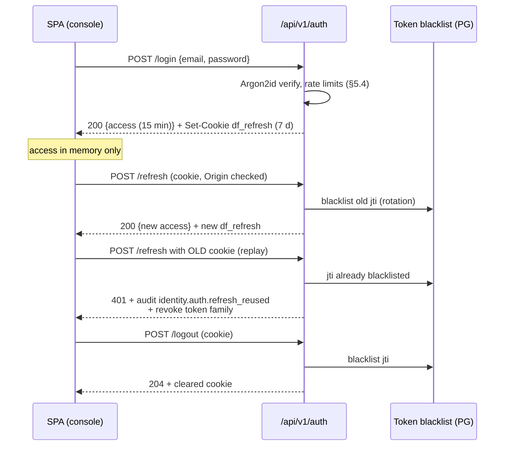
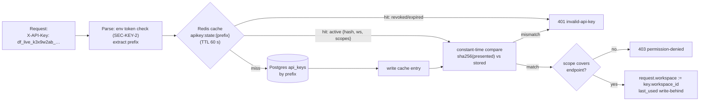
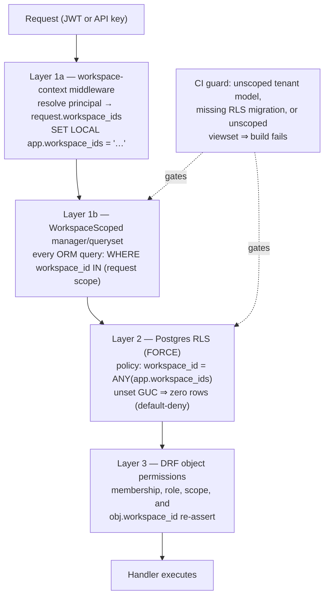

# DataForge — Security Architecture

**Deliverable:** D14

This document is the platform-wide security design: the threat model, the dual authentication system (console JWT + data-plane API keys, ADR-0011), the three-layer tenancy enforcement stack (ADR-0002) with the justification for the "a breach requires two simultaneous failures" claim, the full account lifecycle (email verification, password reset, account deletion, signup abuse controls — the panel gap), the platform view of the untrusted-manifest threat model, transport/storage/secrets security, audit logging requirements, the PII stance and data map, and dependency/CI security. Terminology follows [../03-domain/domain-model.md](../03-domain/domain-model.md) exactly; invariants cited as `INV-*` are defined there. Rules defined here carry stable `SEC-*` IDs so [testing-strategy.md](testing-strategy.md) can bind tests to them. Endpoint shapes and problem types are owned by [../05-interfaces/api-specification.md](../05-interfaces/api-specification.md); infrastructure placement by [../02-architecture/deployment-architecture.md](../02-architecture/deployment-architecture.md).

---

## 1. Security objectives and principles

| # | Objective | Anchor |
|---|---|---|
| O-1 | **No cross-workspace data access, ever** — the single most catastrophic failure mode; defense must survive any one control failing | INV-G-1, ADR-0002, §4 |
| O-2 | Credentials are unrecoverable at rest: no plaintext secret of any kind survives the response that created it | ADR-0011, §3 |
| O-3 | Untrusted input that the platform *executes* (manifests) is bounded before, during, and after acceptance | ADR-0003, §6, plugin spec §13 |
| O-4 | Free compute is abuse-resistant: every resource a free account can consume is quota-capped, rate-limited, and auto-reclaimed | PRD §7, §5.4, §7 |
| O-5 | Ground truth reaches users only through the answer-key surface; delivered payloads never carry internal labels | INV-DEL-2, ADR-0017, event model §5 |
| O-6 | Every security-relevant action is attributable: append-only audit with no mutation surface | INV-AUD-1..4, §10 |
| O-7 | Honesty over theater: where the MVP accepts a risk (single-region, no hash-chained audit, network-isolated internal Kafka), this document says so and names the upgrade trigger | design-review honesty rule |

Operating principles: default-deny (empty workspace context resolves to zero rows, unknown key to 401); least privilege (scoped API keys, role-gated admin surfaces, non-owner DB role); one chokepoint per concern (one auth middleware, one workspace-context middleware, one `strip_internal` function); and fail closed (Redis cache miss falls back to the database, never to "allow").

---

## 2. Threat model

**Assets:** tenant event data (buffer, ledger, stats), workspace configuration (scenario instances, chaos policies), account credentials (password hashes, tokens), API keys, the ground-truth/answer-key record, platform compute (runners, broker, validator), the audit log, and platform secrets.

**Actors:** anonymous internet clients; authenticated tenants (curious or malicious — the *primary* adversary class for a classroom SaaS); an LLM emitting manifests on a tenant's behalf; network attackers (token/key interception); upstream supply-chain attackers; and platform operators (insider risk — partially mitigated, §10.4).

STRIDE letters: **S**poofing, **T**ampering, **R**epudiation, **I**nformation disclosure, **D**enial of service, **E**levation of privilege.

| ID | Threat | Asset | Actor | STRIDE | Mitigations | Residual risk |
|---|---|---|---|---|---|---|
| TM-1 | **Cross-tenant data access**: IDOR on object ids, missed queryset scoping, raw-SQL bypass, leaked Kafka/Redis keyspace | Tenant event data & config | Malicious tenant | E, I | Three-layer stack (§4): scoped managers + CI guard, Postgres RLS backstop, DRF object permissions; `workspace_id` on every row/envelope/partition key/Redis key (INV-TEN-1); permanent cross-tenant attack suite in CI ([testing-strategy.md](testing-strategy.md)); 404-on-foreign-object policy (§3.3) | Breach requires ≥ 2 simultaneous control failures (§4.5) |
| TM-2 | **API-key leakage**: key committed to a repo, pasted in a notebook, captured from logs | Data-plane access to one workspace | External attacker with leaked key | S, I | SHA-256-only storage, shown-once UX (§3.2); greppable `df_<env>_` prefix enables secret-scanner detection; revocation effective < 1 s via Redis (§3.2.4); least-privilege scopes; `last_used_at` anomaly review; SEC-TLS-5 bans credentials in URLs; environment token mismatch → 401 | A leaked, unrevoked key has full scope power until revoked; blast radius = one workspace, capped by quotas |
| TM-3 | **JWT theft**: XSS exfiltration, token interception | Console session | Network attacker, XSS | S | 15-min access tokens; refresh rotation with reuse detection (blacklist-after-rotation, §3.1.3); access token in memory only (never localStorage, ADR-0016); refresh in `HttpOnly` `SameSite=Strict` cookie path-scoped to the refresh endpoint; CSP + security headers (§9.3); TLS everywhere (§9.1) | A stolen access token is valid ≤ 15 min; a stolen refresh token dies at first legitimate rotation (reuse → audit event + family revocation, SEC-AUTH-9) |
| TM-4 | **Untrusted manifests**: pathological state machines, memory/CPU bombs, validator DoS | Platform availability | Tenant / LLM | D | Four rings (plugin spec §13, summarized §6): static bounds B-01…B-17 → closed generator allowlist → seeded dry run → runtime quotas/leases; hooks unreachable from tenant manifests (MAN-V404); validator rate quotas AI-4 (§6.2) | A passing manifest can still be *boring*; cross-tenant impact additionally requires defeating TM-1's stack |
| TM-5 | **Free-tier compute theft**: mass signups × max-TPS streams as a free load generator | Runner/broker/buffer compute | Abuser, botnet | D | Per-IP signup limits + disposable-email policy + optional captcha (§5.4); `is_verified` gate before any tenant-creating command (INV-ID-2); free-tier quotas: 2 concurrent streams, 50 TPS/stream, 100 TPS aggregate, 1M events/day, 2 h idle auto-pause (PRD §7); quota checks at command time (INV-TEN-5); per-key rate limits (RL-8, §5.4) | Quota *enforcement* metering lands Phase 11; Phases 5–10 rely on command-time caps and operator monitoring — accepted pre-GA risk |
| TM-6 | **Webhook SSRF** (Phase 12): tenant-supplied webhook URL targeting internal services or cloud metadata | Internal network, secrets | Malicious tenant | S, I | Contract decided now (§8.3): HTTPS-only, public-IP-only after resolve-then-connect pinning, RFC 1918/link-local/metadata CIDR denylist, no redirect following, dedicated egress identity, response-size/time caps. **Refined in Phase 12** (implementation) | None until the channel ships; the contract freezes before code exists |
| TM-7 | **Supply chain**: malicious or vulnerable dependency, poisoned base image | Everything | Upstream attacker | T, E | Committed lockfiles with hashes, Dependabot, `pip-audit`/`npm audit` CI gates, Trivy image scanning, digest-pinned base images, gitleaks secret scanning (§12) | Zero-days in pinned deps until advisory publication |
| TM-8 | **Ground-truth leakage**: chaos labels or answer-key data reaching delivered payloads (spoils gradability, O-5) | Answer-key integrity | Student, any consumer | I | Strip boundary SB-1…SB-4 (event model §5): single `strip_internal` at sink ingest, `_df` prefix reserved at every nesting level, permanent CI scan of every channel's output; answer-key API gated on workspace `admin` role or `answer_key:read` scope (admin-grantable only); every answer-key access audited | A workspace admin can share the answer key out of band — a classroom-policy matter, not a platform control |
| TM-9 | **Audit tampering**: erasing or rewriting the record | Audit log | Compromised app code, insider | T, R | Append-only by construction (INV-AUD-1): no update/delete API surface; `REVOKE UPDATE, DELETE` on `audit_log` from the runtime DB role (§10.3); migrations run under a separate role; entries written transactionally with their mutation (INV-AUD-2) | Not hash-chained in MVP — a DB-superuser insider could rewrite history; accepted with §10.4's posture and named as post-GA hardening |
| TM-10 | **Account takeover**: enumeration, credential stuffing, reset-token brute force | Accounts | External attacker | S | Uniform `202` on reset/verification requests regardless of account existence (SEC-ACC-6); single-use hashed tokens (24 h / 1 h TTLs, INV-ID-3); Argon2id password hashing (§3.1.1); login rate limits + escalating lockout (§5.4); refresh tokens revoked on password change/reset (SEC-AUTH-10) | Password reuse from external breaches — partially mitigated by the common-password denylist; signup intentionally reveals account existence (`409` on duplicate email — the accepted, rate-bound tradeoff recorded as SEC-ACC-11) |
| TM-11 | **Secrets exposure**: committed env files, secrets in logs or error traces | Platform secrets | Anyone with repo/log access | I | Fly secrets only (§9.2); no `.env` committed (only `.env.example` with placeholders); gitleaks pre-commit + CI; structured-logger redaction list (SEC-TLS-6); RFC 9457 errors never echo secret material | Developer-laptop hygiene is out of platform control |
| TM-12 | **Malicious manifest content** (not load): offensive strings, phishing URLs in `const`/`template` literals | Consumers of a workspace's stream | Tenant author | I | Containment: workspace-visibility manifests deliver only to their own workspace (INV-DEL-6) — the author attacks only themselves; built-in generator pools are synthetic (§11.1); ToS governs literals. The prompt→manifest service (post-MVP) MUST add generation-time content moderation — recorded here as its launch requirement (SEC-MAN-5) | Inside a classroom workspace an admin-authored manifest reaches students; instructors are the trusted party of their own workspace |

---

## 3. Authentication: the duality (ADR-0011)

Two principals, two credentials, one rule: **humans hold JWTs, machines hold API keys, and neither credential works on the other's surface.**

| Surface | Credential | Can do | Cannot do |
|---|---|---|---|
| Console / control plane (`/api/v1/auth/*`, workspaces, members, keys, scenario publishing, account ops) | JWT (SimpleJWT) | Everything membership + role allows | Be minted without a human login |
| Data plane (events, WS tail, stream lifecycle, stats, schemas, answer key) | API key | Exactly its scope set, in exactly one workspace | Manage workspaces, members, keys, or accounts — these JWT-only endpoints do not parse the API-key header at all, so a key there is an absent credential: `401` `authentication-required` (SEC-AUTH-1, api spec A-2) |

On the wire: JWTs ride `Authorization: Bearer <access-token>`; API keys ride `X-API-Key: df_…` ([../05-interfaces/api-specification.md](../05-interfaces/api-specification.md) §2.2). A request presenting both headers fails `400` `ambiguous-credentials` — every request authenticates as exactly one principal. JWTs are also accepted on data-plane *read* endpoints for console convenience (the monitoring page), subject to membership checks; API keys are never accepted on identity/tenancy management endpoints.

### 3.1 Console authentication — SimpleJWT

#### 3.1.1 Password policy and hashing

| Aspect | Decision |
|---|---|
| Hash algorithm | **Argon2id** (`Argon2PasswordHasher` first in `PASSWORD_HASHERS`); parameters: `time_cost=2`, `memory_cost=102400` KiB (100 MiB), `parallelism=8` — Django's audited defaults, revisited at GA |
| Password rules | Length 10–128 (the `≥ 10` boundary surfaced in api spec §4.1); common-password denylist (Django `CommonPasswordValidator` list); no composition rules (NIST 800-63B posture); user-attribute similarity check |
| Upgrade-on-login | Hashes transparently re-hashed on successful login if parameters changed |
| Storage | `users.password` column only; never logged, never in audit metadata (INV-AUD-3) |

#### 3.1.2 SimpleJWT configuration (frozen defaults)

| Setting | Value | Rationale |
|---|---|---|
| `ACCESS_TOKEN_LIFETIME` | **15 minutes** | Bounds stolen-access-token utility (TM-3); short enough that access tokens need no blacklist |
| `REFRESH_TOKEN_LIFETIME` | **7 days** | Weekly re-login; classroom-friendly |
| `ROTATE_REFRESH_TOKENS` | `True` | Every refresh issues a new refresh token |
| `BLACKLIST_AFTER_ROTATION` | `True` | The consumed refresh token is blacklisted; replaying it is detectable (SEC-AUTH-9) |
| `ALGORITHM` / `SIGNING_KEY` | `HS256` / dedicated 256-bit `JWT_SIGNING_KEY` Fly secret — **never** `DJANGO_SECRET_KEY` | Single issuer/verifier (web + ws process groups share the image and secrets); key separation limits blast radius |
| Blacklist storage | `rest_framework_simplejwt.token_blacklist` app (Postgres `OutstandingToken`/`BlacklistedToken`) | Survives Redis flushes; refresh volume is low |
| `UPDATE_LAST_LOGIN` | `True` | Feeds activation metrics (PRD §8) |
| Access-token claims | `sub` (user_id), `jti`, `iat`, `exp`, `token_type`, `is_verified` | **No workspace claim** — membership is checked per request (§4.1), so role/membership changes take effect immediately, never at token expiry |

#### 3.1.3 Token transport and session flows

| Rule | Statement |
|---|---|
| SEC-AUTH-2 | The access token is returned in the login/refresh response body and held **in memory** by the SPA (ADR-0016). It is never written to `localStorage`, `sessionStorage`, or any cookie. |
| SEC-AUTH-3 | The refresh token is set as a cookie `df_refresh`: `HttpOnly; Secure; SameSite=Strict; Path=/api/v1/auth; Max-Age=604800`. It is never present in a response body. |
| SEC-AUTH-4 | The refresh endpoint additionally validates the `Origin` header against the console origin allowlist; mismatch → `403`. (`SameSite=Strict` + origin check = CSRF defense without Django session CSRF machinery on JWT endpoints.) |
| SEC-AUTH-5 | Logout blacklists the presented refresh token's `jti` (under rotation the only live token in its family, so the family is dead) and clears the cookie (`Max-Age=0`). Access tokens are not blacklisted — their ≤ 15-min remaining life is the accepted window, stated in user docs. |
| SEC-AUTH-9 | Presentation of a blacklisted refresh token (rotation replay — the stolen-token signature) returns `401` `authentication-required`, writes audit event `identity.auth.refresh_reused`, and revokes **all** outstanding refresh tokens for that user (family revocation). The user re-authenticates with their password. |
| SEC-AUTH-10 | Password **reset** completion and account-deletion request revoke all outstanding refresh tokens for the user; password **change** (`POST /users/me/password`, authenticated) revokes all *except the current session's* (api spec §4.2) — the user who just proved their password is not logged out. Workspace API keys are **unaffected** by any of these (machine credentials have an independent lifecycle, §3.2) — stated explicitly so instructors know a password reset never kills a running classroom lab. |



### 3.2 Data-plane authentication — API keys

#### 3.2.1 Key format (frozen)

```
df_<env>_<prefix>_<secret>
   │      │        └── 30 chars base62 from a CSPRNG (≈ 178 bits entropy)
   │      └── 8 chars [a-z0-9], unique per key, stored plaintext (the lookup handle)
   └── environment token: live | stg | dev
```

Example: `df_live_k3x9w2ab_Tr8KpVn4mQz7LcYd2Fh6Bj0RwSx1GeNu`. The token maps from the server's `DF_ENV` (`dev` ⇒ `dev`, `staging` ⇒ `stg`, `prod` ⇒ `live`); SEC-KEY-2 compares against this mapping, so a production server accepts only `df_live_` keys. This table owns the token list — deployment/backend docs cite it.

| Rule | Statement |
|---|---|
| SEC-KEY-1 | The `df_` prefix is registered with secret-scanning tooling (gitleaks rule in our CI from Phase 2; GitHub secret-scanning partner registration at GA) so leaked keys are machine-detectable (TM-2). |
| SEC-KEY-2 | The environment token must match the server's environment; a `df_dev_*` key presented to production → `401`. Prevents key promotion across environments and dev-key habits leaking into prod. |
| SEC-KEY-3 | Storage per ADR-0011 and INV-TEN-4: `sha256(full key string)` + `prefix` + `last4` (last 4 of the secret) only. SHA-256 (not Argon2) is correct here and deliberate: the secret carries ≥ 178 bits of CSPRNG entropy, so offline brute force is infeasible without slow hashing, and verification must run at data-plane request rates (sub-millisecond). Slow hashes defend low-entropy human passwords; high-entropy machine secrets need only preimage resistance. |
| SEC-KEY-4 | **Shown-once UX:** the plaintext key appears exactly once, in the `201` creation response (and the console reveal-once dialog rendered from it). No retrieval endpoint exists; "I lost it" = revoke + reissue. The creation response is excluded from response logging. |

#### 3.2.2 Scopes

Scope vocabulary is fixed by the domain model (§2.2); the endpoint mapping is contracted here and enforced by a single DRF permission class (`HasKeyScope`):

| Scope | Grants | Default on creation |
|---|---|---|
| `events:read` | REST cursor pulls, WS tail, backfill downloads | yes |
| `streams:read` | Stream list/get, stats | yes |
| `streams:write` | Start/pause/resume/stop, TPS changes, chaos-policy changes | no |
| `schemas:read` | Registry read API | no |
| `answer_key:read` | Answer-key endpoints (ADR-0017) | no — grantable **only by a workspace admin** (INV-TEN-4 scope rule); a member creating a key cannot self-grant it |

A key is bound to exactly one workspace forever; there is no key scope that crosses workspaces, and no "all workspaces" key exists at any tier.

#### 3.2.3 Verification path



#### 3.2.4 Revocation and the < 1 s contract

| Rule | Statement |
|---|---|
| SEC-KEY-5 | Revocation (by the key's creator or any workspace admin, domain model §5) executes in one transaction: DB `state := revoked`, then a **synchronous** Redis write `apikey:state:{prefix} = revoked` (TTL 48 h) before the API responds `204`. Every verification consults this cache first, so the revoked key is rejected platform-wide in well under 1 s (Phase 2 exit criterion). |
| SEC-KEY-6 | Cache entries for active keys carry TTL 60 s; therefore the *worst-case* staleness if the synchronous Redis write fails (Redis degraded) is 60 s, after which the DB truth wins. A failed revocation cache write enqueues a Celery retry and logs `tenancy.api_key.revocation_cache_degraded`. Stated honestly: the < 1 s contract holds under normal operation; the degraded bound is 60 s. |
| SEC-KEY-7 | If Redis is entirely unavailable, verification falls back to direct DB reads — fail closed to *slower*, never to *allow*. |
| SEC-KEY-8 | Workspace deletion cascades revocation of all its keys in the same pattern (INV-TEN-6). Key expiry (`expires_at`) is evaluated on every verification (cheap timestamp compare) and lazily transitions state; `revoked` and `expired` are terminal. |
| SEC-KEY-9 | `last_used_at` is write-behind: verification touches `apikey:last_used:{api_key_id}` in Redis; a Celery beat task flushes to Postgres every 60 s at minute precision (domain model §5). Loss of a flush window loses only usage telemetry, never auth correctness. |

### 3.3 The 401 / 403 / 404 policy (cross-tenant response contract)

The single table the domain model (§5) delegates here. Problem-type slugs come from the closed catalog owned by [../05-interfaces/api-specification.md](../05-interfaces/api-specification.md) §2.7.1; this table fixes which one each security situation maps to. Applies uniformly to JWT and API-key auth, REST and WS (WS close codes mapped in the api spec):

| Situation | Response | Rationale |
|---|---|---|
| Missing, malformed, or expired JWT on a JWT surface | **401** `authentication-required` | Authentication failed; nothing about resources is revealed |
| Bad email/password at login | **401** `authentication-failed` | Distinct slug for the login form's UX; reveals nothing a login attempt doesn't already imply |
| Missing, unknown, revoked, or expired API key; wrong env token | **401** `invalid-api-key` | One slug for every key failure (api spec A-3) — no key-state oracle distinguishing unknown from revoked from expired from wrong-environment |
| Both `Authorization` and `X-API-Key` headers present | **400** `ambiguous-credentials` | Exactly one principal per request (api spec A-2) |
| Valid credential of the **wrong type** for the surface | **401** as the rows above | The surface never parses the other credential type — it is treated as absent (SEC-AUTH-1), confirming nothing about why |
| Valid credential, insufficient scope (key) or role (JWT) **within its own workspace** | **403** `permission-denied` + `required_scope` / `required_role` extension member | The resource exists and the caller may know it; the missing privilege is named so it is fixable |
| Valid credential, target object belongs to a **foreign workspace** — or does not exist | **404** `not-found` | Existence of foreign resources is never confirmed; foreign and nonexistent are indistinguishable by status code (api spec W-3 masking), timing-normalized by the scoped-queryset lookup (the query simply returns no row) |
| Unverified user attempting a tenant-creating command (INV-ID-2) | **403** `email-not-verified` | Authenticated but gated |

SEC-AUTH-11: the cross-tenant attack suite asserts this table exhaustively — every endpoint × foreign-workspace credential must yield 404 (object routes) or an empty, correctly-scoped collection (list routes), never 200-with-data and never `permission-denied` (which would confirm existence).

---

## 4. Tenancy enforcement in depth

The stack implements ADR-0002 and INV-G-1. Three independent layers; each is sufficient to stop the canonical bug class of the layer above it.



### 4.1 Layer 1 — workspace-context middleware + mandatory scoped managers + CI guard

**Middleware.** One middleware, after authentication, resolves the request's workspace scope:

| Principal | `request.workspace_ids` |
|---|---|
| API key | Exactly the key's one `workspace_id` |
| JWT user | The set of `workspace_id`s of the user's memberships (resolved per request — no stale token claims, §3.1.2) |
| Unauthenticated / no memberships | Empty set |

It then issues `SET LOCAL app.workspace_ids = '<comma-joined uuids>'` on the request's transaction (`ATOMIC_REQUESTS = True`), arming Layer 2. Data-plane processes outside the request cycle — runners, Celery tasks, sinks — set the same GUC scoped to the single workspace of the stream or job they are executing; a data-plane unit of work never holds a multi-workspace scope (INV-STR-6).

**Scoped managers.** Every tenant-owned model inherits `WorkspaceScopedModel` (non-null `workspace_id` FK, indexed) and its **default manager** is `WorkspaceScopedManager`, whose `get_queryset()` requires an active workspace context and filters `workspace_id ∈ request scope`; with no context it returns `.none()`. The escape hatch `Model.all_objects` (unscoped) exists for platform internals only and every use site must carry a `# tenancy: unscoped — <reason>` marker that the CI guard counts and diffs against a checked-in allowlist.

**CI guard (Phase 2 exit criterion: a planted unscoped model fails the build).** A test job that:

1. Introspects every installed model. Models are classified tenant-owned iff they declare `workspace_id` **or** appear in neither classification — i.e. the classification is *closed*: every model must be (a) tenant-owned and correctly scoped, or (b) explicitly listed in `tenancy_exempt.py` (identity tables, global catalog rows, token blacklist, Django internals) with a one-line justification. An unclassified model fails.
2. Asserts every tenant-owned model subclasses `WorkspaceScopedModel` with `WorkspaceScopedManager` as `objects`.
3. Asserts every tenant-owned table's migration history contains the custom `EnableRowLevelSecurity` operation (ENABLE + FORCE + policy), by inspecting migration plans — RLS coverage cannot silently lag schema growth.
4. Asserts every DRF viewset subclasses `WorkspaceScopedViewSet` or is in the exempt list (auth endpoints, health probes).
5. Fails on any `all_objects` use site absent from the allowlist.

### 4.2 Layer 2 — Postgres Row-Level Security (the backstop)

Enabled from Phase 2 on every tenant table, in the same migration that creates the table (full DDL in [../03-domain/database-schema.md](../03-domain/database-schema.md)); the pattern:

```sql
ALTER TABLE streams ENABLE ROW LEVEL SECURITY;
ALTER TABLE streams FORCE ROW LEVEL SECURITY;   -- applies even to the table owner
CREATE POLICY tenant_isolation ON streams
  FOR ALL
  USING (workspace_id = ANY (
    string_to_array(current_setting('app.workspace_ids', true), ',')::uuid[]
  ));
```

| Rule | Statement |
|---|---|
| SEC-TEN-1 | `current_setting(..., true)` returns `NULL` when the GUC is unset; `ANY(NULL)` is never true — **an unarmed connection sees zero tenant rows.** Default-deny is structural. |
| SEC-TEN-2 | The runtime role `dataforge_app` is **not** the table owner and has no `BYPASSRLS`; `FORCE` covers the owner anyway. Migrations run as `dataforge_migrate` (owner). Only operator break-glass psql uses a `BYPASSRLS` role, access to which is audited at the infrastructure level (§10.4). |
| SEC-TEN-3 | RLS is verified *independently of the ORM* in CI: the attack suite opens a raw psql connection, sets a foreign workspace GUC, and asserts zero visible rows per tenant table (Phase 2 exit criterion "RLS verified independently with ORM bypassed"). |
| SEC-TEN-4 | High-volume data-plane writers (ledger append, buffer writer) run with the GUC set per stream batch; RLS `WITH CHECK` thus also blocks cross-workspace *writes*, not just reads. Measured RLS overhead on the buffer write path is a Phase 5 perf gate; the policy is a single indexed-column comparison and budgeted at < 3% ([../02-architecture/scaling-strategy.md](../02-architecture/scaling-strategy.md) carries the arithmetic). |

### 4.3 Layer 3 — DRF object-level permission checks

The authorization layer — distinct from isolation. `WorkspaceScopedViewSet` composes:

| Permission class | Asserts |
|---|---|
| `IsAuthenticatedPrincipal` | A valid JWT user or API key resolved |
| `IsWorkspaceMember` | JWT: membership in the target workspace; key: binding to it |
| `IsWorkspaceAdmin` | Role `admin` for member management, key administration over others' keys, quota views, answer-key access via JWT, manifest publishing |
| `HasKeyScope` | Key requests: scope covers the endpoint's declared required scope (§3.2.2) |
| `has_object_permission` | Re-asserts `obj.workspace_id ∈ request.workspace_ids` on every object — a belt over the already-scoped queryset, so a future `all_objects` misuse in a viewset still cannot serve a foreign object |

Layer 3 is what turns "you cannot *see* foreign data" (layers 1–2) into "you cannot do *this verb* even on your own data without the role/scope" — TM-1's E column and TM-8's gate both live here.

### 4.4 Beyond Postgres: the non-SQL surfaces

INV-TEN-1 extends the same discipline to every keyspace, enforced by construction and tested by the attack suite:

| Surface | Enforcement |
|---|---|
| Kafka | `partition_key` mandatorily prefixed `{workspace_id}:` (event model §2.2.3); consumers (sinks) filter on envelope `workspace_id`; no user ever touches internal topics (ADR-0005) |
| Redis | Every tenant-state key is namespaced `ws:{workspace_id}:…` (pools, stats, leases carry the stream's workspace); the revocation/rate-limit keys are platform-level and carry no tenant data |
| WS channel layer | Channel groups named `ws:{workspace_id}:stream:{stream_id}`; group membership requires the same auth as REST (§3) |
| Object downloads (backfill JSONL) | Generated under workspace-scoped storage prefixes; download URLs are short-lived signed URLs bound to the requesting principal |

### 4.5 Why "a breach requires two simultaneous failures" is true

The claim (INV-G-1, NFR table in [../01-product/prd.md](../01-product/prd.md) §9) is justified by independence: layers 1 and 2 share no code path, no configuration file, and no failure trigger.

| Failure scenario | Layer 1 outcome | Layer 2 outcome | Data leaked? |
|---|---|---|---|
| Developer ships a model without the scoped manager | CI guard fails the build — scenario does not reach production. Suppose it somehow does: queries are unscoped | Policy still filters by the request's GUC | **No** |
| Raw SQL / `.extra()` / report query bypasses the ORM | Layer 1 has no purchase | RLS filters at the database | **No** |
| Middleware bug leaves the GUC unset | Scoped manager still filters (it reads request scope, not the GUC) | Unset GUC ⇒ zero rows (SEC-TEN-1) | **No** — and the symptom is *missing own data*, which gets reported immediately |
| RLS policy missing on a new table | CI guard step 3 fails the build. Suppose it ships: | No backstop on that table | **No** — layer 1 still scopes every ORM path; only a *simultaneous* ORM bypass on *that same table* leaks |
| Both: unscoped query path **and** missing/disabled policy on the same table | Bypassed | Absent | **Yes — this is the two-simultaneous-failures case** |

Layer 3 does not count toward the isolation claim (it shares request-context machinery with layer 1); it independently covers the *authorization* dimension. The permanent cross-tenant attack suite ([testing-strategy.md](testing-strategy.md)) keeps both walls honest: it probes every endpoint with foreign credentials (exercising 1+3) *and* probes raw SQL under foreign GUCs (exercising 2 alone), every CI run, forever.

---

## 5. Account lifecycle

Identity-context flows (domain model §2.1). All tokens in this section are 32-byte URL-safe CSPRNG values, **stored as SHA-256 hashes**, single-use, and constant-time compared — the plaintext exists only inside the email.

### 5.1 Email verification

| Aspect | Contract |
|---|---|
| Trigger | Signup (`POST /api/v1/auth/signup`) creates the user `is_verified = false` and sends the verification email; resend endpoint rate-limited (§5.4) |
| Token | TTL **24 h** (INV-ID-3); reissue invalidates prior tokens; consumption sets `is_verified = true` and writes audit `identity.user.email_verified` |
| Gate | Unverified users can log in to the console (they see a verify-prompt shell) but every tenant-creating command — create workspace, accept invitation, create API key — requires `is_verified = true` (INV-ID-2) and returns `403` `email-not-verified` otherwise. This gate is the first abuse control: an unverified bot army owns nothing that consumes compute (TM-5) |
| Link | Email contains a console URL with the token as a path parameter over HTTPS; the console exchanges it via `POST /api/v1/auth/verify-email`. Tokens never appear in server request logs (path-parameter redaction, SEC-TLS-6) |
| Email change | Treated as re-verification: new address stored unverified alongside, swap committed only on token consumption; both addresses notified (account-takeover tripwire). The endpoint ships with the console account-settings page (Phase 7, additive to the `v1` catalog); the behavior contract is fixed now |

### 5.2 Password reset

```mermaid
sequenceDiagram
    participant U as User
    participant C as Console
    participant A as /api/v1/auth
    participant E as Email provider
    U->>C: "Forgot password" (email)
    C->>A: POST /password-reset {email}
    A->>A: rate limits (§5.4); look up account
    A-->>C: 202 Accepted — always, account or not (SEC-ACC-6)
    A->>E: send reset link (only if account exists & verified)
    U->>C: open link (token, TTL 1 h)
    C->>A: POST /password-reset/confirm {token, new_password}
    A->>A: hash-compare token, single-use burn (INV-ID-3)
    A->>A: set Argon2id hash; revoke ALL refresh tokens (SEC-AUTH-10)
    A-->>C: 200; audit identity.user.password_reset
    A->>E: "your password was changed" notice
```

| Rule | Statement |
|---|---|
| SEC-ACC-6 | The request endpoint returns `202` with an identical body and statistically indistinguishable latency whether or not the account exists (the email send is async) — no account enumeration (TM-10). The same uniformity applies to the verification resend endpoint. |
| SEC-ACC-7 | Token TTL **1 h**; invalidated by use, reissue, or any password change (INV-ID-3). Reset completion revokes every outstanding refresh token; API keys are untouched (SEC-AUTH-10). |
| SEC-ACC-8 | Reset for an unverified account is not sent (nothing to protect yet; the signup flow re-sends verification instead). |
| SEC-ACC-11 | **Signup enumeration — accepted tradeoff:** `POST /auth/signup` with an already-registered email returns `409` `conflict` (api spec §4.1), revealing that the account exists. Hiding it would strand real users who forgot they registered; the oracle is rate-bound by RL-1 (5/h + 20/day per IP) while the reset/resend paths stay uniform per SEC-ACC-6. Recorded here because the api spec delegates this rationale to the security architecture. |

### 5.3 Account deletion

```mermaid
stateDiagram-v2
    active --> pending_deletion : DELETE /users/me<br/>(password re-auth; sole-admin guard passes)
    pending_deletion --> active : user cancels within grace<br/>(login → "restore account")
    pending_deletion --> deleted : 7-day grace elapsed<br/>(Celery scrub job)
    deleted --> [*]
```

| Aspect | Contract |
|---|---|
| Guards | `DELETE /users/me` with password re-authentication in the body (api spec §4.2). INV-ID-4 / INV-TEN-3: deletion is **blocked** (`409` `conflict`, `detail` naming the blocking workspaces) while the user is the sole admin of **any** workspace — they must promote another admin or explicitly delete the workspace first (`DELETE /workspaces/{id}`, which cascades per INV-TEN-6: keys revoked via the §3.2.4 path, streams stopped, buffer/checkpoint rows dropped, audit trail tombstoned — never silently dropped). Account deletion never deletes a workspace implicitly. |
| Immediate effects (request time) | Account state `pending_deletion`; all refresh tokens revoked; console sessions end. All memberships removed — by construction none is a sole-admin membership (the guard already forced a transfer or an explicit workspace deletion, both enumerated in the confirmation dialog). |
| Grace period | **7 days.** Logging in during grace offers one-click restore (memberships are *not* restored — they were genuinely removed). Grace exists because classroom accounts get deleted by accident at semester end. |
| Scrub (grace elapsed) | Celery job hard-scrubs PII: `email` replaced by the sentinel `deleted:{user_id}` (preserves INV-ID-1 case-insensitive uniqueness for non-deleted users), password hash erased, all verification/reset tokens deleted, `deleted_at` set. The `users` row survives as a tombstone so audit-entry actor references stay resolvable — but resolvable only to a pseudonymous id (§11.2). |
| What survives deletion | Audit entries (actor = bare `user_id`, INV-AUD-4 visibility now operator-only), aggregate platform metrics, and other-workspace data the user merely touched (events they triggered in a classroom workspace belong to the workspace, not the student). |
| Audit | `identity.user.deletion_requested`, `.deletion_cancelled`, `.deleted` — the final entry is written by the scrub job. |

### 5.4 Signup abuse controls

The platform-wide abuse-control register. All limits are Redis token buckets keyed as shown, enforced in middleware before view code, returning `429` with `Retry-After` (problem type `rate-limited`). IP keys honor `Fly-Client-IP` from the trusted edge only. Where a row names a bucket in backticks, the sustained/burst values are part of the wire contract owned by [../05-interfaces/api-specification.md](../05-interfaces/api-specification.md) §2.8 (restated here, never diverging); the unbucketed rows are the security-owned supplements that the api spec explicitly delegates ("anti-abuse tuning beyond these values").

| # | Action | Limit | Key | Notes |
|---|---|---|---|---|
| RL-1 | Signup | `auth-public`: 5 / h (burst 3); plus 20 / day supplement | per IP | The front door (TM-5) |
| RL-2 | Login | `auth-login`: 10 / min per IP; 20 / h per account (burst 5) | IP + account | Plus escalating lockout (security-owned): 1-min lock after 5 consecutive failures, 15-min after 10; counters reset on success. Lockout responses are identical to bad-password responses — `401` `authentication-failed` either way (no oracle) |
| RL-3 | Verification email resend | `auth-public`: 5 / h per IP; plus 3 / h per account supplement | IP + account | |
| RL-4 | Password-reset request | `auth-public`: 5 / h per IP; plus 3 / h per account supplement | IP + account | |
| RL-5 | Refresh | 60 / h | per user | Generous; catches scripted refresh storms (security-owned — refresh is not in an api-spec bucket) |
| RL-6 | Manifest validation runs | `validator`: 30 / h per workspace (burst 5); ≤ 20 draft versions; 1 L3 job in flight | workspace | = AI-4 of the plugin spec (§6.2) |
| RL-7 | Key creation | 10 / h per user (inside the `console` bucket: 120 / min per user) | user | Within the plan's keys-per-workspace cap (PRD §7) |
| RL-8 | Data-plane, per API key | `data-events`: 600 / min (burst 100); `data-control`: 60 / min (burst 20); `data-batch`: 6 / min (burst 2); `ws-connect`: 10 / min (burst 5) | key | Values fixed now in api spec §2.8; metering/enforcement wiring **refined in Phase 11** (what exists until then: the middleware and limits on auth/validation endpoints above, which ship in Phase 2/3) |
| RL-9 | Unauthenticated, any endpoint | 30 / min | per IP | Backstop (security-owned) |

**Disposable-email policy (SEC-ACC-9):** signup against a domain on the vendored disposable-domain denylist (the `disposable-email-domains` dataset, updated via Dependabot) is rejected with `400` `validation-error` carrying `errors[0] = {"field": "email", "code": "disposable_email_domain"}` (the problem-type catalog is closed for MVP; this rides the standard validation shape). Controlled by `SIGNUP_DISPOSABLE_EMAIL_BLOCK` (default `true` in production). The check applies at signup only — invitations still require the invitee to sign up, so the same gate covers them.

**Captcha hook (SEC-ACC-10):** a server-side verification interface with providers `none | turnstile`, selected by `SIGNUP_CAPTCHA_PROVIDER` (default `none`). When enabled, signup and password-reset-request require a valid captcha token. The hook ships (interface + Turnstile implementation) in Phase 2; enabling it is a config flip reserved for observed abuse — activation is the documented first response in the abuse runbook.

**Default quotas as abuse control:** every new workspace receives the Free-tier quota row (PRD §7) — 2 concurrent streams, 50 TPS/stream, 100 TPS aggregate, 1M events/day, 2 h idle auto-pause, 5 keys. A fully weaponized free account is therefore worth ≤ 100 TPS of synthetic JSON for ≤ 2 idle-monitored hours — deliberately not worth stealing (TM-5).

---

## 6. Untrusted manifests — platform view

The engine-side threat model (T-1…T-9) and the four defense rings — **static bounds (B-01…B-17) → generator allowlist → seeded dry run → runtime quotas/leases** — are owned by [../04-engines/scenario-plugin-architecture.md](../04-engines/scenario-plugin-architecture.md) §13 and are not restated here. This section adds what only the platform layer can:

### 6.1 Trust and capability boundaries

| Boundary | Rule |
|---|---|
| Validation | No trust gradient: builtin, human, and LLM manifests pass the identical pipeline (plugin P-5). A builtin failing validation aborts the release. |
| Capability | `hook` generators (the only code-execution surface) are reachable **only** from `global`-visibility, platform-code-reviewed manifests; any `workspace`-visibility manifest containing a hook fails validation (MAN-V404). Tenant and LLM input is therefore *data all the way down* — there is no tenant-reachable code-execution path. |
| Visibility | Workspace manifests are tenant-owned rows (INV-CAT-6) under the full §4 stack; promotion to `global` is a platform code-review act, never an API call (plugin AI-3). |
| Blast radius | A pathological manifest that survives all rings degrades *its own stream's* runner budget (lease-isolated, token-bucket-paced, quota-capped — plugin T-7); cross-tenant impact additionally requires defeating §4. |

### 6.2 Platform-enforced quotas around the validator

| Quota | Value | Enforced by |
|---|---|---|
| Validation runs | 30 / workspace / hour (RL-6 = plugin AI-4) | rate-limit middleware §5.4 |
| Draft manifest versions | ≤ 20 per workspace | catalog command check |
| L3 dry-run jobs | 1 in flight per workspace; dedicated Celery queue with worker-level concurrency cap so dry runs never starve control-plane tasks | Celery routing ([../02-architecture/backend-architecture.md](../02-architecture/backend-architecture.md)) |
| Registry subjects | ≤ 500 per workspace across its workspace-visibility scenarios (closes plugin T-5's "per-workspace subject quota" pointer; B-05's 250/scenario still applies per manifest) | registry registration check |

### 6.3 AI-manifest launch requirement

SEC-MAN-5: the prompt→manifest generation service (post-MVP, plugin §12) MUST NOT launch without (a) generation-time content moderation on produced literals (TM-12), (b) per-workspace generation quotas at most equal to RL-6, and (c) the validator error contract (no document echo beyond pointed-at values, plugin AI-2) re-verified against prompt-injection amplification. Recorded now so the launch gate exists before the feature team does.

---

## 7. Free-tier abuse and compute protection

§5.4 stops bulk account creation; this section bounds what any one paying-nothing workspace can burn (TM-5):

| Control | Mechanism | Phase |
|---|---|---|
| Command-time quota checks | Start/TPS-raise/backfill rejected synchronously when over plan caps (INV-TEN-5) | 5 |
| Per-stream and aggregate TPS caps | Token-bucket pacing in runners honors the quota ceiling regardless of requested `target_tps` | 5–6 |
| Events/day metering | Counted from stream stats; exhaustion system-pauses streams (`paused_quota`, never deletes) | **Refined in Phase 11** — until then the TPS caps bound the daily ceiling arithmetically (50 TPS × 86,400 s ≈ 4.3M >1M, so the day-quota is the binding constraint only after metering lands; pre-GA this is an accepted gap, visible in operator dashboards) |
| Idle auto-pause | No authenticated consumption on any channel for the plan's idle window (Free: 2 h) → system pause (`paused_idle`), audit-logged, one-click resume. Observation *signals*; Stream Control *commands* (INV-OBS-1) | 11 |
| Max-TPS chaos amplification | `duplicates` rate ≤ 0.5 (B-16) caps amplification at 1.5×; amplified output still counts against TPS/day quotas (quota accounting is post-chaos) | 9 |
| Backfill caps | Free: 7 simulated days / 1M events per batch (PRD §7), checked at request time | 4 |
| Runner protection | Lease-based shard placement + per-stream pacing → a noisy stream cannot starve co-located shards (plugin T-7, ADR-0006) | 5 |

---

## 8. Delivery-channel security

### 8.1 MVP channels (REST, WS)

| Rule | Statement |
|---|---|
| SEC-DLV-1 | Strip boundary per event model §5: every sink calls `strip_internal` at ingest (SB-2); `_df` never leaves the platform (SB-1/3); answer-key data flows only through its gated API (SB-4, TM-8). |
| SEC-DLV-2 | **No credentials in URLs**, ever: REST uses the `X-API-Key` header (JWTs: `Authorization: Bearer`, api spec §2.2); WS authenticates via a first-message `auth` frame within **10 s** of connect — a missed deadline closes `4408`, a credential in the URL closes `4401` (frame shape and close codes owned by [../04-engines/delivery-channels.md](../04-engines/delivery-channels.md) WS-2/WS-3). Query-string keys leak into proxy and access logs — banned at the contract level. |
| SEC-DLV-3 | WS connections are bound at auth time to one `(workspace, stream)` channel group (§4.4); a connection can never be re-pointed across workspaces; subprotocol version mismatches close, never downgrade silently. |
| SEC-DLV-4 | Backfill JSONL downloads use signed URLs with **10-minute** expiry, single workspace binding, and no listing surface. |

### 8.2 External Kafka (Phase 12) — decided contract

Per-workspace topics with per-workspace SASL/SCRAM-SHA-256 credentials and broker ACLs allowing exactly `Read` on the workspace's prefixed `df.{workspace_id}.` topics and the matching consumer groups (delivery-channels §7.3); credentials follow the API-key lifecycle pattern (hashed at rest where the broker permits, shown once, revocable; revocation deletes the SCRAM user — new connections fail immediately, live sessions die at re-authentication via `connections.max.reauth.ms = 300000`, fully effective ≤ 5 min — delivery-channels §7.2). Negative test fixed now: foreign credentials must fail to read any other workspace's topic (Phase 12 exit criterion). **Refined in Phase 12:** provisioning UX and the managed-broker migration (ADR-0015 trigger); what exists until then is this contract plus the internal-only broker posture (§9.1).

### 8.3 Webhook egress (Phase 12) — decided anti-SSRF contract (TM-6)

| # | Rule |
|---|---|
| SSRF-1 | Webhook URLs must be `https://` with a publicly resolvable hostname; literal IPs rejected at configuration time. |
| SSRF-2 | **Resolve-then-connect pinning:** the dispatcher resolves DNS, validates every resolved address against the denylist, and connects to the validated address (Host header preserved) — defeating DNS-rebinding between check and use. |
| SSRF-3 | Denylist: RFC 1918, 127.0.0.0/8, 169.254.0.0/16 (cloud metadata), ::1, fc00::/7, fe80::/10, 100.64.0.0/10, and the platform's own private network ranges. |
| SSRF-4 | HTTP redirects are not followed. Response bodies are discarded after reading ≤ 4 KiB for status logging; total request timeout 10 s. |
| SSRF-5 | Dispatch runs in the worker process group under an egress identity that holds no platform secrets and no internal-network privileges beyond Redis/Postgres job state. |
| SSRF-6 | Payloads are HMAC-SHA256-signed (`DF-Webhook-Signature: t=<ts>,v1=<hex>` — header contract owned by delivery-channels §8.2) with a per-endpoint secret shown once at configuration; timestamp tolerance ±5 min (replay bound). |

**Refined in Phase 12** (implementation + retry/DLQ mechanics in [../04-engines/delivery-channels.md](../04-engines/delivery-channels.md)); the rules above are frozen now so the sink is designed against them.

---

## 9. Transport, storage, and secrets

### 9.1 Transport matrix

| Hop | Protection | Notes |
|---|---|---|
| Client → Fly edge | TLS 1.2+ (1.3 preferred), HSTS (§9.3) | Edge terminates TLS; `Fly-Client-IP` trusted from edge only |
| Edge → app processes (web/ws) | Fly private network (WireGuard-encrypted 6PN) | |
| App ↔ Postgres / Redis (managed) | TLS required (`sslmode=require` / `rediss://`) | Connection strings are secrets |
| App/runners ↔ internal Kafka | **Private network only — no public listener, no SASL in MVP.** Stated honestly: MVP broker auth is network isolation (single-tenant private 6PN, ADR-0015); SASL/ACLs arrive with the external-channel work (Phase 12 / managed-Kafka trigger), which is also when multi-party access first exists | The upgrade trigger is pre-committed (ADR-0015) |
| Dev (Docker Compose) | Plaintext permitted, documented dev-only; compose default credentials never valid in any deployed environment (distinct secrets per env, §9.2) | |

### 9.2 Secrets management

| Rule | Statement |
|---|---|
| SEC-TLS-1 | All secrets are injected via `fly secrets` (runtime env) per environment; CI secrets live in the CI provider's encrypted store. **No secret value ever appears in a committed file** — the repo carries only `.env.example` with placeholder values, and gitleaks (pre-commit + CI) enforces it (TM-11). |
| SEC-TLS-2 | Secret inventory (each distinct per environment — a dev secret never works in prod): `DJANGO_SECRET_KEY`, `JWT_SIGNING_KEY` (§3.1.2), `DATABASE_URL`, `REDIS_URL`, email-provider API key, captcha secret (when enabled), Fly deploy tokens (CI only). Kafka bootstrap addresses are config, not secrets, until SASL exists. |
| SEC-TLS-3 | Rotation: 90-day cadence or immediately on suspected exposure. `JWT_SIGNING_KEY` rotation invalidates all outstanding tokens (users re-login; ≤ 15-min access tokens bound the disruption) — documented as a break-glass runbook action rather than building dual-key verification the MVP doesn't need. Database/Redis credential rotation follows the managed providers' standard two-credential swap. |
| SEC-TLS-4 | Django `DEBUG = False` in every deployed environment; error responses are RFC 9457 problem details with no stack traces; tracebacks go to structured logs only. |
| SEC-TLS-5 | Credentials never appear in URLs (SEC-DLV-2) and never in client-side storage beyond §3.1.3's rules. |
| SEC-TLS-6 | The structured logger applies a redaction list before emission: `Authorization` headers, cookie values, any field named `password`, `token`, `secret`, `key` (value replaced by `[redacted]`), and verification/reset token path parameters. Log schema owned by [../02-architecture/observability.md](../02-architecture/observability.md). |

### 9.3 Security headers and CORS

| Header / policy | Value |
|---|---|
| `Strict-Transport-Security` | `max-age=31536000; includeSubDomains` |
| `X-Content-Type-Options` | `nosniff` |
| `Referrer-Policy` | `strict-origin-when-cross-origin` |
| `Content-Security-Policy` (console) | `default-src 'self'; connect-src 'self' <api-origin> <ws-origin>; frame-ancestors 'none'; base-uri 'self'` — tightened, never loosened, as the console grows |
| CORS — console/control-plane endpoints (cookie-bearing) | Origin allowlist = the console origin(s) only; `credentials: true` |
| CORS — data-plane endpoints (API-key auth) | `Access-Control-Allow-Origin: *`, `credentials: false` — deliberately open: API keys are header-borne bearer credentials, not ambient cookie authority, and learners legitimately call the events API from browser tools. The teaching-friendliness is free because nothing cookie-authenticated lives on these routes |

---

## 10. Audit logging

The Audit context (domain model §2.10) owns the entry shape and the minimum audited action set; this section states the security requirements on it.

### 10.1 Requirements

| # | Requirement |
|---|---|
| SEC-AUD-1 | The minimum audited set (domain model §2.10 — auth lifecycle, workspace/membership/key mutations, stream lifecycle incl. system pauses, scenario/manifest/schema changes, chaos-policy changes, answer-key access) is extended by the security events of this document: `identity.auth.login_failed`, `identity.auth.lockout`, `identity.auth.refresh_reused` (SEC-AUTH-9), `identity.user.deletion_requested/.deletion_cancelled/.deleted` (§5.3), `tenancy.api_key.revocation_cache_degraded` (SEC-KEY-6), and rate-limit trips aggregated per principal per hour (`platform.rate_limit.tripped`, with counts — not one row per 429). |
| SEC-AUD-2 | Entries are written transactionally with the mutation they record (INV-AUD-2); an action whose audit write fails does not commit. |
| SEC-AUD-3 | No secret material ever appears in an entry (INV-AUD-3): key prefixes and last4 only, token references by id, never values. |
| SEC-AUD-4 | Visibility follows INV-AUD-4: workspace admins see their workspace's entries via the console/API; account-level entries are visible to the account owner; platform operators see all via operator tooling, and operator access to audit data is itself logged at the infrastructure layer. |

### 10.2 Immutability stance

Append-only is enforced at three levels: (1) no update/delete code path or API surface exists (INV-AUD-1); (2) the runtime role `dataforge_app` holds `INSERT` and `SELECT` but **not** `UPDATE` or `DELETE` on `audit_log` (`REVOKE` in the table's migration, [../03-domain/database-schema.md](../03-domain/database-schema.md)); (3) the table is monthly-partitioned, and partition management (the only "delete-shaped" operation) runs under the migration role per the retention policy below.

**Stated honestly (TM-9):** entries are not hash-chained or externally anchored in MVP — a database superuser could rewrite history. The accepted-risk posture: superuser access is held only by the managed-Postgres provider and the break-glass role (SEC-TEN-2), both outside the application trust boundary. External audit anchoring (periodic digest of partition hashes shipped to object storage) is named post-GA hardening on the Phase 12+ backlog, not an MVP control.

### 10.3 Retention

Audit entries are retained **indefinitely through MVP** (volume is low: control-plane mutations only). Monthly partitions; an archival job (partition export to object storage, then drop, ≥ 13 months online) is **refined in Phase 11** with the other retention jobs — what exists until then is unbounded online retention, which errs safe.

### 10.4 Operator access

Platform operators interact with production through: deploy pipelines (no interactive secrets), `fly ssh` (provider-audited), and the break-glass DB role (SEC-TEN-2). There is no Django admin enabled in production for tenant data. Operator actions that touch tenant data outside these paths are a policy violation by definition; the small-team MVP accepts process-level enforcement here and revisits at GA (§13).

---

## 11. PII stance and data protection

### 11.1 Generated data is synthetic by design

The product's central data-protection property: **event payloads contain no real-person data, structurally.**

| # | Rule |
|---|---|
| SEC-PII-1 | Built-in generators draw exclusively from vendored synthetic pools (names, streets, UAs). The `person.email` default domain pool contains only RFC 2606/6761-reserved or DataForge-owned sink domains (`example.com`, `example.net`, …) — generated addresses can never deliver mail to a real mailbox. Pool contents are repo artifacts, reviewable in PRs. |
| SEC-PII-2 | The Generation context has no read path to Identity or Tenancy PII: generation inputs are exactly (manifest, seed, pool state) — the `identity` app's tables are not imported, queried, or reachable from runner code (import-linted in CI alongside the hook lint, plugin §4.6). Account PII cannot leak into events by construction, not by filtering. |
| SEC-PII-3 | Tenant-authored manifest literals (`const`, `choice` options, `template` patterns) may contain text the platform does not inspect; containment per TM-12 (own-workspace delivery only). Instructors are warned in the manifest-authoring docs not to embed real student data; the platform treats such literals as the workspace's own data under §11.2 deletion rules. |

### 11.2 Account data — the only real PII

The data map. "Scrub" semantics are §5.3's.

| Data | Where | Purpose | Retention | On account deletion |
|---|---|---|---|---|
| Email address | `users.email`; outbound email provider logs | Auth, verification, notifications | Life of account + 7-day grace | Replaced by `deleted:{user_id}` sentinel; provider logs age out on the provider's schedule (≤ 30 d, contractual) |
| Password hash (Argon2id) | `users.password` | Auth | Life of account | Erased |
| Verification / reset token hashes | token tables | Flow integrity | TTL (24 h / 1 h) + burn on use | Deleted immediately at deletion request |
| Refresh-token records | `token_blacklist` tables | Rotation/replay detection | 7-day token lifetime, pruned by `flushexpiredtokens` | All revoked at deletion request; rows age out |
| IP addresses | Redis rate-limit keys (TTL ≤ 24 h); audit entry metadata for auth events | Abuse control; forensics | Redis: ≤ 24 h; audit: §10.3 | Redis: ages out; audit: retained, but joins only to the pseudonymous tombstone `user_id` |
| User agent | Audit metadata (auth events) | Forensics | §10.3 | As above |
| `last_used_at` on keys | `api_keys` | Key hygiene | Life of key | Keys die with their workspaces (§5.3) |
| Billing data | **None collected in MVP** — no card numbers, no addresses. Refined in Phase 11+ with billing integration (PRD §7); the processor will hold card data, never DataForge | — | — | — |

What DataForge deliberately does not collect: real names, postal addresses, phone numbers, or third-party identity (no social login in MVP). The PII surface is one email address plus operational metadata — kept that small on purpose.

---

## 12. Dependency and CI security

| # | Control | Detail |
|---|---|---|
| SEC-DEP-1 | **Lockfiles, committed, hash-verified** | Backend: `uv.lock` (hashes included; installs are `--frozen`). Frontend: `pnpm-lock.yaml` with `frozen-lockfile` in CI. Unlocked installs fail CI. |
| SEC-DEP-2 | **Dependabot** | Weekly grouped update PRs for pip, npm, Docker, and GitHub Actions ecosystems; security updates daily. Updates merge only through the standard CI gates (incl. golden-seed replay — a dependency that changes generation output is caught, INV-G-4). |
| SEC-DEP-3 | **Vulnerability gates** | `pip-audit` and `pnpm audit` in CI; severity ≥ high fails the build, with a checked-in, expiring exceptions file (each entry: advisory id, justification, expiry date — an expired exception fails CI, so suppressions cannot rot). |
| SEC-DEP-4 | **Image scanning** | Trivy scans the built image in CI from Phase 1; critical severity fails. Base images pinned by digest (`python:3.13-slim@sha256:…`), bumped only via Dependabot PRs. |
| SEC-DEP-5 | **Secret scanning** | gitleaks as pre-commit hook and CI job, with the `df_` key-format rule (SEC-KEY-1). |
| SEC-DEP-6 | **GitHub Actions hygiene** | Third-party actions pinned by commit SHA; `GITHUB_TOKEN` permissions default `contents: read` per workflow; deploy jobs gated to the default branch with environment-protected Fly tokens; no secrets exposed to workflows triggered by forks. |
| SEC-DEP-7 | **Single supply chain** | One CI pipeline builds the one image all process groups run (ADR-0015) — one artifact to scan, sign, and trace. Image provenance attestation (SLSA-style) is post-GA backlog, named here so it has a home. |

---

## 13. Phase rollout and GA security checklist

### 13.1 What ships when

| Phase | Security surface delivered |
|---|---|
| 1 | TLS-terminated hello-world deploy; CI with gitleaks, pip/pnpm audit, Trivy; secrets via Fly from the first deploy |
| 2 | Everything in §3 (JWT + keys + revocation), §4 (full three-layer stack + CI guard + attack suite), §5 (account lifecycle + abuse controls RL-1…RL-7), §10 (audit) |
| 3 | Validator quotas (§6.2); manifest pipeline rings 1–2 |
| 4–6 | Dry-run ring; data-plane GUC discipline (SEC-TEN-4); strip-boundary CI scan (SB-3); WS auth (SEC-DLV-2/3) |
| 9 | Answer-key gating in anger (TM-8); chaos quota accounting (§7) |
| 11 | Quota metering + idle auto-pause; per-key rate limits (RL-8); audit archival job; this checklist executed as a GA gate |
| 12 | External Kafka credentials (§8.2); webhook SSRF controls (§8.3); SASL on the broker path |

### 13.2 GA security checklist (Phase 11 exit artifact)

1. Cross-tenant attack suite green, including the raw-SQL RLS probes (SEC-TEN-3) — zero findings.
2. CI guard demonstrably fails on a planted unscoped model and a planted policy-less tenant table (re-run of the Phase 2 proof against the GA schema).
3. Revoked-key rejection measured < 1 s end-to-end in production (SEC-KEY-5).
4. Refresh-replay detection verified in production config (SEC-AUTH-9 fires, audit entry written).
5. `_df` strip scan green across REST, WS, and backfill downloads (SB-3).
6. All RL-1…RL-9 limits live and returning `429` with `Retry-After`; lockout path verified.
7. Disposable-email denylist current (≤ 90 days old); captcha hook smoke-tested in staging.
8. Account deletion exercised end-to-end in staging: guards, cascade, grace cancel, scrub job, tombstone audit visibility.
9. Secrets inventory (SEC-TLS-2) reconciled against Fly per environment; no secret older than 90 days without a rotation ticket; gitleaks history scan clean.
10. `DEBUG=False`, security headers (§9.3) verified by external scan (Mozilla Observatory grade ≥ A on the console origin).
11. Postgres roles verified: `dataforge_app` non-owner, no `BYPASSRLS`, no `UPDATE/DELETE` on `audit_log`.
12. Internal Kafka has no public listener (external port scan from outside the private network finds nothing).
13. Trivy: zero criticals on the GA image; dependency-exception file contains no expired entries.
14. Quota exhaustion → `paused_quota`, idle → `paused_idle` verified with correct API/UI state and audit entries.
15. Incident runbook covers: leaked-key response (revoke, rotate, audit review via `last_used_at`), JWT-signing-key rotation (SEC-TLS-3), abuse-wave response (captcha flip, RL tightening), and suspected cross-tenant report (evidence capture before any restart).

---

## 14. Ownership boundaries

| Concern | Owner |
|---|---|
| Endpoint paths, problem-type catalog, WS close codes, OpenAPI | [../05-interfaces/api-specification.md](../05-interfaces/api-specification.md) |
| RLS DDL per table, audit/quota table shapes, partitioning | [../03-domain/database-schema.md](../03-domain/database-schema.md) |
| Engine-side manifest threat table (T-1…T-9), validation bounds B-* | [../04-engines/scenario-plugin-architecture.md](../04-engines/scenario-plugin-architecture.md) §13 |
| Strip-boundary mechanics, `_df` block, delivered-envelope shape | [../03-domain/event-model.md](../03-domain/event-model.md) §5 |
| Sink interface, WS auth-frame shape, webhook retry/DLQ mechanics | [../04-engines/delivery-channels.md](../04-engines/delivery-channels.md) |
| Process groups, Fly topology, private-network layout, env promotion | [../02-architecture/deployment-architecture.md](../02-architecture/deployment-architecture.md) |
| Structured-log schema, metrics, SLOs, alerting on security signals | [../02-architecture/observability.md](../02-architecture/observability.md) |
| Test bindings: attack suite, CI guard, strip scan, rate-limit tests, golden-replay-as-supply-chain-tripwire | [testing-strategy.md](testing-strategy.md) |
| Quota tier values, plan behavior contracts | [../01-product/prd.md](../01-product/prd.md) §7 |
| Decision records: ADR-0002 (tenancy), ADR-0011 (auth duality), ADR-0015 (Fly/Kafka posture) | [../adr/README.md](../adr/README.md) |
