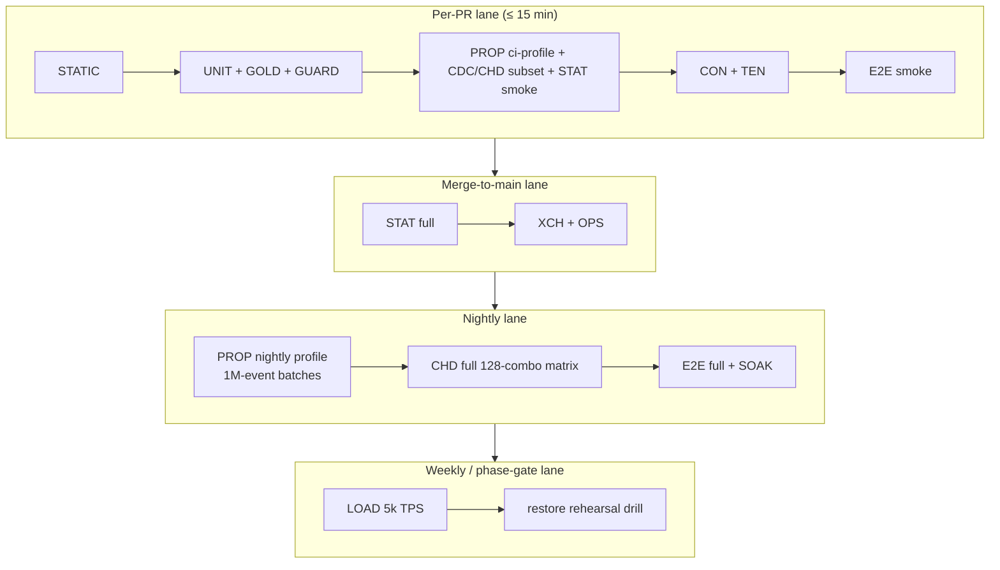
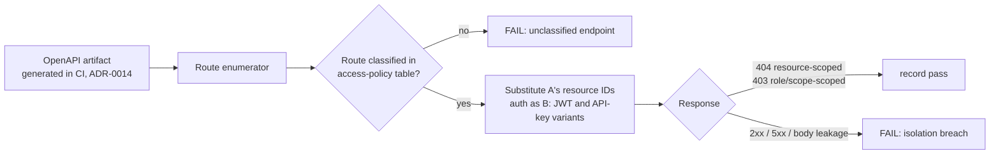

# DataForge — Testing Strategy

**Deliverable:** D16

This document defines how DataForge proves its claims: the full test taxonomy (unit, property/invariant, statistical-with-tolerance, golden-seed replay, cross-tenant attack, contract, cross-channel, CDC consistency, chaos determinism, E2E, soak, load), the concrete tolerances, fixed seeds, and flakiness policy for every statistical assertion, the permanent CI gates that can never be skipped, the per-phase gate table mapping every phase exit criterion in [../07-plan/phases/README.md](../07-plan/phases/README.md) to the suite that proves it, the binding of every `INV-*` invariant in [../03-domain/domain-model.md](../03-domain/domain-model.md) to a proving suite, test-data management (seed registry, golden files, fixture manifests), and the tooling/coverage stance. The realism tolerances verified here are the contract of [../01-product/prd.md](../01-product/prd.md) §4; the envelope rules tested here are frozen in [../03-domain/event-model.md](../03-domain/event-model.md); the validation pipeline tested here is [../04-engines/scenario-plugin-architecture.md](../04-engines/scenario-plugin-architecture.md) §8.

---

## 1. Principles

| # | Principle | Consequence |
|---|---|---|
| TP-1 | **Every claim has a proving suite.** Each phase exit criterion, each `INV-*` invariant, and each PRD realism default maps to a named test (§13, §14). A claim with no test is not done. | The gate tables in this document are the checklist reviewers use at every phase boundary. |
| TP-2 | **Determinism makes flakiness a bug.** Same `(manifest_version, seed, configuration)` ⇒ identical canonical sequence and identical injections (INV-G-4). Therefore every generation-touching test pins its seed, and a "flaky" engine test is by definition a determinism regression — it is investigated, never retried. | No retry plugin may apply to the `statistical`, `golden`, or `chaos` markers (§5.4, enforced by a meta-test). |
| TP-3 | **Tolerances are documented numbers, not vibes.** Every statistical band lives in the tables of §5, with its sample size, seed, and derivation. Changing a band is a PR against this document with justification — never a CI-side fudge. | Bands are sized ≥ 4σ of binomial sampling error at the stated n, so a correct implementation passes under any legitimate PRNG-consumption refactor and a failure means a real rate defect (§5.1). |
| TP-4 | **Isolation is tested adversarially, forever.** The cross-tenant attack suite (§7) runs on every PR from Phase 2 onward, is excluded from path filtering, and auto-enrolls every new endpoint via OpenAPI route enumeration. | A new endpoint that nobody classified in the access-policy table fails the build (§7.2). |
| TP-5 | **One wall for every manifest.** Builtin, human, and LLM manifests pass the identical validation pipeline (scenario-plugin P-5); the test suites therefore exercise the validator with adversarial fixtures, not just the happy path (§4.3, §17.3). | Validator property tests and the adversarial manifest corpus are permanent. |
| TP-6 | **Test the seam, not the instance.** Cross-channel and `DeliveryChannel` contract tests are written against the interface; Phase 12 channels (external Kafka, webhooks) join the existing harness via adapters with zero new assertion logic (§8.4). | The Phase 12 exit criterion "diff confined to delivery adapters" is checkable. |
| TP-7 | **Fast lane honest, slow lane deep.** The per-PR lane completes in ≤ 15 minutes and still includes the attack suite, golden replay, and contract tests; statistical, soak, and matrix suites run on merge/nightly/weekly lanes (§12 lane table). Nothing graduates a phase gate on the fast lane alone. | Lane assignment per suite is fixed in §2. |

---

## 2. Suite taxonomy

| ID | Suite | pytest/CI marker | Tooling | Lane | Budget |
|---|---|---|---|---|---|
| STATIC | Lint, types, format | — | ruff, mypy (`--strict` on engine packages), eslint, tsc, prettier | every PR | ≤ 3 min |
| UNIT | Unit tests | `unit` | pytest + pytest-django; vitest | every PR | ≤ 4 min |
| PROP | Property / invariant tests | `property` | Hypothesis (`ci` profile PR / `nightly` profile deep) | every PR + nightly | ≤ 5 min PR / ≤ 45 min nightly |
| STAT | Statistical-tolerance tests | `statistical` | pytest + stdlib `statistics` over generated batches | PR smoke subset; full on merge + nightly | ≤ 90 s smoke / ≤ 12 min full |
| GOLD | Golden-seed replay | `golden` | pytest + repo fixtures, injected deterministic wall clock | every PR | ≤ 3 min |
| TEN | Cross-tenant attack suite | `tenancy` | pytest + OpenAPI route enumeration + raw SQL (psycopg) | **every PR, unskippable** | ≤ 4 min |
| GUARD | CI guards & meta-tests | `guards` | pytest + management commands + grep/import-lint | every PR | ≤ 2 min |
| CON | Contract tests | `contract` | schemathesis, drf-spectacular schema diff, generated TS client compile, envelope JSON Schema | every PR | ≤ 5 min |
| XCH | Cross-channel content tests | `cross_channel` | pytest harness with REST + WS clients (Kafka/webhook adapters Phase 12) | merge + nightly | ≤ 10 min |
| CDC | CDC consistency suite | `cdc` | pytest + Hypothesis over generated batches | PR subset + nightly full | ≤ 4 min PR |
| CHD | Chaos determinism & reconciliation | `chaos` | pytest over canonical fixtures | PR subset + nightly full matrix | ≤ 5 min PR / ≤ 40 min nightly |
| OPS | Operational & lifecycle tests | `ops` | pytest against the compose stack (kill-tests, revocation latency, quota, cursor expiry, WS backpressure) | merge + nightly | ≤ 15 min |
| E2E | End-to-end browser tests | — | Playwright vs compose stack | PR smoke (2 specs) + nightly full | ≤ 6 min smoke |
| SOAK | Soak test | `soak` | Python soak harness (driver + independent consumers) | nightly | 75 min wall |
| LOAD | Load test | — | k6 (+ checks via REST/WS consumers) | weekly + Phase 11 gate + pre-GA infra changes | ≤ 60 min |

Suite-to-directory mapping (tree per [../07-plan/project-folder-structure.md](../07-plan/project-folder-structure.md)): backend suites live in `backend/<app>/tests/` (unit, app-local property) and `backend/tests/` (cross-app: `tests/tenancy/`, `tests/contract/`, `tests/golden/`, `tests/statistical/`, `tests/chaos/`, `tests/cdc/`, `tests/ops/`, `tests/guards/`); frontend unit tests co-locate as `*.test.ts(x)`; Playwright specs in `frontend/e2e/`; k6 scripts and the soak harness in `infra/loadtest/`.

---

## 3. Unit tests

Unit tests cover pure logic with no Postgres/Redis/Kafka dependency; they are the bulk of the suite and run in milliseconds each. Concrete examples per area (illustrative, not exhaustive — coverage floors in §16 enforce breadth):

| Area | Example tests |
|---|---|
| Behavior engine ([../04-engines/behavior-engine.md](../04-engines/behavior-engine.md)) | Transition selection: given a state with probabilities `[0.70]` and `remainder: exit`, a draw of `0.69` selects the transition and `0.71` selects the remainder (scenario-plugin §6.2 rule 2). Guard fall-through: a selected-but-guard-failed transition falls to the remainder without re-drawing (rule 3). Dwell sampling: lognormal(median PT3M, p95 PT12M) sampled at a pinned sub-seed returns the expected fixture values. Timeout edge beats a sampled dwell that exceeds `after` (rule 5). Intensity renormalization: any curve input renormalizes to mean 1.0 so average TPS is invariant (PRD §4.3). |
| Virtual clock | `virtual_now = v_i + k·(wall_now − w_i)` segment arithmetic at k ∈ {1, 60}; clock frozen across pause; rebase on resume (event-model §3.1). |
| Seeding | `HMAC(seed, namespace)` sub-seed derivation produces documented vectors for `values`/`transitions`/`pools`/`chaos`; UUIDv7 construction puts `occurred_at` ms in the timestamp bits and seeded-PRNG bits in the random section (event-model §2.2.1). |
| Manifest validator | Each MAN-S/V/D code has at least one failing fixture asserting `{code, path, message, bound, actual}` — e.g. probability sum 1.15 → `MAN-V201` with JSON Pointer `/state_machines/…/checkout_started`; orphan state → `MAN-V204`; escape-less SCC → `MAN-V205`; 41-generator allowlist rejection → `MAN-V401`; `hook` in a workspace-visibility manifest → `MAN-V404`. The `(I−Q)⁻¹` expected-steps computation (`MAN-V207`) is tested against hand-computed 3-state chains. |
| Chaos stages ([../04-engines/chaos-engine.md](../04-engines/chaos-engine.md)) | Each of the 7 modes as a pure transform on a small envelope list: stage order `missing → duplicates → corrupted_values → nulls → schema_drift → out_of_order → late_arriving` is asserted structurally; `late_arriving` converts a simulated delay to `wall_delay = simulated_delay / k` (event-model §3.4 worked-example table is the fixture). |
| Schema registry | `BACKWARD_ADDITIVE` checker: adding an optional field passes; removing, retyping, or adding a required field fails (INV-REG-3); subject naming `{scenario_slug}.{event_type}` (INV-REG-1). |
| Envelope | Canonical serialization S-1…S-6: key order, 6-fractional-digit RFC 3339 `Z` timestamps, decimal-string money, `NaN` rejection; `partition_key` derivation PK-1/PK-2/PK-3 against the e-commerce derivation table (event-model §2.2.3). |
| Tenancy / identity | INV-TEN-2/3 membership rules; sole-admin deletion block (INV-ID-4); API-key hash-and-prefix storage with no plaintext field (INV-TEN-4); token single-use + TTL (INV-ID-3). |
| API utilities | Cursor encode/decode round-trip and opacity (no client-parseable structure leaked into tests — tests use the public API only); RFC 9457 problem-details rendering. |
| Frontend (vitest) | WS hook layer: reconnect/backoff schedule, resume-from-cursor handoff, client-side sampling keeps ≤ N events/s in state at 100+ TPS input (ADR-0016); auth token memory handling and refresh rotation; generated-client error mapping. |

---

## 4. Property & invariant tests (Hypothesis)

Property tests generate inputs (or whole event batches) and assert invariants that must hold universally. Two Hypothesis profiles: `ci` (200 examples, `derandomize=True`, fixed seed) and `nightly` (2,000 examples plus large-batch checks). Batch-level properties run over generated canonical batches rather than Hypothesis-built data — generation itself is the strategy, seeded per §17.1.

### 4.1 Referential-integrity properties over generated sequences (INV-G-2)

Run over canonical batches: per-PR a 100k-event batch; nightly and at the Phase 4/8 gates a **1,000,000-event batch** (Phase 4 and Phase 8 exit criteria). All at pinned seeds (§17.1):

| ID | Property |
|---|---|
| PROP-RI-1 | **No event references a nonexistent entity:** every `entity_refs` entry and every `ref.fk`-typed payload field resolves to an entity whose CDC `c`/`r` (or pool-seed snapshot) precedes it at `occurred_at` (INV-GEN-1). |
| PROP-RI-2 | **No payment without an order:** every `payment_authorized`/`payment_failed` carries an `order_id` matching a prior `order_placed` (INV-GEN-2). |
| PROP-RI-3 | **No refund without a delivered or lost shipment:** every `refund_requested` is preceded by `shipment_delivered` or `shipment_lost` for its order, within the 30-simulated-day window (PRD F9 gate). |
| PROP-RI-4 | **Inventory never negative:** replaying all `cdc.inventory` images, `stock ≥ 0` at every version; final stock per SKU = seeded stock − Σ ordered quantities + Σ restock adjustments (PRD §4.4). |
| PROP-RI-5 | `sequence_no` is gapless and strictly monotonic per `(stream_id, shard_id)` starting at 1 (INV-GEN-7), continuing across stop/restart fixtures (T12). |
| PROP-RI-6 | `occurred_at` is non-decreasing per actor; ties broken by `sequence_no` (INV-GEN-4); `occurred_at` ≤ stream virtual-clock head. |
| PROP-RI-7 | Causality: every `causation_id` resolves to a prior event in the batch; `correlation_id` of every non-root equals its cause's `correlation_id` (event-model C-1…C-5). |
| PROP-RI-8 | Every `schema_ref` resolves against the registry fixture at emission (INV-REG-4); every envelope carries all 20 keys with types per the §2.1 catalog. |

### 4.2 Stateful properties

| ID | Property |
|---|---|
| PROP-SM-1 | **Stream lifecycle fuzz:** a Hypothesis `RuleBasedStateMachine` issues random user/system command sequences (`start`, `pause`, `resume`, `stop`, `delete`, quota-pause, failover events) against the Stream aggregate and asserts only edges of the domain-model §4.2 diagram ever occur (INV-STR-1) and that repeated commands are idempotent no-ops (INV-STR-3). |
| PROP-SM-2 | **Validator round-trip:** mutate the valid e-commerce manifest with generated edits (probability perturbations, deleted states, dangling refs, oversized templates); assert the validator's verdict matches an oracle classification — every structurally invalid mutation yields the documented MAN-* code and a valid mutation still passes (TP-5). |
| PROP-SM-3 | **Registry compat oracle:** generated schema-pair mutations (add optional / add required / remove / retype) are classified by the `BACKWARD_ADDITIVE` checker exactly per the oracle (INV-REG-3). |
| PROP-SM-4 | **Overlay safety:** generated overlay documents within `override` bounds always re-validate (MAN-V201/V207 recompute); out-of-bounds overlays always fail with `scope: "override"` (INV-CAT-3). |

---

## 5. Statistical tests (tolerances + fixed seeds)

### 5.1 Methodology

- **Always seed-pinned.** Every statistical test generates its measurement batch at `SEED-STAT` (§17.1). Given a code version, the realized value is therefore *deterministic*; the tolerance band exists to (a) catch rate-implementation bugs and (b) absorb benign refactors that change PRNG draw order without re-baselining. Bands are ≥ 4σ of binomial sampling error at the stated denominator, so any correct implementation passes under any draw order with overwhelming probability.
- **PRD bands are binding.** Per PRD §4: each configured probability's realized rate must fall within **±1 percentage point absolute or ±10 % relative, whichever is larger**; lifecycle latency realized medians within **±15 % of the configured median**. Sample-size minimums (n = 10,000 sessions / 10,000 transitions) are minimums; the harness exceeds them (§5.2).
- **Measurement semantics match configuration semantics.** Realized transition rates are measured as `count(selected transition fired) / count(state entered)`, conditioned on guard pass exactly as scenario-plugin §6.2 rule 3 defines — the same quantity the dry run reports as `realized_rates`.
- **Shared batches.** All statistical tests read pre-generated batches, produced once per pipeline run: `STAT-BATCH-A` (50,000 completed sessions, defaults, chaos off, unpaced backfill-style execution, ≈ 570k events, ≈ 2 min), `STAT-BATCH-B` (30-simulated-day backfill at defaults, ≈ 1.4M events, nightly only), `STAT-BATCH-C` (the first 50,000 canonical events of BATCH-A, re-used as chaos-transform input, 8 transform runs).

### 5.2 Funnel conversion catalog (STAT-F*, batch A, n = 50,000 sessions)

Configured defaults from PRD §4.1; band = ± max(1 pp, 10 % relative), upper bound truncated at 100 %. Approximate denominators at defaults shown for σ context.

| ID | Quantity (numerator / denominator) | Configured | Band | ≈ n (denom) |
|---|---|---|---|---|
| STAT-F1 | Mean product views per session | 4.0 | [3.6, 4.4] (±10 % rel) | 50,000 |
| STAT-F2 | `cart_item_added` / `product_viewed` | 20 % | [18.0 %, 22.0 %] | ≈ 200,000 |
| STAT-F3 | `checkout_started` / sessions with cart ≥ 1 | 40 % | [36.0 %, 44.0 %] | ≈ 29,500 |
| STAT-F4 | `order_placed` / `checkout_started` | 70 % | [63.0 %, 77.0 %] | ≈ 11,800 |
| STAT-F5 | `payment_authorized` / `order_placed` | 95 % | [85.5 %, 100 %] | ≈ 8,260 |
| STAT-F6 | `shipment_created` / `payment_authorized` | 98 % | [88.2 %, 100 %] | ≈ 7,850 |
| STAT-F7 | `shipment_delivered` / `shipment_created` | 97 % | [87.3 %, 100 %] | ≈ 7,690 |
| STAT-F8 | `review_submitted` / `shipment_delivered` | 25 % | [22.5 %, 27.5 %] | ≈ 7,460 |
| STAT-F9 | `refund_requested` / `shipment_delivered` | 5 % | [4.0 %, 6.0 %] | ≈ 7,460 |
| STAT-F10 | `refund_approved` / `refund_requested` | 80 % | [72.0 %, 88.0 %] | ≈ 600 |
| STAT-F11 | Review rating shares {5★ 45 %, 4★ 30 %, 3★ 12 %, 2★ 6 %, 1★ 7 %} | per share | each ± max(1 pp, 10 % rel) | ≈ 1,860 |
| STAT-F12 | **End-to-end:** `order_placed` / sessions | ≈ 16.5 % | **[14 %, 19 %]** (PRD-fixed) | 50,000 |

The per-PR smoke subset is STAT-F2/F3/F4/F12 over a 10,000-session batch (≈ 25 s); the full catalog runs on merge and nightly. Phase 8's "realized conversion rates within tolerance at n = 10k sessions" gate is the full catalog.

### 5.3 Lifecycle latency, shape, and chaos-rate catalogs

**Latency (STAT-L1…L8, batch A):** for each PRD §4.2 window, realized median of `occurred_at(child) − occurred_at(parent)` within ±15 % of the configured median; additionally realized p95 within ±25 % of configured p95 (wider — tail estimates are noisier), and 100 % of samples within the hard bound (else the bound's fallback event must exist — e.g. L1 > 30 min ⇒ `order_cancelled`). Minimum denominator 500 per window; batch A satisfies it for L1–L8.

**Diurnal/weekly shape (STAT-SHAPE-1/2, batch B, nightly + Phase 8 gate):** bucket `session_started` counts by simulated local hour over 30 simulated days.

- STAT-SHAPE-1 (diurnal): each of the 8 configured buckets' realized share within ±10 % relative of its renormalized configured share; realized peak-to-trough ratio in [5.4, 6.6] (configured 6.0 ± 10 %).
- STAT-SHAPE-2 (weekly): each day's realized share within ±5 % relative of configured; Pearson r ≥ 0.98 between the realized 168-hour profile and the configured `diurnal × weekly` product profile. This is the "spectral/shape test" the PRD §4.3 references.

**Chaos rates (STAT-C*, batch C transforms, Phase 9 gate then merge lane):** for each mode configured at rate r over n = 50,000 canonical events, realized rate within ± max(1 pp, 10 % relative) — at the preset r = 5 %, that is **5 % ± 1 %**, the Phase 9 exit criterion verbatim.

| ID | Mode (rate 0.05 unless noted) | Realized measure | Extra assertions |
|---|---|---|---|
| STAT-C1 | `duplicates` | duplicate copies / canonical events ∈ [4 %, 6 %] | every copy byte-identical to its original (event-model §7.3) |
| STAT-C2 | `late_arriving` (delay lognormal median 30 sim-min) | late-marked / canonical ∈ [4 %, 6 %] | 100 %: `occurred_at` unchanged and delivered `emitted_at` > canonical `emitted_at`; realized simulated-delay median within ±15 % of 30 min; at k = 60 the realized wall delay median within ±15 % of 30 s (event-model §3.4 table) |
| STAT-C3 | `missing` | suppressed / canonical ∈ [4 %, 6 %] | every suppressed `sequence_no` absent from delivery and present in the answer key |
| STAT-C4 | `out_of_order` (window 60 sim-s, rate 0.10) | displaced / canonical ∈ [9 %, 11 %] | no displacement exceeds the configured window in simulated time |
| STAT-C5 | `corrupted_values` | mutated / canonical ∈ [4 %, 6 %] | mutations are within-type (e.g. `amount: "abc"` stays a string, event-model S-6) and field-recorded |
| STAT-C6 | `nulls` | nulled / canonical ∈ [4 %, 6 %] | only payload fields affected; envelope fields never nulled |
| STAT-C7 | `schema_drift` | drifted / canonical ∈ [4 %, 6 %] | injected fields ⊆ registered next version (INV-REG-5; also PROP/CHD) |

### 5.4 Flakiness policy (binding)

1. Statistical tests are **always seed-pinned** (`SEED-STAT`); there is no random-seed statistical test in any lane.
2. Tolerance bands are exactly the tables above; tests reference band IDs, and a band change requires a PR editing this document with a derivation note.
3. **Never retried-to-green:** the `statistical`, `golden`, and `chaos` markers are excluded from every rerun mechanism. A meta-test (`tests/guards/test_no_reruns.py`) parses the pytest/CI configuration and fails if any rerun/flaky plugin applies to these markers (GUARD suite).
4. A failing statistical test admits exactly two resolutions: fix the rate/distribution defect, or correct a provably wrong band via the documented process. Re-rolling the seed to pass is forbidden and treated as test tampering in review.

---

## 6. Golden-seed replay tests (GOLD)

**Claim proved:** same `(manifest_version, seed, configuration)` ⇒ **byte-identical** batch output (INV-GEN-3, INV-G-4, PIN-1). A Phase 4 exit criterion and a permanent CI gate thereafter.

| Aspect | Contract |
|---|---|
| Mechanism | The harness generates a batch with a pinned golden seed and compares the canonical serialization (event-model S-2) byte-for-byte against a committed golden file. |
| Wall-clock determinism | Wall-domain fields (`emitted_at`, CDC `ts_ms`) are wall time and would differ per run. The engine therefore accepts an **injectable wall clock** (a binding requirement on the runner API, [../04-engines/behavior-engine.md](../04-engines/behavior-engine.md)); golden runs inject a deterministic wall clock starting at `2026-01-01T00:00:00.000000Z` advancing exactly 1 ms per emitted event. Byte-identity is then asserted over the **full** envelope, wall fields included. Production wall fields remain environment-dependent; only the golden harness pins them. |
| Fixtures | Three golden fixtures, gzipped JSONL in-repo at `backend/tests/golden/` (§17.2): GOLD-A subset manifest 1k events; GOLD-B full manifest + CDC 10k events; GOLD-C full manifest + all-7-modes chaos config 5k delivered events **plus** the serialized injection-record projection (§10.1). Each fixture directory records `(scenario_slug, manifest_version, merged-config sha256, seed)` — the PIN-1 determinism unit. |
| Comparison | Uncompressed bytes; on mismatch the test reports the first divergent line number, event_id, and a field-level diff of that event. |
| Replay of all published manifests | Every published manifest version in the builtin set is golden-replay-tested (1k events each) — the scenario-plugin T-9 determinism-poisoning gate and the §10.3 "published set is replay-tested in CI" guarantee. |
| Re-baselining | Regenerating a golden file is allowed only in a PR that (a) explains which intentional change altered the determinism unit's output (engine semantics, manifest version, envelope addition per EV-6), (b) updates fixture metadata, and (c) is labeled `golden-rebaseline` for reviewer attention. CI never regenerates goldens; a script (`make golden-regen`) exists for local use only. |
| Cross-restart continuation | GOLD-D: generate 1k events, stop, restart from checkpoint, generate 1k more; concatenation is byte-identical to an uninterrupted 2k-event run (INV-STR-5, T12 continuation; Phase 6 "resume with zero sequence gaps"). |

---

## 7. Cross-tenant attack suite (TEN) — permanent CI gate

**Claim proved:** INV-G-1 — no cross-workspace data access on any surface, with breach requiring ≥ 2 simultaneous control failures (ADR-0002). Runs on every PR from Phase 2 forever; the CI job is `always()`-conditioned and excluded from path filters, so no change can skip it. The access-policy classification it enforces is owned by [security-architecture.md](security-architecture.md).

### 7.1 Fixture

Two fully populated workspaces built per run: **Workspace A** (victim — admin + member users, API keys covering every scope, a scenario instance, a stream with buffered events, registered schemas, injection records, audit entries) and **Workspace B** (attacker — its own valid JWT users and API keys, including `answer_key:read`). The attacker's credentials are *valid*; only the target resources are foreign.

### 7.2 Endpoint probes (auto-enrolling)

- Every `(method, path)` in the generated OpenAPI schema must appear in the access-policy table; an unclassified route fails the suite — new endpoints are probed by construction, not by remembering to add a test.
- Expected outcomes: **404** where the foreign resource ID is the discriminator (existence must not leak), **403** where the route is reachable but role/scope-forbidden — per the cross-tenant policy in [security-architecture.md](security-architecture.md). Any 2xx, any 5xx, and any response body containing A-fixture sentinel values (planted UUIDs/strings) is a failure.
- Both credential types are probed per route where applicable (console JWT, data-plane API key), plus the no-credential case (expect 401).

### 7.3 RLS verification with the ORM bypassed

Raw SQL via psycopg as the application's non-superuser DB role — the ORM and scoped managers are deliberately not in the loop:

| Probe | Expectation |
|---|---|
| `SET LOCAL app.workspace_id = '<B>'` then `SELECT` from every tenant-owned table targeting A's rows | 0 rows, every table |
| Workspace GUC **unset**, `SELECT` from every tenant table | 0 rows (default-deny posture) |
| `INSERT`/`UPDATE`/`DELETE` against A's rows under B's GUC | 0 rows affected / policy error |
| Table enumeration | The tenant-table list is derived from Django migration state (every model with `workspace_id`); a tenant model missing an RLS policy fails the suite |

### 7.4 CI-guard meta-tests (the "two simultaneous failures" proof)

`tests/guards/test_tenancy_guard.py` plants canaries in a throwaway test-only app and asserts the static guard command (owned by [security-architecture.md](security-architecture.md)) **fails**:

1. A tenant-shaped model with no `workspace_id` field → guard exits non-zero naming the model (Phase 2 exit criterion "CI guard demonstrably fails on a planted unscoped model").
2. A model with `workspace_id` but a default `models.Manager` instead of the `WorkspaceScoped` manager → fail.
3. A DRF viewset over a tenant model not inheriting the scoped viewset base → fail.
4. Control: the same canaries corrected pass the guard (no false-positive lock-in).

### 7.5 Data-plane probes (grow with phases)

| Phase | Probe added |
|---|---|
| 5 | REST cursor pull on A's stream with B's key → 404; B's key with `events:read` revoked-scope variant → 403 |
| 6 | WS connect to `/ws/streams/{A-stream}/events` with B's key → rejected at handshake (4403 close per the subprotocol in [../05-interfaces/api-specification.md](../05-interfaces/api-specification.md)); stats endpoints for A's stream → 404 |
| 9 | Answer-key endpoints for A's stream with B's admin/`answer_key:read` credentials → 404; **max-rate chaos isolation:** all 7 modes at rate 0.5 on a B stream while an A stream runs on the same runner — A's delivered stream contains zero injections attributed to B's policy (INV-CHA-7) |
| 11 | Quota counters: B's consumption never increments A's metering (INV-OBS-3) |
| 12 | `kafka-console-consumer` with B's SASL credentials on A's hosted topic → authorization failure (Phase 12 exit criterion); webhook config endpoints cross-probed |

---

## 8. Contract tests (CON)

### 8.1 OpenAPI vs implementation

- **Schema freshness:** CI regenerates the drf-spectacular schema and diffs against the committed artifact (ADR-0014); a dirty diff fails — the schema in the repo is always the schema of the code.
- **Response conformance:** schemathesis replays every operation against the live test server (authenticated fixtures) asserting responses validate against their declared schemas and error responses are RFC 9457 problem-details with documented `type` values (including `cursor-expired` on 410 — INV-DEL-4 has a dedicated test that drops a buffer partition and asserts the 410 body).
- **Client lockstep:** the generated TypeScript client is rebuilt from the schema artifact and the frontend compiles against it (`tsc`); FE/BE drift fails the build (ADR-0014/0016).

### 8.2 Envelope contract

- **Field-set pin (EV-6):** serialized samples of every event class (business; CDC `c`/`u`/`d`/`r`; each chaos transform) are validated against the envelope 1.0 JSON Schema CI artifact; the test asserts the **exact** 20-key delivered set per `envelope_version` — an unannounced 21st field fails the build, as does a missing key.
- **CDC frame:** envelope `op` ≡ payload `op`; `before`/`after` null-rules per op (event-model §4.3); `source.*` field equivalences (`source.seq` ≡ `sequence_no`, `source.ts_ms` ≡ `occurred_at` ms, `ts_ms` ≡ `emitted_at` ms).
- **Strip-boundary scan (SB-3, permanent from Phase 5):** consume delivered output from every shipped channel and deep-scan every key at every nesting level for the `_df` prefix; any hit fails. The scan harness is channel-parameterized so Phase 12 channels are scanned the day they ship (SB-2/SB-3).

### 8.3 Cross-channel content tests (XCH)

The Phase 6 exit criterion "WS and REST deliver the same stream content," generalized into the seam test (TP-6):

| Case | Setup | Assertion |
|---|---|---|
| XCH-1 (clean) | One stream, 50 TPS, chaos off, 60 s; WS client connected before start; REST cursor from stream head | Identical `event_id` sets; per-`event_id` parsed-content equality (wire key order may differ, S-3); identical per-`partition_key` order; zero WS drop notices at this rate |
| XCH-2 (chaos) | Same with GOLD-C chaos config | Every WS-delivered event content-equal to its REST copy; WS at-most-once means subset is allowed, but drop-notice counts must reconcile the difference exactly (INV-DEL-5) |
| XCH-3 (replay) | Re-read the same REST cursor twice | Byte-identical buffer responses (INV-DEL-3) |
| XCH-4+ (Phase 12) | External Kafka and webhook adapters join the same harness | Same content-equality assertions per event_id; per-partition FIFO for Kafka; HMAC validation + retry-idempotency for webhooks. Zero new assertion logic — adapters only (Phase 12 exit criterion). |

### 8.4 Code-structure guards (GUARD additions)

| Guard | Rule enforced |
|---|---|
| `grep -r ecommerce backend/ --include='*.py'` matching anything outside the builtin YAML path fails | "Zero e-commerce logic in Python" (scenario-plugin P-1, Phase 3 exit) |
| Reference manifest contains zero `hook` generators | P-4, permanent |
| Import-lint: hook modules import no network/file modules; `observation` app imports no write-path modules; sinks import `strip_internal` | scenario-plugin §4.6; INV-OBS-1; SB-2 |
| Delivery adapters are the only modules importing channel SDKs | keeps the Phase 12 "diff confined to delivery adapters" criterion mechanically checkable |

---

## 9. CDC consistency suite (CDC)

Runs over canonical batches with CDC enabled for all 8 e-commerce entities (per-PR: 100k events; nightly + Phase 8 gate: 1M). Proves ADR-0012 / INV-GEN-6 and the event-model R-CDC rules:

| ID | Assertion |
|---|---|
| CDC-1 | **No `u`/`d` before `c`/`r`** per entity instance within a stream (R-CDC-4 — the permanent Phase 8 CI property test). |
| CDC-2 | **Image chaining:** every `u`'s `before` equals the entity's previous `after`; `source.entity_version` is gapless per entity, starting at 1 (R-CDC-5). |
| CDC-3 | **Business/CDC adjacency:** each mutation's CDC events immediately follow their causing business event with consecutive `sequence_no`s in manifest effect order, sharing `occurred_at` and `correlation_id`, with `causation_id` = the business `event_id` (R-CDC-2, C-4). |
| CDC-4 | **Consistency with the business stream:** for every `order_placed` there is exactly one `cdc.orders` `c`; for every inventory-adjusting effect exactly one `cdc.inventory` `u` whose stock delta equals the ordered quantity (PRD §4.4 reconciliation). |
| CDC-5 | Background mutations are chain roots: `causation_id = null`, `actor_id = null`, `source.tx_id = null`, `correlation_id = event_id` (R-CDC-3); realized background-mutation rate within ± max(1 pp, 10 % rel) of the configured 0.5 %/entity/day over batch B (statistical sub-case). |
| CDC-6 | Snapshot `r` rows: exactly once per CDC-enabled seeded entity at stream head, `occurred_at = virtual_epoch`, `source.snapshot` ∈ {"true","last"} correctly placed (event-model §4.3); backfill JSONL downloads begin with the snapshot block. |
| CDC-7 | Envelope/payload `op` equality and per-op image null-rules (overlaps CON §8.2, asserted here over full batches). |
| CDC-8 | **SCD2 end-to-end (E4, Phase 10 gate):** consume the `cdc.users` feed of a fixture run, build the SCD2 table per the documented dbt-snapshot exercise, and byte-compare against the table derived from the answer key's ground-truth mutation log — the exercise is reproducible and gradable. |

---

## 10. Chaos determinism & reconciliation suite (CHD)

### 10.1 Determinism (INV-CHA-2, Phase 9 "identical seed+config yields identical injections")

- **CHD-1:** apply the chaos pipeline twice with identical `(seed, chaos configuration)` to the same canonical fixture; the injection sets must be equal on the **deterministic projection**: `(mode, affected event_id(s), sequence_no, field-level mutation details, configured simulated delay, duplicate_index, displacement)`. Wall-domain fields (`recorded_at`, `due_at`, realized wall delay) and surrogate `injection_id`s are excluded from comparison — they are wall-clock artifacts, not chaos decisions (event-model §3.4).
- **CHD-2:** GOLD-C byte-identity (under the injected wall clock, §6) covers the delivered post-chaos sequence including ordering effects.
- **CHD-3:** the late-arrival schedule's simulated-delay assignments are identical across runs; `wall_delay = simulated_delay / k` is asserted at k ∈ {1, 60}.

### 10.2 Reconciliation (INV-CHA-1/4, INV-G-3 — the grading guarantee)

- **CHD-4:** diff the delivered stream against the ledger for a full run: every deviation (extra copy, gap, mutated field, displaced position, drift field, shifted `emitted_at`) maps to **exactly one** injection record, and every injection record maps to an observed deviation (or a recorded `discarded` re-emission). Answer-key counts equal delivered chaos exactly, to the event — the Phase 9 exit criterion.
- **CHD-5:** ledger immutability — the ledger's content hash before and after the chaos run is identical (INV-CHA-1).
- **CHD-6:** drift fields ⊆ the registered next version's field set, never `before` images (INV-CHA-3, R-CDC-6).

### 10.3 Combination matrix and lifecycle

- **CHD-7 (matrix):** all 2⁷ = 128 enable-combinations at rate 0.10 over 5k events each — crash-free with CHD-4 reconciliation per combination. Nightly; the per-PR subset is the 7 single-mode runs plus all-on.
- **CHD-8 (late-buffer lifecycle, INV-CHA-5):** pause a stream with pending re-emissions → resume → all pending entries emit; stop with `OnStopPolicy: discard` → entries marked `discarded` on their injection records; stop with `flush` → emitted during stopping; runner kill with pending entries → new lease holder emits them (the Phase 9 "paused stream resumes with pending late re-emissions intact" criterion). Mechanics per [../04-engines/chaos-engine.md](../04-engines/chaos-engine.md).

---

## 11. Operational & lifecycle tests (OPS)

Integration tests against the compose stack, proving the runtime claims with stopwatch assertions:

| ID | Test | Assertion (source) |
|---|---|---|
| OPS-1 | Runner kill-test | `SIGKILL` the lease-holding runner mid-stream; another runner claims the expired lease and emission resumes from checkpoint in **< 30 s** with no canonical gaps or duplicates (lease TTL 15 s; Phase 5 exit) |
| OPS-2 | Fencing | The killed runner is resurrected after takeover; its writes are rejected by the fencing token — zero post-takeover events from the stale holder (INV-STR-2) |
| OPS-3 | Stop latency | `stop` halts emission within **≤ 5 s** (T10, Phase 5 exit) |
| OPS-4 | Pause/resume integrity | Pause halts within one tick; resume continues in-flight funnels with zero integrity violations and zero sequence gaps (Phase 6 exit; pairs with GOLD-D) |
| OPS-5 | Dynamic TPS | `target_tps` 10 → 500 takes effect within **≤ 2 s**, measured by observed inter-event rate (Phase 6 exit) |
| OPS-6 | Key revocation latency | Revoked API key rejected on the data plane within **< 1 s** (Redis revocation cache; Phase 2 exit) |
| OPS-7 | Cursor expiry | Drop a buffer partition; a cursor into it returns **410** `cursor-expired`, never a silent skip (INV-DEL-4) |
| OPS-8 | WS backpressure | Throttled WS client at high TPS receives drop-notice frames with accurate counts; server memory bounded (INV-DEL-5) |
| OPS-9 | Quota pause | Exhaust events/day on a test quota row; stream transitions to `paused_quota` gracefully, data intact, resumable after headroom (INV-TEN-5; Phase 11 exit) |
| OPS-10 | Idle auto-pause | No consumption for the plan window ⇒ `paused_idle` + audit entry, one-call resume (PRD §7) |
| OPS-11 | DuckDB exercise | Generate a 100k-event backfill JSONL, load into DuckDB via the documented E7 commands, run 3 assertion queries (row counts, 100 % FK join match on orders→users, daily-revenue rows present) (Phase 4 exit) |
| OPS-12 | Workspace deletion cascade | Keys revoked, streams stopped, audit tombstoned not dropped (INV-TEN-6) |
| OPS-13 | Mid-stream schema upgrade | Scheduled "evolve to v2 at T+x" fires without restart; consumers resolve v1 and v2 from the registry; drift after upgrade resolves to v3 if registered (Phase 10 exit) |
| OPS-14 | Restore rehearsal | Scripted restore of ledger/buffer backups into a clean environment; row counts and partition ranges match the manifest of the backup job (Phase 11 exit; scheduled with the weekly lane) |

---

## 12. End-to-end tests (E2E, Playwright)

Playwright drives the real console against the full compose stack (Postgres, Redis, Kafka, api, ws, worker, runner, buffer-writer, web, plus the dev-only mailpit container for email capture) in CI. Specs in `frontend/e2e/`:

| Spec | Flow | Lane |
|---|---|---|
| `auth.spec.ts` | Signup → email verify (mailpit) → login → token refresh → logout | PR smoke |
| `core-loop.spec.ts` | **The Phase 7 exit criterion:** account → workspace → scenario (defaults, seed `4242`) → API key (reveal-once dialog, copy) → start stream → watch live events in Monitoring → pause → resume → stop — entirely in the UI | PR smoke |
| `keys.spec.ts` | Key create/reveal-once (secret never re-shown), revoke; revoked key rejected via API probe within 1 s | nightly |
| `stream-control.spec.ts` | TPS slider, status badges through `starting/running/pausing/paused/stopping/stopped/failed` states, `paused_quota` rendering | nightly |
| `live-tail.spec.ts` | Tail at 100+ TPS with client-side sampling: UI thread never blocked > 200 ms (Playwright tracing assertion), counters monotonic, event-type filter works — "tail does not freeze" (Phase 7 exit) | nightly |
| `chaos-answer-key.spec.ts` | Enable "Dedup 101" preset, run, open Answer Key panel, export injection report; counts match the API (Phase 9 UI) | nightly |
| `registry.spec.ts` | Registry browser: version history, v1→v2 diff view, compat-violation error surfaced (Phase 10 UI) | nightly |

Failure artifacts (trace, video, console logs) are uploaded on every E2E failure. Selectors use `data-testid` only — a frontend lint rule enforces it.

---

## 13. Soak & load tests

### 13.1 SOAK-200 (nightly from Phase 6; the Phase 6 gate run is attended)

One stream at 200 TPS for 60 minutes plus 10-minute warmup, chaos off, `SEED-SOAK`, with the harness running an independent REST cursor consumer and a WS consumer:

| Assertion | Threshold |
|---|---|
| Runner + sink RSS growth after warmup | Linear-regression slope < 1 MiB/min and total growth < 10 % over the measurement window |
| Buffer-writer and WS-bridge consumer lag | No positive trend (slope ≤ 0 within noise); lag p99 < 5 s of events |
| Delivered totals | REST consumer tally == WS tally (no drops at this rate) == stream stats `total_events` at run end; stats staleness ≤ 5 s throughout (INV-OBS-2; Phase 6 "stats match an independent consumer-side tally") |
| Integrity | PROP-RI-1..8 pass over the soak's canonical output |
| Logs | Zero ERROR-level entries across all process groups |

### 13.2 LOAD-5K (k6; Phase 11 gate, then weekly and before GA-affecting infra changes)

k6 is the load tool (thresholds-as-code, constant-arrival-rate executors, low client overhead; Locust remains the documented alternative if Python-side custom consumers ever dominate the harness — revisit only via this document). Generation load is produced by the platform itself; k6 drives consumption and control-plane churn:

| Aspect | Value |
|---|---|
| Topology | 10 workspaces × 5 streams × 100 TPS = **5,000 aggregate TPS**, sustained **30 minutes** (Phase 11 exit floor) |
| k6 scenarios | Per-stream REST cursor pollers (batch reads); 50 WS tail connections; control-plane churn (start/pause/resume, stats reads) at 5 req/s |
| Thresholds | events-endpoint p95 latency < 500 ms; HTTP error rate < 0.1 %; zero 5xx; delivered rate ≥ 99 % of expected per stream over the window |
| Integrity sampler | 1 % reservoir sample per stream re-validated against PROP-RI rules; **zero** violations |
| Isolation under load | TEN spot probes (§7.5) run during the load window; zero breaches — "zero integrity or isolation violations" (Phase 11 exit) |
| Output | Published report with the measured ceiling, feeding the capacity staircase in [../02-architecture/scaling-strategy.md](../02-architecture/scaling-strategy.md) |

---

## 14. Per-phase CI gate table

Each phase's exit criteria (binding text in [../07-plan/phases/README.md](../07-plan/phases/README.md)) and the suite/test that proves it. A phase review starts from this table; "lane" is where the proving run executes.

| Phase | Exit criterion (abridged) | Proving suite / test | Lane |
|---|---|---|---|
| 1 | `docker compose up` all services healthy; `/readyz` green for pg/redis/kafka | OPS smoke: compose health poller asserting readyz JSON | PR |
| 1 | CI green on a trivial PR; OpenAPI artifact job runs | STATIC + CON schema job | PR |
| 1 | Fly URL serves `/healthz`; tree matches D19 | post-deploy smoke script; folder-lint script vs [../07-plan/project-folder-structure.md](../07-plan/project-folder-structure.md) | merge |
| 2 | Cross-tenant attack suite passes (403/404 everywhere; RLS verified with ORM bypassed) | TEN §7.2 + §7.3 | PR (permanent) |
| 2 | CI guard fails on a planted unscoped model | GUARD §7.4 | PR (permanent) |
| 2 | Revoked key rejected within 1 s | OPS-6 | merge |
| 2 | Signup → workspace → key → revoke curl demo | OPS scripted API walkthrough | merge |
| 3 | Malformed manifests (probability-sum, cycles) rejected with precise errors | UNIT validator fixtures + PROP-SM-2 | PR |
| 3 | Manifest registration derives v1 schemas; catalog + registry GET endpoints work | CON §8.1 + registry integration tests | PR |
| 3 | Envelope round-trips with `schema_ref` stamped | CON §8.2 field-set pin | PR |
| 3 | Zero e-commerce logic in Python | GUARD grep (§8.4) | PR (permanent) |
| 4 | Fixed seed reproduces byte-identical batches | GOLD-A/B | PR (permanent) |
| 4 | Referential validity over a 1M-event batch | PROP-RI-1..8 (1M profile) | nightly + gate run |
| 4 | 100k-event dataset loads into DuckDB per documented exercise | OPS-11 | merge |
| 4 | Builtins re-validated through validator layer 3 | GUARD: L3 re-validation job (scenario-plugin §8.4 sequencing) | merge |
| 5 | Demo: events show Orders referencing prior Users/Products | OPS scripted demo + PROP-RI-2 | merge |
| 5 | Stop halts ≤ 5 s; lease failover < 30 s | OPS-3, OPS-1/2 | merge |
| 5 | Cursor replay returns identical events | XCH-3 | merge |
| 5 | Cross-workspace stream access blocked; `_df` never delivered | TEN §7.5(P5) + CON strip scan SB-3 | PR (permanent) |
| 6 | Pause within one tick; resume zero gaps/violations | OPS-4 + GOLD-D | merge |
| 6 | TPS 10 → 500 within 2 s | OPS-5 | merge |
| 6 | WS and REST deliver the same stream content | XCH-1/2 | merge |
| 6 | 1-hr 200 TPS soak: stable memory, no lag growth, stats match independent tally | SOAK-200 | nightly + gate run |
| 7 | Full core loop in the UI; Playwright E2E in CI vs compose | E2E `core-loop.spec.ts` | PR smoke |
| 7 | Tail at 100+ TPS doesn't freeze; lifecycle UI states correct | E2E `live-tail.spec.ts`, `stream-control.spec.ts` | nightly |
| 8 | 1M-event soak, zero integrity violations (refund/payment/inventory invariants) | PROP-RI-1..8 (1M, full manifest) | nightly + gate run |
| 8 | CDC consistency: no u/d before c, correct images, consistent with business stream | CDC-1..7 | PR subset + nightly full |
| 8 | 30-simulated-day backfill shows diurnal/weekly shape | STAT-SHAPE-1/2 | nightly + gate run |
| 8 | Realized conversion rates within tolerance at n = 10k sessions | STAT-F1..F12 (50k-session run ≥ PRD minimum) | merge |
| 9 | Configured 5 % chaos realizes 5 % ± 1 % over 50k events; late events honor `occurred_at` < `emitted_at` | STAT-C1..C7 | merge + gate run |
| 9 | Identical seed+config ⇒ identical injections | CHD-1/2/3 | PR |
| 9 | All toggle combinations crash-free | CHD-7 matrix | nightly + gate run |
| 9 | Answer-key counts exactly match injections | CHD-4 | PR |
| 9 | Paused stream resumes with pending late re-emissions intact | CHD-8 | merge |
| 9 | Max-rate chaos never leaks across workspaces | TEN §7.5(P9) | PR (permanent) |
| 10 | Live v1 → v2 upgrade without restart; consumers resolve both versions | OPS-13 + CON registry tests | merge |
| 10 | Drift fields always resolve to a registered version | CHD-6 | PR |
| 10 | SCD2 exercise reproducible end-to-end | CDC-8 | nightly + gate run |
| 11 | ≥ 5k aggregate TPS, 30 min, zero integrity/isolation violations | LOAD-5K | gate run + weekly |
| 11 | Quota exhaustion pauses gracefully with clear API/UI state | OPS-9/10 + E2E `stream-control.spec.ts` | merge |
| 11 | Restore-from-backup rehearsed | OPS-14 drill | gate run |
| 11 | Production URL serves the full core flow | post-deploy smoke (core-loop API walkthrough vs prod) | deploy pipeline |
| 12 | Foreign SASL credentials receive nothing; own credentials receive only own-workspace events | TEN §7.5(P12) | PR (permanent) |
| 12 | Webhook receiver verifies HMAC, survives retry/DLQ | XCH-4 webhook adapter cases | merge |
| 12 | Diff confined to delivery adapters | GUARD import-lint (§8.4) + review | PR |
| 12 | Cross-channel contract tests pass on all four channels | XCH-1..4 full | merge |

---

## 15. Invariant → suite bindings

The binding table promised by [../03-domain/domain-model.md](../03-domain/domain-model.md) §7. Every `INV-*` is owned by at least one suite; composite INV-G rows aggregate their constituents.

| Invariant(s) | Proving suite(s) | Method |
|---|---|---|
| INV-ID-1, ID-2, ID-3 | UNIT + CON | Uniqueness/verification gates as unit tests; endpoint behavior via API tests |
| INV-ID-4, INV-TEN-3 | UNIT | Sole-admin rule blocks deletion/demotion fixtures |
| INV-TEN-1 | TEN + GUARD + PROP-RI-8 | Schema-derived tenant-table audit; envelope `workspace_id` presence over batches |
| INV-TEN-2 | UNIT | Duplicate-membership rejection |
| INV-TEN-4 | UNIT + TEN | Hash-only storage; reveal-once asserted at API level (secret appears in exactly one response) |
| INV-TEN-5 | OPS-9 | Quota enforcement at command time + system pause |
| INV-TEN-6 | OPS-12 | Deletion cascade |
| INV-CAT-1, CAT-5 | UNIT + GUARD | Immutability/deprecation rules; `sync_builtin_scenarios` sha-mismatch hard-fail test |
| INV-CAT-2 | UNIT + PROP-SM-2 | Validator fixture corpus + mutation oracle |
| INV-CAT-3 | PROP-SM-4 | Overlay re-validation property |
| INV-CAT-4, INV-STR-5 | OPS + GOLD-D | Re-pin while running has no effect; restart continues pin and seed |
| INV-CAT-6 | TEN | Workspace-visibility scenarios cross-probed |
| INV-REG-1, REG-2 | UNIT | Subject naming; version immutability/monotonicity |
| INV-REG-3 | UNIT + PROP-SM-3 | Compat checker + oracle property |
| INV-REG-4 | PROP-RI-8 | Every emitted `schema_ref` resolves |
| INV-REG-5 | CHD-6 | Drift ⊆ registered next version |
| INV-STR-1, STR-3 | PROP-SM-1 | Lifecycle stateful fuzz; idempotency |
| INV-STR-2 | OPS-1/2 | Kill-test + fencing |
| INV-STR-4 | CON | OpenAPI route audit: no runner/lease/internal-Kafka surface exists |
| INV-STR-6 | TEN | Data-plane key-space probes |
| INV-GEN-1, GEN-2 | PROP-RI-1/2/3 | 1M-event referential properties |
| INV-GEN-3 | GOLD-A/B/D | Byte-identical replay |
| INV-GEN-4 | PROP-RI-6 + UNIT clock tests | Clock domains and monotonicity |
| INV-GEN-5 | UNIT + CHD-5 | Ledger append-only API; content-hash invariance across chaos |
| INV-GEN-6 | CDC-1..7 | One mutation, two consistent views |
| INV-GEN-7 | PROP-RI-5 | Gapless per-shard sequence |
| INV-CHA-1, CHA-4 | CHD-4/5 | Delivered-vs-ledger reconciliation; ledger hash |
| INV-CHA-2 | CHD-1/2/3 | Deterministic-projection equality |
| INV-CHA-3 | CHD-6 | Registry-bounded drift |
| INV-CHA-5 | CHD-8 | Late-buffer lifecycle (pause/stop/failover) |
| INV-CHA-6 | STAT-C2 + PROP | `occurred_at` untouched; only `emitted_at` shifts |
| INV-CHA-7 | TEN §7.5(P9) | Max-rate chaos isolation |
| INV-DEL-1 | GUARD import-lint + integration | Sinks read post-chaos topics only |
| INV-DEL-2 | CON strip scan (SB-3) | Channel-output `_df` scan |
| INV-DEL-3 | XCH-3 | Cursor replay byte-stability |
| INV-DEL-4 | OPS-7 | 410 `cursor-expired` on dropped partition |
| INV-DEL-5 | OPS-8 + XCH-2 | Drop-notice accuracy under backpressure |
| INV-DEL-6 | TEN §7.5 | Per-channel cross-workspace probes |
| INV-OBS-1 | GUARD import-lint | Observation app has no write path |
| INV-OBS-2 | SOAK-200 | ≤ 5 s staleness; end-of-run reconciliation |
| INV-OBS-3 | TEN §7.5(P11) | Tenant-labeled counters never mix |
| INV-AUD-1, AUD-2 | UNIT | No update/delete surface; exactly-one-entry-per-action, same-transaction |
| INV-AUD-3 | UNIT + PROP | Secret-pattern scan over generated audit entries |
| INV-AUD-4 | TEN | Audit visibility probes |
| INV-G-1 | TEN (whole suite) | §7 |
| INV-G-2 | PROP-RI-1..4 | §4.1 |
| INV-G-3 | CHD-4/5 | §10.2 |
| INV-G-4 | GOLD + CHD-1 | §6, §10.1 |
| INV-G-5 | CON §8.2 + strip scan | Envelope pin + EV-6 process |

---

## 16. Test data management

### 16.1 Seed registry

All seeds are non-negative 63-bit integers (the api-specification R-3 seed domain, [0, 2⁶³−1]), fixed here; tests reference them by name from one module (`backend/tests/seeds.py`), never as inline literals (a GUARD lint enforces it).

| Name | Value | Used by |
|---|---|---|
| `SEED_VALIDATION` | `424242424242` | Manifest dry run (fixed by scenario-plugin §8.4 — owned there, listed for completeness) |
| `SEED_GOLD_A` | `271828182845` | GOLD-A (subset manifest, 1k events) |
| `SEED_GOLD_B` | `271828182846` | GOLD-B (full manifest + CDC, 10k events) |
| `SEED_GOLD_C` | `271828182847` | GOLD-C (chaos, 5k delivered events + injection projection) |
| `SEED_STAT` | `314159265358` | All statistical batches (A/B/C) |
| `SEED_SOAK` | `161803398874` | SOAK-200 and LOAD-5K streams |
| `SEED_E2E` | `4242` | Playwright + demo scripts (matches the PRD §2.2 instructor journey, so docs and tests show identical data) |

### 16.2 Golden files

`backend/tests/golden/{scenario_slug}/{manifest_version}/{fixture_name}/` containing `meta.json` (`seed`, merged-config `sha256`, event count, envelope_version, generator commit) and `events.jsonl.gz` (canonical serialization, §6). Size policy: each fixture ≤ 5 MiB compressed; total golden payload ≤ 25 MiB. Goldens are reviewed like code; the `golden-rebaseline` PR label is mandatory for any change (§6).

### 16.3 Fixture manifests

| Corpus | Contents |
|---|---|
| Valid | The builtin subset manifest (`ecommerce` 1.0.0) and full manifest (1.1.0, from [../04-engines/scenarios/ecommerce.md](../04-engines/scenarios/ecommerce.md)); a minimal 1-entity smoke manifest for fast unit tests |
| Adversarial | One fixture per MAN-S/V/D error code (≥ 40 documents): probability-sum violations, orphan states, escape-less cycles, near-absorbing `stay` loops (V207 boundary at expected = 1,000 ± 1 step), oversize payload estimates, hook-in-workspace-manifest, anchors/billion-laughs YAML, depth-13 nesting, 513 KiB documents |
| Boundary | Manifests at exact resource bounds (50 entities, 40 states, 200 event types) that must pass — bounds are inclusive and tested from both sides |

### 16.4 Fixture environments

Compose-based: integration/OPS/E2E suites run against an ephemeral compose project per CI job (same images as dev, per [../02-architecture/deployment-architecture.md](../02-architecture/deployment-architecture.md)); the TEN suite's two-workspace fixture is built by a factory module shared with E2E so attack probes and browser tests agree on the world. Mailpit captures verification/reset emails. No test ever touches a shared external environment except the post-deploy prod smoke (§14 Phase 11 row), which is read-only plus one disposable workspace.

---

## 17. Tooling & coverage

### 17.1 Tooling matrix

| Tool | Role | Notes |
|---|---|---|
| pytest (+ pytest-django, pytest-xdist) | Backend runner | Markers per §2; `-p no:randomly` on `golden`/`statistical`/`chaos` paths (ordering stability) |
| Hypothesis | Property suite | Profiles `ci` (200 examples, `derandomize=True`) and `nightly` (2,000); stateful machines for lifecycle fuzz |
| schemathesis | OpenAPI conformance | Driven from the CI schema artifact |
| coverage.py | Coverage gates | Per-package `fail_under` (§17.2) |
| ruff, mypy | Lint + types | `mypy --strict` on engine packages (`generation`, `chaos`, `catalog` validation, `registry`, `delivery` sinks) |
| vitest + Testing Library | Frontend unit | WS hooks, sampling, auth/token logic, client error mapping |
| Playwright | E2E | Compose stack; `data-testid` selectors; trace/video artifacts on failure |
| k6 | Load | LOAD-5K thresholds-as-code; Locust documented alternative (§13.2) |
| psycopg (raw) | RLS probes | ORM deliberately bypassed (§7.3) |
| Injected clocks | Determinism | Virtual clock and wall clock are constructor-injected in the engine; freezegun only for control-plane TTL tests (tokens, leases) |

### 17.2 Coverage stance

~85 % on the engines, pragmatic elsewhere — concretely:

| Scope | Gate |
|---|---|
| Engine packages (`generation`, `chaos`, manifest validation, `registry`, `delivery` sink implementations) | **≥ 85 % line, ≥ 80 % branch**, enforced per-package; a drop fails CI |
| Backend overall | ≥ 70 % line, enforced |
| Frontend `src/hooks/`, `src/lib/`, generated-client wrappers | ≥ 80 % line via vitest |
| Frontend pages/components | No numeric gate — covered behaviorally by Playwright; adding low-value snapshot tests to inflate numbers is rejected in review |
| Coverage hygiene | Coverage is a floor, not a target; assertion-free tests are a review reject. Quarterly advisory mutation-testing run (mutmut) on the chaos and validator packages reports survivors — advisory only, never a gate |

### 17.3 Permanent, never-skippable gates (summary)

The minimal set every PR runs regardless of paths touched, from the phase each lands: TEN (Phase 2), GUARD tenancy canaries (2), GOLD replay (4), CON envelope pin + strip scan (3/5), GUARD greps — no-ecommerce-in-Python (3), no-hooks-in-reference (3), no-reruns meta-test (2). Removing or skipping any of these requires editing this section — by design, a visible and reviewable act.

---

## 18. Ownership boundaries

What this document deliberately does not specify, and where it lives:

| Concern | Owner |
|---|---|
| Access-policy table (which route ⇒ 403 vs 404), tenancy guard command, RLS policy DDL | [security-architecture.md](security-architecture.md), DDL in [../03-domain/database-schema.md](../03-domain/database-schema.md) |
| Chaos per-mode parameter schemas, stage mechanics, late-buffer design under test in §10 | [../04-engines/chaos-engine.md](../04-engines/chaos-engine.md) |
| Engine internals (tick loop, checkpoint format, clock injection API) | [../04-engines/behavior-engine.md](../04-engines/behavior-engine.md) |
| Endpoint shapes, problem types, WS subprotocol close codes | [../05-interfaces/api-specification.md](../05-interfaces/api-specification.md) |
| CI workflow files, compose stack, runner sizing for soak/load jobs | [../02-architecture/deployment-architecture.md](../02-architecture/deployment-architecture.md), `infra/` |
| Capacity staircase the LOAD-5K report feeds | [../02-architecture/scaling-strategy.md](../02-architecture/scaling-strategy.md) |
| Metrics/log schema asserted by SOAK log checks | [../02-architecture/observability.md](../02-architecture/observability.md) |
| Phase exit-criteria source text | [../07-plan/phases/README.md](../07-plan/phases/README.md) |
