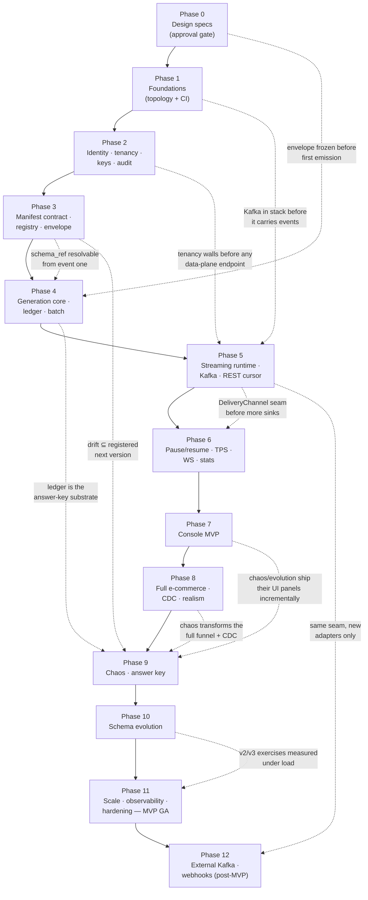

# DataForge — Incremental Development Roadmap

**Deliverable:** D18

This document is the execution plan: the thirteen phases (0–12) that take DataForge from an empty repository to MVP GA and the first post-MVP delivery expansion, the dependency graph that fixes their order, and the review-gate convention every phase must pass before the next one starts. Each phase is summarized here in one paragraph; the binding per-phase contract (goal, scope, non-goals, demo script, exit criteria) lives in one file per phase under [phases/](phases/README.md). The MVP cut rationale and the deferred backlog live in [mvp-vs-future.md](mvp-vs-future.md); the exit-criteria-to-test-suite bindings live in [../06-quality/testing-strategy.md](../06-quality/testing-strategy.md) §14; terminology follows [../03-domain/domain-model.md](../03-domain/domain-model.md).

---

## 1. Plan shape and rules

| # | Rule | Consequence |
|---|---|---|
| R-1 | **Design before code.** Phase 0 produces all 20 deliverables (D1–D20) plus this phase breakdown; after the specs are committed, **work stops for user review**. No application code exists before design approval. | The approval gate is a hard stop, not a formality. |
| R-2 | **One-way doors first.** The five frozen contracts — event envelope (incl. CDC shape and clock-domain rules), manifest JSON Schema v0, `DeliveryChannel` interface, registry subject naming, tenancy model — are locked at Phase 0 and implemented before anything that depends on them ([mvp-vs-future.md](mvp-vs-future.md) §4). | No later phase ever retrofits a contract; the dependency audit in §3.2 verifies this. |
| R-3 | **Final topology from Phase 1.** The dev stack contains every production service — including Kafka — before any feature uses it (ADR-0005, deployment principle D-1). Phases replace stub commands with real ones; the shape never changes. | There is no substrate swap, ever. |
| R-4 | **Every phase is independently reviewable.** Each phase ships a runnable demo script, measurable exit criteria, and an explicit non-goals list that keeps its diff small (§4). | A reviewer can verify a phase without reading the next one. |
| R-5 | **MVP GA = end of Phase 11.** The GA tag is applied when Phase 11's exit criteria pass; Phases 0–11 are the MVP, Phase 12 and beyond are post-MVP ([mvp-vs-future.md](mvp-vs-future.md)). | "Done with MVP" has exactly one definition. |
| R-6 | **Phases are scoped by reviewability, not by calendar.** No wall-clock durations are assigned in this plan; a phase ends when its exit criteria pass its review gate, and the only schedule control is the Phase 0 timebox rule (§5). | Estimates never substitute for exit criteria. |

---

## 2. Phase summaries

Phase numbers are canonical and appear in every spec ("Refined in Phase N" markers resolve against this list). Each summary names its phase doc, which is the binding contract.

### Phase 0 — Design specs ([phases/phase-00-specs.md](phases/phase-00-specs.md))

Author and approve all 20 deliverables across the `specs/` tree (23 docs + 17 ADRs + 13 phase docs) and freeze the five core contracts: the canonical event envelope with CDC shape and clock-domain rules ([../03-domain/event-model.md](../03-domain/event-model.md)), manifest JSON Schema v0 with the full 8-entity e-commerce manifest written as a paper-validation forcing function ([../04-engines/scenarios/ecommerce.md](../04-engines/scenarios/ecommerce.md)), the `DeliveryChannel` interface ([../04-engines/delivery-channels.md](../04-engines/delivery-channels.md)), registry subject naming (ADR-0010), and the tenancy model (ADR-0002). Exit: `specs/README.md` maps every deliverable D1–D20 to a file with status; the six one-way-door ADRs are reviewed and Accepted with none TBD; the e-commerce manifest validates by inspection against the draft manifest schema; every phase doc has concrete exit criteria and a demo script. The timebox rule of §5 applies: only the six one-way-door ADRs block the review.

### Phase 1 — Foundations ([phases/phase-01-foundations.md](phases/phase-01-foundations.md))

A booting, CI-verified monorepo with the final infrastructure topology — Kafka included — so no later phase changes the shape, and deployment is de-risked immediately. Scaffold `backend/` (Django + DRF, settings split, custom User placeholder), `frontend/` (Vite React + TS shell with routing skeleton), and `infra/` exactly per [project-folder-structure.md](project-folder-structure.md); Docker Compose with all nine services (postgres, redis, kafka KRaft, api, ws, worker, runner stub, buffer-writer stub, web); `/healthz` and `/readyz` probing Postgres/Redis/Kafka; CI with ruff + mypy + pytest + import-linter, eslint + tsc + vitest, the OpenAPI artifact job, and pre-commit; a throwaway hello-world Fly.io deploy of the `web` process group. Exit: `docker compose up` brings all services healthy; `/readyz` reports green for pg/redis/kafka; CI is green on a trivial PR; the Fly URL serves `/healthz`; the tree matches D19 (folder-lint script).

### Phase 2 — Identity, tenancy, API keys, audit ([phases/phase-02-identity-tenancy.md](phases/phase-02-identity-tenancy.md))

The tenant boundary becomes real and provably leak-proof before any domain feature exists. Custom user model; signup/login/refresh via SimpleJWT with email-verification and password-reset flows; Workspace + Membership with roles and CRUD APIs; API keys per ADR-0011 (hashed, prefix, shown once, revocable, Redis revocation cache); the three-wall tenancy stack — workspace-context middleware + mandatory scoped managers + the `tenancy.E001–E004` CI guard + Postgres RLS on all tenant tables ([../06-quality/security-architecture.md](../06-quality/security-architecture.md) §4); audit log for auth/key/workspace mutations; signup rate limiting. Exit: the curl demo signup → workspace → issue key → revoke runs end to end; the cross-tenant attack suite passes with every endpoint probed under foreign-workspace credentials returning 403/404 and RLS verified with the ORM bypassed; the CI guard demonstrably fails on a planted unscoped model; a revoked key is rejected within 1 s.

### Phase 3 — Manifest contract + schema registry + envelope ([phases/phase-03-manifest-registry-envelope.md](phases/phase-03-manifest-registry-envelope.md))

The declarative scenario contract and the registry exist before any generation code, so the runtime is generic from its first line. Manifest JSON Schema v0 versioned in the repo with the validator's semantic checks (resource bounds, probability sums, reachability) and actionable MAN-* errors ([../04-engines/scenario-plugin-architecture.md](../04-engines/scenario-plugin-architecture.md) §8); scenario catalog models and APIs with manifest-version pinning; the e-commerce **subset** manifest (Users, Products, Orders, Payments; purchase funnel) registered as data — the full 8-entity manifest waits until Phase 8; the schema registry per ADR-0010 with subjects, versions, additive-compat enforcement, read API, and v1 schema derivation from the manifest; the envelope implemented exactly per the event model with UUIDv7, dual timestamps, and `schema_ref`. Exit: malformed manifests (including probability-sum and cycle violations) are rejected with precise errors; registering the manifest auto-derives v1 event schemas; `GET /api/v1/scenarios` and `/schemas/{subject}/versions` work; the envelope round-trips with `schema_ref` stamped; zero e-commerce logic exists in Python (permanent grep guard).

### Phase 4 — Generation core + batch datasets ([phases/phase-04-generation-core-batch.md](phases/phase-04-generation-core-batch.md))

First real referentially valid, deterministic events from the manifest — validated end to end without streaming infrastructure, and the first learner value (bulk datasets for dbt/DuckDB, PRD persona §2.4). Entity-pool seeding from the manifest (Redis hot state, Postgres snapshots) with configurable catalog sizes; behavior engine v1 — state-machine interpreter, seeded PRNG plumbing, dwell times, guarded transitions; the canonical ground-truth ledger (time-partitioned Postgres) with the full envelope; a batch-generation endpoint (synchronous small / Celery-backed large) with JSONL download. Exit: golden tests prove a fixed seed reproduces byte-identical batches; invariant tests prove referential validity over a 1M-event batch (no payment without an order, no event references a nonexistent entity); a 100k-event dataset loads into DuckDB/dbt per a documented exercise.

### Phase 5 — Streaming runtime ([phases/phase-05-streaming-runtime.md](phases/phase-05-streaming-runtime.md))

The core product loop: a continuously running, controllable stream through the final pipeline shape. The Stream resource with desired state, seed, and target TPS plus idempotent start/stop APIs; runner processes per ADR-0006 with Redis leases, heartbeats, fencing tokens, and desired-state reconciliation while Celery supervises from the control plane; envelopes published to internal Kafka keyed by `partition_key`; the `DeliveryChannel` interface with the buffer-writer sink feeding the time-partitioned Postgres buffer (24 h TTL); the cursor-based REST pull API — at-least-once, replayable, explicit `cursor-expired` error — authenticated by API key. Exit: the scripted demo signup → workspace → key → start → `GET /events` shows Orders referencing previously emitted Users/Products; stop halts emission within 5 s; the runner kill-test fails over the lease and resumes the stream in < 30 s with documented semantics; cursor replay returns identical events; cross-workspace stream access is blocked by permanent tests.

### Phase 6 — Stream control surface ([phases/phase-06-stream-control.md](phases/phase-06-stream-control.md))

Complete the streaming control plane and live delivery: pause/resume with actor-state checkpoint/restore so in-flight funnels and dwell timers survive, with idempotent lifecycle transitions; dynamic TPS (1–1,000) via token-bucket pacing, settable while running; the Channels ASGI process group with the Redis channel layer, the Kafka → channel-group ws-pusher, and `WS /ws/streams/{id}/events` with API-key auth, the versioned subprotocol, and resume-from-cursor; per-stream Redis counters (totals, observed TPS, per-type, `last_event_at`) and the stats API. Exit: pause halts within one tick; resume continues funnels with zero integrity violations or sequence gaps; a TPS change 10 → 500 takes effect within 2 s; WS and REST deliver the same stream content; a 1-hour soak at 200 TPS shows stable memory, no consumer-lag growth, and stats matching an independent consumer-side tally.

### Phase 7 — Console MVP ([phases/phase-07-console-mvp.md](phases/phase-07-console-mvp.md))

The entire core flow usable by a non-curl human in a browser: auth pages (signup/login with refresh handling), dashboard with workspace overview and stream-stats cards, workspace management, API-key management with the reveal-once dialog, scenario selection and configuration (probability sliders with defaults, seed, TPS), the stream control panel (start/pause/resume/stop, TPS slider, status badges), and monitoring with the WS live tail (event-type filter, client-side sampling), counters, and stream health — all seven page groups per [../02-architecture/frontend-architecture.md](../02-architecture/frontend-architecture.md) §9, with the generated OpenAPI TS client wired into CI so contract drift fails the build. Exit: a new user completes account → workspace → scenario → key → start → watch live events → pause/resume → stop entirely in the UI; the Playwright core-loop E2E passes in CI against the compose stack; the tail at 100+ TPS does not freeze; paused/stopped/error UI states render correctly.

### Phase 8 — Full e-commerce + CDC + realism ([phases/phase-08-full-ecommerce-cdc.md](phases/phase-08-full-ecommerce-cdc.md))

Scenario depth: the manifest extends to all 8 entities and ~20 event types — the full funnel view → cart → checkout → purchase → ship → deliver → review with refunds structurally gated on delivered orders via generalized manifest-declared preconditions; CDC emission per ADR-0012 with `op` c/u/d and before/after images derived from the same entity-pool mutations as business events (address changes, inventory updates, cancellations) and per-entity CDC filtering on consumption; time-of-day/weekday intensity curves; the virtual-clock speed multiplier; backfill mode generating N simulated days of history. Exit: a 1M-event soak shows zero integrity violations under property tests (no refund without a delivered order, no payment without an order, inventory never negative); CDC consistency tests pass (no `u`/`d` before `c`, correct before/after images, consistency with the business stream); a 30-simulated-day backfill shows the diurnal/weekly shape; realized conversion rates fall within tolerance at n = 10k sessions.

### Phase 9 — Chaos engine + instructor answer key ([phases/phase-09-chaos-engine.md](phases/phase-09-chaos-engine.md))

Ship the differentiator: the pipeline-stage framework in the normative order (ADR-0009) and all 7 modes with rates and parameters — duplicates, late-arriving (delay distribution via the persistent scheduled re-publish buffer with specified pause/stop/failover semantics), missing, out-of-order, corrupted values, nulls, and schema drift drawing fields **only** from registered next-version schemas; runtime per-stream toggling via API and the console chaos panel; ground-truth injection recording with the answer-key API and console panel (ADR-0017); exercise presets ("Dedup 101", "Late data 30 min", "Drift day"). Exit: per-mode statistical tests pass (configured 5% duplicates realizes 5% ± 1% over 50k events; late events honor `occurred_at` < `emitted_at` per the configured distribution); identical seed + config yields identical injections; all toggle combinations run crash-free; answer-key counts exactly match injections end to end; a paused stream resumes with pending late re-emissions intact; max-rate chaos never leaks across workspaces.

### Phase 10 — Schema evolution exercises ([phases/phase-10-schema-evolution.md](phases/phase-10-schema-evolution.md))

The registry becomes a teaching instrument: e-commerce v2/v3 schemas registered with documented additive changes ([../04-engines/schema-registry.md](../04-engines/schema-registry.md) §9); per-stream schema-version pinning with scheduled or operator-triggered mid-stream upgrade ("evolve to v2 at T+x"); the registry browser UI with version-history/diff API and compat-violation errors surfaced through the API; the SCD2-via-CDC and schema-evolution exercises documented in the PRD exercise catalog. Exit: a live stream emits v1 and upgrades to v2 at the scheduled time without restart; consumers resolve both versions from the registry; drift-injected fields always resolve to a registered version; the SCD2 exercise is reproducible end to end.

### Phase 11 — Scale, observability, production hardening — **MVP GA** ([phases/phase-11-scale-hardening.md](phases/phase-11-scale-hardening.md))

Production posture: runner sharding (N shards per stream with per-shard leases, Kafka partitions per shard, documented ordering semantics) and the backpressure policy (WS drop-oldest with notice, consumer-lag handling, batch REST reads); structured JSON logging with workspace/stream context, Prometheus-style metrics, SLO definitions with dashboard, alerting, and runbooks ([../02-architecture/observability.md](../02-architecture/observability.md)); quotas (events/day, per-plan TPS caps, idle auto-pause) and per-key rate limits per PRD §7; the production Fly topology per ADR-0015 with backup/retention jobs for ledger and buffer partitions, a restore rehearsal, and the D14 security checklist. Exit: a load test sustains ≥ 5k aggregate TPS for 30 minutes with zero integrity or isolation violations, published together with the arithmetic staircase to 100k from [../02-architecture/scaling-strategy.md](../02-architecture/scaling-strategy.md); the production URL serves the full core flow; quota exhaustion pauses streams gracefully with clear API/UI state (`paused_quota`); restore-from-backup is rehearsed; every component restart is covered by a runbook. **Passing this gate tags MVP GA.**

### Phase 12 — Delivery expansion: external Kafka + webhooks — post-MVP ([phases/phase-12-delivery-expansion.md](phases/phase-12-delivery-expansion.md))

Prove the `DeliveryChannel` seam by shipping the Phase-2-of-the-product delivery channels with zero generation-side changes: the external Kafka sink with per-workspace topics, SASL/SCRAM credentials, ACLs, and provisioning UX — executing the pre-committed managed-Kafka migration trigger (ADR-0015); the webhook sink with HMAC-signed payloads, retries with backoff, dead-letter handling, and delivery logs; the channel configuration API and UI; cross-channel contract tests proving ordering/envelope guarantees identical across REST/WS/Kafka/webhook; connection guides G2–G4 (Spark Structured Streaming, Flink, Kafka Connect). Exit: `kafka-console-consumer` with issued credentials receives only own-workspace events and the foreign-credential negative test fails; a sample webhook receiver verifies HMAC and survives retry/DLQ scenarios; the diff is confined to delivery adapters and config — zero changes in behavior/chaos/runner code; the cross-channel contract suite passes.

---

## 3. Dependency graph

### 3.1 Graph

Solid edges are the delivery backbone (each phase gates the next at its review gate); dashed edges are the contract dependencies that fixed this order — each one is a "must exist before" relationship verified in §3.2.

### 3.2 Dependency audit (binding order rationale)

These nine checks are why the order is what it is; each was verified by the design panel's adversarial critic and is re-verified at the named review gate.

| # | Dependency | Satisfied by | Verified at gate |
|---|---|---|---|
| DEP-1 | Schema registry before event generation | Registry + envelope land in Phase 3; the first event is generated in Phase 4 — every event is `schema_ref`-stamped from event one (INV-REG-4) | Phase 4 (envelope field-set pin) |
| DEP-2 | Auth before workspaces, workspaces before API keys, keys before any data-plane endpoint | All inside Phase 2, in that internal order; the first data-plane endpoint appears in Phase 5 | Phase 2, Phase 5 |
| DEP-3 | Plugin contract before the e-commerce scenario | Manifest JSON Schema drafted Phase 0, implemented Phase 3; e-commerce exists only as data validated against it; the full 8-entity manifest is paper-validated at Phase 0 | Phase 3 ("zero e-commerce logic in Python") |
| DEP-4 | Envelope frozen before any emission | Frozen Phase 0 ([../03-domain/event-model.md](../03-domain/event-model.md)); first emission Phase 4 | Phase 0, Phase 4 |
| DEP-5 | Kafka in the dev stack before it carries events | Compose service from Phase 1; carries events from Phase 5 — no substrate swap ever occurs | Phase 1 (`/readyz`), Phase 5 |
| DEP-6 | `DeliveryChannel` interface before WS and external channels | Interface + buffer-writer in Phase 5; ws-pusher Phase 6; external sinks Phase 12 through the same seam | Phase 6, Phase 12 (adapter-only diff) |
| DEP-7 | Chaos after the full funnel and after the registry | Phase 9 follows Phase 8 (funnel + CDC) and Phase 3 (registry), so drift mode is registry-linked from its first commit | Phase 9 (CHD-6) |
| DEP-8 | Answer key after the ground-truth ledger | Ledger lands Phase 4; answer key Phase 9 reads ledger + injection records | Phase 9 (CHD-4) |
| DEP-9 | Frontend before chaos/evolution | Console MVP at Phase 7, so Phases 9–11 ship their panels (chaos, answer key, registry browser, quota meters) incrementally rather than in a big-bang console phase | Phases 9–11 E2E additions |

---

## 4. Review-gate convention

**Every phase ends with a demo script plus an exit-criteria checklist review.** The gate is the same five steps for all thirteen phases; a phase is closed only when all five pass, and the next phase's first PR may not merge before that.

| Step | Artifact | Pass condition |
|---|---|---|
| G-1 | **Demo script** — the scripted, copy-pasteable walkthrough in the phase doc (curl/CLI for backend phases, Playwright-or-manual click path for console phases, `kafka-console-consumer`/receiver scripts for Phase 12) | Runs green, start to finish, against a clean `docker compose up` stack (Phase 11: additionally against production) by someone other than the author |
| G-2 | **Exit-criteria checklist** — every criterion in the phase doc, each bound to its proving suite per [../06-quality/testing-strategy.md](../06-quality/testing-strategy.md) §14 | Every box checked with a link to the passing CI run or measurement output; quantitative criteria (latencies, tolerances, soak results) recorded with measured numbers, not "passed" |
| G-3 | **Non-goals audit** — the phase doc's non-goals list | The phase's diff contains nothing from its non-goals; scope creep is split out, not waved through |
| G-4 | **Permanent-gate promotion** — suites the phase introduces that run forever (cross-tenant attack suite, golden-seed replay, strip-boundary scan, CI guards) | Marked `PR (permanent)` in CI from this phase onward; the gate review confirms they are wired as merge-blocking |
| G-5 | **Sign-off record** — reviewer approval | Recorded in the phase's tracking PR; the merge commit closing the phase is tagged `phase-NN` (Phase 11 additionally tagged as MVP GA) |

Special gates:

- **Phase 0** is the user approval gate (R-1): G-1 is replaced by a guided read of `specs/README.md`'s D1–D20 status table, and G-2 is the Phase 0 exit-criteria list with the §5 timebox rule applied. Work stops until the user approves.
- **Phase 11** runs G-1 twice — compose stack and production URL — and its G-2 includes the published 5k-TPS load-test report with the capacity-staircase arithmetic.
- **Phase 12** adds the seam proof to G-3: the reviewer verifies the diff is confined to delivery adapters and configuration (import-linter + review), which is the entire point of the phase.

---

## 5. Phase 0 timebox rule

Phase 0 is the phase most likely to stall (all three panel proposals flagged spec-phase risk), so it is explicitly timeboxed by **review scope**, not by adding deadlines:

| Rule | Statement |
|---|---|
| TB-1 | **Only the six one-way-door ADRs are review-blocking:** ADR-0002 (tenancy), ADR-0003 (declarative manifests), ADR-0004 (envelope), ADR-0005 (Kafka backbone), ADR-0009 (staged pipeline), ADR-0010 (schema registry). The Phase 0 gate requires these six to be read and explicitly Accepted — none may remain open. |
| TB-2 | All other ADRs (0001, 0006–0008, 0011–0017) and all non-contract spec content are **reviewed on objection**: they are Accepted as written unless the reviewer raises a specific issue. They can be revised after Phase 0 via superseding ADRs without reopening the approval gate, because none of them is a one-way door. |
| TB-3 | Spec sections that depend on implementation learning carry an explicit **"Refined in Phase N"** marker stating what exists today and what the refinement adds; markers are allowed, `TODO`/`TBD` are not. The Phase 0 review does not litigate refined-later content. |
| TB-4 | The Phase 0 review checks **contract completeness, not prose completeness**: the five frozen contracts (§1 R-2) must be unambiguous and the e-commerce manifest must validate by inspection against the draft manifest schema; everything else is judged "good enough to build Phase 1 against". |

---

## 6. MVP line and what comes after

**MVP GA is the end of Phase 11.** Phases 0–11 contain every one-way-door seam (manifest contract, envelope, staged pipeline, sink interface, registry subjects, tenancy model) plus the full differentiating feature set: chaos with the answer key, CDC, schema evolution, and production hardening at a demonstrated ≥ 5k aggregate TPS. Phase 12 is the first post-MVP delivery and doubles as the architectural proof that the seams hold: external Kafka and webhooks must land with zero generation-side changes.

Everything deferred past Phase 12 — S3/Iceberg/CDC export, AI-generated manifests, additional scenarios, the 100k-TPS substrate rungs, multi-region availability, Confluent SR mirroring, and the possible classroom self-host mode — is "another instance through an existing seam"; the per-capability deferral table and the contract-freeze list that make those deferrals rework-free are in [mvp-vs-future.md](mvp-vs-future.md).

---

## 7. Ownership boundaries

| Concern | Owner |
|---|---|
| Per-phase goal, scope, non-goals, demo script text, exit-criteria wording (binding) | [phases/phase-00-specs.md](phases/phase-00-specs.md) … [phases/phase-12-delivery-expansion.md](phases/phase-12-delivery-expansion.md), indexed in [phases/README.md](phases/README.md) |
| Exit criterion → proving suite/test bindings, CI lanes | [../06-quality/testing-strategy.md](../06-quality/testing-strategy.md) §14 |
| MVP cut rule, deferral table, contract-freeze list | [mvp-vs-future.md](mvp-vs-future.md) |
| Monorepo tree the Phase 1 scaffold must match | [project-folder-structure.md](project-folder-structure.md) |
| The decisions phases implement | [../adr/README.md](../adr/README.md) |
