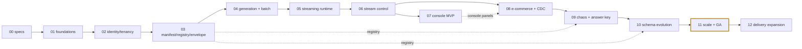

# DataForge — Implementation Phase Index

**Deliverable:** D18 (phase-level expansion of [../incremental-roadmap.md](../incremental-roadmap.md))

This directory contains one document per implementation phase, 00–12. Each phase doc is the binding work order for its increment: its **Exit criteria** section is the source text that the per-phase CI gate table in [../../06-quality/testing-strategy.md](../../06-quality/testing-strategy.md) §14 proves, and its **Demo script** is what a reviewer executes at the phase's review gate. Phase sequencing rationale and the dependency audit live in [../incremental-roadmap.md](../incremental-roadmap.md); the MVP cut line (Phases 0–11 = MVP, GA tag at Phase 11) lives in [../mvp-vs-future.md](../mvp-vs-future.md). This README owns three things: the phase index, the per-phase document template, and the review-gate convention.

---

## 1. Phase index

| # | Phase doc | Goal (one line) | Depends on | Status |
|---|---|---|---|---|
| 00 | [phase-00-specs.md](phase-00-specs.md) | All 20 design deliverables authored and approved; one-way-door contracts locked before any code | — | in progress |
| 01 | [phase-01-foundations.md](phase-01-foundations.md) | Booting, CI-verified monorepo with the final nine-service topology (Kafka included); deployment de-risked | 00 | not started |
| 02 | [phase-02-identity-tenancy.md](phase-02-identity-tenancy.md) | Tenant boundary real and provably leak-proof before any domain feature exists | 01 | not started |
| 03 | [phase-03-manifest-registry-envelope.md](phase-03-manifest-registry-envelope.md) | Manifest contract, schema registry, and envelope exist before any generation code | 02 | not started |
| 04 | [phase-04-generation-core-batch.md](phase-04-generation-core-batch.md) | First deterministic, referentially valid events from the manifest; batch JSONL datasets | 03 | not started |
| 05 | [phase-05-streaming-runtime.md](phase-05-streaming-runtime.md) | The core product loop: a continuously running, controllable stream through the final pipeline shape | 04 | not started |
| 06 | [phase-06-stream-control.md](phase-06-stream-control.md) | Pause/resume, dynamic TPS, WebSocket tail, stream stats — the streaming control plane completed | 05 | not started |
| 07 | [phase-07-console-mvp.md](phase-07-console-mvp.md) | Entire core flow usable by a non-curl human in a browser | 06 | not started |
| 08 | [phase-08-full-ecommerce-cdc.md](phase-08-full-ecommerce-cdc.md) | 8-entity simulation, first-class CDC, intensity curves, virtual clock, backfill | 06; console panels extend 07 | not started |
| 09 | [phase-09-chaos-engine.md](phase-09-chaos-engine.md) | The differentiator: all 7 chaos modes, deterministic and gradable via the answer key | 08; registry from 03 | not started |
| 10 | [phase-10-schema-evolution.md](phase-10-schema-evolution.md) | The registry as a teaching instrument: versioned schemas evolving mid-stream | 09; registry from 03 | not started |
| 11 | [phase-11-scale-hardening.md](phase-11-scale-hardening.md) | Sharded throughput with measured limits, full observability, quotas, production GA on Fly.io (**MVP GA tag**) | 10 | not started |
| 12 | [phase-12-delivery-expansion.md](phase-12-delivery-expansion.md) | External Kafka + webhooks shipped through the existing sink seam, zero generation-side changes (post-MVP) | 11 | not started |

Status values: `not started` → `in progress` → `gate review` → `complete`. The index row is updated in the gate-closing PR of each phase.

---

## 2. Per-phase document template

Every phase doc follows this structure exactly, in this order:

| # | Section | Contents |
|---|---|---|
| 1 | H1 title + `**Deliverable:** D18` line + one-paragraph purpose | What this increment is and why it sits here in the sequence |
| 2 | `## Goal` | The verbatim binding intent from the approved plan — one or two sentences, never paraphrased |
| 3 | `## Dependencies` | Which phases must be complete, and which spec documents govern the work (the phase implements those specs; it never reinterprets them) |
| 4 | `## Scope` | The approved scope bullets expanded into concrete, named work items with the exact contracts they implement |
| 5 | `## Non-goals` | What is explicitly deferred, each item naming the phase or doc where it lands instead |
| 6 | `## Tasks` | 10–20 checkbox items, each sized to one reviewable PR |
| 7 | `## Demo script` | Numbered, runnable steps (commands, `curl`, UI actions) a reviewer executes end-to-end |
| 8 | `## Exit criteria` | The binding criteria text, expanded into measurable assertions, each row naming the proving suite/test from [../../06-quality/testing-strategy.md](../../06-quality/testing-strategy.md) §14 |

---

## 3. Review-gate convention

Every phase ends with a review gate. No Phase N+1 implementation PR merges before the Phase N gate passes (documentation-only and spec-errata PRs are exempt).

**Gate checklist (all required):**

1. **Demo executed.** A reviewer who did not implement the phase runs the demo script end-to-end against a clean stack (`docker compose -f infra/compose/compose.yaml up` per [../../02-architecture/deployment-architecture.md](../../02-architecture/deployment-architecture.md) §2), plus the production URL where the phase says so (Phases 1 and 11). Every step must behave as written.
2. **Exit criteria green.** Every row of the phase's exit-criteria table passes via its named proving suite, on the lane testing-strategy §14 assigns (PR / merge / nightly / gate run). Gate-run lanes (1M-event batches, SOAK-200, LOAD-5K) are executed attended for the gate even if they also run scheduled.
3. **Permanent gates green.** All never-skippable gates accumulated so far (testing-strategy §17.3): TEN + GUARD canaries (from Phase 2), CON envelope pin (from 3), GOLD replay (from 4), strip scan (from 5).
4. **Non-goals respected.** Work items belonging to a later phase found in the diff are a review reject — small diffs are the point of the phase structure.

**Conventions:**

- **Demo seed.** Every demo script uses seed `4242` (`SEED_E2E`, testing-strategy §16.1) so demo output, docs, fixtures, and Playwright runs all show identical data.
- **Binding text.** The exit-criteria wording in each phase doc is the authoritative gate definition; testing-strategy §14 maps it to suites, never weakens it. Changing a criterion is a PR against the phase doc with reviewer sign-off, mirrored in testing-strategy.
- **Frozen contracts.** No phase may alter the five Phase-0-frozen contracts (event envelope, manifest JSON Schema v0, `DeliveryChannel` interface, registry subject naming, tenancy model). A change requires a superseding ADR per [../../adr/README.md](../../adr/README.md) — out of scope for any phase by default.
- **Phase 0 is special.** Its gate is the design **approval gate**: after the specs are committed, work stops for user review, and no application code is written before approval. Only ADR-0002/0003/0004/0005/0009/0010 are review-blocking; all other documents are reviewable asynchronously so the spec phase cannot stall.
- **"Refined in Phase N."** Specs and phase docs use this marker (never TODO/TBD) for sections whose contract is decided now but whose full mechanics land later; the marker always states what exists today.
