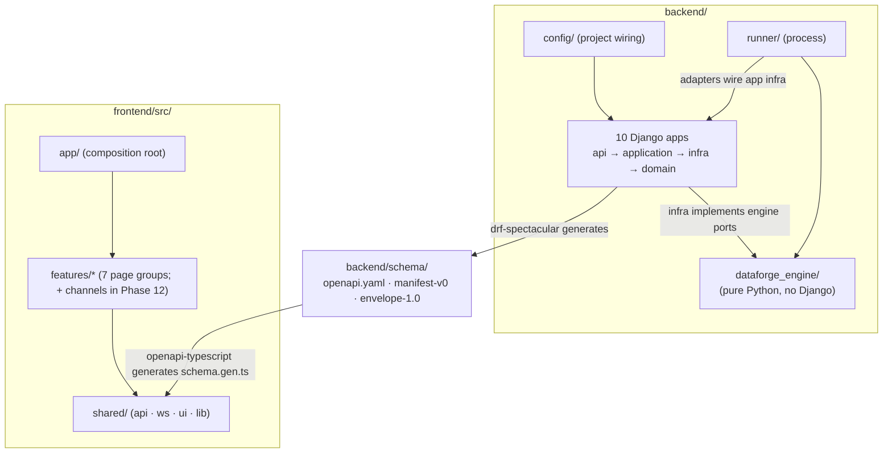

# DataForge — Project Folder Structure

**Deliverable:** D19

This document fixes the monorepo tree down to the Django-app and React-feature-folder level. It is the layout authority of ADR-0001: the Phase 1 scaffold must match it exactly (a folder-lint script compares the repo against this document — Phase 1 exit criterion, [../06-quality/testing-strategy.md](../06-quality/testing-strategy.md) §14), and later phases may only add the entries marked with their phase number in §6. The *shape* of each area is owned by its architecture doc — `backend/` by [../02-architecture/backend-architecture.md](../02-architecture/backend-architecture.md) §2, `frontend/` by [../02-architecture/frontend-architecture.md](../02-architecture/frontend-architecture.md) §2, `infra/` contents by [../02-architecture/deployment-architecture.md](../02-architecture/deployment-architecture.md) — this document assembles them into the single committed tree and records the paths other specs cite.

---

## 1. Repository root

```
dataforge/
  backend/                      # Django monolith + framework-free engine + runner (§2)
  frontend/                     # Vite + React + TS console SPA (§3)
  infra/                        # compose, Fly.io, CI scripts, load tests, runbooks (§4)
  specs/                        # the 20 design deliverables, ADRs, phase docs (§5)
  .github/
    workflows/
      ci.yml                    # path-filtered PR pipeline: stages 1-6 of deployment-architecture §7
      deploy.yml                # staging deploy on main; prod deploy on tag + manual approval
  .gitignore                    # excludes infra/compose/.env, node_modules, dist, .venv, *.pyc
  .pre-commit-config.yaml       # ruff, ruff-format, eslint, prettier, gitleaks — parity with CI stage 1
  pnpm-workspace.yaml           # pnpm 9 workspace root (frontend is the only JS package)
  Makefile                      # dev-shortcut targets (e.g. golden-regen, property-nightly)
  README.md                     # quickstart: docker compose up from infra/compose/, link to specs/README.md
```

Top-level rules (ADR-0001):

| # | Rule |
|---|---|
| FS-1 | Exactly four top-level code/content directories: `backend/`, `frontend/`, `infra/`, `specs/`. Adding a fifth requires a superseding ADR referencing ADR-0001. |
| FS-2 | CI workflow *definitions* live in `.github/workflows/` (a GitHub requirement); CI *scripts and data* they invoke live in `infra/ci/` so they are testable and reviewable as ordinary files. |
| FS-3 | The committed contract artifacts (`backend/schema/*`) evolve in the same PR as the code that changes them — the drift jobs in CI stage 3 enforce this (ADR-0014). |

---

## 2. `backend/`

Shape fixed by [../02-architecture/backend-architecture.md](../02-architecture/backend-architecture.md) §2.1; bounded-context app names fixed by [../03-domain/domain-model.md](../03-domain/domain-model.md) §1.3. Three kinds of Python live here and never blur: the Django **project** (`config/`), the framework-free **engine** (`dataforge_engine/`, zero Django imports — import-linter contract), and the data-plane **runner** (`runner/`, a process, not a Django app), alongside the ten Django **apps**.

```
backend/
  manage.py                     # Django entrypoint; management commands live in their owning apps
  pyproject.toml                # deps (uv-managed) + ruff, mypy --strict, pytest, import-linter contracts
  Dockerfile                    # multi-target: base / deps / dev / runtime (deployment-architecture §8.1)
  config/                       # the Django project — wiring only, no business code
    __init__.py                 # exposes the Celery app for autodiscovery
    settings/
      base.py                   # everything shared; env-driven (12-factor)
      dev.py                    # Mailpit SMTP email, relaxed CORS, DEBUG
      prod.py                   # security headers; required-env manifest validated at boot
      test.py                   # test DB, eager-task, compressed lease/TTL values
    urls.py                     # mounts per-app /api/v1 routers + /healthz /readyz
    wsgi.py                     # gunicorn target for the web process group
    asgi.py                     # uvicorn target for the ws process group (Channels routing)
    celery.py                   # Celery app: queues control/lifecycle/validation/exports/maintenance
  dataforge_engine/             # pure Python, NO Django imports (backend-architecture §4; CI-enforced)
    envelope/                   # InternalEnvelope, canonical serializer, deterministic UUIDv7, strip_internal, partition-key derivation
    manifest/                   # hardened parse, L1 JSON Schema + L2 semantic validation, ManifestIR compiler, overlay merge
    behavior/                   # state-machine interpreter, entity pools, intensity curves, virtual clock, checkpoint codec
    chaos/                      # stage framework (normative order), 7 mode implementations, late-arrival scheduling
    seeds/                      # derive_subseed (HMAC), namespaced PRNG streams (ADR-0008)
    ports.py                    # Protocol interfaces: LedgerSink, EventPublisher, CheckpointStore, PoolStore, InjectionSink, LateBufferStore, StatsEmitter
    pipeline.py                 # ShardPipeline: behavior → ledger → chaos → publish for one shard tick (ADR-0009 as code)
  runner/                       # data-plane process: python -m runner (backend-architecture §8)
    __main__.py                 # entrypoint; --role generation|sinks|all; health listener on :8081
    supervisor.py               # asyncio supervisor for shard workers + sink consumers
    shard_worker.py             # the reconciliation tick: poll desired state, generate, append, transform, publish
    leases.py                   # Redis lease acquire/heartbeat/fencing-token logic
    sinks/                      # buffer-writer + ws-pusher Kafka consumer-group members (DeliveryChannel impls)
    adapters/                   # wiring of engine ports to app infra adapters at boot
  identity/                     # Identity context: User (AUTH_USER_MODEL), verification/reset tokens (§2.1 skeleton)
  tenancy/                      # Tenancy context: Workspace, Membership, ApiKey, QuotaPolicy; middleware + scoped-manager chokepoint
  catalog/                      # Scenario Catalog: Scenario, ManifestVersion, ScenarioInstance; manifest validation surface
    builtin/
      ecommerce/
        1.0.0.yaml              # the reference manifest as data — the ONLY place e-commerce exists (P-1 grep guard)
  registry/                     # Schema Registry: Subject, SchemaVersion, BACKWARD_ADDITIVE enforcement, read API
  streams/                      # Stream Control: Stream, Shard, desired state, lifecycle commands
  generation/                   # Generation: ledger partitions, pool snapshots, Checkpoint; batch/backfill endpoints
  chaos/                        # Chaos: InjectionRecord, LateArrivalBuffer; answer-key endpoints (ADR-0017)
  delivery/                     # Delivery: EventBuffer, SinkBinding; events cursor endpoint; WS consumer; Kafka producer adapter
  observation/                  # Observation: stats API, /healthz /readyz, RequestIdMiddleware, RFC 9457 exception handler
  audit/                        # Audit: AuditEntry append-only model + admin query API
  schema/                       # committed contract artifacts — the ADR-0001 lockstep set (CI stage 3 drift gates)
    openapi.yaml                # drf-spectacular output; consumed by frontend codegen (frontend-architecture §5.1)
    manifest-v0.schema.json     # manifest grammar v0 (scenario-plugin-architecture §9.1); committed Phase 3
    envelope-1.0.schema.json    # envelope 1.0 JSON Schema (event-model §1); committed Phase 3
  tests/                        # cross-app suites (testing-strategy §3); app-local tests live in <app>/tests/
    tenancy/                    # cross-tenant attack suite (TEN) — permanent CI gate from Phase 2
    contract/                   # envelope field-set pin, schema_ref resolution, OpenAPI conformance (CON)
    golden/                     # golden-seed fixtures: {scenario_slug}/{manifest_version}/{fixture_name}/{meta.json,events.jsonl.gz}
    statistical/                # funnel/curve/chaos-rate tolerance suites (STAT)
    chaos/                      # chaos determinism + lifecycle suites (CHD) — Phase 9
    cdc/                        # CDC consistency suites (CDC-1..8) — Phase 8
    ops/                        # scripted demos, kill-tests, soak harness drivers (OPS)
    guards/                     # planted-unscoped-model test, zero-ecommerce grep, strip-boundary scan (GUARD)
```

### 2.1 Canonical Django-app skeleton

Every one of the ten apps follows this internal layout (layering and import rules per [../02-architecture/backend-architecture.md](../02-architecture/backend-architecture.md) §3; shown here expanded once, for `streams/`):

```
streams/
  apps.py                       # AppConfig; system checks register here (tenancy registers E001-E004)
  api/
    viewsets.py                 # DRF viewsets — subclass WorkspaceScopedViewSet (tenancy.api.viewsets)
    serializers.py              # the only payload boundary; explicit fields, never __all__
    urls.py                     # app router, mounted by config/urls.py under /api/v1
  tasks/                        # Celery entrypoints (control-plane apps only): thin, call one service
    lifecycle.py                # e.g. start watchdog (T4), failover-exhaustion tracker (T11)
  application/
    services.py                 # use-case services; own transaction.atomic; emit audit entries (INV-AUD-2)
  domain/
    models.py                   # models with explicit Meta.db_table (BE-APP-1); WorkspaceScopedModel subclasses
    lifecycle.py                # transition catalog guards (domain-model §4.3)
  infra/                        # adapters: Redis/Kafka/email clients, engine-port implementations
  migrations/                   # Django migrations; N-1-compatible policy (deployment-architecture §10)
  tests/                        # app-local unit + property tests (testing-strategy §3)
```

Per-app variations (everything not listed is exactly the skeleton above):

| App | Has `tasks/` | Notable extra paths |
|---|---|---|
| `identity` | yes (email sends) | `api/auth.py` — `JWTAuthentication` class |
| `tenancy` | yes (deletion cascades) | `api/middleware.py` (WorkspaceContextMiddleware), `api/viewsets.py` (WorkspaceScopedViewSet base), `api/auth.py` (ApiKeyAuthentication), `domain/scoping.py` (scoped managers, contextvar) |
| `catalog` | yes (L3 dry-run job) | `builtin/{slug}/{version}.yaml` manifests; `management/commands/sync_builtin_scenarios.py` |
| `registry` | no | `management/commands/` — schema derivation tooling |
| `streams` | yes (lifecycle watchdogs) | as expanded above |
| `generation` | yes (large batch jobs) | `infra/` implements `LedgerSink`, `CheckpointStore`, `PoolStore` |
| `chaos` | no | `infra/` implements `InjectionSink`, `LateBufferStore` |
| `delivery` | no | `api/consumers.py` (Channels `StreamEventsConsumer`), `infra/` implements `EventPublisher`; `management/commands/provision_kafka_topics.py` |
| `observation` | yes (idle-detection signal) | `api/middleware.py` (RequestIdMiddleware), `api/problem_details.py` (exception handler), `api/health.py` (`/healthz`, `/readyz`) |
| `audit` | no | — |

A `hooks/` directory inside an app (`<app>/hooks/`) is the reserved location for registered value-generation hooks ([../04-engines/scenario-plugin-architecture.md](../04-engines/scenario-plugin-architecture.md) §4.6); no hooks exist in the MVP (they are banned in the reference scenario), so the directory appears only when the first platform hook ships.

---

## 3. `frontend/`

Shape fixed by [../02-architecture/frontend-architecture.md](../02-architecture/frontend-architecture.md) §2.1; import boundaries IMP-1…IMP-5 are CI-enforced via `eslint-plugin-boundaries`.

```
frontend/
  package.json                  # scripts: dev, build, typecheck, lint, test, test:e2e, gen:api, gen:api:check
  pnpm-lock.yaml                # pnpm 9 lockfile
  tsconfig.json                 # strict: true — generated types make contract drift a compile error
  vite.config.ts                # dev proxy: /api and /ws → compose stack; build budgets plugin
  index.html                    # boot splash + root div (blank-shell mitigation, ADR-0016)
  Dockerfile                    # multi-target: deps / dev / build (deployment-architecture §8.2; no prod container)
  e2e/                          # Playwright suites vs the compose stack
    core-loop.spec.ts           # the Phase 7 exit-criterion E2E (@core-loop)
    live-tail.spec.ts           # tail at 100+ TPS render-safety checks
    stream-control.spec.ts      # lifecycle button-matrix + quota-state flows
  src/
    app/                        # composition root — the only layer that sees everything (IMP-2)
      main.tsx                  # createRoot; mounts providers
      providers.tsx             # QueryClientProvider, ToastProvider, ConfirmProvider
      router.tsx                # createBrowserRouter: the full route table (frontend-architecture §3)
      theme.css                 # Tailwind v4 @theme design tokens
      guards/                   # RequireAuth, PublicOnly, RequireWorkspace, RequireAdmin
      layouts/                  # AuthLayout, WorkspaceLayout (TopBar, SideNav, Outlet)
    features/                   # one folder per page group; never imports another feature (IMP-1)
      auth/                     # page group 1: login, signup, verify-email, password reset
      dashboard/                # page group 2: workspace summary, stream-stats cards, getting-started
      workspaces/               # page group 3: settings, members, activity, danger zone
      scenarios/                # page group 4: catalog, instance config (overlay editor), registry browser (Phase 10)
      streams/                  # page group 5: list, create, control panel; chaos + answer-key tabs (Phase 9)
      apikeys/                  # page group 6: keys table, create + reveal-once dialog, quickstart snippet
      monitoring/               # page group 7: overview table, live tail, per-type counters
      channels/                 # Phase 12 ONLY: external Kafka/webhook sink config — folder materializes in Phase 12 (§6), absent before then
    shared/
      api/                      # client.ts (openapi-fetch + auth middleware — the only fetch site, IMP-4),
                                #   schema.gen.ts (generated, never hand-edited, IMP-5), types.ts,
                                #   queryKeys.ts (the single key factory), problem.ts (RFC 9457), token.ts (TokenManager)
      ws/                       # socket.ts (TailSocket — the only WebSocket site), useStreamTail.ts, frames.ts
      ui/                       # Button, StatusBadge, Sparkline, DataTable, EmptyState, Skeleton, CopyField,
                                #   JsonViewer, PageHeader, Slider, QuotaMeter (Phase 11), CodeSnippet, …
      lib/                      # formatBytes, formatTps, relativeTime, useDebouncedCallback, …
      testing/                  # renderWithProviders, MSW handlers (typed vs schema.gen.ts), FakeTailSocket
```

Each feature folder repeats the same internal convention — `pages/` (lazy route components), `components/` (feature-private), `api.ts` (queryOptions factories + mutation hooks), `routes.tsx` (RouteObject[] export), `index.ts` (the feature's public surface).

---

## 4. `infra/`

Contents owned by [../02-architecture/deployment-architecture.md](../02-architecture/deployment-architecture.md); test tooling placement by [../06-quality/testing-strategy.md](../06-quality/testing-strategy.md) §3.

```
infra/
  compose/
    compose.yaml                # the dev stack: nine platform services (postgres, redis, kafka, api, ws, worker, runner, buffer-writer, web) + dev-only mailpit
    .env.example                # committed template; seeds the gitignored infra/compose/.env (secrets rule S-1)
  fly/
    fly.toml                    # Fly app "dataforge": web/ws/worker/runner process groups, release command
    fly.kafka.toml              # Fly app "dataforge-kafka": single KRaft broker, volume, no public IP
  ci/                           # scripts + data invoked by .github/workflows (FS-2)
    folder_lint.py              # compares the repo tree against THIS document — Phase 1 exit criterion
    gen_import_contracts.py     # generates the per-app-pair import-linter forbidden contracts (backend-architecture §3.2)
    unscoped_allowlist.txt      # justified use sites of the `unscoped` manager escape hatch (tenancy.E004)
    post_deploy_smoke.sh        # readyz + core-flow API walkthrough vs a deployed URL (staging/prod gates)
  loadtest/
    k6/                         # k6 scenarios: cursor pollers, WS tails, control-plane churn (LOAD-5K, Phase 11)
    soak/                       # soak harness + independent consumer-side tally (SOAK-200, Phase 6)
  runbooks/                     # Phase 11: one runbook per alert name (observability §9); deploy/rollback (RB-*)
```

---

## 5. `specs/`

The design corpus this document belongs to; the D1–D20 map, reading order, and status table live in `specs/README.md`.

```
specs/
  README.md                     # index: D1-D20 → file map, doc status table, glossary pointer
  01-product/prd.md             # [D1]
  02-architecture/              # [D2] system, [D12] backend, [D11] frontend, [D13] deployment, [D15] scaling, observability
  03-domain/                    # [D3] domain model, [D4] database schema, [D5] event model
  04-engines/                   # [D6] plugin architecture, [D7] behavior, [D8] chaos, [D9] registry, delivery-channels, scenarios/ecommerce.md
  05-interfaces/api-specification.md   # [D10]
  06-quality/                   # [D14] security, [D16] testing
  07-plan/                      # [D18] this roadmap set, [D19] this document, [D20] mvp-vs-future, phases/ (13 docs)
  adr/                          # [D17] README index + adr-0001 … adr-0017
```

---

## 6. Phase materialization

The tree above is the **complete** end-state through Phase 12. The scaffold lands in Phase 1; later entries appear exactly when their phase ships. The folder-lint script knows this table and asserts presence/absence per phase.

| Path | Appears in phase |
|---|---|
| Everything in §1–§4 not listed below (scaffold: all apps as empty skeletons, engine/runner packages with stubs, compose, fly, ci, workflows) | 1 |
| `backend/schema/openapi.yaml` | 1 (OpenAPI CI artifact job) |
| `backend/tests/tenancy/`, `backend/tests/guards/` | 2 |
| `backend/catalog/builtin/ecommerce/1.0.0.yaml` (subset manifest), `backend/schema/manifest-v0.schema.json`, `backend/schema/envelope-1.0.schema.json`, `backend/tests/contract/` | 3 |
| `backend/tests/golden/`, `backend/tests/statistical/`, `backend/tests/ops/` | 4 |
| `frontend/e2e/core-loop.spec.ts` (+ feature folders filled) | 7 |
| Full 8-entity manifest version under `catalog/builtin/ecommerce/`, `backend/tests/cdc/` | 8 |
| `backend/tests/chaos/`; `streams` chaos/answer-key console tabs | 9 |
| `frontend/src/features/scenarios/` registry-browser pages | 10 |
| `infra/runbooks/`, `infra/loadtest/k6/` full suite, `QuotaMeter` | 11 |
| `frontend/src/features/channels/` (folder + routes, per frontend-architecture §2.1) + external-sink adapters in `runner/sinks/` | 12 |

---

## 7. Boundary map

The tree encodes the dependency rules; this is the picture the import-linter and eslint-boundaries contracts enforce (arrows = "may import / may call"):



| Forbidden (CI-failing) | Enforced by |
|---|---|
| `dataforge_engine` importing Django, DRF, Celery, Channels, redis, confluent_kafka, psycopg, or any app | import-linter contract 2 (backend-architecture §3.2) |
| Any app importing another app's `infra/` or `api/` | import-linter contract 3 (generated per app pair) |
| A feature importing another feature or `app/`; `shared/` importing features | `eslint-plugin-boundaries` IMP-1…IMP-3 |
| `fetch`/`WebSocket` outside `shared/api/client.ts` / `shared/ws/socket.ts` | IMP-4 lint rule |
| A scenario named in Python (`grep -r ecommerce backend/ --include='*.py'` beyond the builtin YAML path) | GUARD grep, permanent from Phase 3 |
| Tree drift from this document | `infra/ci/folder_lint.py`, merge gate from Phase 1 |

---

## 8. Ownership boundaries

| Concern | Owner |
|---|---|
| Backend layering semantics, app responsibilities, engine package contents | [../02-architecture/backend-architecture.md](../02-architecture/backend-architecture.md) |
| Frontend feature contents, routing, import rules | [../02-architecture/frontend-architecture.md](../02-architecture/frontend-architecture.md) |
| Compose service definitions, fly.toml contents, Dockerfile targets, CI stage composition | [../02-architecture/deployment-architecture.md](../02-architecture/deployment-architecture.md) |
| Test-suite contents per directory | [../06-quality/testing-strategy.md](../06-quality/testing-strategy.md) |
| Manifest grammar inside `manifest-v0.schema.json`; builtin manifest format | [../04-engines/scenario-plugin-architecture.md](../04-engines/scenario-plugin-architecture.md) |
| Envelope contract inside `envelope-1.0.schema.json` | [../03-domain/event-model.md](../03-domain/event-model.md) |
| When each path appears | [incremental-roadmap.md](incremental-roadmap.md) + the phase docs |
