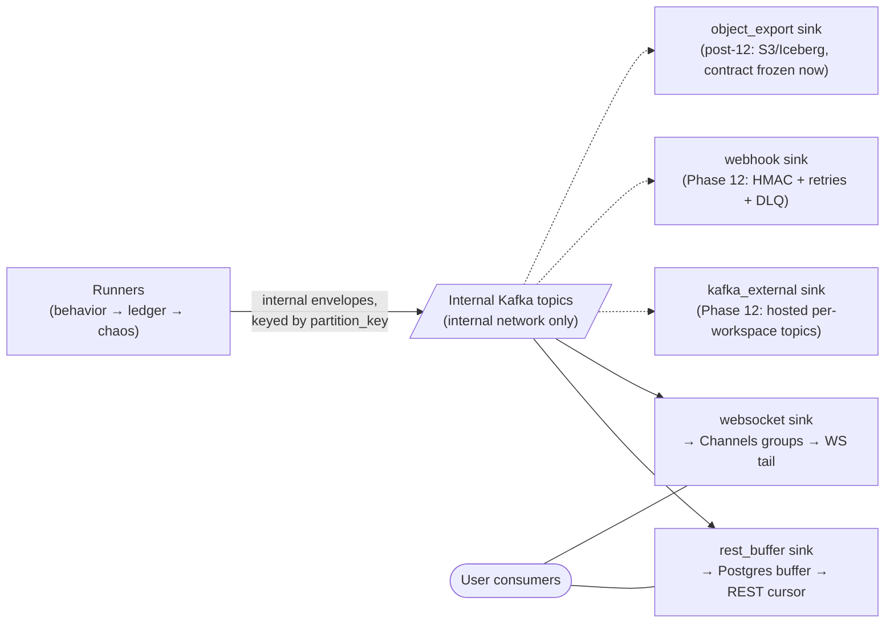

# ADR-0005 — Internal Kafka backbone from day one; all delivery channels are consumer adapters

**Deliverable:** D17

DataForge's data plane is built on an internal Kafka backbone from its first streaming event: runners publish canonical envelopes to internal topics, and every delivery channel — present and future — is a Kafka consumer behind one `DeliveryChannel` interface. This is a one-way door because the alternative ("start simpler, swap the substrate later") is precisely the rework the requirements forbid: a transport swap after channels exist invalidates every ordering, replay, and backpressure assumption the channels were built on.

- **Status:** Accepted — review-blocking (one-way door)
- **Date:** 2026-06-10
- **Decides for:** the data-plane transport topology; the sink seam every delivery channel implements; dev stack composition from Phase 1; event flow from Phase 5

## Context

The forces:

- **Kafka is mandated** in the tech stack ("Kafka (streaming backbone)"), and the NFRs demand horizontal scaling from 1 to 100,000 TPS with an MVP that "can be modest but architecture must horizontally scale."
- **Channel expansion is the roadmap.** Phase 1 of delivery is REST + WebSocket; Phase 2 adds hosted per-workspace Kafka and webhooks; Phase 3 adds S3/Iceberg/CDC export. Each new channel must arrive "behind an abstraction layer" with zero generation-side change — the Phase 12 exit criterion is literally that the diff is confined to delivery adapters and config.
- **The consumption-model boundary (user-confirmed, binding):** users never touch DataForge's internal Kafka. MVP consumption is hosted REST/WS over the internet with an API key; bridging into the user's own Kafka is their exercise. Post-MVP, users consume DataForge-*hosted per-workspace* topics with SASL/ACL credentials — a separate sink, not an exposure of internal topics. This boundary is stated in [../02-architecture/system-architecture.md](../02-architecture/system-architecture.md) and [../04-engines/delivery-channels.md](../04-engines/delivery-channels.md).
- **Fan-out with isolation:** the same post-chaos stream must feed N sinks at independent paces (a slow webhook must not stall the WS tail) — exactly the consumer-group model.
- **The honest counter-force:** Kafka is operational weight for a small MVP (P2's position). The answer must address the burden without deferring the backbone.

## Decision

1. **Runners publish internal envelopes to internal Kafka topics**, keyed by `partition_key` — workspace-prefixed per ADR-0002, giving per-key FIFO ordering and broker-level tenant attribution. Topic naming, partition counts, and retention are owned by [../02-architecture/backend-architecture.md](../02-architecture/backend-architecture.md); per-workspace topic/partition budgeting (the panel's resource-budgeting gap) is resolved there and in [../02-architecture/scaling-strategy.md](../02-architecture/scaling-strategy.md).
2. **Every delivery channel is a consumer adapter** implementing the `DeliveryChannel` interface — `deliver(batch)`, cursor/ack semantics, and a backpressure signal ([../04-engines/delivery-channels.md](../04-engines/delivery-channels.md) owns the contract). MVP sinks: the REST buffer-writer (→ time-partitioned Postgres buffer, ADR-0013) and the WS pusher. Phase 12+: external per-workspace Kafka, HMAC webhooks, S3/Iceberg/CDC export — same seam, contract-level specs frozen now so the interface cannot silently become REST/WS-shaped.
3. **Kafka is in Docker Compose from Phase 1** (single-node KRaft) and carries events from Phase 5. **There is never an interim transport or substrate swap** — the pipeline shape that exists at Phase 5 is the final shape; later phases add consumers and capacity, never re-plumbing.
4. **Internal topics are internal-only.** No user credential can reach them; in production the broker listens on the private network only. Users consume through sinks exclusively (INV-DEL-1, INV-STR-4).
5. **Operational posture:** dev and MVP production run a single-broker KRaft instance (on a Fly volume, internal network — ADR-0015), with a **pre-committed migration trigger** to managed Kafka: the external Kafka channel ships, OR sustained aggregate TPS exceeds ~5k, OR the availability SLO is breached by broker incidents. Broker endpoints are configuration, so executing the trigger is an infra-only change.

Solid edges exist in MVP; dashed sinks arrive later through the identical seam. Users sit strictly to the right of sinks — never on the topic edge.

## Alternatives considered

- **Build the skeleton on Celery ticks + Postgres/Redis; introduce Kafka at a later phase** — panel position P2, motivated by Kafka's ops burden at MVP scale. Rejected per the resolved disagreement: Kafka is mandated as the backbone, and the deferred swap is exactly the rework the requirements forbid; P2's own risk register — "if interfaces leak Celery assumptions, Phase 9 becomes a rewrite" — argues against itself. P2's legitimate concern is answered by the single-broker KRaft posture and the pre-committed migration trigger, not by deferring the backbone. P1/P3's day-one position won.
- **Redis Streams as the backbone.** Redis is already in the stack, so the marginal ops cost is near zero. Rejected: no per-key partitioning semantics comparable to Kafka's at the 100k-TPS target; memory-bound retention conflicts with multi-consumer replay; the consumer-group ecosystem users learn against (and the Phase-12 hosted-topics product) is Kafka's, so a Redis interim would still end in the forbidden swap. Redis keeps the jobs it is good at: leases, hot pool state, revocation cache, channel layer, counters.
- **Direct fan-out from runners** (runner writes the Postgres buffer and pushes WS frames itself; add code per channel). Rejected: couples generation throughput to the slowest channel; every new channel modifies runner code, violating the seam requirement; no replay or decoupling between producer and sinks; backpressure becomes a generation problem instead of a per-sink one.
- **Postgres as the queue** (buffer table + `LISTEN/NOTIFY`). Rejected: write amplification at target TPS makes Postgres the bottleneck for *all* channels rather than just the REST materialization; ordering and multi-consumer fan-out are poor fits. The Postgres buffer remains — downstream of the backbone, as one sink's materialization (ADR-0013).

## Consequences

### Positive

- The final topology exists from Phase 1; no later phase changes the data-plane shape — eliminating the largest rework risk among the panel proposals.
- Adding a channel is implementing one interface and a consumer group: the Phase-12 exit criterion ("zero changes in behavior/chaos/runner code") is structurally enforced.
- Per-key ordering, replayable fan-out, independent sink pacing, and broker-inspectable tenancy come from one mechanism.

### Negative

- The dev stack is heavier from day one (compose includes Kafka); accepted, and bounded by single-node KRaft.
- A single broker is an honest availability liability in MVP — a broker outage halts delivery (not generation truth: the ledger is upstream). [../02-architecture/deployment-architecture.md](../02-architecture/deployment-architecture.md) and [../02-architecture/observability.md](../02-architecture/observability.md) own the explicit SLO framing; the migration trigger is the committed remedy.
- Tenant-level Kafka resource budgeting (topics vs shared topics, partition budget per workspace, concurrent-stream limits) must be designed deliberately — flagged from the gap list, owned by [../02-architecture/backend-architecture.md](../02-architecture/backend-architecture.md) with quota linkage to PRD §7.

### Follow-ups

- [../04-engines/delivery-channels.md](../04-engines/delivery-channels.md): the `DeliveryChannel` contract plus frozen contract-level specs for external Kafka, webhooks, and S3/Iceberg (file/commit semantics) so the seam is proven against non-REST shapes on paper now.
- [../02-architecture/backend-architecture.md](../02-architecture/backend-architecture.md): topic layout, partition counts, consumer-group naming, retention.
- ADR-0015 / Phase 12: executing the managed-Kafka migration trigger; cross-channel contract tests as the seam's permanent proof.
